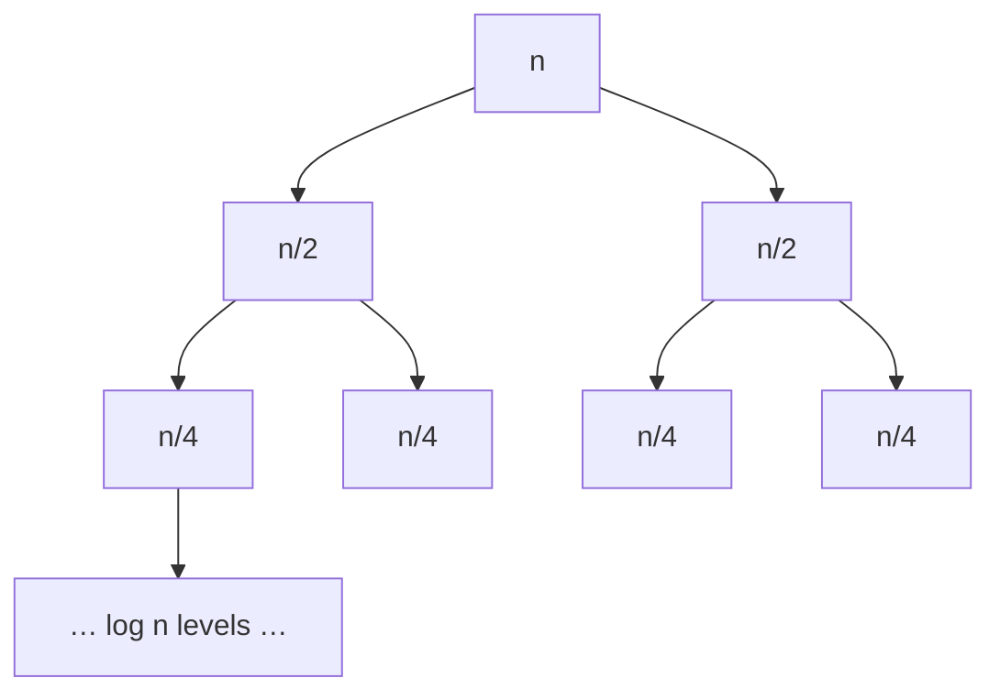

# S01E01 · Time Complexity & Merge Sort

> **Source:** Pavel Mavrin, [_A&DS S01E01_](https://youtu.be/oWgLjhM-6XE) · 1h41m lecture → ~12 min read.
> Every section deep-links back to the exact moment on the board.

## TL;DR

- An **algorithm** turns input data into output data; we measure it by the **number of primitive operations** on the **RAM model** (unit-cost array access + arithmetic).
- **Asymptotic notation** hides constants and lower-order terms: $O$ = "grows no faster than", $\Omega$ = "grows no slower than", $\Theta$ = both.
- A loop that **multiplies** a counter (`i *= 2`) runs $\Theta(\log n)$ times; a routine that **recurses on halves** builds a tree of height $\log n$.
- **Insertion sort** is $O(n^2)$ worst case, $O(n)$ on already-sorted input, in-place and stable.
- **Merge sort** obeys $T(n) = 2\,T(n/2) + \Theta(n)$, which the recurrence tree collapses to $\Theta(n \log n)$ — the headline result of the lecture.

---

## What is an algorithm?
- An algorithm is a black box: **input data → [Alg] → output data**. To reason about cost we must fix (a) what an operation costs and (b) what the input size $n$ means.
- **Running example** used all lecture: sum an array.
  - Input: `a[0..n-1]`. Output: $\sum_i a[i]$.


- **Computational model = RAM (Random Access Machine).** Memory is one big array `0 … m-1`; reading or writing `a[i]` for any index `i` costs **one** unit, as do `+`, `−`, `×`, comparison. This unit-cost assumption is what makes "count the operations" meaningful.

[watch from 2:36](https://youtu.be/oWgLjhM-6XE?t=156)

---

## Counting operations
The sum program, annotated with how many times each line runs:

```text
                      # times executed
s = 0                 # 1
for i in 0 .. n-1:    # n      (loop control)
    s = s + a[i]      # n      (body)
print(s)              # 1
```

- Total: $T(n) = 1 + n + n + 1 = 2 + 2n$ (the board writes it as $2 + 5n$ once every micro-op — increment, compare, index, add, store — is counted; the exact constant depends on how finely you count).
- **Key point:** the constant is model-dependent and uninteresting. What matters is that $T(n)$ is **linear** in $n$. That is exactly what asymptotic notation is built to express.


[watch from 12:36](https://youtu.be/oWgLjhM-6XE?t=756)

---

## Asymptotic notation: O, Ω, Θ
The formal definitions (the heart of the lecture — memorize these):

$$
f(n) = O\big(g(n)\big) \iff \exists\, n_0, c > 0 : \forall\, n \ge n_0,\quad f(n) \le c \cdot g(n)
$$

$$
f(n) = \Omega\big(g(n)\big) \iff \exists\, n_0, c > 0 : \forall\, n \ge n_0,\quad f(n) \ge c \cdot g(n)
$$

$$
f(n) = \Theta\big(g(n)\big) \iff f(n) = O\big(g(n)\big) \ \text{and}\ f(n) = \Omega\big(g(n)\big)
$$

- **Intuition:** $O$ means "**not slower** than $g$"; $\Omega$ means "**not faster** than $g$"; $\Theta$ means "**same growth** as $g$".
- **Worked example** $2 + 5n = O(n)$: pick $n_0 = 1,\ c = 6$. Then for all $n \ge 1$, $2 + 5n \le 6n$. ✓
- The same $f$ can sit inside a looser bound: $2 + 5n = O(n^2)$ is also true (with $n_0 = 1, c = 1$), just not **tight**. $\Theta$ is the tight one.


- **Watch out:** "$f = O(g)$" is a set-membership statement written with an equals sign by tradition. $O(g)$ is the *set* of functions bounded above by $c\cdot g$; the "$=$" reads "is in".

[watch from 22:20](https://youtu.be/oWgLjhM-6XE?t=1340)

---

## Logarithms and recursion trees
Two counting patterns produce a $\log n$ that you must recognize on sight.

**1. Multiplicative loop → $\Theta(\log n)$:**

```text
i = 1
while i < n:
    i = i * 2      # after k iterations, i = 2^k
```

- The loop stops when $2^k \ge n$, i.e. $k \ge \log_2 n$. So it runs $\lceil \log_2 n \rceil$ times $= \Theta(\log n)$.

**2. Recurse on halves → tree of height $\log n$:**

```text
def f(n):
    if n == 0: return
    do O(n) work here
    f(n / 2)
    f(n / 2)
```

- Each call does $O(n)$ local work and spawns two calls of half the size. The recursion tree has height $\log_2 n$; level $\ell$ has $2^\ell$ nodes each doing $O(n/2^\ell)$ work, so **every level sums to $O(n)$** and the total is $O(n \log n)$.


[watch from 34:00](https://youtu.be/oWgLjhM-6XE?t=2040)

---

## Sorting, part 1: insertion sort
- **Problem.** Input `a[0..n-1]`; output the same multiset in non-decreasing order (a *general* comparison sort — no assumptions on the values).
- **Idea.** Keep the prefix `a[0..i]` sorted; insert `a[i]` leftward by swapping until it lands.

```cpp
void insertion_sort(vector<int>& a) {
    for (int i = 0; i < (int)a.size(); i++) {
        int j = i;
        while (j > 0 && a[j] < a[j - 1]) {
            swap(a[j], a[j - 1]);          // swap left
            j--;
        }
        // invariant: a[0..i] is now sorted
    }
}
```

- **Best case** (already sorted `1,2,3,…,n`): the `while` never fires → $O(n)$.
- **Worst case** (reverse sorted `n,n-1,…,1`): element $i$ moves $i$ steps → $\sum i = \Theta(n^2)$.
- **Properties:** in-place ($O(1)$ extra), **stable** (equal keys keep order), great on nearly-sorted data.


[watch from 58:21](https://youtu.be/oWgLjhM-6XE?t=3501)

---

## Sorting, part 2: merge sort
**Merge** two already-sorted arrays into one, with a two-pointer scan:

```cpp
vector<int> merge_sorted(const vector<int>& b, const vector<int>& c) {
    vector<int> res;
    res.reserve(b.size() + c.size());
    size_t i = 0, j = 0;
    while (i < b.size() && j < c.size()) {
        if (b[i] <= c[j]) res.push_back(b[i++]);   // <= keeps the sort STABLE
        else              res.push_back(c[j++]);
    }
    while (i < b.size()) res.push_back(b[i++]);     // drain the leftovers
    while (j < c.size()) res.push_back(c[j++]);
    return res;                                     // O(|b| + |c|)
}
```

**Sort** by divide-and-conquer:

```cpp
vector<int> merge_sort(vector<int> a) {
    if (a.size() <= 1) return a;                    // base case
    size_t mid = a.size() / 2;
    vector<int> b(a.begin(), a.begin() + mid);      // left half   → T(n/2)
    vector<int> c(a.begin() + mid, a.end());        // right half  → T(n/2)
    return merge_sorted(merge_sort(b), merge_sort(c));   // merge → O(n)
}
```

- **Recurrence:** $T(n) = 2\,T(n/2) + \Theta(n)$, with $T(1) = \Theta(1)$.



- **Proof that $T(n) = \Theta(n\log n)$ (recurrence tree).** At depth $\ell$ there are $2^\ell$ subproblems each of size $n/2^\ell$, contributing $2^\ell \cdot \Theta(n/2^\ell) = \Theta(n)$ merge work. There are $\log_2 n + 1$ levels. Summing: $\Theta(n) \cdot (\log_2 n + 1) = \Theta(n \log n)$.
- **Master-theorem view.** $T(n) = a\,T(n/b) + f(n)$ with $a = 2,\ b = 2,\ f(n) = \Theta(n)$. Since $n^{\log_b a} = n^{1} = f(n)$, we are in the balanced case → $T(n) = \Theta(n \log n)$.


- **Merge sort vs insertion sort:** merge sort is $\Theta(n\log n)$ *always* but needs $O(n)$ extra space and is not in-place; insertion sort wins only on tiny or nearly-sorted inputs.

[watch from 1:23:21](https://youtu.be/oWgLjhM-6XE?t=5001)

---

## Complexity recap
| Routine | Best | Average | Worst | Space | Stable? |
| --- | --- | --- | --- | --- | --- |
| Sum / linear scan | $\Theta(n)$ | $\Theta(n)$ | $\Theta(n)$ | $O(1)$ | — |
| Multiplicative loop | $\Theta(\log n)$ | — | $\Theta(\log n)$ | $O(1)$ | — |
| Insertion sort | $\Theta(n)$ | $\Theta(n^2)$ | $\Theta(n^2)$ | $O(1)$ | ✅ |
| Merge sort | $\Theta(n\log n)$ | $\Theta(n\log n)$ | $\Theta(n\log n)$ | $O(n)$ | ✅ |

---

## Practice problems
Merge sort's **merge step** and its **inversion-counting** trick are the interview payload of this lecture.

**🎯 Interview (MAANG-style)**

- [Sort an Array — LeetCode 912](https://leetcode.com/problems/sort-an-array/) — Medium — implement an $O(n\log n)$ sort from scratch (merge or quick).
- [Merge Sorted Array — LeetCode 88](https://leetcode.com/problems/merge-sorted-array/) — Easy — the merge step, done in place from the back.
- [Merge Two Sorted Lists — LeetCode 21](https://leetcode.com/problems/merge-two-sorted-lists/) — Easy — the merge routine on linked lists.
- [Sort List — LeetCode 148](https://leetcode.com/problems/sort-list/) — Medium — merge sort on a linked list with $O(1)$ auxiliary space.
- [Count of Smaller Numbers After Self — LeetCode 315](https://leetcode.com/problems/count-of-smaller-numbers-after-self/) — Hard — count inversions *during* the merge.
- [Reverse Pairs — LeetCode 493](https://leetcode.com/problems/reverse-pairs/) — Hard — a modified merge-sort count.
- [Count Inversions — GeeksforGeeks](https://www.geeksforgeeks.org/counting-inversions/) — Medium — the canonical merge-sort application.

**🏆 Competitive**

- [Apartments — CSES 1084](https://cses.fi/problemset/task/1084) — Easy — sort both arrays, then two pointers (sorting as a subroutine).
- [Official home tasks & discussion — Codeforces](https://codeforces.com/blog/entry/82545) — the problem set Pavel assigned for this lecture (linked from the video description).

> This is a foundations lecture: asymptotic analysis underlies **every** later problem, so time spent here compounds.

---

## Further reading
- [Merge Sort — GeeksforGeeks](https://www.geeksforgeeks.org/merge-sort/) — worked implementation and diagrams.
- [Insertion Sort — GeeksforGeeks](https://www.geeksforgeeks.org/insertion-sort/).
- [Asymptotic Analysis — GeeksforGeeks](https://www.geeksforgeeks.org/analysis-of-algorithms-set-1-asymptotic-analysis/).
- [Merge sort — Wikipedia](https://en.wikipedia.org/wiki/Merge_sort) and [Big-O notation — Wikipedia](https://en.wikipedia.org/wiki/Big_O_notation).

---

## Key takeaways

- Fix a cost model (RAM), count operations, then **discard constants and low-order terms** — that residue is the complexity.
- Learn the three definitions cold: $O$ (upper), $\Omega$ (lower), $\Theta$ (tight).
- Recognize the two shapes that generate $\log n$: multiplying a counter, and recursing on halves.
- Merge sort = *merge* (two-pointer, $O(n)$) + *divide* → $T(n)=2T(n/2)+\Theta(n)=\Theta(n\log n)$.

## Glossary

- **RAM model** — machine where any memory cell and each arithmetic op costs one unit.
- **$O$ / $\Omega$ / $\Theta$** — asymptotic upper / lower / tight bounds on growth.
- **Stable sort** — preserves the relative order of equal keys.
- **In-place** — uses $O(1)$ auxiliary memory beyond the input.
- **Recurrence** — an equation like $T(n)=2T(n/2)+\Theta(n)$ expressing a routine's cost in terms of smaller inputs.
