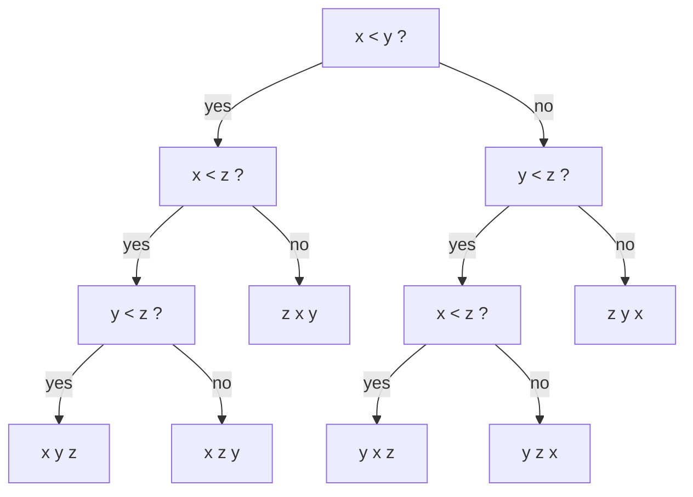

# S01E04 · Sorting Lower Bounds, Radix Sort & Networks

> **Source:** Pavel Mavrin, [_A&DS S01E04_](https://youtu.be/lJB_kwONQKY) · 1h45m lecture → ~16 min read.
> Every section deep-links back to the exact moment on the board.

## TL;DR

- **Any** comparison-based sort needs $\Omega(n \log n)$ comparisons in the worst case. The proof models the algorithm as a **decision tree**: leaves are the $n!$ possible permutations, so the tree's height is at least $\log_2(n!)$.
- **Stirling** gives $\log_2(n!) = \Theta(n \log n)$, so the $n \log n$ of merge sort, heap sort, and quicksort is not an accident — it is the floor.
- To go faster you must abandon "compare only" and exploit the values. **Counting sort** sorts $n$ integers drawn from $[0, m)$ in $\Theta(n + m)$ using a histogram.
- **Radix sort (LSD)** sorts integers up to $m^k$ by running counting sort $k$ times, digit by digit, least-significant first. It works **only because counting sort is stable**, and costs $\Theta(k(n + m))$.
- **Sorting networks** are oblivious circuits of compare-swap gates. The **0-1 principle** says a network that sorts every 0/1 input sorts every input. **Bitonic sort** is such a network with $\Theta(n \log^2 n)$ comparators and $\Theta(\log^2 n)$ parallel depth.

---

## The comparison model and the lower-bound question

- The three sorts covered so far — **merge sort, heap sort, quicksort** — all run in $O(n \log n)$ and all use exactly one operation on the array elements: **compare two of them**, "is $a_i < a_j$?".
  - Merge sort compares the two array heads while merging; heap sort compares a node to its parent while sifting; quicksort compares against the pivot.
- **Question of the lecture:** can any sort do better than $n \log n$?
- To prove a *negative* ("no algorithm can"), we must first **fix the operation set**. Here the model is the **comparison model**: the only thing an algorithm may learn about the data is the outcome of comparisons $a_i < a_j$. No arithmetic on the keys, no indexing by value.
- Answer: **no** — under this model $\Omega(n \log n)$ is a hard floor.

[watch from 1:43](https://youtu.be/lJB_kwONQKY?t=103)

---

## The decision-tree argument

- Model **any** comparison sort as a binary **decision tree**. Take $n = 3$ elements $x, y, z$:
  - The root asks `x < y?`. Each answer branches left/right into the next comparison, and so on until the algorithm knows the full order and outputs a permutation at a **leaf**.



- **Leaves = outcomes.** Every leaf is one of the possible sorted orders, i.e. one **permutation** of the input. Since sorting must be able to produce *any* of them, the tree has **at least $n!$ leaves**.
- **Height = running time.** Following a root-to-leaf path performs one comparison per edge, so the number of comparisons on the worst input equals the tree's **height** $T(n)$.
- **A binary tree of height $h$ has at most $2^h$ leaves.** To hold $n!$ leaves we need
  $$
  2^{T(n)} \ge n! \quad\Longrightarrow\quad T(n) \ge \log_2(n!).
  $$


- **Information-theory view:** to pin down one of $n!$ permutations you need $\log_2(n!)$ bits, and each comparison yields exactly one bit. Same bound, different language.

[watch from 5:04](https://youtu.be/lJB_kwONQKY?t=304)

---

## From log(n!) to Θ(n log n)

- Expand the factorial inside the log — a product becomes a sum:
  $$
  \log_2(n!) = \log_2\!\big(1 \cdot 2 \cdot 3 \cdots n\big) = \sum_{i=1}^{n} \log_2 i.
  $$
- **Upper bound** ($O$): every term is at most $\log_2 n$, so $\sum_{i=1}^{n}\log_2 i \le n \log_2 n$.
- **Lower bound** ($\Omega$): keep only the top half of the terms. For $i \ge n/2$ we have $\log_2 i \ge \log_2(n/2) = \log_2 n - 1$, and there are $n/2$ such terms:
  $$
  \sum_{i=1}^{n}\log_2 i \;\ge\; \frac{n}{2}\big(\log_2 n - 1\big) \;=\; \Omega(n \log n).
  $$
- Both bounds together give **Stirling's estimate** $\log_2(n!) = \Theta(n \log n)$.
- **Conclusion:** $T(n) \ge \log_2(n!) = \Omega(n \log n)$. No comparison sort beats $n \log n$ in the worst case — merge/heap/quicksort are already optimal in this model.

[watch from 12:04](https://youtu.be/lJB_kwONQKY?t=724)

---

## Counting sort — O(n + m)

- **Escape hatch:** if the keys are not abstract but **small integers** in $[0, m)$, we can do arithmetic on them and beat the bound.
- **Idea:** build a **histogram** `cnt` where `cnt[v]` counts how many times value `v` appears, then rewrite the array reading the histogram left to right.
- Example from the board (keeping the board's `cnt = [3, 4, 3]`): `a = [1,0,1,2,2,0,1,1,2,0]`, `m = 3` gives `cnt = [3, 4, 3]` (three 0s, four 1s, three 2s), and the output is `0 0 0 1 1 1 1 2 2 2`.

```cpp
vector<int> counting_sort(const vector<int>& a, int m) {
    // a: vector of ints in [0, m).  Returns a new sorted vector.
    vector<int> cnt(m, 0);
    for (int v : a)             // histogram pass — O(n)
        cnt[v]++;
    vector<int> out;
    for (int v = 0; v < m; v++) // emit pass — O(n + m)
        out.insert(out.end(), cnt[v], v);
    return out;
}
```


- **Data structure:** one integer array `cnt` of length $m$; invariant after the first loop is "`cnt[v]` = number of occurrences of `v`".
- **Complexity:** histogram is $\Theta(n)$; the emit loop touches all $m$ buckets, so total is $\Theta(n + m)$.
  - The "+ m" matters when $m \gg n$. Note $n + m = \Theta(\max(n, m))$.
  - In practice you pick $m \approx n$ (keys are indices $0 \ldots n-1$); then it is genuinely $\Theta(n)$ — linear, sub-$n\log n$, because it is *not* a comparison sort.

[watch from 20:00](https://youtu.be/lJB_kwONQKY?t=1200)

---

## Counting sort on objects (stable, bucketed)

- Real data is **objects with an integer key**, not bare integers:

```cpp
struct Item {
    int key;            // integer in [0, m)
    string data;        // payload we must carry along
};
```

- The plain histogram throws away the payload, so we need a version that **moves whole objects**. Conceptually: create one **bucket** per key value, scan the input left to right, append each object to its key's bucket, then concatenate the buckets in key order.
  - Board example: objects `A..J` with keys `1,0,1,2,2,0,1,1,2,0` land in bucket 0 = `[B,F,J]`, bucket 1 = `[A,C,G,H]`, bucket 2 = `[D,E,I]`; concatenation `B F J A C G H D E I` is the sorted result.
- Allocating $m$ growable vectors is wasteful. The **standard trick** uses the histogram to compute **prefix-sum offsets**, then places each object directly into one output array — the buckets are contiguous segments of that array:

```cpp
vector<Item> counting_sort_stable(const vector<Item>& items, int m) {
    // items: vector of Item, key in [0, m). Stable by key.
    vector<int> cnt(m, 0);
    for (const Item& it : items)    // histogram
        cnt[it.key]++;

    vector<int> pos(m, 0);          // pos[k] = start index of bucket k
    for (int k = 1; k < m; k++)     // prefix sums give bucket offsets
        pos[k] = pos[k - 1] + cnt[k - 1];

    vector<Item> out(items.size());
    for (const Item& it : items) {  // place, then advance the bucket cursor
        out[pos[it.key]] = it;
        pos[it.key]++;
    }
    return out;
}
```


- **Data structures:** `cnt` (histogram), `pos` (running write-cursor per bucket, initialized to prefix sums), `out` (result). Invariant: `pos[k]` always points at the next free slot of bucket `k`.
- **Stability is the key property:** because we scan the input left to right and each bucket cursor only moves forward, two objects with equal keys keep their original relative order. This is exactly what radix sort will lean on.
- **Complexity:** still $\Theta(n + m)$, now with $O(n + m)$ extra space.

[watch from 27:00](https://youtu.be/lJB_kwONQKY?t=1620)

---

## Radix sort — sorting bigger integers by digits

- **Setup:** keys are integers up to $m^2 - 1$ (later, up to $m^k$). A direct histogram of size $m^2$ could dwarf $n$, so counting sort alone is wrong here.
- **Split into digits base $m$.** Write each value as
  $$
  x = y \cdot m + z, \qquad y, z \in [0, m),
  $$
  i.e. a two-digit number in base $m$ with high digit $y = \lfloor x/m \rfloor$ and low digit $z = x \bmod m$. Comparing two values is the same as comparing the pairs $(y, z)$ lexicographically.
- Board example, $m = 3$: `a = [6,2,4,1,7,2,3,4,6]` becomes pairs `(2,0)(0,2)(1,1)(0,1)(2,1)(0,2)(1,0)(1,1)(2,0)`.

```cpp
vector<int> radix_pass(const vector<int>& items, function<int(int)> digit, int m) {
    // one stable counting sort keyed on the given base-m digit
    // digit(x) -> int in [0, m)
    vector<int> cnt(m, 0);
    for (int x : items)
        cnt[digit(x)]++;
    vector<int> pos(m, 0);
    for (int k = 1; k < m; k++)
        pos[k] = pos[k - 1] + cnt[k - 1];
    vector<int> out(items.size());
    for (int x : items) {
        int d = digit(x);
        out[pos[d]] = x;
        pos[d]++;
    }
    return out;
}

vector<int> radix_sort(vector<int> a, int m, int k) {
    // sort ints in [0, m^k) as k base-m digits, least-significant first
    long long p = 1;                             // m^i, computed incrementally
    for (int i = 0; i < k; i++) {                // digit 0 = least significant
        a = radix_pass(a, [m, p](int x) { return (int)((x / p) % m); }, m);
        p *= m;
    }
    return a;
}
```

![Radix sort: identity a[i]=b[i]·m+c[i], the array [6 2 4 1 7 2 3 4 6] rewritten as base-3 pairs, and two counting-sort passes each O(n+m)](/img/dsa/lJB_kwONQKY/frame-00186.png)

- **The order of passes is the whole trick (LSD).** Sort by the **least-significant** digit first, then by the next, ... For two digits:
  1. Counting-sort the pairs by the **low** digit $z$.
  2. Counting-sort the (already low-sorted) result by the **high** digit $y$.
- **Why the final array is fully sorted:** after pass 2 the array is ordered by the high digit. Within each high-digit bucket, the elements keep the order pass 1 gave them — sorted by the low digit — **because counting sort is stable**. So each bucket is internally low-digit-sorted, and the buckets are high-digit-ordered: that is lexicographic order on $(y, z)$.
- **Why not the naive "sort into $m$ blocks, then sort each block"?** Each of the $m$ blocks pays a "+ m" for its own histogram, so the total becomes $n + m^2$ — the very cost we were trying to avoid. Two stable global passes stay at $\Theta(n + m)$ each.
- **Generalize to $m^k$:** split into $k$ base-$m$ digits and run $k$ stable passes, LSD order. Total cost
  $$
  \Theta\big(k \,(n + m)\big).
  $$
  Choosing $m \approx n$ makes each pass linear; $k$ is the number of digits.
- **Practice note (honest):** despite the linear asymptotics, radix sort is not always the fastest in practice. It needs extra arrays (histogram + output) and its scattered writes are **cache-unfriendly**. It shines when $n$ and $m$ are both large (roughly a million and up); for small $m$ a good comparison sort often wins.

[watch from 37:30](https://youtu.be/lJB_kwONQKY?t=2250)

---

## Sorting networks and the 0-1 principle

- **A different model.** The only primitive is a **comparator** `cmp(i, j)`: look at positions $i$ and $j$ and swap them if out of order.

```cpp
void cmp(vector<int>& a, int i, int j) {
    if (a[i] > a[j])
        swap(a[i], a[j]);
}
```

- A **sorting network** is a fixed sequence of comparators — **oblivious**: the wiring does not depend on the data, only on $n$. Drawn as horizontal wires (one per position, time flowing left to right) with vertical arrows for comparators.
- **Two cost measures:**
  - **Size** = number of comparators (total work). Insertion sort as a network uses $\Theta(n^2)$ comparators.
  - **Depth** = number of **parallel layers**. Comparators on disjoint wires run in the same layer (think separate CPU cores), so depth is the wall-clock cost with unlimited parallelism. Insertion-sort network depth is $\Theta(n)$.


- **The 0-1 principle (the enabling theorem):** if a comparator network sorts **every** input consisting only of 0s and 1s, then it sorts **every** input.
  - **Proof sketch.** Fix an arbitrary input and its smallest value $v$. Build a 0/1 array with 0 exactly where $v$ sits and 1 elsewhere. Since every comparator makes the *same* swap decisions on the 0/1 array as on the ranks of the real array, the 0 travels to position 0 — so $v$ ends up first in the real output too. Repeat for the two smallest, three smallest, etc.: element by element, each is forced into its correct slot.
- This shrinks correctness-checking from $n!$ inputs to just $2^n$ zero-one inputs, and is what makes bitonic sort provable.

[watch from 1:01:00](https://youtu.be/lJB_kwONQKY?t=3660)

---

## Bitonic sort

- **Bitonic sequence.** A sequence that goes **up then down** (or any cyclic rotation of that) — one increasing run and one decreasing run when viewed cyclically. Example: `3, 2 | 4, 6, 10, 25 | 17, 11, 8, 6`.
  - A 0/1 bitonic sequence looks like `0…0 1…1 0…0` or `1…1 0…0 1…1` — one contiguous block of 1s (cyclically).


- **Bitonic merge — the split step.** Given a bitonic array of length $2^k$, compare element $i$ of the left half with element $i$ of the right half (`cmp(i, i + n/2)` for all $i$):
  - This produces two halves, **each again bitonic**, with **every** element of the left half $\le$ **every** element of the right half.
  - Proof via the 0-1 principle: for a 0/1 bitonic input, wherever the block of 1s sits, the parallel compares push all the smaller values into the left half and the larger into the right, and each half stays bitonic.
- **Recurse** on both halves. After $\log_2 n$ such layers the sequence is fully sorted. This sorts a **bitonic** input:

```cpp
void bitonic_merge(vector<int>& a, int lo, int cnt, bool ascending) {
    // a[lo : lo+cnt] is bitonic; cnt is a power of 2
    if (cnt <= 1)
        return;
    int half = cnt / 2;
    for (int i = lo; i < lo + half; i++) {          // one parallel compare layer
        if ((a[i] > a[i + half]) == ascending)
            swap(a[i], a[i + half]);
    }
    bitonic_merge(a, lo, half, ascending);
    bitonic_merge(a, lo + half, half, ascending);
}
```


- **From bitonic merge to a full sort.** An arbitrary array is not bitonic, so build bitonicity bottom-up: sort adjacent pairs **alternately ascending/descending** so each pair of pairs forms a length-4 bitonic run, merge those, and so on — doubling the sorted-block size each round.

```cpp
vector<int>& bitonic_sort(vector<int>& a) {
    // a.size() must be a power of 2
    int n = a.size();
    for (int size = 2; size <= n; size *= 2) {
        for (int lo = 0; lo < n; lo += size) {
            bool ascending = (lo / size) % 2 == 0;   // alternate directions
            bitonic_merge(a, lo, size, ascending);
        }
    }
    return a;
}
```

- **Complexity.** There are $\log_2 n$ merge rounds; round $r$ is itself a bitonic merge of depth $\log_2(\text{block size}) \le \log_2 n$. So:
  - **Depth** $= \Theta(\log^2 n)$ — excellent for parallel hardware.
  - **Size** $= \Theta(n \log^2 n)$ comparators.
- An asymptotically optimal $\Theta(n \log n)$-size network exists (AKS), but its constant is huge and it is not practical; bitonic sort is the workhorse for real parallel/GPU sorting.

[watch from 1:20:00](https://youtu.be/lJB_kwONQKY?t=4800)

---

## Complexity recap

| Algorithm | Best | Average | Worst | Space | Stable? |
| --- | --- | --- | --- | --- | --- |
| Comparison lower bound | $\Omega(n\log n)$ | $\Omega(n\log n)$ | $\Omega(n\log n)$ | — | — |
| Counting sort | $\Theta(n+m)$ | $\Theta(n+m)$ | $\Theta(n+m)$ | $O(n+m)$ | ✅ |
| Radix sort (LSD, $k$ digits) | $\Theta(k(n+m))$ | $\Theta(k(n+m))$ | $\Theta(k(n+m))$ | $O(n+m)$ | ✅ |
| Bitonic sort (size) | $\Theta(n\log^2 n)$ | $\Theta(n\log^2 n)$ | $\Theta(n\log^2 n)$ | $O(n)$ | ❌ |
| Bitonic sort (parallel depth) | $\Theta(\log^2 n)$ | $\Theta(\log^2 n)$ | $\Theta(\log^2 n)$ | — | — |

---

## Practice problems

The interview payload here is **counting/radix/bucket** thinking: recognizing when a non-comparison sort turns an $n\log n$ problem into linear time. Sorting networks and bitonic sort are largely **outside typical interview rounds** — they belong to parallel-computing and hardware courses — so below they get the nearest adjacent problems plus a real reference pointer rather than a LeetCode grind.

**🎯 Interview (MAANG-style)**

- [Sort an Array — LeetCode 912](https://leetcode.com/problems/sort-an-array/) — Medium — a clean place to implement counting/radix sort from scratch when the value range is bounded.
- [Maximum Gap — LeetCode 164](https://leetcode.com/problems/maximum-gap/) — Hard — the canonical radix/bucket-sort interview problem: linear-time sort to get an $O(n)$ max adjacent gap.
- [Sort Colors — LeetCode 75](https://leetcode.com/problems/sort-colors/) — Medium — counting sort with $m = 3$ (Dutch-national-flag), the smallest instance of a histogram sort.
- [H-Index — LeetCode 274](https://leetcode.com/problems/h-index/) — Medium — a bucket/counting histogram beats the sort-based $O(n\log n)$ solution.
- [Counting Sort — GeeksforGeeks](https://www.geeksforgeeks.org/counting-sort/) — Easy — the reference implementation, stability discussion included.
- [Radix Sort — GeeksforGeeks](https://www.geeksforgeeks.org/radix-sort/) — Medium — LSD radix over base-10 digits with a worked trace.

**🏆 Competitive**

- [Distinct Numbers — CSES 1621](https://cses.fi/problemset/task/1621) — Easy — sort-then-scan; a warm-up where a counting/bucket approach is natural when values are bounded.
- [Stick Lengths — CSES 1074](https://cses.fi/problemset/task/1074) — Easy — sorting as a subroutine, then a median argument.
- [Official home tasks & discussion — Codeforces](https://codeforces.com/blog/entry/83335) — the problem set Pavel assigned for this lecture (linked from the video description).

> Sorting networks: there is no mainstream interview problem, but if you want to *build* one, the classic exercise is to code a bitonic sorter and verify it with the **0-1 principle** by testing all $2^n$ binary inputs for small $n$.

---

## Further reading

- [Lower bound on comparison-based sorting — GeeksforGeeks](https://www.geeksforgeeks.org/lower-bound-on-comparison-based-sorting-algorithms/) — the decision-tree proof spelled out.
- [Counting sort — Wikipedia](https://en.wikipedia.org/wiki/Counting_sort) and [Radix sort — Wikipedia](https://en.wikipedia.org/wiki/Radix_sort).
- [Comparison sort — Wikipedia](https://en.wikipedia.org/wiki/Comparison_sort) and [Stirling's approximation — Wikipedia](https://en.wikipedia.org/wiki/Stirling%27s_approximation) for $\log(n!) = \Theta(n\log n)$.
- [Sorting network — Wikipedia](https://en.wikipedia.org/wiki/Sorting_network) and [Bitonic sorter — Wikipedia](https://en.wikipedia.org/wiki/Bitonic_sorter).
- [Time complexities of all sorting algorithms — GeeksforGeeks](https://www.geeksforgeeks.org/time-complexities-of-all-sorting-algorithms/) — one-page comparison table.

---

## Key takeaways

- The $\Omega(n\log n)$ barrier is about the **model**: with only comparisons you must resolve one of $n!$ permutations, and a binary decision tree needs height $\log_2(n!) = \Theta(n\log n)$.
- Beating it requires **using the values** — indexing by key. Counting sort ($\Theta(n+m)$) is the base case; radix sort ($\Theta(k(n+m))$) chains it digit by digit.
- **Stability is not cosmetic in radix sort — it is the correctness argument.** Least-significant-digit first plus stable passes yields lexicographic order.
- Sorting networks trade adaptivity for **parallelism**; the **0-1 principle** makes them provable, and **bitonic sort** delivers $\Theta(\log^2 n)$ depth.

## Glossary

- **Comparison model** — cost model where the only allowed operation on keys is comparing two of them.
- **Decision tree** — binary tree modeling an algorithm's comparison choices; leaves are outputs, height is worst-case time.
- **Counting sort** — histogram-based sort for keys in a small range $[0, m)$, running in $\Theta(n+m)$.
- **Radix sort (LSD)** — sort integers digit by digit, least-significant first, via repeated stable counting sort.
- **Stable sort** — preserves the relative order of equal keys (the property radix sort depends on).
- **Sorting network** — oblivious circuit of compare-swap comparators; measured by size and by parallel depth.
- **0-1 principle** — a comparator network that sorts all 0/1 inputs sorts all inputs.
- **Bitonic sequence** — one increasing run followed by one decreasing run, viewed cyclically.
