# S02E15 · Complexity Classes

> **Source:** Pavel Mavrin, [_A&DS S02E15_](https://youtu.be/zjBH1hjDUIs) · 1h32m lecture → ~16 min read.
> This is a **theory** lecture — the payload is a chain of definitions and reductions, not an algorithm. Each section deep-links back to the board.

## TL;DR

- **P** = problems solvable in polynomial time $O(n^k)$. This class is **robust**: it does not depend on the machine model (RAM, pointer machine, Turing machine all agree up to a polynomial), which is why we lump $n\log n$ and $n^{10}$ together.
- The hierarchy is $\mathsf{P} \subseteq \mathsf{EXP} \subseteq \mathsf{R}$, where **EXP** is solvable in $O(2^{n^k})$ time and **R** is *everything solvable at all*. Some problems (generalized chess) are provably outside P; the **halting problem** is provably outside R — undecidable.
- **NP** = problems solvable in polynomial time by a **non-deterministic** Turing machine. Equivalently: given a candidate solution (a **certificate**), you can *verify* it in polynomial time. $\mathsf{P} \subseteq \mathsf{NP}$ trivially.
- A **polynomial-time reduction** $B \le_p A$ transforms inputs of $B$ into inputs of $A$ so that solving $A$ solves $B$. It proves "$A$ is no easier than $B$". **NP-hard** = at least as hard as every NP problem; **NP-complete** = NP-hard *and* in NP.
- **Cook-Levin:** a universal simulation problem is NP-complete by construction; from it, **SAT / 3-SAT** is NP-complete, and everything else follows by reduction (the lecture reduces **3-SAT → subset-sum**).
- **P vs NP** asks whether verifying is the same as finding. If any NP-complete problem is in P, then $\mathsf{P} = \mathsf{NP}$. Nobody knows; most believe $\mathsf{P} \ne \mathsf{NP}$.

---

## The class P and why the model does not matter

- We measured almost every algorithm this course by a time complexity: $O(n\log n)$, $O(n^2)$, and so on. Complexity theory groups them all into one class.
- **Class P** — the set of problems solvable in **polynomial time**: there is some constant $k$ with running time $O(n^k)$.
- We deliberately do **not** distinguish $n\log n$ from $n^{10}$. A degree-10 algorithm is terrible in practice, yet it sits in P. The reason is robustness:

- **Membership in P is model-independent.** Whether you count on a RAM machine, a pointer machine, or a Turing machine, "solvable in polynomial time" is the *same* set of problems.
  - RAM lets you index `a[i]` in $O(1)$.
  - A pointer machine has no arrays; simulating indexing costs an extra factor (a tree of elements), so a RAM $O(n^2)$ might become $O(n^2 \log n)$ — still polynomial.
  - Any reasonable model simulates the RAM with only a **polynomial** blow-up per operation. Polynomial-of-polynomial is polynomial, so P is invariant.


[watch from 2:21](https://youtu.be/zjBH1hjDUIs?t=141)

---

## The Turing machine (our reference model)

Because P does not care about the model, we pick the *simplest* one and reason about it.

- **Tape.** One infinite strip of cells; the machine sees exactly **one** cell at a time (the head position).
- **Control.** A finite automaton with a current **state**.
- **A step** reads the current state and the symbol under the head, then does all three of:
  - write a (possibly new) symbol into the current cell,
  - move the head **left**, **right**, or **stay**,
  - switch to a (possibly new) state — or **HALT**.
- Formally, a transition function:

$$
(\text{state}, x) \;\longmapsto\; (\text{state}', x', \{\text{L}, \text{R}, \cdot\})
$$

- **It still preserves polynomial time.** A RAM algorithm can be simulated on a Turing machine with only a polynomial slowdown:
  - An integer variable becomes its **binary representation** on the tape; `i = i + 1` is done bit-by-bit (find the lowest zero, flip the trailing ones) — polynomial in the number's length.
  - Array access `a[i]` is simulated by walking a separator marker `i` positions, decrementing `i` each step — costs about $O(n^2)$ per access, but still polynomial.
- So every RAM-polynomial problem is Turing-polynomial. This is exactly why P is a clean, model-free notion.


[watch from 4:43](https://youtu.be/zjBH1hjDUIs?t=283)

---

## Above P: EXP, R, and problems with no polynomial algorithm

- **Is anything provably outside P?** Yes. **Generalized chess** — given a position on an $n \times n$ board, decide who wins — is *proven* not to be in P.
  - Proving a problem is **in** P is easy: exhibit a polynomial algorithm.
  - Proving a problem is **not** in P is hard: you must rule out *every* possible polynomial algorithm. These lower-bound proofs are far more delicate than upper bounds (recall the $\Omega(n\log n)$ comparison-sort bound — even that simple case took real work). This upper-vs-lower **asymmetry** recurs throughout the lecture.
- Generalized chess is still **solvable** — the number of board positions is finite, so brute-force the game graph. It just needs **exponential** time.

- **Class EXP** — solvable in time $O\!\left(2^{n^k}\right)$: an exponential of a polynomial. Things like $n!$ live here too ($n! \le 2^{n\log n}$).
- **Class R** (recursive; historical name) — **all solvable problems**: there exists a Turing machine that, on any input, **halts** in finite time with the correct answer. The "must halt" clause is essential — a machine that runs forever has not solved anything.

$$
\mathsf{P} \;\subseteq\; \mathsf{EXP} \;\subseteq\; \mathsf{R}
$$


[watch from 11:34](https://youtu.be/zjBH1hjDUIs?t=694)

---

## Outside R: the halting problem is undecidable

- **The halting problem HALT.** Input: a program $p$ and an input $x$. Question: does $p$ **stop** on $x$ in finite time, or run forever? A program is just a block of text (a sequence of lines), so this is a well-defined boolean function.
- **Theorem (Turing).** HALT is **not** solvable by any Turing machine. It lies outside R.

- **Proof by diagonalization.** Suppose a decider `halts(p, x)` existed. Build an adversary $f$ that feeds a program its own text and does the **opposite**:

```cpp
#include <bits/stdc++.h>
using namespace std;
using Program = string;                 // a program is just its source text

// SUPPOSE this existed and decided, for any program p and input x,
// whether p halts on x. The proof shows it CANNOT exist.
bool halts(const Program& p, const Program& x);   // hypothetical oracle

// The diagonal adversary: feed a program its OWN text, do the opposite.
void f(const Program& p) {
    if (halts(p, p)) {                  // if p, run on p, would halt...
        while (true) {}                 // ...loop forever
    } else {
        return;                         // else halt
    }
}
```

- Now ask what $f$ does **on its own text** $f$:
  - If `halts(f, f)` is **true**, $f$ enters the infinite loop, so $f$ does **not** halt — contradiction.
  - If `halts(f, f)` is **false**, $f$ returns, so $f$ **does** halt — contradiction.
- Both branches contradict, so `halts` **cannot exist**. HALT is undecidable.

- **Why this matters.** Any non-trivial property of programs is undecidable in general. A perfect bug-finder / static analyzer cannot exist; IDE inspections work only because they use heuristics on common code shapes, and give up on genuinely complicated code.


[watch from 19:32](https://youtu.be/zjBH1hjDUIs?t=1172)

---

## Turing-completeness: undecidability is contagious

- HALT looks like a fact about *programs*. It is not special to programs — any system rich enough to **simulate a Turing machine** inherits its undecidability.
- **Turing-complete** system = one inside which you can build a Turing machine. For such systems, **no** non-trivial property is decidable (deciding it would decide the same property of the simulated machine).
- **Conway's Game of Life** — an infinite grid; a dead cell with exactly 3 live neighbors is born; a live cell survives with 2 or 3 live neighbors, else dies.
  - It hosts still lifes (a 2-by-2 block), oscillators (the blinker), and **gliders** that travel; glider guns emit gliders forever. These moving structures let you wire up logic, so Life is Turing-complete.
  - Therefore "does this starting position ever stabilize / stay bounded" is **undecidable**.
- Other Turing-complete systems the lecture mentions: **Wang tiles** (can a given tile set tile the infinite plane?) and **Rule 110**, a one-dimensional cellular automaton with a tiny 3-cell update rule (of the $2^{2^3} = 256$ elementary rules) that was later proven Turing-complete.
- **Rule of thumb:** infinite memory plus interesting behavior usually means undecidable. Bounded memory is always decidable (finitely many states to enumerate).


[watch from 29:11](https://youtu.be/zjBH1hjDUIs?t=1751)

---

## The class NP

- **NP is NOT "non-polynomial".** That is the classic misreading. NP is the **closest class above P** — problems we cannot (yet) place in P, but that are far from unsolvable.
- **Definition (non-deterministic Turing machine).** A problem is in **NP** if it is solvable in polynomial time by a non-deterministic Turing machine.
  - In an ordinary automaton, each (state, symbol) has **one** outgoing transition.
  - A non-deterministic machine may have **several** transitions for the same (state, symbol). At such a branch it receives *advice* — a hint telling it which way to go.
  - There are special **YES** and **NO** halting states. The advice-giver *wants* to reach YES.
  - **The machine accepts iff there exists some sequence of choices that reaches YES.** If the true answer is NO, no advice can reach YES.

- **Convention: decision problems.** All these classes are about **yes/no** questions. An optimization problem ("find the minimum cost") is turned into decisions "is there an $x$ with $f(x) < d$?" and then binary-searched over $d$:

$$
\exists\, x : f(x) < D \;?
$$


[watch from 43:48](https://youtu.be/zjBH1hjDUIs?t=2628)

---

## NP as certificate verification

- The advice view has a cleaner equivalent: **NP = problems with polynomial-time verifiable certificates.**
- **A problem is in NP** iff there is a polynomial-time verifier $V$ such that

$$
\text{answer is YES} \iff \exists\, w \;(\lvert w\rvert \text{ polynomial}) : V(x, w) = 1 .
$$

- Here $w$ is the **certificate** (the "witness" / the advice written down). You do **not** have to *find* $w$ in polynomial time — only *check* a given one.

- **Example — Hamiltonian cycle.** Given a graph, is there a cycle visiting every vertex exactly once?
  - Non-deterministic machine: start somewhere, at each vertex make a non-deterministic choice of the next edge; a helpful oracle steers you along a real Hamiltonian cycle if one exists.
  - Certificate view: the cycle itself is the certificate. Given a claimed cycle you check "visits every vertex once, consecutive vertices are adjacent" in polynomial time.
  - **The asymmetry again.** If the answer is YES you can *prove* it (show the cycle). If the answer is NO there is no short proof — "this graph has no Hamiltonian cycle" is not obviously certifiable. NP is precisely the class where **YES** answers have short proofs.

- **P is inside NP.** Any deterministic machine is a non-deterministic one that never branches, so $\mathsf{P} \subseteq \mathsf{NP}$. Being in NP does **not** make a problem hard.

A verifier for 3-SAT — the certificate is a variable assignment, checked clause by clause in linear time:

```cpp
#include <bits/stdc++.h>
using namespace std;

// A literal is (variable index, negated?); a clause is a list of literals.
struct Literal { int var; bool neg; };
using Clause = vector<Literal>;

// Certificate check: does this assignment satisfy every clause?
// Polynomial-time verifier — the essence of NP membership.
bool satisfies(const vector<Clause>& cnf, const vector<bool>& assign) {
    for (const Clause& c : cnf) {
        bool clause_ok = false;
        for (const Literal& lit : c) {
            bool val = assign[lit.var];
            if (lit.neg) val = !val;
            if (val) { clause_ok = true; break; }
        }
        if (!clause_ok) return false;      // one unsatisfied clause kills it
    }
    return true;
}
```


[watch from 51:12](https://youtu.be/zjBH1hjDUIs?t=3072)

---

## Polynomial-time reductions

- **Goal:** formalize "problem $A$ is no easier than problem $B$".
- **Reduction $B \le_p A$.** A polynomial-time computable function $f$ mapping inputs of $B$ to inputs of $A$ such that

$$
B(x) = A\big(f(x)\big) \quad\text{for every input } x .
$$

- Reading it as an algorithm: to solve $B$ on $x$, compute $f(x)$ (polynomial), run your $A$-solver, return its answer. If $A \in \mathsf{P}$ then so is $B$ — because polynomial preprocessing plus a polynomial solver is still polynomial.
- So a reduction $B \le_p A$ proves **$A$ is at least as hard as $B$** (solving $A$ hands you a solution to $B$).

- **Worked reduction: Hamiltonian cycle $\le_p$ Hamiltonian path.** We show finding a Hamiltonian **path** is not easier than finding a Hamiltonian **cycle**.
  - Take the cycle graph. Pick any vertex $v$ and **split it into two copies** $v'$ and $v''$: a cycle through $v$ becomes a path *from* $v'$ *to* $v''$.
  - To force the path to start at $v'$ and end at $v''$, attach one extra pendant vertex to each. Now any Hamiltonian path in the new graph must begin at one pendant and end at the other, i.e. run from $v'$ to $v''$.
  - Contracting the split back gives a Hamiltonian cycle in the original graph. Hence a Ham-path solver solves Ham-cycle:

$$
\text{Ham-Path} \;\ge\; \text{Ham-Cycle}.
$$


[watch from 57:47](https://youtu.be/zjBH1hjDUIs?t=3467)

---

## NP-hard and NP-complete

- **NP-hard** — a problem that is **at least as hard as every problem in NP**: every NP problem reduces to it in polynomial time. (An NP-hard problem need not itself be in NP; it can be harder.)
- **NP-complete** — **NP-hard *and* in NP**. These are the *hardest* problems that still sit inside NP — right on its upper border.

$$
\text{NP-complete} \;=\; \text{NP-hard} \;\wedge\; (\,\cdot \in \mathsf{NP}\,).
$$

- **The collapse consequence.** Suppose *any single* NP-complete problem were in P. Then every NP problem reduces to it in polynomial time and is therefore also in P, giving

$$
\text{one NP-complete problem} \in \mathsf{P} \;\;\Longrightarrow\;\; \mathsf{NP} = \mathsf{P}.
$$

- This is why NP-complete problems are treated as the canonical "probably intractable" problems: crack one efficiently and the whole class falls.


[watch from 1:04:02](https://youtu.be/zjBH1hjDUIs?t=3842)

---

## Cook-Levin: the first NP-complete problem

- To reduce *every* NP problem to a target, we need a **seed** — one problem proven NP-complete from scratch.
- **The universal problem.** Input: a non-deterministic Turing machine $M$, an input $x$, and a time limit $n^k$. Question: does $M$ accept $x$ within $n^k$ steps?
  - It is **obviously NP-complete**: any NP problem, by definition, *is* some non-deterministic machine $M$ running in polynomial time — hand that $M$ to the universal problem and it simulates the solution. So every NP problem reduces to it trivially.
- **Cook-Levin theorem.** The universal simulation reduces to **SAT** (boolean satisfiability): one can encode "$M$ accepts $x$ in $n^k$ steps" as a boolean formula that is satisfiable iff such an accepting computation exists. Hence **SAT is NP-complete**, and further **3-SAT** (every clause has exactly 3 literals) is NP-complete.
- **3-SAT** is the workhorse seed: a CNF formula like

$$
(x_1 \vee \overline{x_2} \vee x_3) \wedge (x_2 \vee x_3 \vee \overline{x_4}) \wedge \dots
$$

- **How to prove your problem NP-complete in practice:** (1) show it is in NP (a poly-time certificate exists); (2) reduce a **known** NP-complete problem *to* it. You never re-run Cook-Levin — you stand on 3-SAT.


[watch from 1:26:31](https://youtu.be/zjBH1hjDUIs?t=5191)

---

## Reduction in full: 3-SAT ≤ subset-sum

The lecture proves **subset-sum** (the simplest knapsack: given weights $w_1,\dots,w_n$ and target $S$, is there a subset summing to exactly $S$?) is NP-complete by reducing 3-SAT to it. It is in NP (the subset is the certificate), so the reduction settles completeness.

- **Encoding as base-10 numbers.** Each subset-sum element is a big number whose **digits** we design so that no carries ever occur (every digit of any valid sum stays $\le 3 < 10$). The digits split into two blocks:
  - one digit **per variable** $x_i$,
  - one digit **per clause** $c_j$.
- **Two numbers per variable** $x_i$: one for $x_i = \text{true}$, one for $x_i = \text{false}$.
  - In the **variable block**, put a $1$ in digit $i$. Choosing exactly one of the pair contributes $1$ there.
  - In the **clause block**, put a $1$ in digit $j$ for every clause $c_j$ that this literal **satisfies**.
- **Two filler numbers per clause** $c_j$: each has a single $1$ in clause-digit $j$. These provide slack so a satisfied clause digit can reach the target $3$.
- **Target** $S$: every variable digit $= 1$ (pick exactly one literal per variable — cannot make $x_i$ both true and false), every clause digit $= 3$.
- **Why it works.** A clause digit reaches $3$ only if **at least one** literal-number contributed to it (the two fillers alone give at most $2$). So a valid subset picks one truth value per variable *and* satisfies every clause — exactly a satisfying assignment. Conversely a satisfying assignment yields a valid subset.

The construction and its inverse, verified to round-trip:

```cpp
#include <bits/stdc++.h>
using namespace std;

// 3-SAT -> SUBSET-SUM, exactly as built on the board.
// Layout (base 10): [ n variable digits ][ m clause digits ].
struct Literal { int var; bool neg; };
using Clause = vector<Literal>;
using Num = vector<int>;                 // digit vector, no carries

int main() {
    int n = 3, m = 3;
    // c0: x0 OR !x1 OR x2 ; c1: !x0 OR x1 OR !x2 ; c2: x0 OR x1 OR x2
    vector<Clause> cnf = {
        {{0,false},{1,true},{2,false}},
        {{0,true},{1,false},{2,true}},
        {{0,false},{1,false},{2,false}}
    };
    int D = n + m;
    vector<Num> nums; vector<string> label;

    // two literal-numbers per variable
    for (int i = 0; i < n; i++)
        for (int neg = 0; neg <= 1; neg++) {
            Num v(D, 0); v[i] = 1;               // variable digit
            for (int j = 0; j < m; j++)
                for (auto& lit : cnf[j])
                    if (lit.var == i && (int)lit.neg == neg)
                        v[n + j] = 1;            // satisfies clause j
            nums.push_back(v);
            label.push_back((neg? "!x":"x") + to_string(i));
        }
    // two filler-numbers per clause
    for (int j = 0; j < m; j++)
        for (int k = 0; k < 2; k++) {
            Num v(D, 0); v[n + j] = 1;
            nums.push_back(v); label.push_back("fill_c" + to_string(j));
        }

    Num S(D, 0);
    for (int i = 0; i < n; i++) S[i] = 1;        // one literal per variable
    for (int j = 0; j < m; j++) S[n + j] = 3;    // each clause digit = 3

    // brute-force the constructed instance (digit-wise, no carries)
    int N = nums.size(); long long found = -1;
    for (long long mask = 0; mask < (1LL << N); mask++) {
        Num sum(D, 0);
        for (int i = 0; i < N; i++) if (mask >> i & 1)
            for (int d = 0; d < D; d++) sum[d] += nums[i][d];
        if (sum == S) { found = mask; break; }
    }
    // recover and verify the SAT assignment
    vector<int> assign(n, -1);
    for (int i = 0; i < N; i++) if (found >> i & 1) {
        const string& L = label[i];
        if (L[0] != 'f') assign[L.back() - '0'] = (L[0] == '!') ? 0 : 1;
    }
    bool ok = found >= 0;
    for (auto& c : cnf) { bool cl = false;
        for (auto& lit : c) { bool val = assign[lit.var]; if (lit.neg) val = !val; cl = cl || val; }
        ok = ok && cl; }
    cout << "solvable=" << (found >= 0) << " satisfies=" << ok << "\n"; // solvable=1 satisfies=1
    return 0;
}
```

Running it prints `solvable=1 satisfies=1`: the constructed subset-sum instance has a solution, and the subset it finds decodes back into an assignment that satisfies the original CNF.


[watch from 1:12:34](https://youtu.be/zjBH1hjDUIs?t=4354)

---

## P vs NP

- **The question.** Is $\mathsf{P} = \mathsf{NP}$? Equivalently: if you can **verify** a solution in polynomial time, can you **find** one in polynomial time?

$$
\mathsf{P} \overset{?}{=} \mathsf{NP}
$$

- Because all NP-complete problems are inter-reducible, a **single** polynomial algorithm for any one of them (SAT, 3-SAT, subset-sum, clique, vertex cover, Hamiltonian cycle, TSP-decision) would collapse the entire class into P.
- **Status.** Open. Most researchers believe $\mathsf{P} \ne \mathsf{NP}$ — "checking equals producing" feels too strong. Claimed proofs appear yearly and generally fail.
- **A meta-caveat.** By Gödel-style limits, some statements are unprovable within a given theory, and one cannot even always prove a statement *is* unprovable. P vs NP might be such a statement — nobody knows.


[watch from 1:06:37](https://youtu.be/zjBH1hjDUIs?t=3997)

---

## The class map

```mermaid
graph LR
    P["P &#60;br/&#62; poly time"] --> NP["NP &#60;br/&#62; poly-verifiable"]
    NP --> EXP["EXP &#60;br/&#62; 2^poly time"]
    EXP --> R["R &#60;br/&#62; solvable / decidable"]
    R --> U["undecidable &#60;br/&#62; e.g. HALT"]
    NPC["NP-complete &#60;br/&#62; SAT, 3-SAT, subset-sum, &#60;br/&#62; clique, vertex cover, Ham-cycle"] -.->|"hardest in"| NP
```



- Known: $\mathsf{P} \subseteq \mathsf{NP} \subseteq \mathsf{EXP} \subseteq \mathsf{R}$. Whether the first inclusion is strict is the open P vs NP question.

---

## Complexity recap

| Class | Informal definition | Time bound | Example |
| --- | --- | --- | --- |
| P | deterministic poly time | $O(n^k)$ | sorting, shortest paths |
| NP | poly-verifiable certificate | $O(n^k)$ non-deterministic | SAT, Hamiltonian cycle |
| NP-complete | hardest in NP (NP-hard ∧ in NP) | poly-verifiable, no known poly solver | 3-SAT, subset-sum, clique |
| NP-hard | at least as hard as all of NP | — | 3-SAT, TSP-optimization, HALT |
| EXP | exponential of a polynomial | $O(2^{n^k})$ | generalized chess |
| R | decidable (machine always halts) | finite | anything computable |
| undecidable | outside R | — | halting problem, tiling |

---

## Practice problems

> **Honest label:** this is a **theory** lecture with no Codeforces home task. The point for interviews is **recognition** — spotting when a task is secretly NP-hard so you switch to approximation, DP over small parameters, or pruning instead of hunting for a nonexistent polynomial algorithm. The LeetCode problems below are the interview faces of the NP-complete problems above; they are tractable only because the constraints are tiny.

**🎯 Interview — recognizing NP-hardness**

- [Partition to K Equal Sum Subsets — LeetCode 698](https://leetcode.com/problems/partition-to-k-equal-sum-subsets/) — Medium — a direct subset-sum / bin-packing variant; solvable only via bitmask DP or backtracking because $n \le 16$.
- [Find Minimum Time to Finish All Jobs — LeetCode 1723](https://leetcode.com/problems/find-minimum-time-to-finish-all-jobs/) — Hard — multiprocessor scheduling (NP-hard); binary-search-plus-backtracking works because there are at most 12 jobs.
- [Find the Shortest Superstring — LeetCode 943](https://leetcode.com/problems/find-the-shortest-superstring/) — Hard — TSP-flavored; Held-Karp bitmask DP over $n \le 12$ strings.
- [Introduction to NP-Completeness — GeeksforGeeks](https://www.geeksforgeeks.org/introduction-to-np-completeness/) — the theory framing, with the reduction picture.

**When to stop looking for a polynomial algorithm.** If your problem reduces from (or *to*, in the hard direction) SAT, subset-sum, clique, vertex cover, Hamiltonian cycle/path, graph coloring, or TSP, it is almost certainly NP-hard — **stop** searching for a clean polynomial solution. Pivot to: exponential DP over a small parameter (bitmask, tree-width), approximation with a guarantee, ILP / SAT solvers, or good-enough heuristics. Small input bounds ($n \le 20$-ish) in a "hard" problem are the tell that exponential is *expected*.

**🏆 Competitive / theory**

- [P versus NP — Wikipedia](https://en.wikipedia.org/wiki/P_versus_NP_problem) — the open problem and its consequences.
- [Karp's 21 NP-complete problems — Wikipedia](https://en.wikipedia.org/wiki/Karp%27s_21_NP-complete_problems) — the canonical reduction web; pick any two and reduce.

---

## Further reading

- [NP-completeness — Wikipedia](https://en.wikipedia.org/wiki/NP-completeness) and [Cook-Levin theorem — Wikipedia](https://en.wikipedia.org/wiki/Cook%E2%80%93Levin_theorem).
- [Boolean satisfiability problem — Wikipedia](https://en.wikipedia.org/wiki/Boolean_satisfiability_problem) and [Subset sum problem — Wikipedia](https://en.wikipedia.org/wiki/Subset_sum_problem).
- [Halting problem — Wikipedia](https://en.wikipedia.org/wiki/Halting_problem) and [Reduction (complexity) — Wikipedia](https://en.wikipedia.org/wiki/Reduction_(complexity)).
- Classic NP-complete problems: [Clique problem](https://en.wikipedia.org/wiki/Clique_problem), [Vertex cover](https://en.wikipedia.org/wiki/Vertex_cover), [Hamiltonian path problem](https://en.wikipedia.org/wiki/Hamiltonian_path_problem), [Travelling salesman problem](https://en.wikipedia.org/wiki/Travelling_salesman_problem).
- [NP-Completeness Set 1 — GeeksforGeeks](https://www.geeksforgeeks.org/np-completeness-set-1/) and [Conway's Game of Life — Wikipedia](https://en.wikipedia.org/wiki/Conway%27s_Game_of_Life) (a Turing-complete cellular automaton).

---

## Key takeaways

- **P is model-robust** — polynomial-time membership survives any reasonable machine change, which is the whole justification for the class.
- Above P lies **EXP** (exponential-of-poly), then **R** (all decidable problems); **HALT** and any Turing-complete system sit *outside* R — undecidable.
- **NP = short YES-certificates you can verify in polynomial time.** The deep asymmetry: YES answers have proofs, NO answers generally do not.
- A **polynomial reduction $B \le_p A$** proves $A$ is no easier than $B$. **NP-complete** = NP-hard and in NP; solving one in P collapses $\mathsf{NP}$ into $\mathsf{P}$.
- **Cook-Levin** seeds the theory with SAT/3-SAT; the **3-SAT → subset-sum** reduction shows how completeness spreads by construction.
- Practically: **recognize** NP-hardness early and switch strategy — small-$n$ exponential DP, approximation, or heuristics.

## Glossary

- **P** — problems solvable by a deterministic machine in time $O(n^k)$.
- **NP** — problems whose YES-instances have a polynomial-time verifiable certificate (equivalently, solvable by a non-deterministic machine in poly time).
- **EXP** — problems solvable in $O(2^{n^k})$ time.
- **R (recursive)** — all decidable problems: some machine always halts with the answer.
- **Undecidable** — outside R; no machine decides it in finite time (e.g. HALT).
- **Certificate / witness** — a candidate solution that a verifier checks quickly.
- **Reduction $B \le_p A$** — poly-time map of $B$-inputs to $A$-inputs preserving the answer; proves $A$ is at least as hard as $B$.
- **NP-hard** — at least as hard as every NP problem (every NP problem reduces to it).
- **NP-complete** — NP-hard *and* itself in NP; the hardest problems inside NP.
- **Cook-Levin theorem** — SAT is NP-complete; the foundational seed reduction.
- **Turing-complete** — a system able to simulate a Turing machine; inherits undecidability of non-trivial properties.
