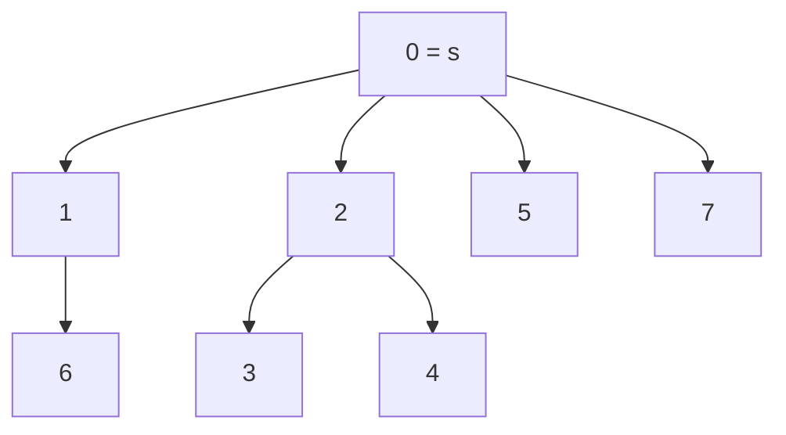

# S03E04 · Dominator Tree

> **Source:** Pavel Mavrin, [_A&DS S03E04_](https://youtu.be/imx06O-cJDA) · 1h42m lecture → ~16 min read.
> Every section deep-links back to the exact moment on the board.

## TL;DR

- Fix a **source** $s$ in a directed graph. Vertex $u$ **dominates** $v$ when *every* path from $s$ to $v$ passes through $u$. Domination is a bottleneck relation, and unlike undirected articulation points it depends on the direction $s \to v$.
- The dominators of any single $v$ form a **chain** (they dominate each other), so $v$ has a unique **immediate dominator** $\mathrm{idom}(v)$ — the closest one. Making $\mathrm{idom}(v)$ the parent of $v$ builds the **dominator tree**.
- On a **DAG** the tree is easy: process vertices in topological order and set $\mathrm{idom}(v)$ to the **LCA** of the dominators of all in-neighbours, using binary lifting.
- With cycles you need **Lengauer–Tarjan**. Number vertices by DFS **entry time**; define the **semidominator** $\mathrm{sdom}(v)$ = the smallest vertex that reaches $v$ by a path whose interior stays strictly above $v$.
- The algorithm is **two phases**: compute all $\mathrm{sdom}$ (with the same **eval/link** forest from S01's disjoint-set-with-path-minimum), then recover each $\mathrm{idom}$ from the semidominators. Cost is $O(m \log n)$ with binary lifting, $O(m\,\alpha(n))$ with the linkable min-structure, and $O(m)$ with the heaviest machinery.

---

## What is a dominator?

- Setup: a directed graph with one distinguished **source** $s$. Assume every vertex is reachable from $s$ (drop the unreachable ones first).
- **Definition.** $u$ **dominates** $v$ (written $u \operatorname{dom} v$) if $u$ lies on *every* path from $s$ to $v$. If you cannot get to $v$ without stepping on $u$, then $u$ dominates $v$.
- Worked reading of the board graph (source relabelled $s = 0$, vertices $0..7$):
  - Vertex $4$ has a **single** path $0 \to 2 \to \dots \to 4$, so both $0$ and $2$ dominate it.
  - Vertex $5$ has **two** paths, but both go through $2$ and $0$, so its dominators are exactly $0$ and $2$.
  - Vertex $7$ can be reached two independent ways, so the **only** dominator is $s = 0$.
- **The source dominates everything:** every path from $s$ starts at $s$, so $s \operatorname{dom} v$ for all $v$.


**Two structural properties** (the whole tree rests on these):

- **Transitivity.** If $u \operatorname{dom} v$ and $v \operatorname{dom} w$ then $u \operatorname{dom} w$. Any $s \to w$ path hits $v$ (so contains $u$ before it).
- **Dominators are totally ordered.** Take two dominators $x, y$ of $v$. On every $s \to v$ path they both appear, in some fixed order — say $x$ before $y$. Then $x \operatorname{dom} y$: if some $s \to y$ path avoided $x$, we could splice it with the rest of a path to $v$ and reach $v$ without $x$, contradicting $x \operatorname{dom} v$. So the dominators of $v$ line up in one sequence, each dominating the next.

[watch from 1:41](https://youtu.be/imx06O-cJDA?t=101)

---

## Immediate dominator and the dominator tree

- Because the dominators of $v$ form a chain, the **most important** one is the **rightmost** — the closest to $v$. This is the **immediate dominator** $\mathrm{idom}(v)$ (the paper writes $\mathrm{idom}$; the lecture abbreviates it $\mathrm{dom}$).
- $\mathrm{idom}$ implies all the others: to list every dominator of $v$, jump $v \to \mathrm{idom}(v) \to \mathrm{idom}(\mathrm{idom}(v)) \to \dots$ up to $s$. Each hop lands on the next-closer dominator.
- Give every vertex a single pointer $\mathrm{idom}(v)$. Since each hop moves strictly closer to $s$, these pointers **cannot form a cycle** — they form a **tree** rooted at $s$: the **dominator tree**, in which the parent of $v$ is $\mathrm{idom}(v)$.
- For the board graph the tree is: $\mathrm{idom}(1)=0$, $\mathrm{idom}(2)=0$, $\mathrm{idom}(3)=2$, $\mathrm{idom}(4)=2$, $\mathrm{idom}(5)=0$, $\mathrm{idom}(6)=1$, $\mathrm{idom}(7)=0$.

![The graph on the left and its dominator tree drawn on the right; node 2 is the parent of 3 and 4, and dom[v] with dom[dom[v]] is sketched at the bottom to show idom composes into all dominators](/img/dsa/imx06O-cJDA/frame-00063.png)

- **Why we care.** The subtree under a vertex $x$ in the dominator tree is exactly the set of vertices that become **unreachable** from $s$ if $x$ is deleted. In the example, deleting $2$ cuts off $3$ and $4$. This is the directed analogue of articulation points — the bottlenecks of reachability from $s$.
- Reading the whole tree gives the complete bottleneck picture of the graph in one structure.



[watch from 10:20](https://youtu.be/imx06O-cJDA?t=620)

---

## Warm-up: dominator tree of a DAG

- If the graph is **acyclic**, the tree is easy to build. Number vertices in **topological order** and add them left to right; all dominators of $v$ sit **to its left**, so when we reach $v$ the relevant part of the tree already exists.
- Consider the **in-neighbours** $u_1, u_2, \dots$ of $v$. Any dominator of $v$ must dominate *every* $u_i$ (each $s \to u_i$ path can be extended to $v$). So $\mathrm{idom}(v)$ is the **deepest common dominator** of all in-neighbours — the **lowest common ancestor** of the $u_i$ in the partial dominator tree.
- Since we attach one leaf at a time, maintain **binary lifting** and answer each LCA in $O(\log n)$.

```cpp
#include <bits/stdc++.h>
using namespace std;

// Dominator tree of a DAG: topological order + LCA in the partial tree.
struct DagDom {
    int n, LOG, root;
    vector<vector<int>> g, rg;         // forward and reverse adjacency
    vector<int> indeg, idom, depth;
    vector<vector<int>> up;            // binary-lifting ancestors in the dom-tree

    DagDom(int n_, int root_) : n(n_), root(root_), g(n_), rg(n_),
        indeg(n_, 0), idom(n_, -1), depth(n_, 0) {
        LOG = 1; while ((1 << LOG) < n_) LOG++;
        up.assign(LOG, vector<int>(n_, root_));
    }
    void add_edge(int u, int v) { g[u].push_back(v); rg[v].push_back(u); indeg[v]++; }

    void attach(int v, int p) {        // idom[v] = p, extend the lifting table
        idom[v] = p; depth[v] = depth[p] + 1;
        up[0][v] = p;
        for (int k = 1; k < LOG; k++) up[k][v] = up[k-1][up[k-1][v]];
    }
    int lca(int a, int b) {
        if (depth[a] < depth[b]) swap(a, b);
        int d = depth[a] - depth[b];
        for (int k = 0; k < LOG; k++) if (d >> k & 1) a = up[k][a];
        if (a == b) return a;
        for (int k = LOG - 1; k >= 0; k--)
            if (up[k][a] != up[k][b]) { a = up[k][a]; b = up[k][b]; }
        return up[0][a];
    }
    vector<int> build() {
        vector<int> indeg2 = indeg, topo;
        queue<int> q; q.push(root);
        idom[root] = root; depth[root] = 0;
        vector<char> placed(n, false);
        while (!q.empty()) {
            int v = q.front(); q.pop(); topo.push_back(v);
            for (int w : g[v]) if (--indeg2[w] == 0) q.push(w);
        }
        for (int v : topo) {
            if (v == root) { placed[v] = true; continue; }
            int cur = -1;
            for (int u : rg[v]) {          // all in-neighbours already placed
                if (!placed[u]) continue;
                cur = (cur == -1) ? u : lca(cur, u);
            }
            attach(v, cur); placed[v] = true;
        }
        return idom;
    }
};
```

- On the acyclic version of the lecture graph this prints the same tree as the general algorithm: `idom[3]=2`, `idom[4]=2`, `idom[6]=1`, and so on.
- **Cost.** Each edge contributes one LCA query, so $O(m \log n)$.

[watch from 15:50](https://youtu.be/imx06O-cJDA?t=950)

---

## The DFS numbering and the one lemma

- With cycles there is no topological order, so we impose one via DFS. Run DFS from $s$ and number vertices by **entry time**. Writing $u < v$ now means **$u$ was entered before $v$**.
- Picture the DFS tree. For a fixed $v$, the vertices **less than $v$** are exactly: the **ancestors** of $v$ on the DFS path, plus everything in **subtrees explored before** reaching $v$. Everything **greater than $v$** lies in $v$'s own subtree or in subtrees opened after $v$.


- **Which non-tree edges can exist?** Out of $v$ you may have edges going **up** (to an ancestor) or **left** (into an earlier subtree) or **down** (inside $v$'s subtree) — never into a subtree opened *after* $v$, because DFS would have explored that edge before leaving $v$. Symmetrically, an edge **into** $v$ comes only from an ancestor or from a vertex **greater than** $v$.
- **Consequence on numbers.** If there is an edge $u \to v$ with $u < v$, then $u$ must be an **ancestor** of $v$ (the only permitted incoming edges from smaller vertices come from ancestors).


**The single lemma of the lecture** (everything else follows from it):

> If there is a path from $u$ to $v$ whose start satisfies $u < v$, then that path visits some **ancestor $p$ of $v$** (possibly $p = u$).

- **Visual proof.** $u$ lies in the region of vertices $< v$: either it is already an ancestor (take $p = u$), or it sits in an earlier subtree. To leave that subtree the path must take an **up** or **left** edge. An **up** edge lands on an ancestor of $v$ — done. A **left** edge drops us into another earlier subtree with the same situation, so eventually an up edge fires and we hit an ancestor of $v$.


[watch from 21:40](https://youtu.be/imx06O-cJDA?t=1300)

---

## Semidominators

- To decide whether a candidate is *not* a dominator we look for a path that sneaks around it. That search is packaged as the semidominator.
- **Definition.** $u$ is a **semidominator candidate** of $v$ if there is a path $u = w_0 \to w_1 \to \dots \to w_k = v$ where every **interior** vertex $w_1, \dots, w_{k-1}$ is **greater than $v$** (stays in the "right part" of the DFS, strictly below $v$ in entry order). The **semidominator** $\mathrm{sdom}(v)$ is the **smallest** (earliest-entered) such $u$.
- Examples on the board graph: a single edge $u \to v$ trivially qualifies (empty interior), and longer detours through higher-numbered vertices qualify too. The *smallest* candidate wins because it certifies the most.


- **Why the smallest.** If $u = \mathrm{sdom}(v)$ sits high up (small number) with such a path, then **every** vertex strictly between $u$ and $v$ on the DFS tree path is **not** a dominator of $v$ — the detour reaches $v$ while avoiding them. A smaller semidominator rules out a longer stretch, so it is the most informative and the one we keep.
- Restricting attention to **ancestor** semidominators loses nothing and is cleaner to reason about: $\mathrm{sdom}(v)$ ends up being an ancestor of $v$, and $\mathrm{sdom}(v) \le \mathrm{idom}(v)$ always (the semidominator is at or above the immediate dominator).


[watch from 40:07](https://youtu.be/imx06O-cJDA?t=2407)

---

## Phase 2 first: dominators from semidominators

- Assume all semidominators are known. Fix $v$ and look at the DFS path from $\mathrm{sdom}(v)$ down to $v$ (excluding $\mathrm{sdom}(v)$ itself). Over the vertices $u$ on that stretch consider $\min_u \mathrm{sdom}(u)$.
- **The recovery rule.**
  - If **every** $u$ on the stretch $(\mathrm{sdom}(v), v]$ has $\mathrm{sdom}(u) \ge \mathrm{sdom}(v)$ — i.e. nobody escapes higher than $\mathrm{sdom}(v)$ — then $\mathrm{idom}(v) = \mathrm{sdom}(v)$.
  - Otherwise let $u$ be the vertex on that stretch with the **minimum** semidominator. Then $\mathrm{idom}(v) = \mathrm{idom}(u)$ (the immediate dominator is inherited from the escaper).

![The ancestor chain from s down through dom(v), sdom(u), sdom(v) to v; the two rules for-all u in (sdom(v),v] with sdom(u) at least sdom(v) gives dom(v)=sdom(v), else dom(v)=dom(u)](/img/dsa/imx06O-cJDA/frame-00284.png)

- **Why it works (sketch).** Every vertex strictly below $\mathrm{sdom}(v)$ on the way to $v$ is dodgeable via the semidominator detour, so none of them dominates $v$. If additionally nothing on the stretch escapes above $\mathrm{sdom}(v)$, then any $s \to v$ path avoiding $\mathrm{sdom}(v)$ would, by the lemma, produce an ancestor-escaping vertex whose semidominator is above $\mathrm{sdom}(v)$ — contradiction. Hence $\mathrm{sdom}(v)$ is forced onto every path and is the immediate dominator. When some $u$ *does* escape higher, $v$ shares $u$'s fate and copies $\mathrm{idom}(u)$.


- **What to compute.** For each $v$ we need the **minimum semidominator on a tree path** from $\mathrm{sdom}(v)$ down to $v$. That is a path-minimum query in a tree — exactly the **eval/link** forest from S01's disjoint-set-with-path-minimum. Process vertices from top to bottom (increasing entry time) so each $\mathrm{idom}(u)$ referenced is already settled.
- **Cost of phase 2:** one query per vertex → $O(n \log n)$ with binary lifting, $O(n\,\alpha(n))$ with the linkable min-structure.

[watch from 49:51](https://youtu.be/imx06O-cJDA?t=2991)

---

## Phase 1: computing the semidominators

- Now the hard half — filling in $\mathrm{sdom}$ so phase 2 can run. Fix $v$ and take an incoming edge $w \to v$.
- **Easy case (no interior).** An edge $u \to v$ with $u < v$ makes $u$ a semidominator candidate directly. So scan all in-edges and fold every smaller endpoint into $\min$.
- **Hard case (a detour through higher vertices).** Suppose the last edge into $v$ leaves some $w > v$. We want the smallest $u$ that reaches $w$ through vertices all greater than $v$. The clean claim, proved with the lemma:

> If $u = \mathrm{sdom}(v)$ and the path's last edge is $w \to v$ with $w > v$, then $u$ is a **semidominator of some ancestor $x$ of $w$** that is **not** an ancestor of $v$ — i.e. $x$ lies on the branch from $w$ up to (but not reaching) $\mathrm{lca}(w, v)$.

- So to gather every candidate for $\mathrm{sdom}(v)$: for each in-edge $w \to v$, take the **minimum of $\mathrm{sdom}(x)$** over all $x$ on the tree branch from $w$ up to $\mathrm{lca}(w, v)$, and combine with the easy-case endpoints. The overall minimum is $\mathrm{sdom}(v)$.


- **The eval/link trick.** Compute $\mathrm{sdom}$ in **decreasing** entry order. When we process $v$, all $x > v$ already have their $\mathrm{sdom}$, and the DFS-exit **link** discipline keeps exactly the right vertices attached: on exiting $v$'s subtree we `link` $v$ to its parent, so a later `eval(w)` returns the vertex of minimum $\mathrm{sdom}$ on the path from $w$ up to the current unlinked frontier. One `eval` per edge.

Here is the full **Lengauer–Tarjan** algorithm with the disjoint-set-with-path-minimum (`eval`/`link`) forest. It runs both phases and is checked below against a brute-force oracle.

```cpp
#include <bits/stdc++.h>
using namespace std;

struct DominatorTree {
    int n, root, timer = 0;
    vector<vector<int>> g, rg, bucket;
    vector<int> order;      // order[t] = vertex whose entry-time is t
    vector<int> dfn;        // dfn[v] = entry-time of v, or -1 if unreached
    vector<int> par;        // par[v] = DFS-tree parent
    vector<int> sdom;       // sdom[v] = entry-time of the semidominator of v
    vector<int> idom;       // idom[v] = immediate dominator (vertex id)
    vector<int> anc, label; // eval/link forest (disjoint set with path minimum)

    DominatorTree(int n_, int root_) : n(n_), root(root_),
        g(n_), rg(n_), bucket(n_), dfn(n_, -1), par(n_, -1),
        sdom(n_, -1), idom(n_, -1), anc(n_, -1), label(n_) {
        iota(label.begin(), label.end(), 0);
    }
    void add_edge(int u, int v) { g[u].push_back(v); rg[v].push_back(u); }

    void dfs(int s) {                          // number vertices by entry time
        vector<pair<int,int>> st = {{s, -1}};
        while (!st.empty()) {
            auto [v, p] = st.back(); st.pop_back();
            if (dfn[v] != -1) continue;
            dfn[v] = timer; order.push_back(v); par[v] = p;
            sdom[v] = timer; timer++;
            for (int w : g[v]) if (dfn[w] == -1) st.push_back({w, v});
        }
    }
    // eval(v): path-compress toward the root of the eval/link forest and
    // return the vertex on that path whose sdom (entry-time) is minimum.
    int eval(int v) {
        if (anc[v] == -1) return label[v];
        vector<int> path;
        int u = v;
        while (anc[anc[u]] != -1) { path.push_back(u); u = anc[u]; }
        for (int i = (int)path.size() - 1; i >= 0; --i) {
            int x = path[i];
            if (sdom[label[anc[x]]] < sdom[label[x]]) label[x] = label[anc[x]];
            anc[x] = anc[u];
        }
        return label[v];
    }

    vector<int> build() {
        dfs(root);
        // ---- phase 1: semidominators, processed in decreasing entry order ----
        for (int i = (int)order.size() - 1; i >= 1; --i) {
            int w = order[i];
            for (int u : rg[w]) {              // every in-edge u -> w
                if (dfn[u] == -1) continue;    // u unreachable from root
                int t = eval(u);               // min-sdom vertex on u's path
                sdom[w] = min(sdom[w], sdom[t]);
            }
            bucket[order[sdom[w]]].push_back(w); // park w under its semidominator
            anc[w] = par[w];                     // link w into the forest
            // ---- phase 2 (interleaved): settle idom for vertices parked here ----
            int p = par[w];
            for (int v : bucket[p]) {
                int u = eval(v);
                idom[v] = (sdom[u] < sdom[v]) ? u : p; // relative for now
            }
            bucket[p].clear();
        }
        // ---- finalise: turn relative idoms into absolute ones ----
        for (int i = 1; i < (int)order.size(); ++i) {
            int w = order[i];
            if (idom[w] != order[sdom[w]]) idom[w] = idom[idom[w]];
        }
        idom[root] = root;
        return idom;
    }
};
```

- **Data structures.**
  - `dfn` / `order` — the DFS entry numbering; comparisons on vertices reduce to comparing `dfn`.
  - `bucket[x]` — vertices whose semidominator is $x$, waiting for their $\mathrm{idom}$ to be settled when the forest reaches $x$.
  - `anc` / `label` — the disjoint-set-with-path-minimum forest; `eval` returns the running minimum-$\mathrm{sdom}$ vertex and compresses, `link` is the single assignment `anc[w] = par[w]`.
- **Correctness check.** Compiled with `c++ -std=c++17` and run against a brute-force oracle that, for each vertex, *removes every other vertex and tests reachability from $s$* to derive dominators independently. Over 4000 random graphs on up to 8 vertices, the tree matched the oracle every time; the lecture graph reproduces `idom = [_, 0, 0, 2, 2, 0, 1, 0]`.

[watch from 1:15:39](https://youtu.be/imx06O-cJDA?t=4539)

---

## Complexity recap

| Operation | DAG version | Lengauer–Tarjan (this lecture) | Space |
| --- | --- | --- | --- |
| Build the whole dominator tree | $O(m \log n)$ | $O(m \log n)$ with binary lifting | $O(n + m)$ |
| — with the linkable min-structure | — | $O\big(m\,\alpha(n)\big)$ | $O(n + m)$ |
| — with the heaviest machinery | — | $O(m)$ (much trickier) | $O(n + m)$ |
| Phase 1 (all semidominators) | — | $O(m \log n)$ | $O(n + m)$ |
| Phase 2 (recover idoms) | — | $O(n \log n)$ | $O(n)$ |
| Query "does $x$ dominate $v$?" after building | — | $O(1)$ ancestor check via tree in/out times | $O(n)$ |

Here $n$ is the vertex count, $m$ the edge count, and $\alpha$ the inverse-Ackermann function.

---

## Practice problems

Dominator trees are a **compilers-and-competitive** topic: they show up in SSA construction and in a small number of hard contest problems, but essentially **never** in interview coding rounds. Below is the nearest interview-relevant reasoning, then the real competitive material.

**🎯 Interview (MAANG-style) — nearest adjacent, graph-bottleneck reasoning**

- [Critical Connections in a Network — LeetCode 1192](https://leetcode.com/problems/critical-connections-in-a-network/) — Hard — bridges via DFS low-link; the undirected cousin of the reachability-bottleneck idea.
- [Find Eventual Safe States — LeetCode 802](https://leetcode.com/problems/find-eventual-safe-states/) — Medium — reachability reasoning on a directed graph, the mental model behind "which vertices survive".
- [Course Schedule — LeetCode 207](https://leetcode.com/problems/course-schedule/) — Medium — topological order, the exact tool the DAG warm-up leans on.

**🏆 Competitive**

- [Team Rocket Rises Again — Codeforces 757F](https://codeforces.com/problemset/problem/757/F) — Hard — the canonical Codeforces dominator-tree problem: build the dominator tree from a shortest-path DAG and read off the answer.
- [Longest Flight Route — CSES 1680 (reachability warm-up)](https://cses.fi/problemset/task/1680) — Medium — DAG reachability and DP over topological order; good practice for the acyclic warm-up before tackling full Lengauer–Tarjan.

> **Compilers use dominators for SSA.** A compiler's control-flow graph has a unique entry block; dominators tell you where a variable definition is guaranteed to be seen, and $\phi$-functions in **static single assignment** form are placed at the **dominance frontier**. Lengauer–Tarjan is the classical way production compilers build this tree.

---

## Further reading

- [Dominator (graph theory) — Wikipedia](https://en.wikipedia.org/wiki/Dominator_(graph_theory)) — definitions, the immediate dominator, and the dominator tree.
- [Lengauer–Tarjan algorithm — Wikipedia](https://en.wikipedia.org/wiki/Lengauer%E2%80%93Tarjan_algorithm) — the semidominator theorem and the near-linear implementation.
- [Static single-assignment form — Wikipedia](https://en.wikipedia.org/wiki/Static_single-assignment_form) — where dominance frontiers place $\phi$-functions in compilers.
- [Control-flow graph — Wikipedia](https://en.wikipedia.org/wiki/Control-flow_graph) — the setting in which dominators originally arose.
- [Lowest Common Ancestor — cp-algorithms](https://cp-algorithms.com/graph/lca.html) — the LCA / binary-lifting toolkit the DAG warm-up and phase 2 reuse.

---

## Key takeaways

- $u$ dominates $v$ iff every $s \to v$ path hits $u$; dominators of a vertex form a **chain**, giving a unique $\mathrm{idom}$ and hence the **dominator tree**.
- The subtree of $x$ in the dominator tree is precisely what disconnects from $s$ when $x$ is deleted — the directed bottleneck structure.
- On a **DAG**: topological order + LCA of in-neighbours' dominators. With cycles: **Lengauer–Tarjan**.
- **Semidominator** $\mathrm{sdom}(v)$ = smallest vertex reaching $v$ through interior vertices all greater than $v$; it satisfies $\mathrm{sdom}(v) \le \mathrm{idom}(v)$.
- **Two phases** over the DFS entry numbering: compute all $\mathrm{sdom}$ using the **eval/link** path-minimum forest, then recover each $\mathrm{idom}$ from the semidominators. Near-linear: $O(m \log n)$, $O(m\,\alpha(n))$, or $O(m)$.

## Glossary

- **Source $s$** — the fixed start vertex; all reachability is measured from it.
- **Dominator** — $u$ such that every $s \to v$ path passes through $u$.
- **Immediate dominator $\mathrm{idom}(v)$** — the closest dominator of $v$; the parent of $v$ in the dominator tree.
- **Dominator tree** — the tree whose parent pointers are $\mathrm{idom}$.
- **Entry time** — the DFS discovery order; $u < v$ means $u$ was entered first.
- **Semidominator $\mathrm{sdom}(v)$** — the smallest vertex reaching $v$ by a path whose interior vertices are all greater than $v$.
- **eval / link** — the disjoint-set-with-path-minimum forest that returns the minimum-$\mathrm{sdom}$ vertex on a root path and attaches subtrees.
- **Dominance frontier** — in a compiler, the blocks where a definition stops dominating; the sites of SSA $\phi$-functions.
