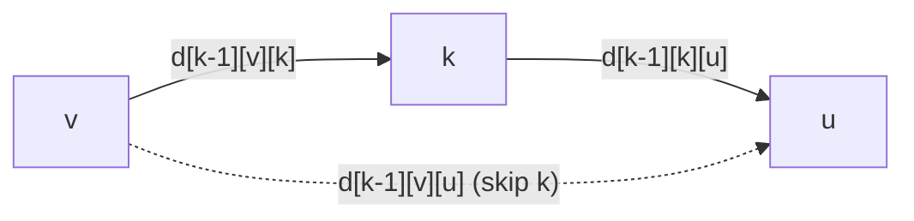

# S03E07 · Bellman-Ford & Floyd-Warshall

> **Source:** Pavel Mavrin, [_A&DS S03E07_](https://youtu.be/3gW3cBlA_6E) · 1h35m lecture → ~14 min read.
> Every section deep-links back to the exact moment on the board.

## TL;DR

- With **non-negative** weights you use BFS or Dijkstra. Once edges can be **negative**, Dijkstra breaks and you switch to Bellman-Ford or Floyd-Warshall.
- A **negative cycle** makes "shortest path" undefined — you can loop it forever and drive the cost to $-\infty$. Finding a shortest *simple* path instead is NP-hard (it encodes Hamiltonian path), so the problem is only well-posed when **every cycle has non-negative total weight**.
- **Bellman-Ford** is a DP over the number of edges: a shortest path is simple, so it uses at most $V-1$ edges. Run $V-1$ **relaxation rounds** over all edges → $O(VE)$.
- The DP compresses from a $V \times V$ table to **one 1-D array** relaxed in place; a $V$-th round that still improves something proves a **reachable negative cycle**.
- **Floyd-Warshall** is a DP over allowed **intermediate vertices** $d[k][i][j]$ — all pairs in $O(V^3)$, works with negative edges, and flags a negative cycle when any **diagonal** entry $d[v][v]$ goes below zero.
- **Johnson's algorithm** reweights edges via a potential $\varphi$ (from one Bellman-Ford run) so all weights become non-negative, then runs Dijkstra from every source — better than Floyd-Warshall on sparse graphs.

---

## Why negative edges are hard

- Last lectures: BFS and Dijkstra solve shortest paths when **all weights are non-negative**. Negative edges need a different tool.
- **Negative cycle = no shortest path.** Take a cycle whose weight sum is negative (say net $-5$ around the loop). Any $s \to t$ path can detour through it once for $-5$, twice for $-10$, $k$ times for $-5k$ — unbounded below, so no minimum exists.
- **What if we forbid repeats (shortest *simple* path)?** That problem is **NP-hard**. Give every edge weight $-1$; the shortest simple path then maximizes edge count, i.e. solves **Hamiltonian path**. So we cannot escape the issue by banning cycles.
- **The clean model:** allow negative *edges* but require **every cycle to have non-negative weight sum**. Then any shortest path can drop its cycles without increasing length, so a shortest path that is **simple** always exists — and a simple path has at most $V-1$ edges.


[watch from 1:58](https://youtu.be/3gW3cBlA_6E?t=118)

---

## Bellman-Ford as a DP over edge count

- **State.** $d[v][k]$ = length of the shortest path from source $s$ to $v$ using **at most $k$ edges**.
- **Base case** ($k = 0$): the only 0-edge path is the empty path at $s$.

$$
d[v][0] = \begin{cases} 0 & v = s \\ +\infty & v \ne s \end{cases}
$$

- **Transition** ($k-1 \to k$). A shortest path of at most $k$ edges either already used $\le k-1$ edges, or its last edge is some $u \to v$. Minimize over both:

$$
d[v][k] = \min\!\left( d[v][k-1],\ \min_{(u,v)\,\in\,E}\big(d[u][k-1] + w(u,v)\big) \right)
$$

- The answer is $d[v][V-1]$, since a simple shortest path has at most $V-1$ edges.

![Bellman-Ford DP: d[v][k] is the shortest s-to-v path with at most k edges, split into the two transition cases](/img/dsa/3gW3cBlA_6E/frame-00090.png)

**Explicit two-row DP (faithful to the board):**

```cpp
#include <bits/stdc++.h>
using namespace std;
const long long INF = LLONG_MAX / 4;
struct Edge { int u, v; long long w; };

// d[v][k] over rows; only the previous row is ever needed, so keep two rows.
vector<long long> bellman_ford_dp(int n, const vector<Edge>& edges, int src) {
    vector<long long> prev(n, INF), cur(n, INF);
    prev[src] = 0;                                   // row k = 0
    for (int k = 1; k <= n - 1; k++) {
        cur = prev;                                  // case 1: at most k-1 edges
        for (const Edge& e : edges)                  // case 2: last edge is u -> v
            if (prev[e.u] < INF)
                cur[e.v] = min(cur[e.v], prev[e.u] + e.w);
        swap(prev, cur);
    }
    return prev;                                     // distances with <= n-1 edges
}
```

- **Complexity.** Outer loop runs $V-1$ times; each round scans **all edges** (iterating every vertex and every incoming edge sums to $E$). Total $O(VE)$ — much slower than Dijkstra's $O(E \log V)$, but it survives negative edges.
- **Memory.** The full table is $V \times V$, but each row only needs the previous one — keep **two rows** for $O(V)$ space.


**Worked trace (lecture graph).** Vertices $1..4$, source $1$, edges $1\!\to\!2\,(4)$, $1\!\to\!3\,(-5)$, $2\!\to\!3\,(3)$, $3\!\to\!4\,(-1)$, $4\!\to\!2\,(2)$:

| $k$ | $d[1]$ | $d[2]$ | $d[3]$ | $d[4]$ |
| --- | --- | --- | --- | --- |
| 0 | 0 | $\infty$ | $\infty$ | $\infty$ |
| 1 | 0 | 4 | $-5$ | $\infty$ |
| 2 | 0 | 4 | $-5$ | $-6$ |
| 3 | 0 | $-4$ | $-5$ | $-6$ |

At $k=3$, vertex 2 drops to $-4$ via $4 \to 2$: $d[4] + 2 = -6 + 2$. The final row is the answer.

[watch from 11:19](https://youtu.be/3gW3cBlA_6E?t=679)

---

## Single 1-D array: relax until stable

- Collapse the two rows into **one array** $d$ and relax edges in place. Reading $d[u]$ "from the current row" only ever helps — it can carry a shorter path forward within a single pass.
- **Invariant.** $d[v]$ is always the length of *some* real path $s \to v$ (or $+\infty$), and after $k$ passes $d[v]$ is no worse than the shortest path using at most $k$ edges. So $V-1$ passes suffice.
- **Order does not affect correctness, only speed.** A left-to-right edge order can finish in one pass; a reverse order needs the full $V-1$. On a random shuffle the expected number of useful passes is about $V/2$ (each pass tends to settle roughly two more path edges) — still linear, so no asymptotic win.
- **Early exit + negative-cycle detection.** If a full pass changes nothing, the distances are final — stop. If a $V$-th pass *still* improves something, there is a reachable **negative cycle** (a shortest path would need more than $V-1$ edges).

```cpp
// Relax-until-stable Bellman-Ford on one array.
// Returns {dist, reachable-negative-cycle?}.
pair<vector<long long>, bool>
bellman_ford_relax(int n, const vector<Edge>& edges, int src) {
    vector<long long> d(n, INF);
    d[src] = 0;
    for (int iter = 0; iter < n - 1; iter++) {
        bool ok = true;                              // "ok" == nothing changed
        for (const Edge& e : edges)
            if (d[e.u] < INF && d[e.u] + e.w < d[e.v]) {
                d[e.v] = d[e.u] + e.w;               // relaxation
                ok = false;
            }
        if (ok) break;                               // converged early
    }
    bool neg = false;                                // one extra (n-th) round
    for (const Edge& e : edges)
        if (d[e.u] < INF && d[e.u] + e.w < d[e.v]) neg = true;
    return {d, neg};
}
```

- **Data structure.** Just the flat edge list plus one distance array — the invariant it maintains is "each $d[v]$ equals the length of a concrete path, tightened toward the optimum every round."

![Bellman-Ford relax-until-stable: initialize d[s]=0, loop while values still change, break when a pass leaves d untouched](/img/dsa/3gW3cBlA_6E/frame-00217.png)

[watch from 30:24](https://youtu.be/3gW3cBlA_6E?t=1824)

---

## Floyd-Warshall: all pairs via intermediate vertices

- **Different problem.** Compute the distance between **every** pair $(v, u)$, not just from one source. Running Bellman-Ford from all $V$ sources costs $O(V^2 E)$; a dedicated DP does far better.
- **State.** $d[k][v][u]$ = shortest $v \to u$ path whose **intermediate** vertices all have index $\le k$.
- **Base case** ($k = 0$): no intermediate vertices allowed, so only a direct edge counts.

$$
d[0][v][u] = \begin{cases} w(v,u) & (v,u) \in E \\ 0 & v = u \\ +\infty & \text{otherwise} \end{cases}
$$

- **Transition** ($k-1 \to k$). Either the best path avoids vertex $k$ (inherit the previous layer), or it passes through $k$ exactly once, splitting into two sub-paths that only use vertices $\le k-1$:

$$
d[k][v][u] = \min\!\big( d[k-1][v][u],\ d[k-1][v][k] + d[k-1][k][u] \big)
$$

![Floyd-Warshall DP: d[k][v][u] allows intermediate vertices up to k; the path either skips k or routes v to k to u](/img/dsa/3gW3cBlA_6E/frame-00264.png)

- **In place.** The $k$-th layer only reads the $(k-1)$-th, and updating in a single 2-D matrix is provably safe, so drop the first index entirely.

```cpp
// All-pairs shortest paths. d is n x n: w(i,j), 0 on the diagonal, INF for no edge.
// Returns {dist matrix, negative-cycle-present?}.
pair<vector<vector<long long>>, bool>
floyd_warshall(int n, vector<vector<long long>> d) {
    for (int k = 0; k < n; k++)                      // intermediate vertex
        for (int i = 0; i < n; i++)                  // source
            for (int j = 0; j < n; j++)              // target
                if (d[i][k] < INF && d[k][j] < INF)
                    d[i][j] = min(d[i][j], d[i][k] + d[k][j]);
    bool neg = false;
    for (int v = 0; v < n; v++)
        if (d[v][v] < 0) neg = true;                 // negative cycle through v
    return {d, neg};
}
```

- **Complexity.** Three nested loops over $V$ → $O(V^3)$, with a tiny constant factor (one add + one compare in the hot loop). On a dense graph ($E \approx V^2$) this beats the $O(V^2 E) = O(V^4)$ of "Bellman-Ford from every source."
- **Negative-cycle detection.** After running, if any diagonal entry $d[v][v] < 0$, then some $v \to v$ loop has negative weight — a negative cycle exists.

![Floyd-Warshall triple loop d[v][u]=min(d[v][u], d[v][k]+d[k][u]); a negative diagonal d[v][v] under 0 signals a negative cycle](/img/dsa/3gW3cBlA_6E/frame-00284.png)



[watch from 52:11](https://youtu.be/3gW3cBlA_6E?t=3131)

---

## Detecting negative cycles (both algorithms)

- **Floyd-Warshall:** after the DP, scan the diagonal. Any $d[v][v] < 0$ means a negative cycle passes through $v$. (You can even check the diagonal after each $k$-layer.)
- **Bellman-Ford:** run the standard $V-1$ relaxation rounds, then do **one more**. If that $V$-th round still relaxes any edge, a shortest walk would need more than $V-1$ edges — impossible without a negative cycle — so one is present and reachable.
- **Why $V-1$ is always enough (no false negatives).** Every cycle has at least two vertices, so it contains some vertex of index $\le V-1$; a genuine negative cycle is therefore exposed by round $V-1$ at the latest.

[watch from 1:04:30](https://youtu.be/3gW3cBlA_6E?t=3870)

---

## Johnson's algorithm: reweight, then Dijkstra

- **Goal.** Run fast Dijkstra even with negative edges by transforming to an equivalent **non-negative** graph.
- **Potential reweighting.** Assign each vertex a potential $\varphi$ and define

$$
w'(u, v) = w(u, v) + \varphi(u) - \varphi(v).
$$

- **Paths shift by a constant.** For any path $s \to t$ the middle potentials telescope, so its new length is $\text{len}(s \to t) + \varphi(s) - \varphi(t)$. Every $s \to t$ path shifts by the same $\varphi(s) - \varphi(t)$, so the **shortest path is unchanged** — only its numeric length differs.


- **Choosing $\varphi$.** Pick a vertex $s$ that reaches everything and set $\varphi(v) = \text{dist}(s, v)$ (computed by one **Bellman-Ford** run). Then non-negativity of $w'$ is exactly the triangle inequality:

$$
\text{dist}(s,v) \le \text{dist}(s,u) + w(u,v) \iff w'(u,v) = w(u,v) + \varphi(u) - \varphi(v) \ge 0.
$$

- **No universal source?** Add a virtual vertex with 0-weight edges to all others. It has only outgoing edges, so it creates no new cycles — negative cycles are neither added nor hidden. (In code you can skip the extra vertex and just start Bellman-Ford with **all distances at 0**.)
- **Why bother, if it uses Bellman-Ford anyway?** You run Bellman-Ford **once**, then Dijkstra **many** times (e.g. all-pairs, or repeated single-source queries). Total $O(VE + V \cdot E\log V)$, which on **sparse** graphs beats Floyd-Warshall's $O(V^3)$.

[watch from 1:12:30](https://youtu.be/3gW3cBlA_6E?t=4350)

---

## Complexity recap

| Algorithm | Problem | Time | Space | Negative edges | Detects neg. cycle |
| --- | --- | --- | --- | --- | --- |
| Dijkstra (binary heap) | single source | $O(E \log V)$ | $O(V)$ | ❌ | ❌ |
| Bellman-Ford | single source | $O(VE)$ | $O(V)$ | ✅ | ✅ ($V$-th round) |
| Floyd-Warshall | all pairs | $O(V^3)$ | $O(V^2)$ | ✅ | ✅ (diagonal) |
| Johnson | all pairs | $O(VE + VE\log V)$ | $O(V^2)$ | ✅ | ✅ (via BF) |

- All C++ blocks above were compiled with `c++ -std=c++17` and cross-checked: Bellman-Ford and Floyd-Warshall agree with Dijkstra on non-negative graphs, reproduce the lecture's $[0, -4, -5, -6]$ trace, and both flag a real negative cycle.

---

## Practice problems

**🎯 Interview (MAANG-style)**

- [Cheapest Flights Within K Stops — LeetCode 787](https://leetcode.com/problems/cheapest-flights-within-k-stops/) — Medium — the edge-bounded Bellman-Ford DP: relax exactly $K+1$ rounds on a copied array.
- [Network Delay Time — LeetCode 743](https://leetcode.com/problems/network-delay-time/) — Medium — single-source shortest paths; Bellman-Ford or Dijkstra, answer is the max distance.
- [Find the City With the Smallest Number of Neighbors at a Threshold Distance — LeetCode 1334](https://leetcode.com/problems/find-the-city-with-the-smallest-number-of-neighbors-at-a-threshold-distance/) — Medium — textbook Floyd-Warshall, then count reachable cities per node.
- [Detonate the Maximum Bombs — LeetCode 2101](https://leetcode.com/problems/detonate-the-maximum-bombs/) — Medium — build a reachability graph, then Floyd-Warshall-style transitive closure (or DFS from each bomb).
- [Bellman-Ford Algorithm — GeeksforGeeks](https://www.geeksforgeeks.org/bellman-ford-algorithm-dp-23/) — Medium — the canonical single-source implementation with negative-cycle detection.
- [Floyd-Warshall Algorithm — GeeksforGeeks](https://www.geeksforgeeks.org/floyd-warshall-algorithm-dp-16/) — Medium — the all-pairs triple loop, in place.

**🏆 Competitive**

- [Shortest Routes II — CSES 1672](https://cses.fi/problemset/task/1672) — Medium — direct Floyd-Warshall all-pairs with many queries; watch for INF overflow on unreachable pairs.
- [High Score — CSES 1673](https://cses.fi/problemset/task/1673) — Hard — Bellman-Ford with negative-cycle detection *restricted to the s→t path* (only cycles reachable from $s$ and able to reach $t$ count).
- [Cycle Finding — CSES 1197](https://cses.fi/problemset/task/1197) — Hard — detect a negative cycle with Bellman-Ford and reconstruct it via parent pointers.

> No official Codeforces home-task post is linked in this lecture's description, so the competitive set above is curated from CSES's shortest-path section, which mirrors the lecture exactly.

---

## Further reading

- [Bellman-Ford algorithm — cp-algorithms](https://cp-algorithms.com/graph/bellman_ford.html) — implementation, path reconstruction, and negative-cycle retrieval.
- [Floyd-Warshall algorithm — cp-algorithms](https://cp-algorithms.com/graph/all-pair-shortest-path-floyd-warshall.html) — all-pairs DP plus negative-cycle handling.
- [Bellman-Ford — Wikipedia](https://en.wikipedia.org/wiki/Bellman%E2%80%93Ford_algorithm) and [Floyd-Warshall — Wikipedia](https://en.wikipedia.org/wiki/Floyd%E2%80%93Warshall_algorithm).
- [Johnson's algorithm — Wikipedia](https://en.wikipedia.org/wiki/Johnson%27s_algorithm) — the reweighting trick in full.

---

## Key takeaways

- Negative edges are fine; **negative cycles** are what break the problem — Bellman-Ford flags them with a $V$-th round, Floyd-Warshall with a negative diagonal.
- Bellman-Ford is a DP over **edge count**: at most $V-1$ rounds of relaxing every edge, $O(VE)$, $O(V)$ memory with the 1-D array.
- Floyd-Warshall is a DP over **intermediate vertices**: $d[k][i][j]$ in $O(V^3)$, compressed to a single in-place matrix.
- Johnson's **potential reweighting** turns a negative-edge graph into a non-negative one (preserving shortest paths) so Dijkstra can run repeatedly — the sparse-graph winner for all-pairs.

## Glossary

- **Relaxation** — updating $d[v] \leftarrow \min(d[v],\ d[u] + w(u,v))$ along an edge.
- **Negative cycle** — a directed cycle whose edge weights sum below zero; makes shortest paths undefined.
- **Simple path** — a path with no repeated vertex; has at most $V-1$ edges.
- **Intermediate vertex** — in Floyd-Warshall, any vertex on a path other than its two endpoints.
- **Potential** $\varphi$ — a per-vertex value used to reweight edges to non-negative while preserving shortest paths.
