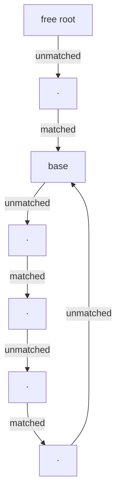

# S04E02 · Maximum Matchings in Non-Bipartite Graphs

> **Source:** Pavel Mavrin, [_A&DS S04E02_](https://youtu.be/CqyECZ_gqZ4) · 1h16m lecture → ~15 min read.
> Every section deep-links back to the exact moment on the board.

## TL;DR

- The plan is identical to bipartite matching: start empty, repeatedly find an **augmenting path** (free-to-free, edges alternating out-of/in matching), invert it to grow the matching by one. The theorem still holds: **a matching is maximum if and only if no augmenting path exists**.
- The **catch**: without a left/right split there is no way to orient edges, so a plain DFS cannot be forced to walk only *simple* alternating paths. A **state-tagged DFS** (state $0$ = last edge unmatched, state $1$ = last edge matched) works — until an **odd cycle** makes one node reachable in *both* states.
- That two-state conflict is exactly a **blossom** (Edmonds' 1965 "Paths, Trees, and Flowers"): an odd alternating cycle hanging off an even alternating stem. Naive search fails here because visiting the node in the "wrong" parity hides a real augmenting path.
- **Fix — contract the blossom** into a single super-node, recurse on the smaller graph $G'$, then **lift** any augmenting path found in $G'$ back to $G$ by walking the even side of the odd cycle. Correctness rests on: an augmenting path exists in $G$ iff one exists in $G'$.
- Naive contraction-and-recurse runs in $O(V^3)$ (equivalently $O(VE)$); with a single fused DFS plus a union–find for the contracted sets it drops to about $O(V \cdot E)$. The best known bound is $O(\sqrt{V}\,E)$ (Micali–Vazirani) but is far harder to code.

---

## The setup: same augmenting-path skeleton as bipartite

- A **matching** $M$ is a set of edges with no shared endpoint. A vertex is **free** if no matching edge touches it.
- An **augmenting path** is a simple path whose two endpoints are free and whose edges alternate not-in-$M$, in-$M$, not-in-$M$, …, ending not-in-$M$. Since it starts and ends unmatched, it has an **odd** number of edges, one more unmatched than matched.
- **Invert** it (swap matched and unmatched along the path) and $|M|$ grows by exactly one. The board draws a 5-edge path: after inversion the three unmatched edges become matched.

$$
|M|\ \text{is maximum} \iff \text{there is no augmenting path (Berge's theorem)}.
$$

- Proved last lecture; it is graph-agnostic, so it carries over verbatim to general graphs. The whole difficulty is purely in *finding* the augmenting path.


[watch from 1:24](https://youtu.be/CqyECZ_gqZ4?t=84)

---

## Why the bipartite trick dies

- In a bipartite graph you orient every unmatched edge left→right and every matched edge right→left; then *any* directed DFS path is automatically alternating and simple, so a plain DFS finds an augmenting path.
- In a general graph there is **no left/right**, so there is no orientation that turns "alternating" into "just follow directed edges". We must teach the DFS about the matching directly.
- **State-tagged DFS.** Carry a state with the current vertex: `state = 0` means the previous edge was **not** in $M$ (so next we must take a matched edge); `state = 1` means the previous edge **was** in $M$ (so next we must take an unmatched edge). Start from a free vertex in state $0$.

```text
dfs(v, state):
    if state == 0:                      # last edge was unmatched
        for (v,u) not in M:             #   → take a MATCHED edge next
            dfs(u, 1)
    else:                               # state == 1, last edge was matched
        for the unique (v,u) in M:      #   → take an UNMATCHED edge next
            dfs(u, 0)
    ...                                 # rest is a normal DFS: visited-marks,
                                        # on reaching a free node, invert path
```

- A matched vertex has exactly one matching edge, so the `state == 1` branch has a single choice; the `state == 0` branch fans out over all unmatched edges.


[watch from 5:04](https://youtu.be/CqyECZ_gqZ4?t=304)

---

## The bug: one node, two parities

- **First idea — one visited-mark per node** (like ordinary DFS): fails. A node might be reachable in state $0$ along one branch and in state $1$ along another; if we mark it on the first (wrong-parity) visit, the branch that needed the *other* parity is blocked, and a genuine augmenting path is missed.
- **Second idea — two visited-marks, one per (node, state) pair:** also fails, and worse. Now a node can appear in the path in **both** states, so the "path" the DFS returns revisits a vertex — it is **not simple**. A non-simple path cannot be inverted: some edge would flip its status twice, corrupting $M$.
- So the danger sign is precise: **a node that the DFS tries to visit in two different states.** That can only arise from an **odd cycle** — in a bipartite (even-cycle-only) graph every node has a fixed parity from the free start, and this never happens.

**Small theorem (why the DFS is otherwise complete).** If the DFS from the free roots produces **no** node reachable in two states, then the reachable subgraph splits cleanly into a state-$0$ set and a state-$1$ set — a bipartite subgraph. On a bipartite subgraph the state-DFS is exactly the bipartite augmenting search, which is correct by induction. So:

- **Outcome 1 — an augmenting path is found:** invert it, $|M|{+}{+}$.
- **Outcome 2 — no augmenting path and no two-state node:** the reachable part is bipartite and searched correctly, so no augmenting path exists at all → $M$ is **maximum**.
- **Outcome 3 — a node reached in two states (a "problem node"):** an odd alternating cycle is present. This is the interesting case.


[watch from 16:11](https://youtu.be/CqyECZ_gqZ4?t=971)

---

## The blossom

- A problem node means two alternating paths from the free root reach the **same** vertex with **opposite** parity. Take the two paths; walk to the **closest common vertex** and keep only the shared prefix (the **stem**). What remains past that junction is an **odd alternating cycle** — the **blossom**.
- Structure (Edmonds' flower metaphor from *Paths, Trees, and Flowers*):
  - the **stem** is an even alternating path from a free vertex to the cycle's **base**;
  - the **cycle** has odd length, edges alternating, and both edges incident to the base inside the cycle are **unmatched**;
  - the base is the unique cycle vertex matched *outward* (via the stem) or free.



- **Finding it inside the DFS is cheap.** In an undirected DFS a cycle always closes onto an ancestor. When the search sits at `v` in some state and finds an edge to a node `u` already visited in the *wrong* state, the blossom is exactly the top slice of the recursion stack between `u` and `v`.


[watch from 27:30](https://youtu.be/CqyECZ_gqZ4?t=1650)

---

## Contract, recurse, lift

**Contract.** Replace every vertex of the blossom by a single super-node $b$. Re-route each edge that had an endpoint inside the blossom to start from $b$ instead. This yields a smaller graph $G'$. Blossoms can nest: a later search may find a blossom containing $b$, contract again, and so on.

- The super-node $b$ enters the search in **state $0$** (it behaves like an unmatched-side vertex reached from the stem), so recursion in $G'$ is a valid continuation.

**Recurse.** Run the same state-DFS on $G'$. Three things can happen:

1. It finds an augmenting path in $G'$ → lift it back (below).
2. It finds another blossom → contract and recurse deeper.
3. It finds nothing → then (proved below) $G$ has no augmenting path either, so return "maximum".

**Lift.** Given an augmenting path $P'$ in $G'$:

- If $P'$ **does not touch** $b$, it is already a valid path in $G$ — copy it.
- If $P'$ **passes through** $b$, expand $b$ back into the odd cycle. $P'$ enters the blossom at some cycle vertex $x$ and leaves at the base (through the stem edge). Reconnect $x$ to the base **around the cycle**: because the cycle is odd, exactly **one** of the two arcs (clockwise / counter-clockwise) is an **even alternating** path from $x$ to the base — pick that one. The stitched path is a valid augmenting path in $G$.


[watch from 33:10](https://youtu.be/CqyECZ_gqZ4?t=1990)

---

## Why contraction preserves matchability (correctness)

The one fact the whole algorithm rests on:

$$
\exists\ \text{augmenting path in } G \iff \exists\ \text{augmenting path in } G' .
$$

The lecture proves the "$G \Rightarrow G'$" direction (the other is easy) by a chain of three equivalences through two auxiliary graphs $H, H'$ built by **inverting the stem**:

- Let $M$ be the current matching in $G$ with a blossom on stem $s$. Build $H$ from $G$ by **inverting the alternating stem** from the free root to the base. Inverting an alternating path that starts at a free node yields another valid matching **of the same size**, and now the blossom's **base is free**. Build $H'$ from $G'$ the same way (the base super-node is free).
- Each arrow below is "same-size matching, so *not maximum* transfers, so *has an augmenting path* transfers":

$$
\text{a.p. in } G \iff \text{a.p. in } H \iff \text{a.p. in } H' \iff \text{a.p. in } G' .
$$

- The crucial middle step $H \iff H'$: with the base **free**, any augmenting path that enters the blossom can be **cut** at the first blossom vertex it meets — because that base is free, the cut prefix is *itself* a shorter augmenting path from its far free endpoint to the base, which lives identically in $H'$ where the blossom is a single free node. Conversely an augmenting path in $H'$ using the free super-node expands into one in $H$.
- The proof is **existential, not constructive**: it certifies a path exists but does not hand you one — that is why lifting needs the explicit "walk the even arc" construction, and why a contracted long path is generally *not* an augmenting path if you naively expand it (two consecutive edges can fail to alternate).


[watch from 45:21](https://youtu.be/CqyECZ_gqZ4?t=2721)

---

## Complexity

- **Augmentations.** Each augmenting path grows $|M|$ by one, and $|M| \le V/2$, so at most $O(V)$ augmentation phases.
- **Per phase, naive contract-and-recurse.** Each contraction removes at least one vertex, so at most $O(V)$ contractions per phase; each DFS/contraction/lift is $O(V+E)$ linear work. That is $O(V\cdot(V+E)) = O(V^2)$ per phase (dense: $O(VE)$).

$$
O(V) \ \text{phases} \times O(V \cdot (V{+}E)) = O(V^3) \quad(\text{equivalently } O(V\,E)).
$$

- **Fused single-DFS speedup.** Instead of restarting, do everything inside one DFS per phase: contract blossoms on the recursion stack in place, and on return invert the path and expand blossoms. Summing contraction costs telescopes: if blossom $i$ has size $k_i$ then $\sum k_i \le V + (\text{number of contractions}) = O(V)$, because each contraction with cost $k$ reduces the vertex count $n' = n - k + 1$. So a phase is $O(V+E)$ and the total is:

$$
O\big(V \cdot (V + E)\big) \approx O(V\,E).
$$

- **The catch:** to map an endpoint of a stray edge back to the super-node currently containing it, you need a **union–find** structure over contracted sets. That multiplies the bound by the inverse-Ackermann factor $\alpha(V)$ — negligible in practice.
- **Best known:** $O(\sqrt{V}\,E)$ via Micali–Vazirani (the general-graph analogue of Hopcroft–Karp). Correct but intricate; not covered here.


[watch from 59:41](https://youtu.be/CqyECZ_gqZ4?t=3581)

---

## Implementation (C++17)

The canonical BFS-tree variant of the blossom algorithm. `findPath(root)` grows an alternating BFS tree from a free `root`; `lca` locates a blossom base; `markPath` relabels a blossom's vertices to their base via the `base[]` union structure (contraction without physically deleting nodes). Compiled with `c++ -std=c++17` and stress-tested against brute force below.

```cpp
#include <bits/stdc++.h>
using namespace std;

// Edmonds' blossom algorithm — general (non-bipartite) maximum matching. O(V^3).
struct Blossom {
    int n;
    vector<vector<int>> g;
    vector<int> match, p, base;      // match[v] partner or -1; p[] BFS parent; base[] contracted rep
    vector<bool> used, blossom;

    Blossom(int n_) : n(n_), g(n_), match(n_, -1), p(n_), base(n_) {}
    void add_edge(int a, int b) { g[a].push_back(b); g[b].push_back(a); }

    // lowest common "base" of the alternating tree paths from a and b
    int lca(int a, int b) {
        vector<bool> seen(n, false);
        for (;;) { a = base[a]; seen[a] = true; if (match[a] == -1) break; a = p[match[a]]; }
        for (;;) { b = base[b]; if (seen[b]) return b; b = p[match[b]]; }
    }

    // walk from v up to base b, tagging every vertex on the odd cycle as blossom
    void markPath(int v, int b, int child) {
        while (base[v] != b) {
            blossom[base[v]] = true;
            blossom[base[match[v]]] = true;
            p[v] = child;
            child = match[v];
            v = p[match[v]];
        }
    }

    // BFS an alternating tree from a free root; return the far free end of an
    // augmenting path, or -1 if none is reachable
    int findPath(int root) {
        used.assign(n, false);
        p.assign(n, -1);
        for (int i = 0; i < n; i++) base[i] = i;
        used[root] = true;
        queue<int> q; q.push(root);
        while (!q.empty()) {
            int v = q.front(); q.pop();
            for (int to : g[v]) {
                if (base[v] == base[to] || match[v] == to) continue;
                if (to == root || (match[to] != -1 && p[match[to]] != -1)) {
                    // odd cycle closes onto the tree → contract the blossom
                    int cur = lca(v, to);
                    blossom.assign(n, false);
                    markPath(v, cur, to);
                    markPath(to, cur, v);
                    for (int i = 0; i < n; i++)
                        if (blossom[base[i]]) {
                            base[i] = cur;
                            if (!used[i]) { used[i] = true; q.push(i); }
                        }
                } else if (p[to] == -1) {
                    p[to] = v;
                    if (match[to] == -1) return to;   // reached a free vertex → augmenting path
                    used[match[to]] = true;
                    q.push(match[to]);
                }
            }
        }
        return -1;
    }

    int solve() {
        int res = 0;
        for (int v = 0; v < n; v++)
            if (match[v] == -1) {
                int u = findPath(v);
                if (u != -1) {
                    res++;
                    while (u != -1) {            // invert the augmenting path
                        int pv = p[u], ppv = match[pv];
                        match[u] = pv; match[pv] = u;
                        u = ppv;
                    }
                }
            }
        return res;                              // size of the maximum matching
    }
};
```

**Verification harness** — exhaustive brute force over edge subsets, plus 5000 randomized graphs (up to 8 vertices, dense so odd cycles abound):

```cpp
int brute(int n, vector<pair<int,int>>& edges) {
    int m = edges.size(), best = 0;
    for (int mask = 0; mask < (1 << m); mask++) {
        vector<bool> used(n, false);
        bool ok = true; int cnt = 0;
        for (int i = 0; i < m && ok; i++) if (mask & (1 << i)) {
            int a = edges[i].first, b = edges[i].second;
            if (used[a] || used[b]) ok = false;
            else { used[a] = used[b] = true; cnt++; }
        }
        if (ok) best = max(best, cnt);
    }
    return best;
}

int main() {
    mt19937 rng(12345);
    auto run = [](int n, vector<pair<int,int>> edges) {
        Blossom B(n);
        for (auto& e : edges) B.add_edge(e.first, e.second);
        return make_pair(B.solve(), brute(n, edges));
    };
    { auto r = run(3, {{0,1},{1,2},{2,0}});                       assert(r.first==r.second && r.first==1); } // triangle
    { auto r = run(5, {{0,1},{1,2},{2,3},{3,4},{4,0}});           assert(r.first==r.second && r.first==2); } // C5
    { auto r = run(7, {{0,1},{1,2},{2,3},{3,4},{4,5},{5,1},{5,6}}); assert(r.first==r.second); }             // blossom + stem
    { auto r = run(6, {{0,1},{1,2},{2,0},{0,3},{1,4},{2,5}});     assert(r.first==r.second && r.first==3); } // triangle + pendants

    int trials = 5000, fails = 0;
    for (int t = 0; t < trials; t++) {
        int n = 2 + rng() % 7;
        vector<pair<int,int>> edges;
        for (int a = 0; a < n; a++)
            for (int b = a + 1; b < n; b++)
                if (rng() % 2) edges.push_back({a, b});
        Blossom B(n);
        for (auto& e : edges) B.add_edge(e.first, e.second);
        if (B.solve() != brute(n, edges)) fails++;
    }
    printf("stress trials=%d fails=%d\n", trials, fails);   // → stress trials=5000 fails=0
    return 0;
}
```

- Output: `stress trials=5000 fails=0` — the blossom matching size equals the brute-force maximum on every case, including triangles ($C_3$), $C_5$, and flowers.

[watch from 1:01:06](https://youtu.be/CqyECZ_gqZ4?t=3666)

---

## Complexity recap

| Quantity | Naive (contract + restart) | Fused single-DFS | Best known |
| --- | --- | --- | --- |
| Per augmentation phase | $O(V\cdot(V{+}E)) = O(V^2)$ | $O(V+E)\cdot\alpha(V)$ | — |
| Augmentation phases | $O(V)$ | $O(V)$ | $O(\sqrt{V})$ effective |
| **Total** | $O(V^3)=O(VE)$ | $O(VE\cdot\alpha(V))$ | $O(\sqrt{V}\,E)$ |
| Extra space | $O(V+E)$ | $O(V+E)$ | $O(V+E)$ |

- $V$ = vertices, $E$ = edges, $\alpha$ = inverse Ackermann. The lecture assumes $E \ge V$ (else split into components).

---

## Practice problems

General (non-bipartite) matching via blossoms is **advanced competitive material** — it is essentially never asked in an interview coding round. The interview-relevant skill is **bipartite** matching; blossoms only appear when the "left/right" split is impossible (odd cycles). The problems below are labelled honestly.

**🎯 Interview (MAANG-style) — bipartite matching, the nearest transferable skill**

- [Maximum Number of Accepted Invitations — LeetCode 1820](https://leetcode.com/problems/maximum-number-of-accepted-invitations/) — Medium — classic bipartite matching (Kuhn's augmenting-path DFS). *In a general graph you would need blossoms; here the boy/girl split keeps it bipartite.*
- [Maximum Bipartite Matching — GeeksforGeeks](https://www.geeksforgeeks.org/maximum-bipartite-matching/) — Medium — the Hungarian/Kuhn augmenting-path routine that this lecture generalizes.
- [Broken Calculator / Assignment style — bipartite modeling](https://leetcode.com/problems/campus-bikes-ii/) — Medium — min-cost assignment; a matching-flavored optimization interviewers do reach for.

**🏆 Competitive — general matching (blossom required)**

- [General Graph Maximum Matching — UOJ 79](https://uoj.ac/problem/79) — Hard — the canonical judge problem; submit a full blossom implementation.
- [General Matching — Library Checker](https://judge.yosupo.jp/problem/general_matching) — Hard — verifier for a correct blossom (outputs the matching itself, not just its size).
- [School Dance — CSES 1696](https://cses.fi/problemset/task/1696) — Medium — **bipartite** matching (max-flow), a stepping stone before tackling general graphs.

> No official Codeforces home-task post was linked in this lecture's description, so none is listed here.

---

## Further reading

- [Blossom algorithm — Wikipedia](https://en.wikipedia.org/wiki/Blossom_algorithm) — Edmonds' original construction, contraction and lifting.
- [Matching (graph theory) — Wikipedia](https://en.wikipedia.org/wiki/Matching_(graph_theory)) — definitions, Berge's theorem, König's theorem.
- [Tutte theorem — Wikipedia](https://en.wikipedia.org/wiki/Tutte_theorem) — the perfect-matching existence criterion for general graphs.
- [Tutte–Berge formula — Wikipedia](https://en.wikipedia.org/wiki/Tutte%E2%80%93Berge_formula) — the exact maximum-matching-size formula (min-max dual of matchings).
- [Hopcroft–Karp algorithm — Wikipedia](https://en.wikipedia.org/wiki/Hopcroft%E2%80%93Karp_algorithm) — the $O(\sqrt{V}\,E)$ bipartite algorithm the Micali–Vazirani bound generalizes.
- [Kuhn's algorithm for bipartite matching — cp-algorithms](https://cp-algorithms.com/graph/kuhn_maximum_bipartite_matching.html) — the bipartite base case, in code.

---

## Tutte–Berge and Tutte's theorem (the min-max dual)

- Beyond the algorithm, matching size has a closed-form **min-max** characterization. For a graph $G$, let $o(S)$ be the number of **odd-order components** of $G - S$ after deleting vertex set $S$. The **Tutte–Berge formula** gives the maximum matching size:

$$
\nu(G) = \frac{1}{2}\left(|V| - \max_{S \subseteq V}\big(o(G - S) - |S|\big)\right).
$$

- The quantity $\max_S\big(o(G-S) - |S|\big)$ is the **deficiency** — the number of vertices left unmatched by any maximum matching.
- **Tutte's theorem** is the perfect-matching special case: $G$ has a perfect matching **iff** $o(G - S) \le |S|$ for every $S \subseteq V$. (Take $S = \varnothing$: a perfect matching needs $|V|$ even.)
- These are the certificates the blossom algorithm implicitly produces — the set of contracted/exposed vertices at termination witnesses the maximizing $S$.

---

## Key takeaways

- The augmenting-path framework and Berge's theorem are unchanged from bipartite; only the **search** is hard in general graphs.
- The single obstruction is the **odd alternating cycle (blossom)**, detected as a vertex reachable in two different DFS states.
- **Contract** the blossom to a super-node, recurse, and **lift** the result by walking the even arc of the odd cycle — one of the two arcs is always even because the cycle length is odd.
- Correctness reduces to one equivalence: an augmenting path exists in $G$ iff it exists in the contracted $G'$ (proved by stem inversion through $H, H'$).
- Naive is $O(V^3)$; a fused DFS with union–find reaches roughly $O(VE)$; the state-of-the-art $O(\sqrt{V}\,E)$ is real but out of scope.

## Glossary

- **Matching** — an edge set with pairwise-disjoint endpoints.
- **Free vertex** — one not covered by any matching edge.
- **Alternating path** — a path whose edges alternate out-of-$M$ and in-$M$.
- **Augmenting path** — an alternating path between two free vertices; inverting it grows $|M|$ by one.
- **Blossom** — an odd alternating cycle (with an even stem to a free vertex); the structure that breaks naive search.
- **Base** — the blossom vertex joined to the stem (matched outward or free).
- **Contraction** — collapsing a blossom to one super-node to form $G'$.
- **Lifting** — expanding a super-node and rerouting an augmenting path through the even arc of its cycle.
- **Deficiency** — $\max_S(o(G-S)-|S|)$, the count of vertices no maximum matching can cover (Tutte–Berge).
