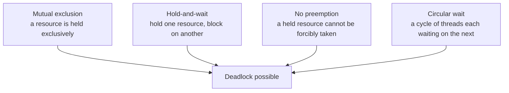
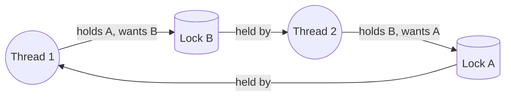
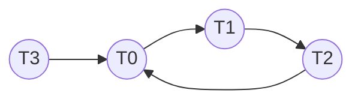

# Concurrency Bugs & Deadlock

**The crux:** threads sharing memory can produce results that no sequential reading of the code predicts. Some bugs come from *interleaving* — an update that looks atomic is split by a context switch, or code runs before the data it depends on exists. Others come from *waiting forever* — each thread holds a resource the next one needs, and the cycle never breaks. This page separates the two families, names the exact conditions that permit a deadlock, and works through the four ways to fight it: prevent it by construction, avoid it dynamically, detect-and-recover after the fact, or sidestep the busy-waiting cousin, livelock.

## The core idea

- Concurrency bugs split into two broad families, and studies of real software (databases, browsers, servers) find both are common:
  - **Non-deadlock bugs** — the majority. The program keeps running but computes the wrong thing. Two dominant sub-types: **atomicity violations** and **order violations**.
  - **Deadlock bugs** — the program stops making progress. A set of threads each wait on a resource another thread in the set holds, so none can proceed.
- **Atomicity violation:** a sequence of operations the programmer *assumed* was indivisible gets interleaved by another thread partway through. Fix: put the whole sequence under one lock so it is truly atomic.
- **Order violation:** the code assumes A happens before B, but nothing enforces it, so B can run first. Fix: enforce the ordering with a **condition variable** (wait until the precondition holds; signal when it does).
- **Deadlock** needs **four conditions simultaneously** (Coffman conditions) — remove any one and deadlock is impossible: **mutual exclusion**, **hold-and-wait**, **no preemption**, **circular wait**.
- Four strategies against deadlock, from cheapest-to-reason-about to most machinery:
  - **Prevention** — engineer the code so one Coffman condition can never hold. The workhorse is **total lock ordering**, which kills circular wait.
  - **Avoidance** — at runtime, grant a resource request only if the resulting state is still **safe** (a safe sequence exists). This is the **Banker's algorithm**.
  - **Detection & recovery** — allow deadlock, periodically build the **wait-for graph**, and if it has a **cycle**, break it by killing or rolling back a victim.
  - **Livelock** — a related failure where threads keep changing state but make no progress; the fix is randomized backoff.

## How it works

### Non-deadlock bug 1: atomicity violation

- A **read-modify-write** or a **check-then-act** that the programmer treats as one step, but that a scheduler can split. Classic shape: Thread 1 checks a pointer is non-null and then dereferences it; Thread 2 nulls it in the gap.

```c
// BUG: Thread 1 assumes (check proc, then use proc->state) is atomic.
//   if (proc != NULL) {            // Thread 1: check passes
//                                  // <-- Thread 2 runs: proc = NULL;
//       use(proc->state);         // Thread 1: dereferences NULL -> crash
//   }
// FIX: hold a lock across the whole check-then-act so nobody can interleave.
pthread_mutex_lock(&proc_lock);
if (proc != NULL) {
    use(proc->state);
}
pthread_mutex_unlock(&proc_lock);
```

- The fix is to make the assumed-atomic region *actually* atomic by wrapping it in a single critical section. The lock guarantees no other thread observes or mutates the shared state mid-sequence.

### Non-deadlock bug 2: order violation

- The code assumes an ordering between operations on two threads that the runtime does not guarantee. Classic shape: Thread 1 creates and stores an object; Thread 2 uses it — but Thread 2 may be scheduled first.

```c
// BUG: Thread 2 reads shared->data before Thread 1 has initialized it.
//   Thread 1:  shared = make_thing();     // may run second
//   Thread 2:  use(shared->data);         // may run first -> NULL deref
// FIX: a condition variable makes Thread 2 WAIT until the ordering holds.
pthread_mutex_lock(&m);
while (!ready)                 // wait until Thread 1 signals readiness
    pthread_cond_wait(&cv, &m);
use(shared->data);
pthread_mutex_unlock(&m);
// Thread 1, after initializing:
//   pthread_mutex_lock(&m); ready = 1; pthread_cond_signal(&cv); pthread_mutex_unlock(&m);
```

- A condition variable turns "I assumed B runs after A" into "B blocks until A signals it is done." The `while` loop (not `if`) re-checks the predicate after wake to guard against spurious wakeups.

### Deadlock: the four necessary conditions

All four must hold at once. Break any single one and deadlock cannot form.



- **Mutual exclusion** — at least one resource is non-shareable; only one thread holds it at a time.
- **Hold-and-wait** — a thread holding a resource requests another while keeping what it has.
- **No preemption** — a resource cannot be forcibly taken from the thread that holds it; it must be released voluntarily.
- **Circular wait** — there is a cycle of threads $T_0 \to T_1 \to \dots \to T_n \to T_0$ where each waits for a resource the next one holds.

### The canonical deadlock and its lock-ordering fix

- The textbook trigger: two threads, two locks, acquired in **opposite order**. Thread 1 grabs A then wants B; Thread 2 grabs B then wants A. If both take their first lock before either takes the second, each blocks forever holding what the other needs — a circular wait.



- **Fix — total lock ordering:** impose one global order on all locks (say, by address or by an assigned index) and require *every* thread to acquire locks in that order. A cycle in the wait-for graph would need some thread to acquire out of order, which the discipline forbids — so circular wait becomes impossible. See the compile-tested demo in [Must-know algorithms](#must-know-algorithms).

### Strategy 1: prevention — break a Coffman condition

- **Circular wait** → **total lock ordering** (above). The most practical prevention in real code: pick an order, hold it everywhere.
- **Hold-and-wait** → acquire *all* needed locks atomically up front (guarded by a meta-lock), or use **`trylock` + backoff**: try to grab the second lock without blocking; if it fails, release the first lock, back off, and retry. Releasing on failure means you never sit holding one lock while blocked on another.
- **No preemption** → allow a thread that cannot get a lock to *give up* the locks it holds (again `trylock`-style), making resources effectively preemptible.
- **Mutual exclusion** → avoid locks entirely with lock-free structures built on atomic primitives (compare-and-swap). Powerful but hard to get right.

### Strategy 2: avoidance — the Banker's algorithm

- Instead of preventing a condition structurally, **avoidance** decides per request whether granting it keeps the system **safe**. A state is **safe** if there exists at least one **safe sequence** — an ordering of processes such that each, in turn, can obtain its remaining maximum need from the currently available resources plus everything released by earlier processes in the sequence.
- The **Banker's algorithm** models each process's declared **maximum** demand, its current **allocation**, and its **need** ($\text{need} = \text{max} - \text{alloc}$). A tentative grant is allowed only if the resulting state is still safe. Unsafe does not mean deadlocked — it means deadlock *could* occur, so the request is denied (the process waits).
- Full compile-tested safety check with the classic textbook example is in [Must-know algorithms](#must-know-algorithms).

### Strategy 3: detection and recovery

- Let deadlock happen, then **detect** it by periodically building the **wait-for graph**: one node per thread, an edge $T_i \to T_j$ meaning $T_i$ is blocked waiting for a resource currently held by $T_j$. A **cycle** in this graph is a deadlock.
- **Recover** by breaking the cycle: kill one or more threads in it (choosing a low-cost **victim**), or **roll back** a thread to a checkpoint and release its resources. Databases do exactly this — a transaction deadlock is detected on the wait-for graph and one transaction is aborted and retried.



Above, `T0 -> T1 -> T2 -> T0` is a cycle (deadlock); `T3` waits on `T0` but is not itself in the cycle. Aborting any one of `T0`, `T1`, `T2` breaks it. Finding the cycle is exactly DFS cycle detection — see [Graphs, DFS & Topological Sort](/docs/dsa/s03-graphs-and-strings/s03e01-dfs-topological-sort) for the white/gray/black coloring the detector below uses.

### Livelock and random backoff

- **Livelock:** threads are not blocked — they keep running and changing state — yet make no forward progress. Classic case: two threads each `trylock`, both fail, both release and retry in lockstep, colliding again on every attempt, forever. CPU is busy; nothing gets done.
- **Fix — randomized backoff:** after a failed attempt, wait a *random* interval before retrying. Randomness desynchronizes the threads so one wins the next round. This is the same idea as exponential backoff in network protocols.

## Must-know algorithms

### 1. Deadlock demo + lock-ordering fix

The bug is two threads taking locks in opposite order. The fix is a single global order (here: always `A` before `B`), which makes circular wait impossible; the fixed program always runs to completion.

```c
// Deadlock demo and its lock-ordering fix.
// BUG (do not do this): thread 1 locks A then B; thread 2 locks B then A.
//   If each grabs its first lock before either grabs its second, they wait
//   on each other forever -> circular wait -> deadlock.
// FIX: impose a GLOBAL order and have every thread obey it (A before B).
//      A cycle would require some thread to violate the order, so none forms.
#include <stdio.h>
#include <pthread.h>

static pthread_mutex_t A = PTHREAD_MUTEX_INITIALIZER;
static pthread_mutex_t B = PTHREAD_MUTEX_INITIALIZER;
static long counter = 0;

// Both workers acquire in the SAME global order: A, then B.
static void *worker(void *arg) {
    (void)arg;
    for (int i = 0; i < 100000; i++) {
        pthread_mutex_lock(&A);
        pthread_mutex_lock(&B);
        counter++;                 // critical section protected by both
        pthread_mutex_unlock(&B);
        pthread_mutex_unlock(&A);
    }
    return NULL;
}

int main(void) {
    pthread_t t1, t2;
    pthread_create(&t1, NULL, worker, NULL);
    pthread_create(&t2, NULL, worker, NULL);
    pthread_join(t1, NULL);
    pthread_join(t2, NULL);
    // Runs to completion because both threads respect the global lock order.
    printf("fixed (global lock order A->B): completed, counter=%ld\n", counter);
    return 0;
}
```

Compile and run with `cc -std=c11 -pthread`. Output:

```
fixed (global lock order A->B): completed, counter=200000
```

The counter reaches exactly `200000` (two threads $\times$ 100000 increments) and the program terminates — no hang, because neither thread can ever hold `B` while waiting for `A`.

### 2. Banker's algorithm — safety check

Given `available`, per-process `max`, and current `alloc`, decide whether the state is **safe** and, if so, print a **safe sequence**. Run on the classic five-process, three-resource-type textbook example.

```c
// Banker's algorithm: is this allocation state safe? If so, print a safe order.
// Classic example: 5 processes (P0..P4), 3 resource types (A,B,C).
#include <stdio.h>
#include <stdbool.h>

#define P 5   // number of processes
#define R 3   // number of resource types

// Returns true and fills seq[] with a safe sequence if the state is safe.
static bool is_safe(int avail[R], int max[P][R], int alloc[P][R], int seq[P]) {
    int need[P][R];
    for (int i = 0; i < P; i++)
        for (int j = 0; j < R; j++)
            need[i][j] = max[i][j] - alloc[i][j];   // remaining demand

    int work[R];                                    // resources currently free
    for (int j = 0; j < R; j++) work[j] = avail[j];

    bool finish[P] = { false };
    int count = 0;

    while (count < P) {
        bool progressed = false;
        for (int i = 0; i < P; i++) {
            if (finish[i]) continue;
            bool can_run = true;                    // need[i] <= work ?
            for (int j = 0; j < R; j++)
                if (need[i][j] > work[j]) { can_run = false; break; }
            if (!can_run) continue;
            // Assume i finishes and releases everything it holds.
            for (int j = 0; j < R; j++) work[j] += alloc[i][j];
            seq[count++] = i;
            finish[i] = true;
            progressed = true;
        }
        if (!progressed) return false;              // no runnable process -> unsafe
    }
    return true;
}

int main(void) {
    int avail[R]     = { 3, 3, 2 };
    int max[P][R]    = { {7,5,3}, {3,2,2}, {9,0,2}, {2,2,2}, {4,3,3} };
    int alloc[P][R]  = { {0,1,0}, {2,0,0}, {3,0,2}, {2,1,1}, {0,0,2} };
    int seq[P];

    if (is_safe(avail, max, alloc, seq)) {
        printf("SAFE. sequence:");
        for (int i = 0; i < P; i++) printf(" P%d", seq[i]);
        printf("\n");
    } else {
        printf("UNSAFE\n");
    }
    return 0;
}
```

Compile and run with `cc -std=c11`. Output:

```
SAFE. sequence: P1 P3 P4 P0 P2
```

This matches the textbook: with `available = (3,3,2)`, `P1`'s need `(1,2,2)` fits, it runs and releases, freeing enough for `P3`, then `P4`, `P0`, and finally `P2`. The state is safe, and `<P1, P3, P4, P0, P2>` is a valid safe sequence. (Other safe sequences may also exist; the algorithm reports one.)

### 3. Deadlock detection — cycle in the wait-for graph

Build the wait-for graph (edge $T_i \to T_j$ = "$T_i$ waits for a lock held by $T_j$") and find a cycle with DFS three-coloring. A back-edge to a gray (on-stack) node is a cycle.

```c
// Deadlock detection: find a cycle in the wait-for graph via DFS coloring.
// Edge i->j means thread i is waiting for a resource held by thread j.
#include <stdio.h>
#include <stdbool.h>
#include <string.h>

#define N 4

static int  adj[N][N];      // adj[i][j] = 1 : edge i -> j
static int  color[N];       // 0=white(unseen) 1=gray(on stack) 2=black(done)
static int  parent[N];
static int  cyc_start, cyc_end;   // a back-edge cyc_end -> cyc_start closes the cycle

static bool dfs(int u) {
    color[u] = 1;
    for (int v = 0; v < N; v++) {
        if (!adj[u][v]) continue;
        if (color[v] == 1) { cyc_start = v; cyc_end = u; return true; } // back-edge
        if (color[v] == 0) { parent[v] = u; if (dfs(v)) return true; }
    }
    color[u] = 2;
    return false;
}

static bool has_cycle(void) {
    memset(color, 0, sizeof color);
    memset(parent, -1, sizeof parent);
    for (int i = 0; i < N; i++)
        if (color[i] == 0 && dfs(i)) return true;
    return false;
}

int main(void) {
    // T0 -> T1 -> T2 -> T0 is a circular wait; T3 waits on T0 but is outside it.
    adj[0][1] = 1;
    adj[1][2] = 1;
    adj[2][0] = 1;
    adj[3][0] = 1;

    if (has_cycle()) {
        printf("DEADLOCK detected. cycle:");
        int path[N + 1], k = 0, x = cyc_end;
        while (x != cyc_start) { path[k++] = x; x = parent[x]; }
        path[k++] = cyc_start;
        for (int i = k - 1; i >= 0; i--) printf(" T%d ->", path[i]);
        printf(" T%d\n", cyc_start);        // close the loop back to the start
    } else {
        printf("no deadlock\n");
    }
    return 0;
}
```

Compile and run with `cc -std=c11`. Output:

```
DEADLOCK detected. cycle: T0 -> T1 -> T2 -> T0
```

The detector reports the exact cycle. Recovery would abort one of `T0`, `T1`, `T2` (a victim), releasing its resources and breaking the loop.

## Interview questions

**1. Atomicity violation versus order violation — define each and give the fix.**
An **atomicity violation** is when a sequence the programmer assumed indivisible gets interleaved by another thread — e.g. check a pointer non-null, then dereference it, with another thread nulling it in the gap. Fix: hold a single lock across the whole check-then-act so it is truly atomic. An **order violation** is when the code assumes operation A runs before B but nothing enforces it, so B can run first — e.g. a thread uses an object another thread has not yet initialized. Fix: enforce the ordering with a **condition variable** (the consumer waits until the producer signals readiness, re-checking the predicate in a `while` loop).

**2. State the four necessary conditions for deadlock.**
**Mutual exclusion** (a resource is held exclusively), **hold-and-wait** (a thread holds one resource while blocking on another), **no preemption** (a held resource cannot be forcibly taken), and **circular wait** (a cycle of threads each waiting on the next). All four must hold simultaneously; removing any one makes deadlock impossible.

**3. How does total lock ordering prevent circular wait?**
Assign every lock a position in one global order and require all threads to acquire locks in that order. A circular wait needs a cycle in the wait-for graph, which would require at least one thread to acquire a lower-ordered lock while holding a higher-ordered one — exactly what the discipline forbids. With no possible cycle, circular wait (one of the four conditions) can never hold, so deadlock cannot form.

**4. Explain the Banker's algorithm and the difference between a safe and unsafe state.**
Each process declares a **maximum** demand; the system tracks current **allocation** and **need = max − alloc**. On each request, the algorithm tentatively grants it and checks whether a **safe sequence** still exists — an ordering in which every process can, in turn, obtain its remaining need from currently free resources plus what earlier processes release. If yes, the state is **safe** and the grant proceeds; if no, the state is **unsafe** and the request is denied (the process waits). Unsafe does not mean deadlocked — it means deadlock is *possible*, so avoidance refuses to enter it.

**5. How do you detect a deadlock and recover from one?**
**Detect** by building the **wait-for graph** — a node per thread, an edge $T_i \to T_j$ when $T_i$ waits for a resource held by $T_j$ — and searching for a **cycle** (DFS with white/gray/black coloring; a back-edge to a gray node is a cycle). **Recover** by breaking the cycle: select a low-cost **victim** and either kill it or **roll it back** to a checkpoint, releasing its resources. Databases do this routinely — a deadlocked transaction is aborted and retried.

**6. Deadlock versus livelock versus starvation — how do they differ?**
**Deadlock:** threads are blocked forever in a circular wait; no thread runs. **Livelock:** threads are *not* blocked — they keep running and changing state (e.g. repeatedly grabbing and releasing locks in lockstep) but make no forward progress; the CPU is busy doing nothing useful. **Starvation:** a specific thread is perpetually denied a resource it needs (e.g. a low-priority thread always jumped by higher-priority ones) while the system as a whole still progresses. Livelock's fix is randomized backoff; starvation's is fairness or aging.

**7. Why do most systems prefer prevention (lock ordering) over avoidance (Banker's)?**
The Banker's algorithm requires every process to declare its **maximum** resource needs in advance and runs a safety check on **every** allocation request — impractical for general-purpose systems where demands are unknown and requests are frequent. **Total lock ordering** is a static, zero-runtime-cost discipline: define the order once, enforce it in code (or with tooling like lock-order checkers), and circular wait is structurally impossible. It is simpler to reason about and imposes no per-request overhead, so it dominates in practice; Banker's-style avoidance appears mainly where maxima are genuinely known ahead of time.

**8. What is the `trylock` + backoff technique, and which Coffman condition does it attack?**
Instead of blocking on the second lock, a thread tries to acquire it without waiting (`pthread_mutex_trylock`); on failure it **releases the first lock**, backs off, and retries. Because the thread never sits holding one lock while blocked on another, it defeats **hold-and-wait** (and effectively **no preemption**, since it voluntarily gives up what it holds). The risk is **livelock** if two threads retry in lockstep — which is why the backoff should be **randomized**.

**9. Why re-check a condition variable's predicate in a `while` loop rather than an `if`?**
Because a waiting thread can wake **spuriously** (without a matching signal) or lose a race where another woken thread consumes the condition first. A `while` loop re-tests the predicate after every wake, so the thread only proceeds when the condition genuinely holds; an `if` would fall through on a false wake and use invalid state.

## Coding problems

### 🎯 Interview (LeetCode)

- **[1226. The Dining Philosophers](https://leetcode.com/problems/the-dining-philosophers/)** — five philosophers, five forks, each needs both neighbors' forks. Tests **deadlock avoidance**: the naive "everyone grabs the left fork first" is a textbook circular wait; a fix is to break symmetry (one philosopher picks up forks in the opposite order) or bound how many eat at once. Directly the Coffman-condition reasoning above.
- **[207. Course Schedule](https://leetcode.com/problems/course-schedule/)** — can you finish all courses given prerequisites? This is **cycle detection in a directed graph** — the *same* algorithm as deadlock detection on the wait-for graph. Tests DFS three-coloring or Kahn's topological sort. See [Graphs, DFS & Topological Sort](/docs/dsa/s03-graphs-and-strings/s03e01-dfs-topological-sort).
- **[1188. Design Bounded Blocking Queue](https://leetcode.com/problems/design-bounded-blocking-queue/)** — a fixed-capacity queue where `enqueue` blocks when full and `dequeue` blocks when empty. Tests **producer-consumer** synchronization with condition variables (or semaphores) — the correct use of wait/signal that prevents the order-violation bugs above.

### 🏗 Systems (OS-classic)

- **Implement the Banker's algorithm** — given `available`, `max`, and `alloc`, decide whether a state is safe and output a safe sequence; extend it to a `request()` that tentatively grants and rolls back if the result is unsafe. Reference implementation is program 2 in [Must-know algorithms](#must-know-algorithms). Tests: the safety-check loop and the meaning of a safe sequence.
- **Build a wait-for-graph deadlock detector** — model threads waiting on locks as a directed graph and report any cycle plus a candidate victim to abort. Reference implementation is program 3 in [Must-know algorithms](#must-know-algorithms). Tests: graph modeling of resource contention and DFS cycle detection.

## Key takeaways

- Concurrency bugs are two families: **non-deadlock** (wrong answer, keeps running) and **deadlock** (no progress).
- **Atomicity violation** → make the assumed-atomic region a single critical section (**lock**). **Order violation** → enforce the ordering with a **condition variable** (wait/signal, re-check in a `while`).
- Deadlock needs **all four** Coffman conditions: **mutual exclusion, hold-and-wait, no preemption, circular wait**. Break any one to make it impossible.
- **Prevention** is the practical default — **total lock ordering** structurally kills circular wait at zero runtime cost; `trylock` + backoff attacks hold-and-wait.
- **Avoidance** (**Banker's algorithm**) grants only if a **safe sequence** still exists, but needs declared maxima and per-request checks — rarely worth it in general systems.
- **Detection & recovery** builds the **wait-for graph**, finds a **cycle**, and aborts/rolls back a victim — the approach databases use.
- **Livelock** looks busy but makes no progress; **randomized backoff** desynchronizes the contenders.

## Source(s) and further reading

- [OSTEP — Concurrency: Common Concurrency Problems (free PDF)](https://pages.cs.wisc.edu/~remzi/OSTEP/threads-bugs.pdf) — the chapter this page is grounded in (atomicity/order violations, the four conditions, prevention/avoidance/detection).
- [OSTEP homepage (all free chapters)](https://pages.cs.wisc.edu/~remzi/OSTEP/) — Arpaci-Dusseau, _Operating Systems: Three Easy Pieces_.
- [Deadlock (computer science) — Wikipedia](https://en.wikipedia.org/wiki/Deadlock_(computer_science)) — the four Coffman conditions and handling strategies.
- [Banker's algorithm — Wikipedia](https://en.wikipedia.org/wiki/Banker%27s_algorithm) — safe/unsafe states and the safety-check procedure.
- [Deadlock prevention algorithms — Wikipedia](https://en.wikipedia.org/wiki/Deadlock_prevention_algorithms) — breaking each necessary condition (lock ordering, all-or-nothing acquisition).
- [Livelock — Wikipedia](https://en.wikipedia.org/wiki/Livelock) — busy-but-stuck threads and randomized backoff.
