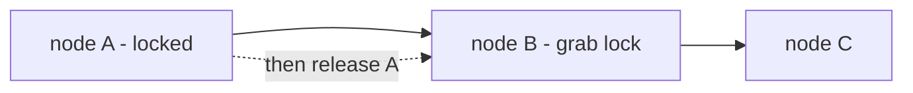
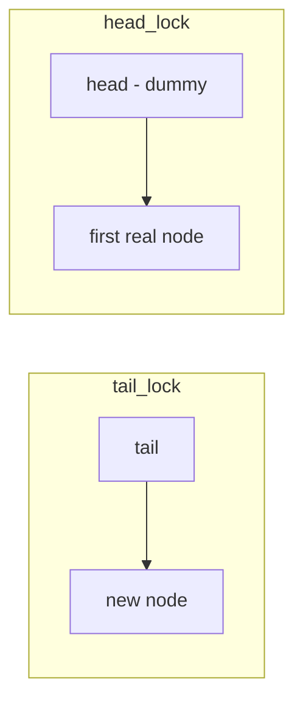

# Lock-Based Concurrent Data Structures

You already know how to build a counter, a list, a queue, and a hash table on a single thread. The moment two threads touch the same structure at once, its invariants break: two inserts clobber the same `next` pointer, two increments read-modify-write the same word and lose an update. The obvious fix is to wrap every operation in a lock — and that is exactly the right first move. **The crux: how do we add locks to a data structure so that it is correct under concurrency, and then make it *scale* so that adding threads actually adds throughput instead of just adding contention?** The whole chapter is one theme repeated four times: get it *correct* with one big lock first, then *carefully* refine the locking to let independent operations run in parallel.

## The core idea

- **Correctness first, then performance.** A structure guarded by a single lock is trivially correct: only one thread is ever inside a critical section, so the sequential invariants hold. Start there. Only once it works do you ask whether the single lock is a bottleneck.
- **A single lock is a serialization point.** Every operation, even ones that touch disjoint parts of the structure, waits for the same lock. As you add CPUs they spend more time *waiting* than *working*. This is where scalability goes to die.
- **Scaling means letting disjoint work proceed in parallel.** The trick in every case below is to notice which operations *don't actually conflict* and give them separate locks (or no lock at all):
  - **Counter** — increments on different CPUs don't need a shared word every time. Give each CPU a *local* counter and reconcile periodically: the **sloppy (approximate) counter**.
  - **Linked list** — a lock per node lets traversal "walk" its locks (**hand-over-hand / lock coupling**), but the per-node lock overhead usually costs more than it saves.
  - **Queue** — enqueue touches the *tail*, dequeue touches the *head*. Two separate locks let them run at once: the **two-lock (Michael & Scott) queue**.
  - **Hash table** — different keys live in different buckets. One lock **per bucket** means operations on different keys never contend.
- **The tradeoff you are always making** is *lock granularity*. **Coarse-grained** (one big lock) is simple and correct but serializes everything. **Fine-grained** (many small locks) scales but adds lock-acquisition overhead, more memory, and far more ways to deadlock. More locks is not automatically better.

## How it works

### Making a structure thread-safe: one big lock

Take any sequential structure and put a mutex around every operation (the mutex itself is the primitive built in [Locks](/docs/os/concurrency/locks)). Here is a linked list made safe the lazy, correct way — one lock guards the entire list:

```c
#include <pthread.h>
#include <stdlib.h>

typedef struct lnode { int key; struct lnode *next; } lnode_t;
typedef struct { lnode_t *head; pthread_mutex_t lock; } list_t;

static void list_init(list_t *l) {
    l->head = NULL;
    pthread_mutex_init(&l->lock, NULL);
}
static void list_insert(list_t *l, int key) {
    lnode_t *n = malloc(sizeof(lnode_t));
    n->key = key;
    pthread_mutex_lock(&l->lock);   // one big lock guards the whole list
    n->next = l->head;
    l->head = n;
    pthread_mutex_unlock(&l->lock);
}
static int list_lookup(list_t *l, int key) {
    pthread_mutex_lock(&l->lock);
    for (lnode_t *c = l->head; c; c = c->next)
        if (c->key == key) { pthread_mutex_unlock(&l->lock); return 1; }
    pthread_mutex_unlock(&l->lock);
    return 0;
}
```

This is *correct*: no two threads are ever modifying the list at once. It is also a scalability disaster: a lookup that walks 10,000 nodes holds the lock the whole time and blocks every other reader and writer. The rest of this page is about earning parallelism back.

### The concurrent counter — correct, then scalable

A counter is the simplest possible shared structure, and it shows the whole arc in miniature.

**The precise counter** takes a lock on every `inc`:

```c
typedef struct { long value; pthread_mutex_t lock; } precise_t;

static void precise_inc(precise_t *c) {
    pthread_mutex_lock(&c->lock);
    c->value++;                     // every thread serializes on this one word
    pthread_mutex_unlock(&c->lock);
}
```

Correct, but it does not scale at all. With one CPU it is fast; with many CPUs, every increment fights for the same cache line and the same lock, so throughput *drops* as you add cores — the opposite of what you wanted.

**The sloppy (approximate) counter** fixes this. Give each CPU its own **local** counter with its own lock, and a single **global** counter. Threads bump their *local* counter cheaply. Only when a local counter reaches a **threshold** `S` does the thread grab the global lock, add its local value to the global, and reset the local to zero.

```mermaid
flowchart LR
    T0[Thread on CPU0] --> L0[local0]
    T1[Thread on CPU1] --> L1[local1]
    T2[Thread on CPU2] --> L2[local2]
    L0 -- "flush when local &#62;= S" --> G[global]
    L1 -- "flush when local &#62;= S" --> G
    L2 -- "flush when local &#62;= S" --> G
```



```c
#define NCPU 8
typedef struct {
    long global; pthread_mutex_t glock;      // global count + its lock
    long local[NCPU]; pthread_mutex_t llock[NCPU]; // per-CPU count + lock
    long threshold;                          // flush when a local hits this
} approx_t;

static void approx_inc(approx_t *c, int cpu) {
    pthread_mutex_lock(&c->llock[cpu]);
    c->local[cpu]++;
    if (c->local[cpu] >= c->threshold) {     // rare: cross into the global
        pthread_mutex_lock(&c->glock);
        c->global += c->local[cpu];
        pthread_mutex_unlock(&c->glock);
        c->local[cpu] = 0;
    }
    pthread_mutex_unlock(&c->llock[cpu]);
}
```

- Most increments only touch a **CPU-local** lock and cache line — no cross-CPU coherence traffic. The expensive global lock is touched roughly once every `S` increments.
- **The tradeoff:** a `get` that reads only `global` can be *stale* by up to `NCPU * (S - 1)`, because that many increments may be sitting in locals not yet flushed. You trade **exactness of the instantaneous value** for **scalability**. Choosing `S` sets the dial: small `S` is more accurate but flushes (and contends) more often; large `S` scales better but is sloppier.
- At **rest** (no threads incrementing) an exact total is always recoverable by folding every local into the global — which is what the runnable version below asserts.

### The concurrent linked list — global lock vs hand-over-hand

The single-lock list above is correct. The natural "make it scale" idea is **hand-over-hand locking** (also called **lock coupling**): put a lock on *every node*, and while traversing, hold the current node's lock, grab the *next* node's lock, then release the current one — "walking" your grip down the list like climbing a rope hand over hand.



- **In theory** this enables concurrency: a thread deep in the list holds only two node-locks, so another thread can operate near the head at the same time.
- **In practice it is usually not worth it.** Every single node visited costs a lock acquire and release. A lookup over a long list now performs a lock/unlock *per node* instead of one lock for the whole traversal. That per-node overhead typically **outweighs** the parallelism gained, so a plain single-lock list often beats hand-over-hand except under very specific, highly contended, long-list workloads.
- The lesson OSTEP draws: **more concurrency in the design does not automatically mean more performance.** Measure before you complicate. Sometimes the coarse single lock is simply the right engineering answer.

### The concurrent queue — two locks so enqueue and dequeue don't contend

A FIFO queue has a natural asymmetry: **enqueue** only touches the **tail**, **dequeue** only touches the **head**. If we can keep those two ends from interfering, a producer and a consumer can run *at the same time*. The **Michael & Scott two-lock queue** does exactly this:

- Keep a separate **head lock** and **tail lock**.
- Keep a permanent **dummy (sentinel) node** so that `head` and `tail` are never `NULL` and never point at the same *real* node. `enqueue` only ever modifies `tail->next` and `tail`; `dequeue` only ever modifies `head`. Because of the dummy, the two operations touch **different nodes** even when the queue has one element, so their locks never overlap.



```c
// node->next is atomic: near-empty, enqueue writes and dequeue reads the
// same node's next under *different* locks, so it needs release/acquire.
static void q_enqueue(queue_t *q, long value) {
    node_t *n = malloc(sizeof(node_t));
    n->value = value;
    atomic_store_explicit(&n->next, NULL, memory_order_relaxed);
    pthread_mutex_lock(&q->tail_lock);   // only the tail lock
    atomic_store_explicit(&q->tail->next, n, memory_order_release);
    q->tail = n;
    pthread_mutex_unlock(&q->tail_lock);
}
static int q_dequeue(queue_t *q, long *out) {
    pthread_mutex_lock(&q->head_lock);   // only the head lock
    node_t *dummy = q->head;
    node_t *first = atomic_load_explicit(&dummy->next, memory_order_acquire);
    if (first == NULL) { pthread_mutex_unlock(&q->head_lock); return 0; }
    *out = first->value;                 // read the first real node
    q->head = first;                     // it becomes the new dummy
    pthread_mutex_unlock(&q->head_lock);
    free(dummy);
    return 1;
}
```

Because the two operations grab **different** locks, an enqueue and a dequeue proceed **concurrently** — a producer and a consumer no longer block each other. This is the standard structure behind high-throughput producer/consumer queues. (A full runnable, verified version is in [Must-know algorithms](#must-know-algorithms).)

### The concurrent hash table — one lock per bucket

The hash table is the happy ending. A hash table is an array of buckets, and different keys hash to different buckets. Operations on **different buckets are genuinely independent** — so give **each bucket its own lock**:

```c
#define NBUCKETS 1024
typedef struct { list_t buckets[NBUCKETS]; } hash_t; // each bucket is a locked list

static void hash_insert(hash_t *h, int key) {
    list_insert(&h->buckets[key % NBUCKETS], key);    // locks only that bucket
}
static int hash_lookup(hash_t *h, int key) {
    return list_lookup(&h->buckets[key % NBUCKETS], key);
}
```

- With enough buckets and a good hash, two threads working on different keys almost always hit **different** locks and never contend. Throughput scales close to linearly with cores.
- This is why the concurrent hash table is the canonical "fine-grained locking that actually pays off" example: the structure *already* partitions its data into independent pieces, so per-piece locking is a natural, cheap fit — unlike the linked list, where per-node locking fights the fact that a traversal must visit nodes in order.

## Must-know algorithms

Two complete programs, both compiled with `cc -std=c11 -pthread` and run under many threads to verify correctness.

### 1. Precise counter vs approximate (sloppy) counter

Both produce the correct total; the approximate one contends on the global lock only about once per `THRESHOLD` increments. The `assert`s confirm both equal the expected total once locals are folded in at rest.

```c
// cc -std=c11 -pthread counter.c -o counter && ./counter
#include <pthread.h>
#include <stdio.h>
#include <stdlib.h>
#include <assert.h>

#define NCPU 8
#define NTHREADS 8
#define PER_THREAD 1000000
#define THRESHOLD 1024

// ---- precise counter: one lock, every bump serializes on it ----
typedef struct { long value; pthread_mutex_t lock; } precise_t;

static void precise_init(precise_t *c) { c->value = 0; pthread_mutex_init(&c->lock, NULL); }
static void precise_inc(precise_t *c) {
    pthread_mutex_lock(&c->lock);
    c->value++;
    pthread_mutex_unlock(&c->lock);
}
static long precise_get(precise_t *c) {
    pthread_mutex_lock(&c->lock);
    long v = c->value;
    pthread_mutex_unlock(&c->lock);
    return v;
}

// ---- approximate counter: per-CPU local counters + periodic global flush ----
typedef struct {
    long global; pthread_mutex_t glock;
    long local[NCPU]; pthread_mutex_t llock[NCPU];
    long threshold;
} approx_t;

static void approx_init(approx_t *c, long threshold) {
    c->global = 0; c->threshold = threshold;
    pthread_mutex_init(&c->glock, NULL);
    for (int i = 0; i < NCPU; i++) { c->local[i] = 0; pthread_mutex_init(&c->llock[i], NULL); }
}
// bump the local counter; only when it crosses the threshold flush to global.
static void approx_inc(approx_t *c, int cpu) {
    pthread_mutex_lock(&c->llock[cpu]);
    c->local[cpu]++;
    if (c->local[cpu] >= c->threshold) {
        pthread_mutex_lock(&c->glock);
        c->global += c->local[cpu];
        pthread_mutex_unlock(&c->glock);
        c->local[cpu] = 0;
    }
    pthread_mutex_unlock(&c->llock[cpu]);
}
// exact reconciliation: fold every local into the global (called at rest).
static long approx_get(approx_t *c) {
    pthread_mutex_lock(&c->glock);
    long v = c->global;
    for (int i = 0; i < NCPU; i++) {
        pthread_mutex_lock(&c->llock[i]);
        v += c->local[i];
        pthread_mutex_unlock(&c->llock[i]);
    }
    pthread_mutex_unlock(&c->glock);
    return v;
}

static precise_t P;
static approx_t A;

static void *precise_worker(void *arg) {
    (void)arg;
    for (long i = 0; i < PER_THREAD; i++) precise_inc(&P);
    return NULL;
}
static void *approx_worker(void *arg) {
    int cpu = (int)(long)arg;
    for (long i = 0; i < PER_THREAD; i++) approx_inc(&A, cpu);
    return NULL;
}

int main(void) {
    pthread_t t[NTHREADS];
    long expected = (long)NTHREADS * PER_THREAD;

    precise_init(&P);
    for (int i = 0; i < NTHREADS; i++) pthread_create(&t[i], NULL, precise_worker, NULL);
    for (int i = 0; i < NTHREADS; i++) pthread_join(t[i], NULL);

    approx_init(&A, THRESHOLD);
    for (int i = 0; i < NTHREADS; i++)
        pthread_create(&t[i], NULL, approx_worker, (void *)(long)(i % NCPU));
    for (int i = 0; i < NTHREADS; i++) pthread_join(t[i], NULL);

    long pv = precise_get(&P), av = approx_get(&A);
    printf("expected=%ld  precise=%ld  approx=%ld\n", expected, pv, av);
    assert(pv == expected);
    assert(av == expected);   // exact once all locals are folded in at rest
    printf("OK: both counters correct\n");
    return 0;
}
```

Output:

```
expected=8000000  precise=8000000  approx=8000000
OK: both counters correct
```

### 2. Two-lock concurrent queue (head lock + tail lock + dummy node)

Four producers and four consumers push 800,000 uniquely-valued items through the queue; the program asserts every value was dequeued **exactly once** — no loss, no duplication.

```c
// cc -std=c11 -pthread tlqueue.c -o tlqueue && ./tlqueue
#include <pthread.h>
#include <stdio.h>
#include <stdlib.h>
#include <stdatomic.h>
#include <assert.h>
#include <string.h>

// next is atomic: when the queue is nearly empty, an enqueuer writes
// tail->next while a dequeuer reads head->next on the SAME node, and the
// head/tail locks don't cover the same field. A release/acquire pair on
// next makes that hand-off well-defined (and race-detector clean).
typedef struct node { long value; _Atomic(struct node *) next; } node_t;

typedef struct {
    node_t *head;              // dequeue end; head always points at a dummy
    node_t *tail;              // enqueue end
    pthread_mutex_t head_lock;
    pthread_mutex_t tail_lock;
} queue_t;

static void q_init(queue_t *q) {
    node_t *dummy = malloc(sizeof(node_t));
    atomic_store_explicit(&dummy->next, NULL, memory_order_relaxed);
    q->head = q->tail = dummy;            // head==tail==dummy means "empty"
    pthread_mutex_init(&q->head_lock, NULL);
    pthread_mutex_init(&q->tail_lock, NULL);
}
// enqueue: only the tail lock is held.
static void q_enqueue(queue_t *q, long value) {
    node_t *n = malloc(sizeof(node_t));
    n->value = value;
    atomic_store_explicit(&n->next, NULL, memory_order_relaxed);
    pthread_mutex_lock(&q->tail_lock);
    atomic_store_explicit(&q->tail->next, n, memory_order_release);
    q->tail = n;
    pthread_mutex_unlock(&q->tail_lock);
}
// dequeue: only the head lock is held. Returns 1 on success, 0 if empty.
static int q_dequeue(queue_t *q, long *out) {
    pthread_mutex_lock(&q->head_lock);
    node_t *dummy = q->head;
    node_t *first = atomic_load_explicit(&dummy->next, memory_order_acquire);
    if (first == NULL) { pthread_mutex_unlock(&q->head_lock); return 0; }
    *out = first->value;                  // read from the first real node
    q->head = first;                      // it becomes the new dummy
    pthread_mutex_unlock(&q->head_lock);
    free(dummy);
    return 1;
}

#define NPROD 4
#define NCONS 4
#define PER_PROD 200000
#define TOTAL (NPROD * PER_PROD)

static queue_t Q;
static int seen[TOTAL];                   // seen[v] = times value v was dequeued
static pthread_mutex_t seen_lock = PTHREAD_MUTEX_INITIALIZER;
static long consumed = 0;

static void *producer(void *arg) {
    long id = (long)arg;
    for (long i = 0; i < PER_PROD; i++)
        q_enqueue(&Q, id * PER_PROD + i); // unique value per (producer, i)
    return NULL;
}
static void *consumer(void *arg) {
    (void)arg;
    long v;
    for (;;) {
        pthread_mutex_lock(&seen_lock);
        if (consumed >= TOTAL) { pthread_mutex_unlock(&seen_lock); break; }
        pthread_mutex_unlock(&seen_lock);
        if (q_dequeue(&Q, &v)) {
            pthread_mutex_lock(&seen_lock);
            seen[v]++; consumed++;
            pthread_mutex_unlock(&seen_lock);
        }
    }
    return NULL;
}

int main(void) {
    q_init(&Q);
    memset(seen, 0, sizeof(seen));
    pthread_t p[NPROD], c[NCONS];
    for (long i = 0; i < NPROD; i++) pthread_create(&p[i], NULL, producer, (void *)i);
    for (long i = 0; i < NCONS; i++) pthread_create(&c[i], NULL, consumer, NULL);
    for (int i = 0; i < NPROD; i++) pthread_join(p[i], NULL);
    for (int i = 0; i < NCONS; i++) pthread_join(c[i], NULL);

    long total = 0;
    for (long v = 0; v < TOTAL; v++) { assert(seen[v] == 1); total += seen[v]; }
    printf("produced=%d consumed=%ld unique-all-once=%s\n",
           TOTAL, total, total == TOTAL ? "yes" : "no");
    printf("OK: all items transferred, no loss or duplication\n");
    return 0;
}
```

Output:

```
produced=800000 consumed=800000 unique-all-once=yes
OK: all items transferred, no loss or duplication
```

These structures reuse the same pointer-machine mechanics taught on the DSA pages: the queue is the sentinel-node singly-linked list from [Linked Lists and the Pointer Machine](/docs/dsa/s01-foundations/s01e07-linked-lists-pointer-machine), and the per-bucket table is exactly the chained [Hash Tables](/docs/dsa/s01-foundations/s01e14-hash-tables) design with a lock per chain.

## Interview questions

1. **How do you make an existing (sequential) data structure thread-safe, and why might that not scale?**
   Wrap every operation that reads or writes shared state in a single mutex (`lock` at entry, `unlock` at every exit). This is correct because only one thread is ever inside a critical section, so the sequential invariants hold. It does not scale because that one lock is a **serialization point**: even operations on disjoint parts of the structure wait for it, so adding CPUs adds contention, not throughput. Correctness first, then refine.

2. **What is a sloppy / approximate counter and what does it trade away?**
   Each CPU keeps a **local** counter (with its own lock); a single **global** counter is updated only periodically. A thread bumps its local counter cheaply and, when the local reaches a threshold `S`, transfers it to the global under the global lock and resets the local. This makes the common case CPU-local (no cross-core coherence traffic), so it **scales**. The tradeoff is **staleness**: a read of the global can lag the true count by up to `NCPU * (S - 1)`. You trade exactness-of-the-instant for scalability; `S` is the accuracy/scalability dial.

3. **What is hand-over-hand (lock coupling) locking on a linked list, and why is it often not worth it?**
   Put a lock on each node; while traversing, hold the current node's lock, acquire the next node's lock, then release the current — walking the locks down the list. In principle it lets threads work in different regions of the list concurrently. In practice each traversed node costs a lock acquire/release, so a lookup pays per-node locking overhead that usually **outweighs** the parallelism gained; a plain single-lock list frequently wins. It illustrates that more concurrency in the design does not guarantee more performance.

4. **Why does a two-lock queue let enqueue and dequeue proceed concurrently?**
   Enqueue only modifies the **tail**; dequeue only modifies the **head**. Giving each end its own lock, plus a permanent **dummy node** so head and tail never point at the same real node, means the two operations touch **different nodes** and grab **different locks** — so a producer and a consumer never block each other. This is the Michael & Scott two-lock design.

5. **Why does the dummy (sentinel) node matter in the two-lock queue?**
   Without it, an empty or single-element queue would have head and tail pointing at the same node, so enqueue and dequeue would touch the same memory and their separate locks would not actually separate them (and empty/one-element edge cases get messy). The dummy guarantees `head` and `tail` always refer to distinct nodes, keeping the head-side and tail-side operations independent and making the empty case just "dummy has no `next`."

6. **Why do per-bucket locks make a hash table scale well?**
   Different keys hash to different buckets, and operations on different buckets are genuinely independent. A lock **per bucket** means two threads working on different keys almost always take different locks and never contend, so throughput scales nearly linearly. The hash table already partitions its data into independent pieces, so per-piece locking is a natural fit — unlike a list, where traversal order forces threads through the same nodes.

7. **Correctness vs scalability — how should you approach concurrent data structure design?**
   Always get **correctness first** with the simplest scheme (one big lock), because a fast wrong answer is useless. Then measure. Only if the single lock is a demonstrated bottleneck do you introduce finer-grained locking — and only where the structure has genuinely independent parts (buckets, head/tail, per-CPU counters). Don't add concurrency machinery on faith.

8. **Coarse-grained vs fine-grained locking — what's the tradeoff?**
   **Coarse** (one lock for the whole structure) is simple, uses little memory, is easy to reason about and deadlock-free, but serializes all operations. **Fine** (many small locks) allows disjoint operations to run in parallel and scales, but adds lock-acquisition CPU cost, more memory for the locks, and many more chances for **deadlock** and subtle bugs. The right granularity depends on contention and the structure's shape; finer is not automatically better.

9. **How do you get an exact reading from an approximate counter when you truly need one?**
   Quiesce the increments (or lock everything) and **fold every per-CPU local into the global**, then read. During normal operation the global alone is only approximate; the exact total is the global plus the sum of all locals, recoverable at rest. That's the reconciliation step `approx_get` performs.

## Coding problems

🎯 **Interview (LeetCode)**

- [LeetCode 1188 — Design Bounded Blocking Queue](https://leetcode.com/problems/design-bounded-blocking-queue/) — build a fixed-capacity FIFO queue where `enqueue` blocks when full and `dequeue` blocks when empty. **What it tests:** thread-safe queue design with condition-variable / semaphore signaling — the blocking cousin of the two-lock queue above.
- [LeetCode 146 — LRU Cache](https://leetcode.com/problems/lru-cache/) — implement an O(1) LRU cache (hash map + doubly-linked list); then make it thread-safe. **What it tests:** the coarse-vs-fine tradeoff on a real structure — the simplest correct answer is one lock around every `get`/`put`; scaling it (sharded locks per key range) is exactly this page's theme applied to a cache.

🏗 **Systems (OS-classic)**

- **Build an approximate (sloppy) counter.** Implement per-CPU local counters with a threshold flush to a global counter; verify under many threads that folding locals into the global yields the exact total, and observe how throughput changes with the threshold `S`. **What it tests:** per-CPU state + periodic reconciliation, and the exactness-vs-scalability tradeoff. Reference implementation: [Must-know algorithms](#must-know-algorithms) above.
- **Build a two-lock concurrent queue.** Implement the Michael & Scott head-lock/tail-lock queue with a dummy node; run multiple producers and consumers and assert every item transfers exactly once. **What it tests:** decomposing a structure into independent ends so operations run concurrently. Reference implementation: [Must-know algorithms](#must-know-algorithms) above. See the [Non-blocking algorithm](https://en.wikipedia.org/wiki/Non-blocking_algorithm#Michael_and_Scott_queue) reference for the lock-free sibling of this design.

## Key takeaways

- **Correct first, scalable second.** Wrap the whole structure in one lock, confirm it works, *then* refine the locking. A fast, wrong structure is worthless.
- **A single lock is a serialization point** — it makes everything correct and everything wait. Scaling means letting *disjoint* operations run in parallel.
- **Sloppy counter:** per-CPU locals + periodic global flush. Scales beautifully; the price is a bounded staleness of the instantaneous value, tuned by the flush threshold `S`.
- **Hand-over-hand list locking** adds concurrency on paper but usually loses to a single lock because of per-node lock overhead — more concurrency ≠ more performance.
- **Two-lock queue:** separate head and tail locks plus a dummy node let a producer and consumer run at once.
- **Per-bucket hash table:** the structure already partitions data, so one lock per bucket scales near-linearly — the poster child for fine-grained locking that pays off.
- **Lock granularity is the master dial:** coarse is simple and deadlock-free but serial; fine scales but costs overhead, memory, and deadlock risk. Choose based on measured contention.

## Source(s) and further reading

- OSTEP — [Lock-based Concurrent Data Structures (free PDF)](https://pages.cs.wisc.edu/~remzi/OSTEP/threads-locks-usage.pdf), Remzi and Andrea Arpaci-Dusseau. The backbone of this page: approximate counters, hand-over-hand lists, the two-lock queue, and per-bucket hash tables.
- OSTEP — [full book home page](https://pages.cs.wisc.edu/~remzi/OSTEP/) (all chapters, free).
- Wikipedia — [Non-blocking algorithm](https://en.wikipedia.org/wiki/Non-blocking_algorithm#Michael_and_Scott_queue), background on the Michael & Scott queue and its lock-free variant.
- Wikipedia — [Concurrent hash table](https://en.wikipedia.org/wiki/Concurrent_hash_table), per-bucket locking and other approaches to scaling a shared hash table.
