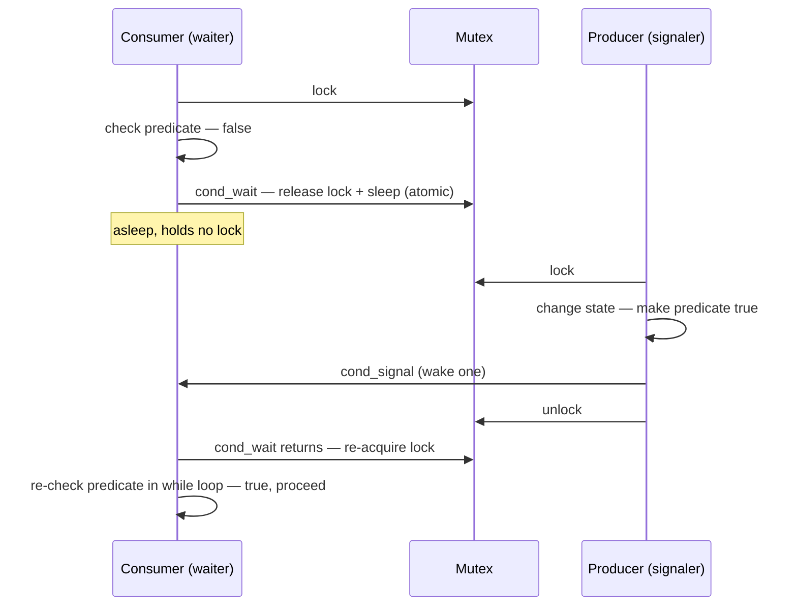
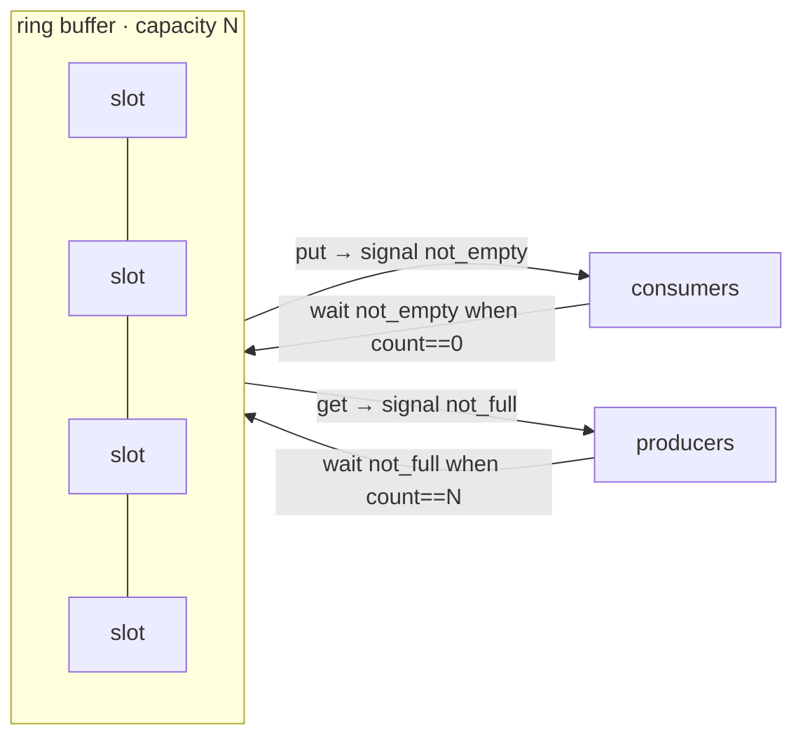

# Condition Variables

**The crux:** a thread often needs to *wait for a condition on shared state* — "the buffer is non-empty," "the child has finished," "there is at least one free slot" — before it can safely proceed. Spinning in a loop checking that condition wastes CPU and, worse, must hold or repeatedly grab a lock to read the state safely, which either burns cycles or races. What we want is a way to **sleep until the condition might be true**, release the lock while asleep so another thread can make it true, and be **woken and handed the lock back** the moment someone changes the state. A **condition variable (CV)** is exactly that primitive: a queue of waiting threads attached to a lock, with operations to *wait* and to *signal*.

## The core idea

- **A CV is not a lock and it is not a boolean.** It is a *wait queue*. Threads park themselves on it; other threads wake them. The actual condition ("is the buffer empty?") lives in ordinary shared variables that you protect with a mutex — the CV just coordinates sleeping and waking around those variables.
- **Three operations** (POSIX names):
  - `pthread_cond_wait(cond, mutex)` — atomically release `mutex` and put the caller to sleep on `cond`; on wake, re-acquire `mutex` before returning.
  - `pthread_cond_signal(cond)` — wake **one** waiter (if any).
  - `pthread_cond_broadcast(cond)` — wake **all** waiters.
- **The lock and the CV work as a pair.** You hold the mutex, check the shared condition, and if it is not yet true you `wait`. The `wait` call is what makes "check then sleep" atomic, so you cannot miss a wakeup that happens in the gap.
- **The waiter re-checks after waking.** Being woken does not prove the condition holds now — it only means "go look again." So the check lives in a loop.

## How it works

### wait releases the lock atomically, then re-acquires it

The single most important fact about `pthread_cond_wait` is that it does **two things as one indivisible step**: it releases the mutex *and* blocks the calling thread on the CV. When the thread is later woken, `wait` re-acquires the mutex before it returns. In pseudo-C:

```c
/* conceptually, inside pthread_cond_wait(cond, mutex): */
/*   atomically { unlock(mutex); enqueue_self_on(cond); sleep(); } */
/*   on wake:  lock(mutex);  return; */
```

Why the atomicity is load-bearing: suppose it were two separate steps — first `unlock(mutex)`, then `sleep()`. Between them, another thread could grab the lock, change the state, call `signal`, and finish. Our thread has already decided to sleep but has not yet slept, so it misses that signal and sleeps forever. That is the **lost-wakeup** bug. By fusing "release the lock" with "go to sleep," `wait` guarantees no signal can slip through the crack.



### The two load-bearing rules

**Rule 1 — always hold the lock while calling wait and signal.** You must hold the mutex when you call `wait` (the call requires it — it releases the lock for you). You should also hold the mutex when you call `signal`/`broadcast`, and you must have changed the shared state under that same lock. Signaling without the lock re-opens the lost-wakeup race: a waiter can test the predicate, find it false, and be about to sleep exactly when your unlocked signal fires into the void.

**Rule 2 — always wait in a `while` loop, not an `if`.** After `wait` returns you must re-test the condition and, if it is still false, wait again:

```c
pthread_mutex_lock(&m);
while (!predicate())              /* while, never if */
    pthread_cond_wait(&cond, &m);
/* predicate() is now true AND we hold the lock */
pthread_mutex_unlock(&m);
```

Three independent reasons the loop is mandatory:

- **Spurious wakeups.** POSIX explicitly permits `wait` to return without any corresponding signal. A bare `if` would then fall through with the predicate false. The loop re-checks and goes back to sleep.
- **Mesa semantics — "another thread got there first."** Real CVs (Mesa-style, which is what pthreads and Java use) do *not* hand the CPU and the invariant straight to the woken waiter. `signal` only makes a waiter *runnable*; between the signal and the moment the waiter actually runs and re-acquires the lock, a *different* thread can grab the lock and consume the very thing that was just produced. The woken thread wakes to find the predicate false again. Only Hoare semantics (rare, mostly academic) hands control directly to the waiter; on Mesa you must re-check.
- **Broadcast wakes too many.** If you use `broadcast` to wake all waiters but only one can proceed, the losers must re-check and sleep. The loop handles that for free.

The `while` loop makes correctness independent of *why* you woke up: whatever the reason, you re-evaluate the actual predicate against shared state you hold the lock for. This is also precisely what defeats the lost-wakeup bug in combination with Rule 1 — the state change and the signal both happen under the lock, and the waiter's decision to sleep is atomic with releasing that lock, so the waiter can never both "miss the signal" and "sleep with the predicate true."

### signal versus broadcast

- **`signal`** wakes **one** waiting thread. Use it when exactly one waiter can make progress from a single state change — e.g., producing one item frees exactly one consumer.
- **`broadcast`** wakes **all** waiting threads. Use it when a single state change might let *several* waiters proceed, or when you *cannot tell which* waiter is the right one to wake. Woken threads that cannot proceed simply re-check and go back to sleep (that is why Rule 2 is safe).
- **When in doubt, broadcast is always correct** (never misses a valid waiter), just potentially less efficient because of the extra wakeups — the "thundering herd." `signal` is an optimization you apply when you can prove one wakeup suffices.

### The bounded buffer (producer/consumer)

The canonical use: producers put items into a fixed-size buffer, consumers take them out. Producers must block when the buffer is **full**; consumers must block when it is **empty**. This needs **one mutex** (to protect the buffer state) and **two condition variables** — one for "not full" (producers wait on it) and one for "not empty" (consumers wait on it).

Why two CVs and not one? With a single CV, a `signal` might wake a *producer* when what was needed was a *consumer* (or vice versa), and although the `while` loop keeps it *correct*, you can get a wedged state where the only awake thread is the wrong kind and goes back to sleep — a wasted or, with `signal` on a shared CV, potentially deadlocking wakeup. Two CVs let each `signal` target exactly the class of thread that a given state change can unblock: filling a slot signals `not_empty`; freeing a slot signals `not_full`.



The full, tested implementation is in [Must-know algorithms](#the-bounded-buffer-producerconsumer-tested) below.

### Covering conditions

Sometimes a state change might unblock a waiter, but you **cannot determine which** waiter it is from inside the signaling thread. The classic example is a memory allocator where threads wait for *different amounts* of free bytes: a thread frees 10 bytes; a waiter that needs 5 could proceed, but a waiter that needs 100 still cannot. If all waiters share one CV, a `signal` might wake the 100-byte waiter, which re-checks, fails, and sleeps again — while the 5-byte waiter, which *could* run, is never woken. The program stalls even though progress was possible.

The fix is a **covering condition**: use **`broadcast`** so every waiter wakes and re-tests its own predicate. It "covers" all the cases where a waiter might legitimately proceed. It is less efficient (some woken threads just go back to sleep) but correct. Reach for a covering condition whenever the signaler cannot tell which waiter's predicate the state change satisfied.

### A minimal join / rendezvous

The smallest useful CV pattern is a one-shot **rendezvous**: a parent creates a child and waits until the child signals "done." The shared predicate is a single `done` flag. It shows the exact skeleton — flag protected by a mutex, publisher sets the flag and signals under the lock, waiter loops on the flag. See [the tested code](#a-tiny-join--rendezvous-tested).

## Must-know algorithms

### The bounded buffer (producer/consumer), tested

Multiple producers and consumers move many items through a fixed-capacity ring buffer. Correctness assertions: every produced value is consumed **exactly once** (no loss, no duplication) and the run **does not deadlock**. Each producer emits a distinct range of integers; consumers tally count and sum, and we compare against the closed-form total. A `-1` sentinel per consumer shuts them down cleanly.

Compile and run with `cc -std=c11 -pthread pc.c -o pc && ./pc`.

```c
#include <pthread.h>
#include <stdio.h>
#include <stdlib.h>
#include <assert.h>

#define CAP 8            /* bounded buffer capacity */
#define NPROD 4
#define NCONS 4
#define PER_PROD 100000  /* items each producer makes */
#define TOTAL (NPROD * PER_PROD)

typedef struct {
    int buf[CAP];
    int head, tail, count;      /* ring buffer state */
    pthread_mutex_t m;
    pthread_cond_t not_empty;   /* consumers wait here */
    pthread_cond_t not_full;    /* producers wait here */
} bbq_t;

static void bbq_init(bbq_t *q) {
    q->head = q->tail = q->count = 0;
    pthread_mutex_init(&q->m, NULL);
    pthread_cond_init(&q->not_empty, NULL);
    pthread_cond_init(&q->not_full, NULL);
}

static void bbq_put(bbq_t *q, int v) {
    pthread_mutex_lock(&q->m);
    while (q->count == CAP)                 /* while, not if */
        pthread_cond_wait(&q->not_full, &q->m);
    q->buf[q->tail] = v;
    q->tail = (q->tail + 1) % CAP;
    q->count++;
    pthread_cond_signal(&q->not_empty);     /* a slot filled */
    pthread_mutex_unlock(&q->m);
}

static int bbq_get(bbq_t *q) {
    pthread_mutex_lock(&q->m);
    while (q->count == 0)                    /* while, not if */
        pthread_cond_wait(&q->not_empty, &q->m);
    int v = q->buf[q->head];
    q->head = (q->head + 1) % CAP;
    q->count--;
    pthread_cond_signal(&q->not_full);       /* a slot freed */
    pthread_mutex_unlock(&q->m);
    return v;
}

static bbq_t q;
static long consumed_sum = 0;      /* sum of every value consumed */
static int  consumed_cnt = 0;      /* how many items consumed */
static pthread_mutex_t tally = PTHREAD_MUTEX_INITIALIZER;

/* Producer p emits values p*PER_PROD .. p*PER_PROD+PER_PROD-1 (all distinct). */
static void *producer(void *arg) {
    long p = (long)arg;
    for (int i = 0; i < PER_PROD; i++)
        bbq_put(&q, (int)(p * PER_PROD + i));
    return NULL;
}

/* Consumers pull until the sentinel -1, tallying each real value. */
static void *consumer(void *arg) {
    (void)arg;
    for (;;) {
        int v = bbq_get(&q);
        if (v < 0) break;                    /* sentinel: shut down */
        pthread_mutex_lock(&tally);
        consumed_sum += v;
        consumed_cnt++;
        pthread_mutex_unlock(&tally);
    }
    return NULL;
}

int main(void) {
    bbq_init(&q);
    pthread_t pr[NPROD], co[NCONS];
    for (long i = 0; i < NPROD; i++) pthread_create(&pr[i], NULL, producer, (void *)i);
    for (long i = 0; i < NCONS; i++) pthread_create(&co[i], NULL, consumer, NULL);
    for (int i = 0; i < NPROD; i++) pthread_join(pr[i], NULL);
    for (int i = 0; i < NCONS; i++) bbq_put(&q, -1);   /* one sentinel per consumer */
    for (int i = 0; i < NCONS; i++) pthread_join(co[i], NULL);

    /* Expected: every value 0..TOTAL-1 consumed exactly once. */
    long expected = (long)(TOTAL - 1) * TOTAL / 2;
    assert(consumed_cnt == TOTAL);
    assert(consumed_sum == expected);
    printf("consumed %d items, sum=%ld (expected %ld) — none lost/duplicated, no deadlock\n",
           consumed_cnt, consumed_sum, expected);
    return 0;
}
```

Running it prints (with `NPROD*PER_PROD = 400000` items):

```
consumed 400000 items, sum=79999800000 (expected 79999800000) — none lost/duplicated, no deadlock
```

The three ingredients that make it correct: (1) one mutex guards `count`/`head`/`tail`; (2) each blocking wait uses a **`while`** loop on the exact predicate (`count == CAP` for producers, `count == 0` for consumers); (3) each state change **signals the opposite CV** under the lock — a `put` signals `not_empty`, a `get` signals `not_full`. Break any one — use `if`, drop the lock around `signal`, or share a single CV with `signal` — and it can lose items or deadlock.

### A tiny join / rendezvous, tested

The parent waits for the child to finish. The predicate is a single `done` flag; the child publishes it under the lock and signals; the parent loops on it. This is the mechanism underneath `pthread_join`-style "wait for completion."

Compile and run with `cc -std=c11 -pthread join.c -o join && ./join`.

```c
#include <pthread.h>
#include <stdio.h>
#include <assert.h>

/* A one-shot rendezvous: parent waits for the child to finish. */
typedef struct {
    int done;                 /* the predicate the parent waits on */
    pthread_mutex_t m;
    pthread_cond_t c;
} rendezvous_t;

static rendezvous_t r = {
    .done = 0,
    .m = PTHREAD_MUTEX_INITIALIZER,
    .c = PTHREAD_COND_INITIALIZER,
};

static int child_ran = 0;     /* side effect the parent must observe after join */

static void *child(void *arg) {
    (void)arg;
    child_ran = 1;                        /* do the work */
    pthread_mutex_lock(&r.m);
    r.done = 1;                           /* publish under the lock */
    pthread_cond_signal(&r.c);            /* wake the waiting parent */
    pthread_mutex_unlock(&r.m);
    return NULL;
}

int main(void) {
    pthread_t t;
    pthread_create(&t, NULL, child, NULL);

    pthread_mutex_lock(&r.m);
    while (r.done == 0)                    /* while-loop guards spurious/early wakeups */
        pthread_cond_wait(&r.c, &r.m);
    pthread_mutex_unlock(&r.m);

    assert(child_ran == 1);               /* rendezvous guarantees the work is visible */
    pthread_join(t, NULL);
    printf("parent observed child done (child_ran=%d)\n", child_ran);
    return 0;
}
```

It prints `parent observed child done (child_ran=1)`. Note the classic subtlety: even if the child finishes *before* the parent reaches `wait`, the parent does not block forever — it tests `done` under the lock first, sees `1`, and skips the wait. The flag-plus-lock is what makes the ordering safe; the CV only handles the case where the parent arrives first.

## Interview questions

1. **What is a condition variable, and how does it differ from a lock?**
   A lock provides *mutual exclusion* — at most one thread in a critical section. A condition variable provides *event waiting* — a queue where threads sleep until some condition on shared state becomes true. They are complementary: the lock protects the shared state you check; the CV lets you sleep efficiently until that state changes. A CV is useless on its own — it always operates with an associated mutex, and the condition it "waits for" lives in ordinary variables guarded by that mutex.

2. **What does `pthread_cond_wait` do atomically, and why does the atomicity matter?**
   It atomically (a) releases the mutex and (b) blocks the caller on the CV; when later woken it re-acquires the mutex before returning. The atomicity of "release the lock and go to sleep" closes the window in which a signaler could grab the lock, change the state, and signal *after* the waiter decided to sleep but *before* it actually slept. Without atomicity that signal is lost and the waiter sleeps forever — the lost-wakeup bug.

3. **`signal` versus `broadcast` — when do you use each?**
   `signal` wakes one waiter; `broadcast` wakes all. Use `signal` when a single state change can unblock exactly one waiter (freeing one buffer slot). Use `broadcast` when a change may unblock several waiters, or when you cannot tell *which* waiter it unblocks (a covering condition). `broadcast` is always *correct* but can be wasteful (thundering herd); `signal` is an optimization valid only when one wakeup provably suffices.

4. **Why must you wait in a `while` loop rather than an `if`?**
   Three reasons. (1) **Spurious wakeups:** POSIX allows `wait` to return with no signal at all. (2) **Mesa semantics:** a `signal` only makes a waiter runnable; another thread can acquire the lock first and consume the resource, so the woken waiter finds the predicate false again. (3) **Over-broad wakeups:** `broadcast` wakes waiters that cannot all proceed. In every case the loop re-tests the real predicate against locked state, so correctness does not depend on *why* the thread woke.

5. **What is the difference between Mesa and Hoare monitor semantics?**
   Under **Hoare** semantics, `signal` immediately transfers the lock and CPU to the woken waiter, which runs with the invariant guaranteed — so an `if` would suffice. Under **Mesa** semantics (used by pthreads, Java, and essentially all real systems), `signal` only marks a waiter runnable; the signaler keeps running, and any thread may grab the lock before the waiter does. That "someone got there first" possibility is exactly why real code must re-check in a `while` loop.

6. **Build the bounded-buffer producer/consumer: how many condition variables and why?**
   One mutex plus **two** CVs: `not_full` (producers wait when the buffer is full) and `not_empty` (consumers wait when it is empty). Two are needed so each state change signals precisely the class of thread it can unblock — a `put` fills a slot and signals `not_empty`; a `get` frees a slot and signals `not_full`. With a single shared CV and `signal`, a wakeup can go to the wrong kind of thread (a producer when a consumer was needed), which re-sleeps and can wedge the system. Each wait is a `while` loop on `count == CAP` / `count == 0`.

7. **What is a covering condition, and when do you need one?**
   When a state change might unblock some waiter but the signaler cannot determine *which* one (e.g., threads waiting for different amounts of a freed resource), you use `broadcast` — a **covering condition** — so every waiter wakes and re-tests its own predicate. Signaling just one waiter risks waking a thread that still cannot proceed while leaving a thread that could proceed asleep, stalling the program despite available progress. Covering conditions trade efficiency (extra wakeups) for correctness.

8. **Describe the lost-wakeup bug and how the lock-plus-`while` discipline prevents it.**
   Lost wakeup: a waiter checks the predicate (false) and is about to sleep; meanwhile a signaler makes the predicate true and signals; the waiter then sleeps, having missed the signal, and blocks forever. Prevention: hold the mutex while checking the predicate *and* while `wait` atomically releases it and sleeps — so no signaler can slip a state change and signal into the gap between "check" and "sleep." The signaler also changes state and signals under the same lock. The `while` loop then re-checks on wake, covering spurious and Mesa wakeups. Lock + atomic `wait` + `while` together make missing a wakeup impossible.

9. **Do you need to hold the lock when calling `signal`?**
   POSIX permits signaling without the lock, and it can shave a wakeup-then-block ("hurry up and wait") stall. But for correctness it must be paired carefully: the *state change* the signal advertises must have happened under the lock, and signaling outside the lock can re-introduce lost-wakeup races if the predicate check and the signal can interleave. The safe default, and what most correct code does, is to change the state and signal while holding the mutex.

10. **Can you build a producer/consumer with semaphores instead of CVs? How does it compare?**
    Yes — two counting semaphores (`empty` initialized to N, `full` initialized to 0) plus a binary mutex for the buffer indices is the classic semaphore solution. Semaphores bundle a counter with the wait/signal queue, so there is no separate predicate to re-check and no `while` loop for that counter. CVs are more general: the condition can be any predicate over arbitrary state, not just a non-negative count, which is why CVs are the right tool for "wait until this complex invariant holds," while semaphores shine for pure counting resources.

## Coding problems

- 🎯 **Interview — [Building H2O (LeetCode 1117)](https://leetcode.com/problems/building-h2o/)** — release hydrogen and oxygen threads only in groups that form one water molecule (two H, one O). *Tests:* barrier-style grouping with a mutex and condition variables (or semaphores) — waking exactly the right threads when a molecule's worth of atoms is available, a direct covering/counting-condition exercise.

- 🎯 **Interview — [Design Bounded Blocking Queue (LeetCode 1188)](https://leetcode.com/problems/design-bounded-blocking-queue/)** — implement `enqueue`/`dequeue`/`size` on a fixed-capacity queue where `enqueue` blocks when full and `dequeue` blocks when empty. *Tests:* the exact bounded-buffer pattern above — one mutex, two condition variables, `while`-loop predicates.

- 🎯 **Interview — [Print in Order (LeetCode 1114)](https://leetcode.com/problems/print-in-order/)** — three threads call `first`, `second`, `third`; force them to run in that order regardless of scheduling. *Tests:* ordering via CVs (or semaphores) — each thread waits on a predicate published by the previous one, the minimal "wait for a condition then signal the next" skeleton.

- 🏗 **Systems — Implement the bounded-buffer producer/consumer with condition variables.** Build the `bbq_put`/`bbq_get` ring buffer above: one mutex, `not_empty`/`not_full` CVs, `while`-loop predicates, signal the opposite CV under the lock, and drive it with several producers and consumers plus a clean sentinel shutdown. *Tests:* whether you can place the lock, the `while`, and the two signals correctly so that nothing is lost, duplicated, or deadlocked — the canonical concurrency interview build.

## Key takeaways

- A **condition variable is a wait queue**, not a lock and not a boolean; the actual condition lives in shared variables guarded by an associated **mutex**.
- **`wait(cond, mutex)` atomically releases the mutex and sleeps**, then re-acquires the mutex on wake — the atomicity is what prevents lost wakeups.
- **Two rules, always:** hold the lock while calling `wait`/`signal` (and change the state under that lock), and **wait in a `while` loop**, never an `if`.
- The `while` loop is mandatory because of **spurious wakeups**, **Mesa semantics** ("another thread got there first"), and over-broad **broadcasts**.
- **`signal`** wakes one waiter (an optimization when one wakeup suffices); **`broadcast`** wakes all and is always correct — the tool for **covering conditions** when you cannot tell which waiter to wake.
- The **bounded buffer** uses **one mutex + two CVs** (`not_empty`, `not_full`) so each state change signals exactly the class of thread it can unblock.

## Source(s) and further reading

- [OSTEP — _Condition Variables_ (free chapter PDF)](https://pages.cs.wisc.edu/~remzi/OSTEP/threads-cv.pdf) — the primary source: the atomic wait, the `while`-loop rule, Mesa semantics, the producer/consumer, and covering conditions.
- [OSTEP — book home page (all free chapters)](https://pages.cs.wisc.edu/~remzi/OSTEP/)
- [man7 — `pthread_cond_wait(3p)`](https://man7.org/linux/man-pages/man3/pthread_cond_wait.3p.html) — the POSIX contract, including the explicit allowance for spurious wakeups.
- [man7 — `pthread_cond_signal(3p)`](https://man7.org/linux/man-pages/man3/pthread_cond_signal.3p.html) — `signal` versus `broadcast` and the locking guidance.
- [Wikipedia — Monitor (synchronization)](https://en.wikipedia.org/wiki/Monitor_(synchronization)) — monitors, condition variables, and Mesa versus Hoare semantics.
- [Wikipedia — Producer–consumer problem](https://en.wikipedia.org/wiki/Producer%E2%80%93consumer_problem) — the classic bounded-buffer synchronization problem.
- [Wikipedia — Spurious wakeup](https://en.wikipedia.org/wiki/Spurious_wakeup) — why `wait` can return without a signal and why the `while` loop is required.
