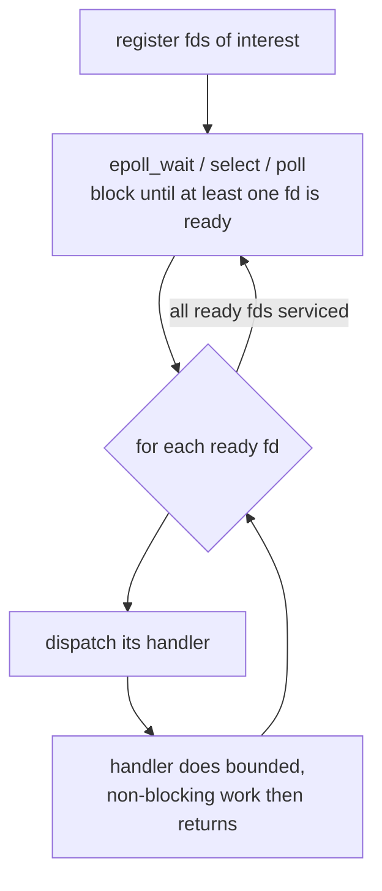

# Event-Based Concurrency

**The crux:** a server must juggle thousands of connections at once, but threads bring their own tax — locks, race conditions, deadlocks, and the memory and scheduling overhead of one stack per connection. Event-based concurrency asks a different question: can a **single thread** handle many connections *without* locks, by never blocking and instead reacting to events as they become ready? The answer is yes, if the program is restructured around an **event loop** that waits for I/O readiness and dispatches a short handler per ready event. The cost is that the natural call stack disappears — the programmer must manage state by hand.

## The core idea

- **One thread, one loop.** A single flow of control sits in a loop: wait for events, then run a handler for each event that is ready. Nothing else runs concurrently.
- **No locks, no data races inside the loop.** Because only one handler runs at any instant, there is no preemption between two handlers touching shared state. The mutual exclusion that threads need locks for is free here — the loop *is* the critical section.
- **Events are I/O readiness.** An "event" is usually "this file descriptor (fd) can be read or written now without blocking" — a client sent bytes, a socket became writable, a timer expired.
- **Handlers must be short and non-blocking.** A handler does a bounded chunk of work and returns quickly so the loop can service the next ready event. It must never make a call that could put the whole thread to sleep.
- **State lives in the heap, not the stack.** Since a handler returns between events, any progress it made must be saved somewhere explicit (a per-connection struct), not in local variables on a call stack.

## How it works

The engine of the loop is a single system call that answers one question: *"of all these fds I care about, which are ready right now?"* Three generations of that call exist — `select`, `poll`, and `epoll`.



- **`select(2)`** takes three fd bitmap sets (read, write, error) plus a max-fd bound and a timeout. It returns when any fd is ready or the timeout fires. It is portable but limited: the fd sets are capped (typically `FD_SETSIZE`, 1024) and must be rebuilt and rescanned every call, so cost is **O(n)** in the number of watched fds.
- **`poll(2)`** replaces the bitmaps with an array of `struct pollfd`, removing the fixed size limit. It is still **O(n)**: the kernel scans the whole array each call, and userspace scans it again to find ready entries.
- **`epoll(7)`** (Linux) splits registration from waiting. You build an interest list once with `epoll_ctl`, then each `epoll_wait` returns **only the ready fds** — cost is **O(ready)**, not O(n). This is what makes it scale to hundreds of thousands of connections.

Non-blocking I/O is the other half of the design. `select`/`poll`/`epoll` tell you a read *won't* block, but you still set the fd non-blocking with `fcntl` so that when you drain it in a loop, the final `read` that finds no more data returns `EAGAIN` instead of sleeping:

```c
#include <fcntl.h>
#include <stdlib.h>
#include <stdio.h>

// A blocking call inside the loop stalls every connection at once, so every
// watched fd is put into non-blocking mode before we ever wait on it.
static void set_nonblocking(int fd) {
    int flags = fcntl(fd, F_GETFL, 0);
    if (flags == -1) { perror("fcntl F_GETFL"); exit(1); }
    if (fcntl(fd, F_SETFL, flags | O_NONBLOCK) == -1) { perror("fcntl F_SETFL"); exit(1); }
}
```

### The central problem: never block the loop

In a thread-per-connection design, if one connection's handler calls a slow `read` and sleeps, the scheduler just runs another thread. In an event loop there is only one thread — if a handler blocks, **the entire server freezes** for every client. So the rules are strict:

- Every I/O fd is non-blocking; a `read` that would block returns `EAGAIN` and the handler simply returns, to be woken later.
- Long CPU work is **split** into chunks (do a slice, re-arm, return) or **offloaded** to a worker thread pool, with the result delivered back as another event.
- Even a call that "usually" doesn't block — a synchronous disk read, a DNS lookup, a `malloc` that faults — is dangerous. Disk I/O historically could not be made non-blocking with `select`/`epoll` at all, which is one reason `io_uring` (below) exists.

### The cost: manual stack management

With threads, the call stack *is* your state: local variables, the return address, "where am I in this request" — all held for free across a blocking call. An event loop returns from the handler between events, so that context is gone. The programmer rebuilds it by hand, usually as an explicit **state machine** or a chain of **callbacks**:

```c
// A per-connection state machine: because the loop cannot keep a call stack
// across a blocking read, each handler invocation advances explicit state.
#include <stdio.h>
#include <string.h>

typedef enum { WANT_HEADER, WANT_BODY, DONE } state_t;
typedef struct { state_t st; int body_len; } conn_t;

// Called once per readiness event; returns 1 when the exchange completes.
static int on_ready(conn_t *c, const char *chunk) {
    switch (c->st) {
        case WANT_HEADER:
            c->body_len = (int)strlen(chunk);   // pretend the header states the length
            printf("  header seen, expecting %d bytes\n", c->body_len);
            c->st = WANT_BODY;
            return 0;
        case WANT_BODY:
            printf("  body \"%s\" received, replying\n", chunk);
            c->st = DONE;
            return 1;
        case DONE:
        default:
            return 1;
    }
}
```

When one such continuation nests inside another inside another — "after the read completes, do the write, and after that do the log, and after that…" — you get **callback hell**: deeply nested callbacks where control flow and error handling are hard to follow. Async/await (below) is the modern cure.

### Where it shines, and where threads still win

- **Shines: high-concurrency, I/O-bound network servers.** When work is mostly waiting on the network and each request is cheap, one event-loop thread serves tens of thousands of connections with tiny per-connection memory (a struct, not a stack). **nginx**, **Node.js**, and **Redis** are all built this way.
- **Threads win: CPU-bound parallelism across cores.** A single event loop uses one core. If the work is heavy computation, no amount of event dispatching helps — you need multiple threads (or processes) to use multiple cores. Real systems combine both: run one event loop **per core** (nginx workers, Node's cluster mode) to get parallelism *and* per-loop lock-freedom.

### A note on async/await and io_uring

- **async/await** is syntactic sugar over the same event loop. The compiler/runtime transforms `await`-marked functions into state machines automatically — you write straight-line code, and the machine that the compiler generates is exactly the hand-written state machine above. The event loop, the readiness polling, and the non-blocking I/O are all still there underneath.
- **`io_uring`** (modern Linux) goes further than readiness. Instead of "tell me when I can read, then I read," you submit the *operation itself* (read these bytes into this buffer) to a shared ring, and the kernel completes it and posts a completion. This is **completion-based** rather than readiness-based, it batches system calls, and — crucially — it makes **disk I/O** truly asynchronous, closing the one gap `epoll` never covered.

## Must-know algorithms

### 1. A minimal event loop with `select`

Register several fds, make them non-blocking, then loop over `select` and dispatch one handler per ready fd. Self-pipes act as deterministic event sources so the program runs with no real sockets. It demonstrates the key property: several fds ready at once are all dispatched **in a single iteration**.

```c
// Minimal event-loop model: register fds, make them non-blocking, then loop
// with select() dispatching one handler per ready fd. Uses self-pipes as
// deterministic event sources so the program runs without real sockets.
#include <stdio.h>
#include <stdlib.h>
#include <string.h>
#include <unistd.h>
#include <fcntl.h>
#include <errno.h>
#include <sys/select.h>

#define MAX_HANDLERS 16

typedef void (*handler_fn)(int fd, void *ctx);

typedef struct {
    int fd;              // readable end we watch
    handler_fn on_read;  // callback fired when fd is ready
    void *ctx;           // per-handler state (manual stack management)
    int active;
} watch_t;

static watch_t g_watch[MAX_HANDLERS];
static int g_nwatch = 0;
static int g_pending = 0;   // events left before we stop the loop

// Make a fd non-blocking: a blocking read in a handler would stall the loop.
static void set_nonblocking(int fd) {
    int flags = fcntl(fd, F_GETFL, 0);
    if (flags == -1) { perror("fcntl F_GETFL"); exit(1); }
    if (fcntl(fd, F_SETFL, flags | O_NONBLOCK) == -1) { perror("fcntl F_SETFL"); exit(1); }
}

static void watch_add(int fd, handler_fn cb, void *ctx) {
    set_nonblocking(fd);
    g_watch[g_nwatch].fd = fd;
    g_watch[g_nwatch].on_read = cb;
    g_watch[g_nwatch].ctx = ctx;
    g_watch[g_nwatch].active = 1;
    g_nwatch++;
}

// A handler: drains the fd non-blocking, prints, then retires itself.
static void echo_handler(int fd, void *ctx) {
    const char *name = (const char *)ctx;
    char buf[64];
    for (;;) {
        ssize_t n = read(fd, buf, sizeof buf - 1);
        if (n > 0) {
            buf[n] = '\0';
            printf("  [%s] handled event: \"%s\"\n", name, buf);
        } else if (n == 0) {
            break;                       // writer closed
        } else if (errno == EAGAIN || errno == EWOULDBLOCK) {
            break;                       // nothing left — never block the loop
        } else if (errno == EINTR) {
            continue;
        } else {
            perror("read"); break;
        }
    }
    // retire this handler and count the serviced event
    for (int i = 0; i < g_nwatch; i++)
        if (g_watch[i].fd == fd) g_watch[i].active = 0;
    g_pending--;
}

// The event loop: build the fd set, block in select(), dispatch every ready fd.
static void event_loop(void) {
    while (g_pending > 0) {
        fd_set rset;
        FD_ZERO(&rset);
        int maxfd = -1;
        for (int i = 0; i < g_nwatch; i++) {
            if (!g_watch[i].active) continue;
            FD_SET(g_watch[i].fd, &rset);
            if (g_watch[i].fd > maxfd) maxfd = g_watch[i].fd;
        }
        if (maxfd == -1) break;

        int ready = select(maxfd + 1, &rset, NULL, NULL, NULL);
        if (ready == -1) {
            if (errno == EINTR) continue;
            perror("select"); exit(1);
        }
        printf("select() woke: %d fd(s) ready this iteration\n", ready);

        // Dispatch a handler for each ready fd in ONE iteration.
        for (int i = 0; i < g_nwatch; i++) {
            if (g_watch[i].active && FD_ISSET(g_watch[i].fd, &rset))
                g_watch[i].on_read(g_watch[i].fd, g_watch[i].ctx);
        }
    }
    printf("loop done: all events serviced\n");
}

int main(void) {
    int a[2], b[2], c[2];
    if (pipe(a) || pipe(b) || pipe(c)) { perror("pipe"); return 1; }

    watch_add(a[0], echo_handler, "conn-A");
    watch_add(b[0], echo_handler, "conn-B");
    watch_add(c[0], echo_handler, "conn-C");
    g_pending = 3;

    // Make all three readable before the loop runs: one select() call sees them
    // all, so the loop dispatches three handlers in a single iteration.
    write(a[1], "hello", 5); close(a[1]);
    write(b[1], "world", 5); close(b[1]);
    write(c[1], "later", 5); close(c[1]);

    event_loop();

    close(a[0]); close(b[0]); close(c[0]);
    return 0;
}
```

Output (compiled with `cc -std=c11`):

```text
select() woke: 3 fd(s) ready this iteration
  [conn-A] handled event: "hello"
  [conn-B] handled event: "world"
  [conn-C] handled event: "later"
loop done: all events serviced
```

### 2. The same loop with `poll`, plus a timer event

`poll` uses an array of `struct pollfd` instead of bitmaps, and its **timeout** doubles as a simple timer source. Here iteration one dispatches two ready fds at once; a later iteration fires a timer event when `poll` returns 0.

```c
// Event loop with poll(): iteration 1 dispatches two ready fds at once;
// a later iteration fires a timer event (poll's timeout). Deterministic:
// event sources are self-pipes plus poll()'s own timeout acting as a timer.
#include <stdio.h>
#include <stdlib.h>
#include <string.h>
#include <unistd.h>
#include <fcntl.h>
#include <errno.h>
#include <poll.h>

static void set_nonblocking(int fd) {
    int fl = fcntl(fd, F_GETFL, 0);
    if (fl == -1 || fcntl(fd, F_SETFL, fl | O_NONBLOCK) == -1) { perror("fcntl"); exit(1); }
}

static void drain_and_print(int fd, const char *name) {
    char buf[64];
    for (;;) {
        ssize_t n = read(fd, buf, sizeof buf - 1);
        if (n > 0) { buf[n] = '\0'; printf("  [%s] event: \"%s\"\n", name, buf); }
        else break;   // n==0 (closed) or n<0 EAGAIN — never block
    }
}

int main(void) {
    int a[2], b[2];
    if (pipe(a) || pipe(b)) { perror("pipe"); return 1; }
    set_nonblocking(a[0]); set_nonblocking(b[0]);

    // A and B are readable before we ever call poll().
    write(a[1], "hello", 5); close(a[1]);
    write(b[1], "world", 5); close(b[1]);

    struct pollfd pfd[2] = {
        { .fd = a[0], .events = POLLIN },
        { .fd = b[0], .events = POLLIN },
    };
    int io_pending = 2;   // I/O events still expected
    int timer_fired = 0;

    while (io_pending > 0 || !timer_fired) {
        int ready = poll(pfd, 2, 50 /* ms timeout acts as a timer */);
        if (ready == -1) { if (errno == EINTR) continue; perror("poll"); return 1; }

        if (ready == 0) {                     // timeout: a timer event
            printf("poll() timeout: timer event fired\n");
            timer_fired = 1;
            continue;
        }

        printf("poll() woke: %d fd(s) ready this iteration\n", ready);
        for (int i = 0; i < 2; i++) {
            if (pfd[i].fd < 0) continue;
            if (pfd[i].revents & (POLLIN | POLLHUP)) {
                drain_and_print(pfd[i].fd, i == 0 ? "conn-A" : "conn-B");
                close(pfd[i].fd);
                pfd[i].fd = -1;               // poll ignores negative fds
                io_pending--;
            }
        }
    }
    printf("loop done\n");
    return 0;
}
```

Output:

```text
poll() woke: 2 fd(s) ready this iteration
  [conn-A] event: "hello"
  [conn-B] event: "world"
poll() timeout: timer event fired
loop done
```

The `epoll` shape is the same loop with three changes: create the interest list once (`epoll_create1`), register/unregister fds with `epoll_ctl(EPOLL_CTL_ADD/DEL)`, and let `epoll_wait` hand back an array containing **only** the ready events — so the dispatch loop iterates over ready fds directly rather than scanning all registered ones.

## Interview questions

**Q1. What is event-based concurrency, and how does it avoid locks?**
A single thread runs an event loop: it waits on many fds for readiness, then runs a short handler for each ready fd. Because exactly one handler runs at a time and handlers are never preempted mid-execution, two handlers can never touch shared state simultaneously — so the mutual exclusion that threads need locks for is inherent. The loop itself is the critical section. This eliminates data races and deadlocks *within the loop*, at the cost of losing the call stack as implicit per-request state.

**Q2. Compare `select`, `poll`, and `epoll`. Why does `epoll` scale?**
`select` uses fixed-size fd bitmaps (typically capped at 1024) that must be rebuilt and fully rescanned every call — O(n). `poll` removes the size cap using an array of `struct pollfd` but is still O(n): the kernel and userspace both scan the whole array. `epoll` separates registration (`epoll_ctl`, done once) from waiting (`epoll_wait`), and returns **only the fds that are ready** — cost is O(ready), independent of how many fds are registered. With 100k mostly-idle connections and a handful active, `select`/`poll` pay for all 100k each call while `epoll` pays only for the active few.

**Q3. Why is non-blocking I/O mandatory in an event loop?**
There is only one thread. If a handler makes a blocking call — a `read` with no data, a synchronous DNS lookup, a slow disk read — that thread sleeps and *every* connection is frozen until the call returns. Non-blocking fds guarantee that a `read`/`write` either makes progress immediately or returns `EAGAIN` right away, letting the handler return control to the loop instead of sleeping.

**Q4. What happens if a handler blocks, and how do you avoid it?**
The whole server stalls: throughput drops to zero and latency spikes for all clients, because no other event can be serviced while the one thread is stuck. Avoid it by making all fds non-blocking, splitting long CPU work into small re-armed chunks, and offloading anything that can genuinely block (disk I/O, DNS, heavy computation) to a worker thread pool, with the result delivered back to the loop as a new event.

**Q5. Event loop vs thread-per-connection — what is the C10K problem?**
Thread-per-connection allocates a full thread (kernel scheduling state plus a stack, often megabytes) per client; at ten thousand connections ("C10K") the memory and context-switch overhead dominate, even though most connections are idle. An event loop keeps only a small struct per connection and one thread, so idle connections are nearly free — it was the standard answer to C10K. The tradeoff is programming model complexity and single-core-per-loop CPU limits.

**Q6. What is "callback hell" / manual stack management?**
Since a handler returns between events, the natural call stack that would hold "where am I in this request" across a blocking call is gone. The programmer must reconstruct it by hand as an explicit state machine or a chain of callbacks stored in a per-connection struct. Chaining many such continuations produces deeply nested callbacks — hard-to-read control flow and scattered error handling — known as callback hell.

**Q7. When do threads beat an event loop?**
When the workload is CPU-bound and you want to use multiple cores. A single event loop runs on one core, so pure computation gets no speedup from event dispatching. Threads (or processes) across cores give real parallelism. Production systems often combine the two: one event loop per core (e.g. nginx worker processes, Node cluster) to get both parallelism and per-loop lock-freedom.

**Q8. How does async/await relate to the event loop?**
async/await is compiler sugar over the same machinery. An `async` function marked with `await` is transformed by the compiler/runtime into a state machine that suspends at each `await` and resumes when the awaited I/O completes — precisely the hand-written state machine an event-loop programmer would otherwise build. The event loop, readiness polling, and non-blocking I/O are still underneath; async/await just lets you write straight-line code and cures callback hell.

**Q9. Readiness-based (`epoll`) vs completion-based (`io_uring`) — what changed?**
`epoll` is readiness-based: it tells you a fd *can* be read without blocking, then *you* issue the read. `io_uring` is completion-based: you submit the operation itself (read N bytes into this buffer) via a shared ring, the kernel performs it and posts a completion. This batches system calls, reduces per-op syscall overhead, and — unlike `epoll` — makes **disk I/O** genuinely asynchronous, which readiness models never handled well.

## Coding problems

🎯 **Interview (LeetCode/GfG)**

- [LeetCode 1242 — Web Crawler Multithreaded](https://leetcode.com/problems/web-crawler-multithreaded/) — crawl within one hostname; the canonical way to contrast a **thread-per-task** solution (locks/visited-set synchronization) against an **event-loop** fan-out where a single loop schedules non-blocking fetches. Tests concurrency modeling and shared-state coordination.
- [LeetCode 359 — Logger Rate Limiter](https://leetcode.com/problems/logger-rate-limiter/) — allow a message at most once per 10-second window; a small **event/state handler** keyed by message, exactly the per-connection state an event loop keeps in a struct. Tests time-windowed state via a hash map — see the DSA page on [hash tables](/docs/dsa/s01-foundations/s01e14-hash-tables).
- [LeetCode 1348 — Tweet Counts Per Frequency](https://leetcode.com/problems/tweet-counts-per-frequency/) — record timestamped events and bucket them by minute/hour/day; models the **timer/interval** side of an event loop. Tests ordered-event bookkeeping and range queries.

🏗 **Systems (OS-classic)**

- **Build a `select`/`epoll` event loop.** Implement a single-threaded echo (or timer) server: set fds non-blocking, register them, loop over `select`/`poll`/`epoll_wait`, dispatch a handler per ready fd, and drain each fd until `EAGAIN`. Extends to per-connection state machines and a worker-pool offload for blocking work. The two C programs in [Must-know algorithms](#must-know-algorithms) are a runnable starting point; queue mechanics for the ready list are covered in [stacks, queues & amortized cost](/docs/dsa/s01-foundations/s01e06-stacks-queues-amortized).

## Key takeaways

- An event loop gives concurrency with **one thread**: wait for ready fds, dispatch short handlers, repeat — no locks, no data races inside the loop.
- **`select` → `poll` → `epoll`** is an evolution from O(n) fd scanning to O(ready) delivery; `epoll` is what makes hundreds of thousands of connections practical.
- **Non-blocking I/O is non-negotiable:** one blocking call freezes every connection. Handlers must never block; long work is split or offloaded.
- The price is **manual stack management** — explicit state machines or callbacks (callback hell) replace the call stack that threads keep for free.
- Event loops **shine on I/O-bound, high-concurrency network servers** (nginx, Node.js, Redis); **threads win for CPU-bound multicore** work. Real systems run one loop per core to get both.
- **async/await** automates the state machine; **`io_uring`** shifts from readiness to completion and finally makes disk I/O asynchronous.

## Source(s) and further reading

- OSTEP — [Event-based Concurrency (free chapter PDF)](https://pages.cs.wisc.edu/~remzi/OSTEP/threads-events.pdf)
- Linux manual — [`epoll(7)`](https://man7.org/linux/man-pages/man7/epoll.7.html), [`select(2)`](https://man7.org/linux/man-pages/man2/select.2.html), [`poll(2)`](https://man7.org/linux/man-pages/man2/poll.2.html)
- Wikipedia — [Event loop](https://en.wikipedia.org/wiki/Event_loop), [Asynchronous I/O](https://en.wikipedia.org/wiki/Asynchronous_I/O), [C10k problem](https://en.wikipedia.org/wiki/C10k_problem)
