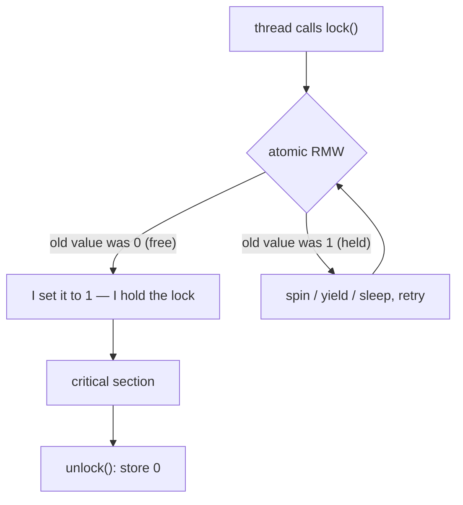

# Locks

**The crux:** a critical section is a stretch of code that touches shared state, and we need to guarantee that **only one thread executes it at a time** — otherwise interleaved reads and writes corrupt the state (a race). A lock is the tool that enforces this: `lock()` before the critical section, `unlock()` after. The hard part is *building* a lock that is **correct** (never lets two threads in), **fair** (no thread waits forever), and **fast** (little overhead when uncontended, little wasted work when contended) — using only the primitives the hardware actually gives us.

## The core idea

- **A lock provides mutual exclusion.** At most one thread holds the lock at a time; everyone else that calls `lock()` waits until the holder calls `unlock()`.
- **A good lock must give three things:**
  - **Mutual exclusion** — correctness. Two threads must never be inside the critical section simultaneously.
  - **Fairness** — every waiting thread eventually acquires the lock; no thread starves while others repeatedly barge ahead.
  - **Low overhead** — cheap to acquire/release when uncontended, and little wasted CPU when contended.
- **The lock is only a mechanism.** *You* decide the granularity: one coarse lock around a whole data structure is simple but serializes everything; many fine-grained locks allow parallelism but risk deadlock and add complexity.
- **You cannot build a correct lock from ordinary loads and stores alone** on real hardware — the read-then-write of "check if free, then grab it" is itself two steps that can interleave. We need the hardware to make that read-modify-write **atomic**.

## How it works

### Why disabling interrupts is not enough

The oldest trick for mutual exclusion is to turn off interrupts around the critical section:

```c
void lock(void)   { disable_interrupts(); }
void unlock(void) { enable_interrupts();  }
```

With interrupts off, the scheduler cannot preempt the running thread, so nothing else runs — instant mutual exclusion. But it is a bad general answer:

- **It only works on a single CPU.** On a multiprocessor, disabling interrupts on *this* core does nothing to stop a thread running on *another* core from entering the same critical section. Mutual exclusion is broken.
- **It hands unbounded power to user code.** A program could disable interrupts and never re-enable them (bug or malice), hanging the machine. So it is a privileged, kernel-only tool.
- **It loses interrupts.** While disabled, a device interrupt (disk done, packet arrived) may be missed or delayed.

Interrupt-disabling survives inside the kernel for very short, single-CPU-safe sequences, but real locks need a mechanism that works across cores. That mechanism is **hardware atomic instructions**.

### Hardware atomic primitives

Modern ISAs provide read-modify-write instructions that execute as one indivisible step, even across cores. The C11 header `<stdatomic.h>` exposes them portably. The three that matter for locks:

- **Test-and-set** — atomically write a 1 (or any new value) into a memory location and return its *old* value. Build a lock: spin until the old value was 0 (free), meaning *you* were the one who flipped it to 1.
- **Compare-and-swap (CAS)** — atomically: if `*p == expected`, store `desired` and report success; else report failure. It reads, compares, and conditionally writes as **one** step.
- **Fetch-and-add** — atomically add to a location and return the *previous* value. This gives each caller a distinct number — the basis of the **ticket lock**'s fairness.



Why CAS is called the **universal** primitive: with CAS you can implement test-and-set, fetch-and-add, and in fact any lock-free data structure — the classic read-old, compute-new, `CAS(old &#8594; new)`, retry-on-failure loop. Test-and-set and fetch-and-add are special cases.

```c
#include <stdatomic.h>
/* CAS: atomically compare *p to expected; if equal set *p=desired, return true.
   Read, compare, and conditional write happen as ONE indivisible step. */
static _Bool cas(atomic_int *p, int expected, int desired){
    return atomic_compare_exchange_strong(p, &expected, desired);
}
/* Anything can be built on CAS — here, a lock-free increment. */
static void atomic_inc(atomic_int *p){
    int old;
    do { old = atomic_load(p); } while (!cas(p, old, old + 1));
}
```

### The spin problem: spin, then yield, then sleep

A test-and-set lock **spins**: a waiter loops on the atomic instruction until the lock frees. On a multiprocessor with a short critical section that is fine — the holder releases quickly and the spinner grabs it. But spinning has a cost: **a spinning thread burns a whole CPU doing no work.** If the lock holder is not currently running (preempted), every spinner wastes its entire time slice checking a value that cannot change until the holder is rescheduled. With N threads contending for a lock held by a descheduled thread, you can waste N−1 time slices.

The remedies form a ladder, from cheapest-when-short to best-when-long:

1. **Spin** — good when the critical section is tiny and the holder is running on another core (the wait is measured in nanoseconds).
2. **Yield instead of spin** — after failing to acquire, call `sched_yield()` to give up the CPU voluntarily so the holder (or someone useful) can run. Cheaper than spinning under contention, but still wakes up repeatedly and can livelock with many threads.
3. **Park / unpark (sleeping locks)** — put the waiter fully to sleep in a queue and have `unlock()` explicitly **wake** one waiter. The waiter consumes **zero** CPU while blocked. On Linux this is done with the **futex** system call.

**Two-phase locks** combine the first and last: spin for a bounded number of iterations (betting the holder will release almost immediately, avoiding a costly syscall), and only if that fails fall back to sleeping. This captures the best case (fast uncontended/short-hold path) without the worst case (unbounded CPU waste).

```c
#include <stdatomic.h>
#include <sched.h>

typedef struct { atomic_flag f; } lock_t;
static void l_init(lock_t *s){ atomic_flag_clear(&s->f); }

/* Two-phase: spin a bounded number of times (phase 1), then yield the CPU
   (phase 2) instead of burning it while the holder is off-CPU. A real
   implementation would futex-sleep in phase 2; sched_yield keeps it portable. */
static void l_lock(lock_t *s){
    for (;;){
        for (int spin = 0; spin < 1000; spin++)
            if (!atomic_flag_test_and_set_explicit(&s->f, memory_order_acquire))
                return;               /* got it */
        sched_yield();                /* give up the CPU rather than spin on */
    }
}
static void l_unlock(lock_t *s){
    atomic_flag_clear_explicit(&s->f, memory_order_release);
}
```

### Futex: the sleeping-lock primitive

A **futex** (fast userspace mutex) is the Linux kernel call that makes sleeping locks efficient. The idea: the lock state lives in an ordinary userspace integer, and the kernel is only involved when a thread actually has to **wait** or **wake**.

- `futex(addr, FUTEX_WAIT, val, ...)` — atomically: *if* `*addr == val`, put this thread to sleep on `addr`; else return immediately. The value check closes the race where the lock is released between your userspace test and your sleep call.
- `futex(addr, FUTEX_WAKE, n, ...)` — wake up to `n` threads sleeping on `addr`.

The uncontended fast path (acquire and release) is a single atomic instruction in userspace with **no system call at all**; the kernel is touched only under contention. This is exactly how glibc's `pthread_mutex_t` is built, and it is why a modern mutex is cheap when uncontended yet does not waste CPU when contended.

### MCS / queue locks: scaling under heavy contention

A plain test-and-set or ticket lock has a subtle scaling problem: **every waiter spins on the same memory location.** On a cache-coherent multiprocessor, each time the lock variable changes, the coherence protocol must invalidate that cache line on *every* core spinning on it and re-fetch it — a storm of cache-coherence traffic that gets worse with more cores.

**MCS locks** (Mellor-Crummey & Scott) fix this. Each thread brings its own **queue node** (`qnode`) and the lock is a queue of these nodes:

- To acquire, a thread atomically swaps itself onto the tail of the queue (one `atomic_exchange` / CAS on the tail pointer), learning its predecessor.
- It then **spins only on a flag inside its own qnode** — its own cache line — which no one else writes until it is that thread's turn.
- To release, the holder flips the flag in its **successor's** qnode, handing the lock off directly.

Because each waiter spins on a distinct, local cache line, releasing the lock invalidates exactly **one** other core's line (the successor's), not everyone's. Coherence traffic per handoff is constant regardless of the number of waiters, so MCS scales to high core counts. It is also **FIFO-fair** by construction (the queue is the order). The cost is that each critical section needs a small per-thread qnode passed to lock/unlock. This is the design behind scalable kernel locks (e.g., Linux's qspinlock borrows the MCS idea).

## Must-know algorithms

All three drive a shared counter with 8 threads doing 200000 increments each and assert the final value is exactly `8 * 200000 = 1600000` — i.e. mutual exclusion held under contention. Compile with `cc -std=c11 -pthread`.

### 1. Test-and-set spinlock

The simplest correct lock. `atomic_flag` is C11's guaranteed-lock-free flag; `test_and_set` returns the old state, so we spin while it comes back "already set" (held).

```c
#include <stdatomic.h>
#include <pthread.h>
#include <stdio.h>
#include <assert.h>

typedef struct { atomic_flag f; } spinlock_t;
static void sl_init(spinlock_t *s){ atomic_flag_clear(&s->f); }
static void sl_lock(spinlock_t *s){
    /* spin while the old value was "set" (someone else holds it) */
    while (atomic_flag_test_and_set_explicit(&s->f, memory_order_acquire))
        ;
}
static void sl_unlock(spinlock_t *s){
    atomic_flag_clear_explicit(&s->f, memory_order_release);
}

#define NTHREADS 8
#define NITERS   200000
static spinlock_t lk;
static long counter = 0;

static void *worker(void *arg){
    (void)arg;
    for (int i = 0; i < NITERS; i++){
        sl_lock(&lk);
        counter++;              /* critical section */
        sl_unlock(&lk);
    }
    return NULL;
}

int main(void){
    sl_init(&lk);
    pthread_t t[NTHREADS];
    for (int i = 0; i < NTHREADS; i++) pthread_create(&t[i], NULL, worker, NULL);
    for (int i = 0; i < NTHREADS; i++) pthread_join(t[i], NULL);
    long expect = (long)NTHREADS * NITERS;
    printf("counter=%ld expected=%ld %s\n", counter, expect,
           counter == expect ? "OK" : "FAIL");
    assert(counter == expect);   /* mutual exclusion held */
    return 0;
}
```

Correct, but **not fair**: nothing stops one thread from re-winning the lock over and over while another spins indefinitely.

### 2. Ticket lock (fetch-and-add, FIFO fairness)

Two counters: `ticket` (next number to hand out) and `turn` (number being served) — like a deli counter. On `lock()`, atomically grab your ticket with fetch-and-add, then wait until `turn` equals your number. On `unlock()`, bump `turn`. Because tickets are handed out in order and served in order, waiters acquire in strict **FIFO** order — **no starvation**.

```c
#include <stdatomic.h>
#include <pthread.h>
#include <stdio.h>
#include <assert.h>

typedef struct {
    atomic_uint ticket;   /* next ticket to hand out */
    atomic_uint turn;     /* ticket currently being served */
} ticketlock_t;

static void tl_init(ticketlock_t *t){
    atomic_init(&t->ticket, 0);
    atomic_init(&t->turn, 0);
}
static void tl_lock(ticketlock_t *t){
    unsigned my = atomic_fetch_add_explicit(&t->ticket, 1, memory_order_relaxed);
    while (atomic_load_explicit(&t->turn, memory_order_acquire) != my)
        ;                 /* wait for my turn — strict FIFO order */
}
static void tl_unlock(ticketlock_t *t){
    unsigned next = atomic_load_explicit(&t->turn, memory_order_relaxed) + 1;
    atomic_store_explicit(&t->turn, next, memory_order_release);
}

#define NTHREADS 8
#define NITERS   200000
static ticketlock_t lk;
static long counter = 0;

static void *worker(void *arg){
    (void)arg;
    for (int i = 0; i < NITERS; i++){
        tl_lock(&lk);
        counter++;
        tl_unlock(&lk);
    }
    return NULL;
}

int main(void){
    tl_init(&lk);
    pthread_t t[NTHREADS];
    for (int i = 0; i < NTHREADS; i++) pthread_create(&t[i], NULL, worker, NULL);
    for (int i = 0; i < NTHREADS; i++) pthread_join(t[i], NULL);
    long expect = (long)NTHREADS * NITERS;
    printf("counter=%ld expected=%ld %s\n", counter, expect,
           counter == expect ? "OK" : "FAIL");
    assert(counter == expect);
    return 0;
}
```

### 3. MCS lock (per-thread qnode, CAS the tail)

Each waiter spins on `locked` inside its **own** qnode — its own cache line — so a release invalidates only the successor's line, not everyone's. `mcs_lock` appends the caller to the queue with a single `atomic_exchange` on the tail; `mcs_unlock` hands off to the successor, using a CAS on the tail to detect the empty-queue case.

```c
#include <stdatomic.h>
#include <pthread.h>
#include <stdio.h>
#include <assert.h>

/* Each waiter spins on ITS OWN qnode's `locked` flag (its own cache line),
   so a release touches only the successor's line — no global spinning. */
typedef struct mcs_node {
    _Atomic(struct mcs_node *) next;
    atomic_int locked;
} mcs_node_t;

typedef struct { _Atomic(mcs_node_t *) tail; } mcs_lock_t;

static void mcs_init(mcs_lock_t *L){ atomic_init(&L->tail, NULL); }

static void mcs_lock(mcs_lock_t *L, mcs_node_t *me){
    atomic_store_explicit(&me->next, NULL, memory_order_relaxed);
    /* atomically append me; get the previous tail (my predecessor) */
    mcs_node_t *pred = atomic_exchange_explicit(&L->tail, me, memory_order_acq_rel);
    if (pred == NULL) return;              /* queue was empty: lock is ours */
    atomic_store_explicit(&me->locked, 1, memory_order_relaxed);
    atomic_store_explicit(&pred->next, me, memory_order_release);
    while (atomic_load_explicit(&me->locked, memory_order_acquire)) /* spin on own line */
        ;
}

static void mcs_unlock(mcs_lock_t *L, mcs_node_t *me){
    mcs_node_t *succ = atomic_load_explicit(&me->next, memory_order_acquire);
    if (succ == NULL){
        /* no known successor: try to reset tail to NULL (release the lock) */
        mcs_node_t *expected = me;
        if (atomic_compare_exchange_strong_explicit(
                &L->tail, &expected, NULL,
                memory_order_release, memory_order_relaxed))
            return;                        /* no one waiting */
        /* a latecomer is mid-enqueue; wait for its next pointer to appear */
        while ((succ = atomic_load_explicit(&me->next, memory_order_acquire)) == NULL)
            ;
    }
    atomic_store_explicit(&succ->locked, 0, memory_order_release); /* hand off */
}

#define NTHREADS 8
#define NITERS   200000
static mcs_lock_t lk;
static long counter = 0;

static void *worker(void *arg){
    (void)arg;
    mcs_node_t node;                       /* per-thread qnode (on the stack) */
    for (int i = 0; i < NITERS; i++){
        mcs_lock(&lk, &node);
        counter++;
        mcs_unlock(&lk, &node);
    }
    return NULL;
}

int main(void){
    mcs_init(&lk);
    pthread_t t[NTHREADS];
    for (int i = 0; i < NTHREADS; i++) pthread_create(&t[i], NULL, worker, NULL);
    for (int i = 0; i < NTHREADS; i++) pthread_join(t[i], NULL);
    long expect = (long)NTHREADS * NITERS;
    printf("counter=%ld expected=%ld %s\n", counter, expect,
           counter == expect ? "OK" : "FAIL");
    assert(counter == expect);
    return 0;
}
```

All three print `... OK` and pass the assertion when run under contention — mutual exclusion holds. The ticket and MCS locks additionally guarantee FIFO fairness.

## Interview questions

1. **What must a good lock guarantee?**
   Three things. **Mutual exclusion** (correctness): never two threads in the critical section at once. **Fairness**: every waiting thread eventually gets in — no starvation. **Performance / low overhead**: cheap when uncontended (ideally one atomic instruction, no syscall) and little wasted work when contended (don't burn CPU spinning while the holder is off-CPU). A basic spinlock gives mutual exclusion but not fairness; a ticket lock adds fairness; a futex/sleeping lock adds the low-CPU-waste property under contention.

2. **Why can't you just disable interrupts to get mutual exclusion on a multiprocessor?**
   Disabling interrupts only stops preemption on the **current** core. Another core can still be running a thread that enters the same critical section, so mutual exclusion is broken. It is also privileged (user code that never re-enables interrupts hangs the machine) and can drop device interrupts. It survives only for short single-CPU-safe kernel sequences; real cross-core locks need hardware atomic instructions.

3. **How does test-and-set build a spinlock?**
   `test_and_set` atomically writes 1 into the lock word and returns its old value, as one indivisible step. `lock()` spins calling it until the returned old value is 0 — meaning the lock was free and *this* thread is the one that just flipped it to 1. `unlock()` stores 0. The atomicity is what closes the race that plain load-then-store would have. It is correct but unfair, and a waiter spins (burning CPU).

4. **What is compare-and-swap and why is it called the universal primitive?**
   CAS atomically does: if `*p == expected`, set `*p = desired` and return success, else return failure — read, compare, and conditional write as one step. It is universal because any lock-free operation can be built from it: read the current value, compute the new value, CAS from old to new, and retry on failure. Test-and-set and fetch-and-add are just special cases, and lock-free stacks/queues/counters are all CAS-retry loops.

5. **How does a ticket lock provide fairness and avoid starvation?**
   It uses fetch-and-add to hand every arriving thread a distinct, increasing **ticket** number, and serves a `turn` counter in order. A thread waits until `turn` equals its ticket, then runs; `unlock()` increments `turn`. Because tickets are handed out and served in strictly increasing order, threads acquire in **FIFO** order — every waiter is guaranteed to be served after a bounded number of releases, so no one starves. A plain test-and-set lock has no such ordering: one thread can keep re-winning.

6. **Spinning vs blocking — when does each win?**
   **Spin** when the critical section is very short and the holder is running on another core: the wait is nanoseconds and spinning avoids the (microsecond) cost of a context switch / syscall. **Block (sleep)** when the wait may be long or the holder might be descheduled: spinning would waste whole time slices doing nothing. The general answer is a **two-phase lock** — spin briefly (bet on a quick release), then fall back to sleeping (futex) if that fails — capturing the fast uncontended path without the worst-case CPU waste.

7. **Why do MCS (queue) locks scale better than a plain spinlock under high contention?**
   In a plain spinlock or ticket lock, **all** waiters spin on the **same** memory word, so every state change invalidates that cache line on every spinning core and triggers a coherence storm that worsens with core count. In an MCS lock each thread spins on a flag in **its own** qnode (its own cache line); a release writes only the successor's flag, invalidating exactly one other core's line. Coherence traffic per handoff is constant regardless of the number of waiters, and the queue makes it FIFO-fair. This cache-line locality is why MCS-style locks (e.g., Linux qspinlock) are used for scalable kernel locking.

8. **What is a futex?**
   A **fast userspace mutex** — the Linux primitive for building sleeping locks. The lock state is an ordinary userspace integer; the kernel is only invoked to wait or wake. `FUTEX_WAIT(addr, val)` sleeps the caller only if `*addr` still equals `val` (the value check closes the race with a concurrent release); `FUTEX_WAKE(addr, n)` wakes up to `n` sleepers. The uncontended acquire/release is a single atomic instruction with **no syscall**; the kernel is touched only under contention. `pthread_mutex_t` is built on it.

9. **Is a test-and-set spinlock correct on a machine with a weak memory model?**
   Only if the acquire and release carry the right memory-ordering barriers. The acquire (successful test-and-set) needs **acquire** semantics so the critical-section reads/writes cannot be hoisted before the lock is taken; the release (clearing the flag) needs **release** semantics so all critical-section writes are visible before the lock frees. C11 `atomic_flag_test_and_set_explicit(..., memory_order_acquire)` and `..._clear_explicit(..., memory_order_release)` request exactly these; without them a relaxed lock can let stale data leak across the boundary even though the flag logic looks right.

10. **What is the difference between a spinlock and a mutex in practice?**
    A **spinlock** busy-waits and never sleeps, so it is only appropriate for very short critical sections and (in the kernel) contexts where sleeping is forbidden, such as interrupt handlers. A **mutex** (e.g., `pthread_mutex_t`) is typically a two-phase futex lock: it may spin briefly but then sleeps, so it does not waste CPU on long holds and is safe to hold across blocking operations. Rule of thumb: spinlock for nanosecond-scale sections on multiprocessors, mutex for everything else.

## Coding problems

- 🎯 **Interview — [Print Zero Even Odd (LeetCode 1116)](https://leetcode.com/problems/print-zero-even-odd/)** — three threads must cooperate to print `0102030405...` in exact order. *Tests:* thread coordination and signalling (semaphores/condition variables) so exactly one thread proceeds at each step — the same "hand off the right to proceed" logic a fair lock implements.

- 🎯 **Interview — [The Dining Philosophers (LeetCode 1226)](https://leetcode.com/problems/the-dining-philosophers/)** — five philosophers share five forks; acquire both neighboring forks without deadlock or starvation. *Tests:* deadlock avoidance under lock acquisition (ordering forks, or a limit on concurrent diners) — the classic lock-composition hazard.

- 🏗 **Systems — Implement a spinlock.** Build a correct test-and-set spinlock with `atomic_flag` / `atomic_exchange` and acquire/release ordering, then prove mutual exclusion by driving a shared counter from many threads (as in the algorithm above). *Tests:* whether you understand atomic read-modify-write and memory ordering, not just the API.

- 🏗 **Systems — Implement a ticket lock.** Build a fetch-and-add ticket lock and argue its FIFO fairness, contrasting it with the test-and-set lock's lack of ordering. *Tests:* whether you can turn "atomically number each arrival" into a starvation-free lock and reason about fairness.

## Key takeaways

- A lock must provide **mutual exclusion** (correctness), **fairness** (no starvation), and **low overhead** — and you cannot build one from plain loads/stores; you need hardware atomics.
- **Disabling interrupts** gives mutual exclusion only on a single CPU; it is useless across cores and dangerous in user code.
- **Test-and-set** builds the simplest correct (but unfair, spinning) lock; **fetch-and-add** builds the FIFO-fair **ticket lock**; **CAS** is the universal primitive underlying all of them and every lock-free structure.
- Spinning wastes CPU when the holder is off-CPU. The remedy ladder is **spin &#8594; yield &#8594; sleep (futex)**; a **two-phase lock** spins briefly then sleeps, getting the best of both.
- A **futex** keeps the lock state in userspace and only calls the kernel to wait/wake, so the uncontended path is a single atomic instruction with no syscall.
- **MCS / queue locks** scale because each waiter spins on its **own** cache line, so a handoff invalidates exactly one line instead of triggering a coherence storm — and they are FIFO-fair by construction.

## Source(s) and further reading

- [OSTEP — _Locks_ (free chapter PDF)](https://pages.cs.wisc.edu/~remzi/OSTEP/threads-locks.pdf) — the primary source for lock requirements, test-and-set, ticket locks, spin-vs-yield, and two-phase locks.
- [OSTEP — book home page (all free chapters)](https://pages.cs.wisc.edu/~remzi/OSTEP/)
- [Wikipedia — Spinlock](https://en.wikipedia.org/wiki/Spinlock)
- [Wikipedia — Ticket lock](https://en.wikipedia.org/wiki/Ticket_lock)
- [Wikipedia — Compare-and-swap](https://en.wikipedia.org/wiki/Compare-and-swap)
- [Wikipedia — Test-and-set](https://en.wikipedia.org/wiki/Test-and-set)
- [Wikipedia — Fetch-and-add](https://en.wikipedia.org/wiki/Fetch-and-add)
- [Mellor-Crummey & Scott — MCS lock algorithms (pseudocode, U. Rochester)](https://www.cs.rochester.edu/research/synchronization/pseudocode/ss.html) — the canonical scalable queue-lock reference.
- [Wikipedia — Futex](https://en.wikipedia.org/wiki/Futex)
- [man7 — futex(2)](https://man7.org/linux/man-pages/man2/futex.2.html) — the Linux `FUTEX_WAIT` / `FUTEX_WAKE` system call.
