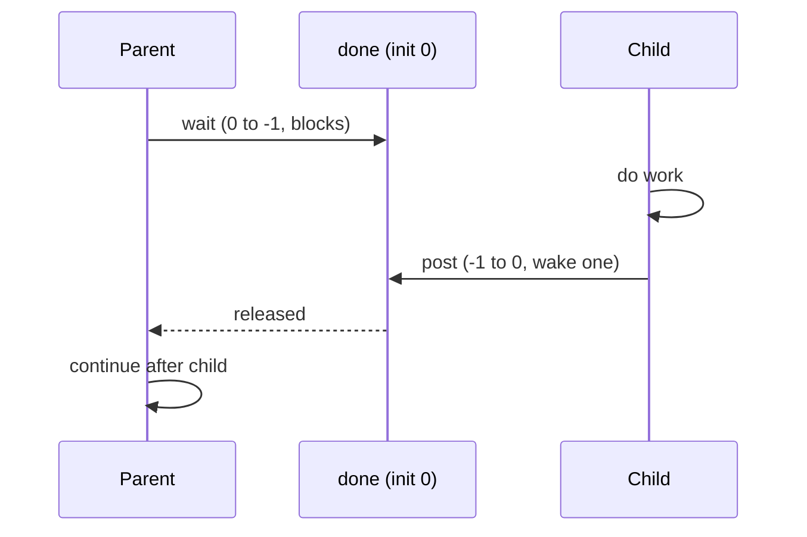
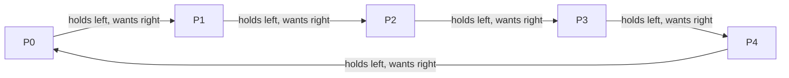

# Semaphores

**The crux:** locks give you mutual exclusion and condition variables give you ordering, but they are two different primitives with two different mental models. Can one object do both? Dijkstra's **semaphore** can. It is an integer you can only touch through two atomic operations, and from those two operations you can build a lock, a fence that makes one thread wait for another, a bounded buffer, a reader/writer lock, and the dining-philosophers solution. This page defines the primitive precisely, then uses it to solve the three canonical concurrency problems — with C you can compile and run.

## The core idea

- A **semaphore** is an integer with a hidden value, manipulated only by two atomic routines:
  - **`wait`** (Dijkstra's **P**, from *proberen*, "to test"; POSIX `sem_wait`): **decrement** the value, and if the result is negative, **block** the calling thread until someone raises it.
  - **`post`** (Dijkstra's **V**, from *verhogen*, "to increment"; POSIX `sem_post`): **increment** the value, and if any threads are blocked, **wake one** of them.
- Both operations are **atomic**: no two threads can interleave inside a `wait` or a `post`. That atomicity is the whole point — it is what a mutex and a naive counter cannot give you together.
- The **initial value** decides what the semaphore *is*:
  - Init **1** → a **lock** (a binary semaphore). One thread holds it; a second blocks until the first posts.
  - Init **0** → a **signal / fence** for ordering. A waiter blocks immediately; a signaller's `post` releases it exactly once.
  - Init **N** → a **counter** of available resources (e.g. N free buffer slots).
- One useful intuition (from OSTEP): when the value is **negative**, its magnitude equals the **number of threads currently waiting**. A value of `-3` means three threads are parked on this semaphore.
- A semaphore therefore subsumes both jobs — **mutual exclusion** (init 1) and **ordering** (init 0) — with a single primitive. That economy is why it shows up in nearly every interview about synchronization.

## How it works

### P and V, precisely

Think of `wait`/`post` as operating on the value under an implicit lock, with blocking when the count runs out:

```c
// Conceptual semantics (the real thing is atomic and uses a wait queue):
void sem_wait(sem_t *s) {
    s->value--;                 // consume one unit
    if (s->value < 0)
        block_until_posted(s);  // no unit was available: sleep
}
void sem_post(sem_t *s) {
    s->value++;                 // release one unit
    if (threads_waiting(s))
        wake_one(s);            // hand it to a sleeper
}
```

The invariant that makes semaphores composable: **every path that consumes a unit calls `wait`, every path that produces one calls `post`, and the two must balance.** Get the balance wrong and you either deadlock (too many waits) or lose exclusion (too few).

### A portable semaphore for the examples

macOS deprecates the unnamed POSIX `sem_init(3)` (it is a no-op stub there), so the programs below do **not** rely on `sem_t`. Instead they use a tiny **counting semaphore built from a mutex and a condition variable** — the standard way to implement one, and behaviorally identical to `sem_t`. On Linux you could swap in `sem_t` / `sem_wait` / `sem_post` unchanged. This one header is shared by every program on the page:

```c
// sem_common.h — a counting semaphore on a mutex + condition variable.
// macOS deprecates unnamed sem_init(3), so we implement our own; on Linux
// you may substitute POSIX sem_t / sem_wait / sem_post directly.
#include <pthread.h>

typedef struct {
    int value;
    pthread_mutex_t m;
    pthread_cond_t  c;
} zsem_t;

static void zsem_init(zsem_t *s, int value) {
    s->value = value;
    pthread_mutex_init(&s->m, NULL);
    pthread_cond_init(&s->c, NULL);
}

// P / wait / sem_wait: block while no unit is available, then take one.
static void zsem_wait(zsem_t *s) {
    pthread_mutex_lock(&s->m);
    while (s->value <= 0)
        pthread_cond_wait(&s->c, &s->m);
    s->value--;
    pthread_mutex_unlock(&s->m);
}

// V / post / sem_post: release a unit and wake one waiter.
static void zsem_post(zsem_t *s) {
    pthread_mutex_lock(&s->m);
    s->value++;
    pthread_cond_signal(&s->c);
    pthread_mutex_unlock(&s->m);
}
```

### Binary semaphore as a lock (init 1)

Initialize to **1** and bracket the critical section with `wait` / `post`. The first thread decrements 1 → 0 and enters; a second decrements 0 → -1 and blocks; the first's `post` brings it back to 0 and wakes the sleeper:

```c
zsem_t mutex;
zsem_init(&mutex, 1);      // init 1 => it is a lock

zsem_wait(&mutex);         // acquire
// ... critical section ...
zsem_post(&mutex);         // release
```

This is exactly a mutex. The only caveat is discipline: a semaphore does not track ownership, so nothing stops thread A from posting a "lock" that thread B is holding. A real mutex catches that; a binary semaphore does not.

### Semaphore for ordering / signaling (init 0)

Initialize to **0** to make one thread **wait for an event** in another. The classic case is a parent that must not proceed until its child has run:

```c
zsem_t done;
zsem_init(&done, 0);       // init 0 => a fence

// parent:
zsem_wait(&done);          // 0 -> -1, block until child posts
// child:
zsem_post(&done);          // -1 -> 0, releases the parent
```

Because it starts at 0, the order of the two threads does not matter. If the child runs first, its `post` leaves the value at 1, and the parent's later `wait` finds a unit waiting and sails through. If the parent runs first, it parks until the `post` arrives. Either way the parent proceeds **after** the child's work — that is ordering, done with a semaphore instead of a condition variable.



### Producer/consumer: three semaphores, and where the mutex must go

A bounded buffer with `N` slots needs to answer three questions at once: *is there a free slot to fill?*, *is there a filled slot to drain?*, and *is anyone else touching the buffer right now?* Three semaphores, one per question:

- `empty` — counts **free slots**, init **N**. A producer `wait`s it before filling.
- `full` — counts **filled slots**, init **0**. A consumer `wait`s it before draining.
- `mutex` — a binary lock, init **1**, around the actual buffer mutation.

The subtle, interview-favorite point is **ordering**: the `mutex` `wait` must come **after** the `empty`/`full` `wait`, not before. If a producer grabs `mutex` first and *then* blocks on a full buffer (`empty == 0`), it sleeps **while holding the lock**. A consumer that wants to drain a slot must take `mutex` to do so — but the producer is holding it, asleep, waiting for the consumer. **Deadlock.** Putting the counting semaphore first means a thread only ever holds `mutex` when it is guaranteed *not* to block. This is the full program from the top of the page (`prodcons.c`), and it runs to completion conserving every item:

```c
#include <stdio.h>
#include <pthread.h>
#include "sem_common.h"

#define N 8            // bounded buffer slots
#define ITEMS 1000     // items each producer makes
#define P 3            // producers
#define C 3            // consumers

int  buffer[N];
int  fill = 0, use = 0;
zsem_t empty;   // free slots, init N
zsem_t full;    // filled slots, init 0
zsem_t mutex;   // binary lock, init 1

long produced = 0, consumed = 0;   // protected by mutex

void put(int v) { buffer[fill] = v; fill = (fill + 1) % N; }
int  get(void)  { int v = buffer[use]; use = (use + 1) % N; return v; }

void *producer(void *arg) {
    (void)arg;
    for (int i = 0; i < ITEMS; i++) {
        zsem_wait(&empty);          // wait for a free slot
        zsem_wait(&mutex);          // mutex INSIDE empty -- never block holding it
        put(i); produced++;
        zsem_post(&mutex);
        zsem_post(&full);           // announce a filled slot
    }
    return NULL;
}

void *consumer(void *arg) {
    long got = 0;
    for (;;) {
        zsem_wait(&full);
        zsem_wait(&mutex);
        int v = get();
        if (v == -1) {              // poison pill: shut down cleanly
            zsem_post(&mutex);
            return (void *)got;
        }
        consumed++; got++;
        zsem_post(&mutex);
        zsem_post(&empty);
    }
}

int main(void) {
    zsem_init(&empty, N);
    zsem_init(&full, 0);
    zsem_init(&mutex, 1);

    pthread_t pr[P], co[C];
    for (int i = 0; i < P; i++) pthread_create(&pr[i], NULL, producer, NULL);
    for (int i = 0; i < C; i++) pthread_create(&co[i], NULL, consumer, NULL);
    for (int i = 0; i < P; i++) pthread_join(pr[i], NULL);

    // All real items are in flight; inject one poison pill per consumer.
    for (int i = 0; i < C; i++) {
        zsem_wait(&empty);
        zsem_wait(&mutex);
        put(-1);
        zsem_post(&mutex);
        zsem_post(&full);
    }
    for (int i = 0; i < C; i++) pthread_join(co[i], NULL);

    printf("produced=%ld consumed=%ld expected=%d\n",
           produced, consumed, ITEMS * P);
    printf(produced == (long)ITEMS*P && consumed == (long)ITEMS*P
           ? "OK: all items conserved, no deadlock\n" : "FAIL\n");
    return 0;
}
```

Compile and run with `cc -std=c11 -pthread`. Output:

```
produced=3000 consumed=3000 expected=3000
OK: all items conserved, no deadlock
```

The **poison pill** (`-1`) is a shutdown detail, not part of the synchronization: once producers finish, `main` pushes one sentinel per consumer so each consumer's blocking `wait(&full)` is satisfied and the thread exits. Without it, consumers would block forever on an empty-and-final buffer.

### Readers/writers lock

A reader/writer lock relaxes exclusion for the common case: **many readers may share** the data simultaneously, but a **writer needs exclusive** access. Built from two semaphores:

- `writelock` (init 1) — held by a writer, **or** by the *cohort* of readers as a whole.
- `lock` (init 1) — a plain mutex guarding the reader **count**.

The trick is that the **first** reader to arrive acquires `writelock` on behalf of everyone, and the **last** reader to leave releases it. In between, readers come and go freely, blocking only each other's brief count updates. A writer simply takes `writelock`, so it waits until no reader holds it and excludes other writers.

```c
#include <stdio.h>
#include <pthread.h>
#include "sem_common.h"

zsem_t lock;        // mutex over `readers`, init 1
zsem_t writelock;   // held by writer or reader cohort, init 1
int    readers = 0;

int    shared = 0;      // the protected datum
int    active_r = 0;    // readers currently inside
int    max_readers = 0; // peak concurrent readers observed
int    writer_in = 0;   // 1 while a writer is inside
int    saw_conflict = 0;// set if exclusion is ever violated
pthread_mutex_t obs = PTHREAD_MUTEX_INITIALIZER;  // observation only

void enter_read(void) {
    zsem_wait(&lock);
    readers++;
    if (readers == 1) zsem_wait(&writelock);  // first reader locks writers out
    zsem_post(&lock);
}
void exit_read(void) {
    zsem_wait(&lock);
    readers--;
    if (readers == 0) zsem_post(&writelock);  // last reader lets writers in
    zsem_post(&lock);
}
void enter_write(void) { zsem_wait(&writelock); }
void exit_write(void)  { zsem_post(&writelock); }

void *reader(void *arg) {
    (void)arg;
    for (int i = 0; i < 2000; i++) {
        enter_read();
        pthread_mutex_lock(&obs);
        active_r++;
        if (writer_in) saw_conflict = 1;              // reader saw a writer
        if (active_r > max_readers) max_readers = active_r;
        int snapshot = shared;
        pthread_mutex_unlock(&obs);
        for (volatile int s = 0; s < 300; s++) { }    // linger so readers overlap
        pthread_mutex_lock(&obs);
        active_r--;
        pthread_mutex_unlock(&obs);
        (void)snapshot;
        exit_read();
    }
    return NULL;
}

void *writer(void *arg) {
    (void)arg;
    for (int i = 0; i < 2000; i++) {
        enter_write();
        pthread_mutex_lock(&obs);
        if (active_r != 0 || writer_in) saw_conflict = 1;  // must be alone
        writer_in = 1;
        shared++;
        writer_in = 0;
        pthread_mutex_unlock(&obs);
        exit_write();
    }
    return NULL;
}

int main(void) {
    zsem_init(&lock, 1);
    zsem_init(&writelock, 1);

    pthread_t r[4], w[2];
    for (int i = 0; i < 4; i++) pthread_create(&r[i], NULL, reader, NULL);
    for (int i = 0; i < 2; i++) pthread_create(&w[i], NULL, writer, NULL);
    for (int i = 0; i < 4; i++) pthread_join(r[i], NULL);
    for (int i = 0; i < 2; i++) pthread_join(w[i], NULL);

    printf("final shared=%d (expected %d)\n", shared, 2 * 2000);
    printf("peak concurrent readers=%d\n", max_readers);
    printf(shared == 2 * 2000 && !saw_conflict
           ? "OK: writers exclusive, readers shared, no lost updates\n"
           : "FAIL: exclusion violated or update lost\n");
    return 0;
}
```

Output (4 readers, 2 writers) — note the **peak of 4 concurrent readers**, proving they truly share, while writers never overlap anyone:

```
final shared=4000 (expected 4000)
peak concurrent readers=4
OK: writers exclusive, readers shared, no lost updates
```

**Writer starvation caveat.** This construction is **reader-preferring**: as long as at least one reader is always present, `writelock` is never released, and a waiting writer can be blocked indefinitely. Real reader/writer locks add a fairness scheme — e.g. a "turnstile" semaphore that a writer signals so no *new* reader may enter once a writer is queued — to bound writer wait time. The tradeoff is a favorite interview probe: unfair-but-fast versus fair-but-more-machinery.

### Dining philosophers: the deadlock and the asymmetry fix

Five philosophers sit around a table; between each pair is one fork. To eat, a philosopher needs **both** neighboring forks. Model each fork as a **binary semaphore** (init 1). The naive rule — *grab your left fork, then your right* — deadlocks: if all five pick up their left fork at the same instant, everyone holds one fork and waits forever for a right fork that a neighbor is holding. That is the textbook **circular wait**.



The fix is to **break the symmetry**: have **one** philosopher grab **right first** while everyone else grabs left first. Now the cycle cannot close — there is no consistent "everyone reaches the same direction" state, so at least one philosopher can always acquire both forks and make progress. (Equivalently, this is the resource-ordering rule: number the forks and always take the lower-numbered one first; the asymmetric philosopher is exactly the one for whom "left" happens to be the higher number.)

```c
#include <stdio.h>
#include <pthread.h>
#include "sem_common.h"

#define NP 5          // philosophers
#define ROUNDS 1000   // meals each

zsem_t forks[NP];     // one binary semaphore per fork, init 1
long   meals[NP];     // meals eaten by each philosopher

int left(int p)  { return p; }
int right(int p) { return (p + 1) % NP; }

void *philosopher(void *arg) {
    int p = (int)(long)arg;
    for (int i = 0; i < ROUNDS; i++) {
        // Asymmetry fix: the last philosopher grabs RIGHT first; everyone
        // else grabs LEFT first. This breaks the circular wait, so the
        // "everyone holds one fork, waits for the next" deadlock cannot form.
        if (p == NP - 1) {
            zsem_wait(&forks[right(p)]);
            zsem_wait(&forks[left(p)]);
        } else {
            zsem_wait(&forks[left(p)]);
            zsem_wait(&forks[right(p)]);
        }
        meals[p]++;                 // eat
        zsem_post(&forks[left(p)]);
        zsem_post(&forks[right(p)]);
    }
    return NULL;
}

int main(void) {
    for (int i = 0; i < NP; i++) { zsem_init(&forks[i], 1); meals[i] = 0; }

    pthread_t t[NP];
    for (int i = 0; i < NP; i++)
        pthread_create(&t[i], NULL, philosopher, (void *)(long)i);
    for (int i = 0; i < NP; i++) pthread_join(t[i], NULL);

    int ok = 1;
    for (int i = 0; i < NP; i++) {
        printf("philosopher %d ate %ld meals\n", i, meals[i]);
        if (meals[i] != ROUNDS) ok = 0;
    }
    printf(ok ? "OK: all philosophers ate, no deadlock/starvation\n" : "FAIL\n");
    return 0;
}
```

Output — every philosopher completes all their meals, so the program terminates (a deadlocked version would hang forever):

```
philosopher 0 ate 1000 meals
philosopher 1 ate 1000 meals
philosopher 2 ate 1000 meals
philosopher 3 ate 1000 meals
philosopher 4 ate 1000 meals
OK: all philosophers ate, no deadlock/starvation
```

## Interview questions

**1. What is a semaphore? Give the P/V semantics.**
An integer manipulated only through two atomic operations. `wait`/P decrements it and blocks the caller if the result is negative; `post`/V increments it and wakes one blocked thread if any. A negative value's magnitude equals the number of threads currently waiting. Its initial value determines its role: 1 for a lock, 0 for signaling, N for counting resources.

**2. Binary semaphore vs mutex — same thing?**
A binary semaphore (init 1) provides mutual exclusion just like a mutex, but they differ in *ownership*. A mutex has an owner: only the thread that locked it may unlock it, which enables error checking, priority inheritance, and recursive locking. A semaphore has no owner — any thread may `post` it — so it can also be used for signaling *between* threads (one waits, a different one posts), which a mutex is not meant for. Rule of thumb: mutex for exclusion, semaphore when you also need cross-thread signaling.

**3. How do you use a semaphore for ordering/signaling?**
Initialize it to **0**. The thread that must wait calls `wait` and blocks (0 → -1); the thread performing the event calls `post` when done (-1 → 0), releasing exactly one waiter. Because it starts at 0, the outcome is correct regardless of which thread runs first: an early `post` simply leaves a unit banked for the later `wait`. This is how a parent waits for a child, or a worker waits for "data ready."

**4. Producer/consumer with semaphores — what are the three semaphores, and why does mutex ordering matter?**
`empty` (init N, free slots), `full` (init 0, filled slots), and `mutex` (init 1, guards the buffer). A producer does `wait(empty); wait(mutex); put; post(mutex); post(full)`. The `mutex` `wait` **must** come after the `empty` `wait`. If you reverse them, a producer can acquire `mutex` and *then* block because the buffer is full — sleeping while holding the lock the consumer needs to make room. That is a classic deadlock. Ordering the counting semaphore first guarantees a thread never blocks while holding `mutex`.

**5. Explain a reader/writer lock and writer starvation.**
Readers may hold the lock concurrently; a writer needs it exclusively. Built with a `writelock` semaphore that the *first* reader acquires for the whole reader cohort and the *last* reader releases, plus a mutex over the reader count. The naive version is reader-preferring: a continuous stream of readers never lets the count hit zero, so `writelock` is never freed and a writer can starve indefinitely. Fixing it requires a fairness gate (e.g. block new readers once a writer is waiting), trading throughput for bounded writer latency.

**6. Dining philosophers — what causes the deadlock and how do you fix it?**
Each philosopher needs both neighboring forks (each a binary semaphore). If all grab left-first simultaneously, everyone holds one fork and waits on a neighbor's — a circular wait, which is deadlock. Fix by breaking symmetry: make one philosopher grab right-first (equivalently, impose a global fork-acquisition order and always take the lower-numbered fork first). This removes the circular-wait condition, so the system always has a philosopher who can acquire both forks. Alternatives: a waiter/arbitrator semaphore, or limiting the table to at most four seated eaters.

**7. Semaphore vs condition variable — when do you reach for which?**
A condition variable has **no memory**: a `signal` with no one waiting is lost, so a CV must always be paired with a mutex and a re-checked predicate (`while (!ready) wait`). A semaphore **has state**: a `post` with no one waiting increments the count and is remembered, so an early signal is not lost. Use a **semaphore** for counting resources and simple "N units available" signaling; use a **condition variable** when threads must block on an arbitrary predicate over shared state that a plain integer can't capture (e.g. "queue non-empty *and* connection still open"). See [condition variables](/docs/os/concurrency/condition-variables) for the predicate-based model.

**8. Can you build a semaphore from a mutex and a condition variable (and vice versa)?**
Yes to the first — the `zsem_t` on this page is exactly that: a count, a mutex, and a CV where `wait` loops `while (value <= 0) cond_wait` then decrements, and `post` increments and signals. Building a general condition variable from semaphores is trickier (naive attempts lose or double-count signals), which is itself evidence that CVs and semaphores are not trivially interchangeable — a good thing to mention.

## Coding problems

🎯 **Interview (LeetCode)**

- [1226. The Dining Philosophers](https://leetcode.com/problems/the-dining-philosophers/) — deadlock-free fork acquisition; tests the asymmetry / resource-ordering fix above. *What it tests:* avoiding circular wait with per-fork locks or a limited-seating semaphore.
- [1114. Print in Order](https://leetcode.com/problems/print-in-order/) — force three methods to run in a fixed order across threads. *What it tests:* init-0 semaphores as ordering fences (exactly question 3).
- [1117. Building H2O](https://leetcode.com/problems/building-h2o/) — release threads in 2-hydrogen : 1-oxygen groups. *What it tests:* counting semaphores plus a barrier so molecules assemble in the right ratio.
- [1195. Fizz Buzz Multithreaded](https://leetcode.com/problems/fizz-buzz-multithreaded/) — four threads coordinate who prints each number. *What it tests:* semaphore-driven turn-taking / signaling between worker threads.

🏗 **Systems (OS-classic)**

- **Producer/consumer** with three semaphores (`empty`/`full`/`mutex`) — bounded-buffer throughput without deadlock; reference in C above. Background: [Wikipedia — Semaphore (programming)](https://en.wikipedia.org/wiki/Semaphore_(programming)).
- **Dining philosophers** with the asymmetry fix — build a solution that provably never deadlocks and let every philosopher eat; reference in C above. Background: [Wikipedia — Dining philosophers problem](https://en.wikipedia.org/wiki/Dining_philosophers_problem).
- **Reader/writer lock** from two semaphores — readers share, writer exclusive, then discuss/fix writer starvation; reference in C above. Background: [Wikipedia — Readers–writers problem](https://en.wikipedia.org/wiki/Readers%E2%80%93writers_problem).

## Key takeaways

- A semaphore is an atomic integer with `wait`/P (decrement, block if negative) and `post`/V (increment, wake one) — a single primitive that does both **exclusion** and **ordering**.
- The **initial value** is the design decision: **1** = lock, **0** = signal/fence, **N** = resource counter.
- In producer/consumer, the counting semaphore (`empty`/`full`) `wait` must come **before** the `mutex` `wait`, or a thread can sleep holding the lock and deadlock.
- The reader/writer lock lets the first reader lock out writers and the last reader release them; the naive version starves writers, which is fixed with a fairness gate.
- Dining philosophers deadlocks from a symmetric left-first grab; break symmetry (one philosopher right-first, or global fork ordering) to eliminate the circular wait.
- Reach for a **semaphore** when a stateful counter/signal fits, and a **condition variable** when threads must block on an arbitrary predicate. Related: [locks](/docs/os/concurrency/locks), [condition variables](/docs/os/concurrency/condition-variables), and [deadlock](/docs/os/concurrency/concurrency-bugs-deadlock).

## Source(s) and further reading

- OSTEP, *Semaphores* (free PDF): [https://pages.cs.wisc.edu/~remzi/OSTEP/threads-sema.pdf](https://pages.cs.wisc.edu/~remzi/OSTEP/threads-sema.pdf)
- Linux man pages: [sem_overview(7)](https://man7.org/linux/man-pages/man7/sem_overview.7.html), [sem_wait(3)](https://man7.org/linux/man-pages/man3/sem_wait.3.html), [sem_post(3)](https://man7.org/linux/man-pages/man3/sem_post.3.html)
- Wikipedia: [Semaphore (programming)](https://en.wikipedia.org/wiki/Semaphore_(programming)), [Dining philosophers problem](https://en.wikipedia.org/wiki/Dining_philosophers_problem), [Readers–writers problem](https://en.wikipedia.org/wiki/Readers%E2%80%93writers_problem)
