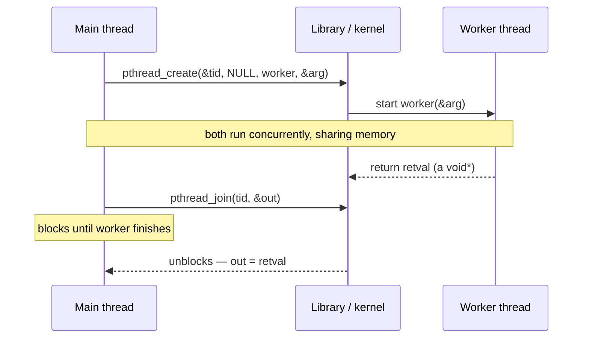
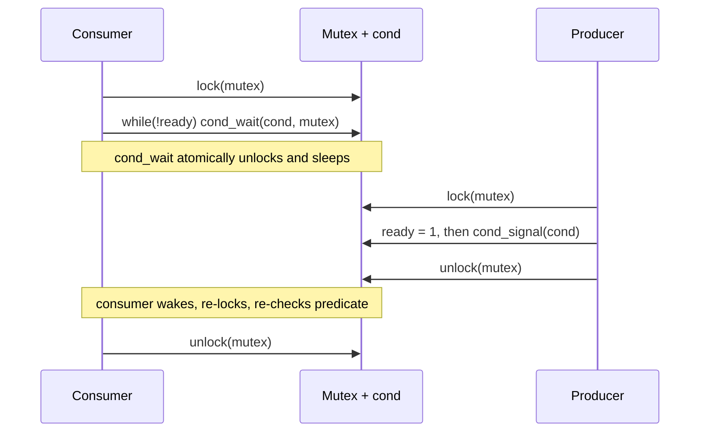

# Thread API (pthreads)

**The crux: how should a program run several flows of control inside one address space, and how do those flows coordinate without corrupting shared state?** A process gives you one program counter and one stack; concurrency needs many. POSIX threads (pthreads) answer with a small library: `pthread_create` spins up a new thread that runs a function, `pthread_join` waits for it and collects its result, `pthread_mutex_t` gives mutual exclusion over shared data, and `pthread_cond_t` lets a thread sleep until some condition another thread will make true. The whole difficulty is that threads share memory by default, so two mistakes dominate this API: passing arguments through a shared address (every thread ends up seeing the same value) and coordinating without atomically releasing a lock while sleeping (lost wakeups and missed conditions). Get those two right and the rest is mechanical.

## The core idea

- **A thread is a flow of control that shares the process's address space.** Every thread sees the same globals and heap; each has its own registers and its own stack. That sharing is the point (cheap communication) and the hazard (data races).
- **`pthread_create` starts a function on a new thread.** You hand it a start routine of type `void *(*)(void *)` and a single `void *` argument. Everything the thread needs comes through that one pointer — usually a pointer to a per-thread struct.
- **`pthread_join` is the thread analogue of `wait`.** It blocks until the target thread finishes and can retrieve that thread's return value (a `void *`).
- **Pass arguments by *distinct* storage, never by a shared loop variable.** The classic bug is `pthread_create(..., &i)` inside a loop: all threads read the same `i`, which the loop keeps changing. The fix is one distinct argument per thread (an element of an array, or a freshly `malloc`ed struct).
- **A mutex enforces mutual exclusion.** `pthread_mutex_lock` / `pthread_mutex_unlock` bracket a critical section so only one thread touches the shared data at a time.
- **A condition variable lets a thread wait for a predicate.** `pthread_cond_wait` atomically releases the mutex and sleeps; a signaling thread calls `pthread_cond_signal` (wake one) or `pthread_cond_broadcast` (wake all). You always wait **in a while loop, holding the lock**.
- **Threads are joinable or detached.** A joinable thread must be joined (or its resources leak); a detached thread cleans itself up on exit and cannot be joined.
- **Always check return codes.** Pthreads functions return `0` on success and a positive error number on failure — they do *not* set `errno`. Silent failures here become impossible-to-reproduce heisenbugs.

## How it works

### pthread_create and pthread_join

`pthread_create(&tid, attr, start_routine, arg)` creates a thread that immediately begins executing `start_routine(arg)`. It writes the new thread's id into `tid` and returns `0` on success. Because the start routine takes exactly one `void *` and returns a `void *`, you smuggle all inputs in through that pointer and hand all outputs back through the return value.

`pthread_join(tid, &retval)` blocks the caller until thread `tid` terminates, then stores that thread's return value into `retval` (pass `NULL` if you do not want it). Joining a thread that has already exited returns immediately; each joinable thread must be joined exactly once.



Return codes matter: `pthread_create` can fail with `EAGAIN` (not enough resources) and both calls can fail with `EINVAL`. They return the error number directly rather than setting `errno`, so the idiom is `int rc = pthread_...(...); if (rc != 0) { /* handle */ }`.

### Passing arguments correctly — the classic bug

The single `void *` argument is where most bugs live. The tempting pattern below is **wrong**:

```c
for (int i = 0; i < N; i++)
    pthread_create(&th[i], NULL, bad, &i);   /* BUG: &i is shared */
```

Every thread receives the *same address* — the address of the loop's `i`. The threads do not run instantly; by the time a worker dereferences `&i`, the loop has already advanced (or even finished) `i`, so multiple workers read the same, later value. It is a data race with no reliable outcome. Running such a program with three threads can print, for example:

```
bad worker saw 1
bad worker saw 3
bad worker saw 2
```

Note the `3` — that value is outside the intended range `0..2`; the worker read `i` *after* the loop incremented it. The fix is to give each thread its **own** storage so the value is captured, not shared:

- Allocate an array of argument structs and pass `&arr[i]` (distinct address per thread), or
- `malloc` a fresh argument per thread and have the thread `free` it.

Passing a small integer *by value* through the pointer itself (`(void *)(intptr_t)i`) also works, because the value is copied into the pointer at call time — but a per-thread struct is the general, readable solution and the one to reach for when a thread needs more than one input or an output slot.

### pthread_mutex_t — mutual exclusion

A mutex serializes access to shared data. Two ways to initialize it:

- **Static:** `pthread_mutex_t m = PTHREAD_MUTEX_INITIALIZER;` for a mutex with default attributes, known at compile time.
- **Dynamic:** `pthread_mutex_init(&m, attr)` at runtime (required when the mutex is heap-allocated or needs non-default attributes), paired with `pthread_mutex_destroy(&m)`.

`pthread_mutex_lock(&m)` blocks until the caller holds the mutex; `pthread_mutex_unlock(&m)` releases it. Only the thread that locked a mutex may unlock it. As with everything here, check the return codes — a failed lock that you ignore means you enter a critical section without protection.

```c
pthread_mutex_lock(&m);
/* critical section: exclusive access to shared state */
shared_counter++;
pthread_mutex_unlock(&m);
```

### pthread_cond_t — waiting for a predicate

A mutex alone cannot express "wait until the queue is non-empty." Spinning on the predicate while holding the lock deadlocks (no one else can change it); releasing the lock to spin wastes CPU and races. A condition variable solves this: it lets a thread **atomically release the lock and go to sleep**, then re-acquire the lock when woken.

- `pthread_cond_wait(&cond, &mutex)` — must be called with `mutex` held. It atomically unlocks `mutex` and blocks the thread. When another thread signals, it wakes, re-locks `mutex`, and returns. That release-and-sleep atomicity is the whole reason the primitive exists: it closes the window in which a signal could slip between "I checked the predicate" and "I went to sleep."
- `pthread_cond_signal(&cond)` — wake **at least one** waiter.
- `pthread_cond_broadcast(&cond)` — wake **all** waiters (use when a state change could satisfy several of them).

Two rules are non-negotiable:

1. **Always wait inside a `while (!predicate)` loop, never an `if`.** A thread can return from `pthread_cond_wait` without the predicate being true — because of *spurious wakeups*, or because another thread was woken first and consumed the condition. Re-checking in a loop is the only correct pattern.
2. **Hold the lock across the check, the wait, and the state change.** The signaling thread should also modify the predicate under the same lock before signaling. This is what guarantees a waiter never misses a wakeup.



### Detached vs joinable threads

- A **joinable** thread (the default) keeps its exit status and stack around until some other thread calls `pthread_join`. If you never join it, that bookkeeping leaks for the life of the process — the thread analogue of a zombie.
- A **detached** thread releases its resources automatically when it terminates and *cannot* be joined. Detach with `pthread_detach(tid)`, or create it detached via a `pthread_attr_t` with `PTHREAD_CREATE_DETACHED`. Use detachment for fire-and-forget work whose result you do not need.

Rule of thumb: if you need the thread's return value or need to know when it finished, keep it joinable and join it; otherwise detach it so you cannot leak it.

### Thread-local storage (brief)

Sometimes each thread needs its own copy of a variable — a per-thread scratch buffer, `errno`, a random-number seed. Thread-local storage (TLS) gives every thread an independent instance of the same named variable, so no locking is needed to use it.

- The simplest form is the compiler storage class: `__thread int counter;` (C11 also standardizes `_Thread_local`). Each thread reads and writes its own `counter`.
- The portable-with-cleanup form is `pthread_key_create`, `pthread_setspecific`, `pthread_getspecific`, which additionally lets you register a destructor run when a thread exits.

TLS trades sharing for isolation: it removes the data race entirely by giving each thread private state, at the cost of not being able to aggregate across threads without an explicit combine step.

## Must-know algorithms

Both programs compile and run under `cc -std=c11 -pthread`.

### 1. N worker threads with correct per-thread arguments

The canonical fan-out/fan-in: create `N` workers, give each its **own** argument struct (contrast the buggy `&i`), join them all, and combine the results. Here each worker sums a distinct slice of `0..999`, and `main` combines the partial sums.

```c
#include <stdio.h>
#include <stdlib.h>
#include <pthread.h>

#define N 4

typedef struct {
    int id;          /* per-thread input: which worker */
    long from, to;   /* half-open range [from, to) to sum */
    long result;     /* per-thread output slot */
} task_t;

static void *worker(void *arg) {
    task_t *t = (task_t *)arg;      /* recover the typed pointer */
    long acc = 0;
    for (long i = t->from; i < t->to; i++) acc += i;
    t->result = acc;                /* write result into our own slot */
    return NULL;                    /* could also return a heap pointer */
}

int main(void) {
    pthread_t th[N];
    task_t tasks[N];                /* one distinct struct per thread */
    long total_n = 1000;
    long chunk = total_n / N;

    for (int i = 0; i < N; i++) {
        tasks[i].id   = i;
        tasks[i].from = i * chunk;
        tasks[i].to   = (i == N - 1) ? total_n : (i + 1) * chunk;
        tasks[i].result = 0;
        /* pass &tasks[i] — a DISTINCT address per thread, not &i */
        int rc = pthread_create(&th[i], NULL, worker, &tasks[i]);
        if (rc != 0) { fprintf(stderr, "pthread_create: %d\n", rc); exit(1); }
    }

    long total = 0;
    for (int i = 0; i < N; i++) {
        int rc = pthread_join(th[i], NULL);   /* wait; ignore return value */
        if (rc != 0) { fprintf(stderr, "pthread_join: %d\n", rc); exit(1); }
        printf("worker %d summed [%ld,%ld) = %ld\n",
               tasks[i].id, tasks[i].from, tasks[i].to, tasks[i].result);
        total += tasks[i].result;
    }
    printf("total 0..%ld = %ld (expected %ld)\n",
           total_n - 1, total, total_n * (total_n - 1) / 2);
    return 0;
}
```

Output:

```
worker 0 summed [0,250) = 31125
worker 1 summed [250,500) = 93625
worker 2 summed [500,750) = 156125
worker 3 summed [750,1000) = 218625
total 0..999 = 499500 (expected 499500)
```

Because each thread owns `tasks[i]` (a distinct address) both for its inputs and its `result` slot, there is no shared mutable state during the parallel phase — so no lock is needed. The only synchronization is `pthread_join`, which establishes that all writes to `result` happen-before `main` reads them.

### 2. The minimal correct mutex + condition-variable skeleton

The pattern to memorize: **lock → `while (!ready) cond_wait` → do work → unlock**, with the producer publishing the predicate under the same lock before signaling.

```c
#include <stdio.h>
#include <stdlib.h>
#include <pthread.h>

/* Shared state guarded by one mutex; the condition variable lets the
 * consumer sleep until the producer sets ready = 1. */
static pthread_mutex_t lock  = PTHREAD_MUTEX_INITIALIZER;
static pthread_cond_t  cond  = PTHREAD_COND_INITIALIZER;
static int ready = 0;   /* the predicate the consumer waits on */
static int value = 0;   /* payload handed from producer to consumer */

static void must(int rc, const char *what) {
    if (rc != 0) { fprintf(stderr, "%s failed: %d\n", what, rc); exit(1); }
}

static void *consumer(void *arg) {
    (void)arg;
    must(pthread_mutex_lock(&lock), "lock");        /* 1. acquire the lock */
    while (!ready) {                                /* 2. WHILE, not if */
        /* cond_wait atomically releases 'lock' and sleeps; on wakeup it
         * re-acquires 'lock' before returning. */
        must(pthread_cond_wait(&cond, &lock), "cond_wait");
    }
    int v = value;                                 /* 3. safe: we hold lock */
    must(pthread_mutex_unlock(&lock), "unlock");   /* 4. release */
    printf("consumer got value = %d\n", v);
    return NULL;
}

int main(void) {
    pthread_t c;
    must(pthread_create(&c, NULL, consumer, NULL), "create");

    /* Producer side: publish under the same lock, then signal. */
    must(pthread_mutex_lock(&lock), "lock");
    value = 42;
    ready = 1;                                      /* set predicate first */
    must(pthread_cond_signal(&cond), "signal");     /* then wake a waiter */
    must(pthread_mutex_unlock(&lock), "unlock");

    must(pthread_join(c, NULL), "join");
    return 0;
}
```

Output:

```
consumer got value = 42
```

This is correct even if the consumer runs *first* (it locks, sees `ready == 0`, and sleeps until signaled) or *last* (the producer already set `ready == 1`, so the `while` never blocks). Setting `ready` under the lock *before* signaling is what makes both orderings safe — there is no window in which the signal is lost.

## Interview questions

**What do `pthread_create` and `pthread_join` do, and how do you pass data in and out of a thread?**
`pthread_create(&tid, attr, fn, arg)` starts `fn(arg)` on a new thread and writes its id into `tid`. The start routine has the fixed signature `void *fn(void *)`, so all inputs arrive through the single `void *` (normally a pointer to a struct) and the single output leaves through the `void *` return value. `pthread_join(tid, &ret)` blocks until that thread finishes and stores its return value into `ret`. Both return `0` on success or an error number (they do not set `errno`).

**Explain the loop-variable argument-passing bug and its fix.**
Writing `pthread_create(&th[i], NULL, fn, &i)` inside a `for` loop hands every thread the *same address* — that of the loop counter `i`. Threads do not start instantly, so by the time a thread dereferences `&i` the loop has advanced or finished, and several threads read the same later value; it is an unsynchronized data race with no defined result. The fix is to give each thread its own storage: pass `&arr[i]` from an array of per-thread argument structs, or `malloc` a fresh argument per thread (the thread frees it). Passing a small integer by value in the pointer (`(void *)(intptr_t)i`) also captures the value at call time.

**Why must `pthread_cond_wait` atomically release the lock and sleep?**
The waiter must check a predicate that only another thread can make true, and it must do that check while holding the lock (or the check races the change). If releasing the lock and going to sleep were two separate steps, a signaler could slip in between them — set the predicate and signal *after* the waiter released the lock but *before* it slept — and the wakeup would be lost, leaving the waiter asleep forever. Making unlock-and-sleep a single atomic step closes that window: the waiter is guaranteed to be asleep and eligible for wakeup the instant the lock is free.

**Why wait in a `while` loop and not an `if`?**
Because a return from `pthread_cond_wait` does not guarantee the predicate is true. Three reasons: *spurious wakeups* are permitted by POSIX; with `pthread_cond_broadcast`, several waiters wake but perhaps only one unit of work exists; and another thread may have been scheduled first and consumed the condition before this waiter re-acquired the lock. An `if` checks once and proceeds on a false assumption; a `while` re-checks after every wakeup and only proceeds when the predicate genuinely holds.

**Detached vs joinable threads — what is the difference and when do you use each?**
A joinable thread (the default) retains its exit status and stack until another thread calls `pthread_join`; failing to join it leaks those resources for the process's lifetime. A detached thread (via `pthread_detach` or a `PTHREAD_CREATE_DETACHED` attribute) frees its resources automatically on exit and cannot be joined. Keep a thread joinable when you need its result or its completion time; detach it for fire-and-forget work whose outcome you never read.

**What are the ways to initialize a `pthread_mutex_t`, and when do you use each?**
Statically with `PTHREAD_MUTEX_INITIALIZER` when the mutex has static storage and default attributes — it is ready to use with no runtime call. Dynamically with `pthread_mutex_init(&m, attr)` when the mutex is heap-allocated, or when you need non-default attributes (recursive, error-checking, process-shared, a specific protocol); a dynamically initialized mutex must eventually be `pthread_mutex_destroy`d. Only the thread that locked a mutex may unlock it.

**How do you return a value from a thread?**
Return a `void *` from the start routine and receive it via the second argument of `pthread_join`. For a small integer you can cast it into the pointer (`return (void *)(intptr_t)result;`). For anything larger, `malloc` the result, return the pointer, and have the joiner read then `free` it — never return a pointer to the thread's own stack, which is destroyed when the thread exits. Alternatively, write the result into a caller-provided per-thread output slot (as the worker example does with its `result` field) and read it after `join`.

**Why check every pthreads return code, given the functions "usually work"?**
Because when they fail they fail silently as far as `errno` is concerned — pthreads functions return the error number directly and leave `errno` untouched. A `pthread_mutex_lock` that returns `EDEADLK` or a `pthread_create` that returns `EAGAIN`, if ignored, leads to a critical section entered without protection or a thread that never started — bugs that surface only under load and are almost impossible to reproduce. Checking `rc != 0` at every call turns those into loud, immediate failures.

## Coding problems

- 🎯 **Print FooBar Alternately** — Tests two-thread turn-taking with a condition variable (or two semaphores): thread A prints `foo`, thread B prints `bar`, strictly alternating `foobar` n times. *What it tests:* using a shared turn flag under a mutex, waiting in a `while` loop, and signaling the peer — the exact lock/cond skeleton above applied to ping-pong ordering. [LeetCode 1115: Print FooBar Alternately](https://leetcode.com/problems/print-foobar-alternately/)

- 🎯 **Print Zero Even Odd** — Tests three-way coordination: one thread prints `0`, another the even numbers, another the odd numbers, producing `0102030405…`. *What it tests:* a state variable driving three condition-variable waiters, each blocking in a `while` until it is their turn, then handing off — a step up from two-thread alternation to a three-participant state machine. [LeetCode 1116: Print Zero Even Odd](https://leetcode.com/problems/print-zero-even-odd/)

- 🏗 **Build a correct worker pool with per-thread arguments** — Tests the fan-out/fan-in pattern end to end: split `M` jobs across `W` threads, give each worker its **own** argument struct (never a shared `&i`), join them all, and combine the partial results. *What it tests:* correct argument passing, joinability, and recognizing that when each thread writes only its own output slot, `join` alone provides the needed synchronization — no mutex required. A reference implementation:

  ```c
  #include <stdio.h>
  #include <stdlib.h>
  #include <pthread.h>

  /* A fixed-size worker pool: split M jobs across W threads, each worker
   * gets its own arg struct (never a shared &i), results combined on join. */
  typedef struct { int wid; const int *data; int start, end; long partial; } job_t;

  static void *run(void *arg) {
      job_t *j = arg;
      long s = 0;
      for (int i = j->start; i < j->end; i++) s += j->data[i];
      j->partial = s;
      return NULL;
  }

  int main(void) {
      enum { W = 4, M = 20 };
      int data[M];
      for (int i = 0; i < M; i++) data[i] = i + 1;   /* 1..20 */

      pthread_t th[W];
      job_t jobs[W];
      int per = (M + W - 1) / W;   /* ceil split */
      for (int w = 0; w < W; w++) {
          jobs[w].wid = w; jobs[w].data = data;
          jobs[w].start = w * per;
          jobs[w].end   = (w + 1) * per < M ? (w + 1) * per : M;
          if (jobs[w].start > M) jobs[w].start = M;
          jobs[w].partial = 0;
          pthread_create(&th[w], NULL, run, &jobs[w]);
      }
      long total = 0;
      for (int w = 0; w < W; w++) {
          pthread_join(th[w], NULL);
          total += jobs[w].partial;
      }
      printf("sum 1..%d = %ld (expected %d)\n", M, total, M * (M + 1) / 2);
      return 0;
  }
  ```

  It prints `sum 1..20 = 210 (expected 210)`. [Wikipedia: POSIX Threads](https://en.wikipedia.org/wiki/POSIX_Threads)

## Key takeaways

- `pthread_create` starts `fn(arg)` on a new thread; `pthread_join` waits for it and retrieves its `void *` return value. Both return `0` or an error number and do **not** set `errno` — always check `rc`.
- Never pass `&i` from a loop as the thread argument: all threads share that address and read the same changing value. Give each thread its own storage (an array element or a `malloc`ed struct).
- A mutex (`PTHREAD_MUTEX_INITIALIZER` or `pthread_mutex_init`) enforces mutual exclusion; only the locking thread may unlock it.
- `pthread_cond_wait` atomically releases the mutex and sleeps, then re-acquires it on wakeup — that atomicity is what prevents lost wakeups. Signal with `pthread_cond_signal` (one) or `pthread_cond_broadcast` (all).
- Always wait inside a `while (!predicate)` loop while holding the lock, because wakeups can be spurious or already-consumed.
- Joinable threads must be joined or they leak; detached threads self-clean and cannot be joined. Thread-local storage (`__thread`) gives each thread private state and sidesteps locking entirely.

## Source(s) and further reading

- [OSTEP — The Thread API (free PDF, chapter 27)](https://pages.cs.wisc.edu/~remzi/OSTEP/threads-api.pdf)
- [man7: pthread_create(3)](https://man7.org/linux/man-pages/man3/pthread_create.3.html)
- [man7: pthread_join(3)](https://man7.org/linux/man-pages/man3/pthread_join.3.html)
- [man7: pthread_mutex_lock(3)](https://man7.org/linux/man-pages/man3/pthread_mutex_lock.3.html)
- [man7: pthread_cond_wait(3)](https://man7.org/linux/man-pages/man3/pthread_cond_wait.3.html)
- [Wikipedia: POSIX Threads](https://en.wikipedia.org/wiki/POSIX_Threads)
