A process gives you one point of execution: a single program counter marching through code in one address space. But a program often has more work than one PC can drive — a server wants to handle many clients, a compute job wants to use every core, an app wants to keep computing while a disk read is in flight. The crux: **how do we let a single program run multiple flows of execution at once — sharing the same memory — without those flows corrupting each other's work?** A **thread** is that extra point of execution inside the *same* address space. Threads make parallelism and I/O overlap easy, but they hand you a sharp edge: because the OS can switch between threads at *any* instant, shared data updated without care produces **race conditions** and silently wrong results. This page builds the mental model and demonstrates the classic broken counter, then fixes it.

## The core idea

- A **thread** is another point of execution within a process. Where a single-threaded program has one PC, a multi-threaded program has several — each thread is running somewhere in the code at once.
- All threads of a process **share the same address space**: the same code, the same global variables, the same heap (everything `malloc` returns). Change a global in one thread and every other thread sees the change — that shared memory is the whole point, and the whole danger.
- What is **private** to each thread: its own **stack** (so each thread has its own local variables and call chain) and its own **registers**, including the **program counter (PC)** and **stack pointer (SP)**. Switching between threads is a **context switch** that saves and restores these registers — but, unlike a process switch, the address space (the page table) stays the same.
- **Why threads?** Two reasons. **Parallelism**: split a big computation across multiple CPUs so it finishes faster. **Overlap**: while one thread blocks on slow I/O (disk, network), another thread keeps the CPU busy instead of the whole program stalling.
- **The crux of concurrency — uncontrolled scheduling.** The OS scheduler may switch from one thread to another at *any* instruction boundary. Your code cannot assume a sequence of operations runs without interruption. This nondeterminism is what makes shared-memory concurrency hard.
- When two threads read-modify-write the same memory without coordination, their steps can **interleave** badly and one update is lost. That is a **race condition**. The stretch of code that touches the shared state is a **critical section**; correctness requires **mutual exclusion** (at most one thread inside the critical section at a time) so the update is **atomic** (all-or-nothing, indivisible).

## How it works

### Threads share memory; stacks and registers are private

Each thread carries its own PC/SP/registers and its own stack, but they all point into one shared address space. This tiny program proves it: the child thread reads and mutates a global the parent also sees.

```c
#include <stdio.h>
#include <pthread.h>

static int shared_global = 100;   /* one copy, visible to every thread */

static void *bump(void *arg) {
    int *seen = (int *)arg;
    *seen = shared_global;        /* reads the SAME variable main sees */
    shared_global += 1;
    return NULL;
}

int main(void) {
    pthread_t t;
    int seen = 0;
    printf("before: shared_global = %d\n", shared_global);
    pthread_create(&t, NULL, bump, &seen);
    pthread_join(t, NULL);
    printf("thread saw: %d\n", seen);
    printf("after:  shared_global = %d\n", shared_global);
    return 0;
}
```

Output (compile with `cc -std=c11 -pthread`):

```
before: shared_global = 100
thread saw: 100
after:  shared_global = 101
```

The thread saw the parent's value and its write persisted after `pthread_join` — one address space, two points of execution.

### `counter++` is not atomic

The statement `counter++` looks like one operation, but the CPU executes it as **three** distinct steps:

1. **load** the current value of `counter` from memory into a register;
2. **add** 1 to the register;
3. **store** the register back to `counter` in memory.

A context switch can land *between* any of these steps. If two threads both load the same old value before either stores, they each add 1 to the same starting number and store the same result — two increments collapse into one. That is a **lost update**.

### The interleaving that loses an update

Suppose `counter` starts at 50. Thread A and Thread B each want to do `counter++`. Here is a schedule the OS is fully allowed to pick:

```mermaid
sequenceDiagram
    participant A as Thread A
    participant M as counter (memory)
    participant B as Thread B
    Note over M: counter = 50
    A->>M: load  -&#62; regA = 50
    Note over A,B: OS switches to B (mid-update!)
    B->>M: load  -&#62; regB = 50
    B->>B: add   -&#62; regB = 51
    B->>M: store -&#62; counter = 51
    Note over A,B: OS switches back to A
    A->>A: add   -&#62; regA = 51
    A->>M: store -&#62; counter = 51
    Note over M: counter = 51 (should be 52 — one update lost)
```



Both threads ran `counter++`, so the value should be 52. Because A's load happened before B's store, A overwrote B's work with a stale value. Nothing is broken about either thread individually — the bug is entirely in the **interleaving**, which the scheduler chose nondeterministically. Run it again and the timing may differ, so the answer differs run to run. This is the defining pain of concurrency.

### Critical section, mutual exclusion, atomicity

- The three-step read-modify-write on `counter` is a **critical section**: code that accesses shared state and must not be interleaved with another thread's access to the same state.
- The property we need is **mutual exclusion**: at most one thread executes the critical section at a time. While A is inside, B waits.
- With mutual exclusion the update becomes **atomic** — indivisible from other threads' point of view. They see `counter` either fully before or fully after A's increment, never a torn in-between.
- We cannot get this for free from the hardware for arbitrary code. We need **synchronization primitives**: **locks (mutexes)** to enforce mutual exclusion, and **condition variables** and **semaphores** to make threads wait for events. Those are the subjects of the next pages; here we show the lock closing the race.

## Must-know algorithms

### The data race — two threads, no lock

Two threads each increment a shared counter one million times. The correct answer is `2 * 1,000,000 = 2,000,000`. Without a lock the answer is both **wrong** (far below 2N) and **nondeterministic** (different every run).

```c
#include <stdio.h>
#include <pthread.h>

#define ITERS 1000000

static long counter = 0;  /* shared: lives in the process's globals */

static void *worker(void *arg) {
    (void)arg;
    for (int i = 0; i < ITERS; i++) {
        counter++;            /* load, add, store — NOT atomic */
    }
    return NULL;
}

int main(void) {
    pthread_t t1, t2;
    pthread_create(&t1, NULL, worker, NULL);
    pthread_create(&t2, NULL, worker, NULL);
    pthread_join(t1, NULL);
    pthread_join(t2, NULL);

    printf("expected: %d\n", 2 * ITERS);
    printf("actual:   %ld\n", counter);
    printf("lost:     %ld\n", (long)2 * ITERS - counter);
    return 0;
}
```

Three consecutive runs (`cc -std=c11 -pthread`):

```
=== run 1 ===
expected: 2000000
actual:   1010983
lost:     989017
=== run 2 ===
expected: 2000000
actual:   1030263
lost:     969737
=== run 3 ===
expected: 2000000
actual:   1007265
lost:     992735
```

Nearly half the increments vanished, and no two runs agree. Every lost count is one of those bad interleavings from the diagram above.

### The fix — a `pthread_mutex_t` around the critical section

Wrap the increment in a lock. Now only one thread can be inside `counter++` at a time, so no load ever sees a stale value.

```c
#include <stdio.h>
#include <pthread.h>

#define ITERS 1000000

static long counter = 0;
static pthread_mutex_t lock = PTHREAD_MUTEX_INITIALIZER;

static void *worker(void *arg) {
    (void)arg;
    for (int i = 0; i < ITERS; i++) {
        pthread_mutex_lock(&lock);      /* enter critical section */
        counter++;                      /* now atomic w.r.t. other threads */
        pthread_mutex_unlock(&lock);    /* leave critical section */
    }
    return NULL;
}

int main(void) {
    pthread_t t1, t2;
    pthread_create(&t1, NULL, worker, NULL);
    pthread_create(&t2, NULL, worker, NULL);
    pthread_join(t1, NULL);
    pthread_join(t2, NULL);

    printf("expected: %d\n", 2 * ITERS);
    printf("actual:   %ld\n", counter);
    return 0;
}
```

Three consecutive runs — always exactly right:

```
=== run 1 ===
expected: 2000000
actual:   2000000
=== run 2 ===
expected: 2000000
actual:   2000000
=== run 3 ===
expected: 2000000
actual:   2000000
```

The lock costs performance (threads serialize through the critical section), but it restores correctness. The trade-off between correctness and scalability is the story of the rest of this section.

## Interview questions

**1. Thread vs process — what is shared and what is private?**
All threads of a process **share** the address space: code, globals, heap, and open file descriptors. Each thread has its **own** stack, registers, program counter, and stack pointer. A process, by contrast, has its own private address space isolated from other processes. So threads communicate cheaply through shared memory; processes must use explicit IPC (pipes, shared memory segments, sockets).

**2. What is a race condition?**
A bug where the outcome depends on the nondeterministic timing/interleaving of concurrent threads accessing shared state, at least one of them writing. The classic form is a lost update: two threads read-modify-write the same variable and one overwrites the other. The result is correct-looking code that produces wrong, run-dependent answers.

**3. Why is `x++` not atomic?**
Because the CPU compiles it to a load-add-store sequence: read `x` into a register, increment the register, write it back. A context switch can occur between any two of those steps, letting another thread read the same old value before the store lands. Both threads then compute the same result, so one increment is lost. Atomicity would require the three steps to be indivisible, which plain memory access does not guarantee.

**4. What are a critical section and mutual exclusion?**
A **critical section** is a region of code that accesses shared state and must not run concurrently with another thread's access to that same state. **Mutual exclusion** is the guarantee that at most one thread is inside the critical section at a time. Enforcing mutual exclusion (with a lock) makes the enclosed operation appear atomic to other threads.

**5. What makes concurrency fundamentally hard?**
Uncontrolled, nondeterministic scheduling. The OS may preempt a thread at any instruction, so any interleaving of threads' steps is possible. Bugs manifest only under specific timings, making them rare, non-reproducible ("heisenbugs"), and invisible in single-threaded testing. You must reason about *all* possible interleavings, not the one you observed.

**6. How does a thread context switch differ in cost from a process context switch?**
Both save and restore registers (PC, SP, general registers). But a **process** switch also changes the address space — swapping page tables and typically flushing or invalidating TLB entries, which is expensive because subsequent memory accesses miss the TLB. A **thread** switch within the same process keeps the address space and page table, so the TLB stays warm. Thread switches are therefore cheaper, one reason threads are favored for fine-grained concurrency.

**7. When do threads actually help, and when don't they?**
They help when work is **CPU-bound and parallelizable** (split across cores for real speedup) or **I/O-bound** (one thread overlaps computation while another blocks on disk/network). They don't help when a single lock or a runtime restriction serializes everything: e.g. Python's Global Interpreter Lock (GIL) prevents CPython threads from running bytecode in parallel, so CPU-bound Python sees no speedup from threads (I/O-bound still benefits, since the GIL is released during blocking calls). And on a single core, CPU-bound threads only time-slice — no throughput gain, just context-switch overhead.

**8. A lock fixes correctness but the program got slower. Why?**
Because the lock **serializes** the critical section: threads that could have run in parallel now queue up one at a time through it. If the critical section is large or contended, most of the program runs effectively single-threaded, and you also pay lock acquire/release overhead. The remedy is to shrink critical sections, reduce contention, or use finer-grained or lock-free techniques — covered in later pages.

## Coding problems

🎯 **Interview (LeetCode)**

- [Print in Order — LeetCode 1114](https://leetcode.com/problems/print-in-order/) — enforce an ordering (`first` → `second` → `third`) across three threads scheduled in any order. Tests using synchronization to impose a happens-before relation.
- [Fizz Buzz Multithreaded — LeetCode 1195](https://leetcode.com/problems/fizz-buzz-multithreaded/) — four threads cooperate to print the FizzBuzz sequence in order. Tests turn-taking coordination and condition signalling between threads.

🏗 **Systems (OS-classic)**

- **Fix the racy counter with a mutex** — the two programs in *Must-know algorithms* above: reproduce the lost-update race, then make the increment atomic with `pthread_mutex_lock`/`unlock`. Tests recognizing a critical section and enforcing mutual exclusion.

### Reference: LeetCode 1114 with a condition variable

Portable and deterministic — the threads are spawned in scrambled order, yet the output is always `first / second / third`.

```c
#include <stdio.h>
#include <pthread.h>

static pthread_mutex_t m = PTHREAD_MUTEX_INITIALIZER;
static pthread_cond_t  cv = PTHREAD_COND_INITIALIZER;
static int step = 1;   /* the next print allowed to run */

static void *run_first(void *a) {
    (void)a;
    pthread_mutex_lock(&m);
    printf("first\n");
    step = 2;
    pthread_cond_broadcast(&cv);
    pthread_mutex_unlock(&m);
    return NULL;
}
static void *run_second(void *a) {
    (void)a;
    pthread_mutex_lock(&m);
    while (step != 2) pthread_cond_wait(&cv, &m);
    printf("second\n");
    step = 3;
    pthread_cond_broadcast(&cv);
    pthread_mutex_unlock(&m);
    return NULL;
}
static void *run_third(void *a) {
    (void)a;
    pthread_mutex_lock(&m);
    while (step != 3) pthread_cond_wait(&cv, &m);
    printf("third\n");
    pthread_mutex_unlock(&m);
    return NULL;
}

int main(void) {
    pthread_t a, b, c;
    /* spawn scrambled to prove the ordering is enforced, not luck */
    pthread_create(&c, NULL, run_third,  NULL);
    pthread_create(&b, NULL, run_second, NULL);
    pthread_create(&a, NULL, run_first,  NULL);
    pthread_join(a, NULL); pthread_join(b, NULL); pthread_join(c, NULL);
    return 0;
}
```

Output over five runs (`cc -std=c11 -pthread`): `first second third` every time. The `while (step != N)` loop (not an `if`) guards against spurious wakeups — the standard condition-variable idiom, detailed on the condition-variables page.

## Key takeaways

- A **thread** is a second point of execution in the **same address space**: threads share code, globals, and heap, but each has a private **stack** and private **registers/PC**.
- Threads exist for **parallelism** (use many cores) and **overlap** (keep the CPU busy while one thread waits on I/O).
- The crux is **uncontrolled scheduling**: the OS can preempt at any instruction, so shared-memory updates can interleave into wrong results — a **race condition**.
- `counter++` is really **load, add, store** — not atomic — so two threads can both read the same old value and lose an update.
- A **critical section** must run with **mutual exclusion** so its update is **atomic**; a **lock (mutex)** provides this and turns the racy counter's nondeterministic wrong answer into the correct `2N`.
- Locks restore correctness at the cost of serialization; the rest of this section is about synchronizing correctly and efficiently.

Related: the [process abstraction](/docs/os/virtualization-cpu/processes) (a thread is a point of execution *inside* a process) and [CPU scheduling](/docs/os/virtualization-cpu/cpu-scheduling) (the scheduler whose nondeterministic choices create these interleavings).

## Source(s) and further reading

- OSTEP — [Concurrency: An Introduction (threads-intro.pdf)](https://pages.cs.wisc.edu/~remzi/OSTEP/threads-intro.pdf) — the free chapter this page is grounded in.
- man7 — [pthreads(7)](https://man7.org/linux/man-pages/man7/pthreads.7.html) — POSIX threads overview: what is shared vs per-thread.
- man7 — [pthread_mutex_lock(3p)](https://man7.org/linux/man-pages/man3/pthread_mutex_lock.3p.html) — the mutex used to close the race.
- Wikipedia — [Thread (computing)](https://en.wikipedia.org/wiki/Thread_(computing)), [Race condition](https://en.wikipedia.org/wiki/Race_condition), [Critical section](https://en.wikipedia.org/wiki/Critical_section).
