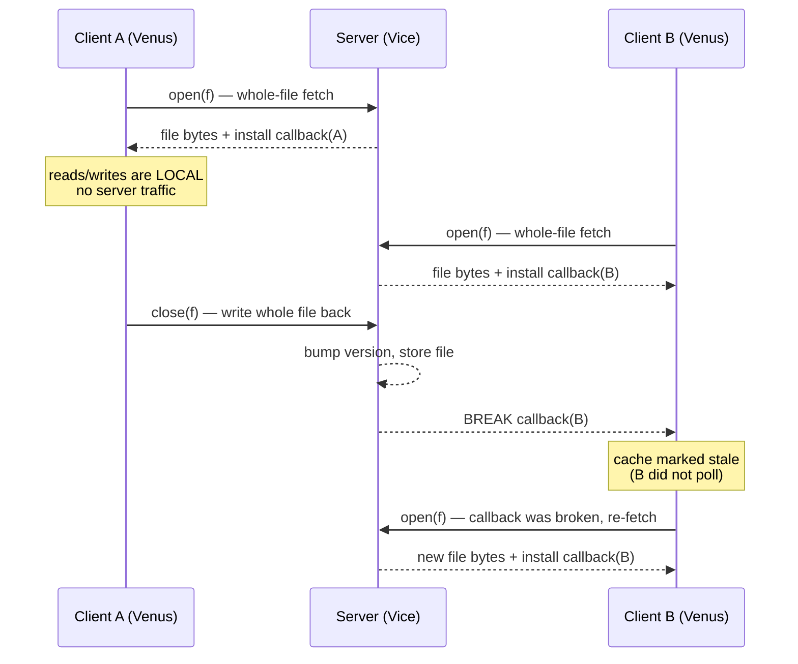
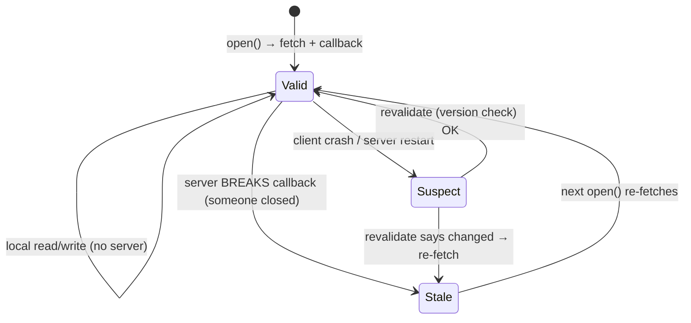

# Andrew File System (AFS)

**The crux:** [NFS](/docs/os/distribution/nfs) was designed for correctness under failure, not for scale. Its protocol is *chatty* — every read and write is a server round trip, and to keep caches fresh a client fires a `GETATTR` on essentially every `open()` to ask "has this file changed?". Multiply that by hundreds of workstations and the server drowns in revalidation traffic long before it runs out of disk or CPU for real work. AFS asks a different question: **how do we serve as many clients per server as possible?** Its answer rethinks caching from the ground up — cache **whole files** on the client's local disk, do all reads and writes locally, and let the *server* tell a client when its copy is stale (a **callback**) instead of making the client keep asking. The result is dramatically less server load per client, and therefore far more clients per server.

## The core idea

- **The goal is scale — clients per server.** AFS grew out of a campus-wide deployment at CMU aiming to support thousands of workstations. The design metric was not latency of a single operation but how many active clients one server could sustain.
- **Whole-file caching on local disk.** On `open()`, the client fetches the *entire* file from the server and stores it on its own local disk. Every subsequent `read()`/`write()` is served from that local copy with **no** server communication. On `close()`, if the file was modified, the whole file is flushed back to the server.
- **Callbacks replace polling.** When the server hands a client a file, it also records a **callback**: a promise to notify that client if the file later changes. The client trusts its cached copy until the server **breaks the callback**. This inverts NFS's model — the client never polls with `GETATTR` on open; it assumes the cache is valid until told otherwise.
- **Statefulness is the price.** To make callbacks work the server must remember, per file, *which clients hold a copy*. AFS is therefore a **stateful** protocol, unlike NFS's deliberately stateless one. That state buys scalability but complicates crash recovery.
- **Consistency is coarse but simple.** A reader sees the version of the file that existed at its `open()`. A writer's changes become visible to everyone else only after `close()`. Concurrent writers resolve **last-writer-wins**: whichever client closes last overwrites the file entirely.

## How it works

### The two operations that touch the server

Only `open()` and `close()` cross the network. Reads and writes are local disk operations. The client-side cache manager (historically called *Venus*) mediates:

- **`open(f)`** — if the client holds a copy of `f` with an *unbroken* callback, use it with zero network traffic. Otherwise fetch the whole file from the server (*Vice*), store it on local disk, and register a callback for `f`.
- **`read`/`write`** — served entirely from the local on-disk copy. No server involvement, so throughput is bounded by the client's own disk, not the network or the shared server.
- **`close(f)`** — if `f` was modified, ship the whole file back. The server installs it, bumps the file's version, and **breaks callbacks** to every other client that cached `f`.

### Whole-file fetch and callback break



The key line is the **break**: client B learns its copy is stale because the server *pushed* the notification, not because B asked. Between B's two opens, B did no server communication at all — contrast NFS, where B would have sent a `GETATTR` on every open just in case.

### Why this scales

Model the server load per client as revalidation messages. Under NFS's poll-on-open, each of $N$ clients sends roughly one `GETATTR` per open; server work grows with **total open frequency across all clients**. Under AFS, a cached file with an intact callback costs the server **zero** messages until the file actually changes, and a change costs **one break per cacher**. If reads vastly outnumber writes — the common case for shared files, binaries, and source trees — AFS server traffic collapses toward zero.

$$
\text{server\_msgs}_{\text{NFS}} \approx \sum_{c} \text{opens}(c)
\qquad
\text{server\_msgs}_{\text{AFS}} \approx \sum_{f} \big(\text{writes}(f)\times \text{cachers}(f)\big)
$$

Reads dropped out of the AFS term entirely. That is the whole scalability story in one line.

### Consistency semantics

- **Open-to-close currency.** Whatever version of the file exists when you `open()` is the version you see for the life of that open, even if someone else closes a newer version meanwhile. Your reads never change under you mid-session.
- **Update visibility.** Your writes are invisible to others until you `close()`. After you close, the *next* `open()` by any other client returns your version (their old copy's callback was broken).
- **Last-writer-wins.** If A and B both open, both edit, and both close, the file ends up as whoever closed **last** — the earlier writer's entire file is silently overwritten. AFS does no block-level merge; the unit of update is the whole file.
- **The large-file caveat.** Whole-file caching assumes files fit on the client's local disk and that fetching the whole thing on open is worthwhile. For a multi-gigabyte file where a process reads a few bytes, fetching everything is disastrous — and a file larger than the local cache cannot be handled at all. AFS is a poor fit for huge files and for random-access workloads like databases.

### Crash recovery

Statefulness makes crashes interesting on both sides:

- **Client crash.** A crashed client cannot trust any callback it held — while it was down, the server may have tried and failed to reach it, or the client simply missed a break. On recovery the client must **revalidate**: for each cached file, check with the server whether the copy is still current (compare version / re-establish the callback) before using it. In practice a client treats its cache as suspect after any downtime longer than a heartbeat.
- **Server crash.** The server's callback table is in-memory state. After a restart it has *lost track of who cached what*, so it cannot know which callbacks to honor. The conservative recovery is to treat **all** callbacks as broken: clients, on their next contact, revalidate every cached file. AFS uses periodic client-server keep-alive so both sides notice a partner that went away and fall back to revalidation.



## Must-know algorithms

### Callback-based cache consistency

The one model to internalize: whole-file client caches, a per-file callback list on the server, breaks on write-back, re-fetch on next open, and last-writer-wins on concurrent closes. This C program is a faithful, self-contained simulation. It proves a cacher is invalidated **exactly** when the file changes (never by polling), that an intact callback makes re-open free, and that concurrent closes resolve last-writer-wins.

```c
// A callback-based cache-consistency model, the way AFS does it.
//
// The server owns each file's authoritative contents plus a version number and,
// per file, a "callback list": the set of clients that currently hold a cached
// copy and have been PROMISED a notification if the file changes. Reads and
// writes happen entirely against the client's local cache; the client talks to
// the server only on open (fetch-if-stale) and on close (write-back).
//
// The invariant we demonstrate: a cacher is invalidated EXACTLY when the file
// changes (server pushes a callback break — no polling), and two clients that
// close overlapping edits resolve last-writer-wins.
#include <stdio.h>
#include <string.h>
#include <stdbool.h>

#define MAX_CLIENTS 8
#define FSZ 64

typedef struct {
    char data[FSZ];             // authoritative file contents
    int  version;               // bumped on every write-back (close)
    bool callback[MAX_CLIENTS]; // callback[c] == server owes client c a break
} Server;

typedef struct {
    int  id;
    char cache[FSZ];       // whole-file local copy
    int  cached_version;   // version this copy was fetched at
    bool valid;            // false once a callback break lands, or never fetched
} Client;

static Server srv;

// Server pushes a break to every OTHER cacher, then clears its own promises to
// them. This is the callback break: no client polled — the write triggered it.
static void break_callbacks(Client *cl, int n, int writer) {
    for (int i = 0; i < n; i++) {
        int c = cl[i].id;
        if (c != writer && srv.callback[c]) {
            cl[i].valid = false;   // the notification invalidates the cache
            srv.callback[c] = false;
        }
    }
}

// open: fetch the whole file only if we don't hold a valid copy. If our copy is
// still valid (no break arrived), we reuse it with ZERO server traffic — that is
// the win over NFS's GETATTR-per-open.
static bool did_fetch;
static void client_open(Client *c) {
    if (c->valid) { did_fetch = false; return; }   // callback intact: no fetch
    memcpy(c->cache, srv.data, FSZ);
    c->cached_version = srv.version;
    c->valid = true;
    srv.callback[c->id] = true;    // server now owes us a break on any change
    did_fetch = true;
}

// local writes never touch the server
static void client_write(Client *c, const char *s) { strncpy(c->cache, s, FSZ - 1); }

// close: write the whole file back, bump version, break everyone else's callback
static void client_close(Client *c, Client *all, int n) {
    memcpy(srv.data, c->cache, FSZ);
    srv.version++;
    c->cached_version = srv.version;
    srv.callback[c->id] = true;    // writer keeps a valid, up-to-date copy
    break_callbacks(all, n, c->id);
}

// crash: client loses its cache AND cannot trust old callbacks — it must
// revalidate (here: drop everything, refetch on next open). Server, on its own
// restart, would conservatively assume every callback is broken.
static void client_crash(Client *c) { c->valid = false; srv.callback[c->id] = false; }

int main(void) {
    strcpy(srv.data, "v0"); srv.version = 0;
    Client a = { .id = 0 }, b = { .id = 1 };
    Client all[2] = { a, b };
#define A all[0]
#define B all[1]

    // Both clients open and cache the file. Server now holds two callbacks.
    client_open(&A); client_open(&B);
    printf("A cache=%-4s (fetched=%d)  B cache=%-4s (fetched=%d)\n",
           A.cache, did_fetch, B.cache, did_fetch);

    // A re-opens with an intact callback: NO fetch, NO server round trip.
    client_open(&A);
    printf("A re-open with intact callback -> fetched=%d (expect 0)\n", did_fetch);

    // A writes and closes. Server breaks B's callback — B did not poll.
    client_write(&A, "vA");
    client_close(&A, all, 2);
    printf("after A close: server=%s ver=%d  B.valid=%d (expect 0 -> invalidated)\n",
           srv.data, srv.version, B.valid);

    // B opens: its callback was broken, so it re-fetches and sees A's version.
    client_open(&B);
    printf("B re-open: fetched=%d cache=%s (sees A's write)\n", did_fetch, B.cache);

    // Concurrency: A and B both open, both edit locally, both close.
    // Last writer wins — B closes second, so the file is B's version.
    client_open(&A); client_open(&B);
    client_write(&A, "A2");
    client_write(&B, "B2");
    client_close(&A, all, 2);   // A commits first
    client_close(&B, all, 2);   // B commits second -> wins
    printf("concurrent close (A then B): server=%s ver=%d (last-writer-wins=B2)\n",
           srv.data, srv.version);

    // Crash recovery: A crashes, loses cache, must revalidate on next open.
    client_crash(&A);
    client_open(&A);
    printf("A after crash: fetched=%d cache=%s (revalidated)\n", did_fetch, A.cache);
    return 0;
}
```

Compiled with `cc -std=c11 -Wall -Wextra`, it prints:

```
A cache=v0   (fetched=1)  B cache=v0   (fetched=1)
A re-open with intact callback -> fetched=0 (expect 0)
after A close: server=vA ver=1  B.valid=0 (expect 0 -> invalidated)
B re-open: fetched=1 cache=vA (sees A's write)
concurrent close (A then B): server=B2 ver=3 (last-writer-wins=B2)
A after crash: fetched=1 cache=B2 (revalidated)
```

Read the output as the five AFS invariants: (1) first open fetches; (2) an intact callback makes re-open free — **no poll**; (3) A's close **breaks** B's callback with no action from B; (4) B's next open re-fetches and sees the new version; (5) two concurrent closes resolve last-writer-wins, and a crashed client revalidates before trusting anything.

## Interview questions

**1. What problem does AFS solve that NFS doesn't?**
Server **scalability** — clients per server. NFS's protocol is chatty: every block read/write is a server round trip, and to keep client caches coherent each client polls with `GETATTR` on essentially every `open()`. That revalidation traffic grows with the number of clients and swamps the server. AFS caches whole files locally and pushes staleness notifications from the server (callbacks), so a busy read-mostly workload generates almost no server traffic — letting one server support far more clients.

**2. What is whole-file caching, and why do it? What's the caveat?**
On `open()` the client copies the *entire* file to its local disk; all reads and writes hit that local copy; on `close()` the whole file is flushed back if modified. Benefits: reads/writes run at local-disk speed with zero server involvement, and the server only sees two messages (fetch on open, write-back on close) per editing session. The caveat is **large files and random access**: fetching a multi-gigabyte file to read a few bytes is wasteful, a file bigger than the local cache can't be handled, and databases (many small random writes to one big file) are a poor fit.

**3. What is a callback, and how does it beat NFS's poll-on-open?**
A callback is a **server-side promise** to notify a client if a file it cached later changes. The server keeps, per file, the list of clients holding copies. When a client writes-on-close, the server **breaks** the callbacks of all other cachers, marking their copies stale. So clients never ask "is my copy current?" — they assume it is until told otherwise. NFS instead makes each client *poll* with `GETATTR` on open; AFS turns $N$ poll messages into zero-until-change, which is the whole scalability win.

**4. Describe AFS's consistency semantics.**
Coarse-grained, close-based: a client sees the version that existed at its `open()` for the entire session (open-to-close currency); its own writes become visible to others only after `close()`; the *next* open by another client returns the newest closed version because its callback was broken. Concurrent writers get **last-writer-wins** — whoever closes last overwrites the whole file, with no block-level merge.

**5. How does AFS recover callbacks after a crash?**
Callbacks are state, so both sides must recover. A **client** that crashed (or lost contact) cannot trust its callbacks — it may have missed a break — so on recovery it **revalidates** each cached file with the server (version check / re-establish callback) before use. A **server** that restarts has lost its in-memory callback table, so it conservatively treats **all** callbacks as broken and clients revalidate everything on next contact. Periodic keep-alives let each side detect a dead partner and fall back to revalidation.

**6. AFS vs NFS — the three axes.**
*Caching granularity*: NFS caches blocks; AFS caches whole files on local disk. *Coherence*: NFS polls (`GETATTR` per open); AFS uses server callbacks (push on change). *Statefulness*: NFS is deliberately stateless (simple crash recovery, but no callbacks possible); AFS is stateful (server tracks cachers, enabling callbacks but complicating recovery). Net: NFS is simpler and robust to failure; AFS scales to far more clients on read-mostly workloads.

**7. Why is AFS a stateful protocol, and what does that cost?**
To offer callbacks the server must remember which clients cache which files — that per-file callback list *is* the state. It buys near-zero coherence traffic, but it costs memory proportional to (files × cachers) and a harder crash story: a server restart loses the table and forces global revalidation, and a client that silently drops off must be detected so its callbacks can be discarded.

**8. When is whole-file caching a bad fit?**
Huge files (bigger than the client cache, or where only a slice is read), random-access workloads, and **databases** — a database is one large file with frequent small random writes, so AFS would fetch/flush the whole thing and last-writer-wins would clobber concurrent updates. These workloads want block-granular, byte-range-locked access, which is the opposite of AFS's model.

**9. Two clients edit the same file concurrently in AFS — what's the outcome?**
Both fetch their own copy on open and edit locally, seeing nothing of each other. On close, each ships its whole file; the server applies them in close order and breaks the loser's callback. The file ends as whatever the **last** closer wrote — the earlier writer's changes are entirely lost. There is no merge and no conflict error; the application must avoid concurrent writers itself.

## Coding problems

🎯 **Interview (LeetCode)**

- [146. LRU Cache](https://leetcode.com/problems/lru-cache/) — the eviction policy a client cache manager needs when local disk fills with cached files. Tests hash-map + doubly-linked-list design for O(1) get/put.
- [460. LFU Cache](https://leetcode.com/problems/lfu-cache/) — frequency-based eviction, an alternative cache-replacement policy for the client cache. Tests layered frequency buckets with O(1) operations.
- [355. Design Twitter](https://leetcode.com/problems/design-twitter/) — fan-out/notify structure that mirrors a **callback break**: a write (tweet) must notify a tracked set of followers, exactly as an AFS server notifies the set of cachers. Tests a merge of per-user feeds with follow/unfollow bookkeeping.

🏗 **Systems (OS-classic)**

- **Callback-based invalidation (publish/subscribe over cached files)** — implement the server-side callback list and break: `open` subscribes a client to a file, `close` publishes a change that invalidates every *other* subscriber, `read`/`write` stay local, and a crashed subscriber must revalidate before trusting its copy. The C program in [Must-know algorithms](#must-know-algorithms) is a complete reference; extend it to many files, LRU eviction of the client cache, and server-restart recovery (treat all callbacks as broken).

## Key takeaways

- AFS optimizes for **scale** — clients per server — where NFS's per-block protocol and poll-on-open revalidation do not.
- The core mechanism is **whole-file caching on local disk**: fetch on open, read/write locally, flush on close.
- **Callbacks** invert NFS's coherence model: the server *pushes* a break when a file changes, so clients never poll — server traffic drops toward zero on read-mostly workloads.
- Semantics are coarse and close-based: **open-to-close currency**, updates visible on the next open after a break, and **last-writer-wins** on concurrent closes.
- Callbacks make AFS **stateful**, so crash recovery requires clients to **revalidate** and a restarted server to assume all callbacks broken.
- Whole-file caching is a **bad fit** for huge files, random access, and databases.

## Source(s) and further reading

- OSTEP, *The Andrew File System (AFS)* — free chapter PDF: [pages.cs.wisc.edu/~remzi/OSTEP/dist-afs.pdf](https://pages.cs.wisc.edu/~remzi/OSTEP/dist-afs.pdf)
- OSTEP, *Sun's Network File System (NFS)* — the contrast case: [pages.cs.wisc.edu/~remzi/OSTEP/dist-nfs.pdf](https://pages.cs.wisc.edu/~remzi/OSTEP/dist-nfs.pdf)
- This course — [Network File System (NFS)](/docs/os/distribution/nfs): the stateless, poll-on-open system AFS is defined against.
- This course — [Distributed Systems & RPC](/docs/os/distribution/distributed-systems): the RPC, retry, and consistency foundations underneath both file systems.
- OSTEP home (all chapters): [pages.cs.wisc.edu/~remzi/OSTEP/](https://pages.cs.wisc.edu/~remzi/OSTEP/)
- Wikipedia, *Andrew File System*: [en.wikipedia.org/wiki/Andrew_File_System](https://en.wikipedia.org/wiki/Andrew_File_System)
- Wikipedia, *Cache invalidation*: [en.wikipedia.org/wiki/Cache_invalidation](https://en.wikipedia.org/wiki/Cache_invalidation)
- Wikipedia, *Cache coherence*: [en.wikipedia.org/wiki/Cache_coherence](https://en.wikipedia.org/wiki/Cache_coherence)
- Back to the [Operating Systems](/docs/os/) track overview.
