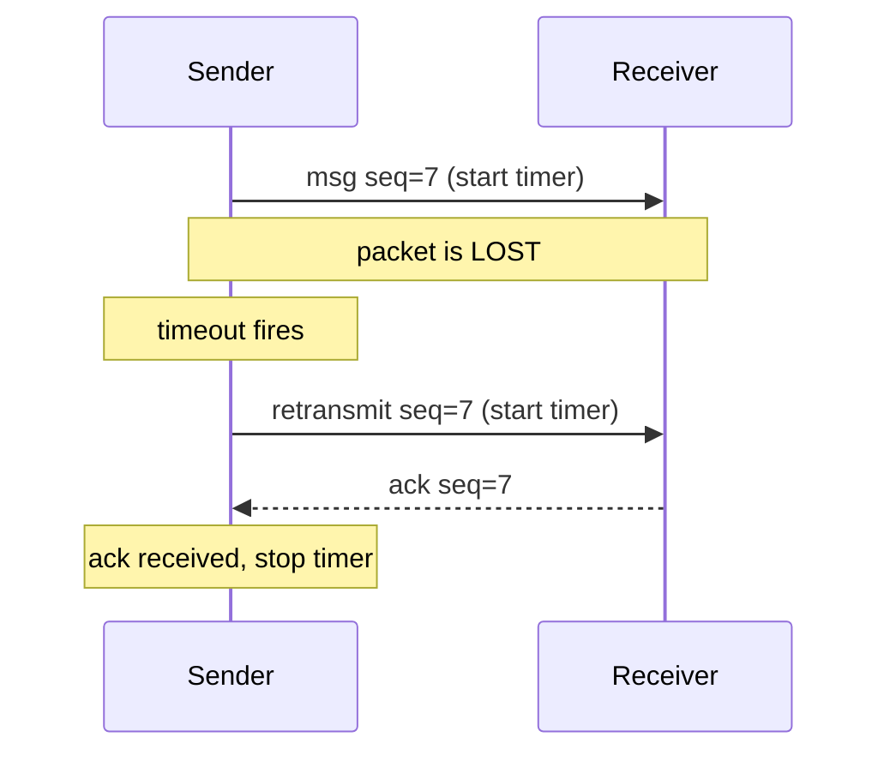

# Distributed Systems & RPC

**The crux:** on a single machine, a function call always runs and either returns or the whole process dies with it — there is no in-between. Across a network, that certainty is gone. Messages are lost, duplicated, delayed, or reordered; a remote machine can crash while yours keeps running; and you often cannot tell a slow reply apart from a dead peer. **Partial failure** — some components up, some down, and you cannot be sure which — is the defining problem of distributed systems. This page shows how to build **reliable communication** on top of an unreliable network (acks, timeouts, retries, sequence numbers, dedup) and how **Remote Procedure Call (RPC)** packages that machinery to make a network call *look* like a local one — plus why that resemblance is a trap.

## The core idea

- **Failure is the norm, not the exception.** With one machine, the machine is either up or down. With thousands of machines and the network between them, at any instant *something* is broken. Distributed software must treat failure as an ordinary, expected event to handle — not a rare edge case to crash on.
- **The network is unreliable.** The underlying packet service (think raw IP/UDP) can **lose**, **duplicate**, **delay**, and **reorder** packets. It gives no guarantee a message arrives, and no guarantee it arrives once.
- **Reliable communication is built, not given.** We layer machinery on top of the lossy channel — **acknowledgements (acks)**, **timeouts**, **retransmission**, and **sequence numbers** — to turn "maybe it arrived" into "it arrived exactly once, in order." This is what a reliable byte stream like TCP provides.
- **RPC hides the machinery behind a function call.** A **stub generator** produces client- and server-side glue so that calling a remote routine reads like `result = compute(x, y);`. The glue **marshals** (serializes) arguments into a message, ships it, and unmarshals the reply.
- **"It looks local but isn't" is a trap.** A remote call can fail in ways a local call never can, and costs orders of magnitude more. Pretending otherwise leads straight into the **fallacies of distributed computing**.

The two systems built on exactly this machinery are [Sun's Network File System (NFS)](/docs/os/distribution/nfs), which leans on idempotent operations plus retry for crash recovery, and the [Andrew File System (AFS)](/docs/os/distribution/afs), which trades statelessness for whole-file caching and server callbacks.

## How it works

### The unreliable channel, and what we want from it

The base layer delivers **datagrams**: independent packets with no promises. Four bad things happen to packets:

- **Loss** — the packet never arrives (congested router drops it, bit error, receiver buffer full).
- **Duplication** — the same packet arrives more than once (a retransmission raced the original).
- **Delay** — arbitrary, unbounded latency, so a reply and a timeout can race.
- **Reordering** — packet 2 arrives before packet 1.

On top of this we want **reliable, in-order, exactly-once** delivery. The tools are acks, timeouts, retries, and sequence numbers.

### Acks + timeouts + retries: the core loop

- The sender transmits a message and starts a **timer**.
- The receiver, on getting the message, sends back an **acknowledgement (ack)**.
- If the ack arrives before the timer expires, the sender knows the message got through.
- If the timer expires first (**timeout**), the sender assumes loss and **retransmits**.



A subtlety: a timeout does **not** prove the message was lost. The message may have arrived and it was the **ack** that got lost — or the reply is merely slow. The sender cannot distinguish these, so it retransmits regardless. That is safe *only if the receiver can tolerate duplicates* — which is exactly the problem sequence numbers solve.

### The duplicate problem → sequence numbers

Retransmission creates duplicates: the receiver may see the same logical message twice (original + retransmit both arrived). If applying a message has an effect — "transfer $100" — applying it twice is a bug.

**Sequence numbers** fix this. The sender stamps each distinct message with a monotonically increasing **seq**. The receiver remembers which seqs it has already applied. A message whose seq it has seen is a **duplicate**: the receiver **re-sends the ack** (so the sender stops retrying) but **does not apply the message again**. Dedup by sequence number turns an at-least-once channel into an exactly-once one at the application level.

### Delivery semantics: at-least-once vs at-most-once vs exactly-once

Because a timeout is ambiguous, the sender must choose a policy — and each policy has different guarantees:

- **At-least-once** — keep retransmitting until you get an ack. The message is applied **one or more** times. Simple and available, but risks duplicate side effects. Safe **only** when the operation is **idempotent** (applying it twice equals applying it once, e.g. "set balance = 500", "PUT this key").
- **At-most-once** — send, and on timeout **give up** (or use dedup to drop repeats). The message is applied **zero or one** times: never duplicated, but possibly lost. You must handle the "it never happened" case.
- **Exactly-once** — the ideal: applied **exactly one** time. There is no magic that gives this on a lossy network for free. You **build** it by combining **at-least-once delivery** (retries) with **dedup / idempotency** at the receiver (sequence numbers, unique request IDs). "Retry until acked, and dedup on the far side" is how real systems approximate exactly-once.

```mermaid
flowchart TD
    A["timeout: no ack yet"] --> B{policy?}
    B -->|"retry forever"| C["at-least-once<br/>applied &#8805; 1 times<br/>needs idempotency"]
    B -->|"give up"| D["at-most-once<br/>applied 0 or 1 times<br/>may be lost"]
    C --> E["+ dedup by seq / request-id"]
    D --> E
    E --> F["exactly-once (effective)<br/>applied exactly 1 time"]
```



**Idempotency** is the escape hatch: if the operation is naturally idempotent, at-least-once + retries already behaves like exactly-once, because re-applying is harmless. When it is not (e.g. "append to log", "charge card"), you add a dedup key so the receiver can recognize and drop repeats.

### Remote Procedure Call (RPC)

RPC packages all of the above so a programmer can call a routine on another machine as if it were local. The magic is the **stub**, generated from an interface description (an IDL) by a **stub generator**:

- The **client stub** is a local function with the same signature as the remote routine. When called, it **marshals** (serializes) the arguments into a flat message, sends it (using the reliable-delivery machinery above), waits, then **unmarshals** the reply and returns it.
- The **server stub** (skeleton) receives the message, **unmarshals** the arguments, calls the **real** server function, marshals the return value, and sends it back.

```mermaid
sequenceDiagram
    participant C as Client code
    participant CS as Client stub
    participant SS as Server stub
    participant Srv as Server function
    C->>CS: compute(x, y)
    CS->>CS: marshal args &#8594; bytes
    CS->>SS: request message (reliable delivery)
    SS->>SS: unmarshal args
    SS->>Srv: compute(x, y)
    Srv-->>SS: result
    SS->>SS: marshal result &#8594; bytes
    SS-->>CS: reply message
    CS->>CS: unmarshal result
    CS-->>C: return result
```



**What makes RPC hard:**

- **Pointers and references don't cross the wire.** A local call can pass a pointer to a graph; the callee dereferences it in shared memory. A remote callee has *no access to your address space*. The stub must serialize the *pointed-to data* (deep copy), or the two sides must share an object-reference scheme — neither is free, and cyclic structures are painful.
- **Failure has new modes.** The server can crash mid-call; the network can drop the request or the reply. A local call has none of these; the RPC layer must decide the delivery semantics (above) and expose failures the caller must handle.
- **Performance is not local.** A local call is nanoseconds; an RPC is microseconds-to-milliseconds. Marshaling, copying, and network latency dominate. Chatty designs that make one RPC per item are catastrophically slow; batching matters.

### Byte order and marshaling

To marshal, both sides must agree on the exact **byte layout** on the wire, independent of each machine's native format:

- **Endianness.** A `uint32_t` can be stored big-endian (most-significant byte first) or little-endian. If the sender is little-endian and the receiver big-endian and neither converts, `1` becomes `16777216`. Protocols pick a fixed **network byte order** (big-endian) and every side converts to/from it (`htonl`/`ntohl`).
- **No native structs on the wire.** You cannot `memcpy` a C `struct` and send it: padding, alignment, field order, type sizes, and endianness differ across compilers and machines. You serialize field by field into a defined format.
- **Framing.** The receiver must know where one message ends. Fixed-size fields, explicit length prefixes, or delimiters provide the frame.

The marshal/unmarshal pair below shows the endianness-independent encoding in ~40 lines.

## Must-know algorithms

### 1. Reliable delivery over a lossy channel (seq + ack + timeout-retransmit + dedup)

A sender that stamps sequence numbers and retransmits on timeout, and a receiver that dedups by seq so applying is idempotent. It is driven over a simulated lossy channel: a dropped packet is retransmitted, and a duplicate (as if an ack were lost) is ignored.

```c
#include <stdio.h>
#include <stdlib.h>
#include <string.h>
#include <stdbool.h>

/* A reliable-delivery model over a lossy channel.
   Sender: sequence numbers + timeout-retransmit, waits for ack.
   Receiver: dedups by seq (idempotent apply); re-acks duplicates. */

#define WINDOW 8          /* receiver remembers this many recent seqs */

/* --- Simulated lossy channel ---------------------------------------- */
/* drop_plan[i] == 1 means the i-th transmission attempt is dropped.
   We use a deterministic plan so the demo is reproducible. */
static const int drop_plan[] = {0, 1, 0, 0, 1, 0, 0, 0, 0, 0, 0, 0};
static int xmit = 0;      /* count of transmission attempts */

static bool channel_deliver(void) {
    int drop = drop_plan[xmit % (int)(sizeof drop_plan / sizeof drop_plan[0])];
    xmit++;
    return drop == 0;     /* true => packet arrives, false => lost */
}

/* --- Receiver ------------------------------------------------------- */
typedef struct {
    bool seen[WINDOW];    /* seen[seq % WINDOW]  */
    int  last_seq;        /* highest seq mapped into the window */
    int  applied;         /* count of *distinct* messages applied */
} Receiver;

static void receiver_init(Receiver *r) {
    memset(r->seen, 0, sizeof r->seen);
    r->last_seq = -1;
    r->applied  = 0;
}

/* Returns true if the receiver got the message (and thus sends an ack).
   ack is written to *ack_out. Idempotent: applying seq twice counts once. */
static bool receiver_recv(Receiver *r, int seq, int payload, int *ack_out) {
    int slot = seq % WINDOW;
    if (seq > r->last_seq) {
        /* fresh, in-order-ish: apply once */
        r->seen[slot] = true;
        r->last_seq = seq;
        r->applied++;
        printf("  [recv] seq=%d payload=%d APPLIED (applied=%d)\n",
               seq, payload, r->applied);
    } else if (r->seen[slot]) {
        /* duplicate: do NOT re-apply, but re-ack so sender can stop */
        printf("  [recv] seq=%d DUPLICATE ignored (idempotent)\n", seq);
    }
    *ack_out = seq;       /* cumulative-style ack of this seq */
    return true;
}

/* --- Sender --------------------------------------------------------- */
/* Send one message reliably: (re)transmit until an ack for seq arrives. */
static void sender_send(Receiver *r, int seq, int payload) {
    int attempt = 0;
    for (;;) {
        attempt++;
        printf("[send] seq=%d payload=%d attempt=%d ... ", seq, payload, attempt);
        if (!channel_deliver()) {
            printf("LOST -> timeout, retransmit\n");
            continue;     /* timeout fires, loop retransmits same seq */
        }
        printf("delivered\n");
        int ack;
        receiver_recv(r, seq, payload, &ack);
        /* Assume the ack itself is reliable here for brevity; the ack
           being lost simply looks like another timeout + retransmit,
           and the receiver's dedup makes that safe. */
        if (ack == seq) {
            printf("[send] got ack=%d, done\n", ack);
            return;
        }
    }
}

int main(void) {
    Receiver r;
    receiver_init(&r);

    /* Send messages seq 0..3. Some transmissions are dropped by the
       channel; the sender retransmits. To exercise the duplicate path we
       explicitly resend seq 2 (as if an ack had been lost). */
    for (int seq = 0; seq < 4; seq++)
        sender_send(&r, seq, 100 + seq);

    printf("\n-- simulate a lost ack: sender resends seq 2 --\n");
    sender_send(&r, 2, 102);   /* receiver must ignore the duplicate */

    printf("\nDistinct messages applied: %d (expected 4)\n", r.applied);
    return 0;
}
```

Output — note seq=1 and seq=3 are dropped once and retransmitted, and the resent seq=2 is recognized as a duplicate and not applied:

```text
[send] seq=0 payload=100 attempt=1 ... delivered
  [recv] seq=0 payload=100 APPLIED (applied=1)
[send] got ack=0, done
[send] seq=1 payload=101 attempt=1 ... LOST -> timeout, retransmit
[send] seq=1 payload=101 attempt=2 ... delivered
  [recv] seq=1 payload=101 APPLIED (applied=2)
[send] got ack=1, done
[send] seq=2 payload=102 attempt=1 ... delivered
  [recv] seq=2 payload=102 APPLIED (applied=3)
[send] got ack=2, done
[send] seq=3 payload=103 attempt=1 ... LOST -> timeout, retransmit
[send] seq=3 payload=103 attempt=2 ... delivered
  [recv] seq=3 payload=103 APPLIED (applied=4)
[send] got ack=3, done

-- simulate a lost ack: sender resends seq 2 --
[send] seq=2 payload=102 attempt=1 ... delivered
  [recv] seq=2 DUPLICATE ignored (idempotent)
[send] got ack=2, done

Distinct messages applied: 4 (expected 4)
```

### 2. Marshal / unmarshal with fixed endianness

Serialize a struct to a byte buffer in a fixed **big-endian** wire format and read it back — the exact job an RPC client stub does with its arguments. Because we write bytes by explicit shifts rather than `memcpy`-ing the struct, the wire bytes are identical on a little-endian or big-endian machine.

```c
#include <stdio.h>
#include <stdint.h>
#include <string.h>
#include <stdbool.h>

/* Marshal a struct to a byte buffer with a FIXED endianness (big-endian,
   "network byte order") and back. Fixed endianness means a machine of
   either byte order produces/consumes the same wire bytes. */

typedef struct {
    uint32_t id;
    int32_t  balance;   /* signed; encoded via two's-complement bit pattern */
    uint16_t flags;
} Account;

/* --- big-endian put/get helpers (endianness-independent) ------------ */
static size_t put_u32(uint8_t *b, uint32_t v) {
    b[0] = (uint8_t)(v >> 24); b[1] = (uint8_t)(v >> 16);
    b[2] = (uint8_t)(v >> 8);  b[3] = (uint8_t)(v);
    return 4;
}
static size_t put_u16(uint8_t *b, uint16_t v) {
    b[0] = (uint8_t)(v >> 8); b[1] = (uint8_t)(v);
    return 2;
}
static uint32_t get_u32(const uint8_t *b) {
    return ((uint32_t)b[0] << 24) | ((uint32_t)b[1] << 16) |
           ((uint32_t)b[2] << 8)  |  (uint32_t)b[3];
}
static uint16_t get_u16(const uint8_t *b) {
    return (uint16_t)(((uint16_t)b[0] << 8) | (uint16_t)b[1]);
}

/* Returns number of bytes written (the wire size). */
static size_t marshal(const Account *a, uint8_t *buf) {
    size_t n = 0;
    n += put_u32(buf + n, a->id);
    n += put_u32(buf + n, (uint32_t)a->balance); /* reinterpret bits */
    n += put_u16(buf + n, a->flags);
    return n;                                     /* 10 bytes */
}

static void unmarshal(const uint8_t *buf, Account *a) {
    a->id      = get_u32(buf + 0);
    a->balance = (int32_t)get_u32(buf + 4);       /* bits back to signed */
    a->flags   = get_u16(buf + 8);
}

int main(void) {
    Account in = { .id = 0xDEADBEEF, .balance = -12345, .flags = 0x0102 };
    uint8_t wire[10];
    size_t n = marshal(&in, wire);

    printf("wire (%zu bytes):", n);
    for (size_t i = 0; i < n; i++) printf(" %02X", wire[i]);
    printf("\n");

    Account out;
    unmarshal(wire, &out);
    printf("out.id=%08X out.balance=%d out.flags=%04X\n",
           out.id, out.balance, out.flags);

    bool ok = out.id == in.id && out.balance == in.balance &&
              out.flags == in.flags;
    printf("round-trip %s\n", ok ? "OK" : "FAILED");
    return ok ? 0 : 1;
}
```

Output — the wire bytes are big-endian regardless of host, and the round-trip recovers the signed value exactly:

```text
wire (10 bytes): DE AD BE EF FF FF CF C7 01 02
out.id=DEADBEEF out.balance=-12345 out.flags=0102
round-trip OK
```

Note `-12345` marshals to `FF FF CF C7` — its two's-complement bit pattern in big-endian order — and unmarshals back to `-12345`.

## Interview questions

**1. Why is distributed programming fundamentally different from single-machine programming?**
Because of **partial failure**. On one machine, a component is either up or down together with the whole process — a function call either runs or the process dies. Across a network, one node can fail while others keep running, the network can drop or delay messages, and you often **cannot tell** a crashed peer from a slow one (a timeout is ambiguous). You must design every interaction to tolerate "some of it worked, some didn't, and I'm not sure which."

**2. How do you build reliable delivery on top of an unreliable network?**
Layer **acknowledgements + timeouts + retransmission + sequence numbers** on the lossy channel. The sender transmits and starts a timer; the receiver acks; if the ack doesn't arrive before the timeout, the sender retransmits. Since retransmission causes duplicates, the sender stamps each distinct message with a **sequence number** and the receiver **dedups** by seq — re-acking but not re-applying anything it has already seen. That converts an unreliable, at-least-once channel into reliable, in-order, exactly-once delivery (this is essentially what TCP does).

**3. At-least-once vs at-most-once vs exactly-once — and where does idempotency fit?**
- **At-least-once**: retry until acked; applied one *or more* times. Safe only if the operation is **idempotent**.
- **At-most-once**: give up on timeout (or dedup and drop repeats); applied zero *or one* times — never duplicated, possibly lost.
- **Exactly-once**: applied precisely once. It is not free on a lossy network; you **construct** it from at-least-once retries **plus dedup/idempotency** (sequence numbers or unique request IDs) at the receiver. **Idempotency** is the key: if re-applying is harmless, at-least-once already behaves like exactly-once.

**4. What is RPC and what does a stub do?**
RPC (Remote Procedure Call) lets a client invoke a routine on another machine using ordinary call syntax. A **stub generator** creates glue from an interface definition. The **client stub** marshals (serializes) the arguments into a message, sends it via reliable delivery, waits, and unmarshals the reply. The **server stub** unmarshals the arguments, calls the real function, and marshals the result back. The stub's core job is **marshaling/unmarshaling** plus driving the request/reply protocol.

**5. Why can't RPC perfectly hide the network — the "fallacies of distributed computing"?**
Because a remote call differs from a local one in ways syntax cannot paper over. The classic **fallacies** are false assumptions: the network is reliable; latency is zero; bandwidth is infinite; the network is secure; topology doesn't change; there is one administrator; transport cost is zero; the network is homogeneous. RPC that pretends a call is local ignores new **failure modes** (crash, loss), **latency** (micro/milliseconds vs nanoseconds), and the fact that **pointers don't cross address spaces**. You must expose failures and latency to the caller.

**6. How do you handle a server crash between the request and the reply?**
The sender only sees a timeout — it cannot tell whether the request was lost, the server crashed before executing, executed and then crashed, or the reply was lost. Options: (a) retry with the same **request ID**, and make the server **dedup** so a re-executed request is applied once — this needs the operation to be idempotent or the server to persist "already done" state; (b) use **at-most-once** semantics and surface the failure so the caller retries at the application level; (c) for stateful operations, back them with a durable log / transaction so a re-sent request can be recognized and its committed result returned. There is no way to get exactly-once *without* dedup or idempotency somewhere.

**7. Why does endianness matter, and how does marshaling handle it?**
Different machines store multi-byte integers in different byte orders (big- vs little-endian). If you send the raw in-memory bytes, a mismatched receiver reads garbage (e.g. `1` becomes `16777216`). Marshaling picks a **fixed wire format** — conventionally big-endian "network byte order" — and every host converts to/from it (`htonl`/`ntohl`). You also cannot ship a native `struct` directly: padding, alignment, and type sizes vary, so you serialize field by field into a defined layout, with framing (length prefixes or delimiters) so the receiver knows message boundaries.

**8. Why is the Two Generals' Problem relevant here?**
It proves that over an unreliable channel, two parties can **never** achieve guaranteed common knowledge / agreement with a finite exchange of messages — every message needs an ack, but that ack could be lost, needing its own ack, forever. Practically it means you cannot get a *perfect* "both sides definitely agree" handshake; real systems settle for *high-probability* agreement via retries and timeouts, which is exactly why acks-plus-retransmit is best-effort reliability rather than a mathematical certainty.

## Coding problems

🎯 **Interview (LeetCode / classic)**

- **[Encode and Decode Strings — LeetCode 271](https://leetcode.com/problems/encode-and-decode-strings/)** — design a wire format that packs a list of strings into one buffer and parses it back. This *is* marshaling with framing: a length prefix per string is the robust answer, and it directly mirrors how a stub serializes arguments.
- **[Serialize and Deserialize Binary Tree — LeetCode 297](https://leetcode.com/problems/serialize-and-deserialize-binary-tree/)** — turn a pointer-linked structure into a flat byte/character stream and reconstruct it. Exactly the "pointers don't cross the wire, so serialize the pointed-to data" challenge from RPC.
- **[Encode and Decode TinyURL — LeetCode 535](https://leetcode.com/problems/encode-and-decode-tinyurl/)** — design an encode/decode mapping; tests you on reversible serialization and stable identifiers (a stand-in for request IDs / dedup keys).

🏗 **Systems (OS-classic)**

- **Implement reliable delivery with seq / ack / retry over a lossy channel** — the [must-know model above](#must-know-algorithms). Extend it: make the ack itself droppable, add a sliding window, add exponential-backoff timeouts, and verify exactly-once at the application level via the receiver's dedup. This is the sender/receiver protocol underneath TCP and every reliable RPC transport; see the [reliable byte stream](https://en.wikipedia.org/wiki/Reliable_byte_stream) abstraction.

## Key takeaways

- **Partial failure is the essence of distributed systems**: some parts up, some down, and a timeout can't tell you which — design for it everywhere.
- **The network loses, duplicates, delays, and reorders.** Reliable delivery is *built* from **acks + timeouts + retransmission + sequence numbers**, with the receiver **dedup**ing to survive retransmit-induced duplicates.
- **Pick delivery semantics deliberately**: at-least-once (needs idempotency), at-most-once (may lose), or exactly-once (= at-least-once retries + dedup/idempotency). Exactly-once is never free.
- **RPC** makes a remote call look local via a **stub** that **marshals/unmarshals** and drives the protocol — but the resemblance is a trap: new failure modes, real latency, and no shared pointers.
- **Marshaling means a fixed wire format**: pick an endianness (network byte order), serialize field by field, and frame messages — never ship native structs.
- The **fallacies of distributed computing** and the **Two Generals' Problem** are the theory behind why "reliable communication" is best-effort, not a guarantee.

## Source(s) and further reading

- OSTEP — [Distributed Systems (dist-intro.pdf)](https://pages.cs.wisc.edu/~remzi/OSTEP/dist-intro.pdf): communication, reliability, and RPC; the backbone for this page.
- OSTEP — [Sun's Network File System, NFS (dist-nfs.pdf)](https://pages.cs.wisc.edu/~remzi/OSTEP/dist-nfs.pdf): a real system built on RPC, and how idempotent operations plus retries give crash-tolerant semantics.
- Wikipedia — [Remote procedure call](https://en.wikipedia.org/wiki/Remote_procedure_call): stubs, marshaling, and RPC history.
- Wikipedia — [Reliable byte stream](https://en.wikipedia.org/wiki/Reliable_byte_stream): the abstraction acks/seq/retransmit provide (as in TCP).
- Wikipedia — [Fallacies of distributed computing](https://en.wikipedia.org/wiki/Fallacies_of_distributed_computing): the false assumptions RPC tempts you into.
- Wikipedia — [Two Generals' Problem](https://en.wikipedia.org/wiki/Two_Generals%27_Problem): why guaranteed agreement over an unreliable channel is impossible.
- Wikipedia — [Endianness](https://en.wikipedia.org/wiki/Endianness) and [Idempotence](https://en.wikipedia.org/wiki/Idempotence): the marshaling and semantics building blocks.
- Linux manual — [htonl / ntohl (byte-order conversion)](https://man7.org/linux/man-pages/man3/htonl.3p.html): the standard network-byte-order helpers.
- This course — [Network File System (NFS)](/docs/os/distribution/nfs) and [Andrew File System (AFS)](/docs/os/distribution/afs): the two distributed file systems this RPC machinery is built into.
