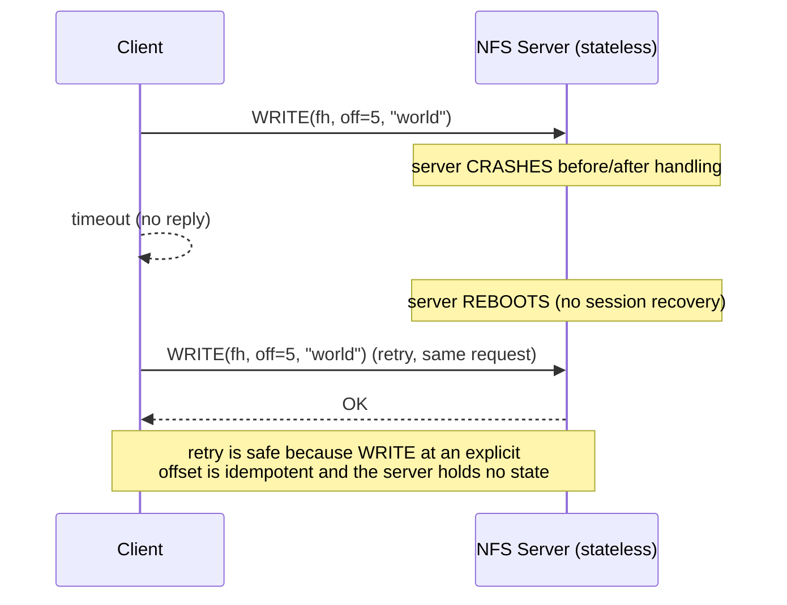

# Network File System (NFS)

**The crux:** you want a program on one machine to open, read, and write files that physically live on another machine — **transparently**, so ordinary applications using `open`/`read`/`write` do not know or care that the file is remote. Distribution adds a brutal new failure mode: the file server can crash and reboot at any moment, and the network can drop or duplicate messages. **How do you build a distributed file system that is both transparent to applications and simple to recover after a server crash?** Sun's Network File System (NFS) gives a famously clean answer: make the server **stateless** — it remembers nothing about any client between requests — so that recovering from a crash is nothing more than the server restarting and clients retrying. That one decision drives the entire design: self-describing file handles, idempotent operations, and a caching scheme that settles for *close-to-open* consistency rather than the stronger guarantee a local disk gives.

## The core idea

- **Transparent remote access.** The client mounts a remote export into its own namespace. Application calls to `open`/`read`/`write` are intercepted by the client-side file system, which turns them into [remote procedure calls (RPCs)](/docs/os/distribution/distributed-systems) to the server. The application sees an ordinary file tree; the network is hidden.
- **The server is stateless — this is the keystone.** The server keeps **no per-client state**: no open-file table, no current seek offset, no "which client has which file open" bookkeeping. Every request carries everything the server needs to serve it. Because there is no session state to lose, a server crash destroys nothing that must be reconstructed.
- **Crash recovery is trivial by construction.** When a stateful server crashes, it must somehow rebuild the sessions clients thought they had — hard, and a source of bugs. A stateless server just reboots and starts answering again. The client cannot even tell the difference between "the server is slow" and "the server crashed and came back": in both cases the client simply retries the request until it gets a reply.
- **File handles are the self-describing reference.** Since the server holds no state, the client must name a file in a way the server can resolve from scratch on every call. NFS uses a **file handle**: an opaque token containing a **volume identifier**, an **inode number**, and a **generation number**. It is the stateless stand-in for the file descriptor a local kernel would keep in memory.
- **Operations are idempotent so retry is safe.** If a request times out, the client resends it. For that to be correct, doing the operation twice must be the same as doing it once. NFS designs its protocol around this: LOOKUP, READ, and WRITE (with **explicit offsets**) are naturally idempotent.
- **Caching for speed, at the cost of consistency.** Sending every byte over the network would be slow, so clients cache file data and attributes. Caching across multiple clients immediately raises a **consistency problem** — one client's writes must somehow become visible to another. NFS resolves this with **close-to-open consistency**, a deliberately weaker guarantee than a single local disk provides.

## How it works

### The stateless server and the retry loop

A local file system keeps a lot of state in kernel memory: the open-file table maps each file descriptor to an inode and a **current offset**, so `read(fd, buf, n)` "knows where you are." NFS refuses to keep any of that on the server. Instead the protocol is **self-describing**: the client sends the file handle and the exact byte offset with every READ and WRITE. The server needs no memory of past requests.

That refusal buys the simplest possible recovery model. The client wraps each RPC in a timeout-and-retry loop:



The client genuinely cannot distinguish a crashed server from a slow one — and it does not need to. The same retry handles a dropped request packet, a dropped reply packet, an overloaded server, and a full crash-and-reboot. Below is a self-contained C model: a server whose only state is the durable file system, a simulated crash, and a client whose retry loop "just works."

```c
// Stateless NFS server + idempotent retry model.
// The server holds NO per-client session state (no open-file table, no seek
// pointer). Every request is self-describing: a file handle plus an explicit
// byte offset. Because READ/WRITE at an explicit offset are idempotent,
// a client that times out can simply resend the same request -- even across
// a server crash+restart -- and get a correct result with no lost or
// duplicated effect.
#include <stdio.h>
#include <string.h>
#include <stdint.h>

#define NFILES 4
#define FSIZE  64

// A file handle: self-describing, stateless reference to a file.
// (volume id, inode number, generation number). The generation number
// lets the server detect a handle that refers to a since-deleted inode.
typedef struct { int volume; int inode; int generation; } FileHandle;

// The "server". Its ONLY state is the durable file system -- never anything
// about which client is doing what. A crash wipes memory, not the disk.
typedef struct {
    char data[NFILES][FSIZE];
    int  len[NFILES];
    int  generation[NFILES];
    int  up;            // 1 = running, 0 = crashed
} Server;

static void server_boot(Server *s) {
    // On (re)start the server just comes back up. No session recovery.
    s->up = 1;
}

// Idempotent WRITE: place `n` bytes at an explicit `offset`. Replaying the
// same (handle, offset, bytes) request yields the identical file state.
static int server_write(Server *s, FileHandle fh, int offset,
                        const char *buf, int n) {
    if (!s->up) return -1;                       // crashed: request "times out"
    if (fh.inode < 0 || fh.inode >= NFILES) return -2;
    if (fh.generation != s->generation[fh.inode]) return -3; // stale handle
    if (offset < 0 || offset + n > FSIZE) return -4;
    memcpy(&s->data[fh.inode][offset], buf, n);
    if (offset + n > s->len[fh.inode]) s->len[fh.inode] = offset + n;
    return n;
}

// Idempotent READ: return bytes at an explicit `offset`. No server-side
// cursor is advanced, so a replay returns exactly the same bytes.
static int server_read(Server *s, FileHandle fh, int offset, char *out, int n) {
    if (!s->up) return -1;
    if (fh.inode < 0 || fh.inode >= NFILES) return -2;
    if (fh.generation != s->generation[fh.inode]) return -3;
    if (offset < 0) return -4;
    int avail = s->len[fh.inode] - offset;
    if (avail < 0) avail = 0;
    int got = n < avail ? n : avail;
    memcpy(out, &s->data[fh.inode][offset], got);
    return got;
}

// Client-side retry loop: resend until the server answers. This is the whole
// NFS recovery story -- no reconnect, no session re-establishment.
static int client_write(Server *s, FileHandle fh, int off,
                        const char *buf, int n) {
    for (int attempt = 1; ; attempt++) {
        int r = server_write(s, fh, off, buf, n);
        if (r >= 0) { printf("  WRITE ok on attempt %d\n", attempt); return r; }
        printf("  WRITE timeout (server down), retrying...\n");
        server_boot(s);                          // simulate crash -> restart
    }
}
static int client_read(Server *s, FileHandle fh, int off, char *out, int n) {
    for (int attempt = 1; ; attempt++) {
        int r = server_read(s, fh, off, out, n);
        if (r >= 0) { printf("  READ ok on attempt %d (%d bytes)\n", attempt, r); return r; }
        printf("  READ timeout (server down), retrying...\n");
        server_boot(s);
    }
}

int main(void) {
    Server s;
    memset(&s, 0, sizeof s);
    server_boot(&s);
    FileHandle fh = { .volume = 1, .inode = 2, .generation = 0 };

    printf("client writes \"hello\" at offset 0\n");
    client_write(&s, fh, 0, "hello", 5);

    printf("server CRASHES; client's next write times out and is retried\n");
    s.up = 0;                                    // crash before the write lands
    client_write(&s, fh, 5, " world", 6);        // retry succeeds after restart

    printf("client re-reads the whole file (idempotent, explicit offset)\n");
    char out[FSIZE] = {0};
    int n = client_read(&s, fh, 0, out, FSIZE);
    printf("file contents: \"%.*s\"\n", n, out);

    // Replay the exact same write twice: idempotent => same final state.
    client_write(&s, fh, 0, "HELLO", 5);
    client_write(&s, fh, 0, "HELLO", 5);
    n = client_read(&s, fh, 0, out, FSIZE);
    printf("after duplicate WRITE replay: \"%.*s\"\n", n, out);
    return 0;
}
```

Running it prints:

```text
client writes "hello" at offset 0
  WRITE ok on attempt 1
server CRASHES; client's next write times out and is retried
  WRITE timeout (server down), retrying...
  WRITE ok on attempt 2
client re-reads the whole file (idempotent, explicit offset)
  READ ok on attempt 1 (11 bytes)
file contents: "hello world"
  WRITE ok on attempt 1
  WRITE ok on attempt 1
  READ ok on attempt 1 (11 bytes)
after duplicate WRITE replay: "HELLO world"
```

The duplicate WRITE replay leaves the file exactly as one WRITE would — that is idempotency doing its job. Notice there was no reconnect, no session re-establishment; the retry loop is the entire recovery mechanism.

### File handles: volume + inode + generation number

A file handle answers the question "which file, on which server, resolvable with no context?" Its three parts each carry weight:

- **Volume identifier** — which exported file system on the server this file lives in.
- **Inode number** — which file within that volume, the same on-disk index a local file system uses.
- **Generation number** — a counter bumped each time an inode number is reused for a new file. If a client holds an old handle to a file that was deleted and whose inode was recycled, the generation number in the handle will not match the current generation, and the server rejects the request instead of silently reading a different file. In the C model, `server_write`/`server_read` return `-3` (stale handle) on a generation mismatch.

Because the handle is fully self-describing, the server can service any request "cold," with nothing remembered from prior calls — which is exactly what statelessness requires.

### Why explicit offsets and idempotent operations

Idempotent means: performing the operation once and performing it many times leave the system in the same observable state. This is the property that makes blind retry safe.

- **LOOKUP(dir_fh, name)** returns the handle for a name in a directory — asking twice gives the same handle. Idempotent.
- **READ(fh, offset, count)** returns bytes at an explicit offset — the server advances no cursor, so a replay returns identical bytes. Idempotent.
- **WRITE(fh, offset, data)** places bytes at an explicit offset — replaying writes the same bytes to the same place. Idempotent.

The **explicit offset** is the crucial design move. If the server kept a per-descriptor seek pointer (as a local `read()` does), then a retried READ after a lost reply would read *the next* chunk, not the same one — the retry would corrupt the client's view. By carrying the offset in every request, NFS makes each READ/WRITE stand entirely on its own.

Not every operation is naturally idempotent, and NFS lives with the awkwardness:

- **REMOVE(dir_fh, name)** succeeds the first time; a retried REMOVE (after the reply was lost) finds the name already gone and returns "no such file." The file *is* correctly deleted, but the client sees a spurious error on the retry. Operations like MKDIR and CREATE have the same flavor. NFS accepts these rough edges as the price of a stateless, retry-driven protocol.

### Client caching and the cache-consistency problem

Round-tripping to the server for every byte is slow, so clients cache both file **data** (blocks) and file **attributes** (size, modification time). Caching on a single machine is easy; caching the *same file on several client machines at once* creates two distinct problems:

- **The update-visibility problem.** When does a writer's change become visible to other clients? If a client buffers writes in its cache, the server — and therefore every other client — sees nothing until those buffered writes are pushed out. NFS's answer is **flush-on-close**: when a client closes a file, it flushes all dirty blocks to the server before the `close()` returns.
- **The stale-cache problem.** A reader that cached a file's blocks earlier may keep serving old data even after another client has updated the file on the server. NFS's answer is to cache attributes with a short timeout and **revalidate on open** via **GETATTR**: on `open()`, the client asks the server for the file's current modification time; if it differs from the cached copy, the client's data cache is stale and is dropped and refetched.

Together these two rules yield **close-to-open consistency**: *if a writer closes a file before a reader opens it, the reader is guaranteed to see the writer's changes.* This is strictly weaker than local-disk consistency — two clients writing the same open file concurrently get no such guarantee — but it is strong enough for the common workflow of "one machine writes a file, another later reads it." The [Andrew File System (AFS)](/docs/os/distribution/afs) reaches a similar close-based guarantee by an opposite route: instead of a client polling with GETATTR on every open, a stateful server *pushes* an invalidation (a callback) when the file changes.

```mermaid
sequenceDiagram
    participant W as Writer client
    participant S as Server
    participant R as Reader client
    R->>S: open(): GETATTR mtime -> cache data + mtime
    W->>W: write() into local cache (not yet visible)
    W->>S: close(): flush dirty blocks (flush-on-close), mtime bumped
    R->>S: open() again: GETATTR mtime
    Note over R,S: server mtime &#62; cached mtime -> cache is stale
    R->>S: refetch data blocks
    Note over R: reader now sees the writer's committed changes<br/>(close-to-open consistency)
```



Here is a compile-tested C model of that revalidation. A reader caches the file plus its modification time; another client writes; on re-open, a GETATTR-based check detects the newer mtime and refetches.

```c
// Close-to-open cache consistency model.
// A client caches file data plus a cached mtime (attribute cache). On open()
// it revalidates by asking the server for the current attributes (GETATTR):
// if the server's mtime is newer than the cached copy, the cache is stale and
// is flushed, so the reader sees the writer's changes. On close(), a writer
// flushes its dirty data to the server (flush-on-close). Together these give
// NFS's guarantee: if writer closes before reader opens, the reader sees the
// writes -- but concurrent, un-closed writes are NOT guaranteed visible.
#include <stdio.h>
#include <string.h>

#define FSIZE 64

// Server: the authoritative copy. mtime is a logical clock bumped on write.
typedef struct {
    char data[FSIZE];
    int  len;
    int  mtime;   // modification time (logical tick)
} Server;

// GETATTR: cheap metadata fetch used to revalidate a cache.
static int server_getattr_mtime(Server *s) { return s->mtime; }

static void server_write(Server *s, int off, const char *buf, int n, int tick) {
    memcpy(&s->data[off], buf, n);
    if (off + n > s->len) s->len = off + n;
    s->mtime = tick;   // bump attributes so other clients can detect the change
}
static int server_read(Server *s, char *out, int n) {
    int got = n < s->len ? n : s->len;
    memcpy(out, s->data, got);
    return got;
}

// A client with a data cache and a cached mtime (the attribute cache).
typedef struct {
    char cache[FSIZE];
    int  clen;
    int  cached_mtime;
    int  valid;        // is the data cache populated?
} Client;

// open(): revalidate via GETATTR. If server mtime differs from our cached
// mtime, our cached data is stale -> drop it and refetch. This is exactly the
// "close-to-open" check that catches another client's committed writes.
static void client_open(Client *c, Server *s) {
    int m = server_getattr_mtime(s);
    if (!c->valid || m != c->cached_mtime) {
        printf("  [open] GETATTR mtime=%d, cached=%d -> stale, refetching\n",
               m, c->valid ? c->cached_mtime : -1);
        c->clen = server_read(s, c->cache, FSIZE);
        c->cached_mtime = m;
        c->valid = 1;
    } else {
        printf("  [open] GETATTR mtime=%d matches cache -> reuse cache\n", m);
    }
}
static int client_read_cached(Client *c, char *out, int n) {
    int got = n < c->clen ? n : c->clen;
    memcpy(out, c->cache, got);
    return got;
}

int main(void) {
    Server s; memset(&s, 0, sizeof s);
    int tick = 1;
    server_write(&s, 0, "version-A", 9, tick++);

    Client reader; memset(&reader, 0, sizeof reader);
    printf("reader opens and caches the file\n");
    client_open(&reader, &s);
    char buf[FSIZE] = {0};
    int n = client_read_cached(&reader, buf, FSIZE);
    printf("  reader sees: \"%.*s\"\n", n, buf);

    // A different client writes and closes (flush-on-close bumps mtime).
    printf("another client writes \"version-B\" and closes (flush-on-close)\n");
    server_write(&s, 0, "version-B", 9, tick++);

    // Reader re-opens: GETATTR revalidation catches the change.
    printf("reader re-opens the file\n");
    client_open(&reader, &s);
    memset(buf, 0, sizeof buf);
    n = client_read_cached(&reader, buf, FSIZE);
    printf("  reader now sees: \"%.*s\"\n", n, buf);

    // Re-open with no intervening write: cache is reused, no refetch.
    printf("reader opens again with no writes in between\n");
    client_open(&reader, &s);
    return 0;
}
```

Running it prints:

```text
reader opens and caches the file
  [open] GETATTR mtime=1, cached=-1 -> stale, refetching
  reader sees: "version-A"
another client writes "version-B" and closes (flush-on-close)
reader re-opens the file
  [open] GETATTR mtime=2, cached=1 -> stale, refetching
  reader now sees: "version-B"
reader opens again with no writes in between
  [open] GETATTR mtime=2 matches cache -> reuse cache
```

The first re-open catches the newer mtime and refetches; the final re-open, with no intervening write, safely reuses the cache. That is close-to-open consistency in miniature.

### Server write buffering and durability

For performance, a server would like to buffer writes in memory and acknowledge quickly. But NFS's retry model assumes something dangerous otherwise: suppose a client sends a WRITE, the server acknowledges it from memory, the server then crashes before the data reaches disk, and the client — having seen the ack — discards it. The data is gone, and no retry will bring it back, because the client believes the write succeeded.

The rule that closes this hole: **a write must be on stable storage before the server acknowledges it.** The server may not report success for a WRITE (or a COMMIT) until the data is durable. This forces the server to flush to disk on the critical path, which is why NFS write performance historically leaned on hardware such as battery-backed write caches (NVRAM) to make "durable" fast. Later protocol revisions added asynchronous writes plus an explicit COMMIT so a client can stream many writes cheaply and force durability once at close — but the invariant is unchanged: *nothing is acknowledged as done until it is safe against a crash.*

## Interview questions

1. **Why is the NFS server stateless, and how does that simplify crash recovery?**
   A stateless server keeps no per-client session state — no open-file table, no seek offsets, no record of who has what open. So a crash destroys nothing that must be rebuilt: the server just reboots and resumes answering, and clients, which retry any request that times out, cannot even tell a crash from a slow response. Compare a stateful server, which after a crash would have to reconstruct every client's session — hard, slow, and bug-prone. Statelessness converts "recover the distributed state" into "restart the process."

2. **What is a file handle and why is it self-describing?**
   A file handle is the opaque token a client uses to name a file to the server. It contains a volume identifier (which export), an inode number (which file in it), and a generation number (which incarnation of that inode). It is self-describing because it carries everything the server needs to resolve the file from scratch on every request, with no remembered context — the stateless stand-in for a local file descriptor. The generation number lets the server reject a stale handle to a deleted-and-recycled inode instead of reading the wrong file.

3. **Why must NFS operations be idempotent, and which ones are (or are not)?**
   Because the client's recovery strategy is blind retry: on a timeout it resends the request, and it cannot tell whether the original was lost before or after the server acted. If applying the request twice differed from applying it once, retries would corrupt state. LOOKUP, READ, and WRITE (with explicit offsets) are idempotent, so retry is safe. REMOVE, CREATE, and MKDIR are not naturally idempotent — a retried REMOVE finds the file already gone and returns a spurious "no such file," even though the delete succeeded. NFS accepts that rough edge.

4. **Explain the cache-consistency problem in NFS and what close-to-open consistency guarantees.**
   Client caching creates two problems. Update visibility: a writer's buffered changes are invisible to others until pushed out — NFS flushes dirty blocks on close (flush-on-close). Stale cache: a reader may keep serving old cached data — NFS caches attributes with a timeout and revalidates on open via GETATTR, dropping the data cache if the modification time changed. Together these give close-to-open consistency: if a writer closes a file before a reader opens it, the reader sees the writer's changes. Concurrent writers to the same open file get no guarantee — this is weaker than local-disk semantics.

5. **Why does NFS use explicit-offset READ/WRITE instead of a server-side seek pointer?**
   A server-side cursor would be per-client session state, which a stateless server refuses to keep — and it would break idempotency. If the server advanced an offset on each READ, a retried READ (after a lost reply) would return the *next* chunk rather than the same one, corrupting the client's view. Carrying the offset in every request makes each READ/WRITE self-contained and safe to replay, and keeps the server stateless.

6. **How does NFS ensure write durability across a server crash?**
   The server must not acknowledge a WRITE until the data is on stable storage. Otherwise a client could see an ack for a write that lived only in server memory, the server could crash before flushing, and the data would be lost with no way to recover — the client already thinks it succeeded. This forces synchronous disk writes on the critical path (historically accelerated with NVRAM), or an async-write-plus-explicit-COMMIT scheme that still guarantees durability by the time the commit returns.

7. **What is the main tradeoff of statelessness? Give a concrete casualty.**
   Statelessness buys trivial recovery but gives up features that inherently need server-side state. The classic casualty is **locking**: a server that remembers no client state cannot natively hold a lock, because it would forget every lock on a crash. Classic NFS therefore pushed locking to a separate, stateful side protocol (the network lock manager) rather than into the core, and its cache consistency is only close-to-open rather than the stronger guarantee stateful tracking could provide.

8. **A client sends a WRITE and never hears back. What does it do, and why is that correct?**
   It retries the identical request — same file handle, same offset, same bytes — and keeps retrying until it gets a reply. This is correct because the timeout could mean the request was lost, the reply was lost, the server is slow, or the server crashed and rebooted; in every case a replayed idempotent WRITE at an explicit offset produces the same final file state. The client never needs to know which case it hit.

## Coding problems

- 🎯 **Interview — LRU Cache (LeetCode 146).** *Tests:* designing the exact client-side data cache NFS relies on — O(1) get/put with a hash map plus a doubly linked list for recency eviction. A bounded client cache of file blocks evicts its least-recently-used block precisely this way. [leetcode.com/problems/lru-cache](https://leetcode.com/problems/lru-cache/)
- 🎯 **Interview — LFU Cache (LeetCode 460).** *Tests:* an alternative cache eviction policy (least-frequently-used) with O(1) operations via frequency buckets — the harder cousin of the client cache, trading recency for access frequency. [leetcode.com/problems/lfu-cache](https://leetcode.com/problems/lfu-cache/)
- 🎯 **Interview — Design In-Memory File System (LeetCode 588).** *Tests:* modeling a hierarchical namespace of directories and files with `ls`, `mkdir`, `addContentToFile`, and `readContentFromFile` — the tree-of-inodes abstraction that a file handle's inode number points into. [leetcode.com/problems/design-in-memory-file-system](https://leetcode.com/problems/design-in-memory-file-system/)
- 🏗 **Systems — Implement a stateless file server with idempotent retries.** *Tests:* the core NFS design — a server that keeps no per-client state, requests keyed by a self-describing file handle and an explicit offset, and a client retry loop that survives a simulated server crash+restart with no lost or duplicated effect. The compile-tested C model in **How it works** above is a complete reference implementation.

## Key takeaways

- **Statelessness is the keystone.** The server remembers nothing about clients between requests, so crash recovery is just "reboot and let clients retry." Every other design choice follows from this.
- **File handles make statelessness possible.** Volume + inode + generation number is a self-describing reference the server can resolve cold on every call, with the generation number guarding against recycled inodes.
- **Idempotency makes retry safe.** LOOKUP/READ/WRITE with explicit offsets are idempotent, so a client can blindly resend on timeout. Non-idempotent operations like REMOVE are the accepted rough edges.
- **Explicit offsets, not a server cursor.** Carrying the offset in each request keeps the server stateless and keeps READ/WRITE safe to replay.
- **Caching trades consistency for speed.** Flush-on-close plus GETATTR revalidation on open give close-to-open consistency — enough for write-then-later-read workflows, weaker than a local disk for concurrent sharing.
- **Durability before ack.** A write must be on stable storage before the server acknowledges it, or a crash could silently lose data the client believes is safe.
- **The cost of statelessness is features that need state** — native locking chief among them, which classic NFS pushed to a separate protocol.

## Source(s) and further reading

- OSTEP — *Sun's Network File System (NFS)* (free chapter PDF): [pages.cs.wisc.edu/~remzi/OSTEP/dist-nfs.pdf](https://pages.cs.wisc.edu/~remzi/OSTEP/dist-nfs.pdf)
- Wikipedia — *Network File System*: [en.wikipedia.org/wiki/Network_File_System](https://en.wikipedia.org/wiki/Network_File_System)
- Wikipedia — *Stateless protocol*: [en.wikipedia.org/wiki/Stateless_protocol](https://en.wikipedia.org/wiki/Stateless_protocol)
- Wikipedia — *File handle*: [en.wikipedia.org/wiki/File_handle](https://en.wikipedia.org/wiki/File_handle)
- This course — [Distributed Systems & RPC](/docs/os/distribution/distributed-systems): the acks/timeouts/retries and idempotency machinery NFS is built on.
- This course — [Andrew File System (AFS)](/docs/os/distribution/afs): the stateful, whole-file-caching, callback-based alternative to NFS.
- Back to the [Operating Systems](/docs/os/) track overview.
