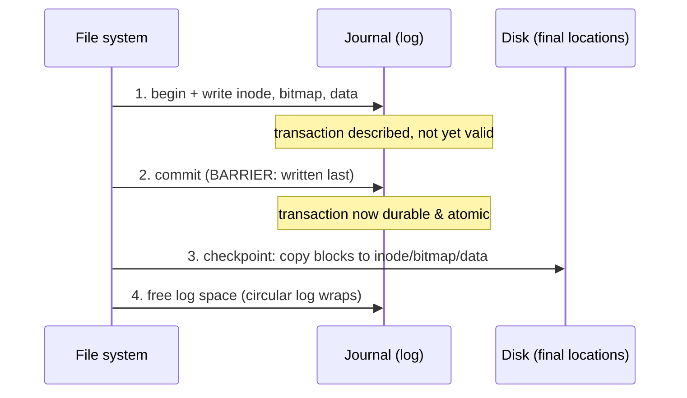
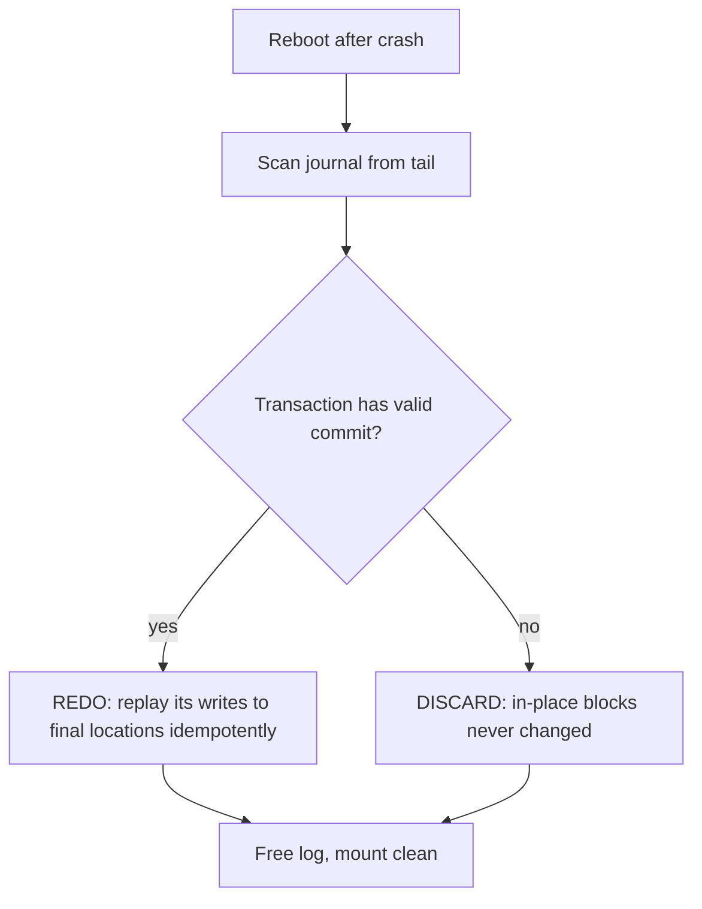

# Crash Consistency: FSCK and Journaling

**The crux:** a single logical file-system operation — say, appending a block to a file — is really *several* independent writes to *several* on-disk structures: the data bitmap (mark the block used), the inode (point at the block and bump the size), and the data block itself. The disk applies these one at a time. If the power fails after some writes have landed but not others, the file system is left in a **contradictory** state — a block the bitmap calls "used" that no inode points to (a leak), or an inode pointing at a block the bitmap calls "free" (a future double-allocation). The crash-consistency problem asks: *how do we take the file system from one consistent state to another, atomically, even though the disk gives us no multi-block atomic write?*

## The core idea

- One **logical** update = many **physical** writes. Appending a block touches at least three structures: the **data bitmap**, the **inode**, and the **data block**. The disk offers no way to make all three land or none — it commits one sector at a time.
- A crash between those writes leaves an **inconsistency**. The two classic ones:
  - **Space leak** — the bitmap marks a block allocated, but no inode references it. The block is lost until a full scan reclaims it. Wasteful, not catastrophic.
  - **Dangling pointer / double allocation** — the inode points at a block the bitmap still calls free. A later allocation hands the *same* block to another file → silent data corruption. Catastrophic.
  - **Stale data** — metadata (bitmap + inode) points at a block whose data was never written, so a read returns garbage or another file's old contents (a security leak).
- Two families of solutions:
  - **FSCK** — *let the inconsistency happen, then scan the whole disk after reboot and repair it.* Correct, but its cost scales with **disk size**, not with the work that was in flight — unusable at modern capacities.
  - **Journaling (write-ahead logging)** — *never let the in-place structures reach a contradictory state.* First write the intended updates to a **log**; only after the log records a **commit** do we touch the real locations. Recovery replays committed transactions and discards uncommitted ones. Cost scales with **recent activity**, not disk size.
- Modern file systems (ext3/ext4, NTFS, XFS, JFS) journal. A newer alternative — **copy-on-write** (btrfs, ZFS) — never overwrites live data at all; it writes new versions elsewhere and atomically flips a root pointer.

## How it works

### The problem, in C

Appending a block is three writes. Whatever order the file system picks, a crash between writes breaks an invariant. This program hard-codes the disk state visible after a crash at each step and diagnoses it:

```c
// Naive in-place update: why one logical operation needs three writes, and how
// a mid-way crash leaves the file system inconsistent. Appending a block must
// (1) flip the data bitmap, (2) point the inode at the block, (3) write data.
// Whatever order we pick, a crash between writes corrupts the invariant.
#include <stdio.h>
#include <stdbool.h>

typedef struct { int inode_ptr; int bitmap; int data; } Disk;

// Return a human label for the inconsistency, or NULL if consistent.
// EXPECT is the payload the finished append should hold.
static const char *diagnose(Disk d, int expect_data) {
    if (d.bitmap != 0 && d.inode_ptr == 0) return "SPACE LEAK (bitmap allocated, inode empty)";
    if (d.bitmap == 0 && d.inode_ptr != 0) return "DANGLING PTR (inode points, bitmap free -> double alloc)";
    if (d.inode_ptr != 0 && d.data != expect_data) return "STALE DATA (metadata points at un-written block)";
    return NULL; // metadata and data all agree
}

int main(void) {
    const int PTR = 5, BIT = 1, DATA = 0xABCD;

    // Order chosen by the FS: bitmap, then inode, then data.
    // Show the disk after a crash at each step.
    Disk after_bitmap = {0,   BIT, 0};      // crash after write #1
    Disk after_inode  = {PTR, BIT, 0};      // crash after write #2
    Disk after_all    = {PTR, BIT, DATA};   // no crash

    Disk states[] = {after_bitmap, after_inode, after_all};
    const char *when[] = {"crash after bitmap write",
                          "crash after inode write",
                          "no crash (all three done)"};
    for (int i = 0; i < 3; i++) {
        const char *bug = diagnose(states[i], DATA);
        printf("%-30s -> %s\n", when[i], bug ? bug : "consistent");
    }
    return 0;
}
```

Output:

```
crash after bitmap write       -> SPACE LEAK (bitmap allocated, inode empty)
crash after inode write        -> STALE DATA (metadata points at un-written block)
no crash (all three done)      -> consistent
```

There is **no** ordering of the three in-place writes that survives an arbitrary crash: reorder them and you just move the window in which the invariant is broken. That impossibility is what motivates FSCK and journaling.

### FSCK — scan and repair

- **FSCK** ("file system consistency check") runs at boot after an unclean shutdown. It reads the entire on-disk structure and rebuilds a consistent view from what it finds:
  - **Superblock** — sanity-check it; fall back to a backup copy if corrupt.
  - **Bitmaps vs. inodes** — walk every inode, note which blocks/inodes are actually referenced, then **rebuild the bitmaps** from that ground truth. This alone fixes leaks and (some) double-allocations.
  - **Inode state** — check link counts against the number of directory entries pointing at each inode; fix mismatches (an inode with a stale link count that no directory references gets moved to `lost+found`).
  - **Directories** — verify the tree is well-formed (every directory reachable, `.`/`..` correct).
- **Why it is too slow:** FSCK's cost is proportional to the **size of the disk**, because it must read *all* the metadata to know what is consistent. It cannot tell which few structures were mid-update, so it inspects everything. On a multi-terabyte volume this takes minutes to hours — an unacceptable recovery time. FSCK is **correct but does not scale**.

### Journaling — write-ahead logging

The insight: **never overwrite an in-place structure until a durable record of the intended change exists.** Reserve a region of the disk as a **journal** (a log). A logical update becomes a **transaction**:

1. **Journal write** — append a `begin` marker and the contents of every block the update will change (the new inode, new bitmap, new data) to the log.
2. **Journal commit** — write a `commit` record. This is the atomicity point: a transaction is real **iff** its commit reached the log.
3. **Checkpoint** — copy the logged blocks to their real in-place locations. Only now do the actual inode/bitmap/data blocks change.
4. **Free** — once checkpointed, the transaction's log space can be reclaimed (the log is **circular**).



- **Why the commit block must be written last** — the commit record is the flag that says "everything before me is complete and valid." If the disk (or its write cache) were allowed to reorder writes and land the commit *before* one of the logged blocks, a crash could leave a transaction marked committed but missing a block — recovery would replay garbage. So the file system inserts a **write barrier / flush** before the commit, guaranteeing all `begin`+data records are durable first. Many implementations also add a **checksum** in the commit record so a torn commit is detectable and rejected.
- **Recovery** — on reboot, scan the log:
  - For every transaction with a valid `commit`, **redo** its writes to the in-place locations. Redo is **idempotent** — re-applying an already-checkpointed write is harmless (you write the same bytes), so it is safe even if the crash happened mid-checkpoint.
  - For every transaction **without** a commit, discard it. Its in-place locations were never touched, so the disk is exactly as it was before the transaction — consistent.



- **Cost:** recovery reads only the **log** — a small, fixed region holding recent transactions — not the whole disk. Recovery time is bounded by the log size, independent of volume capacity. That is journaling's decisive win over FSCK.

### Data vs. metadata (ordered) journaling

Journaling *everything* (both metadata and file data) is called **data journaling** — it is the safest but writes every data block **twice** (once to the log, once in place), roughly halving write bandwidth.

- **Ordered journaling** (ext3/ext4 default, `data=ordered`) is the pragmatic compromise: **journal only the metadata**, but **force the data blocks to disk *before* the metadata commit**. The ordering rule is: *write data → then commit the metadata that points at it.*
- Why the order matters: if the metadata (inode pointing at block 5) committed before block 5's data was durable, a crash could leave the inode pointing at a block containing **stale contents** — possibly another file's deleted data, a real security hole. Forcing data first guarantees that any block a committed inode references already holds the correct bytes.
- **Tradeoff:** ordered mode pays for metadata consistency at metadata-only journaling cost (data written once), while still preventing the stale-data leak. It does **not** guarantee that a partially written file's *data* is atomic — only that metadata is consistent and never points at garbage. Full `data=journal` mode adds that at the cost of double writes; `data=writeback` drops the ordering constraint entirely (fastest, but exposes the stale-data window).

| Mode | Journals data? | Data-before-commit ordering? | Cost | Risk |
| --- | --- | --- | --- | --- |
| `data=journal` | yes | n/a (data is in log) | data written twice | none for data or metadata |
| `data=ordered` (default) | no | yes | data written once | file data not atomic, but never stale |
| `data=writeback` | no | no | data written once | metadata may point at stale data |

### The circular log

- The journal is a **fixed-size ring**. Committed-and-checkpointed transactions are freed from the tail; new transactions append at the head. A **journal superblock** records the oldest still-needed transaction so recovery knows where to start.
- If the log fills before old transactions are checkpointed, the file system **stalls** the new update until checkpointing frees space — the log acts as a bounded write-ahead buffer.
- Batching helps: many file systems **group** several logical updates into one physical transaction (global commit), amortizing the commit barrier over a batch.

## Must-know algorithms

### Write-ahead-log recovery simulator

The heart of journaling in one program: issue a block-append as a journaled transaction, crash at four different points, run recovery, and assert the disk is consistent in **every** case. Committed transactions are redone; uncommitted ones vanish.

```c
// Write-ahead-log crash-recovery simulator.
// A single logical file-system update (append a block) touches THREE on-disk
// structures: the inode, the data bitmap, and the data block. If we write them
// in place and crash mid-way, they disagree -> inconsistency. Journaling first
// records the intended writes in a log as an atomic transaction
// {begin, writes..., commit}; only a fully committed transaction is replayed
// during recovery. Uncommitted transactions are discarded, so "disk" is always
// consistent after recovery.
#include <stdio.h>
#include <stdbool.h>
#include <assert.h>

// --- The "disk": the three structures a block-append must update together. ---
typedef struct { int inode_ptr; int bitmap; int data; } Disk;

// --- The log: a bounded sequence of records forming transactions. ---
typedef enum { R_BEGIN, R_WRITE, R_COMMIT } Kind;
typedef enum { T_INODE, T_BITMAP, T_DATA } Target;
typedef struct { Kind kind; int txn; Target target; int value; } Rec;

#define LOGCAP 64
typedef struct { Rec rec[LOGCAP]; int n; } Log;

// Crash points: how far a transaction's writes reach the durable log/disk
// before power is lost.
typedef enum {
    CRASH_NONE,          // clean run
    CRASH_BEFORE_COMMIT, // log has begin+writes, NO commit record persisted
    CRASH_AFTER_COMMIT,  // full txn in log, checkpoint not started
    CRASH_MID_CHECKPOINT // full txn in log, only some in-place writes applied
} Crash;

static void log_append(Log *l, Rec r) { assert(l->n < LOGCAP); l->rec[l->n++] = r; }

// One logical append issued as a journaled transaction.
// Returns the disk state produced, honoring the crash point.
static Disk run_txn(Log *l, Disk d, int txn,
                    int new_ptr, int new_bitmap, int new_data, Crash crash) {
    // Journal write: begin + the three intended writes.
    log_append(l, (Rec){R_BEGIN,  txn, T_INODE, 0});
    log_append(l, (Rec){R_WRITE,  txn, T_INODE,  new_ptr});
    log_append(l, (Rec){R_WRITE,  txn, T_BITMAP, new_bitmap});
    log_append(l, (Rec){R_WRITE,  txn, T_DATA,   new_data});
    if (crash == CRASH_BEFORE_COMMIT) return d; // commit never reaches the log

    // Journal commit: the barrier record written strictly last.
    log_append(l, (Rec){R_COMMIT, txn, T_INODE, 0});
    if (crash == CRASH_AFTER_COMMIT) return d; // committed but not checkpointed

    // Checkpoint: copy the writes to their final in-place locations.
    d.inode_ptr = new_ptr;
    if (crash == CRASH_MID_CHECKPOINT) return d; // torn: only inode applied
    d.bitmap = new_bitmap;
    d.data   = new_data;
    return d;
}

// Is a transaction committed in the log? (begin present AND matching commit.)
static bool committed(const Log *l, int txn) {
    bool begin = false, commit = false;
    for (int i = 0; i < l->n; i++) {
        if (l->rec[i].txn != txn) continue;
        if (l->rec[i].kind == R_BEGIN)  begin  = true;
        if (l->rec[i].kind == R_COMMIT) commit = true;
    }
    return begin && commit;
}

// Recovery: replay every committed transaction's writes in order; drop the rest.
// Idempotent redo -- safe even if the checkpoint was already partly applied.
static Disk recover(const Log *l, Disk d) {
    for (int i = 0; i < l->n; i++) {
        Rec r = l->rec[i];
        if (r.kind != R_WRITE) continue;
        if (!committed(l, r.txn)) continue; // uncommitted -> discarded
        switch (r.target) {
            case T_INODE:  d.inode_ptr = r.value; break;
            case T_BITMAP: d.bitmap    = r.value; break;
            case T_DATA:   d.data      = r.value; break;
        }
    }
    return d;
}

// Consistency invariant: bitmap bit set  <=>  inode points at the block,
// and if pointed-at, the data block holds the written payload.
static bool consistent(Disk d, int expect_ptr, int expect_bitmap, int expect_data) {
    if ((d.bitmap != 0) != (d.inode_ptr != 0)) return false; // leak / dangling
    if (d.inode_ptr != 0 && d.data != expect_data) return false;
    return (d.inode_ptr == expect_ptr && d.bitmap == expect_bitmap);
}

static const char *name(Crash c) {
    switch (c) {
        case CRASH_NONE: return "no crash";
        case CRASH_BEFORE_COMMIT: return "crash before commit";
        case CRASH_AFTER_COMMIT: return "crash after commit";
        case CRASH_MID_CHECKPOINT: return "crash mid-checkpoint";
    }
    return "?";
}

int main(void) {
    // Empty disk; the append wants ptr=5, bitmap=1, data=0xABCD.
    const int PTR = 5, BIT = 1, DATA = 0xABCD;
    Crash cases[] = {CRASH_NONE, CRASH_BEFORE_COMMIT,
                     CRASH_AFTER_COMMIT, CRASH_MID_CHECKPOINT};

    for (int c = 0; c < 4; c++) {
        Log l = {0};
        Disk d = {0, 0, 0};                 // clean starting point
        d = run_txn(&l, d, 1, PTR, BIT, DATA, cases[c]);
        Disk after = recover(&l, d);        // reboot -> run recovery

        bool ok;
        if (cases[c] == CRASH_BEFORE_COMMIT)
            ok = consistent(after, 0, 0, 0);       // txn dropped: disk stays empty
        else
            ok = consistent(after, PTR, BIT, DATA);// txn redone: fully applied

        printf("%-22s -> inode=%d bitmap=%d data=0x%X : %s\n",
               name(cases[c]), after.inode_ptr, after.bitmap, after.data,
               ok ? "CONSISTENT" : "INCONSISTENT");
        assert(ok);
    }
    printf("all crash cases recovered to a consistent disk\n");
    return 0;
}
```

Output (compile with `cc -std=c11 wal.c -o wal`):

```
no crash               -> inode=5 bitmap=1 data=0xABCD : CONSISTENT
crash before commit    -> inode=0 bitmap=0 data=0x0 : CONSISTENT
crash after commit     -> inode=5 bitmap=1 data=0xABCD : CONSISTENT
crash mid-checkpoint   -> inode=5 bitmap=1 data=0xABCD : CONSISTENT
all crash cases recovered to a consistent disk
```

The two interesting cases:

- **Crash before commit** — the log holds `begin`+writes but no `commit`, so recovery discards the whole transaction. The in-place blocks were never touched, so the disk is exactly the (empty) state it started in.
- **Crash mid-checkpoint** — the transaction *is* committed, so recovery **redoes** all its writes. The inode write that already happened during the torn checkpoint is simply written again with the same value (idempotent), and the bitmap/data writes that were lost are re-applied. The disk lands fully consistent.

## Interview questions

**1. What is the crash-consistency problem, and why does one logical update touch several structures?**
A single logical operation (append a block, create a file, rename) modifies multiple independent on-disk structures — e.g. an append flips the **data bitmap**, updates the **inode** (pointer + size), and writes the **data block**. The disk commits writes one sector at a time with no multi-block atomicity, so a crash between them can leave the structures **contradicting each other**. The problem is moving the file system from one consistent state to another atomically despite the absence of atomic multi-block writes.

**2. Give concrete examples of the inconsistencies a mid-update crash produces.**
*Space leak* — the bitmap marks a block used but no inode points to it; the block is unusable until reclaimed (wasteful, recoverable). *Dangling pointer / double allocation* — an inode points at a block the bitmap calls free, so a later allocation gives the same block to another file, corrupting data (dangerous). *Stale data* — metadata references a block whose data was never written, so reads return garbage or another file's old bytes (a security leak).

**3. What does FSCK do, and why is it too slow at scale?**
FSCK scans the entire file system after an unclean shutdown and rebuilds consistency: sanity-check the superblock, walk all inodes to recompute the block/inode bitmaps from ground truth, reconcile inode link counts against directory entries (orphans go to `lost+found`), and verify directory structure. It is correct, but its cost is proportional to **disk size** — it must read all metadata because it cannot tell which few structures were mid-update. On multi-terabyte volumes that is minutes to hours, making it unacceptable as the routine recovery path.

**4. Explain write-ahead logging / journaling and its journal→commit→checkpoint protocol.**
Reserve a **log** on disk. A logical update becomes a transaction: (1) **journal write** — append `begin` plus the new contents of every affected block to the log; (2) **journal commit** — write a `commit` record, the atomicity point; (3) **checkpoint** — copy the logged blocks to their real in-place locations; (4) **free** the log space (the log is circular). Because the in-place structures are never touched until a durable commit exists, the file system is never caught in a contradictory state that recovery can't resolve.

**5. Why must the commit block be written *last* (the barrier)?**
The commit record is the flag declaring "all preceding records of this transaction are complete and valid." If write reordering (by the disk or its cache) let the commit land **before** one of the logged blocks, a crash could leave a transaction marked committed but missing data — recovery would replay incomplete/garbage state. So a **write barrier / cache flush** is issued before the commit to force all `begin`+data records durable first; a **checksum** in the commit lets recovery reject a torn commit. Ordering is what makes "committed" mean "complete."

**6. Metadata vs. data (ordered) journaling — what's the tradeoff?**
*Data journaling* logs both metadata and file data: safest, but every data block is written **twice** (log + in place), roughly halving write bandwidth. *Ordered journaling* (ext3/4 default) journals **only metadata** but forces data blocks to disk **before** the metadata commit, so a committed inode never points at stale/garbage data. It gives metadata consistency and no stale-data leak at metadata-only cost. It does **not** make file-data updates atomic — only metadata. *Writeback* mode drops the ordering entirely (fastest, but reopens the stale-data window).

**7. How does recovery replay the log?**
On reboot, scan the journal. For each transaction with a **valid commit**, **redo** its writes to the final locations — redo is **idempotent**, so re-applying an already-checkpointed write is harmless, making recovery safe even mid-checkpoint. For each transaction **without** a commit, discard it; its in-place blocks were never modified, so the disk equals its pre-transaction (consistent) state. Recovery reads only the log, so its cost is bounded by log size, not disk size.

**8. Journaling vs. copy-on-write (btrfs/ZFS) at a high level.**
Journaling **overwrites** in-place structures, but only after logging the change and committing — it pays a double-write for logged blocks and relies on the commit barrier. **Copy-on-write** never overwrites live data: it writes new versions of the changed blocks (and the metadata pointing at them) to **fresh** locations, then atomically flips a single **root pointer** to publish the new tree. A crash before the flip leaves the old tree fully intact; after it, the new tree is fully live — atomicity comes from one pointer swap rather than a log. CoW gives cheap snapshots and avoids the log's double write, at the cost of fragmentation and more complex free-space management.

**9. Why is redo during recovery safe to run more than once?**
Recovery may itself crash and re-run. Redo writes the **exact logged values** to fixed locations, so applying a transaction twice produces the same bytes as applying it once — the operation is **idempotent**. This is why a crash mid-checkpoint is harmless: the next recovery simply redoes the whole committed transaction, overwriting whatever partial state the torn checkpoint left.

## Coding problems

- 🎯 **[LRU Cache](https://leetcode.com/problems/lru-cache/)** (LeetCode 146) — the buffer cache that holds hot file-system blocks in RAM uses exactly this eviction discipline; tests hash-map + doubly-linked-list design for O(1) get/put.
- 🎯 **[LFU Cache](https://leetcode.com/problems/lfu-cache/)** (LeetCode 460) — frequency-based buffer-cache eviction; tests nested frequency buckets with O(1) operations.
- 🎯 **[Design a Stack With Increment Operation](https://leetcode.com/problems/design-a-stack-with-increment-operation/)** (LeetCode 1381) — a design problem in the same "build a data structure to a spec with amortized guarantees" family as a log/checkpoint buffer; tests lazy-increment bookkeeping.
- 🏗 **Implement a write-ahead log with crash-recovery replay** — the must-know program above: append `{begin, writes…, commit}` to a log, checkpoint to a store, simulate crashes at each point, and prove recovery leaves the store consistent. This is the OS-classic; the same pattern underlies database WAL/redo logs (see [Write-ahead logging](https://en.wikipedia.org/wiki/Write-ahead_logging)).

## Key takeaways

- One logical update is many physical writes to independent structures; a crash between them yields **space leaks**, **dangling pointers/double allocations**, or **stale data**.
- **FSCK** repairs by scanning the whole disk — correct but O(disk size), too slow at scale.
- **Journaling (WAL)** logs intended writes, commits, then checkpoints; recovery **redoes** committed transactions and **discards** uncommitted ones, at cost O(log size).
- The **commit block is written last** behind a **barrier** so "committed" reliably means "complete"; redo is **idempotent**, so recovery is safe even mid-checkpoint.
- **Ordered journaling** (ext3/4 default) journals only metadata but writes data first — metadata consistency without stale-data leaks, without double-writing data.
- **Copy-on-write** (btrfs/ZFS) is the alternative: never overwrite live data; publish a new tree with one atomic root-pointer swap.

## Source(s) and further reading

- OSTEP — [Crash Consistency: FSCK and Journaling](https://pages.cs.wisc.edu/~remzi/OSTEP/file-journaling.pdf) (free PDF), the primary backbone for this page.
- [Journaling file system](https://en.wikipedia.org/wiki/Journaling_file_system) — Wikipedia overview of physical/logical journaling and the ext3 modes.
- [Write-ahead logging](https://en.wikipedia.org/wiki/Write-ahead_logging) — the WAL principle shared by file systems and databases.
- [File system consistency check](https://en.wikipedia.org/wiki/File_system_consistency_check) — Wikipedia on fsck and its scan-and-repair phases.
- [`fsck(8)`](https://man7.org/linux/man-pages/man8/fsck.8.html) and [`e2fsck(8)`](https://man7.org/linux/man-pages/man8/e2fsck.8.html) — Linux man pages for the real repair tools.
