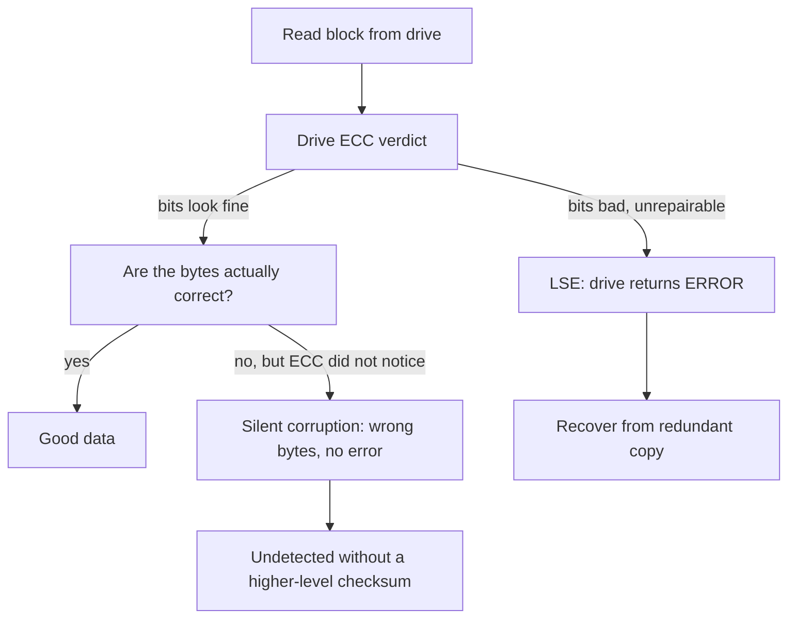

# Data Integrity & Protection

**The crux:** the classic RAID failure model assumes a disk is either wholly alive or wholly dead, and that death is obvious. Real drives are messier. A single block can go unreadable, or — far worse — a block can quietly hand back the *wrong* bytes with no error at all. **How does a storage system guarantee that the data it returns is the same data you stored, given hardware that occasionally lies?** The answer is redundant summaries of the data — checksums — computed on write, re-verified on read, and periodically re-checked in the background, plus a few extra tricks for the failure modes a plain checksum cannot see.

## The core idea

- **The failure model is bigger than whole-disk death.** The old *fail-stop* model (disk works, or it dies detectably) is too optimistic. Modern drives show *fail-partial* behaviour: mostly working, but with individual blocks that fail. Two single-block faults matter:
  - **Latent sector error (LSE)** — a block becomes unreadable. The drive's own **ECC** notices the on-disk bits are bad and, when it cannot repair them, *returns an error*. It is loud: you know exactly which block is gone.
  - **Silent data corruption / bit rot** — the block returns the wrong data with **no error**. ECC thinks the bits are fine (e.g. buggy firmware wrote the block elsewhere, or a flaky bus corrupted it in transit before the drive computed its ECC). This is the scary one: nothing tells you the data is bad.
- **Why silent corruption is worse:** an LSE is self-announcing, so you fall back to a redundant copy immediately. Silent corruption has to be *detected* first — otherwise you hand bad data to the application, or worse, propagate it into backups and other replicas.
- **The defense is the checksum.** Compute a small summary of each block on write, store it, and recompute-and-compare on every read. A mismatch means the data changed since it was stored — corruption caught.
- **Checksums differ in strength.** XOR/parity is cheap but weak (it misses whole classes of errors). **Fletcher** and **CRC** are stronger, catching all single-bit, all double-bit, and most burst errors. No checksum is perfect: shrinking 4 KB into 8 bytes guarantees **collisions** exist — you only minimize their probability.
- **A plain checksum does not catch every fault.** Two failure modes slip past it:
  - **Misdirected write** — right data, wrong location. The bytes and their checksum are internally consistent; they just landed at the wrong address. Fix: fold the **physical block id** (disk number + block offset) into the checksum input.
  - **Lost write** — a write the device acknowledged but never persisted. The old block is still there, with its own (matching) checksum and correct physical id. Fix: **write-verify** (read-after-write) or a **higher-level checksum** stored somewhere the lost write did not touch.
- **Rarely read data still rots.** **Disk scrubbing** periodically reads and verifies every block so latent problems surface *before* a second failure removes your last good copy.
- **Integrity and RAID interact.** Redundancy is what lets you *recover* once a checksum flags a bad block. But RAID has its own hazard — the **write hole**, where a crash between the data write and the parity write leaves the stripe inconsistent.
- **End-to-end is the strongest form.** Filesystems like **ZFS** and **btrfs** checksum every block and store the checksum *in the parent* (up the block tree), so the whole path from application to platter is validated — not just the drive's internal ECC.

## How it works

### The two partial-failure modes



- An **LSE** lands on the left branch: ECC fails, the drive errors out, and the storage layer recovers from a mirror or parity group. Detection is free.
- **Silent corruption** lands on the right: ECC is satisfied, so nothing below the checksum layer will ever flag it. Only an independent checksum computed by the filesystem or controller catches it.

### The checksum, verified on read

- On **write**, compute `C(D)` over the block and store it next to (or near) the data.
- On **read**, fetch the stored checksum `Cs(D)`, recompute `Cc(D)` over the retrieved bytes, and compare. Equal means very likely intact; unequal means corruption — reach for a redundant copy or return an error.

```mermaid
sequenceDiagram
    participant FS as Filesystem
    participant Disk
    Note over FS,Disk: WRITE path
    FS->>FS: Cs = checksum(D)
    FS->>Disk: store D and Cs
    Note over FS,Disk: READ path
    FS->>Disk: read D and Cs
    Disk-->>FS: D, Cs(D)
    FS->>FS: Cc = checksum(D)
    alt Cc == Cs
        FS->>FS: data intact, return to user
    else Cc != Cs
        FS->>FS: corruption detected &#62; use redundant copy or error
    end
```



### Where the checksum lives

- **With the block.** Drives can be formatted with **520-byte sectors** — 512 bytes of data plus 8 bytes for the checksum. One write persists both. This is the cheap, common layout.
- **In a separate checksum region.** When the drive only does 512-byte sectors, the filesystem packs `n` checksums into one sector, followed by `n` data blocks. This works everywhere but is costlier: overwriting one data block means read the checksum sector, update one entry, then write back *both* the checksum sector and the data block (one read, two writes) instead of a single write.

### Checksum strength: XOR is weak, Fletcher/CRC are strong

- **XOR / parity:** fold every chunk with XOR. Fast, but it has large blind spots — flipping the *same* bit position in two chunks cancels out, and swapping two chunks leaves the XOR unchanged. Both go undetected.
- **Addition:** faster still, catches many changes, but is insensitive to some rearrangements (e.g. shifted data).
- **Fletcher:** two running sums, `s1` accumulating the bytes and `s2` accumulating `s1`. Because `s2` weights earlier bytes more heavily, order matters — so byte swaps and twin-bit flips are caught. Detects all single-bit, all double-bit, and many burst errors, nearly as strong as CRC.

$$
s_1 = \Big(\sum_i d_i\Big) \bmod m, \qquad
s_2 = \Big(\sum_i (n - i + 1)\, d_i\Big) \bmod m
$$

- **CRC:** treat the block as one huge binary number and take the remainder modulo a fixed generator polynomial. Excellent burst-error detection and cheap to compute in hardware, which is why networking uses it everywhere.
- **Collisions are unavoidable.** Any function mapping 4 KB to 8 bytes is many-to-one, so distinct blocks *can* share a checksum. A good function makes that vanishingly unlikely for the errors you expect in practice.

### Misdirected writes: add the physical id

- A **misdirected write** puts correct bytes at the wrong address: the drive writes block `Dx` to location `y`. The data and its checksum are internally consistent, so a content-only checksum passes.
- **Fix:** include the **physical block id** (disk number, block offset) in the checksum input. A block written to the wrong home carries a checksum bound to the address it was *meant* for, so it fails verification where it actually lands.

```mermaid
flowchart LR
    W["Write D meant for (disk=10, blk=4)"] --> M["Misdirected: lands at (disk=10, blk=7)"]
    M --> V["Read (10,7): recompute checksum with id=(10,7)"]
    V --> X["stored id was (10,4) &#8594; mismatch &#8594; detected"]
```



### Lost writes: write-verify or a higher-level checksum

- A **lost write** is acknowledged but never persisted. The *old* block remains — with its own matching checksum *and* correct physical id. Neither content checksums nor physical ids help, because the block on disk is a perfectly valid *old* block.
- **Fixes:**
  - **Write-verify (read-after-write):** immediately read the block back and compare. Reliable, but doubles the I/O per write.
  - **Higher-level checksum:** store a checksum of the block in a *different* structure — ZFS keeps each block's checksum in its parent (inode / indirect block). A lost data write leaves the parent's checksum pointing at the *new* value, which will not match the stale block. Only if *both* writes are lost together does it slip through.

### Disk scrubbing

- Most data is read rarely, so corruption in cold blocks can sit undiscovered until every redundant copy has also rotted.
- **Scrubbing** walks every block on a schedule (nightly / weekly), recomputing and comparing checksums, so latent errors are found and repaired from redundancy *before* a second fault destroys the last good copy. The Bairavasundaram study found most LSEs were discovered this way.

### The RAID write hole

- A RAID-4/5 stripe stores data blocks plus a parity block, and parity must equal the XOR of the data for reconstruction to work. Updating a stripe means writing *both* the data and the recomputed parity — but these are **separate, non-atomic** writes.
- If the machine **crashes between** the data write and the parity write, the stripe is left inconsistent: parity no longer matches the data. If a disk then fails, reconstruction produces *garbage* — silently, because parity gives no checksum.
- **This is the RAID write hole.** Mitigations: a battery-backed NVRAM write journal that makes the data+parity update effectively atomic; or a copy-on-write / log-structured design (ZFS's RAID-Z) that never overwrites a live stripe in place, so a crash simply loses the in-flight transaction rather than corrupting an old one.
- **Interaction with integrity work:** RAID supplies the *recovery* path (mirror or parity) that checksums lean on after they *detect* a bad block. But RAID's own parity is not self-checking — combining per-block checksums with RAID is what lets you tell a good reconstruction from a poisoned one.

### End-to-end integrity (ZFS / btrfs)

- Drive ECC only protects bits *on the platter*. It cannot catch corruption introduced in the bus, the controller, the RAID firmware, or memory. A checksum computed by the filesystem and verified when the data reaches the application covers the **whole path** — this is **end-to-end integrity**.
- **ZFS** stores each block's checksum in its *parent* block pointer, forming a hash tree (a Merkle-style structure) from the leaf data up to the root **uberblock**. Every read validates the block against a checksum its *own* block did not supply, so misdirected writes, lost writes, and phantom corruption are all caught, and (with redundancy) self-healed. **btrfs** uses the same idea with a dedicated checksum tree.

## Must-know algorithms

### 1. Checksum-protected block store (Fletcher-16) — detects a corrupted block

Write stores `checksum(block)` alongside the data; read recomputes and compares. Flipping a single bit is caught.

```c
// Checksum-protected block store: write stores checksum(block) alongside data;
// read recomputes and compares. Demonstrates corruption detection.
#include <stdio.h>
#include <stdint.h>
#include <string.h>

#define BLKSZ 16   // tiny block for the demo (real blocks are 4 KB)

// Fletcher-16: two running sums mod 255. Detects all single- and double-bit
// errors and most burst errors.
uint16_t fletcher16(const uint8_t *data, size_t n) {
    uint16_t s1 = 0, s2 = 0;
    for (size_t i = 0; i < n; i++) {
        s1 = (s1 + data[i]) % 255;
        s2 = (s2 + s1) % 255;
    }
    return (s2 << 8) | s1;
}

// A stored block = data + its checksum, as on a 520-byte-style sector.
typedef struct {
    uint8_t data[BLKSZ];
    uint16_t csum;   // stored checksum Cs(D)
} block_t;

void block_write(block_t *b, const uint8_t *src) {
    memcpy(b->data, src, BLKSZ);
    b->csum = fletcher16(b->data, BLKSZ);   // compute on write
}

// Returns 1 if data verified good, 0 if corruption detected.
int block_read(const block_t *b, uint8_t *dst) {
    uint16_t cc = fletcher16(b->data, BLKSZ);   // computed checksum Cc(D)
    if (cc != b->csum) return 0;                // Cs != Cc -> corruption
    memcpy(dst, b->data, BLKSZ);
    return 1;
}

int main(void) {
    uint8_t payload[BLKSZ] = {0x36,0x5e,0xc4,0xcd,0xba,0x14,0x8a,0x92,
                              0xec,0xef,0x2c,0x3a,0x40,0xbe,0xf6,0x66};
    block_t disk;
    block_write(&disk, payload);
    printf("stored checksum Cs = 0x%04x\n", disk.csum);

    uint8_t out[BLKSZ];
    printf("clean read verifies: %s\n", block_read(&disk, out) ? "OK" : "CORRUPT");

    // Simulate bit rot: flip one bit on the platter, checksum untouched.
    disk.data[7] ^= 0x01;
    printf("after flipping 1 bit -> read: %s\n",
           block_read(&disk, out) ? "OK (missed!)" : "CORRUPT (detected)");
    return 0;
}
```

Output:

```
stored checksum Cs = 0x04b2
clean read verifies: OK
after flipping 1 bit -> read: CORRUPT (detected)
```

### 2. XOR vs Fletcher-32 vs CRC-32 — single-bit and burst errors

The same corruptions run through all three functions. XOR misses the twin-bit flip and the byte swap; Fletcher-32 and CRC-32 catch everything.

```c
// Compare three checksums on the same corruptions: XOR/parity (weak),
// Fletcher-32, and CRC-32. Show XOR misses a two-bit change that the
// stronger functions catch.
#include <stdio.h>
#include <stdint.h>
#include <string.h>

// XOR/parity checksum: fold the block with XOR. Weak: swapping bytes or
// flipping the same bit in two chunks cancels out and goes undetected.
uint8_t xor8(const uint8_t *d, size_t n) {
    uint8_t c = 0;
    for (size_t i = 0; i < n; i++) c ^= d[i];
    return c;
}

// Fletcher-32: two 16-bit sums mod 65535 over 16-bit words.
uint32_t fletcher32(const uint8_t *d, size_t n) {
    uint32_t s1 = 0, s2 = 0;
    size_t words = n / 2;
    for (size_t i = 0; i < words; i++) {
        uint32_t w = (uint32_t)d[2*i] | ((uint32_t)d[2*i+1] << 8);
        s1 = (s1 + w) % 65535;
        s2 = (s2 + s1) % 65535;
    }
    if (n & 1) { s1 = (s1 + d[n-1]) % 65535; s2 = (s2 + s1) % 65535; }
    return (s2 << 16) | s1;
}

// CRC-32 (IEEE 802.3), bitwise reference implementation.
uint32_t crc32(const uint8_t *d, size_t n) {
    uint32_t crc = 0xFFFFFFFFu;
    for (size_t i = 0; i < n; i++) {
        crc ^= d[i];
        for (int b = 0; b < 8; b++)
            crc = (crc >> 1) ^ (0xEDB88320u & (uint32_t)-(int32_t)(crc & 1));
    }
    return ~crc;
}

static void report(const char *label, const uint8_t *orig, const uint8_t *bad, size_t n) {
    printf("%-22s xor:%s  fletcher32:%s  crc32:%s\n", label,
        xor8(orig,n)==xor8(bad,n) ? "miss" : "DETECT",
        fletcher32(orig,n)==fletcher32(bad,n) ? "miss" : "DETECT",
        crc32(orig,n)==crc32(bad,n) ? "miss" : "DETECT");
}

int main(void) {
    uint8_t block[16] = {0x36,0x5e,0xc4,0xcd,0xba,0x14,0x8a,0x92,
                         0xec,0xef,0x2c,0x3a,0x40,0xbe,0xf6,0x66};
    uint8_t t[16];

    // 1. Single-bit flip.
    memcpy(t, block, 16); t[3] ^= 0x08;
    report("single-bit flip", block, t, 16);

    // 2. Burst error: corrupt a run of adjacent bytes.
    memcpy(t, block, 16); t[6]^=0xFF; t[7]^=0xFF; t[8]^=0xFF;
    report("3-byte burst", block, t, 16);

    // 3. XOR's blind spot: flip the SAME bit in two bytes -> XOR cancels.
    memcpy(t, block, 16); t[1] ^= 0x02; t[9] ^= 0x02;
    report("twin-bit (XOR blind)", block, t, 16);

    // 4. XOR's other blind spot: swap two bytes -> same XOR.
    memcpy(t, block, 16); { uint8_t x=t[0]; t[0]=t[4]; t[4]=x; }
    report("byte swap (XOR blind)", block, t, 16);
    return 0;
}
```

Output:

```
single-bit flip        xor:DETECT  fletcher32:DETECT  crc32:DETECT
3-byte burst           xor:DETECT  fletcher32:DETECT  crc32:DETECT
twin-bit (XOR blind)   xor:miss  fletcher32:DETECT  crc32:DETECT
byte swap (XOR blind)  xor:miss  fletcher32:DETECT  crc32:DETECT
```

### 3. Physical block id in the checksum — catches a misdirected write

Fold `(disk, block)` into the checksum input. Perfect bytes written to the wrong address fail verification at their actual home.

```c
// Adding a physical block id to the checksum input catches a misdirected
// write: right data, right checksum, but written to the WRONG location.
#include <stdio.h>
#include <stdint.h>
#include <string.h>

#define BLKSZ 16

uint16_t fletcher16(const uint8_t *d, size_t n) {
    uint16_t s1 = 0, s2 = 0;
    for (size_t i = 0; i < n; i++) { s1=(s1+d[i])%255; s2=(s2+s1)%255; }
    return (s2 << 8) | s1;
}

// Checksum over data PLUS the physical identity (disk id, block number).
// A block written to the wrong address carries a checksum tied to the
// address it was MEANT for, so it fails verification at its actual home.
uint16_t csum_with_id(const uint8_t *d, size_t n, uint32_t disk, uint32_t blk) {
    uint8_t hdr[8];
    memcpy(hdr,   &disk, 4);
    memcpy(hdr+4, &blk,  4);
    uint16_t s1=0, s2=0;
    for (size_t i=0;i<8;i++){ s1=(s1+hdr[i])%255; s2=(s2+s1)%255; }
    for (size_t i=0;i<n;i++){ s1=(s1+d[i])%255;   s2=(s2+s1)%255; }
    (void)fletcher16;
    return (s2<<8)|s1;
}

typedef struct { uint8_t data[BLKSZ]; uint16_t csum; uint32_t disk, blk; } block_t;

// Verify a block sitting at physical (disk, blk): recompute using the
// address it CURRENTLY occupies. Returns 1 if good.
int verify(const block_t *b, uint32_t disk, uint32_t blk) {
    return b->csum == csum_with_id(b->data, BLKSZ, disk, blk);
}

int main(void) {
    uint8_t payload[BLKSZ]={0x36,0x5e,0xc4,0xcd,0xba,0x14,0x8a,0x92,
                            0xec,0xef,0x2c,0x3a,0x40,0xbe,0xf6,0x66};
    // Controller intends to write block 4 on disk 10.
    block_t b;
    memcpy(b.data, payload, BLKSZ);
    b.disk = 10; b.blk = 4;
    b.csum = csum_with_id(b.data, BLKSZ, 10, 4);   // checksum bound to (10,4)

    // Correct location: verifies fine.
    printf("read at intended (disk=10,blk=4): %s\n",
           verify(&b,10,4) ? "OK" : "CORRUPT");

    // Misdirected write: buggy firmware lands the very same bytes at (10,7).
    // Data is byte-for-byte perfect and a plain checksum would pass — but the
    // stored checksum encodes blk=4, and we now read it as blk=7.
    printf("read at wrong home (disk=10,blk=7): %s\n",
           verify(&b,10,7) ? "OK (missed!)" : "CORRUPT (misdirected write detected)");
    return 0;
}
```

Output:

```
read at intended (disk=10,blk=4): OK
read at wrong home (disk=10,blk=7): CORRUPT (misdirected write detected)
```

## Interview questions

1. **Latent sector error vs silent data corruption — and why is the silent one worse?**
   An LSE is a block the drive *cannot read*: its ECC detects bad bits and returns an error, so you immediately know which block is gone and can rebuild it from redundancy. Silent corruption returns the *wrong bytes with no error* — ECC is satisfied (the corruption happened off-platter, or firmware wrote the wrong block). It is worse because nothing below the checksum layer signals a problem, so without an independent checksum you serve bad data to the application and can propagate it into replicas and backups.

2. **How do checksums detect corruption, and where are they stored?**
   Compute a small summary `C(D)` over each block on write and store it. On read, recompute `Cc(D)` over the retrieved bytes and compare to the stored `Cs(D)`; a mismatch means the data changed since it was written. Storage options: *with the block* (e.g. 520-byte sectors = 512 data + 8 checksum, one atomic write), or in a *separate checksum region* that packs many checksums per sector (works on any drive, but overwriting one block costs a read plus two writes).

3. **Why is XOR/parity a weak checksum, and how are Fletcher/CRC better? What is a collision?**
   XOR folds all chunks together, so any change that cancels under XOR is invisible — flipping the same bit in two chunks, or swapping two chunks, leaves the checksum unchanged. Fletcher keeps a second sum that weights earlier bytes more, so order and position matter, catching those cases; CRC's polynomial division gives strong burst-error coverage. A **collision** is two different blocks with the same checksum — unavoidable because you map (say) 4 KB down to 8 bytes; the goal is only to make collisions astronomically unlikely for realistic errors.

4. **Misdirected write vs lost write — how do you catch each?**
   A *misdirected write* puts correct data at the wrong address; content and checksum agree, so add the **physical id** (disk + block number) to the checksum input — the block fails verification wherever it actually lands. A *lost write* is acknowledged but never persisted, leaving a valid *old* block whose checksum and physical id both still match; catch it with **write-verify** (read-after-write) or a **higher-level checksum** stored elsewhere (e.g. in the parent inode) that reflects the *new* value and won't match the stale block.

5. **What does disk scrubbing do, and why is it needed?**
   Scrubbing periodically reads and re-verifies every block, including cold data that applications rarely touch. Without it, corruption in a rarely-read block sits undiscovered until every redundant copy has also rotted, at which point recovery is impossible. Scrubbing surfaces latent errors early so they can be repaired from redundancy before a second fault removes the last good copy; studies found most LSEs were discovered this way.

6. **What is the RAID write hole?**
   Updating a RAID-4/5 stripe requires two non-atomic writes — the data and the recomputed parity. If a crash lands between them, the stripe is left with parity that no longer matches the data. A later disk failure then reconstructs *garbage*, silently, because raw parity is not self-checking. Mitigations: a battery-backed NVRAM journal that makes the update atomic, or a copy-on-write / log-structured layout (ZFS RAID-Z) that never overwrites a live stripe in place.

7. **What is end-to-end / filesystem-level integrity, and how do ZFS/btrfs implement it?**
   Drive ECC only protects bits on the platter; corruption in the bus, controller, RAID firmware, or memory slips past it. End-to-end integrity has the *filesystem* checksum each block and verify it when the data reaches the application, covering the entire path. **ZFS** stores each block's checksum in its *parent* block pointer, forming a hash tree up to the root uberblock, so every block is validated by a checksum it did not itself supply — catching misdirected writes, lost writes, and phantom corruption, and self-healing from redundancy. **btrfs** does the same via a dedicated checksum tree.

8. **A checksum matched but the data is still wrong — how is that possible, and what do you do?**
   That is a **collision**: a corrupted block happening to share the original's checksum, unavoidable when the summary is far smaller than the data. Reduce its probability with a stronger/wider function (larger CRC or a cryptographic hash), and add orthogonal defenses — physical ids and parent-stored checksums catch structural faults (misdirected/lost writes) that a content collision cannot explain away.

9. **Why not just trust the drive's built-in ECC?**
   ECC only validates the bits as they sit on the platter *at the moment the drive reads them*. It cannot see corruption introduced before the drive computed its ECC (a flaky bus, buggy firmware writing the wrong block) or after the bytes leave the drive (controller, cabling, host memory). A misdirected write even produces a block with *perfectly valid* ECC — just at the wrong address. An independent, higher-level checksum is required to cover those gaps.

## Coding problems

### 🎯 Interview (LeetCode / bit-ops)

- **136 — Single Number** — [leetcode.com/problems/single-number](https://leetcode.com/problems/single-number/) — XOR-fold a list so duplicates cancel and the lone value survives; the same self-cancelling property is exactly why an XOR checksum is *weak* (paired errors vanish).
- **371 — Sum of Two Integers** — [leetcode.com/problems/sum-of-two-integers](https://leetcode.com/problems/sum-of-two-integers/) — add without `+` using XOR (sum) and AND-shift (carry); reinforces the bit-level arithmetic that underlies checksums and CRC.
- **191 — Number of 1 Bits** — [leetcode.com/problems/number-of-1-bits](https://leetcode.com/problems/number-of-1-bits/) — Hamming weight; the Hamming *distance* between stored and computed values is precisely what an error-detecting/correcting code measures.

### 🏗 Systems (OS-classic)

- **Checksum-verified block store (Fletcher / CRC)** — build a `write(block)` that stores `checksum(block)` and a `read()` that recomputes and compares, rejecting corrupted blocks; extend it with a physical block id to catch misdirected writes. Reference: [OSTEP: Data Integrity and Protection](https://pages.cs.wisc.edu/~remzi/OSTEP/file-integrity.pdf) and the three C programs above. What it tests: designing detection into the read path and reasoning about which faults each checksum feature does and does not catch.

## Key takeaways

- The real disk failure model is **fail-partial**: individual blocks die (LSE, detected by ECC) or lie (silent corruption, no error at all) — the silent one is the dangerous case.
- **Checksums** are the core defense: compute on write, verify on read; store them with the block (520-byte sectors) or in a checksum region.
- **XOR/parity is weak** (misses paired flips and swaps); **Fletcher and CRC** are strong. Collisions are inevitable — minimize, never eliminate.
- A plain checksum misses **misdirected writes** (fix: add the **physical block id**) and **lost writes** (fix: **write-verify** or a **parent-level checksum**).
- **Scrubbing** re-verifies cold data on a schedule so rot is caught before redundancy is exhausted.
- The **RAID write hole** (non-atomic data+parity update across a crash) needs a journal or copy-on-write layout; RAID gives the *recovery* path that checksums lean on.
- **End-to-end integrity** (ZFS/btrfs checksums up the block tree) validates the whole path, not just the platter.

## Source(s) and further reading

- [OSTEP — Data Integrity and Protection (free PDF)](https://pages.cs.wisc.edu/~remzi/OSTEP/file-integrity.pdf)
- [Wikipedia — Data corruption](https://en.wikipedia.org/wiki/Data_corruption)
- [Wikipedia — Checksum](https://en.wikipedia.org/wiki/Checksum)
- [Wikipedia — Fletcher's checksum](https://en.wikipedia.org/wiki/Fletcher%27s_checksum)
- [Wikipedia — Cyclic redundancy check](https://en.wikipedia.org/wiki/Cyclic_redundancy_check)
- [Wikipedia — Data scrubbing](https://en.wikipedia.org/wiki/Data_scrubbing)
