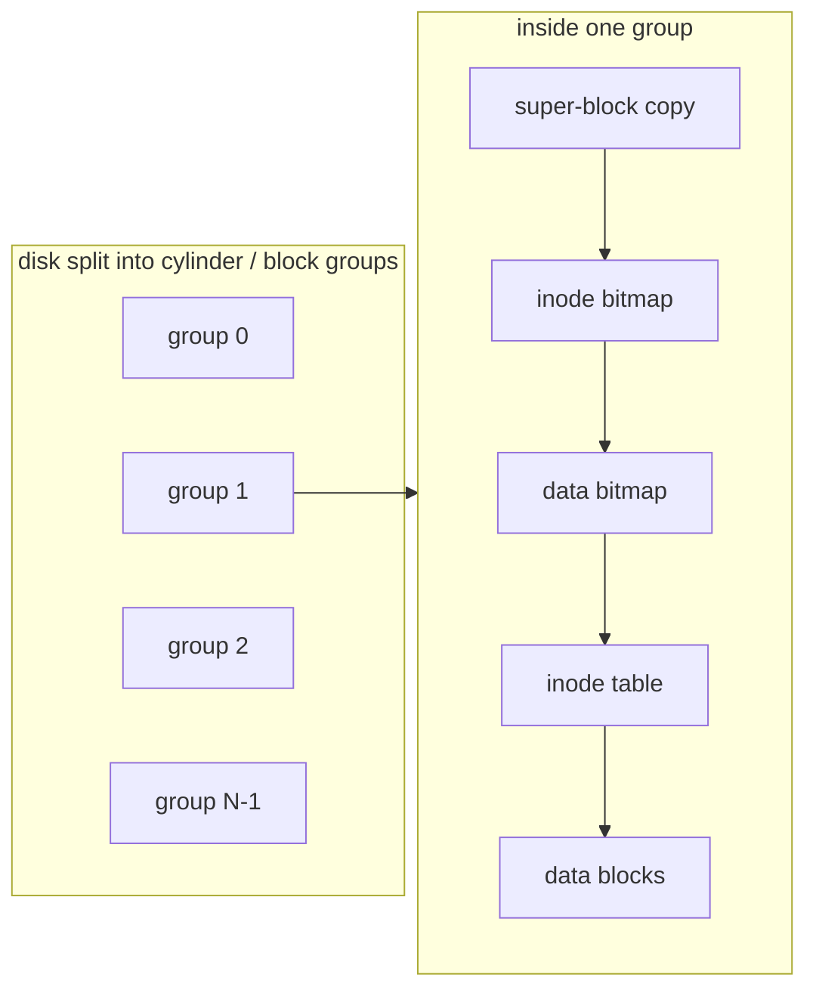
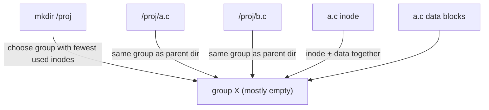
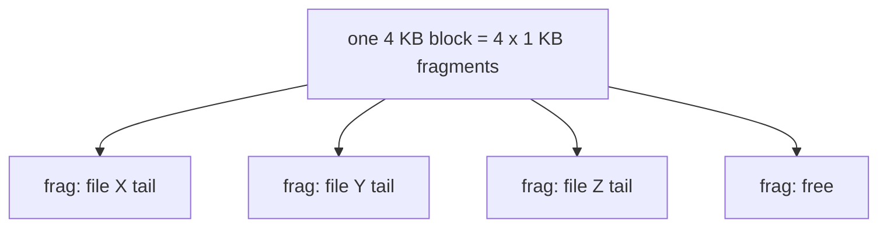

# The Fast File System (FFS)

**The crux:** how do you organize on-disk data structures so the file system is **fast** — delivering a real fraction of the disk's bandwidth — instead of treating the disk like memory and paying a seek for nearly every access? The original Unix file system was clean and simple, but it laid inodes and data out with no regard for the physical geometry of the disk. Related things ended up scattered, so reading a file or scanning a directory turned into a storm of long seeks, and measured throughput collapsed to a few percent of what the drive could do. The Berkeley **Fast File System** (McKusick, Joy, Leffler, Fabry, 1984) kept the same logical abstraction — files, directories, inodes — but redesigned the **layout** to be disk-aware, so that things used together sit near each other. This page explains why the old design was slow, the cylinder-group idea that fixed it, the allocation heuristics that create locality, the large-file exception, and the block-plus-fragment trick that recovers bandwidth without wasting space on small files.

## The core idea

- The old Unix FS treated the disk as if it were **random-access memory**: it picked inode and data locations by simple availability, ignoring that a real disk pays a huge cost — a **seek** plus **rotational delay** — to move the head between distant locations.
- Two things killed performance:
  - **Poor locality.** Inodes lived in one region at the front of the disk; a file's data blocks lived wherever the free list happened to offer space. Reading a file meant seeking to the inode area, then seeking far away to the data — over and over.
  - **Free-list fragmentation.** The free list started ordered but, after a lifetime of allocations and frees, degraded into a random scramble. A "logically sequential" file ended up with its blocks physically scattered, so even a straight read jumped all over the platter. Measured bandwidth fell to roughly a few percent of the disk's raw rate.
- FFS's insight: **make the file system disk-aware.** Keep the same interface (open/read/write, inodes, directories) but change the **on-disk placement** so that data used together is stored **close together**. Locality is the whole game — a nearby block is cheap, a far block is expensive.
- The structural device that enables locality is the **cylinder group** (a.k.a. **block group**): the disk is carved into many groups, and **each group is a self-contained mini file system** with its own inodes, its own free bitmaps, and its own data blocks. Because a group is a small, contiguous span of the disk, anything the FS keeps within one group is physically near.
- On top of groups, FFS applies **allocation heuristics** that decide *which group* to use, engineered so that related items (a file's inode and its data; the files of one directory) land in the **same** group, while unrelated items (different directory trees) are **spread** across groups to keep any one group from filling up.
- Two special cases keep the heuristics honest: a **large-file exception** (spill a big file across groups so it does not monopolize one), and a **block-size vs. fragmentation tradeoff** solved with **fragments** (large blocks for bandwidth, small sub-blocks for tiny files).

## How it works

### Why the old file system was slow

A disk is not memory. To read a block, the head must **seek** to the right track and then wait for the platter to **rotate** the target sector under the head. Sequential blocks on the same track are cheap; a block on a far track is expensive. The old Unix FS ignored this entirely.

```mermaid
graph TB
  subgraph OLD["old Unix FS layout (one flat region)"]
    S["super block"] --> I["inodes (all at the front)"]
    I --> D["data blocks (scattered by a degraded free list)"]
  end
  R["read file: seek to inode -&#62; seek far to data -&#62; seek again..."] -.-> OLD
```



- **Inodes far from data.** All inodes sat in a fixed area near the start of the disk; data blocks were elsewhere. Every file access bounced the head between the two regions.
- **Free-list decay.** New, the free list handed out nearby blocks; aged, it handed out whatever was free, so a file's blocks were physically random. A sequential scan of one file became a sequence of long seeks.
- **Tiny effective bandwidth.** The net effect: the file system delivered only a small percentage of the disk's raw transfer rate. The disk hardware was fast; the layout wasted it.

### The fix: cylinder groups (block groups)

FFS divides the disk into many **cylinder groups** — the modern term is **block groups**. A cylinder group is a contiguous span of the disk, and it is a **mini file system in its own right**: it carries its own copy of the key metadata and its own storage.



- Each group holds a **super-block copy** (redundancy — losing one copy does not lose the FS), an **inode bitmap** and a **data bitmap** (which inodes/blocks in *this* group are free), the group's **inode table**, and its **data blocks**.
- Because a group is a small, physically contiguous region, **keeping related items in one group keeps them near each other** on the platter. The bitmaps also make it easy to find contiguous free blocks *within* a group, so files can be laid out sequentially.
- The whole strategy reduces to a placement question: **for each new inode or block, which group should it go in?** That is what the allocation policies answer.

### The allocation policies (locality heuristics)

FFS's guiding rule is a simple, powerful heuristic: **keep related stuff together, and spread unrelated stuff apart.** Concretely:

- **A file's inode and its data blocks go in the same group.** After reading the inode you almost always read the data, so putting them in one group turns a long inter-region seek into a short intra-group one.
- **Files of the same directory go in the same group.** People access files in a directory together (compile a source tree, `ls -l` a folder, open a project). FFS places a new file in the **same group as its parent directory**, so a directory's contents cluster.
- **A new directory goes in a group with few used inodes.** Directories are the *roots* of future locality. If every new directory piled into the same group, that group would fill and the "keep a directory together" rule would break down. So FFS puts each **new directory** in the group that currently has the **fewest used inodes** (and ample free blocks), deliberately **spreading directories** across the disk to leave room for their future files.



The tension is intentional: **cluster within a directory, but spread directories.** Clustering gives short seeks for the common case (using a directory's files together); spreading prevents any one group from saturating so the clustering rule keeps working for everyone.

### The large-file exception

The "put all of a file's data in its directory's group" rule has a failure mode: a **single huge file** would consume an entire group's data blocks, leaving no room for the other files of that directory — destroying the locality the policy was built to create.

- FFS breaks the rule for large files: after a file has placed some threshold of blocks in one group, it **spills the remainder into another group**, and continues spilling across groups as it grows.
- This spreads a big file's blocks over many groups so **no single group is monopolized**. Each group still holds a **large contiguous chunk** of the file, so sequential reads of the big file remain efficient (many blocks per seek), while the many small files of a directory still have room to cluster.
- The threshold is chosen so the cost of the extra seeks between chunks is **amortized** over a big enough contiguous run — you pay one seek to jump groups, then stream a large chunk, so the seek is a negligible fraction of the transfer.

```mermaid
graph LR
  BIG["large file (many blocks)"] --> C0["chunk in group 0"]
  BIG --> C1["chunk in group 1"]
  BIG --> C2["chunk in group 2"]
  NOTE["each chunk is large -&#62; one seek per chunk, then stream"] -.-> C1
```



### The block-size problem and the fragment fix

Bandwidth wants a **large block** (fewer blocks to describe a file, more data transferred per seek). But a large block **wastes space on small files**: a 2 KB file stored in a 4 KB block wastes half the block to **internal fragmentation**, and most files in a real system are small. On the FFS authors' measured file-size distribution, naively adopting a 4 KB block wasted roughly **45%** of the disk to internal fragmentation — nearly half the capacity gone.

- FFS's fix: keep a **large block** (for bandwidth) but allow the **last block of a small file** to be a **fragment** — a sub-block piece of a full block. A block can be divided into several fragments, and different small files can share the fragments of one block.
- So a 5 KB file with a 4 KB block and 1 KB fragments uses **one full 4 KB block plus one 1 KB fragment**, not two full blocks — the tail waste shrinks from a whole block to a fragment.
- The bandwidth for big files stays high (they use full blocks); the space efficiency for small files stays high (their tails use fragments). To avoid excessive recopying, applications are encouraged to write in full-block units where possible, so growing files migrate cleanly from fragments to whole blocks.



### Other FFS contributions

FFS was not only about layout; it also modernized the file-system interface:

- **Long file names.** The old FS capped names at 14 characters; FFS allowed **long, variable-length names** via variable-length directory entries.
- **Symbolic links.** FFS introduced **symlinks** — a file whose contents are a path — enabling links that cross file-system boundaries and point at directories, unlike hard links.
- **Atomic rename.** A single `rename()` that atomically moves/renames a file, so tools could replace a file in place without a window where it is missing or half-written.
- **Long-lived robustness details** like duplicated super-blocks (one per group, at rotationally varied offsets) so a single bad block cannot destroy the whole file system's identity.

## Must-know algorithms

### FFS group-allocation simulator

The core FFS idea is a placement algorithm over groups. This simulator models `NGROUPS` cylinder groups, each with free inode/block counts and a per-block map, and implements the three FFS heuristics:

- a file's **inode + data** go in the **same group as its parent directory**;
- a **new directory** goes in the group with the **fewest used inodes** (spread directories);
- a **large file spills** across groups after `SPILL_CHUNK` contiguous blocks land in one group.

It then prints a per-group map. You can see the small files of `/a` and `/b` cluster in their directories' groups, the two directories land in *different* groups, and the large file `L` spreads across three groups instead of filling one.

```c
/* FFS group-allocation simulator: model cylinder (block) groups, each a mini-FS
   with its own free inode/block counts, and place files/dirs with FFS heuristics:
     - a file's inode + data go in the SAME group as its parent directory;
     - a NEW directory goes in the group with the FEWEST used inodes (spread dirs);
     - a LARGE file spills across groups once it exceeds a threshold in one group.
   Then print a per-group map showing related files cluster while a big file spreads. */
#include <stdio.h>
#include <stdlib.h>
#include <string.h>

#define NGROUPS      6
#define INODES_PER_G 16
#define BLOCKS_PER_G 32
/* Once a single file has placed this many contiguous blocks in one group,
   FFS switches ("spills") the rest of that file to the next group. */
#define SPILL_CHUNK  8

typedef struct {
    int free_inodes;   /* remaining inode slots  */
    int free_blocks;   /* remaining data blocks  */
    int used_inodes;   /* placed inode count (for the "fewest used" rule) */
    char map[BLOCKS_PER_G + 1]; /* '.' free, else a tag char per used block */
} Group;

static Group G[NGROUPS];

static void fs_init(void) {
    for (int g = 0; g < NGROUPS; g++) {
        G[g].free_inodes = INODES_PER_G;
        G[g].free_blocks = BLOCKS_PER_G;
        G[g].used_inodes = 0;
        memset(G[g].map, '.', BLOCKS_PER_G);
        G[g].map[BLOCKS_PER_G] = '\0';
    }
}

/* Claim one block; paint it with `tag`. Returns block index or -1 if full. */
static int claim_block(int g, char tag) {
    if (G[g].free_blocks <= 0) return -1;
    for (int b = 0; b < BLOCKS_PER_G; b++) {
        if (G[g].map[b] == '.') {
            G[g].map[b] = tag;
            G[g].free_blocks--;
            return b;
        }
    }
    return -1;
}

static int claim_inode(int g) {
    if (G[g].free_inodes <= 0) return -1;
    G[g].free_inodes--;
    G[g].used_inodes++;
    return 1;
}

/* Directory placement: pick the group with the FEWEST used inodes that still
   has room, spreading directory trees across the disk. Returns group index. */
static int place_dir(void) {
    int best = -1;
    for (int g = 0; g < NGROUPS; g++) {
        if (G[g].free_inodes <= 0 || G[g].free_blocks <= 0) continue;
        if (best < 0 || G[g].used_inodes < G[best].used_inodes) best = g;
    }
    if (best < 0) { fprintf(stderr, "no room for dir\n"); exit(1); }
    claim_inode(best);
    return best;
}

/* File placement: inode + all data blocks go in the parent dir's group, so a
   file clusters with its directory. A large file spills to later groups after
   SPILL_CHUNK blocks land in the current group. `tag` marks its blocks. */
static void place_file(int dir_group, int nblocks, char tag) {
    if (claim_inode(dir_group) < 0) {
        /* parent group full of inodes: fall back to nearest group with room */
        for (int g = 0; g < NGROUPS; g++)
            if (claim_inode(g) == 1) { dir_group = g; break; }
    }
    int g = dir_group, in_this = 0;
    for (int placed = 0; placed < nblocks; ) {
        if (claim_block(g, tag) >= 0) {
            placed++;
            if (++in_this >= SPILL_CHUNK) {   /* spill: advance to next group */
                g = (g + 1) % NGROUPS;
                in_this = 0;
            }
        } else {                              /* group full: advance */
            g = (g + 1) % NGROUPS;
            in_this = 0;
        }
    }
}

static void dump(const char *label) {
    printf("== %s ==\n", label);
    for (int g = 0; g < NGROUPS; g++)
        printf("  group %d  inodes-used=%2d  [%s]\n",
               g, G[g].used_inodes, G[g].map);
    printf("\n");
}

int main(void) {
    fs_init();

    /* Directory /a placed in the least-used group, then three small files
       inside it — all should land in /a's group and cluster together. */
    int a = place_dir();
    place_file(a, 2, 'a');
    place_file(a, 2, 'a');
    place_file(a, 3, 'a');

    /* Directory /b spread to a different group; its files cluster there. */
    int b = place_dir();
    place_file(b, 2, 'b');
    place_file(b, 3, 'b');

    dump("after small clustered files");
    printf("  /a landed in group %d, /b landed in group %d (dirs spread)\n\n",
           a, b);

    /* A large file (24 blocks) inside /a: it must spill across groups
       instead of filling /a's group. Tag 'L'. */
    place_file(a, 24, 'L');
    dump("after a large file (spills across groups)");

    /* Report which groups the large file touched. */
    int touched = 0;
    for (int g = 0; g < NGROUPS; g++)
        if (strchr(G[g].map, 'L')) touched++;
    printf("  large file 'L' spans %d groups (spread, not concentrated)\n", touched);
    return 0;
}
```

Running it prints:

```text
== after small clustered files ==
  group 0  inodes-used= 4  [aaaaaaa.........................]
  group 1  inodes-used= 3  [bbbbb...........................]
  group 2  inodes-used= 0  [................................]
  group 3  inodes-used= 0  [................................]
  group 4  inodes-used= 0  [................................]
  group 5  inodes-used= 0  [................................]

  /a landed in group 0, /b landed in group 1 (dirs spread)

== after a large file (spills across groups) ==
  group 0  inodes-used= 5  [aaaaaaaLLLLLLLL.................]
  group 1  inodes-used= 3  [bbbbbLLLLLLLL...................]
  group 2  inodes-used= 0  [LLLLLLLL........................]
  ...
  large file 'L' spans 3 groups (spread, not concentrated)
```

The output makes the policies visible: `/a`'s three small files cluster in group 0, `/b`'s files cluster in group 1 (directories spread), and the 24-block large file `L` spreads across groups 0–2 in large chunks rather than filling any single group.

## Interview questions

**1. Why was the original Unix file system slow?**
It treated the disk like RAM — it chose inode and data locations by mere availability, ignoring seek and rotational costs. Inodes lived in one region and data in another, so every file access seeked between them; and the free list, once ordered, degraded over time so a logically sequential file's blocks became physically scattered. The result was that the FS delivered only a few percent of the disk's raw bandwidth even though the hardware was fast.

**2. What is FFS's core idea?**
Make the file system **disk-aware for locality**. Keep the same abstraction (files, directories, inodes) but redesign the on-disk **layout** so that data used together is stored physically close together, turning expensive long seeks into cheap short ones. Everything else — groups, allocation heuristics, the large-file exception — is machinery to achieve locality.

**3. What is a cylinder group (block group)?**
A contiguous span of the disk that acts as a **self-contained mini file system**: it has its own super-block copy, its own inode and data bitmaps, its own inode table, and its own data blocks. Because a group is physically compact, keeping related items in one group keeps them near each other. Dividing the disk into many groups gives the allocator a locality unit to place things into.

**4. What are FFS's allocation heuristics?**
Three rules. (a) **A file's inode and data go in the same group** — you read the inode then the data, so co-locating them avoids an inter-region seek. (b) **Files of the same directory go in the same group** — directory contents are used together. (c) **A new directory goes in the group with the fewest used inodes** — directories are seeds of future locality, so spread them so each has room for its files. The theme: cluster within a directory, spread directories.

**5. What is the large-file exception and why is it needed?**
A single big file placed entirely in its directory's group would consume that group's blocks and leave no room for the directory's other files, destroying locality. So after a threshold, FFS **spills** the file's remaining blocks into other groups, continuing across groups as it grows. Each group still holds a large contiguous chunk, so sequential reads stay efficient (one seek per big chunk), while other files keep their space. The threshold amortizes the inter-group seek over a big transfer.

**6. Explain the block-size vs. fragmentation tradeoff and how fragments solve it.**
A large block gives high bandwidth (fewer blocks per file, more data per seek) but wastes space on small files — a small file rounds up to a whole block, and most files are small, so internal fragmentation is severe. FFS keeps large blocks but lets a small file's **tail** occupy a **fragment**, a sub-block piece, and lets several small files share the fragments of one block. Big files use full blocks (bandwidth preserved); small files use fragments (space preserved).

**7. What non-layout features did FFS introduce?**
Long, variable-length file names (past the old 14-character limit), **symbolic links** (a file whose content is a path, able to cross file systems and point at directories), **atomic `rename`**, and robustness details like duplicated super-blocks placed at rotationally staggered offsets so a single bad block cannot destroy the FS identity.

**8. How do modern file systems like ext2/ext3/ext4 inherit FFS?**
ext2 adopts FFS's central structure directly: the disk is split into **block groups**, each with a super-block copy, group descriptor, block bitmap, inode bitmap, inode table, and data blocks — a mini-FS per group, exactly the cylinder-group idea. ext2's allocator uses the same locality heuristics (keep a file's data near its inode, keep a directory's files together, spread directories). ext3 adds journaling and ext4 adds extents and delayed allocation on top, but the block-group backbone for locality is FFS's design carried forward.

**9. Why spread directories but cluster files?**
Two goals in tension. Clustering a directory's files gives short seeks for the common access pattern (use a folder's files together). But if every directory landed in the same group, that group would fill and the clustering rule would fail for later directories. Spreading directories across low-occupancy groups gives each directory headroom so its files can cluster — spreading at the coarse (directory) level is what makes clustering possible at the fine (file) level.

## Coding problems

### 🎯 Interview (LeetCode)

- **[767. Reorganize String](https://leetcode.com/problems/reorganize-string/)** — rearrange characters so no two adjacent are equal; greedily place the most-frequent item with spacing. The **spread** analogy to FFS's "put new directories in low-occupancy groups": distribute high-count items apart so no slot (group) is overloaded. Tests: greedy placement with a max-heap on frequency.
- **[621. Task Scheduler](https://leetcode.com/problems/task-scheduler/)** — schedule tasks with a cooldown between identical ones, minimizing total time by spacing the most frequent task. Same spread-vs-cluster reasoning as directory allocation: keep the heavy item apart to avoid a hotspot. Tests: greedy scheduling / frequency math.
- **[973. K Closest Points to Origin](https://leetcode.com/problems/k-closest-points-to-origin/)** — return the k nearest points, the pure **locality** primitive: rank items by distance and keep the closest. FFS is doing exactly this when it prefers a nearby group over a far one. Tests: partial selection via a heap or quickselect.

### 🏗 Systems (OS-classic)

- **Build the FFS group-placement simulator** — model N cylinder groups with free inode/block counts and implement the three heuristics: a file's inode + data in its parent directory's group, a new directory in the least-used group, and a large file spilling across groups after a threshold. Then verify that related files cluster while a big file spreads. The complete reference implementation is the C program in [Must-know algorithms](#must-know-algorithms) above. Extend it to model fragments (let a small file's tail share a partial block) and to compute an average-seek cost before vs. after applying the policies. Tests: understanding of locality-driven allocation.

## Key takeaways

- The old Unix FS was slow because it **treated the disk like memory** — ignoring seek/rotation — so inodes and data were far apart and a decayed free list scattered each file's blocks, cutting bandwidth to a few percent.
- FFS's fix is to make the file system **disk-aware for locality**: same abstraction, redesigned **layout** so things used together sit near each other.
- The **cylinder group / block group** is the locality unit — a self-contained mini-FS (super-block copy, bitmaps, inode table, data blocks) covering a contiguous disk span.
- The **allocation heuristics** create locality: a file's **inode and data together**, a **directory's files together**, and **new directories spread** into low-occupancy groups.
- The **large-file exception** spills a big file across groups (in large chunks) so it does not monopolize one group's blocks.
- The **block-size vs. fragmentation** tradeoff is solved by **fragments**: large blocks for bandwidth, shared sub-blocks for small-file tails.
- **ext2/ext3/ext4** inherit the block-group design directly — FFS's layout ideas still run under most Linux systems.

## Source(s) and further reading

- OSTEP — *Locality and The Fast File System* (free PDF): [https://pages.cs.wisc.edu/~remzi/OSTEP/file-ffs.pdf](https://pages.cs.wisc.edu/~remzi/OSTEP/file-ffs.pdf)
- Wikipedia — *Unix File System*: [https://en.wikipedia.org/wiki/Unix_File_System](https://en.wikipedia.org/wiki/Unix_File_System)
- Wikipedia — *ext2* (block-group layout inherited from FFS): [https://en.wikipedia.org/wiki/Ext2](https://en.wikipedia.org/wiki/Ext2)
- Wikipedia — *Block group*: [https://en.wikipedia.org/wiki/Block_group](https://en.wikipedia.org/wiki/Block_group)
- Wikipedia — *ext4* (extents + delayed allocation over block groups): [https://en.wikipedia.org/wiki/Ext4](https://en.wikipedia.org/wiki/Ext4)
- Linux manual — `ext4(5)` on-disk format: [https://man7.org/linux/man-pages/man5/ext4.5.html](https://man7.org/linux/man-pages/man5/ext4.5.html)
