A process calls `open("/foo/bar")`, then `read` and `write`, and expects bytes to persist across reboots. **The crux: how do you lay bytes and metadata out on a raw block device — a flat array of fixed-size sectors with no notion of files, names, or offsets — so that you can name files, find their blocks, grow them, and reclaim space, all with a small and predictable number of disk I/Os?** The answer is a *file-system implementation*: a set of on-disk data structures (a superblock, allocation bitmaps, an inode table, and data blocks) plus the access-path logic that walks them. We build the classic teaching design, the **Very Simple File System (VSFS)**.

## The core idea

- A disk is a linear array of blocks (say 4 KB each). A file system imposes structure on that array: a few blocks hold *metadata* (what exists, where it lives, what is free), the rest hold *user data*.
- **Two kinds of data structure.** *Structural* metadata (the superblock, bitmaps, inode table) describes the file system itself; *data blocks* hold file contents and directory contents.
- **The inode is the heart.** Every file and directory is one inode: a fixed-size record of metadata plus pointers to its data blocks. A file *is* its inode number (its "inumber"); names are just a convenience layered on top.
- **Directories are files.** A directory is an inode whose data blocks hold a list of `(name, inode-number)` entries. Names live only inside directories, which is why the same file can have several names (hard links).
- **Everything is indirection.** To find file `/foo/bar` you never search the disk — you follow pointers: root inode → root data → foo inode → foo data → bar inode. Each step is a couple of block reads.
- **Free space is tracked with bitmaps.** One bit per inode and one bit per data block says allocated or free. Allocation is a bitmap scan; freeing is clearing a bit.

## How it works

### On-disk layout

VSFS divides the disk into five regions. With 4 KB blocks and, say, a 256 KB disk (64 blocks), a typical split is: block 0 = superblock, block 1 = inode bitmap, block 2 = data bitmap, blocks 3–7 = inode table, blocks 8–63 = data region.


- **Superblock** — one block at a known location (block 0) holding a magic number that identifies the FS type, the block size, the counts of inodes and data blocks, and the on-disk offset of each region. The mount code reads this first so it knows where everything else lives.
- **Inode bitmap** — one bit per inode: 1 = in use, 0 = free. `allocate_inode` scans it for the first 0.
- **Data bitmap** — one bit per data block, same idea. `allocate_block` scans it.
- **Inode table** — a packed array of fixed-size inodes. If an inode is 256 bytes and a block is 4 KB, each block holds 16 inodes; an inumber trivially maps to a `(block, offset)` inside this table.
- **Data blocks** — the rest of the disk, holding file contents and directory entry lists.

### The inode

An inode is fixed-size metadata plus a set of block pointers.

- **Metadata:** type (regular file / directory / symlink), size in bytes, link count, owner and permission bits, and timestamps.
- **Block pointers** answer "where are my data blocks?". A handful of **direct pointers** name data blocks straight away — great for the common case of small files. When a file outgrows them, the inode uses **indirect** pointers.
- **Single indirect:** one pointer names a block that is itself full of data-block pointers.
- **Double indirect:** a pointer to a block of pointers to blocks of pointers.
- **Triple indirect:** one more level. This *multi-level index* is why a small file costs no indirect blocks yet a huge file is still reachable.

```c
#define BLOCK_SIZE 4096
#define NDIRECT    12
/* pointers that fit in one block: 4096 / 4 = 1024 */
#define PPB        (BLOCK_SIZE / (int)sizeof(int))   /* 1024 */

typedef struct {
    int  type;                 /* file / dir / symlink        */
    long size;                 /* bytes                       */
    int  links;                /* hard-link count             */
    int  direct[NDIRECT];      /* 12 direct data-block numbers*/
    int  single_indirect;      /* -> block of PPB pointers    */
    int  double_indirect;      /* -> block of PPB single-ind. */
    int  triple_indirect;      /* -> block of PPB double-ind. */
} inode_t;
```

**Max file size math (KaTeX).** With block size $B$, pointer size $P$, and $D$ direct pointers, one block holds $k = B / P$ pointers. The reachable capacity is the sum over the levels:

$$
\text{max} = \underbrace{D\,B}_{\text{direct}} \;+\; \underbrace{k\,B}_{\text{single}} \;+\; \underbrace{k^2 B}_{\text{double}} \;+\; \underbrace{k^3 B}_{\text{triple}}
$$

For the classic $B = 4\text{ KB}$, $P = 4$ bytes, so $k = 1024$, and $D = 12$:

$$
\text{max} = (12 + 1024 + 1024^2 + 1024^3)\times 4\text{ KB} \approx 1024^3 \times 4\text{ KB} = 4\text{ TB}
$$

The triple-indirect term dominates; the direct and single-indirect terms are a rounding error but cover the vast majority of *real* files, which are tiny.

### Directories are inode-holding files

A directory is an inode of type "dir" whose data blocks hold a list of entries. A simple entry is `(name, inumber)`; real file systems add a record length and name length so entries can vary in size and be deleted in place.

- Looking up a name is a **linear scan** of the directory's data blocks for a matching name.
- Creating a file: allocate an inode, allocate/extend the directory's data to append the new `(name, inum)` entry, and bump link counts.
- Because names live only in directory entries, one inode can appear under several names — that is a *hard link*, and the inode's link count tracks how many entries point at it.

### The access path: `open("/foo/bar")`

Opening a path means resolving it component by component from the root, whose inumber is a fixed constant (e.g. 2 in Unix). This is **namei** ("name → inode"). Each component costs: read the current directory's inode, read its data to find the next name, then read the next inode.

```mermaid
flowchart TD
  A["open(&#34;/foo/bar&#34;)"] --> B["read root inode<br/>(fixed inumber)"]
  B --> C["read root data block<br/>find entry &#34;foo&#34; -&#62; inum_foo"]
  C --> D["read foo inode"]
  D --> E["read foo data block<br/>find entry &#34;bar&#34; -&#62; inum_bar"]
  E --> F["read bar inode"]
  F --> G["build in-memory open-file entry,<br/>return file descriptor"]
```



**How many I/Os?** Each path component adds one inode read plus at least one directory-data read. For `/foo/bar` (two components) that is: root inode, root data, foo inode, foo data, bar inode = **5 reads**, then the inode is written back only if metadata (like the access time) changes. Longer paths cost proportionally more — path resolution is the reason directory caching matters so much.

### The access path: `read` and `write`

- **`read`** of a block: with the inode already in memory (from `open`), find the target block via the inode's pointers (following an indirect block if the offset is large), read that data block, and update the inode's access time. Roughly **1 data read** per block (plus one extra read per indirect level the first time you cross into it).
- **`write`** that appends and allocates a new block does more work:
  1. read the **data bitmap**, find a free block, write the bitmap back (allocate),
  2. write the **inode** with the new pointer and larger size,
  3. write the **data block** itself.

  If the new block also needs a fresh indirect block, add a bitmap+block allocation for that too. So an allocating write is on the order of **5 I/Os** (bitmap read, bitmap write, inode write, data write, plus the read of the block you are partially overwriting), versus a non-allocating overwrite which is closer to **2** (inode write for the timestamp, data write).

### Caching and buffering

Doing 5 reads just to open a two-level path — and re-reading bitmaps and inodes on every operation — would be ruinous without caching.

- **Read caching.** A unified *page cache* / buffer cache keeps hot blocks (inodes, directory data, bitmaps, popular file data) in memory. After the first traversal, resolving `/foo/bar` again hits the cache and costs near-zero disk I/O. Locality — the same files and directories touched repeatedly — makes the hit rate high.
- **Write buffering.** Writes are *batched* in memory and flushed later. This lets the FS (a) coalesce many small writes to the same block, (b) schedule writes for good disk-arm locality, and (c) sometimes avoid the write entirely (a file created and deleted before flush). The cost is a durability/performance trade-off: buffer too long and a crash loses data, which is why `fsync` and journaling exist.
- **The tension:** caching turns a metadata-heavy design into a fast one, but every buffered write is data that is not yet safe on disk.

## Must-know algorithms

A self-contained VSFS model: arrays for the superblock/bitmaps/inode-table/data-region; `allocate_inode` and `allocate_block` by bitmap scan; an inode with direct **and** single-indirect pointers; `fs_write`/`fs_read` that grow a file past the direct pointers into the indirect block; and a `namei`-style path lookup over a tiny directory tree. It builds `/foo/bar`, writes 600 bytes (past the 256-byte direct capacity), resolves the path, and reads it back.

```c
#include <stdio.h>
#include <stdlib.h>
#include <string.h>

/* ---- VSFS geometry (an in-memory model of an on-disk file system) ---- */
#define BLOCK_SIZE     64          /* bytes per data block (tiny, for demo)   */
#define NUM_INODES     16          /* entries in the inode table              */
#define NUM_DBLOCKS    64          /* data blocks in the data region          */
#define NDIRECT        4           /* direct pointers per inode               */
#define PTRS_PER_BLOCK (BLOCK_SIZE / (int)sizeof(int)) /* ptrs in indirect blk */
#define FTYPE_FREE 0
#define FTYPE_FILE 1
#define FTYPE_DIR  2

/* An inode: metadata plus block pointers. Real UFS/ext2 add double/triple
   indirect; here we implement direct + one single-indirect for the demo. */
typedef struct {
    int  type;                 /* FTYPE_FREE / FILE / DIR                     */
    int  size;                 /* file size in bytes                          */
    int  direct[NDIRECT];      /* direct data-block numbers (-1 = none)       */
    int  indirect;             /* block number of a block full of ptrs (-1)   */
} inode_t;

/* A directory entry lives in a directory's data blocks. */
typedef struct { char name[28]; int inum; } dirent_t;

/* The whole "disk". */
typedef struct {
    int     inode_bitmap[NUM_INODES];      /* 1 = allocated                   */
    int     data_bitmap[NUM_DBLOCKS];      /* 1 = allocated                   */
    inode_t inodes[NUM_INODES];            /* the inode table                 */
    unsigned char data[NUM_DBLOCKS][BLOCK_SIZE]; /* the data region           */
} fs_t;

static fs_t fs;

/* ---- allocation via bitmap scan (find first free, mark it) ---- */
static int allocate_inode(void) {
    for (int i = 0; i < NUM_INODES; i++)
        if (!fs.inode_bitmap[i]) {
            fs.inode_bitmap[i] = 1;
            fs.inodes[i] = (inode_t){0};
            fs.inodes[i].indirect = -1;
            for (int d = 0; d < NDIRECT; d++) fs.inodes[i].direct[d] = -1;
            return i;
        }
    return -1;                              /* out of inodes                  */
}

static int allocate_block(void) {
    for (int b = 0; b < NUM_DBLOCKS; b++)
        if (!fs.data_bitmap[b]) {
            fs.data_bitmap[b] = 1;
            memset(fs.data[b], 0, BLOCK_SIZE);
            return b;
        }
    return -1;                              /* out of data blocks             */
}

/* Map a file's logical block index to a physical data-block number,
   allocating along the way if create is set. Handles direct + indirect. */
static int bmap(inode_t *ino, int lbn, int create) {
    if (lbn < NDIRECT) {
        if (ino->direct[lbn] == -1 && create) ino->direct[lbn] = allocate_block();
        return ino->direct[lbn];
    }
    int idx = lbn - NDIRECT;                 /* index within indirect block   */
    if (idx >= PTRS_PER_BLOCK) return -1;    /* past our max file size        */
    if (ino->indirect == -1) {
        if (!create) return -1;
        ino->indirect = allocate_block();    /* allocate the indirect block   */
    }
    int *ptrs = (int *)fs.data[ino->indirect];
    if (ptrs[idx] == 0 && create) ptrs[idx] = allocate_block();
    return ptrs[idx] == 0 ? -1 : ptrs[idx];
}

/* ---- fs_write: grow the file, consulting/updating bitmaps + inode + data --- */
static int fs_write(int inum, const char *buf, int off, int len) {
    inode_t *ino = &fs.inodes[inum];
    for (int i = 0; i < len; i++) {
        int pos = off + i;
        int blk = bmap(ino, pos / BLOCK_SIZE, 1);
        if (blk < 0) return i;               /* file too large                */
        fs.data[blk][pos % BLOCK_SIZE] = (unsigned char)buf[i];
    }
    if (off + len > ino->size) ino->size = off + len;
    return len;
}

/* ---- fs_read: walk the same pointers back ---- */
static int fs_read(int inum, char *buf, int off, int len) {
    inode_t *ino = &fs.inodes[inum];
    int n = 0;
    for (int i = 0; i < len && off + i < ino->size; i++) {
        int pos = off + i;
        int blk = bmap(ino, pos / BLOCK_SIZE, 0);
        if (blk < 0) break;
        buf[n++] = (char)fs.data[blk][pos % BLOCK_SIZE];
    }
    return n;
}

/* ---- directory helpers ---- */
static void dir_add(int dir_inum, const char *name, int inum) {
    dirent_t de;
    memset(&de, 0, sizeof de);
    strncpy(de.name, name, sizeof de.name - 1);
    de.inum = inum;
    fs_write(dir_inum, (const char *)&de, fs.inodes[dir_inum].size, (int)sizeof de);
}

static int dir_lookup(int dir_inum, const char *name) {
    inode_t *d = &fs.inodes[dir_inum];
    for (int off = 0; off < d->size; off += (int)sizeof(dirent_t)) {
        dirent_t de;
        fs_read(dir_inum, (char *)&de, off, (int)sizeof de);
        if (de.name[0] && strcmp(de.name, name) == 0) return de.inum;
    }
    return -1;
}

/* ---- namei: resolve an absolute path to an inode number ---- */
static int namei(int root_inum, const char *path) {
    if (path[0] != '/') return -1;
    int cur = root_inum;
    char buf[256];
    strncpy(buf, path + 1, sizeof buf - 1);
    buf[sizeof buf - 1] = '\0';
    for (char *tok = strtok(buf, "/"); tok; tok = strtok(NULL, "/")) {
        if (fs.inodes[cur].type != FTYPE_DIR) return -1;
        cur = dir_lookup(cur, tok);
        if (cur < 0) return -1;
    }
    return cur;
}

int main(void) {
    memset(&fs, 0, sizeof fs);

    int root = allocate_inode();             /* build "/" */
    fs.inodes[root].type = FTYPE_DIR;

    int foo = allocate_inode();              /* mkdir /foo */
    fs.inodes[foo].type = FTYPE_DIR;
    dir_add(root, "foo", foo);

    int bar = allocate_inode();              /* create /foo/bar */
    fs.inodes[bar].type = FTYPE_FILE;
    dir_add(foo, "bar", bar);

    /* Direct capacity = NDIRECT * BLOCK_SIZE = 4 * 64 = 256 bytes.
       Write 600 bytes, forcing use of the single-indirect block. */
    int N = 600;
    char *out = malloc(N), *in = malloc(N + 1);
    for (int i = 0; i < N; i++) out[i] = (char)('A' + (i % 26));
    int w = fs_write(bar, out, 0, N);

    int found = namei(root, "/foo/bar");     /* resolve, then read back */
    int r = fs_read(found, in, 0, N);
    in[r] = '\0';

    int ok = (found == bar) && (w == N) && (r == N) && (memcmp(out, in, N) == 0);
    printf("namei(/foo/bar) -> inum %d (expected %d)\n", found, bar);
    printf("direct capacity = %d bytes; wrote %d bytes\n", NDIRECT * BLOCK_SIZE, w);
    printf("indirect block used: %s (block #%d)\n",
           fs.inodes[bar].indirect >= 0 ? "yes" : "no", fs.inodes[bar].indirect);
    printf("read back %d bytes; first16=\"%.16s\" last16=\"%s\"\n",
           r, in, in + r - 16);
    printf("RESULT: %s\n", ok ? "PASS" : "FAIL");

    free(out); free(in);
    return ok ? 0 : 1;
}
```

Compile and run:

```
$ cc -std=c11 vsfs.c -o vsfs && ./vsfs
namei(/foo/bar) -> inum 2 (expected 2)
direct capacity = 256 bytes; wrote 600 bytes
indirect block used: yes (block #6)
read back 600 bytes; first16="ABCDEFGHIJKLMNOP" last16="MNOPQRSTUVWXYZAB"
RESULT: PASS
```

The 600-byte file exceeds the 256-byte direct capacity, so `bmap` allocated a single-indirect block, and the reader followed the same pointers to reproduce every byte.

## Interview questions

**1. What are the on-disk structures of a simple file system?**
Five regions in VSFS: a **superblock** (FS-type magic, block size, region layout), an **inode bitmap** and a **data bitmap** (one bit each per inode / data block, free or allocated), the **inode table** (a packed array of fixed-size inodes), and the **data region** (file and directory contents). Mount reads the superblock first to locate the rest.

**2. What is stored in an inode?**
File metadata and the map to its data: type, size, link count, owner/permissions, timestamps, and **block pointers** — some direct, plus single/double/triple indirect. It deliberately does *not* store the file's name; names live in directory entries.

**3. Direct vs indirect pointers — and the max file size?**
Direct pointers name data blocks immediately (cheap, ideal for small files). When a file grows, indirect pointers add levels of indirection: single = a block of pointers, double = a block of blocks of pointers, triple = one more level. With block size $B$, pointer size $P$, $k = B/P$ pointers per block, and $D$ direct pointers, max size is $DB + kB + k^2B + k^3B$. For $B=4\text{ KB}, P=4, D=12$: $k=1024$ and the total is dominated by $k^3 B \approx 4\text{ TB}$.

**4. How is a path like `/a/b/c` resolved to an inode (namei)?**
Start at the root inode (a fixed inumber). Read its data, find entry `a` to get `a`'s inumber, read `a`'s inode (must be a directory), read its data, find `b`, and so on until the last component. This is `namei`. Each component costs one inode read plus at least one directory-data read.

**5. How many I/Os does open + read + write take?**
*Open* `/foo/bar`: root inode, root data, foo inode, foo data, bar inode ≈ **5 reads**. *Read* one block with the inode already cached ≈ **1 data read** (plus one per indirect level the first time you cross it). *Allocating write*: read data bitmap, write data bitmap, write inode, write data block ≈ **4–5 I/Os** (more if an indirect block must also be allocated). Non-allocating overwrite ≈ **2**.

**6. How is free space tracked?**
Bitmaps: an inode bitmap and a data bitmap, one bit per object (1 = allocated). Allocation is a scan for the first 0 bit; freeing clears a bit. Bitmaps are compact and make "is this free?" an O(1) bit test; some file systems use free *lists* or B-trees instead for very large volumes.

**7. Why are small files common, and why do direct pointers handle them cheaply?**
Empirically most files are tiny (config files, source files, mail). A small file fits entirely in the direct pointers, so it needs **no indirect blocks at all** — no extra allocation, no extra read to chase pointers. The multi-level index pays its cost only for the rare huge file.

**8. Why are directories just files, and what does that buy you?**
A directory is an inode whose data is a list of `(name, inumber)` entries. Making them files means the same allocation, growth, and caching machinery serves both — no separate namespace store. It also enables **hard links**: several directory entries can point at one inode, tracked by the inode's link count.

**9. Where does caching help, and what is the risk?**
A buffer/page cache keeps hot inodes, directory blocks, and bitmaps in memory, so repeated path lookups and reads avoid the disk. Writes are buffered and flushed later to coalesce and schedule them. The risk is durability: buffered writes are lost on a crash, which is why `fsync`, journaling, and copy-on-write exist.

## Coding problems

🎯 **[LeetCode 588 — Design In-Memory File System](https://leetcode.com/problems/design-in-memory-file-system/)** — Tests directory-tree modeling: `ls`, `mkdir`, `addContentToFile`, `readContentFromFile`. It is essentially building the directory/inode namespace VSFS provides, in memory.

🎯 **[LeetCode 1166 — Design File System](https://leetcode.com/problems/design-file-system/)** — Tests path parsing and a prefix/path map: `createPath` (fails if the parent path is missing) and `get`. This is the `namei` "resolve a path, honoring parents" idea in miniature.

🏗 **Implement a VSFS** — Build the structures above: bitmaps, an inode table, an inode with direct + single/double indirect pointers, `allocate_inode`/`allocate_block` by bitmap scan, `bmap` for logical-to-physical translation, `fs_read`/`fs_write` that grow a file across the direct/indirect boundary, and a `namei` path lookup over a directory tree. The C program in *Must-know algorithms* is a complete starting point; extend it with double-indirect and a free path (deallocate on `unlink`).

## Key takeaways

- A file system is on-disk data structures plus access-path logic: **superblock, inode bitmap, data bitmap, inode table, data region**.
- The **inode** is the file: metadata plus direct and multi-level indirect block pointers. Small files use only direct pointers; the indirect levels exist for the rare huge file.
- **Directories are files** of `(name, inumber)` entries; names live only there, which is what makes hard links possible.
- **namei** resolves a path by walking inode → directory data → inode, one component at a time; each step is a few block reads.
- **Free space** is tracked with bitmaps — allocation is a scan for a free bit.
- **Caching and write buffering** turn a metadata-heavy design into a fast one, at the cost of durability that `fsync`/journaling must recover.

## Source(s) and further reading

- OSTEP, *File System Implementation (VSFS)* — free PDF: [https://pages.cs.wisc.edu/~remzi/OSTEP/file-implementation.pdf](https://pages.cs.wisc.edu/~remzi/OSTEP/file-implementation.pdf)
- Wikipedia, *inode* — [https://en.wikipedia.org/wiki/Inode](https://en.wikipedia.org/wiki/Inode)
- Wikipedia, *Unix File System* — [https://en.wikipedia.org/wiki/Unix_File_System](https://en.wikipedia.org/wiki/Unix_File_System)
- Wikipedia, *Block (data storage)* — [https://en.wikipedia.org/wiki/Block_(data_storage)](https://en.wikipedia.org/wiki/Block_(data_storage))
