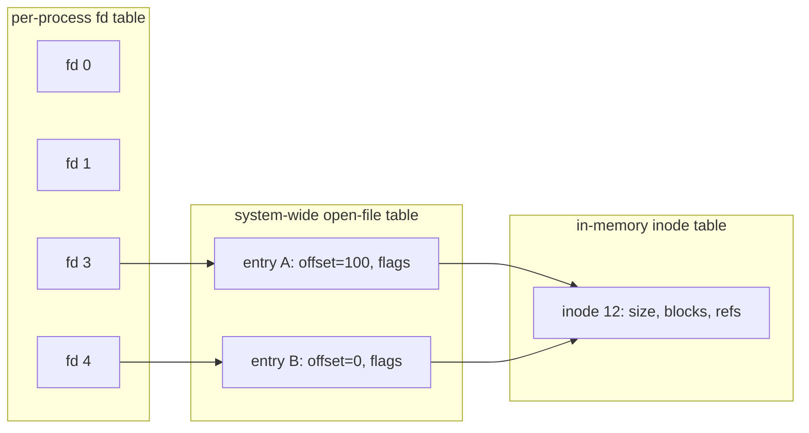

# Files & Directories

**The crux:** how do you give programs a durable, sharable way to name and access data on a disk that only understands numbered blocks? The raw device is a flat array of sectors; that is unusable for humans and hostile to sharing. The file system answers with two abstractions layered on top: the **file** — a linear array of bytes with a human name and a hidden low-level name (an **inode number**) — and the **directory** — itself a file, whose contents map human names to inode numbers, and which chain together into the familiar tree. This page builds the mental model, walks the POSIX API (`open`/`read`/`write`/`lseek`/`close`), and shows the indirection every systems interview probes: **file descriptor to open-file entry to inode**, and why that layering makes `fork`, `dup`, hard links, and atomic `rename` all fall out cleanly.

## The core idea

- A **file** is a linear array of bytes, each byte addressable by its offset. The file system does not care what those bytes mean — text, an image, a database page — it just stores and returns them. Each file has a low-level name, the **inode number**, which uniquely identifies it within a file system.
- An **inode** (index node) is the fixed-size on-disk structure holding a file's metadata: size, owner, permissions, timestamps, link count, and pointers to the data blocks. The inode number indexes into the inode table. Crucially, **the inode holds no human-readable name** — the name lives in a directory.
- A **directory** is also a file. Its "contents" are a list of `(name, inode number)` pairs called directory entries. Looking up `foo` in a directory means scanning its entries for the name `foo` and returning the inode number it maps to.
- Directories nest: a directory entry can point to another directory's inode. Starting from the **root** (`/`, a well-known inode number), this forms the **directory tree**. An absolute path like `/usr/bin/ls` is resolved by walking the tree one component at a time.
- The separation of **name** (in a directory) from **file** (an inode) is the key design move. It is what lets one file have several names (hard links), lets `rename` be a cheap directory edit, and lets a file's data outlive the last name pointing at it while a process still has it open.
- A process never touches an inode directly. It calls `open` to get a **file descriptor** (fd) — a small integer that is a per-process handle into kernel bookkeeping. All later reads and writes name the fd, not the path.

## How it works

### Files, inodes, and the naming split

```mermaid
graph TD
  subgraph dir["directory (a file of entries)"]
    E1["&#34;usr&#34; &#8594; ino 12"]
    E2["&#34;etc&#34; &#8594; ino 30"]
  end
  E1 --> I12["inode 12: metadata + data-block pointers"]
  I12 --> D1["data block(s): the bytes"]
```



- The **name to inode** lookup is the directory's whole job. Everything else about the file lives in the inode and its data blocks.
- Because the name is separate, deleting a name (`unlink`) is not the same as deleting a file. The file's storage is only reclaimed when its **link count** — the number of directory entries pointing at the inode — reaches zero *and* no process still holds it open.

### The API — open returns a file descriptor

`open` translates a path into an fd and sets up an entry describing this open instance of the file:

```c
#include <fcntl.h>
#include <unistd.h>

int fd = open("/tmp/note.txt", O_CREAT | O_WRONLY | O_TRUNC, 0644);
/* fd is a small non-negative int: an index into this process's fd table.
   O_CREAT makes it if absent; 0644 is the permission mode; O_TRUNC empties it. */
```

- `read(fd, buf, n)` and `write(fd, buf, n)` transfer up to `n` bytes at the fd's **current offset**, then advance that offset by the number of bytes moved. Sequential I/O needs no explicit positioning — the offset walks forward on its own.
- `lseek(fd, off, whence)` repositions the offset without doing I/O. `whence` is `SEEK_SET` (absolute), `SEEK_CUR` (relative), or `SEEK_END` (relative to end). It is a pure kernel update of a number, unrelated to a physical disk seek.
- `close(fd)` releases the descriptor and decrements the reference on the underlying open-file entry.

### The three-level indirection: fd table to open-file table to inode

This is the structure interviewers love. There are **three** distinct tables:



- The **file descriptor table** is per process: it maps small ints (fds) to open-file entries. Two processes can have the same fd number pointing at completely different files.
- The **open file table** is system-wide. Each entry is one `open` call's state: the **current offset**, the access flags, and a pointer to the inode. Two separate `open`s of the same path get two *different* entries, each with its own independent offset.
- The **inode** (in memory) is shared by every open-file entry referring to that file. There is one inode per file no matter how many descriptors point at it.
- **Why it matters:** whether two fds share an offset depends on whether they point at the **same open-file entry** or at two different ones pointing at the same inode.

### How fork and dup share an offset

- `dup(fd)` (and `dup2`) creates a *new fd number* in the same process that points at the **same open-file entry**. The two fds therefore **share the offset** — a `write` through one advances the position seen by the other.
- `fork` copies the fd table into the child, and each copied fd points at the **same open-file entry** as the parent's. So parent and child **share the offset** too; that is exactly why shell redirection with two processes appending to one file interleaves correctly instead of overwriting.
- By contrast, two independent `open` calls on the same file produce two open-file entries with **separate** offsets — writing through one does not move the other.

```mermaid
graph TD
  A["dup / fork: copied fd"] --> S["SAME open-file entry &#8594; shared offset"]
  B["second open()"] --> D["DIFFERENT open-file entry &#8594; independent offset"]
  S --> I["one inode"]
  D --> I
```



### Hard links vs symbolic links

- A **hard link** (`link(old, new)`) adds a second directory entry pointing at the **same inode**. There is no "original" and "copy" — both names are equal, first-class references to one file. The inode's **link count** goes up by one.
- `unlink(name)` removes one directory entry and decrements the link count. The file's data is freed only when the count hits zero (and no open fd remains). So `unlink` is "remove a name," not necessarily "delete the file."
- Hard links cannot cross file systems (inode numbers are per-file-system) and traditionally cannot target directories.
- A **symbolic (soft) link** (`symlink(target, linkpath)`) is a *separate small file* whose contents are a **path string**. Resolving it means reading that string and continuing resolution from there. Because it stores a path, not an inode, a symlink can cross file systems and can point at a directory — but if the target is removed or renamed, the symlink **dangles**: it still exists, yet resolving it fails.
- `stat` follows symlinks (reports the target); `lstat` does not (reports the link itself).

### stat and inode metadata

```c
#include <sys/stat.h>
struct stat st;
stat("/tmp/note.txt", &st);
/* st.st_ino  = inode number        st.st_size  = bytes
   st.st_nlink= hard-link count      st.st_mode  = type + permission bits
   st.st_uid/st.st_gid = owner/group st.st_mtime = last modification time */
```

- Everything `stat` returns comes from the **inode**, confirming the inode — not the name — is where a file's identity and metadata live.

### rename atomicity

- `rename(old, new)` atomically replaces `new` with `old` in the directory structure. From any observer's view, `new` refers to either the old file or the new one — **never a half-written mix, never nothing**.
- This is the backbone of safe file updates: write the new content to a temporary file, `fsync` it, then `rename` it over the real name. A crash at any point leaves either the complete old file or the complete new one.

### fsync durability

- `write` returns after handing bytes to the OS page cache; the data may still be **only in memory**. A crash can lose it. `fsync(fd)` forces that file's data (and metadata) to durable storage and returns only once the device confirms.
- For the create-and-rename pattern you often also `fsync` the **containing directory**, so the new directory entry itself is durable, not just the file's bytes.

### Permissions

- Each inode carries a mode with three permission triples — **owner, group, other** — each with **read (r), write (w), execute (x)** bits, written octally (e.g. `0644` = `rw-r--r--`).
- On a directory, `x` means "may traverse into it" and `r` means "may list its names"; the two are independent.

## Must-know algorithms

These are the exact programs called for by the topic, compiled with `cc -std=c11` and run against **real temp files**.

### 1. open / write / lseek / read / close round-trip

Writes a string, rewinds the offset, reads it back, then seeks to an interior offset and reads the tail — verifying that `lseek` moves the per-fd offset.

```c
#include <stdio.h>
#include <string.h>
#include <fcntl.h>
#include <unistd.h>
#include <stdlib.h>

int main(void) {
    char path[] = "/tmp/fd_roundtrip_XXXXXX";
    int fd = mkstemp(path);        /* creates + opens a unique temp file */
    if (fd < 0) { perror("mkstemp"); return 1; }

    const char *msg = "hello, files";
    if (write(fd, msg, strlen(msg)) != (ssize_t)strlen(msg)) {
        perror("write"); return 1;
    }

    /* rewind the per-fd offset to the start, then read a slice back */
    if (lseek(fd, 0, SEEK_SET) < 0) { perror("lseek"); return 1; }

    char buf[64] = {0};
    ssize_t n = read(fd, buf, sizeof(buf) - 1);
    if (n < 0) { perror("read"); return 1; }
    buf[n] = '\0';

    /* seek to offset 7 and read the tail ("files") */
    lseek(fd, 7, SEEK_SET);
    char tail[16] = {0};
    read(fd, tail, sizeof(tail) - 1);

    printf("read back  : \"%s\" (%zd bytes)\n", buf, n);
    printf("from off 7 : \"%s\"\n", tail);

    close(fd);
    unlink(path);                  /* clean up the temp file */
    return 0;
}
```

Output:

```text
read back  : "hello, files" (12 bytes)
from off 7 : "files"
```

### 2. Hard-link refcount and a dangling symlink

Creates a file, adds a hard link (link count goes 1 to 2), unlinks one name (back to 1), then makes a symlink and removes its target to show the symlink dangle. Uses `link`/`symlink`/`unlink`/`lstat`.

```c
#include <stdio.h>
#include <fcntl.h>
#include <unistd.h>
#include <stdlib.h>
#include <string.h>
#include <sys/stat.h>

static nlink_t links_of(const char *p) {
    struct stat st;
    if (stat(p, &st) < 0) { perror("stat"); exit(1); }
    return st.st_nlink;
}

int main(void) {
    char dir[] = "/tmp/links_XXXXXX";
    if (!mkdtemp(dir)) { perror("mkdtemp"); return 1; }

    char orig[256], hard[256], sym[256];
    snprintf(orig, sizeof orig, "%s/orig", dir);
    snprintf(hard, sizeof hard, "%s/hard", dir);
    snprintf(sym,  sizeof sym,  "%s/sym",  dir);

    /* create the original file with one name -> one inode */
    int fd = open(orig, O_CREAT | O_WRONLY, 0644);
    if (fd < 0) { perror("open"); return 1; }
    write(fd, "data", 4);
    close(fd);
    printf("after create      : link count = %lu\n", (unsigned long)links_of(orig));

    /* hard link: a second name for the SAME inode -> refcount 2 */
    if (link(orig, hard) < 0) { perror("link"); return 1; }
    printf("after link(hard)  : link count = %lu\n", (unsigned long)links_of(orig));

    /* unlink one name: inode survives, refcount drops to 1 */
    if (unlink(orig) < 0) { perror("unlink"); return 1; }
    printf("after unlink orig : link count = %lu (via hard name)\n",
           (unsigned long)links_of(hard));

    /* symlink: a tiny file holding the PATH "hard" */
    if (symlink("hard", sym) < 0) { perror("symlink"); return 1; }
    struct stat lst;
    lstat(sym, &lst);                       /* lstat = do not follow */
    printf("symlink itself    : is_symlink=%d, target resolves=%d\n",
           S_ISLNK(lst.st_mode), access(sym, F_OK) == 0);

    /* remove the target: the symlink now DANGLES */
    unlink(hard);
    printf("after rm target   : symlink still exists=%d, resolves=%d (dangling)\n",
           lstat(sym, &lst) == 0, access(sym, F_OK) == 0);

    unlink(sym);
    rmdir(dir);
    return 0;
}
```

Output:

```text
after create      : link count = 1
after link(hard)  : link count = 2
after unlink orig : link count = 1 (via hard name)
symlink itself    : is_symlink=1, target resolves=1
after rm target   : symlink still exists=1, resolves=0 (dangling)
```

The link count is metadata read straight from the inode; the dangling symlink still `lstat`s successfully (the link file is there) but fails `access` (its stored path resolves to nothing).

## Interview questions

**Q1. What is an inode, and how does it differ from a filename?**
An inode is the on-disk structure holding a file's metadata (size, permissions, owner, timestamps, link count) and the pointers to its data blocks; it is identified by an inode number. A filename is just a string in a directory that maps to an inode number. The inode is the file's true identity — it holds no name — while a name is one of possibly many labels pointing at it. Deleting a name does not delete the inode unless it was the last reference.

**Q2. What is a file descriptor, really?**
It is a small per-process integer that indexes the process's fd table. That table entry points to a system-wide **open-file entry** (holding the current offset and access flags), which in turn points to the file's **inode**. So an fd is a handle three levels of indirection above the actual file: `fd to open-file entry to inode`. Reads and writes name the fd, and the kernel follows the chain.

**Q3. How do fork and dup make two descriptors share a file offset?**
Both `dup` and `fork` produce a *new fd* that points at the **same open-file entry** as the original, and the offset lives in that shared entry. So a `write` through either fd advances the position seen by the other — this is why a parent and forked child appending to the same open file interleave correctly. In contrast, opening the same path twice yields two separate open-file entries with independent offsets.

**Q4. Hard link vs symbolic link?**
A hard link is another directory entry pointing at the same inode; all names are equal peers and the inode's link count tracks how many exist. Removing one name just decrements the count. A symbolic link is a separate file whose contents are a path string; resolving it re-resolves that path. Hard links cannot cross file systems and cannot (normally) target directories; symlinks can do both, but they **dangle** — resolve to nothing — if their target is removed or moved.

**Q5. Why is rename used to update a file atomically?**
`rename(tmp, real)` is atomic in the directory: an observer sees `real` as either the old file or the fully-written new one, never a partial state and never a gap. So the safe update recipe is: write new content to a temp file, `fsync` it, then `rename` it over the target. A crash at any moment leaves a complete old or complete new file — no torn writes.

**Q6. What does fsync guarantee, and why does it matter?**
`write` only copies data into the OS page cache; it can still be lost in a crash. `fsync(fd)` forces that file's data and metadata to durable storage and returns only after the device acknowledges. It matters for durability guarantees — databases and the safe-rename pattern rely on it, and you often also `fsync` the parent directory so the new directory entry itself survives a crash.

**Q7. In what sense is a directory "just a file"?**
A directory is a file whose data blocks contain directory entries — `(name, inode number)` pairs — rather than arbitrary user bytes. The file system treats it specially (you traverse it, you do not `read` it as raw bytes in the normal API), but structurally it is an inode with data blocks like any file. That is why paths resolve by repeated name-to-inode lookups down the tree.

**Q8. When does deleting a file actually free its storage?**
Only when two conditions both hold: the inode's hard-link count reaches zero (no directory entry names it) **and** no process still has it open. This is why you can `unlink` a file that a running program is writing to — the name vanishes from the directory immediately, but the data lives on until that program closes its descriptor, at which point the space is reclaimed.

**Q9. What is the difference between the file offset moving and a physical disk seek?**
The file offset is a logical byte position stored in the open-file entry; `lseek` just updates that integer and does no I/O. A physical disk seek is a mechanical head movement on the device. They are unrelated: `lseek` to a far offset costs nothing until you actually `read`/`write`, and even then the mapping from logical offset to physical block is the file system's job.

## Coding problems

- 🎯 **Design In-Memory File System** — LeetCode 588. Tests modeling directories as a name-to-node tree with `ls`, `mkdir`, and file read/append. Directly the "directory is a map of names to nodes" idea from this page. [leetcode.com/problems/design-in-memory-file-system](https://leetcode.com/problems/design-in-memory-file-system/)
- 🎯 **Design File System** — LeetCode 1166. Tests a path-to-value store where `createPath` must verify the parent path exists first — exactly the "walk the tree, fail if a component is missing" resolution logic. [leetcode.com/problems/design-file-system](https://leetcode.com/problems/design-file-system/)
- 🏗 **Path resolver (systems)** — walk an absolute path to an inode, component by component, failing if a component is missing or a non-directory is traversed. This is the core of every `open` call. Reference C:

```c
#include <stdio.h>
#include <string.h>
#include <stdlib.h>

/* A tiny in-memory FS: each inode is either a directory (name->inode map)
   or a regular file. We resolve an absolute path by walking the tree from
   the root inode, one component at a time. */

#define MAX_INODES 64
#define MAX_ENT    16

typedef struct { char name[32]; int ino; } Entry;

typedef struct {
    int   is_dir;
    Entry ents[MAX_ENT];   /* directory entries (name -> inode number) */
    int   nent;
} Inode;

static Inode tab[MAX_INODES];
static int   ninode = 0;

static int new_inode(int is_dir) {
    int i = ninode++;
    tab[i].is_dir = is_dir;
    tab[i].nent = 0;
    return i;
}

static void link_ent(int dir, const char *name, int ino) {
    Entry *e = &tab[dir].ents[tab[dir].nent++];
    strncpy(e->name, name, sizeof e->name - 1);
    e->ino = ino;
}

/* return inode number for name in dir, or -1 */
static int lookup(int dir, const char *name) {
    for (int i = 0; i < tab[dir].nent; i++)
        if (strcmp(tab[dir].ents[i].name, name) == 0)
            return tab[dir].ents[i].ino;
    return -1;
}

/* walk an absolute path from root (inode 0) to a final inode number */
static int resolve(const char *path) {
    int cur = 0;                    /* root inode */
    char tmp[256];
    strncpy(tmp, path, sizeof tmp - 1);
    tmp[sizeof tmp - 1] = '\0';

    for (char *tok = strtok(tmp, "/"); tok; tok = strtok(NULL, "/")) {
        if (!tab[cur].is_dir) return -1;      /* not a directory: stop */
        int next = lookup(cur, tok);
        if (next < 0) return -1;              /* component missing */
        cur = next;
    }
    return cur;
}

int main(void) {
    int root = new_inode(1);                  /* inode 0 = / */
    int usr  = new_inode(1);
    int bin  = new_inode(1);
    int ls   = new_inode(0);                  /* a regular file */
    link_ent(root, "usr", usr);
    link_ent(usr,  "bin", bin);
    link_ent(bin,  "ls",  ls);

    const char *good = "/usr/bin/ls";
    const char *bad  = "/usr/bin/cat";
    printf("resolve %-14s -> inode %d (is_dir=%d)\n",
           good, resolve(good), resolve(good) >= 0 ? tab[resolve(good)].is_dir : -1);
    printf("resolve %-14s -> inode %d\n", bad, resolve(bad));
    printf("resolve %-14s -> inode %d (root)\n", "/", resolve("/"));
    (void)root;
    return 0;
}
```

Output:

```text
resolve /usr/bin/ls    -> inode 3 (is_dir=0)
resolve /usr/bin/cat   -> inode -1
resolve /              -> inode 0 (root)
```

## Key takeaways

- A **file** is a byte array with a hidden low-level name — the **inode number**; the inode holds all metadata and block pointers but **no human name**.
- A **directory** is a file mapping names to inode numbers; nesting them from the root forms the tree, and path resolution is repeated name-to-inode lookup.
- A **file descriptor** is a per-process int into a three-level chain: **fd table to open-file entry (offset + flags) to inode**.
- `dup` and `fork` share the *open-file entry*, hence the **offset**; two separate `open`s do not.
- A **hard link** is another name for the same inode (link count, freed at zero); a **symbolic link** is a file holding a path (crosses file systems, can dangle).
- `rename` is **atomic** and `fsync` provides **durability** — together they are the safe-update recipe: write temp, fsync, rename.

## Source(s) and further reading

- OSTEP — [Files and Directories (free PDF)](https://pages.cs.wisc.edu/~remzi/OSTEP/file-intro.pdf)
- Linux man pages: [open(2)](https://man7.org/linux/man-pages/man2/open.2.html) · [lseek(2)](https://man7.org/linux/man-pages/man2/lseek.2.html) · [link(2)](https://man7.org/linux/man-pages/man2/link.2.html) · [symlink(2)](https://man7.org/linux/man-pages/man2/symlink.2.html) · [unlink(2)](https://man7.org/linux/man-pages/man2/unlink.2.html) · [stat(2)](https://man7.org/linux/man-pages/man2/stat.2.html) · [rename(2)](https://man7.org/linux/man-pages/man2/rename.2.html) · [fsync(2)](https://man7.org/linux/man-pages/man2/fsync.2.html)
- Wikipedia: [inode](https://en.wikipedia.org/wiki/Inode) · [Hard link](https://en.wikipedia.org/wiki/Hard_link) · [Symbolic link](https://en.wikipedia.org/wiki/Symbolic_link) · [File descriptor](https://en.wikipedia.org/wiki/File_descriptor)
