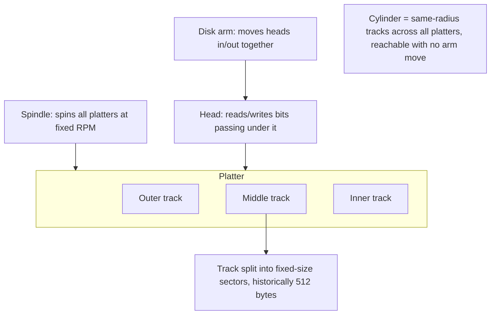
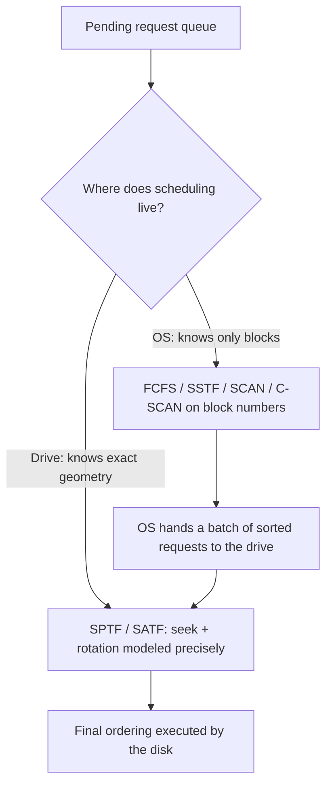

# Hard Disk Drives & Disk Scheduling

**The crux:** persistent storage must survive power loss, so the data that outlives a process lives on a mechanical device — a stack of spinning magnetic platters read by a head on a moving arm. That mechanism is astonishingly slow compared to RAM: reaching a byte can require physically **moving an arm** and **waiting for the platter to rotate** the right sector under the head. Two questions follow. First, *how do we reason about how long an I/O will take* so we can lay data out to make it fast? Second, given a pile of pending requests, *in what order should we service them* to minimize the total time the arm spends flailing around? This page answers both — the timing model, and disk scheduling.

## The core idea

- A hard disk exposes a simple contract: a **linear array of sectors** (blocks), each historically **512 bytes**, addressed `0` to `N-1`. Reads and writes of a single sector are **atomic** (a sector is either fully written or not at all). Everything above — files, directories, databases — is built on this flat array.
- Behind that array is **rotating mechanical hardware**. Getting to a sector may cost a **seek** (move the arm to the right track) plus a **rotation** (wait for the sector to spin under the head) plus a **transfer** (stream the bytes off the surface). These are the three components of I/O time.
- The dominant fact of disk performance: **sequential access is fast, random access is slow** — often by a factor of a few hundred. Sequential I/O amortizes one seek and one rotation over a huge transfer; random I/O pays a fresh seek and rotation for every tiny request.
- Because I/O is so expensive, the OS (and the disk itself) **reorders pending requests** to minimize mechanical motion. That reordering is **disk scheduling**, and unlike CPU job scheduling — where job length is unknown — the scheduler can *estimate* how long each request will take from its track and rotational position, so it can approximately follow **shortest-job-first**.

## How it works

### Disk geometry

- A disk is a stack of circular **platters**, each coated on both surfaces with a magnetic film that stores bits. All platters are bonded to a central **spindle** that spins them together at a constant **rotational speed**, measured in **RPM** (rotations per minute) — 7,200 and 15,000 RPM are classic values.
- Each surface is divided into concentric rings called **tracks**. A track is split into fixed-size arcs called **sectors** — the smallest unit the disk reads or writes.
- A **disk head** (one per surface) reads and writes bits as they rotate beneath it. All heads ride on a single **disk arm** that moves them in and out together.
- The set of tracks at the **same radius across all platters** is a **cylinder**. Because all heads move together, the sectors in one cylinder are reachable without any further arm movement — so a good on-disk layout keeps related data within a cylinder.



### The three components of I/O time

Servicing one request is the sum of three phases:

$$
T_{I/O} = T_{seek} + T_{rotation} + T_{transfer}
$$

- **Seek time** ($T_{seek}$): move the arm to the target track. The seek has phases — *acceleration*, *coasting*, *deceleration*, and finally *settling* (the head homing precisely onto the track). Settling alone is often 0.5 to 2 ms. Seeks are one of the most expensive disk operations.
- **Rotational delay** ($T_{rotation}$): once on the right track, wait for the target sector to rotate under the head. If a full rotation takes $R$, a random request waits on average **half a rotation**, so $T_{rotation} \approx R/2$.
- **Transfer time** ($T_{transfer}$): the actual reading or writing of bytes as the surface spins past the head. For a single sector this is tiny; for a long sequential run it dominates and approaches the drive's peak transfer rate.

The **rate of I/O** (throughput), easier for comparing drives, divides the size moved by the time it took:

$$
R_{I/O} = \frac{\text{Size}_{transfer}}{T_{I/O}}
$$

Two useful facts drop out of the geometry:

- **Rotational period from RPM.** A 10,000 RPM disk does $10{,}000/60 \approx 166.7$ rotations per second, so one rotation takes $R = 60{,}000 / 10{,}000 = 6$ ms, and $T_{rotation} \approx 3$ ms. A 15,000 RPM disk gives $R = 4$ ms and $T_{rotation} \approx 2$ ms.
- **Average seek is one-third of a full seek.** Averaging the seek *distance* over all pairs of tracks `0` to `N` (integrating $\vert x - y \vert$ over the square and dividing by $N^2$) yields $\tfrac{1}{3}N$. So the average seek distance is a third of a full end-to-end seek — which is why quoted "average seek time" is far below the worst case.

### Worked example: sequential versus random

Take the OSTEP numbers for a high-performance "Cheetah" drive (15,000 RPM): average seek $T_{seek} = 4$ ms, average rotational delay $T_{rotation} = 2$ ms, peak transfer 125 MB/s.

- **Random workload** — small 4 KB reads scattered across the disk. Each pays a fresh seek and rotation. Transfer of 4 KB at 125 MB/s is about 30 microseconds — negligible next to the mechanics:

$$
T_{I/O} = 4 + 2 + 0.03 \approx 6 \text{ ms}, \qquad
R_{I/O} = \frac{4 \text{ KB}}{6 \text{ ms}} \approx 0.66 \text{ MB/s}
$$

- **Sequential workload** — one big 100 MB read. Pay the seek and rotation **once**, then stream:

$$
T_{I/O} \approx 4 + 2 + \frac{100 \text{ MB}}{125 \text{ MB/s}} \approx 806 \text{ ms}, \qquad
R_{I/O} = \frac{100 \text{ MB}}{806 \text{ ms}} \approx 124 \text{ MB/s}
$$

- **The gap is enormous:** 0.66 MB/s random versus about 125 MB/s sequential — a factor of roughly **200**. The lesson, and one of the oldest design tips in systems: **use disks sequentially**. When random I/O is unavoidable, batch it into large chunks so one seek and rotation amortize over many bytes.

### Track skew, multi-zoned disks, and the disk cache

- **Track skew.** When a sequential read crosses from one track to the next, the arm needs a moment to settle on the new track. If sector 0 of the next track sat directly across from the last sector of the previous one, it would have *already spun past* the head by the time the arm settled, forcing a near-full rotation. So drives **skew** the sector numbering between adjacent tracks by a few sectors, aligning "the next block" to arrive under the head just after the arm settles. This keeps sequential reads flowing across track boundaries.
- **Multi-zoned disks.** Outer tracks are physically longer than inner tracks — more room — so they hold **more sectors**. Drives group tracks into **zones**, each zone having the same sectors-per-track, with outer zones packing more sectors than inner zones. This raises capacity but means the transfer rate is higher on outer tracks.
- **Disk cache (track buffer).** Modern drives include a small RAM **cache** (often 8 to 16 MB), historically called a **track buffer**. On a read the drive may pull in the *whole track* and cache it, so subsequent nearby requests are served from RAM at memory speed. On writes the drive chooses between **write-back caching** (acknowledge as soon as the data is in the drive's RAM — fast, but the data is not yet durable) and **write-through** (acknowledge only after the platter is written — safe but slower). Write-back can reorder or lose writes across a power failure, which is why journaling file systems care deeply about it.

### Disk scheduling: reordering the request queue

- Because each I/O is so expensive, the **disk scheduler** looks at the set of pending requests and picks the order that minimizes mechanical motion. Unlike CPU job scheduling, it can **estimate the cost** of each request (from its track distance and rotational position), so it can approximately follow **shortest-job-first (SJF)**.
- We compare policies by **total head movement** — the sum of seek distances (in tracks) as the head services the whole queue. Fewer tracks traversed means less total seek time.

**FCFS (First-Come-First-Served).** Serve requests in arrival order, no reordering. Fair and simple, but the head can bounce wildly back and forth across the disk, giving the worst total movement.

**SSTF (Shortest-Seek-Time-First).** Always serve the *nearest* pending request to the current head position (also called shortest-seek-first / nearest-block-first). Greedy and much better than FCFS on total movement. Two problems:

- The disk exposes only a linear array of *blocks*, so the OS cannot know the true geometry to compute real seek time — but nearest-**block** is a fine proxy, and the drive itself knows the geometry exactly.
- **Starvation.** A steady stream of requests near the head's current region can **indefinitely defer** requests to far-off tracks. Pure greed is unfair.

**SCAN (elevator).** Sweep the head steadily in one direction, servicing every request in its path, until it reaches the end (or the last request), then reverse and sweep back. Like an elevator visiting floors, it never starves a request for long — the sweep will eventually pass it. A request that just missed the current sweep waits for the next one.

**C-SCAN (Circular SCAN).** Sweep in **one direction only**; on reaching the end, **jump straight back** to the start and sweep the same way again. Plain SCAN favors the middle tracks (it passes them twice per round trip while the ends are visited once); C-SCAN treats every track the same way, giving **more uniform wait times** — it is *fairer*, at the cost of the return jump.

**SPTF (Shortest-Positioning-Time-First).** SSTF and SCAN only account for *seek*; they **ignore rotation**. But if a far track's sector is about to rotate under the head while a near track's sector just spun past (forcing an almost-full rotation), it can be faster to seek *farther*. SPTF (also SATF, shortest-access-time-first) picks the request with the smallest **combined seek + rotational delay** — the true positioning time. It needs exact rotational geometry, which the OS does not have.



**Where scheduling lives (OS versus disk).** Historically the OS did all scheduling. But only the **drive** knows the exact head position, rotational offset, track skew, and zone layout needed for SPTF. So modern practice splits the job: the **OS** picks a good *batch* of requests and issues them together (often SSTF/SCAN over block numbers), and the **drive's** internal scheduler does the final SPTF ordering using its precise geometry. This is why the disk — not the OS — usually does the last word in scheduling.

## Must-know algorithms

A single compile-tested simulator implements **FCFS, SSTF, SCAN, and C-SCAN** over a request queue of track numbers, reporting **total head movement** for each. It is verified on the classic textbook string — head starting at track **53**, queue `98 183 37 122 14 124 65 67`, disk tracks `0` to `199`.

```c
#include <stdio.h>
#include <stdlib.h>

/* absolute value of an int */
static int iabs(int a) { return a < 0 ? -a : a; }

/* FCFS: serve requests in arrival order; sum the hop distances. */
static int fcfs(const int *req, int n, int head) {
    int total = 0, cur = head;
    for (int i = 0; i < n; i++) { total += iabs(req[i] - cur); cur = req[i]; }
    return total;
}

/* SSTF: repeatedly serve the nearest un-served request to the head. */
static int sstf(const int *req, int n, int head) {
    int done[64] = {0}, total = 0, cur = head;
    for (int k = 0; k < n; k++) {
        int best = -1, bestd = 1 << 30;
        for (int i = 0; i < n; i++) {
            if (done[i]) continue;
            int d = iabs(req[i] - cur);
            if (d < bestd) { bestd = d; best = i; }
        }
        done[best] = 1; total += bestd; cur = req[best];
    }
    return total;
}

static int cmp(const void *a, const void *b) {
    return *(const int *)a - *(const int *)b;
}

/* SCAN (elevator): sweep up to the top boundary, then reverse down.
   disk_max is the highest track number (upper end of the sweep). */
static int scan(const int *req, int n, int head, int disk_max) {
    int s[64];
    for (int i = 0; i < n; i++) s[i] = req[i];
    qsort(s, n, sizeof(int), cmp);
    int total = 0, cur = head;
    int split = 0;                       /* first index with track >= head */
    while (split < n && s[split] < head) split++;
    for (int i = split; i < n; i++) { total += iabs(s[i] - cur); cur = s[i]; }
    total += iabs(disk_max - cur); cur = disk_max;   /* run to top boundary */
    for (int i = split - 1; i >= 0; i--) { total += iabs(cur - s[i]); cur = s[i]; }
    return total;
}

/* C-SCAN: sweep up to the top boundary, jump to 0, sweep up again. */
static int cscan(const int *req, int n, int head, int disk_max) {
    int s[64];
    for (int i = 0; i < n; i++) s[i] = req[i];
    qsort(s, n, sizeof(int), cmp);
    int total = 0, cur = head;
    int split = 0;
    while (split < n && s[split] < head) split++;
    for (int i = split; i < n; i++) { total += iabs(s[i] - cur); cur = s[i]; }
    total += iabs(disk_max - cur); cur = disk_max;   /* to top boundary */
    total += disk_max;                                /* jump top -> 0 */
    cur = 0;
    for (int i = 0; i < split; i++) { total += iabs(s[i] - cur); cur = s[i]; }
    return total;
}

int main(void) {
    int req[] = {98, 183, 37, 122, 14, 124, 65, 67};
    int n = 8, head = 53, disk_max = 199;
    printf("head=%d, tracks 0..%d, queue: 98 183 37 122 14 124 65 67\n\n",
           head, disk_max);
    printf("FCFS   total head movement = %d\n", fcfs(req, n, head));
    printf("SSTF   total head movement = %d\n", sstf(req, n, head));
    printf("SCAN   total head movement = %d\n", scan(req, n, head, disk_max));
    printf("C-SCAN total head movement = %d\n", cscan(req, n, head, disk_max));
    return 0;
}
```

Running it prints:

```
head=53, tracks 0..199, queue: 98 183 37 122 14 124 65 67

FCFS   total head movement = 640
SSTF   total head movement = 236
SCAN   total head movement = 331
C-SCAN total head movement = 382
```

- **FCFS = 640 tracks.** Serving `53 → 98 → 183 → 37 → 122 → 14 → 124 → 65 → 67` in arrival order makes the head lurch across the disk repeatedly — the largest total.
- **SSTF = 236 tracks.** Always jumping to the nearest request (`53 → 65 → 67 → 37 → 14`, then up to `98 → 122 → 124 → 183`) collapses the movement dramatically — the smallest here — but a steady stream near track 65 could have starved track 14 or 183.
- **SCAN = 331 tracks.** Sweeping up from 53 to the top boundary 199 (`65 → 67 → 98 → 122 → 124 → 183 → 199`) then reversing down (`37 → 14`) is more than SSTF but bounds every request's wait — no starvation.
- **C-SCAN = 382 tracks.** Sweeping up to 199, jumping back to 0, then up to `14 → 37` costs more total movement because of the return jump, but gives the **most uniform** wait times across all tracks — the fairness/efficiency trade.

## Interview questions

1. **What are the three components of disk I/O time?**
   $T_{I/O} = T_{seek} + T_{rotation} + T_{transfer}$. **Seek** moves the arm to the target track (including the settling phase); **rotational delay** waits for the sector to spin under the head (about half a rotation on average, $R/2$); **transfer** reads or writes the bytes as the surface passes. Throughput is $R_{I/O} = \text{Size} / T_{I/O}$.

2. **Why is random I/O far slower than sequential I/O?**
   Random I/O pays a **fresh seek and rotation for every small request**, and those mechanical costs (milliseconds) dwarf the tiny transfer (microseconds). Sequential I/O pays the seek and rotation **once** and then streams a large transfer, so the fixed mechanical cost amortizes over many bytes. On a typical drive this is a gap of a few hundred times — hence "use disks sequentially."

3. **FCFS versus SSTF, and what is SSTF's flaw?**
   **FCFS** serves requests in arrival order — fair but the head bounces around, giving the worst total movement. **SSTF** always serves the nearest pending request, greatly reducing total seek distance. Its flaw is **starvation**: a steady stream of requests near the current head position can indefinitely defer far-away requests. (There is also a practical wrinkle: the OS sees only block numbers, not true geometry, so it uses nearest-block as a proxy.)

4. **What are SCAN and C-SCAN, and why is C-SCAN fairer?**
   **SCAN** (elevator) sweeps the head across the disk in one direction servicing everything in its path, then reverses — bounding every request's wait. **C-SCAN** sweeps in only **one direction**, then jumps back to the start and repeats. Plain SCAN visits **middle tracks twice** per round trip (once each direction) while the extremes are visited once, so middle requests wait less; C-SCAN gives every track the **same treatment and more uniform wait times**, at the cost of the return jump.

5. **What is SPTF, and why does the *disk* usually do the final scheduling rather than the OS?**
   **SPTF** (shortest-positioning-time-first) picks the request with the smallest **combined seek + rotational delay**, unlike SSTF/SCAN which ignore rotation. Because a far track whose sector is about to arrive can be faster than a near track whose sector just passed, accounting for rotation matters. But only the **drive** knows the exact head position, rotational offset, track skew, and zone layout needed to compute positioning time — the OS sees only blocks. So the OS picks a good batch and hands it down; the drive does the final SPTF ordering.

6. **How does a disk cache / track buffer help?**
   The drive keeps a small RAM cache (often 8 to 16 MB). On a read it can pull in the **whole track** and serve subsequent nearby requests from RAM at memory speed, hiding rotation. On writes, **write-back** caching acknowledges as soon as data is in the drive's RAM (fast, but not yet durable), while **write-through** waits for the platter (safe, slower). Write-back can reorder or lose writes on power loss, which is why journaling file systems must control it.

7. **What is track skew, and why do multi-zoned disks pack more sectors on outer tracks?**
   **Track skew** offsets the sector numbering between adjacent tracks so that, after the arm settles on the next track during a sequential read, "the next block" arrives under the head just in time — avoiding a near-full extra rotation at every track boundary. **Multi-zoned** disks exploit geometry: outer tracks are physically longer, so drives group tracks into zones and give outer zones **more sectors per track**, raising capacity (and transfer rate on outer tracks).

8. **Why is an average seek roughly one-third of a full seek?**
   Averaging the seek *distance* over every pair of tracks `0` to `N` — integrating $\vert x - y \vert$ over the square of positions and dividing by $N^2$ — works out to $\tfrac{1}{3}N$. So a random seek covers about a third of the disk's full radius, which is why the manufacturer's "average seek time" is much smaller than a worst-case end-to-end seek.

9. **How do SSDs change all this? (forward reference)**
   SSDs have **no moving parts** — no arm, no platter — so there is **no seek and no rotation**; access time is nearly uniform regardless of location. The huge random-versus-sequential gap collapses, and seek-based schedulers (SSTF/SCAN) lose most of their point. New concerns replace them: erase-before-write, wear-leveling, and the flash translation layer. This is covered on the flash/SSD page.

## Coding problems

- 🎯 **[Meeting Rooms II — LeetCode 253](https://leetcode.com/problems/meeting-rooms-ii/)** — sort interval starts and ends and **sweep** a running counter; the same one-directional sweep-line discipline that the SCAN/elevator scheduler uses to process requests in sorted order. (LeetCode Premium.)
- 🎯 **[Minimum Number of Arrows to Burst Balloons — LeetCode 452](https://leetcode.com/problems/minimum-number-of-arrows-to-burst-balloons/)** — sort by endpoint and greedily sweep left-to-right firing at the current group; an interval-greedy that mirrors the elevator's "commit to one direction and service everything in the path" strategy.
- 🏗 **Disk scheduler (FCFS / SSTF / SCAN / C-SCAN)** — the C program above; given a head position, a queue of track numbers, and the disk's boundary, compute the **total head movement** for each policy and reproduce the classic `head=53` result (FCFS 640, SSTF 236, SCAN 331, C-SCAN 382). The OS-classic "implement the policies and compare seek totals" exercise.

## Key takeaways

- A disk presents a **flat array of atomically-written sectors**, but underneath is mechanical hardware — **platters** on a **spindle**, concentric **tracks** split into **sectors**, a **head** on a moving **arm**, and same-radius tracks forming a **cylinder**.
- I/O time is $T_{I/O} = T_{seek} + T_{rotation} + T_{transfer}$, with throughput $R_{I/O} = \text{Size}/T_{I/O}$; rotational delay averages $R/2$ and an average seek is about $\tfrac{1}{3}$ of a full seek.
- **Sequential I/O is hundreds of times faster than random** because it amortizes one seek and rotation over a large transfer — always prefer sequential, and batch random I/O into big chunks.
- **Track skew**, **multi-zoning**, and the **track-buffer cache** are drive-level tricks that keep sequential reads flowing and hide latency; write-back caching trades durability for speed.
- Scheduling policies trade efficiency against fairness: **FCFS** (fair, worst movement) → **SSTF** (least movement, can starve) → **SCAN/C-SCAN** (elevator, bounded/uniform waits) → **SPTF** (models seek *and* rotation, needs exact geometry).
- Final scheduling lives **in the drive**, not the OS, because only the drive knows the precise geometry needed for SPTF; the OS just hands down a good batch.

## Source(s) and further reading

- OSTEP — [Hard Disk Drives (free PDF)](https://pages.cs.wisc.edu/~remzi/OSTEP/file-disks.pdf) — geometry, the seek/rotation/transfer model, the Cheetah-vs-Barracuda random/sequential numbers, and FCFS/SSTF/SCAN/C-SCAN/SPTF.
- Wikipedia — [Hard disk drive performance characteristics](https://en.wikipedia.org/wiki/Hard_disk_drive_performance_characteristics) — seek time, rotational latency, data transfer rate, and caching in practice.
- Wikipedia — [Elevator algorithm](https://en.wikipedia.org/wiki/Elevator_algorithm) — SCAN, C-SCAN, and their variants as the elevator model.
- Wikipedia — [Shortest seek first](https://en.wikipedia.org/wiki/Shortest_seek_first) — SSTF and its starvation problem.
