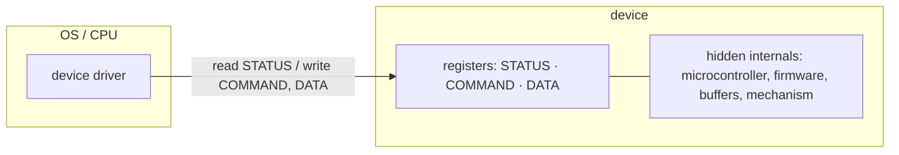
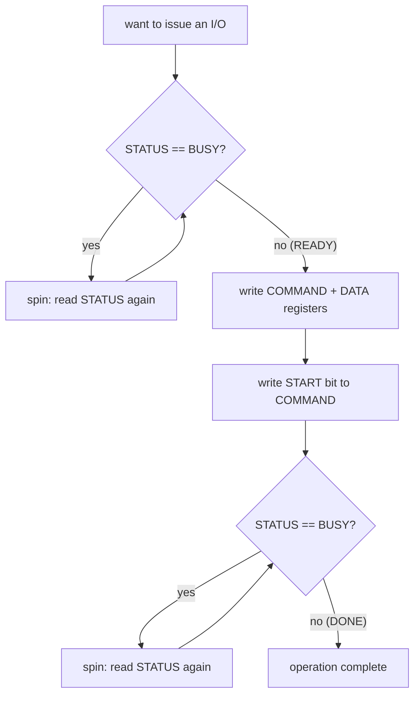
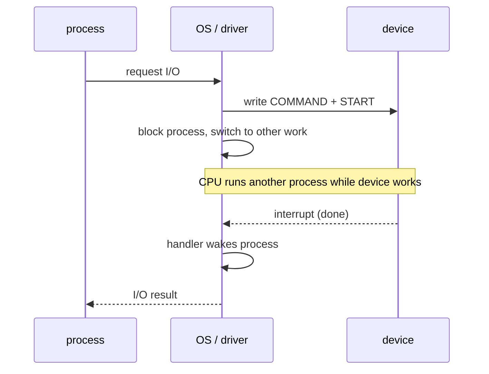
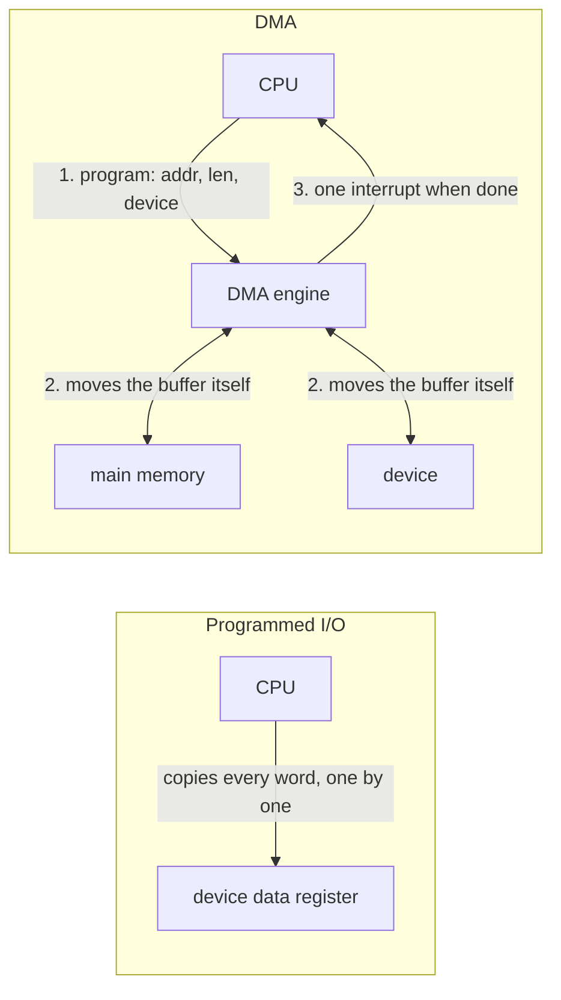
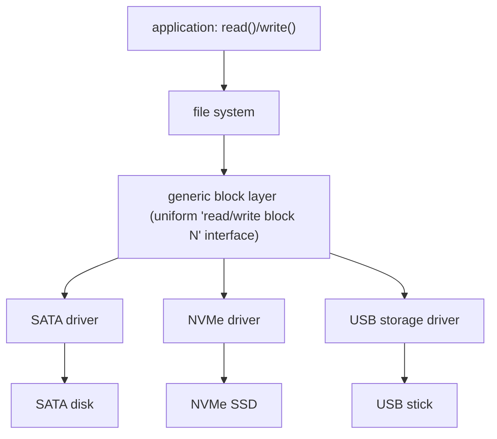

# I/O Devices

**The crux:** a CPU that only computes is useless — a program has to get data *in* (keyboard, disk, network) and *out* (screen, disk, network). But devices are wildly heterogeneous (a mouse and an NVMe SSD share almost nothing) and enormously slower than the CPU. So the OS needs a **uniform, efficient way to issue requests to arbitrary hardware and learn when they finish** — without freezing the whole machine while a slow disk grinds, and without drowning a fast NIC's throughput in per-operation overhead. This chapter is the mechanism layer that every filesystem and network stack is built on top of.

## The core idea

- **Every device presents a small interface of registers.** The OS reads and writes a handful of hardware locations; it never touches the device's internal circuitry directly. Canonically three registers:
  - **Status register** — read it to learn what the device is doing (busy, ready, error).
  - **Command register** — write it to tell the device *what* to do (read a sector, send a packet).
  - **Data register** — the payload moving in or out (a byte, a word, a buffer address).
- **A canonical protocol drives that interface:** poll the status until the device is not busy, write the command and data, tell it to *start*, then wait for completion. Simple, and it works for any device that exposes these registers.
- **Two big efficiency questions sit on top of this protocol:**
  - **How do we wait?** Spin in a loop reading status (**polling**) or let the device raise an **interrupt** when done and go do other work meanwhile.
  - **Who moves the bytes?** The CPU copies every word itself (**programmed I/O**) or a **DMA** engine copies the buffer while the CPU runs other code.
- **Internals are hidden behind a driver.** The OS core speaks a generic interface (e.g. "read block N"); a per-device **driver** translates that into the exact register pokes this hardware needs. This is why most of a kernel's code, by line count, is drivers.

## How it works

### The canonical device model

A device is (from the OS's point of view) its **registers** plus a hidden internal implementation. The status/command/data triple is the classic model:



- The **interface** (registers) is standardized enough for software to drive; the **internals** vary per device and are the manufacturer's problem.
- Reads/writes of these registers reach the hardware over a bus (PCIe today; historically ISA/PCI). The addressing scheme is discussed under *memory-mapped vs port I/O* below.

### The canonical protocol

The textbook interaction to hand a device one request:



- **Step 1 — wait until ready.** Repeatedly read the status register until the device reports it is not busy. You cannot hand a busy device new work.
- **Step 2 — program the request.** Write the command and any data (or the address of a buffer) into the command/data registers.
- **Step 3 — start.** Set the start bit; the device now goes busy and does the work.
- **Step 4 — wait for completion.** Read status until the device reports done (this is the "poll for done" phase — interrupts replace it below).

The two waiting phases are the expensive part, and everything that follows is about making them cheaper.

### Polling vs interrupts

**Polling** = the CPU spins in a loop reading the status register. It is dead simple and has no per-request setup cost, but every spin iteration is a **wasted CPU cycle** — cycles that could have run another process. For a slow device (a disk taking milliseconds) that is millions of wasted cycles.

**Interrupts** = instead of spinning, the OS issues the request, then **blocks the calling process and context-switches to other work**. When the device finishes it raises a hardware interrupt; the CPU jumps to the driver's **interrupt handler**, which wakes the waiting process. The CPU stays busy with useful work during the whole slow I/O.



- **Interrupts win when the device is slow** relative to the cost of two context switches — the CPU reclaims all those cycles.
- **Polling wins when the device is very fast.** If an operation finishes in a few cycles, the interrupt path's overhead (context switch out, IRQ delivery, handler, context switch back) costs *more* than just spinning briefly. Modern low-latency NVMe drivers often poll for exactly this reason.
- **Hybrid / coalescing.** Real drivers mix strategies: poll for a short while and fall back to interrupts if the device is still busy; or **coalesce interrupts** — the device batches several completions into one interrupt (common on high-rate NICs) so the per-interrupt overhead is amortized across many packets. The pathological failure mode is **livelock**: under an interrupt storm the CPU spends 100% of its time in interrupt handlers and never makes forward progress on actual work.

### Programmed I/O (PIO) vs DMA

Even with interrupts solving *waiting*, there is a second cost: **copying the bytes**.

- **Programmed I/O (PIO):** the CPU itself moves every word between memory and the device's data register in a loop. For a large transfer (a 4 KB disk block, a big packet) that is thousands of loads/stores the CPU must execute — it is busy the whole time just shoveling data.
- **DMA (Direct Memory Access):** a dedicated **DMA engine** does the copy. The CPU tells the DMA controller *where in memory* the buffer is, *how much* to move, and *which device*; the DMA engine transfers the data to/from memory on its own, and raises **one interrupt** when the whole transfer is done. The CPU is free to run other processes during the copy.



- **DMA offloads the data copy from the CPU.** That is its entire purpose — the CPU no longer spends cycles as a memcpy engine for I/O. It still issues the request and handles the final interrupt, but the bulk transfer runs concurrently.
- DMA is essential for high-throughput devices (disks, NICs, GPUs): a NIC doing 10 Gbps would saturate a CPU core if it had to PIO every byte.

### Memory-mapped I/O vs explicit I/O instructions

How does the CPU actually *name* a device register? Two schemes:

- **Port-mapped (explicit) I/O:** the ISA has dedicated instructions (on x86, `in`/`out`) and a separate **I/O address space** of "ports." Device registers live at port numbers, distinct from memory addresses. The instruction encoding itself says "this is an I/O access."
- **Memory-mapped I/O (MMIO):** device registers are wired into the **physical memory address space**. Reading or writing certain physical addresses goes to the device instead of RAM. Ordinary `load`/`store` instructions drive the hardware — no special opcodes needed, and normal addressing/protection (page tables) applies.

MMIO is dominant on modern systems (it composes with the MMU, caching attributes, and generic memory instructions), though x86 keeps port I/O for legacy compatibility. Both are just two ways to route a CPU access to a device register; the canonical protocol above is identical either way.

### The device-driver abstraction

The OS must talk to hundreds of different disks, NICs, and GPUs — but the filesystem should not contain a switch statement over every SSD model. The fix is a **driver stack**: a generic layer with a uniform interface on top, per-device drivers underneath.



- The **generic block layer** exports one abstract operation ("read/write a block") that the filesystem targets, oblivious to the hardware beneath.
- Each **device driver** implements that abstract operation for one class of hardware by issuing the exact register writes and interrupt handling that device requires — the raw canonical protocol lives here.
- **Consequence:** because every distinct device needs its own driver, and there are enormous numbers of devices, **the majority of an OS kernel's source code (by line count) is drivers**, not the "core" scheduler/VM/filesystem logic. It also means a buggy third-party driver can crash the whole kernel, since drivers run in kernel space.

## Must-know algorithms

### Device-protocol simulator: polling vs interrupt driver

This program models a device with a **status register** and drives it with the canonical **poll → command → poll** protocol. It then contrasts a **polling driver** (which burns a CPU cycle on every spin) against an **interrupt-driven driver** (which reclaims those cycles for other work), and finally shows the crossover where **polling wins for a very fast device** because interrupt/context-switch overhead dominates.

```c
#include <stdio.h>
#include <stdint.h>

/* ---- canonical device model ---------------------------------------- */
/* A real device exposes a small set of registers. We model three:
   STATUS (is the device busy?), COMMAND (what to do), DATA (payload). */

enum { DEV_READY = 0, DEV_BUSY = 1 };   /* status register values      */
enum { CMD_WRITE = 1 };                 /* a command                   */

typedef struct {
    int status;                 /* status register                     */
    int command;                /* command register                    */
    int data;                   /* data register                       */
    int service_ticks;          /* ticks remaining to finish current op*/
    int irq_pending;            /* device raised an interrupt          */
} device;

/* WRITE_TIME models a SLOW device: after we start it, it takes this
   many "ticks" of real work before the operation completes. */
enum { WRITE_TIME = 100 };

/* device_tick(): advance the hardware by one tick of its own work.
   When the op finishes, status returns to READY and an IRQ is raised. */
static void device_tick(device *d) {
    if (d->status == DEV_BUSY) {
        if (--d->service_ticks <= 0) {
            d->status = DEV_READY;
            d->irq_pending = 1;   /* completion interrupt              */
        }
    }
}

/* device_start(): issue a command + data, then start the device.
   Precondition: caller has already polled status until READY. */
static void device_start(device *d, int cmd, int data) {
    d->command = cmd;
    d->data = data;
    d->status = DEV_BUSY;
    d->service_ticks = WRITE_TIME;
}

/* ---- the canonical protocol: polling driver ------------------------ */
/* poll until READY -> write cmd/data + start -> poll until DONE.
   Every tick the CPU spends spinning in a poll loop is a WASTED cycle:
   the CPU could have run another process instead. */

static long poll_write(device *d, int data) {
    long cpu_wasted = 0;

    /* 1. poll status until the device is not busy */
    while (d->status == DEV_BUSY) { device_tick(d); cpu_wasted++; }

    /* 2. write command + data and start the device */
    device_start(d, CMD_WRITE, data);

    /* 3. poll status until the device signals done */
    while (d->status == DEV_BUSY) { device_tick(d); cpu_wasted++; }
    d->irq_pending = 0;           /* driver consumed completion        */

    return cpu_wasted;            /* ticks the CPU burned polling      */
}

/* ---- interrupt-driven driver --------------------------------------- */
/* Instead of spinning, the OS issues the request, then BLOCKS the
   caller and context-switches to other work. When the device finishes
   it raises an interrupt; the handler wakes the caller. We model the
   "other work" as useful cycles the CPU reclaims instead of polling.
   CTXT is the fixed cost of the two context switches + IRQ handling. */

enum { CTXT = 5 };

static long intr_write(device *d, int data, long *cpu_useful) {
    long overhead = 0;

    while (d->status == DEV_BUSY) { device_tick(d); } /* rare: prior op */

    device_start(d, CMD_WRITE, data);
    overhead += CTXT;             /* switch away to another process     */

    /* device runs concurrently; the CPU does OTHER useful work.
       We advance the device while crediting every tick as reclaimed. */
    while (d->status == DEV_BUSY) {
        device_tick(d);
        (*cpu_useful)++;          /* CPU ran another process this tick  */
    }

    if (d->irq_pending) {         /* completion interrupt fires         */
        d->irq_pending = 0;
        overhead += CTXT;         /* IRQ handler + switch back           */
    }
    return overhead;              /* CPU cycles the driver itself cost   */
}

int main(void) {
    /* --- Slow device: interrupts win by freeing the CPU ------------- */
    device slow = {0};
    long wasted = 0;
    for (int i = 0; i < 3; i++) wasted += poll_write(&slow, i);

    device slow2 = {0};
    long overhead = 0, reclaimed = 0;
    for (int i = 0; i < 3; i++) overhead += intr_write(&slow2, i, &reclaimed);

    printf("SLOW device, 3 writes (WRITE_TIME=%d each)\n", WRITE_TIME);
    printf("  polling   : CPU cycles burned spinning = %ld\n", wasted);
    printf("  interrupts: driver overhead cycles      = %ld\n", overhead);
    printf("              CPU cycles reclaimed for work= %ld\n", reclaimed);
    printf("  -> interrupts free ~%ld CPU cycles vs polling\n\n",
           wasted - overhead);

    /* --- Fast device: polling wins (interrupt overhead dominates) --- */
    /* If a device completes in a couple of ticks, the two context
       switches (2*CTXT) cost MORE than just spinning briefly. */
    printf("FAST device (completes in 2 ticks)\n");
    long fast_poll = 2;                 /* ~2 ticks spent spinning       */
    long fast_intr = 2 * CTXT;          /* two context switches          */
    printf("  polling   : ~%ld cycles\n", fast_poll);
    printf("  interrupts: ~%ld cycles (overhead dominates)\n", fast_intr);
    printf("  -> polling wins for very fast devices\n");
    return 0;
}
```

Output:

```text
SLOW device, 3 writes (WRITE_TIME=100 each)
  polling   : CPU cycles burned spinning = 300
  interrupts: driver overhead cycles      = 30
              CPU cycles reclaimed for work= 300
  -> interrupts free ~270 CPU cycles vs polling

FAST device (completes in 2 ticks)
  polling   : ~2 cycles
  interrupts: ~10 cycles (overhead dominates)
  -> polling wins for very fast devices
```

The numbers make the tradeoff concrete: with a slow device, polling burns 300 cycles the interrupt path reclaims for real work; with a fast device, the interrupt path's two context switches cost more than a brief spin.

### DMA descriptor ring (fixed-capacity circular queue)

Devices and drivers hand off buffers through a **descriptor ring** — a fixed-size circular queue. The driver *enqueues* buffers for the device to fill or drain; the DMA engine *dequeues* them as it completes work; `head`/`tail` wrap modulo the capacity. This is exactly LeetCode 622 (Design Circular Queue), and it is the data structure at the heart of every NIC/NVMe driver.

```c
#include <stdio.h>
#include <stdlib.h>
#include <stdbool.h>

/* A DMA descriptor ring is exactly a fixed-capacity circular queue.
   The driver ENQUEUES descriptors (buffers for the device to fill/drain);
   the device DEQUEUES them as it completes work. head/tail wrap modulo k. */

typedef struct {
    int *buf;      /* backing array of slots            */
    int  cap;      /* number of slots                   */
    int  head;     /* index of front element            */
    int  size;     /* current number of elements        */
} ring;

static ring *ring_new(int k) {
    ring *r = malloc(sizeof(ring));
    r->buf = malloc(sizeof(int) * k);
    r->cap = k; r->head = 0; r->size = 0;
    return r;
}
static bool ring_empty(ring *r) { return r->size == 0; }
static bool ring_full (ring *r) { return r->size == r->cap; }

static bool ring_enqueue(ring *r, int v) {
    if (ring_full(r)) return false;
    int tail = (r->head + r->size) % r->cap;   /* wrap                 */
    r->buf[tail] = v;
    r->size++;
    return true;
}
static bool ring_dequeue(ring *r) {
    if (ring_empty(r)) return false;
    r->head = (r->head + 1) % r->cap;          /* advance + wrap       */
    r->size--;
    return true;
}
static int ring_front(ring *r) { return ring_empty(r) ? -1 : r->buf[r->head]; }
static int ring_rear (ring *r) {
    if (ring_empty(r)) return -1;
    return r->buf[(r->head + r->size - 1) % r->cap];
}
static void ring_free(ring *r) { free(r->buf); free(r); }

int main(void) {
    ring *r = ring_new(3);                     /* 3-slot descriptor ring */
    printf("enq10=%d enq20=%d enq30=%d enq40(full)=%d\n",
           ring_enqueue(r,10), ring_enqueue(r,20),
           ring_enqueue(r,30), ring_enqueue(r,40));
    printf("rear=%d full=%d\n", ring_rear(r), ring_full(r));
    printf("deq=%d front=%d\n", ring_dequeue(r), ring_front(r));
    printf("enq40(wrap)=%d rear=%d\n", ring_enqueue(r,40), ring_rear(r));
    ring_free(r);
    return 0;
}
```

Output:

```text
enq10=1 enq20=1 enq30=1 enq40(full)=0
rear=30 full=1
deq=1 front=20
enq40(wrap)=1 rear=40
```

The last line shows the wrap: after dequeuing slot 0, a new enqueue reuses that freed slot while `head` has advanced — the ring never shifts elements, it just moves indices modulo the capacity.

## Interview questions

**1. Describe the canonical device protocol.**
Read the device's **status** register in a loop until it is not busy; write the **command** and **data** registers to program the request; set the start bit; then wait (poll or interrupt) until status reports done. Any device exposing status/command/data registers can be driven this way.

**2. Polling vs interrupts — when does each win?**
Polling spins reading status; it is simple and has no setup cost but wastes a CPU cycle per spin. Interrupts block the caller and let the CPU do other work, then a hardware interrupt wakes it on completion. **Interrupts win for slow devices** (they reclaim the wasted cycles). **Polling wins for very fast devices**, where the cost of two context switches plus interrupt delivery exceeds the cost of a brief spin — which is why low-latency NVMe drivers poll.

**3. What does DMA offload, exactly?**
DMA offloads the **data copy**. Without it, the CPU executes a load/store per word to move a buffer between memory and the device (programmed I/O), keeping the CPU busy the whole transfer. With DMA, the CPU programs the DMA engine (source/dest address, length, device) and the engine moves the bytes on its own, raising a single interrupt when done — freeing the CPU to run other processes during the transfer.

**4. Programmed I/O vs DMA.**
PIO: the CPU is the mover, copying every word itself — fine for tiny transfers, terrible for bulk. DMA: a dedicated engine moves the bulk data concurrently. High-throughput devices (disk, NIC, GPU) require DMA; a 10 Gbps NIC would saturate a core if the CPU had to PIO every byte.

**5. Memory-mapped I/O vs port (explicit) I/O.**
Port I/O uses special instructions (x86 `in`/`out`) into a separate I/O address space of ports. MMIO wires device registers into the physical memory address space so ordinary `load`/`store` reach them — composing with the MMU, protection, and cache attributes. MMIO dominates modern systems; x86 keeps port I/O for legacy. The canonical protocol is identical either way.

**6. What does a device driver do, and why is most of a kernel drivers?**
A driver translates the OS's **generic** interface (e.g. "read block N") into the exact register writes and interrupt handling one class of hardware requires — it is where the raw protocol lives. Because there are an enormous number of distinct devices and each needs its own driver, drivers make up the **majority of kernel source by line count**. It also means a buggy driver can crash the kernel, since drivers run in kernel space.

**7. What is interrupt coalescing, and what problem does it solve?**
Coalescing lets a device batch several completions into a **single** interrupt instead of one interrupt per event. On a high-rate NIC, one-interrupt-per-packet would overwhelm the CPU with handler entries; coalescing amortizes the per-interrupt overhead across many packets, trading a little latency for far higher throughput.

**8. What is receive livelock under an interrupt storm?**
When interrupts arrive faster than the system can process the underlying work, the CPU spends all its time entering/exiting interrupt handlers and never makes forward progress on actual packet/request processing — throughput collapses to near zero despite 100% CPU. Mitigations: interrupt coalescing, switching to **polling** under high load (Linux NAPI does exactly this), and rate-limiting interrupts.

**9. Why is a hybrid poll-then-interrupt scheme useful?**
It captures both wins: poll briefly (cheap, low latency) for the common fast-completion case, and fall back to blocking on an interrupt if the device is still busy after a short spin (so the CPU is not wasted on a genuinely slow operation). This adapts to devices whose latency varies.

**10. Where does the descriptor ring fit in the I/O path?**
It is the shared, fixed-capacity queue between driver and device (a circular queue). The driver posts buffer descriptors; the DMA engine consumes them and posts completions back. Head/tail wrap modulo capacity, so no data is ever shifted — only indices move.

## Coding problems

- 🎯 **[LeetCode 622 — Design Circular Queue](https://leetcode.com/problems/design-circular-queue/)** — implement a fixed-capacity ring with wraparound `enQueue`/`deQueue`/`Front`/`Rear`/`isFull`/`isEmpty`. *Tests* the exact structure of a **DMA descriptor ring**; the C reference above is a direct solution.
- 🎯 **[LeetCode 933 — Number of Recent Calls](https://leetcode.com/problems/number-of-recent-calls/)** — a queue that keeps only events inside a sliding time window. *Tests* the sliding-window queue that underlies **interrupt rate-limiting / coalescing** (how many interrupts fired in the last N ms).
- 🏗 **Poll-vs-interrupt device protocol** — model a device with a status register and implement both a polling driver and an interrupt-driven driver, accounting for CPU cycles wasted spinning vs reclaimed. *Tests* the core mechanism of this chapter; the simulator above is a complete reference (compile with `cc -std=c11 sim.c -o sim`).

## Key takeaways

- Devices present a tiny register interface — **status, command, data** — and the OS drives it with a canonical **poll → program → start → wait** protocol.
- **Polling** wastes CPU cycles spinning; **interrupts** free the CPU for other work during slow I/O. Interrupts win for slow devices; **polling wins for very fast ones** where context-switch overhead dominates. Hybrids and interrupt coalescing bridge the gap; unchecked interrupts cause **livelock**.
- **DMA offloads the data copy** from the CPU, so the bulk transfer runs concurrently and the CPU only handles one completion interrupt — essential for high-throughput devices.
- **MMIO** (registers in the physical address space, driven by ordinary loads/stores) dominates over legacy **port I/O**; the protocol is identical either way.
- A **driver** hides device internals behind a generic interface (generic block layer → specific driver), which is why **most of a kernel, by line count, is drivers**.

## Source(s) and further reading

- OSTEP — [I/O Devices (free PDF)](https://pages.cs.wisc.edu/~remzi/OSTEP/file-devices.pdf) — the canonical device model, protocol, interrupts, and DMA.
- Wikipedia — [Direct memory access](https://en.wikipedia.org/wiki/Direct_memory_access)
- Wikipedia — [Device driver](https://en.wikipedia.org/wiki/Device_driver)
- Wikipedia — [Interrupt](https://en.wikipedia.org/wiki/Interrupt)
- Wikipedia — [Programmed input–output](https://en.wikipedia.org/wiki/Programmed_input%E2%80%93output)
