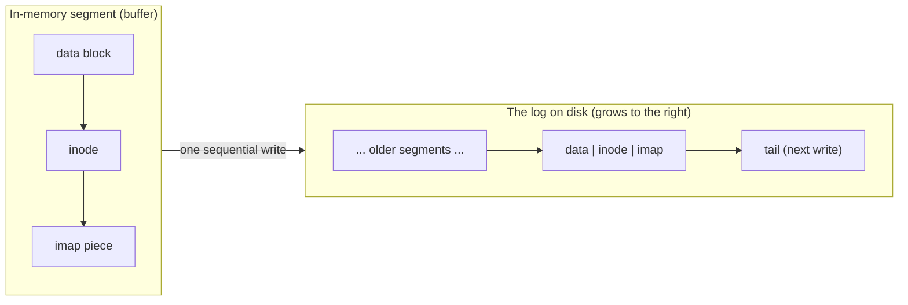
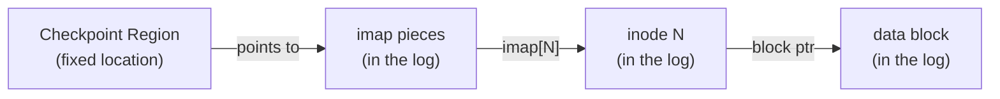

# Log-Structured File System (LFS)

**The crux:** disks (and SSDs) are dramatically faster at **sequential** writes than at **random** ones — a seek plus rotation costs milliseconds, while streaming the next sector costs almost nothing. Meanwhile, growing RAM caches absorb most **reads**, so the read path is no longer the bottleneck the write path is. A traditional file system scatters small updates all over the disk (a data block here, its inode there, a bitmap somewhere else), paying a seek for each. LFS asks: *what if we never write randomly at all?* Buffer every update in memory, then write the whole batch as one long **sequential** transfer to a **log** that we never overwrite in place. The payoff is near-peak write bandwidth; the price is a set of new problems — moving inodes, and old data turning into garbage — that the rest of this page is about solving.

## The core idea

- **Optimize for writing, not reading.** Reads are increasingly served from RAM caches, so the disk mostly sees writes. Make those writes as fast as the device allows.
- **Sequential beats random by orders of magnitude.** On a spinning disk a random write pays a seek plus rotational delay; sequential writes pay neither. LFS converts *all* writes — data, inodes, and metadata alike — into one sequential stream.
- **Buffer updates in memory, then write a whole segment at once.** LFS collects many pending updates into an in-memory **segment** (typically several hundred KB to a few MB) and writes the entire segment in a single sequential transfer. Batching amortizes the one positioning cost over a large, contiguous write.
- **Never overwrite in place.** New versions of blocks are appended to the **log** at its tail. The old block on disk is left where it is (it becomes garbage, reclaimed later). This is what keeps writes sequential — there is no "go back and update that block" seek.
- **Everything lives in the log:** data blocks, inodes, and even the map that finds inodes are all appended to the same growing log.



## How it works

### Writing: buffer a segment, append to the log

- To write a data block, LFS also needs a fresh **inode** (the inode records the block's new on-disk address), so a write appends *both* the data block **and** a new inode to the log tail.
- These appends accumulate in the in-memory segment. When the segment fills, it is flushed to disk as one sequential write.

### The problem this creates: inodes move

- In a classic file system, inode `N` lives at a **fixed** disk location — inode number to address is a simple arithmetic mapping. That is what makes overwrite-in-place possible.
- In LFS, every time a file is written its inode is **appended somewhere new**. So inode `N`'s location changes on every write. The old "inode `N` is at a fixed offset" trick no longer works: *where is inode `N` now?*

### The inode map (imap) answers "where is inode N?"

- The **imap** is an array indexed by inode number; each entry holds the **current log address** of that inode. Look up `imap[N]` to find where inode `N` most recently landed.
- Because inodes move on every write, the imap changes on every write too — so, staying true to LFS, **pieces of the imap are also written to the log**, right next to the data and inode they describe. The imap is not stored in one fixed place; it is scattered through the log like everything else.
- That raises the same question one level up: if the imap is scattered through the log, how do we find *it* after a reboot?

### The checkpoint region (CR) is the one fixed anchor

- The **checkpoint region** is a small structure at a **fixed, known disk location**. It holds pointers to the **latest pieces of the imap**. It is the single place LFS always knows how to find.
- The CR is updated only **periodically** (e.g. every 30 seconds), not on every write — updating it is a small random write, so doing it rarely keeps the write stream sequential.
- Boot sequence: read the **CR** (fixed location) → follow it to the **imap** pieces → the imap tells you where every **inode** is → each inode points to its **data** blocks.



### Reading in LFS: CR → imap → inode → block

- The read path adds one indirection over a classic FS (the imap lookup), but that indirection is almost always a **cache hit** — the imap is small and kept in memory, so reads rarely touch it on disk.
- Step by step: consult the (in-memory) **imap** for inode `N` to get its log address → read **inode** `N` → follow its block pointer → read the **data block**. After warm-up this is one disk read for the data, same as any file system.

### Garbage collection: old versions become garbage

- Because LFS never overwrites, each rewrite of a block leaves the **previous version** stranded in the log as **dead** data. Over time the log fills with a mix of live and dead blocks.
- A **cleaner** (garbage collector) reclaims that space: it reads a number of old **segments** into memory, identifies the **live** blocks among them, writes those live blocks out to a fresh segment at the log tail, and then frees the old segments for reuse.
- Compacting many partially-live segments into fewer fully-live ones is what makes room for future sequential writes. This is the same idea SSD controllers use for [garbage collection](https://en.wikipedia.org/wiki/Garbage_collection_(SSD)) and why LFS is a natural fit for flash.

### Determining liveness

- To keep a block only if it is live, the cleaner must decide whether each block is still reachable. Two mechanisms make this cheap:
  - A **segment summary block** stored with each segment records, for every data block in the segment, which **inode** and which **block offset** it belongs to.
  - The cleaner then checks the current inode (via the imap) for that inode+offset: if the inode still points at *this* log address, the block is **live**; if it points elsewhere (a newer version), this copy is **dead**.
- **Version numbers** make this even cheaper: LFS keeps a version number per inode in the imap and stamps it into the segment summary. If the summary's version is older than the imap's current version for that inode, the whole file was truncated or deleted since, and the block is dead — no per-block inode lookup needed.

### Crash recovery: roll forward from the CR

- On reboot LFS reads the **last consistent checkpoint region** — the CR is written carefully (e.g. two CRs written alternately with timestamps) so a crash mid-update still leaves one intact, consistent CR.
- That CR gives a consistent (if slightly stale) snapshot. LFS then performs **roll-forward**: it scans the log **past** the checkpoint, replaying the segments written after the last CR update, using their segment summary blocks to rebuild the imap for the updates the CR didn't yet capture.
- Recovery is fast because LFS only has to scan the small tail of the log written since the last checkpoint, not the whole disk.

## Must-know algorithms

### An LFS model: append-only log, imap, write/read, and a cleaner

This is a self-contained model of the LFS mechanism. The `Log` is an append-only array of records; each record is either a **data block** or an **inode** (which points at a data block's log address). The `Imap` maps an inode number to the log address of its current inode. `lfs_write` appends a data block and a new inode to the tail and updates the imap — marking the previous version's records **dead**. `lfs_read` walks imap → inode → data. `lfs_clean` scans the log, copies only the **live** records into a fresh compacted log, repoints the imap, and drops the dead records — reclaiming the space left by overwrites, while reads still return the latest data.

```c
// LFS model: append-only log, in-memory imap, write/read, and a cleaner.
#include <stdio.h>
#include <stdlib.h>
#include <string.h>

#define BLK 64          // bytes per data block
#define LOGCAP 4096     // max records in the log

typedef enum { R_DATA, R_INODE } Rkind;

typedef struct {
    Rkind kind;
    int   live;         // set false when a newer version supersedes this record
    int   ino;          // inode number this record belongs to (for both kinds)
    char  data[BLK];    // data record: the block contents
    long  data_addr;    // inode record: log index of its data block; -1 otherwise
} Record;

typedef struct {
    Record rec[LOGCAP];
    long   tail;        // next free slot == number of records written
} Log;

#define NINO 256
typedef struct {
    long inode_addr[NINO]; // imap: inode number -> log index of its inode; -1 if none
} Imap;

static Log  log_;
static Imap imap;

static void lfs_init(void) {
    log_.tail = 0;
    for (int i = 0; i < NINO; i++) imap.inode_addr[i] = -1;
}

// Append a record to the log tail, return its address (log index).
static long log_append(Record r) {
    if (log_.tail >= LOGCAP) { fprintf(stderr, "log full\n"); exit(1); }
    long a = log_.tail;
    log_.rec[a] = r;
    log_.tail++;
    return a;
}

// Write file `ino` with contents `text`: append a data block, then a new inode,
// then update the imap. The old inode+data (if any) become dead garbage.
static void lfs_write(int ino, const char *text) {
    long old = imap.inode_addr[ino];          // mark the previous version dead
    if (old != -1) {
        Record *oi = &log_.rec[old];
        oi->live = 0;
        if (oi->data_addr != -1) log_.rec[oi->data_addr].live = 0;
    }
    Record d = {0};                           // append the new data block
    d.kind = R_DATA; d.live = 1; d.ino = ino; d.data_addr = -1;
    strncpy(d.data, text, BLK - 1);
    long da = log_append(d);

    Record in = {0};                          // append the new inode -> data block
    in.kind = R_INODE; in.live = 1; in.ino = ino; in.data_addr = da;
    long ia = log_append(in);

    imap.inode_addr[ino] = ia;                // repoint the imap at the new inode
}

// Read file `ino`: imap -> inode -> data block. Returns 0 on success, -1 if absent.
static int lfs_read(int ino, char *out, size_t n) {
    long ia = imap.inode_addr[ino];
    if (ia == -1) return -1;
    Record *in = &log_.rec[ia];               // current inode
    Record *d  = &log_.rec[in->data_addr];    // data block it points to
    strncpy(out, d->data, n - 1);
    out[n - 1] = '\0';
    return 0;
}

static long live_count(void) {
    long c = 0;
    for (long i = 0; i < log_.tail; i++) if (log_.rec[i].live) c++;
    return c;
}

// Cleaner: compact the whole log, keeping only live records. Live data blocks are
// copied to a fresh log (remembering where they moved); live inodes are copied with
// their data pointer fixed up, and the imap is repointed. Dead records are dropped.
static void lfs_clean(void) {
    Log fresh; fresh.tail = 0;
    long moved[LOGCAP];
    for (long i = 0; i < LOGCAP; i++) moved[i] = -1;

    for (long i = 0; i < log_.tail; i++) {    // copy live data blocks first
        Record *r = &log_.rec[i];
        if (r->live && r->kind == R_DATA) {
            long na = fresh.tail;
            fresh.rec[na] = *r; fresh.tail++;
            moved[i] = na;
        }
    }
    for (long i = 0; i < log_.tail; i++) {    // then live inodes, fixing pointers
        Record *r = &log_.rec[i];
        if (r->live && r->kind == R_INODE) {
            Record ni = *r;
            ni.data_addr = moved[r->data_addr];   // data's new home
            long na = fresh.tail;
            fresh.rec[na] = ni; fresh.tail++;
            imap.inode_addr[ni.ino] = na;          // repoint the imap
        }
    }
    log_ = fresh;
}

int main(void) {
    lfs_init();
    char buf[BLK];

    lfs_write(1, "hello");
    lfs_write(2, "world");
    lfs_write(1, "HELLO-v2");   // overwrite file 1: file1-v1 records now dead
    lfs_write(1, "HELLO-v3");   // overwrite again: file1-v2 records now dead too

    printf("log tail (records written) = %ld\n", log_.tail);
    printf("live records before clean  = %ld\n", live_count());
    lfs_read(1, buf, sizeof buf); printf("read file 1 = %s\n", buf);
    lfs_read(2, buf, sizeof buf); printf("read file 2 = %s\n", buf);

    lfs_clean();
    printf("log tail after clean       = %ld\n", log_.tail);
    printf("live records after clean   = %ld\n", live_count());
    lfs_read(1, buf, sizeof buf); printf("read file 1 = %s\n", buf);
    lfs_read(2, buf, sizeof buf); printf("read file 2 = %s\n", buf);
    return 0;
}
```

Output — eight records are written (file 1 written three times, file 2 once), four of them are dead after the two overwrites, and cleaning compacts the log back to four live records while reads still return the latest contents:

```
log tail (records written) = 8
live records before clean  = 4
read file 1 = HELLO-v3
read file 2 = world
log tail after clean       = 4
live records after clean   = 4
read file 1 = HELLO-v3
read file 2 = world
```

- **Overwriting leaves dead blocks.** Each rewrite of file 1 appends a fresh data+inode pair and marks the old pair dead — exactly the garbage LFS accumulates by never overwriting in place.
- **The cleaner reclaims them.** `lfs_clean` walks the log, keeps only live records, and rebuilds the log around them; the four dead records vanish and the tail shrinks from 8 to 4.
- **Reads survive cleaning.** Because the cleaner repoints the imap at each inode's new home (and fixes each inode's data pointer), imap → inode → data still resolves to `HELLO-v3` and `world`.

## Interview questions

**Q1. Why does LFS optimize for writes rather than reads?**
Reads are increasingly served from large RAM caches, so the disk mostly sees writes; and on disk, sequential transfer is orders of magnitude faster than random access (a random write pays a seek plus rotational delay, a sequential one pays neither). So the biggest win available is to make writes sequential. LFS turns *all* writes — data, inodes, metadata — into one sequential stream, trading a slightly longer read path (which the cache hides) for near-peak write bandwidth.

**Q2. How does LFS actually write to disk?**
It buffers many pending updates in an in-memory **segment**, then writes the whole segment to the tail of an append-only **log** in a single sequential transfer. It **never overwrites in place** — a new version of a block is appended, and the old on-disk copy is left as garbage to be reclaimed later. Batching amortizes the single positioning cost over a large contiguous write.

**Q3. LFS scatters inodes through the log, so an inode's location changes on every write. How do you find "inode N" now?**
With the **inode map (imap)**: an array indexed by inode number whose entries hold each inode's **current log address**. Because the imap changes on every write, its pieces are themselves written into the log next to the data they describe — so the imap is not at a fixed place either. The **checkpoint region (CR)**, a small structure at a fixed disk location, holds pointers to the latest imap pieces and is the one anchor LFS always knows how to find.

**Q4. Walk through the read path in LFS.**
Consult the imap for inode `N` to get its log address → read inode `N` → follow its block pointer → read the data block. The imap is small and cached in memory, so the extra indirection is almost always a cache hit; after warm-up a read costs one disk access for the data, same as a classic file system. On a cold boot the chain starts one step earlier: CR → imap → inode → data.

**Q5. Why is garbage collection needed, and how does the cleaner decide what's live?**
Because LFS never overwrites, every rewrite leaves the old version stranded as **dead** data, so the log fills with a mix of live and dead blocks and would otherwise run out of room. The **cleaner** reads old segments, keeps the live blocks, writes them compacted to the tail, and frees the rest. Liveness is decided with a **segment summary block** (records the inode + offset each block belongs to) plus **version numbers**: if the current inode via the imap still points at this exact log address (and the version matches), the block is live; otherwise a newer version exists and this copy is dead.

**Q6. How does LFS recover from a crash?**
It reads the last **consistent checkpoint region** (CRs are written carefully — e.g. two alternating copies with timestamps — so one intact CR always survives a crash), giving a consistent but possibly slightly stale snapshot. It then **rolls forward**, scanning the log segments written *after* that checkpoint and using their segment summary blocks to rebuild the imap for the updates the CR didn't capture. Recovery only touches the small tail written since the last checkpoint, so it's fast.

**Q7. Compare LFS with journaling and copy-on-write.**
A **journaling** FS writes intended changes to a sequential journal first (for crash consistency) and *then* checkpoints them into fixed in-place locations — so it pays the write twice and still does random in-place writes. **Copy-on-write** (e.g. ZFS, Btrfs) also never overwrites in place: it writes new blocks and updates parent pointers up to the root, giving cheap snapshots — LFS is essentially a log-shaped COW where the whole file system is one append-only log. LFS's distinctive costs are the **imap/CR** indirection and the **cleaner**; journaling's cost is double-writing; COW's is pointer-chasing up the tree and its own space reclamation.

**Q8. What is the cleaning-cost / write-cost tradeoff?**
LFS's write bandwidth is only as good as the free space the cleaner keeps available. Cleaning itself does I/O: reading segments and rewriting live blocks is **write amplification** (see [write amplification](https://en.wikipedia.org/wiki/Write_amplification)). If segments are nearly all-dead, cleaning is cheap (little to copy) and yields lots of free space; if they're mostly-live, cleaning copies almost everything for little gain. So LFS wants a **bimodal** distribution — segments that are either nearly empty or nearly full — and schedules cleaning when the disk is idle. Choosing *which* segments to clean (cost-benefit: prefer cold, mostly-dead segments) is the core policy question, and it's the same tension SSD flash controllers face.

## Coding problems

🎯 **Interview (LeetCode)**

- **[146. LRU Cache](https://leetcode.com/problems/lru-cache/)** — design a fixed-capacity cache with `O(1)` get/put that evicts the least-recently-used entry. *What it tests:* the version/eviction idea at the heart of LFS — keeping the newest copy and discarding the stale one — using the hash-map + doubly-linked-list structure caches and page-replacement policies rely on.
- **[460. LFU Cache](https://leetcode.com/problems/lfu-cache/)** — `O(1)` get/put evicting the least-*frequently*-used entry. *What it tests:* the same keep-the-live/drop-the-dead bookkeeping with a frequency key; mirrors the cleaner's cost-benefit choice of which cold segment to reclaim.
- **[706. Design HashMap](https://leetcode.com/problems/design-hashmap/)** — implement a hash map from scratch (buckets + chaining) with put/get/remove. *What it tests:* exactly the **imap** — an index from a key (inode number) to a current location, updated on every write.

🏗 **Systems (OS-classic)**

- **Append-only log + imap + cleaner.** Build the structure on this page: an append-only log of records, an imap from inode number to the current inode's log address, `write` (append data+inode, mark the old version dead, repoint the imap), `read` (imap → inode → data), and a `clean` pass that compacts live records and repoints the imap. *What it tests:* the whole LFS mechanism end-to-end — never overwriting in place, finding moved inodes, and reclaiming the garbage that overwrites leave behind. The C model above is a complete reference.

## Key takeaways

- LFS optimizes for **writes**: reads are absorbed by caches, so it converts every write into one **sequential** append to a log and **never overwrites in place**.
- Writes are **buffered into a segment** in memory and flushed as a single large sequential transfer — near-peak device bandwidth.
- Because inodes are appended anew on every write, LFS needs the **imap** (inode number → current log address); the imap is itself in the log, anchored by a fixed-location **checkpoint region**.
- The read path is **CR → imap → inode → data**, but the imap is cached, so warm reads cost one disk access.
- Never overwriting produces **garbage**; a **cleaner** reads segments, keeps **live** blocks (found via segment summary blocks + version numbers), compacts them, and frees the rest — a **write-amplification** cost traded for sequential writes.
- Crash recovery is a fast **roll-forward** from the last consistent checkpoint region.

## Source(s) and further reading

- OSTEP — [Log-structured File Systems (LFS)](https://pages.cs.wisc.edu/~remzi/OSTEP/file-lfs.pdf) (free PDF; the primary reference for this page).
- Wikipedia — [Log-structured file system](https://en.wikipedia.org/wiki/Log-structured_file_system).
- Wikipedia — [Write amplification](https://en.wikipedia.org/wiki/Write_amplification) (the cleaning-cost side of the tradeoff).
- Wikipedia — [Garbage collection (SSD)](https://en.wikipedia.org/wiki/Garbage_collection_(SSD)) (the same compaction idea inside flash controllers).
