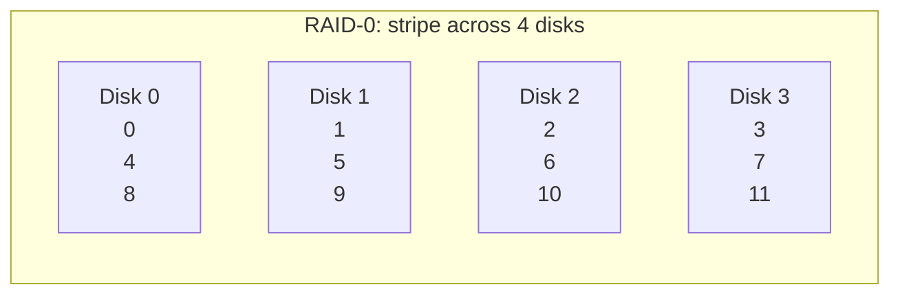
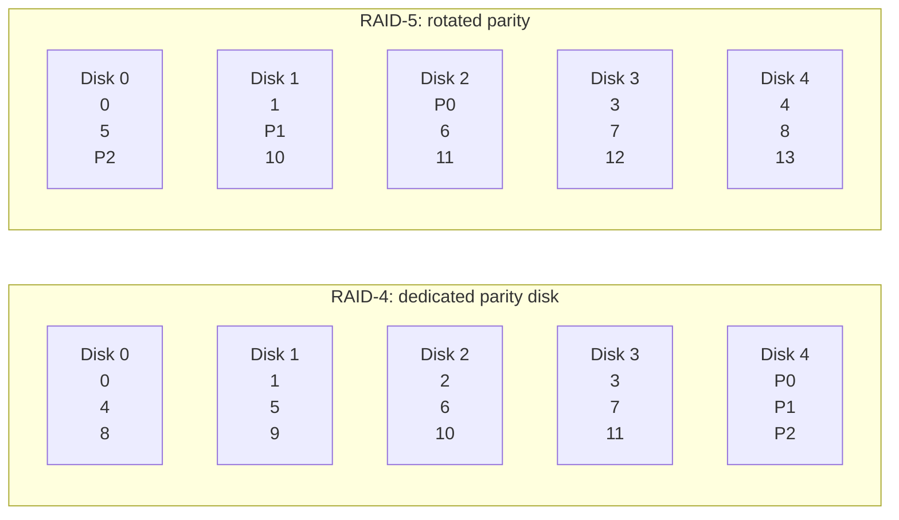

# RAID

**The crux:** a single disk is only so big, only so fast, and — when it dies — takes all of its data with it. You could buy one bigger, faster, more reliable disk, but that gets expensive fast and still leaves a single point of failure. **How can you combine many cheap, ordinary disks so that, from the outside, they look like one disk that is larger, faster, and survives a drive failure — without changing a single line of the software above?** RAID (Redundant Array of Inexpensive Disks) answers this: it puts N disks behind one controller that presents a single linear array of blocks, and internally spreads data (and redundancy) across the drives.

## The core idea

- **One logical disk, many physical disks.** A RAID exports the same interface as a plain disk: a linear array of blocks you can read and write. Internally a controller (firmware, DRAM, sometimes parity hardware) maps each logical block to one or more physical disks. The file system above is unchanged — this **transparency** is why RAID deployed so widely.
- **Three axes to buy on.** Adding disks can improve **capacity** (more blocks), **performance** (parallel I/O across spindles), and **reliability** (redundancy survives a failure). No single level maxes out all three — each level is a different point in that trade space.
- **The fault model is fail-stop.** The classic RAID model assumes a disk is either fully working or entirely, *detectably* dead. Redundancy is designed to survive that clean whole-disk loss. (Partial faults — a single bad block or silently wrong bytes — are a harder problem handled by checksums; see [Data Integrity](/docs/os/persistence/data-integrity).)
- **Redundancy costs capacity, and there are two flavors.**
  - **Mirroring** keeps whole copies — simple, fast, but you pay 50% of capacity.
  - **Parity** keeps a computed summary (an XOR) of a stripe — cheap in space (one extra disk out of N), but every small write costs extra I/O.
- **The levels, in one line each:**
  - **RAID-0 (striping)** — spread blocks across all disks. Best capacity and throughput, **zero** redundancy: lose one disk, lose everything.
  - **RAID-1 (mirroring)** — every block on two disks. Survives a disk loss; usable capacity halves.
  - **RAID-4 (dedicated parity)** — one disk holds parity for the stripe. Good capacity, but the parity disk is a bottleneck for small writes.
  - **RAID-5 (rotated parity)** — same capacity as RAID-4, but parity rotates across all disks, removing the bottleneck. This is the workhorse.
  - **RAID-6 (double parity)** — two independent parity blocks per stripe; survives **two** simultaneous disk failures.

## How it works

### Evaluating a level: capacity, reliability, throughput

For an array of `N` disks each holding `B` blocks, with a single-disk sequential rate `S` and random rate `R`:

- **Striping (RAID-0)** uses all capacity, $N \cdot B$ blocks, and drives all disks in parallel.
- **Mirroring (RAID-1, 2 copies)** halves usable capacity to $(N \cdot B)/2$.
- **Parity (RAID-4/5)** spends one disk's worth on redundancy, giving usable capacity

$$
C_{\text{parity}} = (N - 1) \cdot B
$$

Reliability is measured in **how many disk failures the layout tolerates**: RAID-0 tolerates 0, RAID-1/4/5 tolerate 1, RAID-6 tolerates 2.

### RAID-0: striping

Blocks are laid out round-robin across the disks. Blocks in the same row form a **stripe**.



- A large sequential read fans out to all N disks at once, so bandwidth approaches $N \cdot S$.
- Capacity is perfect ($N \cdot B$) and so is the *downside*: **any** single disk failure loses data, because no block is stored twice.

### RAID-1: mirroring

Each logical block is written to two disks. A read can be served from either copy; a write must go to both.

- **Survives one disk failure** (in fact more, if you are lucky and the two failed disks are not a mirror pair).
- Usable capacity is $(N \cdot B)/2$ — the price of keeping whole copies.
- Random reads are excellent (either mirror can serve, so throughput is $N \cdot R$); random writes must hit both disks, so throughput is $(N/2) \cdot R$.

### RAID-4 vs RAID-5: parity and where it lives

Parity replaces "keep a whole copy" with "keep an XOR of the stripe." One parity block `P` protects the data blocks in its row. In **RAID-4** parity lives on one dedicated disk; in **RAID-5** it rotates across all disks.



- Both give the same usable capacity, $(N-1) \cdot B$, and both tolerate exactly one disk failure.
- In **RAID-4**, every write must also update parity on the *same* disk, so all small writes serialize on that one drive — the **parity-disk bottleneck**.
- **RAID-5** rotates parity so the parity load spreads across all disks, letting independent small writes proceed in parallel. This is why RAID-5 all but replaced RAID-4.

### XOR parity: how a lost block is reconstructed

Parity is the bitwise XOR of the data blocks in a stripe:

$$
P = D_0 \oplus D_1 \oplus \dots \oplus D_{N-1}
$$

XOR has the property that every operand can be recovered from the others. If disk `k` is lost, XOR the parity with all the *surviving* data blocks and the missing block reappears:

$$
D_k = P \oplus \bigoplus_{i \neq k} D_i
$$

Because XOR is its own inverse ($x \oplus x = 0$) and commutative, this works no matter which disk was lost — you reconstruct with the *same* operation you used to build the parity.

```mermaid
flowchart LR
    D0["D0"] --> X["XOR<br/>&#8853;"]
    D1["D1 (lost)"] -.->|missing| X
    D2["D2"] --> X
    P["P"] --> X
    X --> R["D1 = D0 &#8853; D2 &#8853; P"]
```



### The small-write problem: read-modify-write

Overwriting a single data block is not just one write. The stripe's parity must stay correct, so a small write turns into a **read-modify-write**. There are two ways to recompute parity:

- **Additive parity** — read *all the other* data blocks in the stripe, XOR them with the new block, and write the result. Cost scales with N: bad for wide arrays.
- **Subtractive parity** — read only the *old data* block and the *old parity*, then:

$$
P_{\text{new}} = P_{\text{old}} \oplus D_{\text{old}} \oplus D_{\text{new}}
$$

This is 4 I/Os total regardless of N: **read** old data, **read** old parity, **write** new data, **write** new parity. The intuition: XOR out the old data's contribution to parity, XOR in the new data's.

```mermaid
sequenceDiagram
    participant C as Controller
    participant D as Data disk
    participant Pd as Parity disk
    C->>D: read old data
    C->>Pd: read old parity
    C->>C: P_new = P_old &#8853; D_old &#8853; D_new
    C->>D: write new data
    C->>Pd: write new parity
```



- The crossover: additive is cheaper only when N is small enough that reading "all the others" beats reading "old data + old parity." For anything but tiny arrays, subtractive wins.
- **Why RAID-4 chokes here:** both the data write and the parity write are needed, but in RAID-4 *every* parity write hits the same disk. Two unrelated small writes still collide on that one parity drive, so throughput is stuck at $R/2$ no matter how many disks you add. RAID-5 spreads the parity, so many small writes run in parallel — throughput becomes $N/4 \cdot R$ (the factor of 4 is the 4 I/Os every parity write still costs).

### RAID-6: surviving two failures

RAID-5 dies if a second disk fails during a rebuild — and rebuilds on large modern drives take hours. **RAID-6** keeps **two** independent parity blocks per stripe (one XOR parity plus a second computed with different coefficients, e.g. Reed–Solomon), so it tolerates **any two** simultaneous failures. The cost: usable capacity drops to $(N - 2) \cdot B$, and each small write updates two parity blocks (6 I/Os).

### Comparison table

`N` disks, `B` blocks each; `S` sequential rate, `R` random rate of one disk. "Tolerates" = disks that can fail without data loss.

| Level | Usable capacity | Tolerates | Seq read | Rand read | Rand write |
|---|---|---|---|---|---|
| RAID-0 | $N \cdot B$ | $0$ | $N \cdot S$ | $N \cdot R$ | $N \cdot R$ |
| RAID-1 | $(N \cdot B)/2$ | $1$ (up to $N/2$ if lucky) | $(N/2) \cdot S$ | $N \cdot R$ | $(N/2) \cdot R$ |
| RAID-4 | $(N-1) \cdot B$ | $1$ | $(N-1) \cdot S$ | $(N-1) \cdot R$ | $R/2$ |
| RAID-5 | $(N-1) \cdot B$ | $1$ | $(N-1) \cdot S$ | $N \cdot R$ | $(N/4) \cdot R$ |
| RAID-6 | $(N-2) \cdot B$ | $2$ | $(N-2) \cdot S$ | $N \cdot R$ | $(N/6) \cdot R$ |

## Must-know algorithms

### 1. XOR parity + reconstruction of a lost block

Compute parity across N data blocks, then reconstruct **any one** lost block from the survivors plus parity, verifying byte-for-byte recovery.

```c
#include <stdio.h>
#include <string.h>
#include <stdint.h>

#define BLK 8   /* bytes per block */
#define N   4   /* number of data disks */

/* Compute the parity block P = D_0 XOR D_1 XOR ... XOR D_{N-1}. */
static void compute_parity(const uint8_t data[N][BLK], uint8_t parity[BLK]) {
    for (int b = 0; b < BLK; b++) {
        uint8_t x = 0;
        for (int d = 0; d < N; d++) x ^= data[d][b];
        parity[b] = x;
    }
}

/* Reconstruct lost data disk `lost` from the surviving data disks + parity.
   A missing operand in the XOR chain is recovered by XORing everything else. */
static void reconstruct(const uint8_t data[N][BLK], const uint8_t parity[BLK],
                        int lost, uint8_t out[BLK]) {
    for (int b = 0; b < BLK; b++) {
        uint8_t x = parity[b];
        for (int d = 0; d < N; d++)
            if (d != lost) x ^= data[d][b];
        out[b] = x;
    }
}

int main(void) {
    uint8_t data[N][BLK] = {
        {0x00,0x11,0x22,0x33,0x44,0x55,0x66,0x77},
        {0xFF,0xEE,0xDD,0xCC,0xBB,0xAA,0x99,0x88},
        {0x01,0x02,0x03,0x04,0x05,0x06,0x07,0x08},
        {0xA5,0x5A,0x0F,0xF0,0x3C,0xC3,0x99,0x66},
    };
    uint8_t parity[BLK];
    compute_parity(data, parity);

    int all_ok = 1;
    for (int lost = 0; lost < N; lost++) {
        uint8_t recovered[BLK];
        reconstruct(data, parity, lost, recovered);
        int ok = (memcmp(recovered, data[lost], BLK) == 0);
        printf("lose disk %d -> byte-for-byte recovery: %s\n",
               lost, ok ? "OK" : "MISMATCH");
        all_ok &= ok;
    }
    printf("ALL RECOVERED: %s\n", all_ok ? "yes" : "no");
    return all_ok ? 0 : 1;
}
```

Output (compiled with `cc -std=c11`):

```text
lose disk 0 -> byte-for-byte recovery: OK
lose disk 1 -> byte-for-byte recovery: OK
lose disk 2 -> byte-for-byte recovery: OK
lose disk 3 -> byte-for-byte recovery: OK
ALL RECOVERED: yes
```

### 2. RAID-5 small write: subtractive parity update

Update one data block with a read-modify-write, computing the new parity subtractively, then verify it equals a full recompute across the whole stripe.

```c
#include <stdio.h>
#include <string.h>
#include <stdint.h>

#define BLK 8
#define N   4   /* data disks */

/* Full recompute of parity across all data disks (ground truth). */
static void compute_parity(const uint8_t data[N][BLK], uint8_t parity[BLK]) {
    for (int b = 0; b < BLK; b++) {
        uint8_t x = 0;
        for (int d = 0; d < N; d++) x ^= data[d][b];
        parity[b] = x;
    }
}

/* RAID-5 subtractive small write (read-modify-write):
   read old data + old parity, then
   new_parity = old_parity XOR old_data XOR new_data.
   Only two blocks are read and two written, regardless of N. */
static void small_write(uint8_t data[N][BLK], uint8_t parity[BLK],
                        int target, const uint8_t new_block[BLK]) {
    uint8_t old_data[BLK], old_parity[BLK];
    memcpy(old_data,   data[target], BLK);   /* read old data  */
    memcpy(old_parity, parity,       BLK);   /* read old parity */
    for (int b = 0; b < BLK; b++)
        parity[b] = old_parity[b] ^ old_data[b] ^ new_block[b]; /* compute */
    memcpy(data[target], new_block, BLK);    /* write new data   */
    /* parity already written above (write new parity) */
}

int main(void) {
    uint8_t data[N][BLK] = {
        {0x00,0x11,0x22,0x33,0x44,0x55,0x66,0x77},
        {0xFF,0xEE,0xDD,0xCC,0xBB,0xAA,0x99,0x88},
        {0x01,0x02,0x03,0x04,0x05,0x06,0x07,0x08},
        {0xA5,0x5A,0x0F,0xF0,0x3C,0xC3,0x99,0x66},
    };
    uint8_t parity[BLK];
    compute_parity(data, parity);

    uint8_t new_block[BLK] = {0xDE,0xAD,0xBE,0xEF,0x12,0x34,0x56,0x78};
    small_write(data, parity, 2, new_block);  /* overwrite block on disk 2 */

    uint8_t expected[BLK];
    compute_parity(data, expected);           /* full recompute after write */
    int ok = (memcmp(parity, expected, BLK) == 0);
    printf("subtractive parity == full recompute: %s\n", ok ? "OK" : "MISMATCH");
    return ok ? 0 : 1;
}
```

Output:

```text
subtractive parity == full recompute: OK
```

The subtractive update touched only the old data, old parity, and new data — never the other N−2 blocks — yet lands on exactly the parity a full recompute produces. That is the whole efficiency argument for RAID-5 small writes.

## Interview questions

**Q1. What does RAID actually buy you?** Three things from many cheap disks behind one logical disk: more **capacity**, more **performance** (parallel I/O across spindles), and **reliability** (redundancy tolerates a disk failure). It does this **transparently** — the file system sees one ordinary disk. The trade-off is that no single level maximizes all three; you pick a point in the capacity/performance/reliability space.

**Q2. Compare RAID-0, 1, 5, and 6.** RAID-0 (striping): full capacity $N \cdot B$, best throughput, **zero** fault tolerance. RAID-1 (mirroring): half capacity, tolerates one failure, excellent random reads, simple. RAID-5 (rotated parity): capacity $(N-1) \cdot B$, tolerates one failure, small writes cost 4 I/Os. RAID-6 (double parity): capacity $(N-2) \cdot B$, tolerates **two** failures, small writes cost 6 I/Os. Rough rule: RAID-0 for scratch/speed, RAID-1 for simplicity and read-heavy loads, RAID-5/6 for space-efficient reliability with 6 preferred on large drives.

**Q3. How does XOR parity reconstruct a lost block?** Parity is $P = D_0 \oplus D_1 \oplus \dots \oplus D_{N-1}$. XOR is commutative and self-inverse ($x \oplus x = 0$), so any operand equals the XOR of all the others. To recover lost disk `k`: $D_k = P \oplus \bigoplus_{i \neq k} D_i$ — XOR the parity with every surviving data block. You rebuild with the same operation that built the parity.

**Q4. Explain the small-write / read-modify-write problem.** Overwriting one data block would leave the stripe's parity stale, so parity must be updated too. The efficient (subtractive) way reads the **old data** and **old parity**, computes $P_{\text{new}} = P_{\text{old}} \oplus D_{\text{old}} \oplus D_{\text{new}}$, then writes **new data** and **new parity** — 4 I/Os per logical write, independent of N. A one-block logical write becomes two reads plus two writes; that 4× I/O amplification is the cost of parity RAID.

**Q5. Additive vs subtractive parity — when do you use each?** Additive reads *all the other* data blocks and XORs them with the new block; its cost grows with N. Subtractive reads only old data + old parity (2 reads) and always does 4 I/Os. For wide arrays subtractive wins; additive is only cheaper when N is small enough that reading "all the others" is fewer I/Os than reading "old data + old parity + writing both."

**Q6. Why is RAID-4's parity disk a bottleneck, and how does RAID-5 fix it?** In RAID-4 all parity lives on one dedicated disk, so *every* write's parity update hits that same drive. Two unrelated small writes to different data disks still serialize on the parity disk, capping random-write throughput at $R/2$ regardless of array size. RAID-5 **rotates** parity across all disks, so parity updates spread out and independent small writes run in parallel — random-write throughput rises to $N/4 \cdot R$.

**Q7. RAID-5 vs RAID-6 — what and why?** RAID-5 keeps one parity block and tolerates one failure. RAID-6 keeps **two** independent parity blocks (a second one computed with different coefficients, e.g. Reed–Solomon) and tolerates **two** simultaneous failures. RAID-6 exists because on multi-terabyte drives a RAID-5 rebuild takes many hours, and a second drive failing during that window (or a latent unreadable block surfacing) causes total loss. RAID-6 costs one more disk of capacity and 6 I/Os per small write.

**Q8. Why is RAID not a backup?** RAID protects against **hardware disk failure**, not against the things that actually destroy data: accidental deletion, a buggy or malicious app overwriting files, ransomware, filesystem corruption, or a fire that takes the whole array. RAID faithfully mirrors/parities whatever it is told to write — including a `rm -rf`. A backup is a separate, point-in-time, ideally off-site copy you can roll back to. RAID gives availability; backups give recoverability. You need both.

**Q9. What failure model does RAID assume, and where does it break?** The classic model is **fail-stop**: a disk is either fully working or entirely, detectably dead. RAID redundancy is built for that clean case. It does **not**, by itself, catch partial faults — a single latent unreadable sector during a rebuild, or *silent* corruption where the drive returns wrong bytes with no error. Those need block checksums (see [Data Integrity](/docs/os/persistence/data-integrity)); they are also why the RAID **write hole** (a crash between the data write and the parity write) is dangerous.

## Coding problems

The heart of RAID parity is the XOR trick. These interview problems drill exactly that reasoning, and the last one builds the RAID primitive directly.

- 🎯 **[LeetCode 136 — Single Number](https://leetcode.com/problems/single-number/)** — *tests:* XOR all elements; pairs cancel ($x \oplus x = 0$) and the unique survivor remains. This **is** the parity trick: the lone element is exactly what parity reconstruction recovers when everything else cancels.
- 🎯 **[LeetCode 268 — Missing Number](https://leetcode.com/problems/missing-number/)** — *tests:* XOR the full index range with the array; the present values cancel and the missing one falls out — the same "recover the absent operand from the survivors" move as reconstructing a lost data block from parity.
- 🎯 **[LeetCode 1720 — Decode XORed Array](https://leetcode.com/problems/decode-xored-array/)** — *tests:* using XOR's self-inverse property to undo an encoding, `arr[i] = encoded[i-1] XOR arr[i-1]`. Directly mirrors subtractive parity, where you XOR out an old contribution to recover the value you want.
- 🏗 **Implement XOR parity + block reconstruction (OS-classic).** Given N data blocks, compute the parity block, then given any one block marked lost, reconstruct it from the survivors and parity. Extend it with a RAID-5 subtractive small write ($P_{\text{new}} = P_{\text{old}} \oplus D_{\text{old}} \oplus D_{\text{new}}$) and verify against a full recompute. Reference implementations are the two compile-tested programs in **Must-know algorithms** above.

## Key takeaways

- RAID turns many cheap disks into **one** logical disk that is bigger, faster, and fault-tolerant — transparently, so software above is unchanged.
- Every level is a trade among **capacity, performance, and reliability**; none maxes all three.
- **Striping (0)** = speed and capacity, no safety. **Mirroring (1)** = simple, survives a loss, half capacity. **Parity (4/5)** = space-efficient redundancy at $(N-1) \cdot B$; **RAID-6** doubles parity to survive two failures.
- **XOR parity** rebuilds a lost block by XORing the survivors with the parity — the same operation that built it.
- The **small-write problem**: a one-block write needs a read-modify-write (4 I/Os) to keep parity correct; subtractive parity ($P_{\text{new}} = P_{\text{old}} \oplus D_{\text{old}} \oplus D_{\text{new}}$) makes it independent of N.
- RAID-4's dedicated parity disk **serializes** small writes; RAID-5 **rotates** parity to restore parallelism.
- **RAID is availability, not backup.** It does not save you from deletion, corruption, ransomware, or disaster — keep separate backups.

## Source(s) and further reading

- OSTEP — [Redundant Arrays of Inexpensive Disks (RAIDs)](https://pages.cs.wisc.edu/~remzi/OSTEP/file-raid.pdf) (free PDF; the backbone for this page).
- Wikipedia — [Standard RAID levels](https://en.wikipedia.org/wiki/Standard_RAID_levels) (RAID 0/1/4/5/6 layouts and formulas).
- Wikipedia — [Parity bit](https://en.wikipedia.org/wiki/Parity_bit) (XOR parity fundamentals).
- Wikipedia — [Non-standard RAID levels](https://en.wikipedia.org/wiki/Non-standard_RAID_levels) (RAID-10, RAID-Z, and other hybrids).
- Related pages: [Hard Disk Drives & Disk Scheduling](/docs/os/persistence/hard-disk-drives) and [Data Integrity & Protection](/docs/os/persistence/data-integrity).
