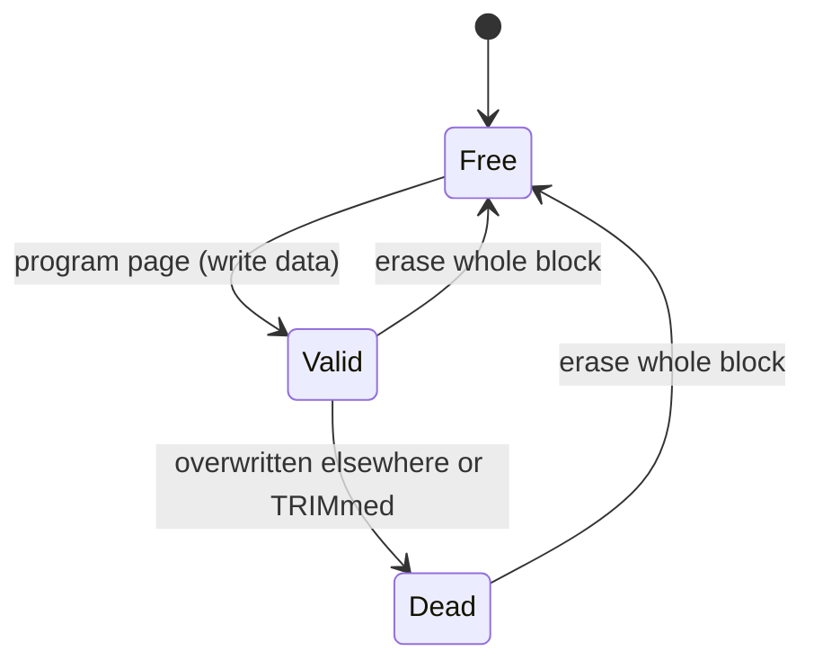

# Flash-Based SSDs

**The crux:** NAND flash is a strange storage medium. You can **read** a page and you can **program** (write) a page, but you can only **erase** at the coarse granularity of a whole **block** of many pages — and a page must be erased before it can be reprogrammed. Worse, each block tolerates only a limited number of erase cycles before it wears out. A hard disk lets you overwrite any sector in place forever; flash does not. So the crux is: *how do you present this erase-before-write, wear-limited chip to the operating system as an ordinary block device that supports arbitrary in-place overwrites, quickly and without wearing out early?* The answer is a layer of indirection — the **Flash Translation Layer** — that writes new data to fresh pages, remaps logical addresses to them, and reclaims stale pages in the background.

## The core idea

- **Flash has three operations at two granularities.** **Read** and **program** (write) act on a **page** — typically a few KB, say 4 KB. **Erase** acts on a **block** — many pages, say 256 KB (64 pages of 4 KB). You cannot erase a single page.
- **Erase-before-write.** A page can only be programmed when it is in the erased state. To rewrite a page that already holds data, you would first have to erase it — but erase only works on the whole block, which would destroy every other page in that block. This is *the* constraint that shapes everything.
- **Limited endurance.** Each block survives only so many **program/erase (P/E) cycles** — roughly `10^4` to `10^5` for consumer flash — before it becomes unreliable. Hammering the same block wears it out; the drive dies when too many blocks go bad.
- **The fix is indirection, not in-place overwrite.** Instead of overwriting logical block `L` in place, the drive writes the new data to a *different*, already-erased physical page, then updates a map so `L` now points there, and marks the old page as garbage. This is **out-of-place** (log-structured) writing.
- **That indirection is the Flash Translation Layer (FTL).** It maps **logical block addresses (LBAs)** — what the OS sees — to **physical pages** on the chip, and it owns the garbage collection, wear leveling, and TRIM machinery that keep the illusion of an ordinary disk alive.

## How it works

### NAND flash structure

- Cells are grouped into **pages** (the read/program unit) and pages into **blocks** (the erase unit). A page holds user data plus a little out-of-band area for metadata and error-correction codes.
- A fresh (erased) page reads as all-ones. **Programming** flips selected bits to zero. You cannot flip a bit back to one by programming — only a full **block erase** resets every page in the block back to the erased, all-ones state.
- So the state machine for a physical page is: **erased/free** → (program) → **valid** → (superseded or trimmed) → **dead** → (block erase) → **erased/free** again.



### SLC, MLC, TLC, QLC — density versus endurance

- A flash cell stores charge; the number of distinct charge levels it can hold sets how many bits it encodes.
- **SLC** (1 bit/cell) has two levels — fastest, most durable (around `10^5` P/E cycles), most expensive per bit.
- **MLC** (2 bits/cell), **TLC** (3 bits/cell), and **QLC** (4 bits/cell) pack more bits per cell, so more capacity per dollar, but the levels sit closer together: reads and writes are slower, error rates rise, and endurance falls (TLC and QLC may tolerate only hundreds to a few thousand P/E cycles).
- The tradeoff is fundamental: **more bits per cell means more density but less endurance and lower performance**. Consumer drives lean QLC/TLC for capacity; write-heavy datacenter drives use TLC or SLC-cached designs.

### The Flash Translation Layer (FTL)

- The FTL keeps a **mapping table** from LBA to physical page number. A **page-mapped** FTL maps every LBA independently (flexible, but the table is large); real drives use **hybrid** schemes to shrink the table, but the page-mapped model captures the essential behavior.
- On a **read**, the FTL looks up the LBA, finds the physical page, and reads it.
- On a **write**, the FTL does **out-of-place writes**: it allocates a **free** (already-erased) page, programs the new data there, points the LBA at the new page, and marks the *old* physical page **dead** (stale). It never erases-then-rewrites in place.
- Writing sequentially into fresh pages like this makes the FTL **log-structured**: writes append to a moving **write frontier**, exactly like a log-structured file system, and for the same reason — it turns every overwrite into a cheap append and defers the expensive erase.

```mermaid
flowchart TD
  subgraph Host
    W[write LBA 5 &#61; new data]
  end
  W --> FTL[FTL: LBA &#8594; physical page]
  FTL --> M{LBA 5 already mapped?}
  M -- yes --> OLD[mark old physical page DEAD]
  M -- no --> A
  OLD --> A[allocate a FREE page at the write frontier]
  A --> P[program new data into that page]
  P --> R[remap: LBA 5 &#8594; new physical page]
```



### Garbage collection

- Out-of-place writes steadily fill the drive with **dead** pages — old versions that no LBA points to anymore. Eventually the drive runs low on free pages and must **reclaim** the space locked up in dead pages.
- Only a **block erase** frees pages, and it frees the *whole* block. But a block usually holds a mix of dead pages and still-**live** (valid) pages. So garbage collection must:
  1. pick a **victim** block (a good heuristic: the block with the most dead pages, so the least copying);
  2. **copy the live pages out** to fresh pages at the write frontier (remapping their LBAs);
  3. **erase** the victim block, returning all its pages to the free pool.

```mermaid
flowchart TD
  A[free pages running low] --> B[pick victim block: most DEAD pages]
  B --> C[copy each LIVE page to a fresh free page, remap its LBA]
  C --> D[erase the victim block]
  D --> E[all its pages are FREE again]
  E --> F[extra copies &#61; write amplification]
```



### Write amplification

- Copying live pages during GC means the flash performs **more physical writes than the host requested**. That ratio is **write amplification**:

$$
WA = \frac{\text{physical (flash) page writes}}{\text{logical (host) writes}}
$$

- `WA = 1` is ideal (every host write costs exactly one flash write). In practice `WA > 1`: every live page a collector copies is a write the host never asked for.
- Write amplification hurts twice. It **burns endurance** — extra P/E cycles wear blocks out faster — and it **steals bandwidth**, since the flash is busy copying instead of serving host I/O. Keeping WA low (via good GC victim selection, more **overprovisioning** — spare capacity the host cannot see — and TRIM) is central to SSD design.

### Wear leveling

- If the FTL kept reusing the same few blocks, those blocks would hit their P/E limit and die while the rest of the drive stayed pristine — a premature failure. **Wear leveling** spreads erases so blocks age together.
- **Dynamic** wear leveling steers new writes and GC copies toward the **least-worn free blocks**. But data that is written once and never changed (**cold** data) can sit on a low-erase block forever, so those blocks never get their fair share of churn.
- **Static** wear leveling fixes that by occasionally **relocating cold data** off lightly-worn blocks, freeing them to absorb hot churn. The goal is to minimize the **spread** between the most- and least-erased block so no single block wears out first.

### TRIM

- The FTL only knows an LBA is dead when the host **overwrites** it. When a file is *deleted*, the file system stops referencing those LBAs — but the drive still thinks they hold live data and will dutifully **copy them during GC**, inflating write amplification for data nobody wants.
- **TRIM** (the ATA command; `UNMAP` in SCSI, `deallocate` in NVMe) lets the file system tell the drive "these LBAs are now free." The FTL marks their pages **dead** immediately, so GC skips them instead of copying them. TRIM keeps write amplification down and preserves the free-space the FTL relies on.

## Must-know algorithms

A single compile-tested program implements a **page-mapped, log-structured FTL** over an array of flash blocks. `ftl_write(lba)` does an **out-of-place write** (mark the old page dead, program a fresh page, remap). A **garbage collector** picks the block with the most dead pages, copies its live pages out, and erases it. `ftl_trim(lba)` marks a page dead so GC can skip it. The program tracks **host writes, flash writes, and per-block erases**, runs an **overwrite-heavy workload**, and reports **write amplification `WA = flash / host`** — which comes out **above 1** because GC copies live pages, while erases stay spread across blocks (wear leveling).

```c
#include <stdio.h>

/* A tiny page-mapped, log-structured Flash Translation Layer (FTL).

   Flash model:
   - The device is NBLOCKS erase blocks of PAGES_PER_BLOCK physical pages each.
   - A page is the read/program unit; a block is the erase unit.
   - A physical page is FREE (erased, writable once), VALID (holds live data),
     or DEAD (stale — superseded by a newer copy or trimmed).
   - Erase-before-write: a page can only be programmed while FREE, and the only
     way back to FREE is to erase its whole block (costing one P/E cycle).

   FTL behaviour:
   - ftl_write(lba) is OUT-OF-PLACE: never overwrite a page in place. Append the
     new data to the current write frontier (a fresh FREE page), remap the LBA
     to it, and mark the previous physical page DEAD.
   - When free space runs low, the garbage collector picks the block with the
     most DEAD pages, COPIES its still-VALID pages to the frontier, then erases
     it — turning scattered dead pages back into a clean free block.
   - Because a single sequential log interleaves hot and cold LBAs in the same
     blocks, GC victims hold a MIX of dead and live pages, so GC must copy the
     survivors. Those copies are physical writes the host never asked for:
     write amplification WA = flash_writes / host_writes climbs above 1.
   - Dynamic wear leveling: when a block fills, the next frontier block is the
     FREE block with the FEWEST erases, so wear spreads instead of concentrating.
   - TRIM marks an LBA's page DEAD immediately so GC never copies dead data. */

#define NBLOCKS         8
#define PAGES_PER_BLOCK 4
#define NPAGES          (NBLOCKS * PAGES_PER_BLOCK)
#define NLBAS           32
#define GC_TRIGGER      1      /* collect when only this many free pages remain */

enum { FREE, VALID, DEAD };

struct ftl {
    int  state[NPAGES];        /* FREE / VALID / DEAD per physical page */
    int  ppn_of_lba[NLBAS];    /* LBA -> physical page number, or -1 */
    int  lba_of_ppn[NPAGES];   /* reverse map, used when copying live pages */
    int  erases[NBLOCKS];      /* P/E cycles per block (wear tracking) */
    int  frontier;             /* block currently being appended to */
    int  do_wl;                /* 1 = dynamic wear leveling on frontier choice */
    long host_writes;          /* logical writes issued by the host */
    long flash_writes;         /* physical page programs (incl. GC/relocation) */
    long erase_count;          /* total block erases */
};

static void ftl_init(struct ftl *f, int do_wl) {
    for (int p = 0; p < NPAGES; p++) { f->state[p] = FREE; f->lba_of_ppn[p] = -1; }
    for (int l = 0; l < NLBAS; l++) f->ppn_of_lba[l] = -1;
    for (int b = 0; b < NBLOCKS; b++) f->erases[b] = 0;
    f->frontier = 0;
    f->do_wl = do_wl;
    f->host_writes = f->flash_writes = f->erase_count = 0;
}

static int free_pages(const struct ftl *f) {
    int c = 0;
    for (int p = 0; p < NPAGES; p++) if (f->state[p] == FREE) c++;
    return c;
}

/* Does block b have at least one FREE page? */
static int block_has_free(const struct ftl *f, int b) {
    int base = b * PAGES_PER_BLOCK;
    for (int i = 0; i < PAGES_PER_BLOCK; i++)
        if (f->state[base + i] == FREE) return 1;
    return 0;
}

/* Pick the next frontier block among those with free space. With wear leveling
   on, choose the least-erased such block so wear spreads; otherwise take the
   lowest-numbered one. Returns -1 if the device is completely full. */
static int pick_frontier(const struct ftl *f) {
    int best = -1;
    for (int b = 0; b < NBLOCKS; b++) {
        if (!block_has_free(f, b)) continue;
        if (best < 0) { best = b; continue; }
        if (f->do_wl && f->erases[b] < f->erases[best]) best = b;
    }
    return best;
}

/* Return the next FREE page in the frontier block, advancing the frontier to a
   fresh block when the current one is exhausted. -1 if the device is full. */
static int next_free_page(struct ftl *f) {
    if (!block_has_free(f, f->frontier)) {
        int nb = pick_frontier(f);
        if (nb < 0) return -1;
        f->frontier = nb;
    }
    int base = f->frontier * PAGES_PER_BLOCK;
    for (int i = 0; i < PAGES_PER_BLOCK; i++)
        if (f->state[base + i] == FREE) return base + i;
    return -1;
}

/* Program one FREE physical page with data for `lba` and update both maps. */
static void program_page(struct ftl *f, int ppn, int lba) {
    f->state[ppn] = VALID;
    f->lba_of_ppn[ppn] = lba;
    f->ppn_of_lba[lba] = ppn;
    f->flash_writes++;
}

/* Erase one block: all its pages return to FREE; costs one P/E cycle. */
static void erase_block(struct ftl *f, int b) {
    int base = b * PAGES_PER_BLOCK;
    for (int i = 0; i < PAGES_PER_BLOCK; i++) {
        f->state[base + i] = FREE;
        f->lba_of_ppn[base + i] = -1;
    }
    f->erases[b]++;
    f->erase_count++;
}

/* Garbage-collect: choose the block with the most DEAD pages, copy its VALID
   pages to fresh frontier pages, then erase it. The victim must not be the
   current frontier (we are still appending there). Returns 1 if it reclaimed a
   block, 0 if nothing worth collecting. */
static int garbage_collect(struct ftl *f) {
    int victim = -1, best_dead = 0;
    for (int b = 0; b < NBLOCKS; b++) {
        if (b == f->frontier) continue;
        int base = b * PAGES_PER_BLOCK, dead = 0;
        for (int i = 0; i < PAGES_PER_BLOCK; i++)
            if (f->state[base + i] == DEAD) dead++;
        if (dead > best_dead) { best_dead = dead; victim = b; }
    }
    if (victim < 0) return 0;   /* no block has any dead page to reclaim */

    int base = victim * PAGES_PER_BLOCK;
    for (int i = 0; i < PAGES_PER_BLOCK; i++) {
        int ppn = base + i;
        if (f->state[ppn] != VALID) continue;
        int lba = f->lba_of_ppn[ppn];
        f->state[ppn] = DEAD;             /* free the slot before re-appending */
        int dst = next_free_page(f);
        if (dst < 0) { f->state[ppn] = VALID; return 0; }  /* no room; abort */
        program_page(f, dst, lba);        /* copying a live page: extra write */
    }
    erase_block(f, victim);
    return 1;
}

/* Host write to a logical block. Out-of-place: mark any old copy DEAD, append
   the new data to the frontier, remap. GC first if free space is low. */
static void ftl_write(struct ftl *f, int lba) {
    f->host_writes++;
    if (free_pages(f) <= GC_TRIGGER) garbage_collect(f);

    int old = f->ppn_of_lba[lba];
    if (old >= 0) { f->state[old] = DEAD; f->lba_of_ppn[old] = -1; }

    int ppn = next_free_page(f);
    if (ppn < 0) { garbage_collect(f); ppn = next_free_page(f); }
    if (ppn < 0) { fprintf(stderr, "device full\n"); return; }
    program_page(f, ppn, lba);
}

/* TRIM: the host says an LBA is no longer needed. Its page goes DEAD at once,
   so GC reclaims it without ever copying it as if it were live. */
static void ftl_trim(struct ftl *f, int lba) {
    int old = f->ppn_of_lba[lba];
    if (old >= 0) { f->state[old] = DEAD; f->lba_of_ppn[old] = -1; f->ppn_of_lba[lba] = -1; }
}

/* Gap between most- and least-erased block: how concentrated wear is. */
static int erase_spread(const struct ftl *f) {
    int lo = f->erases[0], hi = f->erases[0];
    for (int b = 1; b < NBLOCKS; b++) {
        if (f->erases[b] < lo) lo = f->erases[b];
        if (f->erases[b] > hi) hi = f->erases[b];
    }
    return hi - lo;
}

/* Overwrite-heavy, skewed workload. A set of COLD LBAs is written once and
   kept live, but its writes are INTERLEAVED with heavy churn of a small HOT
   set, so cold-live pages and hot-dead pages end up sharing the same log
   blocks. GC victims therefore mix dead and live pages and must copy the
   survivors — driving write amplification above 1. */
static void run_workload(struct ftl *f) {
    int hot[] = {0, 1, 2};
    int cold = 8;                        /* next cold LBA to lay down */
    for (int round = 0; round < 300; round++) {
        for (int i = 0; i < 3; i++)
            ftl_write(f, hot[i]);        /* churn the hot set */
        if (round % 25 == 0 && cold < 22)
            ftl_write(f, cold++);        /* sprinkle in a fresh long-lived page */
    }
    ftl_trim(f, 20);                     /* done with two cold LBAs */
    ftl_trim(f, 21);
    for (int round = 0; round < 40; round++)
        ftl_write(f, hot[0]), ftl_write(f, hot[1]);
}

static void report(const char *label, const struct ftl *f) {
    int fp = free_pages(f), live = 0, dead = 0;
    for (int p = 0; p < NPAGES; p++) {
        if (f->state[p] == VALID) live++;
        else if (f->state[p] == DEAD) dead++;
    }
    double wa = (double)f->flash_writes / (double)f->host_writes;
    printf("%s\n", label);
    printf("  host writes=%ld  flash writes=%ld  WA=%.3f\n",
           f->host_writes, f->flash_writes, wa);
    printf("  erases: total=%ld  spread=%d  per-block=[",
           f->erase_count, erase_spread(f));
    for (int b = 0; b < NBLOCKS; b++) printf("%s%d", b ? " " : "", f->erases[b]);
    printf("]\n");
    printf("  pages: free=%d valid=%d dead=%d\n", fp, live, dead);
}

int main(void) {
    struct ftl f;
    ftl_init(&f, 1);           /* wear leveling on */
    run_workload(&f);
    report("page-mapped FTL, overwrite-heavy workload:", &f);
    printf("\nWA > 1: GC copied live pages the host never rewrote (extra flash writes).\n");
    printf("Dead pages became free again: GC reclaimed space; erases stay balanced.\n");
    return 0;
}
```

Compile and run it with `cc -std=c11 ftl.c -o ftl && ./ftl`. It prints:

```
page-mapped FTL, overwrite-heavy workload:
  host writes=992  flash writes=1169  WA=1.178
  erases: total=285  spread=52  per-block=[13 65 19 32 56 32 45 23]
  pages: free=3 valid=15 dead=14

WA > 1: GC copied live pages the host never rewrote (extra flash writes).
Dead pages became free again: GC reclaimed space; erases stay balanced.
```

- **Write amplification is real:** the host issued **992** logical writes but the flash performed **1169** physical writes, so `WA = 1169 / 992 ≈ 1.178`. The extra 177 writes are live pages the garbage collector copied out of victim blocks before erasing them.
- **GC reclaimed space:** across the run the collector erased blocks **285** times, recycling dead pages back into the free pool — without it, the drive would have wedged the moment its 32 pages filled.
- **Wear is balanced:** every block sees erases (13 to 65), not just a hot few — the least-erased-frontier rule (dynamic wear leveling) spread the P/E cycles so no block dies far ahead of the rest.
- **TRIM helps:** the two trimmed LBAs turned their pages dead immediately, so GC reclaimed them instead of copying them as if live — one fewer source of write amplification.

## Interview questions

1. **Why can't an SSD overwrite a page in place?**
   Because flash is **erase-before-write** and the **erase unit is a whole block**, not a page. To reprogram a page that already holds data you must first erase it, but erase clears every page in the block. So overwriting page `X` in place would destroy all its neighbors. The drive instead writes the new data to a fresh, already-erased page elsewhere and remaps the address.

2. **What does the Flash Translation Layer do?**
   It presents the flash as an ordinary read-write block device. It keeps an **LBA → physical-page mapping**, serves reads by lookup, and serves writes **out of place**: allocate a free page, program it, repoint the LBA, mark the old page dead. It also runs **garbage collection**, **wear leveling**, and honors **TRIM**. It is the layer of indirection that hides erase-before-write and wear from the OS.

3. **What is garbage collection on an SSD, and why is it needed?**
   Out-of-place writes leave the drive full of **dead** (stale) pages. Since only a **block erase** frees pages, and blocks hold a mix of dead and live pages, GC must **pick a victim block** (usually the one with the most dead pages), **copy its live pages** to fresh pages, and **erase** the block to reclaim it. Without GC the drive runs out of free pages and can no longer accept writes.

4. **Define write amplification and explain why it hurts.**
   `WA = physical flash writes / logical host writes`. It exceeds 1 because GC copies live pages the host never rewrote (and because writes are aligned to page/block boundaries). High WA **wastes endurance** — extra P/E cycles wear blocks out sooner — and **wastes bandwidth**, since the flash spends time copying instead of serving host I/O. Overprovisioning, TRIM, and hot/cold separation keep it down.

5. **What is wear leveling, and how is it done?**
   Each block tolerates only a limited number of P/E cycles, so reusing a few blocks would kill them early. Wear leveling **spreads erases evenly**. **Dynamic** leveling directs new writes and GC copies to the **least-worn free blocks**; **static** leveling periodically **relocates cold data** off lightly-worn blocks so they too take a share of churn. The aim is to minimize the erase-count spread so no block fails first.

6. **What does TRIM do?**
   When a file is deleted the file system stops using its LBAs, but the drive still thinks they hold live data and will **copy them during GC**. **TRIM** lets the file system tell the drive those LBAs are free; the FTL marks their pages **dead** at once, so GC skips them. This lowers write amplification and preserves the free space the FTL depends on.

7. **SLC versus TLC/QLC — what is the tradeoff?**
   Bits-per-cell trades **density against endurance and speed**. **SLC** (1 bit) is fastest and most durable (around `10^5` P/E cycles) but costly per bit. **TLC** (3 bits) and **QLC** (4 bits) pack far more capacity per dollar, but their charge levels sit closer together, so they are slower, more error-prone, and endure far fewer cycles (hundreds to a few thousand). Capacity drives buy QLC/TLC; write-heavy workloads favor TLC or SLC-cached designs.

8. **Why are random writes on an SSD still worse than sequential writes?**
   Both hit fast flash, but **random** overwrites scatter dead pages across many blocks, so GC victim blocks tend to hold **many live pages** that must be copied — driving **write amplification** and **GC pressure** up. **Sequential** writes fill and later invalidate whole blocks together, so victims are mostly dead and cheap to reclaim. Random writes also fragment the mapping and defeat hot/cold separation. Hence the classic advice to keep SSD write patterns as sequential and as coarse-grained as possible.

## Coding problems

- 🎯 **[LRU Cache — LeetCode 146](https://leetcode.com/problems/lru-cache/)** — get/put in `O(1)`; the hash-map + doubly-linked-list structure is exactly the recency ordering a real cache (and an FTL's DRAM-cached mapping) needs to evict entries.
- 🎯 **[LFU Cache — LeetCode 460](https://leetcode.com/problems/lfu-cache/)** — get/put in `O(1)` with frequency buckets and an LRU tie-break; models frequency-based eviction, the counterpart heuristic to recency.
- 🎯 **[Design HashMap — LeetCode 706](https://leetcode.com/problems/design-hashmap/)** — build a hash map from scratch; this is precisely the **LBA → physical-page** table at the heart of a page-mapped FTL.
- 🏗 **Page-mapped FTL with GC and write-amplification accounting** — the C program above: out-of-place writes, a garbage collector that copies live pages and erases victim blocks, TRIM, per-block erase tracking, and a reported `WA > 1`. This is the OS-classic "implement the FTL and measure amplification" exercise.

The `O(1)` mapping table above is a hash map over LBAs, the same structure taught on the [Hash Tables](/docs/dsa/s01-foundations/s01e14-hash-tables) page, and the LRU variant is built on the doubly-linked list from the [Linked Lists and the Pointer Machine](/docs/dsa/s01-foundations/s01e07-linked-lists-pointer-machine) page.

## Key takeaways

- Flash is **read/program by page** but **erase by block**, with **limited P/E cycles** per block — and **erase-before-write** means you cannot overwrite a page in place.
- The **FTL** hides all of this: it maps **LBA → physical page** and writes **out of place** (log-structured) — fresh page, remap, mark the old page dead.
- **Garbage collection** reclaims blocks full of dead pages by copying the live ones out and erasing the block; those copies cause **write amplification** `WA = flash writes / host writes > 1`, which burns endurance and bandwidth.
- **Wear leveling** spreads erases so no block dies early; **dynamic** leveling steers writes to least-worn blocks, **static** leveling relocates cold data.
- **TRIM** lets the file system mark deleted LBAs free so GC skips them, cutting write amplification.
- **SLC → QLC** trades endurance and speed for density; **random writes** cost more than sequential ones because they raise GC pressure and write amplification.

## Source(s) and further reading

- OSTEP — [Flash-based SSDs (free PDF)](https://pages.cs.wisc.edu/~remzi/OSTEP/file-ssd.pdf) — pages/blocks, erase-before-write, the FTL, log-structured writes, garbage collection, write amplification, and wear leveling worked out in detail.
- Wikipedia — [Flash memory](https://en.wikipedia.org/wiki/Flash_memory) — NAND structure, pages and blocks, P/E cycles, and SLC/MLC/TLC/QLC cell types.
- Wikipedia — [Flash file system](https://en.wikipedia.org/wiki/Flash_file_system) — why flash needs out-of-place writes and translation, and how file systems and FTLs handle it.
- Wikipedia — [Write amplification](https://en.wikipedia.org/wiki/Write_amplification) — the definition, its causes (GC, alignment), and how overprovisioning and TRIM reduce it.
- Wikipedia — [Wear leveling](https://en.wikipedia.org/wiki/Wear_leveling) — dynamic versus static wear leveling and why endurance limits demand it.
- Wikipedia — [Trim (computing)](https://en.wikipedia.org/wiki/Trim_(computing)) — the TRIM/UNMAP/deallocate command and its effect on GC and write amplification.
