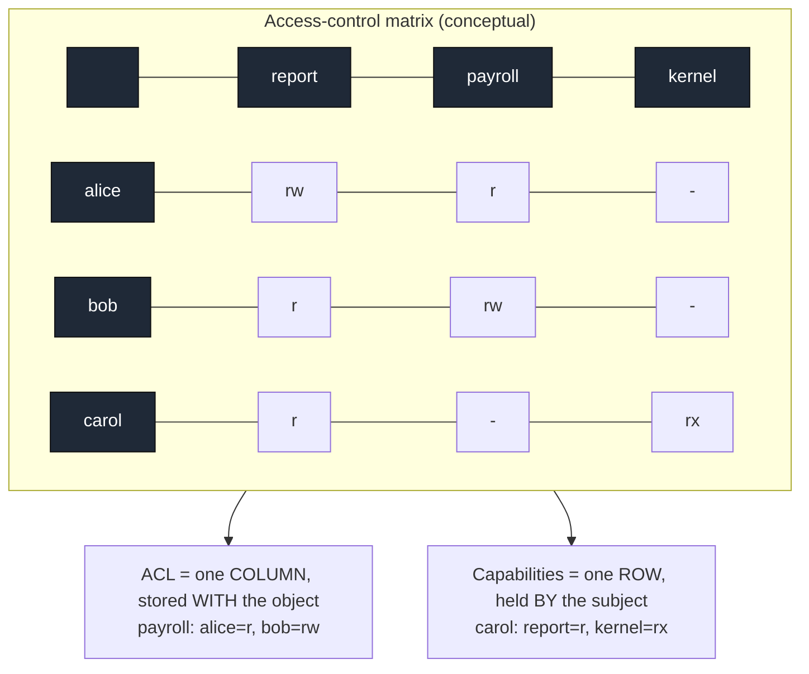
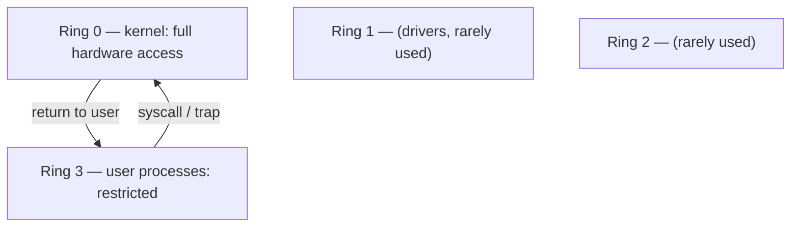

# Access Control

**The crux:** a running system is full of subjects (users, processes) that want to touch objects (files, sockets, memory, devices). Some of those accesses are legitimate and some are not, and the kernel must decide — correctly, on every single operation — which is which. Access control is the machinery that answers one question at every gate: *may this subject perform this operation on this object?* This page builds the conceptual answer (the access-control matrix), shows the two ways real systems store it (access-control lists and capabilities), and then grounds it in Unix permission bits, setuid, least privilege, protection rings, and the classic policy models.

## The core idea

- Model every authorization decision as a lookup in a **protection state**: given a **subject** S, an **object** O, and an operation (a **right** R), is R present for the pair (S, O)?
- The clean conceptual form is the **access-control matrix**: rows are subjects, columns are objects, and cell M[S][O] holds the set of rights S has on O. Every check is "is R in M[S][O]?"
- The matrix is a *specification*, not an implementation. It is enormous (subjects times objects) and almost entirely empty, so no real system stores it as a 2-D array. Instead it is decomposed one of two ways:
  - **Access-control lists (ACLs)** store the matrix by **column**: each object carries a list of "(subject, rights)" entries. "Who can do what to THIS object?"
  - **Capabilities** store the matrix by **row**: each subject holds a set of unforgeable tokens, one per object it may touch, each naming the allowed rights. "What can THIS subject reach?"
- Unix ties these together concretely: file **rwx bits** are a coarse ACL (three fixed entries — owner, group, other), while an open **file descriptor** behaves like a capability (an unforgeable handle that already carries the access mode).
- Two design principles run through everything below: **least privilege** (grant the minimum rights needed, for the minimum time) and **fail-safe defaults** (deny unless explicitly allowed) — both from Saltzer and Schroeder's classic design principles.

## How it works

### The access-control matrix and its two decompositions

The matrix is the mental model; ACLs and capabilities are two ways of slicing the same data. Reading a **column** gives you an object's ACL; reading a **row** gives you a subject's capability list.



- **ACLs** put the authority next to the resource. This makes "list everyone who can touch file F" trivial and makes **revocation** easy — edit F's list and the access is gone. It makes "list everything user U can touch" expensive (you must scan every object), and delegation is awkward.
- **Capabilities** put the authority in the subject's hand. This makes **delegation** natural (pass a copy of the token) and answers "what can U reach?" directly, but **revocation** is hard — you must find and invalidate every outstanding copy of the token.
- The two decompositions are duals: ACLs favor per-object questions and revocation; capabilities favor per-subject questions and delegation. Real systems mix them.

### An access-control matrix with both checks

Answering "can S do R on O?" is a column lookup for the ACL and a row lookup for the capability — over the *same* matrix, so the answers must agree.

```c
#include <stdio.h>
#include <string.h>

/* Rights are bit flags so a cell can hold several at once. */
enum { R_READ = 1, R_WRITE = 2, R_EXEC = 4 };

#define NS 3   /* subjects */
#define NO 3   /* objects  */

static const char *subj[NS] = { "alice", "bob", "carol" };
static const char *obj[NO]  = { "report", "payroll", "kernel" };

/* The conceptual access-control matrix: M[s][o] = set of rights subject s holds on object o.
   In practice this matrix is huge and sparse, so it is never stored whole — it is decomposed
   by column (ACLs, stored with each object) or by row (capabilities, held by each subject). */
static int M[NS][NO] = {
    /*            report          payroll          kernel */
    /* alice */ { R_READ|R_WRITE, R_READ,          0 },
    /* bob   */ { R_READ,         R_READ|R_WRITE,  0 },
    /* carol */ { R_READ,         0,               R_READ|R_EXEC },
};

/* ACL view: the COLUMN for object o, a list of (subject, rights) pairs stored with
   the object. Answers "who can do what to THIS object?" */
static int acl_check(int o, int s, int right) {
    for (int i = 0; i < NS; i++)
        if (i == s)
            return (M[i][o] & right) != 0;
    return 0;
}

/* Capability view: the ROW for subject s, a list of (object, rights) tokens the subject
   carries. Answers "what can THIS subject reach?" */
static int cap_check(int s, int o, int right) {
    for (int j = 0; j < NO; j++)
        if (j == o)
            return (M[s][j] & right) != 0;
    return 0;
}

static const char *yn(int b) { return b ? "ALLOW" : "DENY"; }

int main(void) {
    struct { int s, o, r; const char *rn; } q[] = {
        { 0, 0, R_WRITE, "write" },  /* alice -> report:  ALLOW */
        { 1, 1, R_WRITE, "write" },  /* bob   -> payroll: ALLOW */
        { 1, 0, R_WRITE, "write" },  /* bob   -> report:  DENY (read only) */
        { 2, 2, R_EXEC,  "exec"  },  /* carol -> kernel:  ALLOW */
        { 0, 2, R_READ,  "read"  },  /* alice -> kernel:  DENY */
    };
    printf("%-6s %-8s %-6s  %-6s %-6s\n", "subj", "obj", "right", "ACL", "CAP");
    for (unsigned i = 0; i < sizeof q / sizeof q[0]; i++) {
        int a = acl_check(q[i].o, q[i].s, q[i].r);
        int c = cap_check(q[i].s, q[i].o, q[i].r);
        printf("%-6s %-8s %-6s  %-6s %-6s  %s\n",
               subj[q[i].s], obj[q[i].o], q[i].rn, yn(a), yn(c),
               a == c ? "" : "MISMATCH!");
    }
    return 0;
}
```

Output — both views agree on every query, because they read the same matrix:

```text
subj   obj      right   ACL    CAP
alice  report   write   ALLOW  ALLOW
bob    payroll  write   ALLOW  ALLOW
bob    report   write   DENY   DENY
carol  kernel   exec    ALLOW  ALLOW
alice  kernel   read    DENY   DENY
```

### Unix permissions: rwx, octal, owner/group/other

Unix implements a deliberately coarse ACL: exactly three classes per file — **owner**, **group**, **other** — each with three bits **r** (read), **w** (write), **x** (execute). Nine bits, written as three octal digits (owner, group, other). A directory's x bit means "may traverse into it"; its r bit means "may list names."

- `chmod 755 f` sets owner `rwx` (7), group `r-x` (5), other `r-x` (5). Symbolic form: `chmod u=rwx,go=rx f`.
- The decisive subtlety is **precedence by class, not by union**: the kernel selects exactly ONE class and uses only its three bits. If you are the owner, only the owner bits apply — even if the group or other bits would grant more. This is why `chmod 604 f` can let strangers read a file the owner's own group cannot.

```c
#include <stdio.h>

/* Request bits, same as the low 3 bits of a mode class: r=4, w=2, x=1. */
enum { P_R = 4, P_W = 2, P_X = 1 };

/* Decide whether a process with (uid,gid) may perform `want` (an OR of P_R/P_W/P_X)
   on a file whose permission bits are `mode` (e.g. 0755) owned by (fowner,fgroup).

   Unix precedence is by CLASS, not by union: pick exactly ONE class and use only its
   3 bits. If uid == owner, only the owner bits apply — even if group/other would allow
   more. Else if gid == group, only the group bits. Else the other bits. This is why
   `chmod 604 f` can let "other" read a file its own group cannot. */
static int unix_may(int mode, int fowner, int fgroup,
                    int uid, int gid, int want) {
    int bits;
    if (uid == fowner)      bits = (mode >> 6) & 7;   /* owner class */
    else if (gid == fgroup) bits = (mode >> 3) & 7;   /* group class */
    else                    bits =  mode       & 7;   /* other class */
    return (bits & want) == want;                     /* all requested bits present */
}

static const char *yn(int b) { return b ? "ALLOW" : "DENY"; }

int main(void) {
    int owner = 1000, group = 2000;  /* file owned by uid 1000, gid 2000 */

    struct { int mode, uid, gid, want; const char *rn; } t[] = {
        /* mode 0755: owner rwx, group r-x, other r-x */
        { 0755, 1000, 2000, P_W, "owner write" },   /* owner: 7 -> ALLOW */
        { 0755, 5000, 2000, P_W, "group write" },   /* group: 5 -> DENY  */
        { 0755, 5000, 2000, P_X, "group exec"  },   /* group: 5 -> ALLOW */
        { 0755, 5000, 9999, P_R, "other read"  },   /* other: 5 -> ALLOW */
        { 0755, 5000, 9999, P_W, "other write" },   /* other: 5 -> DENY  */
        /* mode 0604: owner rw-, group ---, other r--  (precedence quirk) */
        { 0604, 5000, 2000, P_R, "group(0)read" },  /* group class: 0 -> DENY even though other=r */
        { 0604, 5000, 9999, P_R, "other read"   },  /* other: 4 -> ALLOW */
        { 0604, 1000, 2000, P_X, "owner exec"   },  /* owner: 6 -> DENY (no x) */
    };
    printf("%-5s %-6s %-6s %-13s %s\n", "mode", "uid", "gid", "request", "result");
    for (unsigned i = 0; i < sizeof t / sizeof t[0]; i++)
        printf("0%-4o %-6d %-6d %-13s %s\n",
               t[i].mode, t[i].uid, t[i].gid, t[i].rn,
               yn(unix_may(t[i].mode, owner, group, t[i].uid, t[i].gid, t[i].want)));
    return 0;
}
```

Output — note `0604` denies group read even though "other" gets read, because the group class is chosen first and its bits are `0`:

```text
mode  uid    gid    request       result
0755  1000   2000   owner write   ALLOW
0755  5000   2000   group write   DENY
0755  5000   2000   group exec    ALLOW
0755  5000   9999   other read    ALLOW
0755  5000   9999   other write   DENY
0604  5000   2000   group(0)read  DENY
0604  5000   9999   other read    ALLOW
0604  1000   2000   owner exec    DENY
```

### setuid, setgid, and the sticky bit

Above the nine rwx bits sit three special bits, written as a fourth leading octal digit.

- **setuid** (`04000`, e.g. `chmod 4755`): when an executable with this bit runs, the process takes the **effective uid of the file's owner**, not the caller's. This is how an ordinary user changes their own password: `/usr/bin/passwd` is owned by root and setuid-root, so during that one program the user runs with root's authority to edit `/etc/shadow` — a file they cannot touch directly.
- setuid is powerful and dangerous in equal measure. A setuid-root binary that has any bug (buffer overflow, unsafe `system()` call, a path it will follow into) hands root to the attacker. The mitigation is least privilege: drop the elevated privilege the instant it is no longer needed, and prefer fine-grained capabilities over blanket setuid-root.
- **setgid** (`02000`): the analogous bit for group. On a directory it also makes new files inherit the directory's group, which is handy for shared project trees.
- **sticky bit** (`01000`): on a directory it means "only a file's owner (or root) may delete or rename it, regardless of write permission on the directory." `/tmp` is `drwxrwxrwt` (mode `1777`) so anyone can create files there but nobody can delete another user's file.

### Least privilege and Linux capabilities

Traditional Unix is binary: uid 0 (root) bypasses all permission checks, everyone else is constrained. That violates least privilege — a program that only needs to bind port 80 should not need *all* of root. **Linux capabilities** (see `capabilities(7)`) split root's monolithic power into ~40 independent bits, each grantable on its own:

- `CAP_NET_BIND_SERVICE` — bind a socket to a privileged port (below 1024).
- `CAP_NET_RAW` — use raw and packet sockets (what `ping` needs).
- `CAP_CHOWN` — change file ownership; `CAP_DAC_OVERRIDE` — bypass file rwx checks; `CAP_SYS_ADMIN` — a large grab-bag that is nearly root by itself.

A process has capability sets (permitted, effective, inheritable, ambient), and file executables carry capabilities too — so a web server can be granted just `CAP_NET_BIND_SERVICE` instead of running as root. This is least privilege made mechanical: hand out the single bit the job requires and nothing more.

### Protection rings

Access control between *user code and the kernel* is enforced in hardware by **protection rings** — numbered privilege levels the CPU tracks, with lower numbers more privileged.



- x86 exposes four rings (0–3); mainstream operating systems use only **ring 0 (kernel)** and **ring 3 (user)**. Privileged instructions (halt the CPU, load a page table, touch device registers) are legal only in ring 0.
- User code crosses into ring 0 only through controlled gates — a `syscall`/trap that jumps to a fixed kernel entry point. The ring boundary is what makes the kernel a trusted reference monitor: user code cannot reach hardware except by asking. Virtualization adds a further "ring -1" (hypervisor) below the guest kernel.

### DAC vs MAC vs RBAC

Three families of *policy* — who decides the rights, and how they are structured.

- **DAC (Discretionary Access Control):** the object's **owner** sets the policy at their discretion. Unix rwx and ACLs are DAC — you `chmod` your own files. Flexible, but a compromised or careless user can leak anything they own, and there is no system-wide guarantee.
- **MAC (Mandatory Access Control):** a central policy the owner **cannot** override. Objects and subjects carry labels (e.g. Secret, Top-Secret), and the system enforces rules like "no read up, no write down" (Bell–LaPadula) regardless of user wishes. SELinux and AppArmor bring MAC to Linux; used where confinement must hold even against the resource owner.
- **RBAC (Role-Based Access Control):** rights attach to **roles**, and users are assigned roles. "Billing-clerk" carries a fixed permission set; onboard someone by granting the role. This scales administration in large organizations far better than per-user ACLs and maps cleanly to job functions.

### The confused deputy problem

A **confused deputy** is a privileged program that is tricked into misusing its authority on behalf of a less-privileged caller.

- Classic example: a compiler service runs with permission to write to a system billing log. A user tells it "write your output to `/etc/passwd`." The compiler *has* write permission there (for the log), the user does not — but the compiler dutifully uses ITS authority to overwrite `/etc/passwd`. The deputy was confused about *whose* request it was serving.
- The root cause is **ambient authority**: the deputy's rights come from who it *is* (an ACL keyed on the deputy's identity), separate from the *request*, which only names an object by string. Nothing binds "permission to write here" to "this specific caller asked for it."
- **Capabilities fix this by design.** If the caller must hand the deputy a *capability* for the exact file to write, the deputy can only write where the caller could already write — authority travels with the request, so there is no gap to confuse. This is the strongest argument for capability systems over ACL-plus-ambient-authority.

## Interview questions

**1. What is the access-control matrix, and why don't systems store it directly?**
Rows are subjects, columns are objects, and cell (S, O) holds the rights S has on O; every check is "is R in M[S][O]?" It is not stored as a literal 2-D array because it is huge (subjects times objects) and overwhelmingly sparse. Systems store only the non-empty parts, decomposed either by column (ACLs) or by row (capabilities).

**2. ACLs vs capabilities — column vs row, and the tradeoffs?**
An ACL is a matrix **column** stored with the object: a list of (subject, rights). A capability is a matrix **row** held by the subject: unforgeable tokens naming objects and rights. ACLs make "who can access F?" and **revocation** easy (edit the list) but "what can U reach?" and delegation hard. Capabilities make **delegation** natural (pass the token) and per-subject queries easy, but **revocation** hard (you must invalidate every copy). They are duals of the same matrix.

**3. Explain the Unix rwx model, octal, and owner/group/other precedence.**
Nine bits: r/w/x for each of owner, group, other, written as three octal digits (`755` = `rwxr-xr-x`). The kernel picks exactly **one** class — owner if uid matches, else group if gid matches, else other — and uses only that class's three bits. It is precedence, not union: `604` denies the group read even though "other" is granted read, because the group class is selected first and its bits are zero.

**4. What is setuid, why is it useful, and why is it dangerous? (passwd)**
A setuid executable runs with the **effective uid of the file's owner** instead of the caller's. `passwd` is setuid-root so an ordinary user can update `/etc/shadow` (which they cannot write directly) for the duration of that program. It is dangerous because any bug in a setuid-root binary yields full root to an attacker; mitigate by dropping privilege early and preferring fine-grained capabilities.

**5. State the principle of least privilege and how Linux capabilities serve it.**
Grant each component the minimum rights it needs for the minimum time (Saltzer and Schroeder). Traditional root is all-or-nothing, which violates this. Linux **capabilities** split root into ~40 independent bits (`CAP_NET_BIND_SERVICE`, `CAP_CHOWN`, `CAP_SYS_ADMIN`, …) so a service that only needs to bind port 80 gets exactly that one bit rather than full root.

**6. DAC vs MAC vs RBAC — distinguish them.**
DAC: the object owner sets policy at their discretion (Unix rwx, ACLs) — flexible but no global guarantee. MAC: a central, non-overridable policy enforced via labels (Bell–LaPadula, SELinux) — strong confinement even against the owner. RBAC: permissions attach to roles and users get roles — scales administration and maps to job functions.

**7. What is the confused-deputy problem, and how do capabilities help?**
A privileged program is tricked into using its authority for a less-privileged caller — e.g. a service with write access to a log is told to write to `/etc/passwd` and does so with its own rights. The cause is **ambient authority**: the deputy's rights are keyed to its identity, decoupled from the request. Capabilities fix it because the caller must supply a token for the exact object, so the deputy can only act where the caller could already act — authority rides with the request.

**8. What are protection rings and how do they enforce the user/kernel boundary?**
Hardware privilege levels the CPU tracks (x86 rings 0–3; OSes use 0 = kernel and 3 = user). Privileged instructions run only in ring 0. User code enters ring 0 only through controlled gates (syscall/trap) to a fixed kernel entry, which is what lets the kernel act as a trusted reference monitor — user code cannot touch hardware except by asking.

**9. How does a file descriptor resemble a capability?**
An open fd is an unforgeable, kernel-managed handle that already carries the granted access mode (read, write). A process cannot forge an fd for a file it never opened, and passing an fd (e.g. over a Unix socket) delegates that exact access — the same shape as handing over a capability token.

**10. What is the sticky bit and where is it used?**
On a directory, the sticky bit restricts deletion and renaming to a file's owner (or root) regardless of who has write permission on the directory. `/tmp` uses it (mode `1777`) so any user can create files but cannot remove another user's files.

## Coding problems

🎯 **Interview**

- **LeetCode 588 — Design In-Memory File System** — models a directory tree with per-node structure; the natural home for attaching per-node permissions and doing path-based access checks. What it tests: tree-structured object namespaces and traversal-time checks. [`leetcode.com/problems/design-in-memory-file-system`](https://leetcode.com/problems/design-in-memory-file-system/)
- **LeetCode 355 — Design Twitter** — the follow relation is an access relation (who may see whose posts); building the follow/feed graph mirrors deciding "which subjects may read which objects." What it tests: modeling a dynamic subject-to-object visibility relation. [`leetcode.com/problems/design-twitter`](https://leetcode.com/problems/design-twitter/)
- **LeetCode 706 — Design HashMap** — the primitive under a real access-control store: the matrix is a sparse map keyed by (subject, object). What it tests: implementing the sparse key-value structure that backs an ACL or capability table. [`leetcode.com/problems/design-hashmap`](https://leetcode.com/problems/design-hashmap/)

🏗 **Systems (OS-classic)**

- **Implement an access-control matrix with ACL and capability checks** — build the sparse matrix and answer "can S do R on O?" both by column (ACL) and by row (capability), verifying the two agree. What it tests: understanding that ACLs and capabilities are the same matrix sliced two ways. Reference: the `acm.c` program above, plus [Wikipedia — Access control matrix](https://en.wikipedia.org/wiki/Access_Control_Matrix).

## Key takeaways

- The **access-control matrix** (subjects × objects → rights) is the conceptual model; it is never stored whole because it is huge and sparse.
- **ACLs** store it by column (with the object) — good for revocation and "who can access F?"; **capabilities** store it by row (with the subject) — good for delegation and "what can U reach?"
- **Unix rwx** is a coarse three-entry ACL with **class precedence, not union**: owner beats group beats other, and only the chosen class's bits count.
- **setuid** runs a program with the file owner's privilege (how `passwd` works) — powerful and a prime attack surface; the **sticky bit** restricts deletion in shared directories.
- **Least privilege** plus **Linux capabilities** replace all-or-nothing root with fine-grained bits; **protection rings** enforce the user/kernel split in hardware.
- Policy models: **DAC** (owner decides), **MAC** (central labels, non-overridable), **RBAC** (rights via roles). **Capabilities** dissolve the **confused-deputy** problem by tying authority to the request.

## Source(s) and further reading

- Saltzer & Schroeder, "The Protection of Information in Computer Systems" — least privilege, fail-safe defaults, and the ACL/capability distinction: [web.mit.edu/Saltzer/www/publications/protection](https://web.mit.edu/Saltzer/www/publications/protection/)
- Linux man pages: [chmod(2)](https://man7.org/linux/man-pages/man2/chmod.2.html), [credentials(7)](https://man7.org/linux/man-pages/man7/credentials.7.html), [capabilities(7)](https://man7.org/linux/man-pages/man7/capabilities.7.html)
- Wikipedia: [Access control matrix](https://en.wikipedia.org/wiki/Access_Control_Matrix), [Access-control list](https://en.wikipedia.org/wiki/Access-control_list), [Capability-based security](https://en.wikipedia.org/wiki/Capability-based_security), [File-system permissions](https://en.wikipedia.org/wiki/File-system_permissions), [Setuid](https://en.wikipedia.org/wiki/Setuid), [Principle of least privilege](https://en.wikipedia.org/wiki/Principle_of_least_privilege), [Confused deputy problem](https://en.wikipedia.org/wiki/Confused_deputy_problem), [Protection ring](https://en.wikipedia.org/wiki/Protection_ring)
- Policy models: [Discretionary access control](https://en.wikipedia.org/wiki/Discretionary_access_control), [Mandatory access control](https://en.wikipedia.org/wiki/Mandatory_access_control), [Role-based access control](https://en.wikipedia.org/wiki/Role-based_access_control)
