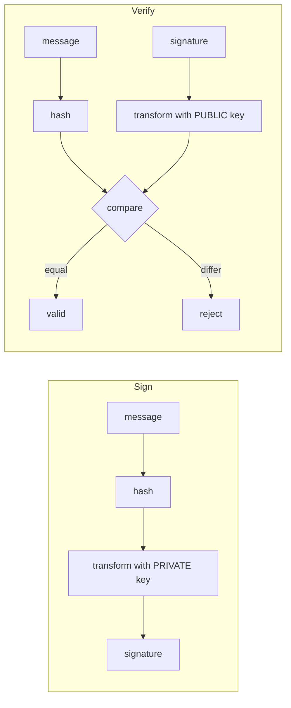
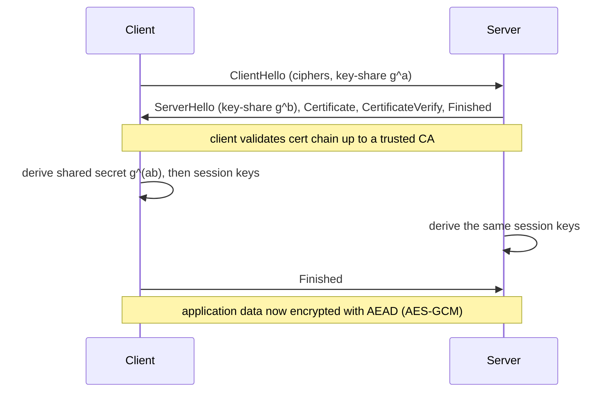

# Cryptography

**The crux:** almost every network you send bytes over is *hostile* — an attacker can read what crosses the wire, tamper with it, replay it, or impersonate the other end. **How do two parties who share nothing but an open, eavesdropped channel end up with a private, tamper-evident conversation neither can later deny?** Cryptography answers this with a small set of primitives — ciphers, hashes, MACs, key-exchange, and signatures — that each provide one guarantee, composed into protocols like TLS. The engineering discipline is knowing which primitive gives which guarantee, and never inventing your own.

## The core idea

- **Four security goals, each served by a specific primitive.** Do not conflate them — a system can have one without the others.
  - **Confidentiality** — only the intended party can read it. Primitive: **encryption** (symmetric AES, or asymmetric RSA/ECC).
  - **Integrity** — the message was not altered in transit. Primitive: a **cryptographic hash** or, keyed, a **MAC**.
  - **Authenticity** — it really came from who it claims. Primitive: a **MAC** (shared key) or a **digital signature** (public key).
  - **Non-repudiation** — the sender cannot later deny sending it. Primitive: a **digital signature** only — a MAC cannot provide this, because either key-holder could have made the tag.
- **Encryption hides content; it does not by itself prove integrity or origin.** A ciphertext can be flipped bit-by-bit into a different plaintext. That is why modern systems pair encryption with authentication (**authenticated encryption**, e.g. AES-GCM).
- **Two families of encryption.** **Symmetric** uses one shared key for both encrypt and decrypt — fast, but both sides must already share the key. **Asymmetric** uses a keypair (public to encrypt / verify, private to decrypt / sign) — slow, but it solves *key distribution*: you can hand out the public key over an open channel.
- **Real systems are hybrid.** Use slow asymmetric crypto once, only to agree on a fresh symmetric key; then use fast symmetric crypto (AES) for the bulk data. This is exactly what TLS does.
- **Hashes are one-way fingerprints.** SHA-256 maps any input to a fixed 256-bit digest that is infeasible to invert or to collide. Uses: integrity checks, commitments, password KDFs, and Merkle trees.
- **A key turns a hash into a MAC.** A plain hash proves integrity only if the attacker cannot also recompute it; anyone can hash. **HMAC** mixes a secret key into the hash so only key-holders can produce or verify the tag — integrity *and* authenticity.
- **Signatures flip the keys.** Sign with the *private* key, verify with the *public* key. Because only one person holds the private key, a valid signature proves integrity, authenticity, and non-repudiation at once.
- **The golden rule:** **do not roll your own crypto.** The primitives are simple to state and brutal to implement safely (timing leaks, padding oracles, nonce reuse, weak randomness). Use vetted libraries — **libsodium**, **OpenSSL/BoringSSL** — and standard constructions.

## How it works

### Goals mapped to primitives

| Goal | What it stops | Primitive |
| --- | --- | --- |
| Confidentiality | Eavesdropping | Symmetric (AES) / asymmetric (RSA, ECC) encryption |
| Integrity | Silent tampering | Cryptographic hash (SHA-256), MAC |
| Authenticity | Impersonation | MAC / HMAC (shared key), digital signature (public key) |
| Non-repudiation | Sender denying it later | Digital signature only |

### Symmetric encryption: one shared key, fast

- One key `K` both encrypts and decrypts: `C = E(K, P)`, `P = D(K, C)`. The workhorse is **AES** (FIPS-197), a **block cipher** operating on 128-bit blocks with 128/192/256-bit keys.
- A block cipher only encrypts one fixed-size block, so a **mode of operation** extends it to arbitrary-length messages. **CTR** turns the block cipher into a keystream generator; **CBC** chains blocks; **GCM** (below) adds authentication. Never use **ECB** — identical plaintext blocks produce identical ciphertext blocks, leaking structure.
- Symmetric crypto is fast (hardware AES runs at gigabytes/second) but leaves the hard problem unsolved: **how do both sides get the same key** without an eavesdropper learning it?

### Asymmetric / public-key: a keypair, slow, solves key distribution

- Each party has a **keypair**: a **public key** anyone may know, and a **private key** kept secret. What one key does, only the other undoes.
- **Encrypt for someone:** encrypt with their *public* key; only their *private* key decrypts. **RSA** builds this on the hardness of factoring `n = p·q`:

$$
c = m^{e} \bmod n, \qquad m = c^{d} \bmod n
$$

  where `(e, n)` is public and `d` is private, with `e·d ≡ 1 \pmod{\varphi(n)}`.
- **ECC** (elliptic-curve cryptography) gives the same guarantees with far smaller keys (a 256-bit ECC key ≈ a 3072-bit RSA key), so it dominates modern deployments.
- Asymmetric operations are orders of magnitude slower than AES, so they are used sparingly — for key exchange and signatures, not bulk data.

### Hybrid encryption: asymmetric to bootstrap symmetric

The universal pattern: pay the asymmetric cost *once* to move a fresh symmetric key, then switch to AES for everything else.

```mermaid
sequenceDiagram
    participant A as Alice
    participant B as Bob
    Note over A,B: Bob has a keypair; Alice knows Bob's PUBLIC key
    A->>A: generate random session key Ks
    A->>A: wrap Ks with Bob's public key (RSA/ECC)
    A->>B: send encrypted-Ks  +  AES-encrypt(Ks, big message)
    B->>B: unwrap Ks with PRIVATE key
    B->>B: AES-decrypt(Ks, big message)
    Note over A,B: one slow asymmetric op, then fast symmetric bulk
```

### Cryptographic hashes: one-way, collision-resistant

- A hash `H` maps arbitrary input to a fixed-size digest (**SHA-256** → 256 bits) with three properties: **pre-image resistance** (given `h`, cannot find `m` with `H(m)=h`), **second-pre-image resistance** (given `m`, cannot find `m' ≠ m` with the same digest), and **collision resistance** (cannot find *any* `m ≠ m'` colliding).
- Uses: **integrity** (compare digests of a download vs the published one), **commitments** (publish `H(x)` now, reveal `x` later — binding but hiding), **password storage** via a slow salted **KDF** (bcrypt/scrypt/Argon2 — plain SHA-256 is too fast to store passwords with), and **Merkle trees** (hash-of-hashes so one root digest fixes a whole dataset).
- MD5 and SHA-1 are **broken** (practical collisions exist) — use SHA-256 or SHA-3.

### MACs / HMAC: integrity + authenticity with a shared key

- A plain hash proves integrity *only against accidental change*: an attacker who rewrites the message can also recompute its hash. Bind a **secret key** into the computation and now only key-holders can produce a valid tag.
- **HMAC** is the standard construction (RFC 2104): nest the hash twice around the key so length-extension attacks do not apply.

$$
\text{HMAC}(K, m) = H\big((K \oplus opad)\,\Vert\, H((K \oplus ipad)\,\Vert\, m)\big)
$$

- Verify by recomputing and comparing in **constant time** (a byte-by-byte early-exit compare leaks *where* the tag differs, a timing side channel).

### Authenticated encryption: AES-GCM

- Encryption alone is malleable; a MAC alone does not hide content. **Authenticated encryption (AEAD)** does both in one primitive: **AES-GCM** encrypts with AES-CTR and produces an authentication tag over the ciphertext (and optional associated data) in one pass.
- The receiver rejects any ciphertext whose tag does not verify *before* decrypting, defeating tampering and chosen-ciphertext attacks. The one sharp edge: the **nonce must never repeat** under the same key — nonce reuse in GCM is catastrophic. This is a prime reason to use a vetted library that manages nonces for you.

### Digital signatures: sign private, verify public

- The keys are used the *opposite* way from encryption. The signer hashes the message and transforms the digest with their **private** key; anyone verifies with the **public** key.
- A valid signature proves **integrity** (the message is unchanged), **authenticity** (it came from the private-key holder), and **non-repudiation** (only that one holder could have produced it — unlike a MAC, where both parties share the key).



### Diffie-Hellman key exchange: a shared secret over a public channel

- DH lets two parties agree on a secret while everything they *transmit* is public. Public parameters: a large prime `p` and a generator `g`.
- Each side picks a private exponent and sends `g` raised to it, mod `p`:

$$
A = g^{a} \bmod p, \qquad B = g^{b} \bmod p
$$

- Each raises the *other's* value to their own secret, landing on the same number:

$$
B^{a} \bmod p \;=\; g^{ba} \bmod p \;=\; g^{ab} \bmod p \;=\; A^{b} \bmod p
$$

- The eavesdropper sees `p, g, A, B` but computing `g^{ab}` from them is the **discrete-log problem** — infeasible for large `p`. Real deployments use **ephemeral** DH (a fresh `a`, `b` per session) for **forward secrecy**: stealing today's long-term key does not decrypt yesterday's traffic.

```mermaid
sequenceDiagram
    participant A as Alice
    participant B as Bob
    Note over A,B: public: prime p, generator g
    A->>A: pick secret a
    B->>B: pick secret b
    A->>B: A = g^a mod p
    B->>A: B = g^b mod p
    A->>A: s = B^a mod p
    B->>B: s = A^b mod p
    Note over A,B: both hold s = g^(ab) mod p; eavesdropper cannot
```

### TLS, at a high level

TLS (RFC 8446 for 1.3) is the composition of everything above into one protocol securing HTTPS and most internet traffic. The handshake uses asymmetric crypto to *authenticate* the server and *agree* on a symmetric key; the rest of the session uses fast AEAD.



- **Key agreement:** client and server exchange DH/ECDH key-shares and derive a shared secret, from which symmetric session keys are computed.
- **Authentication:** the server presents a **certificate** — its public key signed by a **Certificate Authority (CA)**. The client checks the signature chains up to a CA it trusts. Without this, an active attacker could sit in the middle (**MITM**), running one DH exchange with each side. The certificate is what binds the key to the identity and defeats MITM.
- **Confidentiality + integrity:** once keys are set, every record is protected with authenticated encryption. TLS 1.3 also cut the handshake to one round trip and removed legacy, insecure options.

### Don't roll your own crypto

- The math is publishable; the *implementation* is where systems die — timing side channels, padding oracles (Bleichenbacher, Lucky-13), nonce/IV reuse, weak or reused randomness, and downgrade attacks.
- Use **standard constructions** (AES-GCM, HMAC-SHA256, X25519, Ed25519) via **vetted libraries** (**libsodium** for a misuse-resistant API, **OpenSSL/BoringSSL** for breadth). The C below is *illustrative* — it exists to show the mechanics, not to be deployed.

## Must-know algorithms

All three programs are **illustrative** — production uses vetted libraries with full-size parameters, padding, and constant-time implementations. Each compiles with `cc -std=c11` and runs correctly.

### 1. Diffie-Hellman key exchange (fast modpow)

Both sides derive the identical shared secret from public exchanges; the secret itself is never transmitted. The engine is fast modular exponentiation.

```c
// Diffie-Hellman key exchange over small primes. Both parties derive the SAME
// shared secret from public exchanges, without ever transmitting it.
// ILLUSTRATIVE ONLY — real DH uses 2048+-bit primes and vetted libraries.
#include <stdio.h>
#include <stdint.h>

// Fast modular exponentiation: base^exp mod m in O(log exp).
// Uses 64-bit intermediates so base*base cannot overflow for our small moduli.
uint64_t modpow(uint64_t base, uint64_t exp, uint64_t m) {
    uint64_t r = 1;
    base %= m;
    while (exp > 0) {
        if (exp & 1) r = (r * base) % m;   // fold in this bit
        base = (base * base) % m;          // square the base
        exp >>= 1;
    }
    return r;
}

int main(void) {
    uint64_t p = 23, g = 5;   // public parameters: prime p, generator g
    uint64_t a = 6, b = 15;   // private secrets, never transmitted

    uint64_t A = modpow(g, a, p);   // Alice sends A = g^a mod p
    uint64_t B = modpow(g, b, p);   // Bob   sends B = g^b mod p

    uint64_t sA = modpow(B, a, p);  // Alice computes B^a mod p
    uint64_t sB = modpow(A, b, p);  // Bob   computes A^b mod p

    printf("public: p=%llu g=%llu\n", (unsigned long long)p, (unsigned long long)g);
    printf("Alice sends A=%llu, Bob sends B=%llu\n",
           (unsigned long long)A, (unsigned long long)B);
    printf("Alice secret=%llu, Bob secret=%llu -> %s\n",
           (unsigned long long)sA, (unsigned long long)sB,
           sA == sB ? "MATCH" : "MISMATCH");
    return 0;
}
```

Output:

```
public: p=23 g=5
Alice sends A=8, Bob sends B=19
Alice secret=2, Bob secret=2 -> MATCH
```

### 2. Toy RSA round-trip (keygen, encrypt, decrypt)

Textbook RSA over tiny primes: build the keypair from `φ(n)`, encrypt `m^e mod n`, decrypt `c^d mod n`. This is **insecure** (no padding, minuscule keys) and exists only to show the round trip.

```c
// Toy RSA round-trip over small primes: keygen, encrypt m^e mod n, decrypt
// c^d mod n. ILLUSTRATIVE ONLY — real RSA uses 2048+-bit keys, padding
// (OAEP), and vetted libraries. Textbook RSA like this is insecure.
#include <stdio.h>
#include <stdint.h>

uint64_t modpow(uint64_t base, uint64_t exp, uint64_t m) {
    uint64_t r = 1;
    base %= m;
    while (exp > 0) {
        if (exp & 1) r = (r * base) % m;
        base = (base * base) % m;
        exp >>= 1;
    }
    return r;
}

// Extended Euclid: return d such that (e*d) mod phi == 1 (modular inverse).
int64_t modinv(int64_t e, int64_t phi) {
    int64_t t = 0, newt = 1, r = phi, newr = e;
    while (newr != 0) {
        int64_t q = r / newr;
        int64_t tmp = t - q * newt; t = newt; newt = tmp;
        tmp = r - q * newr;        r = newr; newr = tmp;
    }
    if (t < 0) t += phi;
    return t;   // r==1 guaranteed when gcd(e,phi)==1
}

int main(void) {
    uint64_t pr = 61, q = 53;          // two secret primes
    uint64_t n = pr * q;               // modulus n = p*q = 3233
    uint64_t phi = (pr - 1) * (q - 1); // Euler totient = 3120
    uint64_t e = 17;                   // public exponent, gcd(e,phi)=1
    uint64_t d = (uint64_t)modinv((int64_t)e, (int64_t)phi); // private exponent

    printf("public key  (e=%llu, n=%llu)\n", (unsigned long long)e, (unsigned long long)n);
    printf("private key (d=%llu, n=%llu)\n", (unsigned long long)d, (unsigned long long)n);

    uint64_t m = 65;                   // message (must be < n)
    uint64_t c = modpow(m, e, n);      // encrypt with PUBLIC key
    uint64_t r = modpow(c, d, n);      // decrypt with PRIVATE key

    printf("m=%llu -> c=%llu -> decrypted=%llu -> %s\n",
           (unsigned long long)m, (unsigned long long)c, (unsigned long long)r,
           r == m ? "ROUND-TRIP OK" : "FAIL");
    return 0;
}
```

Output:

```
public key  (e=17, n=3233)
private key (d=2753, n=3233)
m=65 -> c=2790 -> decrypted=65 -> ROUND-TRIP OK
```

### 3. HMAC-SHA256 keyed MAC — detects a flipped bit

A real SHA-256 and the RFC 2104 HMAC construction (verified against the RFC 4231 test vector). The tag is unforgeable without the shared key, and flipping a single message bit makes verification reject.

```c
// HMAC-SHA256: a keyed hash giving integrity + authenticity. Only a holder of
// the shared key can produce a valid tag, and any change to the message
// changes the tag. Verify with constant-time compare. This SHA-256 + HMAC
// follows FIPS 180-4 and RFC 2104; still, production code should call a vetted
// library (libsodium/OpenSSL), not hand-rolled crypto.
#include <stdio.h>
#include <stdint.h>
#include <string.h>

typedef struct { uint32_t h[8]; uint64_t len; uint8_t buf[64]; size_t n; } sha256;

static uint32_t ror(uint32_t x, int r){ return (x>>r)|(x<<(32-r)); }

static const uint32_t K[64]={
0x428a2f98,0x71374491,0xb5c0fbcf,0xe9b5dba5,0x3956c25b,0x59f111f1,0x923f82a4,0xab1c5ed5,
0xd807aa98,0x12835b01,0x243185be,0x550c7dc3,0x72be5d74,0x80deb1fe,0x9bdc06a7,0xc19bf174,
0xe49b69c1,0xefbe4786,0x0fc19dc6,0x240ca1cc,0x2de92c6f,0x4a7484aa,0x5cb0a9dc,0x76f988da,
0x983e5152,0xa831c66d,0xb00327c8,0xbf597fc7,0xc6e00bf3,0xd5a79147,0x06ca6351,0x14292967,
0x27b70a85,0x2e1b2138,0x4d2c6dfc,0x53380d13,0x650a7354,0x766a0abb,0x81c2c92e,0x92722c85,
0xa2bfe8a1,0xa81a664b,0xc24b8b70,0xc76c51a3,0xd192e819,0xd6990624,0xf40e3585,0x106aa070,
0x19a4c116,0x1e376c08,0x2748774c,0x34b0bcb5,0x391c0cb3,0x4ed8aa4a,0x5b9cca4f,0x682e6ff3,
0x748f82ee,0x78a5636f,0x84c87814,0x8cc70208,0x90befffa,0xa4506ceb,0xbef9a3f7,0xc67178f2};

static void sha_init(sha256*s){
    static const uint32_t iv[8]={0x6a09e667,0xbb67ae85,0x3c6ef372,0xa54ff53a,
                                 0x510e527f,0x9b05688c,0x1f83d9ab,0x5be0cd19};
    memcpy(s->h,iv,sizeof iv); s->len=0; s->n=0;
}
static void sha_block(sha256*s,const uint8_t*p){
    uint32_t w[64];
    for(int i=0;i<16;i++) w[i]=(p[4*i]<<24)|(p[4*i+1]<<16)|(p[4*i+2]<<8)|p[4*i+3];
    for(int i=16;i<64;i++){
        uint32_t s0=ror(w[i-15],7)^ror(w[i-15],18)^(w[i-15]>>3);
        uint32_t s1=ror(w[i-2],17)^ror(w[i-2],19)^(w[i-2]>>10);
        w[i]=w[i-16]+s0+w[i-7]+s1;
    }
    uint32_t a=s->h[0],b=s->h[1],c=s->h[2],d=s->h[3],e=s->h[4],f=s->h[5],g=s->h[6],h=s->h[7];
    for(int i=0;i<64;i++){
        uint32_t S1=ror(e,6)^ror(e,11)^ror(e,25);
        uint32_t ch=(e&f)^(~e&g);
        uint32_t t1=h+S1+ch+K[i]+w[i];
        uint32_t S0=ror(a,2)^ror(a,13)^ror(a,22);
        uint32_t maj=(a&b)^(a&c)^(b&c);
        uint32_t t2=S0+maj;
        h=g;g=f;f=e;e=d+t1;d=c;c=b;b=a;a=t1+t2;
    }
    s->h[0]+=a;s->h[1]+=b;s->h[2]+=c;s->h[3]+=d;
    s->h[4]+=e;s->h[5]+=f;s->h[6]+=g;s->h[7]+=h;
}
static void sha_update(sha256*s,const uint8_t*p,size_t n){
    s->len+=n;
    while(n){
        size_t k=64-s->n; if(k>n)k=n;
        memcpy(s->buf+s->n,p,k); s->n+=k; p+=k; n-=k;
        if(s->n==64){ sha_block(s,s->buf); s->n=0; }
    }
}
static void sha_final(sha256*s,uint8_t out[32]){
    uint64_t bits=s->len*8;
    uint8_t pad=0x80; sha_update(s,&pad,1);
    uint8_t z=0; while(s->n!=56) sha_update(s,&z,1);
    uint8_t lb[8]; for(int i=0;i<8;i++) lb[i]=(bits>>(56-8*i))&0xff;
    sha_update(s,lb,8);
    for(int i=0;i<8;i++){ out[4*i]=s->h[i]>>24; out[4*i+1]=s->h[i]>>16;
                          out[4*i+2]=s->h[i]>>8; out[4*i+3]=s->h[i]; }
}
static void sha256_hash(const uint8_t*m,size_t n,uint8_t out[32]){
    sha256 s; sha_init(&s); sha_update(&s,m,n); sha_final(&s,out);
}

// HMAC(K,m) = H( (K^opad) || H( (K^ipad) || m ) ), block size 64 for SHA-256.
static void hmac_sha256(const uint8_t*key,size_t klen,
                        const uint8_t*msg,size_t mlen,uint8_t out[32]){
    uint8_t k[64]={0};
    if(klen>64){ sha256_hash(key,klen,k); } else memcpy(k,key,klen);
    uint8_t ipad[64],opad[64];
    for(int i=0;i<64;i++){ ipad[i]=k[i]^0x36; opad[i]=k[i]^0x5c; }
    uint8_t inner[32];
    sha256 s; sha_init(&s); sha_update(&s,ipad,64); sha_update(&s,msg,mlen); sha_final(&s,inner);
    sha_init(&s); sha_update(&s,opad,64); sha_update(&s,inner,32); sha_final(&s,out);
}

// Constant-time compare so verification does not leak where a tag differs.
static int ct_equal(const uint8_t*a,const uint8_t*b,size_t n){
    uint8_t diff=0; for(size_t i=0;i<n;i++) diff|=a[i]^b[i]; return diff==0;
}

int main(void){
    const uint8_t key[]="shared-secret-key";
    uint8_t msg[]="transfer $100 to Bob";
    uint8_t tag[32];
    hmac_sha256(key,sizeof key-1,msg,sizeof msg-1,tag);

    printf("tag[0..7]="); for(int i=0;i<8;i++) printf("%02x",tag[i]); printf("...\n");

    // Receiver recomputes over the received message and compares.
    uint8_t chk[32];
    hmac_sha256(key,sizeof key-1,msg,sizeof msg-1,chk);
    printf("untampered verify: %s\n", ct_equal(tag,chk,32) ? "OK" : "REJECT");

    // Attacker flips one bit of the message but cannot forge a matching tag.
    msg[9]^=0x01;   // '1' -> '0' in "$100"
    hmac_sha256(key,sizeof key-1,msg,sizeof msg-1,chk);
    printf("tampered verify:   %s\n",
           ct_equal(tag,chk,32) ? "OK (missed!)" : "REJECT (tamper detected)");
    return 0;
}
```

Output:

```
tag[0..7]=52f94e464f676aeb...
untampered verify: OK
tampered verify:   REJECT (tamper detected)
```

## Interview questions

1. **Symmetric vs asymmetric encryption — speed, key distribution, and why hybrid?**
   Symmetric uses one shared key for encrypt and decrypt (AES); it is fast but requires both sides to already share the key. Asymmetric uses a public/private keypair (RSA, ECC); it is far slower but solves **key distribution** — you can publish the public key openly. Real systems are **hybrid**: use asymmetric crypto once to exchange or wrap a fresh symmetric session key, then use fast symmetric AES for the bulk data. You get key distribution from asymmetric and throughput from symmetric.

2. **What does a cryptographic hash guarantee, and what is it used for?**
   Three properties: **pre-image resistance** (cannot invert a digest to a message), **second-pre-image resistance** (given a message, cannot find a different one with the same digest), and **collision resistance** (cannot find any two messages that collide). It is a one-way, fixed-size fingerprint. Uses: integrity checks, commitment schemes, password storage via a slow salted KDF, and Merkle trees. SHA-256 is current; MD5 and SHA-1 are broken.

3. **MAC/HMAC vs a plain hash — why the key?**
   A plain hash proves integrity only against *accidental* change: an attacker who rewrites the message simply recomputes the hash, since hashing needs no secret. A **MAC** mixes in a secret **key**, so only key-holders can produce or verify a valid tag — giving integrity *and* authenticity. **HMAC** is the standard construction that nests the hash around the key to resist length-extension. Verify in constant time to avoid a timing side channel.

4. **What is a digital signature and what does it prove?**
   You hash the message and transform the digest with your **private** key; anyone verifies with your **public** key. A valid signature proves **integrity** (unchanged), **authenticity** (from the private-key holder), and **non-repudiation** (only that one holder could have produced it). This last property is why a signature — not a MAC — is required when the sender must not be able to deny sending: a MAC's key is shared, so either party could have made the tag.

5. **Explain Diffie-Hellman: how do two parties get a shared secret over a public channel?**
   Both agree on public `p` (prime) and `g` (generator). Each picks a private exponent and sends `g` raised to it mod `p` (`A = g^a`, `B = g^b`). Each then raises the other's value to their own secret, and both land on `g^(ab) mod p`. An eavesdropper sees `p, g, A, B` but recovering the secret is the discrete-log problem, infeasible for large `p`. Use ephemeral DH per session for **forward secrecy** — a later key compromise cannot decrypt past traffic.

6. **How does TLS combine these primitives?**
   The handshake uses **asymmetric** crypto for two jobs: **authentication** (the server presents a certificate — its public key signed by a CA the client trusts) and **key agreement** (an ECDH exchange yields a shared secret). From that secret both sides derive **symmetric** session keys and switch to fast authenticated encryption (AES-GCM) for all application data. Certificates plus CA validation are what stop a man-in-the-middle from running two separate exchanges and relaying between them.

7. **Why "don't roll your own crypto"?**
   The algorithms are public and easy to state, but safe *implementation* is where systems fail: timing side channels, padding oracles, nonce/IV reuse (catastrophic in GCM), weak randomness, and protocol downgrade attacks. These bugs are invisible in a functional test and devastating in production. Use standard constructions (AES-GCM, HMAC-SHA256, X25519, Ed25519) through vetted libraries (libsodium, OpenSSL/BoringSSL) that have been audited and hardened.

8. **Encryption vs hashing vs encoding — what is the difference?**
   **Encoding** (Base64, hex, URL-encoding) is a reversible format change with **no secret** and **no security** — anyone can decode it. **Encryption** is reversible *with a key* and provides confidentiality — without the key you cannot recover the plaintext. **Hashing** is **one-way** — there is no key and no way back; it produces a fixed-size fingerprint for integrity and lookup, not secrecy. Confusing "encoded" with "encrypted" is a classic security mistake.

9. **Why isn't encryption alone enough — what is authenticated encryption?**
   A ciphertext can be **malleable**: an attacker who cannot read it may still flip bits to predictably change the decrypted plaintext, and a decryptor with no integrity check will accept it. **Authenticated encryption (AEAD)**, e.g. **AES-GCM**, combines confidentiality with an integrity/authenticity tag over the ciphertext, so any tampering is rejected before decryption. The rule of thumb is *encrypt-then-MAC* or a proven AEAD mode — never encryption on its own.

10. **What stops a man-in-the-middle during a TLS/DH handshake?**
    Raw Diffie-Hellman gives a shared secret but **no identity** — an active attacker can run one exchange with each side and relay, reading everything. TLS closes this with **authentication**: the server's key-share is bound to a **certificate** signed by a trusted **CA**, and the handshake transcript is signed/verified. The client rejects a certificate that does not chain to a trusted CA or does not match the hostname, so the attacker cannot impersonate the server.

## Coding problems

### 🎯 Interview (LeetCode)

- **372 — Super Pow** — [leetcode.com/problems/super-pow](https://leetcode.com/problems/super-pow/) — modular exponentiation with a huge exponent given as a digit array; the exact modpow workhorse behind RSA and Diffie-Hellman. What it tests: fast exponentiation and modular arithmetic.
- **50 — Pow(x, n)** — [leetcode.com/problems/powx-n](https://leetcode.com/problems/powx-n/) — binary exponentiation (square-and-multiply); the same `O(log n)` structure as `modpow`, minus the modulus.
- **405 — Convert a Number to Hexadecimal** — [leetcode.com/problems/convert-a-number-to-hexadecimal](https://leetcode.com/problems/convert-a-number-to-hexadecimal/) — bit-slice a value into hex nibbles; the byte-to-hex formatting used to display digests and keys.
- **136 — Single Number** — [leetcode.com/problems/single-number](https://leetcode.com/problems/single-number/) — XOR-fold so pairs cancel and the lone value survives; the same self-inverse XOR that underlies one-time-pad and stream-cipher keystreams (`plaintext ⊕ key`).

### 🏗 Systems (crypto-classic)

- **Diffie-Hellman key exchange** — implement `modpow` and derive the shared `g^(ab) mod p` on both sides; confirm they match. Reference: [Wikipedia — Diffie-Hellman key exchange](https://en.wikipedia.org/wiki/Diffie%E2%80%93Hellman_key_exchange) and the C above. What it tests: modular exponentiation and the key-agreement idea.
- **Toy RSA** — keygen from `φ(n)` with a modular inverse, then `m^e mod n` / `c^d mod n` round-trip. Reference: [Wikipedia — RSA (cryptosystem)](https://en.wikipedia.org/wiki/RSA_(cryptosystem)) and the C above. What it tests: extended Euclid, modpow, and public/private key duality.
- **HMAC verify** — compute a keyed tag over a message and reject a tampered one with a constant-time compare. Reference: [Wikipedia — HMAC](https://en.wikipedia.org/wiki/HMAC) and the C above. What it tests: keyed integrity/authenticity and side-channel-safe comparison.

## Key takeaways

- Four goals, distinct primitives: **confidentiality** (encryption), **integrity** (hash/MAC), **authenticity** (MAC/signature), **non-repudiation** (signature only).
- **Symmetric (AES)** is fast but needs a shared key; **asymmetric (RSA/ECC)** is slow but solves key distribution — real systems go **hybrid**: asymmetric to move a symmetric key, then AES for bulk.
- **Hashes (SHA-256)** are one-way and collision-resistant; add a **key** to get a **MAC/HMAC** for integrity *and* authenticity.
- **Authenticated encryption (AES-GCM)** does confidentiality and integrity together — encryption alone is malleable; never reuse a GCM nonce.
- **Digital signatures** sign with the private key and verify with the public key, giving the only form of **non-repudiation**.
- **Diffie-Hellman** agrees a secret over a public channel via `g^(ab) mod p`; use ephemeral DH for **forward secrecy**.
- **TLS** stitches it together: certificate + CA authentication and key agreement (asymmetric) bootstrap a symmetric session and defeat MITM.
- **Don't roll your own crypto** — use standard constructions in vetted libraries (libsodium, OpenSSL/BoringSSL).

## Source(s) and further reading

- [NIST FIPS-197 — Advanced Encryption Standard (AES)](https://csrc.nist.gov/pubs/fips/197/final)
- [NIST FIPS 180-4 — Secure Hash Standard (SHA)](https://csrc.nist.gov/pubs/fips/180-4/upd1/final)
- [RFC 8446 — The Transport Layer Security (TLS) Protocol Version 1.3](https://www.rfc-editor.org/rfc/rfc8446)
- [Wikipedia — Public-key cryptography](https://en.wikipedia.org/wiki/Public-key_cryptography)
- [Wikipedia — Symmetric-key algorithm](https://en.wikipedia.org/wiki/Symmetric-key_algorithm)
- [Wikipedia — RSA (cryptosystem)](https://en.wikipedia.org/wiki/RSA_(cryptosystem))
- [Wikipedia — Elliptic-curve cryptography](https://en.wikipedia.org/wiki/Elliptic-curve_cryptography)
- [Wikipedia — SHA-2](https://en.wikipedia.org/wiki/SHA-2)
- [Wikipedia — Cryptographic hash function](https://en.wikipedia.org/wiki/Cryptographic_hash_function)
- [Wikipedia — Merkle tree](https://en.wikipedia.org/wiki/Merkle_tree)
- [Wikipedia — HMAC](https://en.wikipedia.org/wiki/HMAC)
- [Wikipedia — Authenticated encryption](https://en.wikipedia.org/wiki/Authenticated_encryption)
- [Wikipedia — Galois/Counter Mode (AES-GCM)](https://en.wikipedia.org/wiki/Galois/Counter_Mode)
- [Wikipedia — Digital signature](https://en.wikipedia.org/wiki/Digital_signature)
- [Wikipedia — Diffie-Hellman key exchange](https://en.wikipedia.org/wiki/Diffie%E2%80%93Hellman_key_exchange)
- [Wikipedia — Transport Layer Security](https://en.wikipedia.org/wiki/Transport_Layer_Security)
- [Wikipedia — Public key certificate](https://en.wikipedia.org/wiki/Public_key_certificate)
- [Wikipedia — Certificate authority](https://en.wikipedia.org/wiki/Certificate_authority)
- [Wikipedia — Key derivation function](https://en.wikipedia.org/wiki/Key_derivation_function)
- [MDN — Transport Layer Security](https://developer.mozilla.org/en-US/docs/Web/Security/Transport_Layer_Security)
