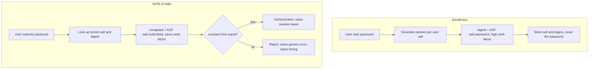

# Security & Authentication

**The crux:** an operating system runs code and holds data for many principals at once — users, services, remote clients — and most of them should not be trusted. **How does the system decide who a request is really from, and stop one principal from reading or wrecking another's data, given that attackers actively probe every weakness?** Answering "who are you?" correctly is *authentication*; it is the gate everything else depends on. Get the gate wrong — store a password badly, leak a secret over the wire, compare digests in a way that leaks timing — and every downstream permission check is meaningless. This page builds the security mindset, then goes deep on authentication and the one thing implementers get wrong most often: storing and verifying passwords.

## The core idea

- **Think adversarially: build a threat model.** Before defending, name what you are defending. A threat model asks: what are the *assets* (secrets, data, uptime), who are the *adversaries* and what can they do (eavesdrop the network, steal the password database, run code as an unprivileged user), and what are the *trust boundaries* (kernel vs user, host vs network)? Security is meaningless in the abstract — it is always *against a specific attacker with specific capabilities*.
- **The CIA triad names the three properties worth protecting:**
  - **Confidentiality** — data is disclosed only to those authorized to see it (encryption, access control).
  - **Integrity** — data is not modified except by authorized parties, and unauthorized modification is detected (checksums, MACs, signatures).
  - **Availability** — the system stays usable for legitimate users (resisting denial-of-service, redundancy).
  - A real breach usually violates one specific corner — leaking a database is a confidentiality failure; a ransomware wipe is an integrity/availability failure. Naming the corner clarifies the defense.
- **AAA is the operational cycle around every access:**
  - **Authentication** — establish *who* the principal is ("prove you are Alice").
  - **Authorization** — decide what that principal is *allowed* to do ("Alice may read this file, not that one").
  - **Auditing (accounting)** — record what happened, so misuse can be detected after the fact and attributed to a principal.
  - Authentication comes first and is the subject of this page; authorization (access control, permissions, capabilities) is the segue at the end.
- **The OS is the reference monitor.** Its core security jobs are **isolation** (one process cannot touch another's memory or another user's files — enforced by the MMU, user/kernel mode, and file permissions) and **mediated access** (every privileged action goes through the kernel via a system call, which is the single choke point where identity is checked). The hardware boundary between user and kernel mode is what makes these checks unforgeable by user code.
- **Least privilege underlies all of it.** Every principal — user, process, service — should hold the *minimum* rights needed to do its job, and no more. A compromised component then damages only what it could already touch. This is the bridge from authentication ("who") to authorization ("what they may do").

## How it works

### Authentication: the three factors

Authentication proves identity by demanding evidence of one or more *factors*:

- **Something you know** — a password, PIN, or passphrase. Cheap and universal; also the weakest, because knowledge can be guessed, phished, reused, or stolen from a database.
- **Something you have** — a phone running an authenticator app, a hardware security key (FIDO2/U2F), a smart card. Possession is harder to steal at scale.
- **Something you are** — a biometric: fingerprint, face, iris. Convenient, but not secret and not revocable (you cannot change your fingerprint after a leak), so best used as one factor, not the only one.

**Multi-factor authentication (MFA)** combines factors from *different* categories, so stealing one (a leaked password) is not enough. Two passwords are not MFA; a password plus a hardware key is.

### Passwords done right

The single most important rule of authentication storage:

- **NEVER store the plaintext password.** A database leak then hands the attacker every account instantly, plus every *reused* password across other sites.
- **NEVER store a plain (fast) hash** such as a bare SHA-256 either. A fast hash lets an attacker try billions of guesses per second on stolen digests, and identical passwords produce identical digests (revealing who shares a password and enabling precomputed **rainbow tables**).

The correct construction has three ingredients:

1. **Salt** — a unique, random value per user, stored *in the clear* alongside the digest and mixed into the hash input. Because every user's salt differs, identical passwords hash to *different* digests, and an attacker cannot precompute one table that cracks everyone. Salt **defeats rainbow tables and precomputation** — each password must be attacked individually.
2. **Slow key derivation** — instead of one fast hash, use a deliberately expensive **key-derivation function (KDF)**: **Argon2** (the current recommendation, memory-hard), **scrypt** (memory-hard), **bcrypt**, or **PBKDF2**. A tunable work factor makes each single guess take, say, tens of milliseconds. That is invisible to one legitimate login but multiplies the attacker's brute-force cost by millions. Slowness **defeats brute force**; memory-hardness additionally defeats cheap GPU/ASIC parallelism.
3. **Pepper (optional, defense in depth)** — a secret value *not* stored in the database (kept in an HSM, config, or app secret) and mixed in too. If only the database leaks but the pepper does not, the digests are useless. It complements the salt; it does not replace it.

So the stored record is roughly `salt` plus `KDF(salt, password, work_factor)`, and verification recomputes the KDF over the presented password with the stored salt and compares.



### Challenge-response: prove knowledge without sending the secret

Sending a password over the wire — even over TLS — means the server (or anything that MITMs or logs it) sees the raw secret. **Challenge-response** avoids that entirely: the prover demonstrates it *knows* the secret without transmitting it.

- The server sends a fresh, random, single-use **nonce** (the challenge).
- The client computes a **response** = `H(nonce, shared_secret)` (a keyed hash / HMAC) and sends only that.
- The server, knowing the same secret, recomputes the expected response and compares. The secret never crosses the wire.

Why the nonce must be fresh and single-use: it stops **replay**. An eavesdropper who captures one response cannot reuse it, because the next challenge is a different nonce and the old response will not match. This is the idea behind HTTP Digest auth, CHAP, Kerberos, and FIDO2's signed-challenge login.

```mermaid
sequenceDiagram
    participant C as Client (knows secret)
    participant S as Server (knows secret)
    S->>C: challenge: fresh random nonce
    Note over C: response = H(nonce, secret)
    C->>S: response only (secret never sent)
    Note over S: expected = H(nonce, secret)
    alt response == expected (constant-time)
        S->>C: GRANTED, issue session token
    else mismatch
        S->>C: DENIED (generic error)
    end
    Note over C,S: next login uses a new nonce &#8594; replay of old response fails
```



### After authentication: session tokens

Re-proving identity on every request is expensive and dangerous (it means shipping the credential repeatedly). Instead, after one successful authentication the server issues a **session token** — a large, random, opaque value stored server-side (or a signed token like a JWT). Subsequent requests present the token, not the password. Tokens are scoped, expirable, and revocable: a leaked token can be invalidated without changing the password, and it grants only the session's privileges.

### Timing attacks and constant-time comparison

A naive comparison of two digests returns as soon as the first differing byte is found. That makes the comparison's *running time* depend on how many leading bytes matched — a **timing side channel** an attacker can measure to recover a secret byte by byte. The fix is a **constant-time comparison**: always inspect *all* bytes, accumulate differences, and return one verdict at the end, so the time reveals nothing about *where* a mismatch was. Any comparison of secret-derived values (digests, MACs, tokens) must be constant-time.

## Must-know algorithms

### 1. Salted password hash + constant-time verify

Store `salt` and `H(salt || password)`; verify by recomputing over the presented password and comparing in constant time. Two users with the same password get **different** stored digests because their salts differ.

> **Illustrative only.** The `toy_hash` below is a fast, non-cryptographic FNV-style hash used so the demo is self-contained. **Real systems must use Argon2id, bcrypt, scrypt, or PBKDF2** — a deliberately slow, memory-hard KDF. Never ship a fast hash for passwords.

```c
/* ILLUSTRATIVE ONLY - a toy keyed hash stands in for a real password KDF.
 * Production systems MUST use Argon2, scrypt, or bcrypt. Do not ship this. */
#include <stdio.h>
#include <stdint.h>
#include <string.h>

/* Toy 64-bit FNV-1a-style keyed hash. NOT cryptographic, NOT slow.
 * Real storage uses Argon2id / bcrypt / scrypt / PBKDF2. */
static uint64_t toy_hash(const uint8_t *data, size_t n) {
    uint64_t h = 1469598103934665603ULL;   /* FNV offset basis */
    for (size_t i = 0; i < n; i++) {
        h ^= data[i];
        h *= 1099511628211ULL;             /* FNV prime */
    }
    return h;
}

/* stored digest = H(salt || password), salt kept alongside it */
static uint64_t derive(uint64_t salt, const char *password) {
    uint8_t buf[8 + 256];
    size_t plen = strlen(password);
    if (plen > 256) plen = 256;
    memcpy(buf, &salt, 8);                  /* prepend the salt */
    memcpy(buf + 8, password, plen);
    return toy_hash(buf, 8 + plen);
}

/* Constant-time equality: fold every byte before returning, so the
 * running time does not depend on WHERE the first mismatch is. */
static int ct_eq(uint64_t a, uint64_t b) {
    uint64_t diff = a ^ b;
    uint8_t acc = 0;
    for (int i = 0; i < 8; i++)
        acc |= (uint8_t)(diff >> (i * 8));
    return acc == 0;                        /* 1 iff equal */
}

typedef struct { uint64_t salt; uint64_t digest; } Record;

static Record enroll(uint64_t salt, const char *password) {
    Record r; r.salt = salt; r.digest = derive(salt, password);
    return r;
}

static int verify(const Record *r, const char *attempt) {
    uint64_t computed = derive(r->salt, attempt);
    return ct_eq(computed, r->digest);
}

int main(void) {
    /* Two users, SAME password, DIFFERENT random salts (faked here as constants). */
    Record alice = enroll(0x1111111111111111ULL, "correct horse");
    Record bob   = enroll(0x2222222222222222ULL, "correct horse");

    printf("alice.digest = %016llx\n", (unsigned long long)alice.digest);
    printf("bob.digest   = %016llx\n", (unsigned long long)bob.digest);
    printf("same password, different stored digest? %s\n",
           alice.digest != bob.digest ? "YES (salt works)" : "no");

    printf("alice correct pw  -> %s\n", verify(&alice, "correct horse") ? "OK" : "REJECT");
    printf("alice wrong pw    -> %s\n", verify(&alice, "Correct Horse") ? "OK" : "REJECT");
    return 0;
}
```

Output:

```text
alice.digest = 83d467463e8124e6
bob.digest   = 667fb0e21b34e1de
same password, different stored digest? YES (salt works)
alice correct pw  -> OK
alice wrong pw    -> REJECT
```

The two identical passwords produce two different stored digests — that is the salt doing its job. The verify path recomputes and compares in constant time.

### 2. Challenge-response exchange

The server sends a nonce; the client returns `H(nonce || secret)`; the server verifies without the secret ever crossing the wire. A stale response fails against a fresh nonce (replay is blocked), and a wrong secret fails.

```c
/* ILLUSTRATIVE ONLY - toy keyed hash in place of HMAC-SHA256.
 * The password/secret NEVER crosses the wire; the client proves knowledge. */
#include <stdio.h>
#include <stdint.h>
#include <string.h>

static uint64_t toy_hash(const uint8_t *data, size_t n) {
    uint64_t h = 1469598103934665603ULL;
    for (size_t i = 0; i < n; i++) { h ^= data[i]; h *= 1099511628211ULL; }
    return h;
}

/* response = H(nonce || shared_secret) */
static uint64_t respond(uint64_t nonce, const char *secret) {
    uint8_t buf[8 + 256];
    size_t s = strlen(secret);
    if (s > 256) s = 256;
    memcpy(buf, &nonce, 8);
    memcpy(buf + 8, secret, s);
    return toy_hash(buf, 8 + s);
}

static int ct_eq(uint64_t a, uint64_t b) {
    uint64_t diff = a ^ b; uint8_t acc = 0;
    for (int i = 0; i < 8; i++) acc |= (uint8_t)(diff >> (i * 8));
    return acc == 0;
}

int main(void) {
    const char *secret = "s3cr3t-shared-key";   /* both sides already know it */

    /* SERVER: pick a fresh nonce (a real one is random & single-use). */
    uint64_t nonce = 0xA5A5F00DDEADBEEFULL;
    printf("server -> client: challenge nonce = %016llx\n",
           (unsigned long long)nonce);

    /* CLIENT: compute response over nonce+secret. Secret stays local. */
    uint64_t client_response = respond(nonce, secret);
    printf("client -> server: response = %016llx (secret NOT sent)\n",
           (unsigned long long)client_response);

    /* SERVER: recompute the expected response from its own copy & compare. */
    uint64_t expected = respond(nonce, secret);
    printf("auth result: %s\n",
           ct_eq(client_response, expected) ? "GRANTED" : "DENIED");

    /* Replay a stale response against a NEW nonce -> must fail. */
    uint64_t nonce2 = 0x0102030405060708ULL;
    uint64_t expected2 = respond(nonce2, secret);
    printf("replay old response vs new nonce: %s\n",
           ct_eq(client_response, expected2) ? "GRANTED (bad!)" : "DENIED (replay blocked)");

    /* Wrong secret -> must fail. */
    uint64_t imposter = respond(nonce, "wrong-key");
    printf("imposter (wrong secret): %s\n",
           ct_eq(imposter, expected) ? "GRANTED (bad!)" : "DENIED");
    return 0;
}
```

Output:

```text
server -> client: challenge nonce = a5a5f00ddeadbeef
client -> server: response = 0a7e7a5a833e489a (secret NOT sent)
auth result: GRANTED
replay old response vs new nonce: DENIED (replay blocked)
imposter (wrong secret): DENIED
```

The secret is never transmitted; the eavesdropper only ever sees a nonce and a response, and a captured response is worthless against the next (different) nonce.

## Common attacks and defenses

- **Rainbow tables** — precomputed tables mapping candidate passwords to their (unsalted) hashes, so cracking is a lookup. **Defeated by a unique per-user salt**: precomputation cannot cover every salt.
- **Brute force / dictionary** — try passwords one by one against a stolen digest. **Defeated by a slow, memory-hard KDF** (Argon2/scrypt/bcrypt) whose work factor makes each guess expensive, plus rate limiting on live login endpoints.
- **Credential stuffing** — replaying username/password pairs leaked from *other* breaches, betting on reuse. **Defended by** MFA, breached-password screening, and rate limiting — salting does not help here because the attacker already has the plaintext.
- **Phishing** — tricking the user into typing the credential into a fake site. **Defended by** phishing-resistant factors (FIDO2/WebAuthn hardware keys, which bind the login to the real origin) rather than one-time codes a user can be fooled into relaying.
- **Timing attacks** — measuring how long a comparison or lookup takes to leak secret bytes. **Defended by constant-time comparison** of all secret-derived values and avoiding early-exit on the secret path.
- **Replay** — re-sending a captured authentication message. **Defended by** fresh single-use nonces (challenge-response) and short-lived, bound session tokens.

## Interview questions

1. **What is the CIA triad?**
   The three core security properties. **Confidentiality**: data is seen only by authorized parties (encryption, access control). **Integrity**: data is not modified by unauthorized parties, and tampering is detectable (MACs, checksums, signatures). **Availability**: the system stays usable for legitimate users (DoS resistance, redundancy). Most breaches map cleanly to violating one corner — a database leak breaks confidentiality; a ransomware wipe breaks integrity and availability.

2. **Authentication vs authorization — what is the difference?**
   Authentication answers *who are you?* — proving identity (password, key, biometric). Authorization answers *what are you allowed to do?* — checking that the now-known identity has permission for a specific action. Authentication happens first and once; authorization is checked on every access. A valid login (authentication) still gets you a "permission denied" (authorization) for a file you do not own. (The third A, **auditing**, records what happened for later attribution.)

3. **Why never store a plaintext password — or even a plain, fast hash?**
   A leak of plaintext instantly compromises every account and every place the user reused that password. A plain fast hash (bare SHA-256) is barely better: an attacker can compute billions of guesses per second against the stolen digests, and identical passwords yield identical hashes, which reveals reuse and enables precomputed **rainbow tables**. You need salting *and* deliberate slowness.

4. **What does salt do, and how does it relate to rainbow tables?**
   A salt is a unique, random per-user value, stored in the clear and mixed into the hash input. Because each user's salt differs, identical passwords produce different digests, so an attacker cannot precompute one table (a rainbow table) that cracks many accounts at once — each password must be attacked individually. Salt defeats precomputation and reuse-correlation; it does **not** slow down a single targeted guess.

5. **Why use a slow hash like bcrypt or Argon2 instead of SHA-256?**
   Salt stops precomputation but not raw brute force. A slow, tunable **key-derivation function** (Argon2, scrypt, bcrypt, PBKDF2) makes each single guess cost tens of milliseconds and, for memory-hard KDFs, large amounts of RAM — negligible for one honest login, but it multiplies the attacker's cost by millions and defeats cheap GPU/ASIC parallelism. Argon2id is the current recommendation.

6. **What is challenge-response, and why not just send the password?**
   Sending the password exposes it to the server, to logs, and to anything that intercepts the channel. In challenge-response the server sends a fresh random **nonce**; the client returns `H(nonce, secret)` and the secret itself never leaves the client. The server recomputes and compares. The fresh nonce also blocks **replay** — a captured response is useless against the next challenge. It proves *knowledge* of the secret without transmitting it.

7. **What is multi-factor authentication and why does it help?**
   MFA requires evidence from two or more *different* categories: something you **know** (password), something you **have** (phone/hardware key), something you **are** (biometric). Stealing one factor — for example, a leaked or phished password — is then insufficient, because the attacker still lacks the second. Two passwords are not MFA; a password plus a FIDO2 key is. Phishing-resistant hardware factors are the strongest second factor.

8. **What is a timing attack, and how does constant-time comparison stop it?**
   A comparison that returns on the first differing byte takes longer the more leading bytes match, so its running time leaks how close a guess is — an attacker recovers a secret byte by byte by timing responses. A **constant-time comparison** always examines every byte, accumulates the difference, and returns a single verdict at the end, so the elapsed time reveals nothing about where a mismatch occurred. Use it for all digests, MACs, and tokens.

9. **What is the principle of least privilege?**
   Every principal — user, process, service — should hold only the minimum rights needed for its task, and no more. A compromised or buggy component then damages only what it already had access to, shrinking the blast radius. It is why services run as unprivileged users, why capabilities are dropped after startup, and why authorization is the natural next layer after authentication answers "who".

10. **What is the OS's role in security?**
    The OS is the **reference monitor**: it enforces **isolation** (hardware-backed user/kernel separation and the MMU keep one process out of another's memory; file permissions keep users apart) and **mediated access** (every privileged action goes through a system call, the single choke point where identity and permission are checked). Because user code cannot bypass the user/kernel boundary, these checks are unforgeable.

## Coding problems

🎯 **Interview (hashing / mapping intuition — the data structure behind a credential store)**

- [205. Isomorphic Strings](https://leetcode.com/problems/isomorphic-strings/) — tests consistent one-to-one mapping via a hash map, the same mapping discipline a lookup-by-key store relies on.
- [383. Ransom Note](https://leetcode.com/problems/ransom-note/) — tests counting with a hash map / frequency table; the building block of key-to-value bookkeeping.
- [706. Design HashMap](https://leetcode.com/problems/design-hashmap/) — implement the hash table itself (buckets, collisions), i.e. the structure a password store uses to map `username → (salt, digest)`. See the DSA page on [hash tables](/docs/dsa/s01-foundations/s01e14-hash-tables) for the mechanics.

🏗 **Systems (OS / security classics)**

- **Salted-hash storage + constant-time verify** — implement `enroll(user, password) → (salt, digest)` with a unique random salt, and `verify(user, attempt) → bool` that recomputes the digest and compares in **constant time**. Confirm two users with the same password get different digests. Reference: the C in *Must-know algorithms* above (swap the toy hash for Argon2/bcrypt in anything real). Grounding: [OWASP Password Storage Cheat Sheet](https://cheatsheetseries.owasp.org/cheatsheets/Password_Storage_Cheat_Sheet.html).
- **Challenge-response authenticator** — server issues a fresh nonce; client returns `H(nonce, secret)`; server verifies without the secret crossing the wire and rejects replays of a stale response. Reference: the C in *Must-know algorithms* above. Grounding: [Wikipedia — Challenge-response authentication](https://en.wikipedia.org/wiki/Challenge%E2%80%93response_authentication).

## Key takeaways

- Start with a **threat model**: name the assets, the adversaries and their capabilities, and the trust boundaries — security is always *against a specific attacker*.
- **CIA** (confidentiality, integrity, availability) names what to protect; **AAA** (authentication, authorization, auditing) names the cycle around every access. The OS enforces it via **isolation** and **mediated access**.
- **Authentication** uses factors — something you know / have / are; **MFA** combines different categories so one stolen factor is not enough.
- **Passwords:** never store plaintext or a plain fast hash. Store **salt + slow KDF digest** (Argon2/scrypt/bcrypt/PBKDF2). Salt defeats **rainbow tables**; slowness defeats **brute force**; an optional **pepper** adds defense in depth.
- **Challenge-response** proves knowledge without sending the secret and blocks replay via fresh nonces; after auth, issue scoped, revocable **session tokens**.
- Compare secret-derived values in **constant time** to close timing side channels; apply **least privilege** everywhere to shrink the blast radius — the bridge to authorization.

## Source(s) and further reading

- [OWASP — Password Storage Cheat Sheet](https://cheatsheetseries.owasp.org/cheatsheets/Password_Storage_Cheat_Sheet.html) — salting, peppering, and the Argon2id/scrypt/bcrypt/PBKDF2 recommendations.
- [OWASP — Authentication Cheat Sheet](https://cheatsheetseries.owasp.org/cheatsheets/Authentication_Cheat_Sheet.html) — practical authentication guidance.
- [OWASP — Credential Stuffing Prevention Cheat Sheet](https://cheatsheetseries.owasp.org/cheatsheets/Credential_Stuffing_Prevention_Cheat_Sheet.html).
- [NIST SP 800-63B — Digital Identity Guidelines: Authentication and Lifecycle Management](https://pages.nist.gov/800-63-3/sp800-63b.html) — the authoritative reference on password and authenticator requirements.
- [Wikipedia — Salt (cryptography)](https://en.wikipedia.org/wiki/Salt_(cryptography)).
- [Wikipedia — Key derivation function](https://en.wikipedia.org/wiki/Key_derivation_function).
- [Wikipedia — Challenge-response authentication](https://en.wikipedia.org/wiki/Challenge%E2%80%93response_authentication).
- [Wikipedia — Rainbow table](https://en.wikipedia.org/wiki/Rainbow_table).
- [Wikipedia — Multi-factor authentication](https://en.wikipedia.org/wiki/Multi-factor_authentication).
- [Wikipedia — Timing attack](https://en.wikipedia.org/wiki/Timing_attack).
- [Wikipedia — Principle of least privilege](https://en.wikipedia.org/wiki/Principle_of_least_privilege).
- [Wikipedia — Information security](https://en.wikipedia.org/wiki/Information_security) — the CIA triad.
- [crypt(3) — Linux manual page (man7.org)](https://man7.org/linux/man-pages/man3/crypt.3.html) — the traditional Unix password-hashing interface and its modern salted schemes.
- [OSTEP (Operating Systems: Three Easy Pieces)](https://pages.cs.wisc.edu/~remzi/OSTEP/) — free OS textbook with a security introduction.
