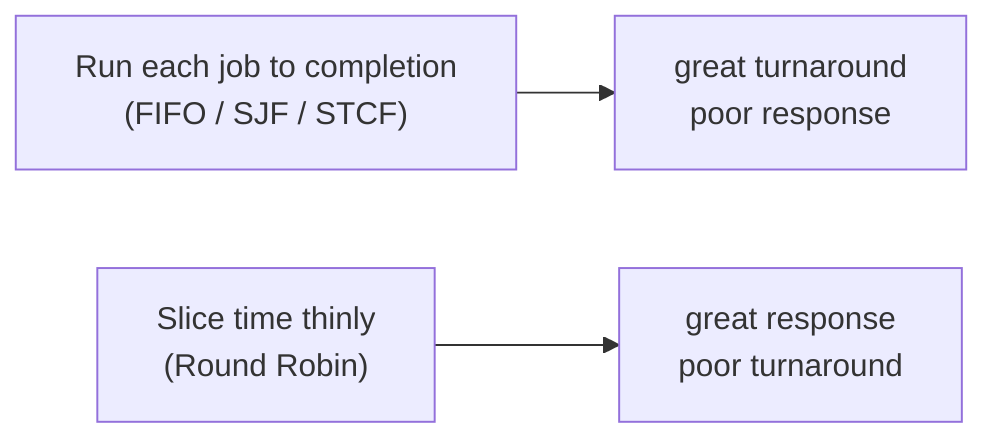

# CPU Scheduling: FIFO, SJF, STCF, RR

**The crux:** given a set of jobs that all want the one CPU, in what order do we run them? There is no single "best" order — it depends on what we are optimizing. Optimize for jobs finishing fast (turnaround) and interactive jobs feel sluggish; optimize for jobs reacting fast (response) and total throughput-per-job suffers. This page builds the classic policies from the simplest assumptions up, watches each assumption break, and lands on the fundamental tension that the next topic (MLFQ) is designed to escape.

## The core idea

- A **scheduling policy** (a discipline) decides which ready job runs next on the CPU. The **mechanism** underneath — context switching, timer interrupts — is assumed to already exist; here we only reason about *order*.
- We judge a policy by **metrics**. Two matter most:
  - **Turnaround time** — how long from a job arriving to it finishing. A *performance* metric; smaller is better for batch work.
  - **Response time** — how long from a job arriving to it *first* getting the CPU. An *interactivity* metric; smaller means a keystroke or click feels instant.
- The whole story is a ladder of assumptions, each dropped in turn:
  1. All jobs arrive at once and run for the same length → **FIFO** is fine.
  2. Jobs differ in length → **SJF** (run the shortest first).
  3. Jobs arrive at different times → **STCF** (preempt for the shortest *remaining*).
  4. We care about response, not just turnaround → **Round Robin** (slice time thinly).
  5. We do not know job lengths in advance → nothing above works cleanly, which motivates **MLFQ**.
- The recurring lesson: **optimizing turnaround and optimizing response pull in opposite directions.** Running a job to completion is great for turnaround and terrible for the response of everyone waiting; slicing thinly is great for response and pads every job's turnaround with switching and waiting.

## How it works

### Metrics, precisely

For a job that **arrives** at time `T_arrival`, first gets the CPU at `T_firstrun`, and **completes** at `T_completion`:

$$
T_{\text{turnaround}} = T_{\text{completion}} - T_{\text{arrival}}
$$

$$
T_{\text{response}} = T_{\text{firstrun}} - T_{\text{arrival}}
$$

We report the **average** over the job set — for $N$ jobs, $\frac{1}{N}\sum_i T_{\text{turnaround},i}$ and likewise for response. Turnaround measures *finishing*; response measures *starting*. A policy can be excellent at one and poor at the other, which is the entire drama below.

### FIFO / FCFS and the convoy effect

- **First-In, First-Out** (also **First-Come, First-Served**) runs jobs to completion in arrival order. It is trivial to implement and, when all jobs are the same length and arrive together, perfectly reasonable.
- It falls apart when a **long job lands first**. Every short job behind it waits for the whole long job before it even starts — the **convoy effect** (short jobs stuck behind a long one, like cars behind a truck).
- Worked example, three jobs arriving at $t=0$ with bursts $A=8$, $B=4$, $C=4$. FIFO runs `A A A A A A A A B B B B C C C C`:

$$
\text{avg turnaround} = \frac{8 + 12 + 16}{3} = 12.00
$$

The two short jobs paid an 8-unit tax just to sit behind $A$.

### SJF — shortest job first

- **Shortest Job First** picks, among available jobs, the one with the smallest total run time, and runs it to completion (non-preemptive).
- For jobs that **all arrive at the same time**, SJF is **provably optimal for average turnaround** — running the shortest first minimizes the total waiting summed across jobs. (Reordering any pair to put the longer one first can only increase total wait.)
- Same three jobs, SJF runs `B B B B C C C C A A A A A A A A`:

$$
\text{avg turnaround} = \frac{4 + 8 + 16}{3} = 9.33
$$

Down from 12.00 — the convoy is gone.

- **What breaks it:** SJF is non-preemptive, so if a short job arrives *just after* a long one has already started, the short job still waits for the long one to finish. Different **arrival times** reintroduce a convoy. And SJF assumes we *know* each job's length up front, which in a real OS we do not.

### STCF / SRTF — preemptive SJF

- **Shortest Time-to-Completion First** (a.k.a. **Shortest Remaining Time First**) fixes the arrival problem: whenever a new job arrives, compare its length to the **remaining** time of the running job and switch if the newcomer is shorter. It is SJF made **preemptive**.
- This restores optimal-average-turnaround behavior even when arrivals are staggered: a freshly arrived short job preempts a long incumbent instead of queueing behind it.
- For our same-arrival example STCF is identical to SJF (nothing new arrives to preempt anything), giving avg turnaround $9.33$.

### Round Robin — slicing for response

- FIFO, SJF, and STCF all optimize turnaround and are **awful for response**: a job that runs to completion makes everyone behind it wait a long time before *starting*.
- **Round Robin** runs each job for a fixed **time slice** (quantum) then moves to the next ready job, cycling forever until all finish. No job waits long before its first slice, so **response time is excellent**.
- Same three jobs, quantum $=2$, RR runs `A A B B C C A A B B C C A A A A`:

$$
\text{avg response} = \frac{0 + 2 + 4}{3} = 2.00
$$

versus FIFO's $6.67$. But turnaround gets **worse**:

$$
\text{avg turnaround} = \frac{16 + 10 + 12}{3} = 12.67
$$

because RR interleaves everything, so most jobs finish late, and each preemption adds context-switch overhead not shown here.

### The fundamental tradeoff



- **Turnaround vs. response is a genuine tension, not an engineering gap.** Batch-optimal policies stretch response; interactive-optimal policies stretch turnaround. You pick a point on the curve; you do not get both ends.
- The **quantum** is RR's dial: smaller quantum sharpens response but multiplies context-switch overhead; larger quantum amortizes switching but drifts back toward FIFO's response. A good quantum is long enough that switching cost is a small fraction of the slice, short enough to keep response snappy.

### The unknown-length problem

- SJF and STCF need to know how long each job will run — but a general-purpose OS scheduling arbitrary programs has **no way to know** a job's future run length.
- We cannot ask, and jobs will not tell (or will lie). The scheduler must instead **learn from the past** — jobs that ran long recently are probably long; jobs that yielded quickly for I/O are probably interactive. That idea — approximate SJF's benefits *and* RR's response *without* knowing lengths, by observing behavior — is exactly the **Multi-Level Feedback Queue**, the next topic.

## Must-know algorithms

A single self-contained simulator implementing **FIFO, SJF, STCF (preemptive), and RR** over the same job set. Each policy computes **average turnaround and average response** and prints a per-tick Gantt-style trace (one character per time unit, `.` = idle). Compile and run with:

```
cc -std=c11 sched.c -o sched && ./sched
```

```c
#include <stdio.h>
#include <string.h>

#define MAXJ 64
#define MAXT 100000

typedef struct { char name; int arrival, burst; } Job;

/* remaining[], first_run[], done_at[] track per-job state during simulation. */
typedef struct {
    int remaining[MAXJ];
    int first_run[MAXJ];   /* -1 until first dispatch */
    int done_at[MAXJ];     /* completion time         */
    char trace[MAXT];      /* per-tick job name, '.' = idle */
    int  ticks;
} Sim;

static void sim_init(Sim *s, Job *j, int n) {
    for (int i = 0; i < n; i++) {
        s->remaining[i] = j[i].burst;
        s->first_run[i] = -1;
        s->done_at[i]   = -1;
    }
    s->ticks = 0;
}

/* Run one unit of job pick at time t; record first-run and completion. */
static void run_tick(Sim *s, Job *j, int pick, int t) {
    if (s->first_run[pick] < 0) s->first_run[pick] = t;
    s->remaining[pick]--;
    s->trace[s->ticks++] = j[pick].name;
    if (s->remaining[pick] == 0) s->done_at[pick] = t + 1;
}

static void idle_tick(Sim *s) { s->trace[s->ticks++] = '.'; }

static int all_done(Sim *s, int n) {
    for (int i = 0; i < n; i++) if (s->remaining[i] > 0) return 0;
    return 1;
}

/* ---- report averages over the job set ---- */
static void report(const char *label, Sim *s, Job *j, int n) {
    double tt = 0, rt = 0;
    printf("%-6s | trace: ", label);
    for (int k = 0; k < s->ticks; k++) putchar(s->trace[k]);
    printf("\n         ");
    for (int i = 0; i < n; i++) {
        int turn = s->done_at[i]   - j[i].arrival;
        int resp = s->first_run[i] - j[i].arrival;
        tt += turn; rt += resp;
        printf("%c[T=%d,R=%d] ", j[i].name, turn, resp);
    }
    printf("\n         avg turnaround = %.2f, avg response = %.2f\n\n",
           tt / n, rt / n);
}

/* ---- FIFO: run jobs to completion in arrival (then index) order ---- */
static void fifo(Job *j, int n) {
    Sim s; sim_init(&s, j, n);
    int t = 0, done = 0;
    while (done < n) {
        int pick = -1;
        for (int i = 0; i < n; i++)
            if (s.remaining[i] > 0 && j[i].arrival <= t)
                if (pick < 0 || j[i].arrival < j[pick].arrival) pick = i;
        if (pick < 0) { idle_tick(&s); t++; continue; }
        while (s.remaining[pick] > 0) { run_tick(&s, j, pick, t); t++; }
        done++;
    }
    report("FIFO", &s, j, n);
}

/* ---- SJF: non-preemptive shortest job first (by burst) among arrived ---- */
static void sjf(Job *j, int n) {
    Sim s; sim_init(&s, j, n);
    int t = 0, done = 0;
    while (done < n) {
        int pick = -1;
        for (int i = 0; i < n; i++)
            if (s.remaining[i] > 0 && j[i].arrival <= t)
                if (pick < 0 || j[i].burst < j[pick].burst) pick = i;
        if (pick < 0) { idle_tick(&s); t++; continue; }
        while (s.remaining[pick] > 0) { run_tick(&s, j, pick, t); t++; }
        done++;
    }
    report("SJF", &s, j, n);
}

/* ---- STCF: preemptive, pick least remaining among arrived each tick ---- */
static void stcf(Job *j, int n) {
    Sim s; sim_init(&s, j, n);
    int t = 0;
    while (!all_done(&s, n)) {
        int pick = -1;
        for (int i = 0; i < n; i++)
            if (s.remaining[i] > 0 && j[i].arrival <= t)
                if (pick < 0 || s.remaining[i] < s.remaining[pick]) pick = i;
        if (pick < 0) { idle_tick(&s); t++; continue; }
        run_tick(&s, j, pick, t); t++;
    }
    report("STCF", &s, j, n);
}

/* ---- RR: fixed quantum, round-robin over a ready queue ---- */
static void rr(Job *j, int n, int q) {
    Sim s; sim_init(&s, j, n);
    int t = 0, done = 0;
    int queue[MAXJ], head = 0, tail = 0;
    int in_q[MAXJ]; memset(in_q, 0, sizeof in_q);

    while (done < n) {
        /* enqueue jobs that have arrived by time t, in arrival/index order */
        for (int i = 0; i < n; i++)
            if (!in_q[i] && s.remaining[i] > 0 && j[i].arrival <= t) {
                queue[tail++ % MAXJ] = i; in_q[i] = 1;
            }
        if (head == tail) { idle_tick(&s); t++; continue; }
        int pick = queue[head++ % MAXJ]; in_q[pick] = 0;
        int slice = 0;
        while (s.remaining[pick] > 0 && slice < q) {
            run_tick(&s, j, pick, t); t++; slice++;
            /* pull in newcomers mid-slice so they queue ahead of preempted job */
            for (int i = 0; i < n; i++)
                if (!in_q[i] && s.remaining[i] > 0 && j[i].arrival <= t && i != pick) {
                    queue[tail++ % MAXJ] = i; in_q[i] = 1;
                }
        }
        if (s.remaining[pick] > 0) { queue[tail++ % MAXJ] = pick; in_q[pick] = 1; }
        else done++;
    }
    char lbl[16]; snprintf(lbl, sizeof lbl, "RR(q=%d)", q);
    report(lbl, &s, j, n);
}

int main(void) {
    /* Worked example: three jobs, same arrival (t=0), bursts 8, 4, 4. */
    Job jobs[] = { {'A',0,8}, {'B',0,4}, {'C',0,4} };
    int n = 3;
    fifo(jobs, n);
    sjf(jobs, n);
    stcf(jobs, n);
    rr(jobs, n, 2);
    return 0;
}
```

Running it prints (numbers match the hand calculations above):

```
FIFO   | trace: AAAAAAAABBBBCCCC
         A[T=8,R=0] B[T=12,R=8] C[T=16,R=12]
         avg turnaround = 12.00, avg response = 6.67

SJF    | trace: BBBBCCCCAAAAAAAA
         A[T=16,R=8] B[T=4,R=0] C[T=8,R=4]
         avg turnaround = 9.33, avg response = 4.00

STCF   | trace: BBBBCCCCAAAAAAAA
         A[T=16,R=8] B[T=4,R=0] C[T=8,R=4]
         avg turnaround = 9.33, avg response = 4.00

RR(q=2) | trace: AABBCCAABBCCAAAA
         A[T=16,R=0] B[T=10,R=2] C[T=12,R=4]
         avg turnaround = 12.67, avg response = 2.00
```

Read the trace as a Gantt chart: SJF cuts average turnaround from FIFO's 12.00 to 9.33 by killing the convoy, while RR crushes average response from 6.67 to 2.00 at the cost of the worst turnaround (12.67). That single table *is* the turnaround-versus-response tradeoff. Selecting the least-remaining job each tick, STCF is a natural fit for a **min-heap keyed on remaining time** — see [Binary Heaps and Heapsort](/docs/dsa/s01-foundations/s01e02-binary-heap-heap-sort) and the [Priority Queue](/docs/patterns/batch-streaming/priority-queue) pattern.

## Interview questions

**1. Define turnaround time versus response time.**
Turnaround is completion minus arrival — how long the job took overall, a batch/throughput metric. Response is first-run minus arrival — how long before the job first got the CPU, an interactivity metric. A policy can win one and lose the other; RR has great response and poor turnaround, FIFO the reverse.

**2. Why is SJF optimal for average turnaround, and what assumptions does it need?**
When all jobs arrive together, running the shortest first minimizes total waiting: swapping any adjacent pair to put the longer job first only increases the summed wait. It needs two assumptions — all jobs present at time zero, and known job lengths. Break either and optimality is lost.

**3. What breaks SJF's optimality?**
Staggered **arrival times** (a short job arriving after a long one has started still waits, since SJF is non-preemptive) and **unknown job lengths** (a real OS cannot know how long an arbitrary program will run). STCF fixes the first with preemption; nothing fixes the second without prediction.

**4. Explain the convoy effect.**
Under FIFO, several short jobs stuck behind one long job all wait for it to finish before starting — like cars queued behind a slow truck. Their turnaround inflates by the long job's whole run time. SJF/STCF avoid it by running or preempting to the short jobs first.

**5. Why does Round Robin improve response but hurt turnaround?**
RR gives every job a slice quickly, so first-run happens early — great response. But it interleaves execution, so most jobs finish much later than if run to completion, and each context switch adds overhead — poor turnaround. It trades finishing-fast for reacting-fast.

**6. Preemptive versus non-preemptive scheduling — what is the difference and why does it matter?**
Non-preemptive schedulers (FIFO, SJF) run a chosen job to completion; preemptive ones (STCF, RR) can stop a running job to switch to another. Preemption is what lets a newly arrived short job jump ahead (STCF) or lets many jobs share the CPU responsively (RR), at the cost of context-switch overhead and the mechanism (timer interrupt) to force the switch.

**7. How do you choose a Round Robin time quantum?**
Balance response against overhead. Too small and context-switch cost dominates the slice, wasting CPU; too large and RR degrades toward FIFO with poor response. A common rule of thumb: make the quantum long enough that switching is a small fraction (single-digit percent) of the slice, while still short enough that the ready jobs all cycle within an interactive time budget (tens of milliseconds).

**8. Can SJF or STCF starve a job? How?**
Yes. If short jobs keep arriving, a long job under SJF/STCF may never be the shortest available and can wait indefinitely — **starvation**. RR avoids starvation (every job cycles) but is not turnaround-optimal. Aging (gradually boosting a long-waiting job's priority) is the usual remedy, and is one of the ideas that leads into MLFQ.

**9. If you only know jobs' past behavior, not their future lengths, how do you approximate SJF?**
Predict from history — jobs that ran long recently are likely long, jobs that yielded quickly for I/O are likely interactive — and demote or promote accordingly. This behavioral approximation of SJF-plus-good-response, without oracle knowledge of lengths, is the **Multi-Level Feedback Queue**.

## Coding problems

### 🎯 Interview (LeetCode)

- **[1834. Single-Threaded CPU](https://leetcode.com/problems/single-threaded-cpu/)** — this problem *is* a scheduler: process tasks by shortest processing time among those that have arrived, ties by index. Directly models SJF with arrival times; the intended solution is a min-heap keyed on processing time. Tests: arrival-gated shortest-job selection.
- **[621. Task Scheduler](https://leetcode.com/problems/task-scheduler/)** — schedule tasks with a cooldown between identical ones, minimizing total time. Tests greedy scheduling of the most-frequent task first (a priority-queue / math argument).
- **[1882. Process Tasks Using Servers](https://leetcode.com/problems/process-tasks-using-servers/)** — assign tasks to servers by weight then index, servers free up over time. Tests dual heaps (free servers, busy servers) and time-driven dispatch — a multi-server scheduler.
- **[253. Meeting Rooms II](https://leetcode.com/problems/meeting-rooms-ii/)** — minimum rooms for overlapping intervals; classic interval scheduling. Tests the sweep-line / min-heap-of-end-times technique that underlies resource scheduling.

### 🏗 Systems (OS-classic)

- **Build the multi-policy scheduler simulator** — implement FIFO, SJF, STCF (preemptive), and RR over a job set with arrivals and bursts, computing average turnaround and average response plus a Gantt trace. The complete reference implementation is the C program in [Must-know algorithms](#must-know-algorithms) above. Extend it with I/O bursts (jobs that block and re-arrive) to see why interactive jobs need response-oriented scheduling. Tests: understanding of each policy's selection rule and the turnaround/response metrics.

## Key takeaways

- Two metrics dominate: **turnaround** ($T_{\text{completion}} - T_{\text{arrival}}$) for finishing fast, **response** ($T_{\text{firstrun}} - T_{\text{arrival}}$) for reacting fast.
- **FIFO** is simple but suffers the **convoy effect** when a long job runs first.
- **SJF** is turnaround-optimal for same-arrival jobs; **STCF** extends that to staggered arrivals via preemption.
- **Round Robin** slices time for excellent response but pays in turnaround and context-switch overhead; the **quantum** is the dial between the two.
- Turnaround and response **fundamentally trade off** — you choose a point, not both ends.
- SJF/STCF need **known job lengths** and can **starve** long jobs; real schedulers must predict from behavior, which is why **MLFQ** comes next.

## Source(s) and further reading

- [OSTEP — Scheduling: Introduction (free PDF)](https://pages.cs.wisc.edu/~remzi/OSTEP/cpu-sched.pdf) — the chapter this page is grounded in (FIFO, SJF, STCF, RR, the turnaround/response tradeoff).
- [OSTEP homepage (all free chapters)](https://pages.cs.wisc.edu/~remzi/OSTEP/) — Arpaci-Dusseau, _Operating Systems: Three Easy Pieces_.
- [Scheduling (computing) — Wikipedia](https://en.wikipedia.org/wiki/Scheduling_(computing)) — overview of policies and metrics.
- [Shortest job next — Wikipedia](https://en.wikipedia.org/wiki/Shortest_job_next) — SJF and its preemptive variant.
- [Shortest remaining time — Wikipedia](https://en.wikipedia.org/wiki/Shortest_remaining_time) — STCF/SRTF.
- [Round-robin scheduling — Wikipedia](https://en.wikipedia.org/wiki/Round-robin_scheduling) — time-slice scheduling and quantum choice.
