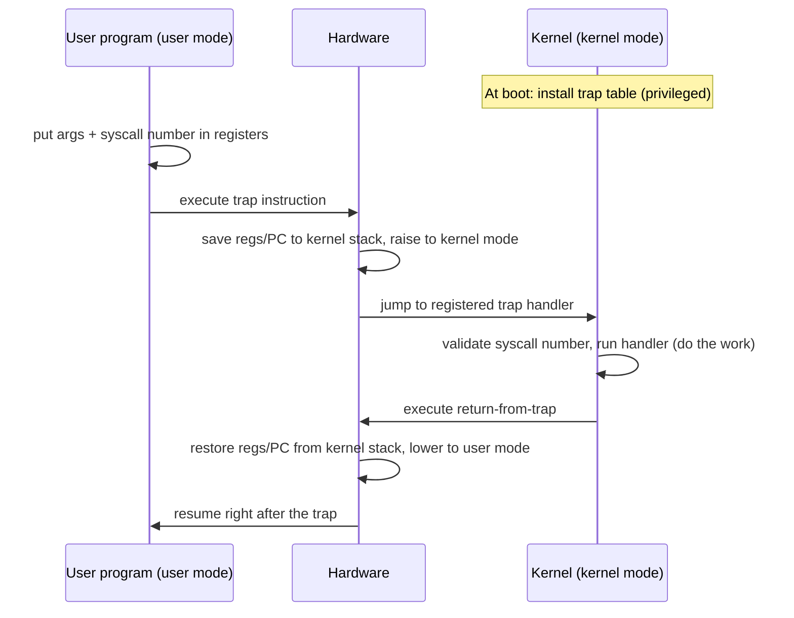
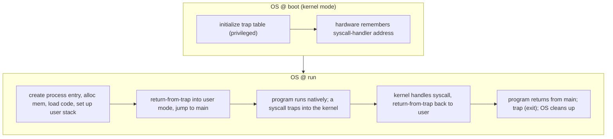
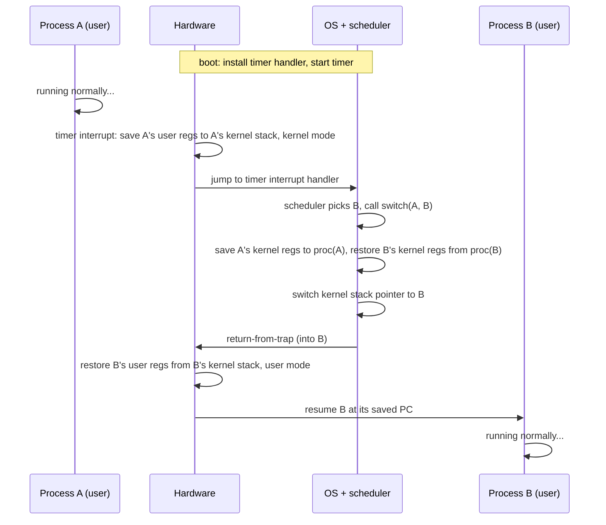

# Limited Direct Execution

**The crux:** the OS wants to run many programs on one CPU *efficiently* — ideally at native hardware speed — while *retaining control* so that no single program can hog the CPU, perform forbidden operations, or read memory it does not own. Pure speed argues for letting the program run directly on the hardware; pure control argues for the OS mediating every instruction. **Limited Direct Execution (LDE)** is the technique that reconciles the two: run the program directly on the CPU for speed, but arrange — with a *judicious bit of hardware support* — a few well-chosen points where the OS regains control and enforces limits.

## The core idea

- **Direct execution = speed.** To start a program the OS creates a process entry, allocates memory, loads the code, sets up the stack, and jumps to `main()`. From there the program runs *natively* on the CPU with no interpreter and no per-instruction OS involvement. This is why processes run at essentially full hardware speed.
- **Unlimited direct execution is a library, not an OS.** If the program runs with zero restrictions it can issue any I/O, touch any memory, and loop forever. The OS would then be "just a library" with no authority. LDE keeps direct execution but *limits* it.
- **Two problems, two hardware-assisted fixes:**
  1. **Restricted operations** — a program must be able to do privileged things (I/O, more memory) without gaining full control of the machine. Fix: **user mode vs kernel mode** plus **system calls** invoked through a **trap** instruction.
  2. **Regaining the CPU** — while a process runs, the OS is *not* running, so how does it ever get the CPU back? Fix: the **timer interrupt** for preemptive scheduling (with the **cooperative** yield/syscall approach as the weaker fallback).
- **The context switch** is the low-level mechanism that actually swaps one running process for another: save the outgoing process's registers, restore the incoming process's registers.

## How it works

### Direct execution (the fast path)

The unlimited version of the protocol is dead simple — the OS sets things up and gets out of the way:

```c
// "Direct execution" without limits (conceptual). Fast, but no control.
void os_run(Program *p) {
    proc_list_add(p);         // create a process entry
    p->mem   = allocate(p);   // allocate memory
    load_code(p);             // load program into memory
    setup_stack(p);           // build the user stack (argc/argv)
    clear_registers();        // clean register state
    call(p->entry);           // jump to main() -- the program now runs natively
    // ... program runs, eventually returns from main ...
    free(p->mem);             // reclaim memory
    proc_list_remove(p);      // remove from process list
}
```

The problem is everything after `call(p->entry)`: the program is running and the OS is not. The rest of LDE is about inserting *limits* without giving up the native-speed execution.

### Problem 1: restricted operations — user mode, kernel mode, and traps

- **Two privilege levels.** The hardware provides at least two modes:
  - **User mode** — application code. Restricted: it *cannot* issue I/O or execute privileged instructions. Attempting one raises an exception and the OS typically kills the process.
  - **Kernel mode** — the OS runs here with full access to the machine (I/O, all instructions, all memory). Real CPUs generalize this to **protection rings** (ring 0 = kernel, ring 3 = user on x86).
- **System calls bridge the gap.** A user program that needs a privileged service (open a file, read a disk, create a process) makes a **system call**. It does *not* jump into arbitrary kernel code. Instead it executes a special **trap** instruction that:
  1. raises the privilege level to kernel mode, and
  2. jumps to a *fixed*, OS-chosen entry point.
- **Why a syscall looks like a function call.** You call `open()` or `read()` like any C function, but hidden inside the C library is the hand-written assembly that puts arguments in the agreed registers/stack, places the **system-call number** in a known register, and executes the trap. On return, library code unpacks the result. You never write the trap assembly yourself — libc already did.
- **The trap table, set at boot.** The kernel cannot let user code name the address to jump to (that would let a program run *any* kernel code — a Very Bad Idea). So at **boot time**, running in kernel mode, the OS uses a *privileged* instruction to tell the hardware where its **trap handlers** live. The hardware remembers these addresses until reboot. When a trap fires, the hardware jumps only to the pre-registered handler.
- **Save state, raise privilege; then return-from-trap lowers it.** On a trap the hardware saves enough of the caller's state — on x86 it pushes the program counter, flags, and a few registers onto a per-process **kernel stack** — moves to kernel mode, and jumps to the handler. When the kernel finishes it executes **return-from-trap**, which restores those saved registers off the kernel stack, drops privilege back to user mode, and resumes the program right after the trap.
- **The number is the protection.** User code cannot pass a target *address*; it passes a *system-call number*. The trap handler validates the number and indexes a dispatch table. Indirection-through-a-validated-number is exactly what stops a program from jumping wherever it likes.

The full trap round-trip for a single system call:



The boot-vs-run phases of the protocol:



### Problem 2: regaining the CPU

While a process runs directly on the CPU, the OS is not on the CPU, so it cannot make any decisions. How does it ever get control back?

- **Cooperative approach (trust the process).** Some early systems (old Mac OS, the Xerox Alto) assumed processes would periodically give up the CPU. In practice a process yields whenever it makes a system call (open a file, send a message) — control transfers to the OS at that trap. Such systems also provide an explicit **yield** system call that does nothing except hand control back. Illegal actions (divide-by-zero, bad memory access) also trap into the OS.
  - **The fatal flaw:** a process stuck in an infinite loop that never makes a system call *never* yields. The only recourse is to reboot the machine. Cooperation is not enough for a robust OS.
- **Non-cooperative approach: the timer interrupt.** A **timer device** is programmed at boot to raise an **interrupt** every few milliseconds. When it fires, the hardware halts the running process, saves enough of its state, and runs a pre-configured **interrupt handler** in the OS. The OS is now back in control and can decide to keep running the current process or switch away. This guarantees the OS regains the CPU *even from a rogue infinite loop* — it is what makes true **preemptive** multitasking possible.
  - Two boot-time privileged steps enable this: **install the timer's interrupt handler** in the trap table, and **start the timer**.

- **The context switch.** Once the OS has control (via syscall or timer) and its **scheduler** decides to switch, it runs a low-level routine — the **context switch** — that:
  1. saves the general-purpose registers, program counter, and kernel stack pointer of the *current* process into its process structure (or its kernel stack), and
  2. restores the saved registers, PC, and kernel stack pointer of the *next* process.

  By swapping the kernel stack pointer, the kernel *enters* the switch routine in the context of process A and *returns* from it in the context of process B. The subsequent return-from-trap then resumes B in user mode.
- **Two kinds of register save/restore happen.** On a timer interrupt the *user* registers of the running process are saved implicitly by the **hardware** onto that process's kernel stack. Inside the switch, the *kernel* registers are saved explicitly by the **software** (the OS) into the process structure. One is the hardware's job on trap entry; the other is the OS's job during the switch.

The timeline of a timer interrupt driving a context switch from process A to process B:



### Cost model (KaTeX)

A **mode switch** (trap into the kernel and return) is relatively cheap — it saves a small register set and does not change which address space is active. A **context switch** is more expensive because it swaps the running process: registers, stack pointer, and (across processes) the address space, plus the indirect cost of cold caches and TLB refills afterward. Roughly:

$$
T_\text{context switch} = T_\text{save/restore regs} + T_\text{scheduler} + T_\text{TLB/cache refill}
$$

The direct register-swap cost is small; the *indirect* cache/TLB cost after the switch often dominates, which is why excessive switching hurts throughput.

## Must-know algorithms

### 1. A faithful context-switch model (save/restore a register set)

This is a portable-C behavioral model of what an assembly `switch()` routine does: a process *is* its saved register set plus its stack; `swtch(cur, nxt)` copies the live registers out into `cur` and copies `nxt`'s saved registers in. A tiny round-robin scheduler dispatches one time-slice at a time, and the per-process registers (`pc`, `acc`, `sp`) survive across slices because the switch saved and restored them — the observable behavior of a real context switch, without non-portable stack-pointer tricks.

```c
// A faithful behavioral model of an OS context switch, written in portable C.
//
// The real mechanism (xv6 swtch, Linux switch_to) is hand-written assembly that
// saves the callee-saved registers + stack pointer of the outgoing process into
// its proc structure and loads them for the incoming process, so that "ret"
// resumes a different thread of control. The load-bearing idea is: a process is
// nothing but its saved register set + stack, and swtch() copies one set out and
// another set in. We model that copy faithfully with an explicit Context and an
// explicit per-process program counter (a resumable step index), so each process
// picks up exactly where it left off -- the observable behavior of a real switch.

#include <stdio.h>
#include <stdint.h>

typedef struct {
    int      pc;          // resume point (models the saved instruction pointer)
    uint64_t acc;         // a general-purpose register we can observe
    int      sp;          // stack pointer: index into this process's own stack
    int      stack[8];    // this process's private (kernel) stack
    int      done;        // has this process finished?
} Context;

#define NPROC 2
#define NSTEP 3

static Context proc[NPROC];
static int     switches;   // number of context switches performed

// swtch(cur, nxt): the C-level analogue of the assembly switch routine.
// Save the live registers into *cur, then restore *nxt's registers into the
// live variables the CPU will use. The caller "enters as cur, leaves as nxt".
static void swtch(Context *cur, Context *nxt,
                  int *pc, uint64_t *acc, int *sp) {
    cur->pc = *pc; cur->acc = *acc; cur->sp = *sp;   // save outgoing registers
    *pc = nxt->pc; *acc = nxt->acc; *sp = nxt->sp;   // restore incoming registers
    switches++;
}

// Run one time-slice of process `id`: load its saved registers, execute exactly
// one step from where its pc left off, then save registers back. This is the
// body the scheduler dispatches to on each tick -- a single unit of forward
// progress bracketed by a register restore (in) and a register save (out).
static void run_slice(int id) {
    int      pc, sp;                 // live "registers" for this slice
    uint64_t acc;
    Context  scratch;                // where swtch parks the previous occupant

    // Restore this process's saved registers onto the (live) CPU registers.
    swtch(&scratch, &proc[id], &pc, &acc, &sp);

    if (pc < NSTEP) {                // one step of application work
        int work = id * 10 + pc;
        proc[id].stack[sp % 8] = work; // push a value onto our private stack
        sp++;
        acc += (uint64_t)work;
        pc++;
        printf("proc %d: step %d  acc=%llu  sp=%d\n",
               id, pc - 1, (unsigned long long)acc, sp);
        if (pc == NSTEP) proc[id].done = 1;
    }

    // Save this process's registers back into its Context for next time.
    swtch(&proc[id], &scratch, &pc, &acc, &sp);
}

int main(void) {
    for (int i = 0; i < NPROC; i++) {
        proc[i].pc = 0; proc[i].acc = 0; proc[i].sp = 0; proc[i].done = 0;
    }

    // Round-robin scheduler: keep giving each unfinished process one time-slice
    // until all have completed. Each dispatch is one context switch in + out.
    int remaining = NPROC;
    while (remaining > 0) {
        for (int i = 0; i < NPROC; i++)
            if (!proc[i].done) run_slice(i);
        remaining = 0;
        for (int i = 0; i < NPROC; i++) if (!proc[i].done) remaining++;
    }

    printf("total context switches: %d\n", switches);
    printf("proc 0 final acc = %llu (expect 0+1+2=3)\n",
           (unsigned long long)proc[0].acc);
    printf("proc 1 final acc = %llu (expect 10+11+12=33)\n",
           (unsigned long long)proc[1].acc);
    return 0;
}
```

Output — the two processes interleave one step at a time and each keeps its own accumulator across switches:

```text
proc 0: step 0  acc=0  sp=1
proc 1: step 0  acc=10  sp=1
proc 0: step 1  acc=1  sp=2
proc 1: step 1  acc=21  sp=2
proc 0: step 2  acc=3  sp=3
proc 1: step 2  acc=33  sp=3
total context switches: 12
proc 0 final acc = 3 (expect 0+1+2=3)
proc 1 final acc = 33 (expect 10+11+12=33)
```

### 2. A trap-dispatch table (function-pointer table indexed by syscall number)

The software core of the trap mechanism: at "boot" the kernel installs a table of handler function pointers; on a "trap" the single kernel entry point validates the caller-supplied **system-call number** and dispatches through the table. An out-of-range number is *rejected*, never dispatched — the validated indirection is the protection that keeps user code from jumping into arbitrary kernel routines.

```c
// Trap-dispatch table demo: a function-pointer table indexed by system-call
// number -- the software heart of the trap mechanism.
//
// When user code executes a trap instruction, the hardware raises privilege and
// jumps to a single kernel entry point using the trap table configured at boot.
// That entry point reads the syscall number the user placed in a register and
// uses it to index a dispatch table of handlers. This models exactly that step:
// syscall(num, arg) validates num, then calls handlers[num]. An out-of-range
// number is rejected (the real kernel's "is it valid?" check) rather than
// jumping to an attacker-chosen address -- the indirection is the protection.

#include <stdio.h>
#include <stdint.h>

// System-call numbers (like Linux's asm/unistd.h __NR_* constants).
enum {
    SYS_WRITE = 0,
    SYS_GETPID,
    SYS_DOUBLE,
    SYS_MAX          // one past the last valid number: the table size
};

// A trap frame: what the user placed in registers before the trap. In a real
// kernel these come off the saved register set on the kernel stack.
typedef struct {
    long a0;         // first argument
    long ret;        // return value written back to the caller
} TrapFrame;

// Each handler is a kernel routine invoked in kernel mode on behalf of user code.
static void sys_write(TrapFrame *f) {
    printf("[kernel] write(fd/val=%ld)\n", f->a0);
    f->ret = f->a0;                 // pretend we wrote a0 bytes
}
static void sys_getpid(TrapFrame *f) {
    (void)f->a0;
    f->ret = 4242;                  // a fixed fake pid
}
static void sys_double(TrapFrame *f) {
    f->ret = f->a0 * 2;             // a trivial compute syscall
}

// THE TRAP TABLE: function pointers indexed by syscall number, set up "at boot".
typedef void (*Handler)(TrapFrame *);
static Handler trap_table[SYS_MAX];

static void boot_init_trap_table(void) {
    trap_table[SYS_WRITE]  = sys_write;
    trap_table[SYS_GETPID] = sys_getpid;
    trap_table[SYS_DOUBLE] = sys_double;
}

// The single kernel trap entry point. Validate the number (protection!), then
// dispatch through the table. Returns 0 on success, -1 on a bad syscall number.
static int syscall(int num, long arg, long *out) {
    if (num < 0 || num >= SYS_MAX || trap_table[num] == NULL) {
        fprintf(stderr, "[kernel] bad syscall number %d -> rejected\n", num);
        return -1;                  // real kernels return -ENOSYS, don't jump
    }
    TrapFrame f = { .a0 = arg, .ret = 0 };
    trap_table[num](&f);            // enter handler in "kernel mode"
    *out = f.ret;                   // return-from-trap: hand result back to user
    return 0;
}

int main(void) {
    boot_init_trap_table();         // OS @ boot: install the trap table

    long r;
    if (syscall(SYS_WRITE, 100, &r) == 0)  printf("user: write  -> %ld\n", r);
    if (syscall(SYS_GETPID, 0, &r) == 0)   printf("user: getpid -> %ld\n", r);
    if (syscall(SYS_DOUBLE, 21, &r) == 0)  printf("user: double -> %ld\n", r);

    // An invalid syscall number must be rejected, not dispatched.
    if (syscall(99, 0, &r) != 0)           printf("user: syscall 99 was refused\n");
    return 0;
}
```

Output — three valid calls dispatch to their handlers; the out-of-range number 99 is refused:

```text
[kernel] bad syscall number 99 -> rejected
[kernel] write(fd/val=100)
user: write  -> 100
user: getpid -> 4242
user: double -> 42
user: syscall 99 was refused
```

Both programs compile with `cc -std=c11` (drive each with `-x c`) and run exactly as shown above.

## Interview questions

1. **What is a system call, and how does the trap mechanism work?**
   A system call is the controlled way user code requests a privileged service from the kernel (I/O, process creation, memory). It executes a **trap** instruction, which atomically raises privilege to kernel mode and jumps to a *fixed* kernel entry point registered in the trap table at boot. The hardware saves the caller's state on the kernel stack; the kernel reads the system-call number, validates it, runs the handler, and executes **return-from-trap**, which restores state and drops back to user mode. Crucially the user passes a *number*, not an address.

2. **User mode vs kernel mode — what's the difference and why have both?**
   In **user mode**, code is restricted: no direct I/O, no privileged instructions; a violation traps and is usually fatal. In **kernel mode**, the OS has full access to the machine. The split (x86 protection rings 0 and 3) provides **protection and isolation**: buggy or malicious programs cannot bypass the OS to touch hardware or another process's memory. Without it, any program could take over the machine.

3. **How does the OS regain control of the CPU — cooperative vs timer interrupt?**
   **Cooperative:** the OS trusts processes to yield — control returns whenever a process makes a system call (or an explicit `yield`) or triggers an illegal-operation trap. Weakness: a process in an infinite loop that makes no syscalls never yields, so the only fix is reboot. **Timer interrupt:** a hardware timer, programmed at boot, raises an interrupt every few milliseconds; the hardware halts the process and runs the OS handler, guaranteeing the OS regains control even from a rogue loop. This enables **preemptive** scheduling.

4. **What does a context switch save and restore, and who initiates it?**
   It saves the general-purpose registers, program counter, and kernel stack pointer of the outgoing process (into its process structure), and restores those of the incoming process. Swapping the kernel stack pointer makes the switch routine *enter* as one process and *return* as another. The **scheduler** (part of the OS) initiates it, after the OS has already gained control via a system call or a timer interrupt.

5. **Trap vs interrupt vs exception — what's the difference?**
   All three transfer control into the kernel via the trap/interrupt table, but by cause and timing:
   - **Trap** — a *synchronous, intentional* transition caused by executing a trap/syscall instruction (a deliberate request for kernel service).
   - **Interrupt** — an *asynchronous* event from an external device (timer, disk, NIC) unrelated to the current instruction.
   - **Exception (fault)** — a *synchronous, involuntary* condition raised by an instruction itself (divide-by-zero, page fault, illegal instruction, bad memory access).

6. **Cost of a mode switch vs a context switch?**
   A **mode switch** (trap in, return-from-trap out) is cheap: it saves/restores a small register set and stays in the *same* address space. A **context switch** is more expensive: it swaps registers, the kernel stack pointer, and — across processes — the address space, and it leaves caches and the TLB cold, so the *indirect* refill cost after the switch often dominates the direct register-swap cost. This is why systems try to minimize unnecessary switching.

7. **Why can't user code just supply the kernel address to jump to on a system call?**
   Because that would let a program jump to *any* kernel instruction — for example, past a permission check — and thereby run privileged code of its choosing. Instead the kernel controls the entry points (the trap table, installed with a privileged instruction at boot) and user code passes only a validated system-call *number*. The indirection is the security boundary.

8. **Why is installing the trap table (and starting the timer) a privileged operation?**
   If user code could set the trap table, it could point the syscall or timer handler at its own code and execute it in kernel mode — total compromise. Likewise, if it could stop the timer, it could disable preemption and hog the CPU forever. Both must be doable only in kernel mode, at boot, so the OS alone controls where traps go and that preemption stays on.

9. **During a timer interrupt, which registers are saved by hardware vs by the OS?**
   On the interrupt, the **hardware** implicitly saves the running process's *user* registers onto that process's kernel stack. Inside the switch routine, the **OS software** explicitly saves the *kernel* registers into the process structure. Restore is symmetric on the way back out (OS restores kernel regs; return-from-trap lets the hardware restore user regs).

## Coding problems

- 🎯 **Interview — Design an Ordered Stream (LeetCode 1656).** Tests dispatch-by-index/state-machine reasoning: insert values at numbered slots and emit contiguous runs as a pointer advances — the same "index into a table, act on the entry" pattern as a syscall-number dispatch. [leetcode.com/problems/design-an-ordered-stream](https://leetcode.com/problems/design-an-ordered-stream/)
- 🎯 **Interview — Design Circular Queue (LeetCode 622).** Tests bounded ring-buffer state management with head/tail indices modulo capacity — the data-structure skeleton behind a kernel run queue or a per-process kernel stack. [leetcode.com/problems/design-circular-queue](https://leetcode.com/problems/design-circular-queue/)
- 🏗 **Systems — Build a syscall dispatch table.** Implement a function-pointer table indexed by system-call number: a single `syscall(num, args)` entry point that validates `num`, rejects out-of-range numbers, and dispatches to the registered handler. This is the trap-dispatch demo above; the exercise is the core of every real kernel's syscall path. Reference: the Linux `syscall(2)` man page. [man7.org/linux/man-pages/man2/syscall.2.html](https://man7.org/linux/man-pages/man2/syscall.2.html)

## Key takeaways

- **LDE = direct execution + limits.** Run the program natively for speed, but use hardware support to insert points where the OS regains control.
- **User/kernel mode + traps** solve *restricted operations*: user code requests privileged services via a trap that raises privilege and jumps to an OS-controlled handler, then `return-from-trap` lowers privilege.
- **The trap table is installed at boot** with a privileged instruction; user code passes a validated *syscall number*, never an address — that indirection is the protection.
- **The timer interrupt** solves *regaining the CPU*: it guarantees the OS gets control back even from an uncooperative infinite loop, enabling preemptive multitasking. Cooperative yielding is the weaker fallback.
- **The context switch** saves the outgoing process's registers/PC/stack pointer and restores the incoming one's; the scheduler drives it. A mode switch is cheap; a context switch is costlier, largely due to cold caches and TLB refills.

## Source(s) and further reading

- OSTEP — *Mechanism: Limited Direct Execution* (free chapter PDF): [pages.cs.wisc.edu/~remzi/OSTEP/cpu-mechanisms.pdf](https://pages.cs.wisc.edu/~remzi/OSTEP/cpu-mechanisms.pdf) · full book: [pages.cs.wisc.edu/~remzi/OSTEP](https://pages.cs.wisc.edu/~remzi/OSTEP/)
- Wikipedia — [System call](https://en.wikipedia.org/wiki/System_call), [Protection ring](https://en.wikipedia.org/wiki/Protection_ring), [Context switch](https://en.wikipedia.org/wiki/Context_switch), [Interrupt](https://en.wikipedia.org/wiki/Interrupt)
- Linux man pages — [syscall(2)](https://man7.org/linux/man-pages/man2/syscall.2.html), [sched_yield(2)](https://man7.org/linux/man-pages/man2/sched_yield.2.html)
