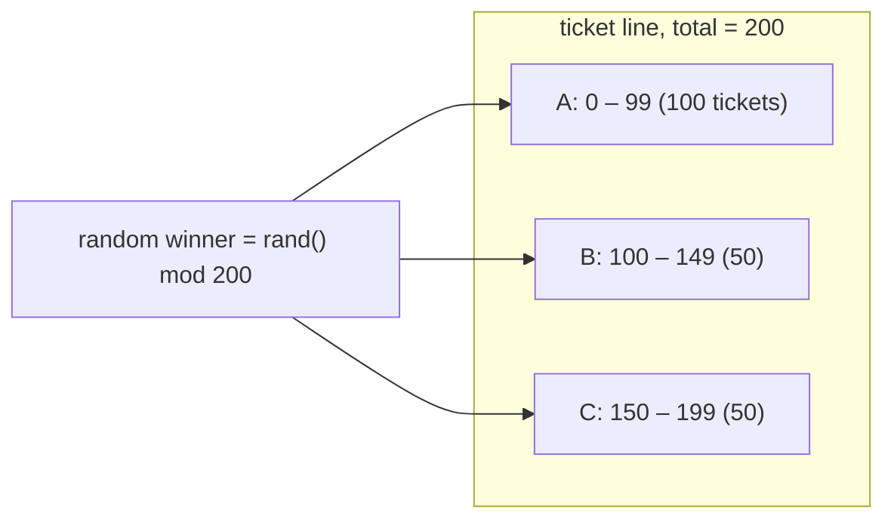
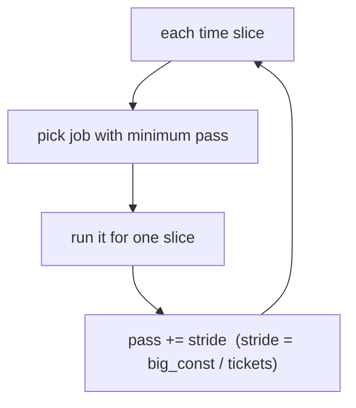

# Lottery & Stride Scheduling (Proportional Share)

Classic schedulers optimize *time* metrics — turnaround (SJF/STCF) or response (round-robin). Proportional-share schedulers optimize a different thing entirely: a *fraction of the CPU*. **The crux: instead of trying to minimize turnaround or response time, how do we build a scheduler that guarantees each job receives a specified share of the CPU** — say job A gets 50% and jobs B and C get 25% each — and does so simply, with graceful handling of jobs that come and go? Lottery scheduling answers this with randomness (hold a lottery each time slice, the winner runs); stride scheduling answers it deterministically (walk a per-job counter). Both are the intellectual ancestors of Linux CFS.

## The core idea

- **Fair-share / proportional-share goal.** Each job is assigned some number of **tickets**. The scheduler's guarantee is that over time, job `i` receives CPU time proportional to its ticket count — not "run the shortest job," but "give everyone their slice of the pie."
- **Expected share.** If job `i` holds `tickets_i` out of `total` tickets across all runnable jobs, its target share of the CPU is

$$
\text{share}_i = \frac{\text{tickets}_i}{\text{total}}
$$

- **Two ways to hit that share:**
  - **Lottery** — pick the winner *randomly*, weighting the draw by tickets. Probabilistically fair; converges to the target share over many slices; needs no global bookkeeping.
  - **Stride** — pick the winner *deterministically* by tracking a per-job counter. Exact even over short runs; needs a small amount of global state.
- **Why tickets are a good abstraction.** A ticket is a relative, composable unit. Doubling everyone's tickets changes nothing; only *ratios* matter. That makes tickets easy to reason about and easy to move around (currency, transfer, inflation — below).

## How it works

### Lottery scheduling

- **Mechanism.** Every scheduling decision, the OS picks a random number in `[0, total)` and holds a *lottery*: it walks the list of runnable jobs, summing tickets, and the job whose cumulative range contains the winning number runs for that slice.
- **Weighted random selection.** This is exactly "pick an index with probability proportional to its weight." Lay the tickets out on a number line and see where the random dart lands:



- **Probabilistically fair.** A single draw proves nothing — B *could* win ten slices in a row. But by the law of large numbers the achieved share converges to the target as the number of slices grows. The expected number of times job `i` wins over `N` slices is `N · share_i`, and the relative error shrinks like `1/√N`.
- **Ticket mechanisms** (from the Waldspurger & Weihl lottery paper, summarized in OSTEP):
  - **Ticket currency.** A user/group holds tickets in its *own* currency and can hand them out to its jobs in that currency; the scheduler converts each currency to the global scale. This lets a user subdivide its slice without affecting anyone else.
  - **Ticket transfer.** A job can temporarily hand its tickets to another — e.g. a client blocked on a server transfers its tickets so the server runs sooner (a clean fix for priority-inversion-style problems).
  - **Ticket inflation.** In a *cooperative* (mutually trusting) group, a job can raise its own ticket count to grab more CPU when it needs it, without asking a central authority. Dangerous among untrusting jobs — one greedy job could inflate to monopolize the CPU.

Here is a complete, runnable lottery scheduler. Running it on the 100/50/50 split shows the achieved share converging to the 50/25/25 target:

```c
#include <stdio.h>
#include <stdlib.h>
#include <time.h>

typedef struct { const char *name; int tickets; long ran; } Job;

/* Weighted random selection: walk the ticket line until the running
   counter passes the winning number. O(n) per draw. */
int hold_lottery(Job *jobs, int n, int total) {
    int winner = rand() % total;   /* 0 .. total-1 */
    int counter = 0;
    for (int i = 0; i < n; i++) {
        counter += jobs[i].tickets;
        if (counter > winner) return i;
    }
    return n - 1; /* unreachable when total is the true ticket sum */
}

int main(void) {
    srand(12345);
    Job jobs[] = { {"A",100,0}, {"B",50,0}, {"C",50,0} };
    int n = 3, total = 0;
    for (int i = 0; i < n; i++) total += jobs[i].tickets;

    int slices = 200000;
    for (int t = 0; t < slices; t++) jobs[hold_lottery(jobs, n, total)].ran++;

    printf("Lottery (%d slices, tickets 100/50/50):\n", slices);
    for (int i = 0; i < n; i++)
        printf("  %s target %5.1f%%  achieved %5.1f%%\n",
               jobs[i].name, 100.0 * jobs[i].tickets / total,
               100.0 * jobs[i].ran / slices);
    return 0;
}
```

Output:

```
Lottery (200000 slices, tickets 100/50/50):
  A target  50.0%  achieved  49.9%
  B target  25.0%  achieved  25.0%
  C target  25.0%  achieved  25.1%
```

The shares are close but not exact — that is the signature of a *probabilistic* scheduler. Over fewer slices the error would be larger.

### Stride scheduling

- **Motivation.** Lottery only *approaches* the right share; over short intervals it can be off. Stride scheduling (Waldspurger) makes the shares *exact* by replacing the dice with a deterministic counter.
- **Stride = inverse of tickets.** Pick a large constant and give each job a **stride** inversely proportional to its tickets:

$$
\text{stride}_i = \frac{\text{big\_const}}{\text{tickets}_i}
$$

More tickets → smaller stride → the job's counter advances slowly → it gets picked more often. In our example, `big_const = 10000` gives strides `100 / 200 / 200`.

- **Pass counters.** Every job carries a **pass** value, initialized to 0. The rule each slice:
  1. Run the job with the **lowest pass**.
  2. **Advance** that job's pass by its stride.
- Because a job with half the tickets has twice the stride, its pass climbs twice as fast, so it is chosen half as often — *exactly* the target ratio.



Here is the deterministic stride scheduler. On the same 100/50/50 split it lands on the target share *exactly*:

```c
#include <stdio.h>

typedef struct { const char *name; int tickets; long stride; long pass; long ran; } Job;

#define BIG 10000L   /* big constant; divisible by these ticket counts */

int pick_min_pass(Job *jobs, int n) {
    int m = 0;
    for (int i = 1; i < n; i++)
        if (jobs[i].pass < jobs[m].pass) m = i;
    return m;
}

int main(void) {
    Job jobs[] = { {"A",100,0,0,0}, {"B",50,0,0,0}, {"C",50,0,0,0} };
    int n = 3, total = 0;
    for (int i = 0; i < n; i++) {
        jobs[i].stride = BIG / jobs[i].tickets;  /* fewer tickets -> bigger stride */
        total += jobs[i].tickets;
    }

    int slices = 200000;
    for (int t = 0; t < slices; t++) {
        int w = pick_min_pass(jobs, n);
        jobs[w].pass += jobs[w].stride;  /* advance the winner by its stride */
        jobs[w].ran++;
    }

    printf("Stride (%d slices, tickets 100/50/50, strides %ld/%ld/%ld):\n",
           slices, jobs[0].stride, jobs[1].stride, jobs[2].stride);
    for (int i = 0; i < n; i++)
        printf("  %s target %5.1f%%  achieved %5.1f%%\n",
               jobs[i].name, 100.0 * jobs[i].tickets / total,
               100.0 * jobs[i].ran / slices);
    return 0;
}
```

Output:

```
Stride (200000 slices, tickets 100/50/50, strides 100/200/200):
  A target  50.0%  achieved  50.0%
  B target  25.0%  achieved  25.0%
  C target  25.0%  achieved  25.0%
```

### The tradeoff

- **Lottery — no global state, graceful with churn.** A lottery is stateless: each draw only needs the current ticket totals. When a **new job arrives**, you just add its tickets; there is no counter for it to have missed. That makes lottery ideal when jobs come and go frequently.
- **Stride — exact but stateful.** Stride needs a persistent per-job `pass`. When a new job joins mid-run its pass starts at 0 — far below everyone else's — so it would **monopolize the CPU** until it catches up. Real implementations set a joining job's pass to the current *global minimum* (or global pass value) to avoid that, which is extra bookkeeping lottery never needs.
- **Summary:**

| Property | Lottery | Stride |
| --- | --- | --- |
| Selection | randomized draw | deterministic min-pass |
| Fairness | probabilistic, converges over time | exact, even short-term |
| Global state | none (just ticket totals) | per-job `pass` counters |
| New job joins | trivial (add tickets) | must set `pass` to global min |
| Failure mode | short-run deviation | new job starves others if `pass = 0` |

### Linux CFS: a modern fair scheduler

- Linux's **Completely Fair Scheduler** (default 2.6.23 through 6.5, before EEVDF) is a proportional-share scheduler whose core is *stride-like*. Each task tracks a **virtual runtime** (`vruntime`) — accumulated runtime scaled by the task's weight (derived from its `nice` value). CFS always runs the task with the **lowest `vruntime`**, then advances that task's `vruntime` as it runs.
- That is exactly the stride rule with `vruntime` playing the role of `pass` and the weight playing the role of tickets: lower-weight (higher-`nice`) tasks accumulate `vruntime` faster and so run less. CFS keeps runnable tasks in a red-black tree keyed by `vruntime` for `O(log n)` "pick the minimum," and sets a newcomer's `vruntime` near the current minimum — the same "avoid starving everyone else" fix stride needs.

## Must-know algorithms

Both are implemented above and are compile-tested (`cc -std=c11`):

1. **Lottery scheduler** — weighted random selection by tickets: draw `rand() % total`, walk the cumulative ticket line, winner runs. Probabilistically fair.
2. **Stride scheduler** — `stride = big_const / tickets`, per-job `pass`, run the minimum-pass job and advance its pass by its stride. Exactly proportional.

Run on a 100/50/50 ticket split, lottery achieves ~49.9/25.0/25.1% and stride achieves an exact 50.0/25.0/25.0%.

## Interview questions

**1. What is proportional-share (fair-share) scheduling?**
A scheduling discipline whose objective is not turnaround or response time but a *fraction of the CPU*: each job holds some number of tickets (or weight) and is guaranteed CPU time proportional to its share, `tickets_i / total`. Lottery and stride are the canonical implementations; Linux CFS is the modern production example.

**2. How does lottery scheduling achieve fairness, and why is it only probabilistic?**
Each slice it draws a random number in `[0, total)` and runs the job whose cumulative ticket range contains it, so the probability job `i` wins equals `tickets_i / total`. It is only *probabilistic* because any finite run is a sample: a job can win several slices in a row by chance. By the law of large numbers the achieved share converges to the target as slices grow (error shrinks like `1/√N`), but short intervals can deviate.

**3. Lottery vs stride — compare them.**
Both target the same shares. Lottery is *randomized* and *stateless* — no per-job counters, so new jobs are trivial to add (just add tickets) and short-run fairness is approximate. Stride is *deterministic* and keeps a per-job `pass` counter, giving *exact* shares even short-term, but a newly arriving job with `pass = 0` would monopolize the CPU until it catches up, so you must initialize its pass to the current global minimum. Rule of thumb: lottery for churn and simplicity, stride for exactness.

**4. Explain ticket currency, ticket transfer, and ticket inflation.**
*Currency* lets a user allocate tickets to its own jobs in a private denomination that the scheduler converts to the global scale — a user can subdivide its share locally without affecting others. *Transfer* lets a job hand its tickets to another temporarily (e.g. a client passes tickets to the server it is blocked on, boosting the server). *Inflation* lets a job raise its own ticket count to grab more CPU — safe only among mutually trusting (cooperative) jobs, since a greedy job could otherwise inflate to starve everyone.

**5. Why does a new job break stride scheduling, and how is it fixed?**
Stride picks the minimum-pass job. A newcomer starting at `pass = 0` sits far below every existing job's pass, so it wins every slice until its pass climbs up to theirs — starving the others meanwhile. The fix is to initialize the newcomer's pass to the current global minimum pass, so it slots in fairly. Lottery has no such problem because it has no counter to reset.

**6. How does Linux CFS relate to stride scheduling?**
CFS is stride under a different name. It tracks each task's **`vruntime`** (runtime scaled by weight, from `nice`), always runs the lowest-`vruntime` task, and advances that task's `vruntime` as it runs — identical in structure to "run min-pass, advance by stride," with `vruntime`≈`pass` and weight≈tickets. It stores runnable tasks in a red-black tree for `O(log n)` minimum selection and places new tasks near the current minimum `vruntime` (the same starvation fix stride needs).

**7. How do you implement weighted random selection efficiently?**
Build the **prefix sums** of the weights once (`O(n)`), then per pick draw `r` in `[0, total)` and **binary-search** for the first prefix strictly greater than `r` — `O(log n)` per pick. This is exactly LeetCode 528, and it is precisely a single lottery draw. The linear-walk version in the scheduler above is fine for a handful of jobs; the prefix-sum + binary-search version wins when there are many weights and many draws.

**8. Does lottery/stride optimize turnaround or response time?**
Neither directly. Their guarantee is a *proportional share* of CPU. You can approximate priorities by handing more tickets to latency-sensitive jobs, and short time slices help responsiveness, but if your goal is minimizing average turnaround you want SJF/STCF, and for interactivity you want MLFQ or a small-quantum round-robin. Proportional-share shines when you must *guarantee* fractions of the machine (e.g. multi-tenant isolation).

## Coding problems

### 🎯 Interview (LeetCode)

- **[528. Random Pick with Weight](https://leetcode.com/problems/random-pick-with-weight/)** — *tests:* weighted random selection via prefix sums + binary search. **This IS lottery ticket selection** — `pickIndex` is one lottery draw. Reference (compile-tested):

```c
#include <stdlib.h>

typedef struct { int *prefix; int n; int total; } Solution;

Solution *solutionCreate(int *w, int wSize) {
    Solution *s = malloc(sizeof(Solution));
    s->prefix = malloc(sizeof(int) * wSize);
    s->n = wSize;
    int run = 0;
    for (int i = 0; i < wSize; i++) { run += w[i]; s->prefix[i] = run; }
    s->total = run;
    return s;
}

/* Draw r in [0,total) and binary-search the first prefix > r. */
int solutionPickIndex(Solution *s) {
    int target = rand() % s->total;
    int lo = 0, hi = s->n - 1;
    while (lo < hi) {
        int mid = lo + (hi - lo) / 2;
        if (s->prefix[mid] > target) hi = mid; else lo = mid + 1;
    }
    return lo;
}
```

- **[470. Implement Rand10() Using Rand7()](https://leetcode.com/problems/implement-rand10-using-rand7/)** — *tests:* building a uniform generator from a smaller one via rejection sampling — the same "unbiased random draw" reasoning that lottery correctness depends on.

### 🏗 Systems (OS-classic)

- **Implement a lottery scheduler** — *tests:* weighted random selection over runnable jobs; verify the achieved share converges to `tickets_i / total`. (Full C above.)
- **Implement a stride scheduler** — *tests:* `stride = big_const / tickets`, min-pass selection, pass advancement; verify shares are exact, and handle a job that joins mid-run by setting its pass to the global minimum. (Full C above.)

## Key takeaways

- Proportional-share scheduling targets a **fraction of the CPU** (`share_i = tickets_i / total`), not turnaround or response time.
- **Lottery** = random weighted draw each slice: stateless, handles new jobs trivially, but only **probabilistically** fair (converges over time).
- **Stride** = deterministic min-pass with `stride = big_const / tickets`: **exact** shares, but needs per-job `pass` state and care when jobs join (set pass to global min).
- Ticket **currency / transfer / inflation** make tickets a flexible, composable currency for delegating and redistributing CPU share.
- **Linux CFS** is the production descendant — `vruntime` is stride's `pass`, weight is tickets, red-black tree gives `O(log n)` min-selection.
- **Weighted random selection** (prefix sums + binary search, LeetCode 528) is the algorithmic heart of a lottery draw.

## Source(s) and further reading

- OSTEP — [Scheduling: Proportional Share (lottery & stride)](https://pages.cs.wisc.edu/~remzi/OSTEP/cpu-sched-lottery.pdf) (free PDF; the backbone for this page).
- Wikipedia — [Lottery scheduling](https://en.wikipedia.org/wiki/Lottery_scheduling).
- Wikipedia — [Stride scheduling](https://en.wikipedia.org/wiki/Stride_scheduling).
- Wikipedia — [Completely Fair Scheduler](https://en.wikipedia.org/wiki/Completely_Fair_Scheduler) (the modern `vruntime`-based fair scheduler).
