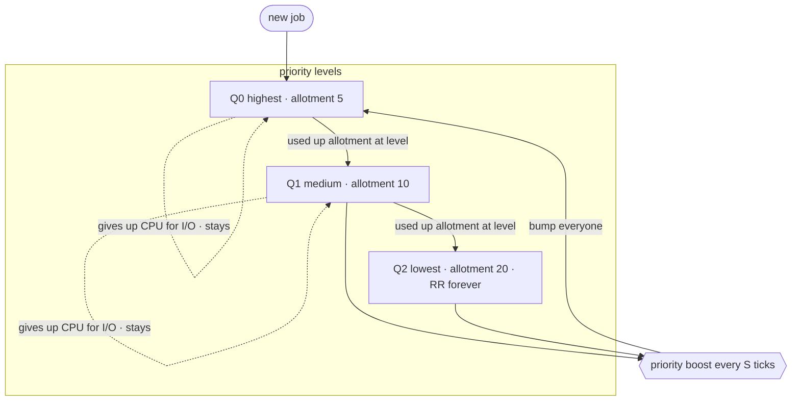
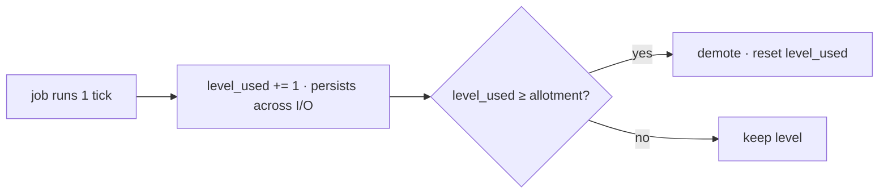

# Multi-Level Feedback Queue (MLFQ)

**The crux:** a scheduler wants two things at once — low **turnaround time** (favor short jobs, like SJF/STCF) and low **response time** (keep interactive jobs snappy, like Round Robin) — but it does **not** know in advance how long any job will run or whether it is interactive or CPU-bound. MLFQ solves this by *learning from the past*: it watches how each job behaves and adjusts its priority over time, so short and I/O-bound jobs float to the top while long CPU-bound jobs sink — all without ever being told a job's length up front.

## The core idea

- **Multiple priority levels.** Keep several queues, each at a distinct priority. Level 0 is highest; higher-numbered levels are lower priority.
- **Priority decides scheduling.** A ready job at a higher priority always runs before any job at a lower priority.
- **Priority is a *guess* about job type.** MLFQ uses observed behavior as a proxy for the unknown "job length" that SJF would need:
  - A job that keeps giving up the CPU (blocks on I/O, short bursts) *looks* interactive → keep it high.
  - A job that keeps using its whole time slice *looks* CPU-bound → let it drift down.
- **Feedback.** Priority is not fixed at admission; it is continuously adjusted from how the job actually runs. That feedback loop is the "F" in MLFQ.

## How it works

### The rules

MLFQ is defined by a small rulebook. The first version:

- **Rule 1:** If Priority(A) > Priority(B), A runs (B does not).
- **Rule 2:** If Priority(A) equals Priority(B), A and B run in **Round Robin** on that level.
- **Rule 3:** When a job enters the system, it starts at the **topmost** (highest) priority.
- **Rule 4a:** If a job uses up its **time allotment** while running, its priority is **reduced** (it moves down one level).
- **Rule 4b:** If a job gives up the CPU before the allotment is used (e.g., for I/O), it **stays** at the same level.

Two subtleties fix problems in the naive rules (below), giving the **improved** rulebook:

- **Rule 4 (improved):** Once a job uses up its **total time allotment at a level** (regardless of how many times it relinquished the CPU), it is demoted. This replaces per-burst accounting and defeats gaming.
- **Rule 5 (priority boost):** After some period `S`, move **all** jobs to the topmost queue. This defeats starvation.

A crucial vocabulary point: the **time slice** (quantum) is how long a job runs before the scheduler is re-invoked; the **allotment** is the total amount of time a job may spend *at a level* before demotion. The allotment is usually a multiple of the slice.

### Queue levels and demotion



- **Higher priority runs first** (Rule 1); ties break by **Round Robin** (Rule 2).
- **New jobs start at the top** (Rule 3) — optimistic: assume a job might be short/interactive and let it prove otherwise.
- **Use up the allotment at a level → demote** (Rule 4). A job that repeatedly burns its full allotment is CPU-bound and sinks toward the bottom.
- **Relinquish before the allotment is gone → keep your level** (Rule 4b). Interactive jobs that block for I/O stay near the top and get scheduled quickly when they wake.

### How MLFQ approximates SJF and stays responsive

- **Approximating SJF/STCF without runtimes.** Short jobs finish before they ever exhaust the top-level allotment, so they run at high priority and complete quickly — the same *ordering* SJF would produce, learned from behavior instead of an oracle.
- **Responsiveness.** New and I/O-bound jobs live near the top. When an interactive job wakes from I/O, it is at a high-priority queue and is scheduled almost immediately, giving low **response time** — the RR benefit.

Recall the two metrics MLFQ is balancing. For a job with arrival $a$, first-run time $f$, and completion time $c$:

$$
T_{\text{turnaround}} = c - a, \qquad T_{\text{response}} = f - a.
$$

SJF minimizes average $T_{\text{turnaround}}$ but wrecks $T_{\text{response}}$ for late-arriving short jobs; RR minimizes $T_{\text{response}}$ but inflates $T_{\text{turnaround}}$. MLFQ chases *both* by using priority as a learned proxy for job length.

### Problem 1: starvation — and the fix (priority boost)

- **The problem.** With enough interactive jobs at the top, the CPU is always busy up high, and long-running jobs at the bottom **starve** — they never run.
- **A second problem:** a program's behavior can *change* (a CPU-bound phase becomes interactive); once demoted, it is stuck low.
- **The fix — Rule 5, priority boost.** Periodically (every `S` ticks) bump **every** job back to the top queue. This guarantees long jobs get a slice (no starvation), and lets a job that changed behavior be re-evaluated.
- **Tuning `S`.** Too large → long jobs still starve for too long; too small → interactive jobs share the top too often and turnaround suffers. `S` is the classic "voo-doo constant" that needs tuning for the workload.

### Problem 2: gaming the scheduler — and the fix (better accounting)

- **The exploit.** Under naive Rule 4a (per-burst accounting), a job can **relinquish the CPU just before its slice ends** — issue a token I/O at 99% of the allotment — so it never "uses up" a slice and therefore is never demoted. It monopolizes a high priority while doing almost all its work as CPU.
- **The fix — Rule 4 (improved): better accounting.** Track the **total** time a job has spent at a level, summed across *all* its bursts. Once that total reaches the allotment, demote — no matter how the job sliced it. Relinquishing early no longer resets the meter, so the exploit dies.



### The scheduler in C (one tick of the decision loop)

The heart of MLFQ is: pick the front job of the highest non-empty queue, run it one tick, then update its **per-level** accounting and demote if the allotment is spent.

```c
#include <stdio.h>

#define NQ 3
static const int ALLOT[NQ] = {5, 10, 20};   /* per-level allotment */

typedef struct { int level; int used; /* total ticks at this level */ } Sched;

/* Account one tick for a running job and demote if the allotment is exhausted.
   'used' is NOT reset on I/O — that is the anti-gaming rule. */
static void account_tick(Sched *s) {
    s->used++;                              /* better accounting: total, not per-burst */
    if (s->used >= ALLOT[s->level]) {
        if (s->level < NQ - 1) { s->level++; s->used = 0; }   /* demote */
        else s->used = 0;                                     /* stay at bottom */
    }
}

int main(void) {
    Sched job = { .level = 0, .used = 0 };
    for (int t = 0; t < 20; t++) {          /* pure CPU job: drains each level */
        int before = job.level;
        account_tick(&job);
        if (job.level != before)
            printf("t=%2d: demoted to level %d\n", t, job.level);
    }
    printf("final level = %d\n", job.level);
    return 0;
}
```

Running it shows a pure-CPU job sinking level 0 → 1 → 2 as it exhausts each allotment, then staying at the bottom.

## Must-know algorithms

### MLFQ simulator (N queues, allotments, demotion, boost, anti-gaming accounting)

This is the full simulator. It runs a mixed workload — two long CPU jobs and two short interactive jobs — with:

- **N priority queues**, each with its own time allotment (`{5, 10, 20}`).
- **Round Robin** within a level; highest non-empty queue runs first.
- **Demotion** when a job's *total* time at a level (`used`) reaches the allotment.
- **Periodic priority boost** (every `BOOST` ticks) that lifts everyone to level 0.
- **Anti-gaming accounting:** `used` is *not* reset when a job blocks for I/O, so relinquishing the CPU early cannot dodge demotion.

It prints a trace and demonstrates the short jobs finishing fast while the long jobs are demoted.

```c
#include <stdio.h>
#include <stdlib.h>
#include <string.h>

#define NQ 3           /* number of priority levels: 0 = highest */
#define BOOST 50       /* periodic priority boost interval (ticks) */
#define MAXJOBS 8

/* Per-level time allotment: how long a job may run at a level before demotion.
   Higher-priority levels get shorter allotments (RR-ish), lower get longer. */
static const int ALLOT[NQ] = {5, 10, 20};

typedef struct {
    int id;
    int arrival;       /* tick at which the job enters the system */
    int total;         /* total CPU it needs */
    int io_every;      /* issue I/O after this many CPU ticks (0 = pure CPU) */
    int io_len;        /* how long each I/O blocks */
    /* runtime state */
    int done;          /* CPU ticks completed */
    int level;         /* current queue level */
    int used;          /* total ticks used AT this level (anti-gaming) */
    int burst;         /* CPU ticks since last I/O (for I/O modeling) */
    int io_wait;       /* remaining I/O time, >0 means blocked */
    int finished_at;   /* completion tick, -1 if not done */
} Job;

/* Simple FIFO queue of job indices per level. */
typedef struct { int buf[MAXJOBS]; int head, tail, n; } Queue;
static void q_init(Queue *q){ q->head = q->tail = q->n = 0; }
static int  q_empty(Queue *q){ return q->n == 0; }
static void q_push(Queue *q, int v){ q->buf[q->tail] = v; q->tail = (q->tail+1)%MAXJOBS; q->n++; }
static int  q_pop(Queue *q){ int v = q->buf[q->head]; q->head = (q->head+1)%MAXJOBS; q->n--; return v; }
static int  q_contains(Queue *q, int v){
    for (int i = 0, idx = q->head; i < q->n; i++, idx = (idx+1)%MAXJOBS)
        if (q->buf[idx] == v) return 1;
    return 0;
}

static Queue Q[NQ];
static Job jobs[MAXJOBS];
static int njobs;

/* Enqueue a job at its current level if not already queued or blocked. */
static void enqueue(int j){
    int lv = jobs[j].level;
    if (!q_contains(&Q[lv], j)) q_push(&Q[lv], j);
}

/* Priority boost: move every unfinished job to the top and reset accounting. */
static void priority_boost(int t){
    printf("[t=%3d] ---- PRIORITY BOOST ----\n", t);
    for (int lv = 0; lv < NQ; lv++) q_init(&Q[lv]);
    for (int j = 0; j < njobs; j++){
        if (jobs[j].done < jobs[j].total){
            jobs[j].level = 0;
            jobs[j].used  = 0;
            if (jobs[j].io_wait == 0 && jobs[j].arrival <= t)
                enqueue(j);
        }
    }
}

/* Pick the highest-priority non-empty queue; return its front job or -1. */
static int pick(void){
    for (int lv = 0; lv < NQ; lv++)
        if (!q_empty(&Q[lv])) return Q[lv].buf[Q[lv].head];
    return -1;
}

int main(void){
    /* Mixed workload: two long CPU jobs and two short interactive jobs. */
    Job seed[] = {
        /* id arr tot io_every io_len */
        { 0, 0, 40, 0,  0, 0,0,0,0,0,-1 },  /* long CPU hog */
        { 1, 0, 35, 0,  0, 0,0,0,0,0,-1 },  /* long CPU hog */
        { 2, 3,  6, 2,  4, 0,0,0,0,0,-1 },  /* short interactive: runs 2, I/O 4 */
        { 3, 7,  4, 1,  3, 0,0,0,0,0,-1 },  /* short interactive: runs 1, I/O 3 */
    };
    njobs = (int)(sizeof(seed)/sizeof(seed[0]));
    memcpy(jobs, seed, sizeof(seed));

    for (int lv = 0; lv < NQ; lv++) q_init(&Q[lv]);

    int t = 0, completed = 0;
    while (completed < njobs && t < 1000){
        /* Periodic boost (skip t=0). */
        if (t > 0 && t % BOOST == 0) priority_boost(t);

        /* Admit arrivals and advance any blocked I/O. */
        for (int j = 0; j < njobs; j++){
            if (jobs[j].arrival == t && jobs[j].done == 0 && jobs[j].io_wait == 0)
                enqueue(j);
            if (jobs[j].io_wait > 0){
                jobs[j].io_wait--;
                if (jobs[j].io_wait == 0 && jobs[j].done < jobs[j].total)
                    enqueue(j);   /* I/O finished: rejoin at current (kept) level */
            }
        }

        int j = pick();
        if (j < 0){ t++; continue; }   /* idle tick */

        /* Run job j for one tick. */
        int lv = jobs[j].level;
        q_pop(&Q[lv]);                 /* take it off its queue while running */
        jobs[j].done++;
        jobs[j].used++;                /* anti-gaming: count TOTAL time at level */
        jobs[j].burst++;
        printf("[t=%3d] run job %d  (level %d, used %d/%d, done %d/%d)\n",
               t, j, lv, jobs[j].used, ALLOT[lv], jobs[j].done, jobs[j].total);
        t++;

        if (jobs[j].done == jobs[j].total){       /* finished */
            jobs[j].finished_at = t;
            completed++;
            printf("[t=%3d] *** job %d FINISHED (turnaround %d) ***\n",
                   t, j, jobs[j].finished_at - jobs[j].arrival);
            continue;
        }

        /* I/O: relinquish CPU but KEEP level and used-count (anti-gaming). */
        if (jobs[j].io_every > 0 && jobs[j].burst == jobs[j].io_every){
            jobs[j].burst = 0;
            jobs[j].io_wait = jobs[j].io_len;
            continue;                             /* blocks; not re-enqueued now */
        }

        /* Allotment exhausted at this level -> demote (unless already lowest). */
        if (jobs[j].used >= ALLOT[lv]){
            if (lv < NQ - 1){ jobs[j].level = lv + 1; jobs[j].used = 0;
                printf("[t=%3d]   demote job %d -> level %d\n", t, j, lv+1); }
            else jobs[j].used = 0;                /* stay at bottom, reset counter */
        }
        enqueue(j);                               /* RR within its level */
    }

    printf("\nSummary:\n");
    for (int i = 0; i < njobs; i++)
        printf("  job %d: turnaround %d, final level %d\n",
               i, jobs[i].finished_at - jobs[i].arrival, jobs[i].level);
    return 0;
}
```

Compile and run:

```
cc -std=c11 mlfq.c -o mlfq && ./mlfq
```

Abridged trace (the key events):

```
[t=  5] run job 2  (level 0, used 1/5, done 1/6)     interactive job runs high
[t= 11] run job 0  (level 0, used 5/5, done 5/40)
[t= 12]   demote job 0 -> level 1                      long job sinks
[t= 21] *** job 3 FINISHED (turnaround 14) ***         short job done fast
[t= 24] *** job 2 FINISHED (turnaround 21) ***         short job done fast
[t= 50] ---- PRIORITY BOOST ----                        everyone bumped to top
[t= 80] *** job 1 FINISHED (turnaround 80) ***
[t= 85] *** job 0 FINISHED (turnaround 85) ***

Summary:
  job 0: turnaround 85, final level 2
  job 1: turnaround 80, final level 1
  job 2: turnaround 21, final level 1
  job 3: turnaround 14, final level 0
```

The short interactive jobs (2 and 3) finish quickly with small turnaround (21 and 14) while the long CPU jobs (0 and 1) are demoted to the lowest levels and run there — exactly the behavior MLFQ is designed to produce.

## Interview questions

1. **How does MLFQ approximate SJF without knowing runtimes?**
   It uses *observed behavior* as a proxy for length. Every job starts at the top; short jobs finish before they exhaust the top allotment, so they run at high priority and complete quickly — the same completion *ordering* SJF would give. Jobs that keep burning full allotments are inferred to be long and drift down, so short jobs consistently preempt them. No oracle needed; the "shortness" is learned online.

2. **How does MLFQ stay responsive for interactive jobs?**
   Rule 4b: a job that gives up the CPU before its allotment is spent keeps its level. Interactive jobs block for I/O after tiny bursts, so they never get demoted and live near the top. When one wakes, it is in a high-priority queue and is scheduled almost immediately, giving low response time — the Round-Robin benefit — without hurting turnaround for short jobs.

3. **What causes starvation in MLFQ, and how does priority boost fix it?**
   If there is a steady supply of high-priority (interactive or new) jobs, the CPU is always busy up top and low-priority long jobs never run — starvation. Rule 5 (priority boost) periodically lifts *all* jobs back to the top queue, guaranteeing every job gets scheduled within one boost period. It also lets a job whose behavior changed (CPU-bound → interactive) be re-evaluated at high priority.

4. **How can a process game MLFQ, and how do you prevent it?**
   With per-burst accounting, a job can issue a trivial I/O just before its slice ends, so it never "uses up" a slice and is never demoted — monopolizing a high priority. The fix is *better accounting*: track total time spent at a level across all bursts, and demote when that cumulative total reaches the allotment. Relinquishing early no longer resets the counter, so the exploit fails.

5. **How do you tune the number of queues, the allotments, and the boost period?**
   These are workload-dependent "voo-doo" constants. More queues give finer priority resolution but more overhead; typical systems use a handful. Higher queues usually get *shorter* allotments (favor quick, interactive turnaround) and lower queues get *longer* ones (fewer context switches for batch jobs). The boost period `S` trades starvation-avoidance (smaller `S`) against interactive turnaround (larger `S`). Real schedulers (e.g., Solaris) expose these via configurable tables and let admins tune per workload.

6. **MLFQ vs plain Round Robin vs SJF — when does each win?**
   SJF/STCF minimizes average turnaround but needs known runtimes (unrealistic) and starves long jobs / hurts response for late short jobs. RR minimizes response time and is fair, but averages turnaround is poor because it spreads the CPU evenly regardless of length. MLFQ approximates SJF's turnaround *and* RR's response, learns job type online, and adds boost + accounting to stay starvation-free and non-gameable — at the cost of tuning knobs and more bookkeeping.

7. **Why do new jobs start at the highest priority instead of the lowest?**
   Optimistic assumption: a new job *might* be short or interactive, and those are the ones we most want to finish fast. Starting high lets a short job complete quickly; if it turns out to be a long CPU hog, the demotion rules quickly push it down. Starting low would penalize every short job and destroy interactivity.

8. **What is the difference between a time slice (quantum) and a time allotment?**
   The slice/quantum is how long a job runs before the scheduler is re-invoked (one RR turn). The allotment is the *total* time a job may accumulate at a level before being demoted — usually several slices. Demotion is driven by the allotment; scheduling granularity is driven by the slice.

9. **Does MLFQ guarantee any bound on turnaround or fairness?**
   No hard optimality bound like SJF, and it is not strictly fair like RR. Its guarantees are softer: with priority boost, no job starves longer than one boost period; with correct accounting, no job can indefinitely hold high priority by gaming. It is a *heuristic* that works very well in practice, which is why real OSes use MLFQ-style schedulers.

10. **How do real operating systems use MLFQ ideas?**
    Solaris uses an explicitly configurable multi-level feedback table (priorities, allotments, and boost behavior tunable by admins). Older Windows and BSD schedulers used priority classes with decay/boost that are MLFQ in spirit — boosting priority after I/O completion and decaying it under sustained CPU use. The Linux CFS is a different (fair-share) design, but the "boost interactive, demote CPU-bound" instinct is the same lineage.

## Coding problems

- 🎯 **Interview — [Single-Threaded CPU (LeetCode 1834)](https://leetcode.com/problems/single-threaded-cpu/)** — simulate a CPU that, when free, picks the enqueued task with the shortest processing time (ties by index) using a min-heap keyed on availability and duration. *Tests:* event-driven simulation and priority-queue scheduling — the same "pick the best ready job" core as a scheduler's dispatch loop.

- 🎯 **Interview — [Seat Reservation Manager (LeetCode 1845)](https://leetcode.com/problems/seat-reservation-manager/)** — reserve the smallest available seat and free seats back, backed by a min-heap. *Tests:* a min-priority-queue abstraction — the exact data structure MLFQ needs to always dispatch the highest-priority ready job efficiently.

- 🏗 **Systems — Implement the MLFQ scheduler.** Build the full simulator above: N priority queues with per-level allotments, Round Robin within a level, demotion on allotment-exhaustion, periodic priority boost, and cumulative (anti-gaming) accounting. *Tests:* whether you can encode the MLFQ rulebook correctly and reason about starvation and gaming — the canonical OSTEP homework and a common systems-interview design task. See the OSTEP MLFQ chapter's simulator (`mlfq.py` in the book's homework) for the reference model.

## Key takeaways

- MLFQ chases **both** low turnaround (SJF-like) and low response time (RR-like) **without** knowing job lengths, by using observed behavior as a proxy for length.
- **Rules:** highest priority runs first; equal priority runs Round Robin; new jobs start at the top; using up a level's **allotment** demotes you; relinquishing early keeps your level.
- **Starvation** is fixed by **priority boost** — periodically lift every job to the top.
- **Gaming** (relinquishing just before the slice ends) is fixed by **better accounting** — track total time at a level, not per-burst, so early yields cannot dodge demotion.
- **Tuning** the queue count, per-level allotments, and boost period is workload-dependent; higher queues get shorter allotments, lower queues get longer ones.

## Source(s) and further reading

- [OSTEP — _Scheduling: The Multi-Level Feedback Queue_ (free chapter PDF)](https://pages.cs.wisc.edu/~remzi/OSTEP/cpu-sched-mlfq.pdf) — the primary source for the rules, priority boost, and better accounting.
- [OSTEP — book home page (all free chapters)](https://pages.cs.wisc.edu/~remzi/OSTEP/)
- [Wikipedia — Multilevel feedback queue](https://en.wikipedia.org/wiki/Multilevel_feedback_queue)
