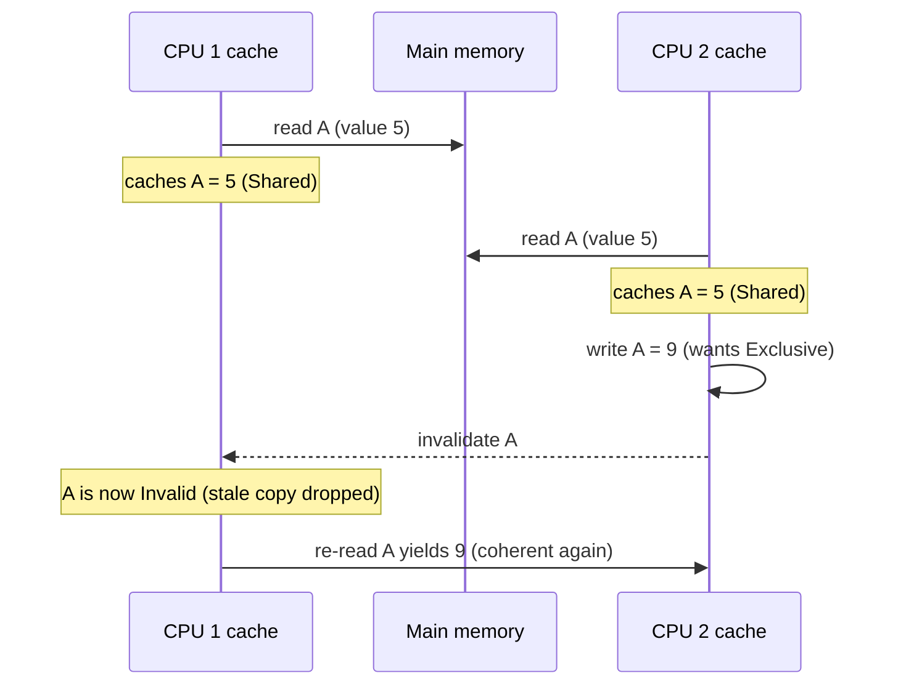
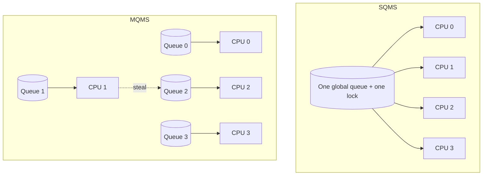

# Multiprocessor Scheduling

A single-CPU scheduler only has to answer *which job runs next*. A multiprocessor scheduler has to answer that question **once per CPU, at the same time, over shared state** — and it does so on top of hardware where each CPU has its own caches. **The crux: how do we schedule jobs across many CPUs so that we keep every CPU busy, keep each job on a CPU whose caches are still warm for it, and never corrupt the shared scheduling data — all at once?** Everything below is the tension between those three goals: utilization, affinity, and correctness under contention.

## The core idea

- A multiprocessor is several CPUs sharing one main memory, but **each CPU has its own private caches** (L1/L2, sometimes a shared L3). Fast memory lives next to each core; the shared truth lives far away in RAM.
- Three things make multi-CPU scheduling genuinely different from single-CPU scheduling:
  - **Cache coherence** — a value cached on CPU 1 becomes *stale* the moment CPU 2 writes the same address. Hardware must reconcile the copies so software sees one consistent memory.
  - **Cache affinity** — a job that already ran on a CPU has state warm in that CPU's caches; re-running it there is faster than starting cold on a different CPU.
  - **Synchronization** — if CPUs share a run queue, they must lock it, and that lock serializes scheduling decisions.
- The design space is basically two answers plus a fix:
  - **SQMS** (Single-Queue Multiprocessor Scheduling) — one global queue behind one lock. Simple, but the lock does not scale and affinity is poor.
  - **MQMS** (Multi-Queue Multiprocessor Scheduling) — one queue per CPU. Scales well and preserves affinity, but queues drift out of balance.
  - **Migration / work stealing** — move (or steal) jobs between CPUs to fix the load imbalance MQMS creates.

## How it works

### Cache coherence — whose job is it

When CPU 1 reads address `A`, it caches `A`'s value. If CPU 2 later writes `A`, CPU 1's cached copy is now wrong. Keeping all caches agreeing on one value is the **cache-coherence** problem, and it is solved **in hardware**, not by the OS scheduler.

- On a bus-based system, caches do **bus snooping**: every cache watches memory traffic. When it sees a write to an address it holds, it **invalidates** (or updates) its copy.
- **MESI** is the classic protocol: each cache line is tagged **M**odified, **E**xclusive, **S**hared, or **I**nvalid. A CPU that wants to write must first gain exclusive ownership, forcing other copies to Invalid. Reads of shared data can stay Shared across many caches.
- The scheduler cannot ignore coherence even though it does not implement it: coherence traffic is *expensive*. Two CPUs hammering the same lock or the same queue header generate a storm of invalidations. Good scheduling keeps hot data CPU-local precisely to avoid that traffic.



### Cache affinity

A process builds up state in a CPU's caches and TLB as it runs. If the scheduler later runs it on a **different** CPU, that state is cold there and warm on the old CPU — the job starts slow and pays cache-miss latency to reload. A good multiprocessor scheduler therefore prefers to keep a job on the **same CPU** it ran on last. This is exactly what SQMS struggles with (jobs bounce between CPUs) and what MQMS gets for free (a job stays in one CPU's queue).

### Synchronization — the shared-queue cost

If CPUs share one run queue, concurrent `enqueue`/`dequeue` would race, so the queue sits behind a lock. Correct, but the lock is a serialization point: as you add CPUs, they spend more time waiting for the lock than scheduling. The following SQMS sketch is correct — every CPU pulls from one locked queue — and its single-lock design is exactly the bottleneck.

```c
// SQMS: one global run queue behind one lock. Simple, correct, but the single
// lock serializes every scheduling decision — the scalability bottleneck.
#include <pthread.h>
#include <stdio.h>
#include <stdlib.h>

#define NCPU  4
#define NJOBS 12

typedef struct { int jobs[NJOBS]; int head, tail; pthread_mutex_t lock; } GlobalQ;
static GlobalQ gq;
static int ran[NCPU];

static int dequeue(GlobalQ *q) {
    int job = -1;
    pthread_mutex_lock(&q->lock);           // every CPU contends on THIS lock
    if (q->head < q->tail) job = q->jobs[q->head++];
    pthread_mutex_unlock(&q->lock);
    return job;
}

typedef struct { int cpu; } Arg;
static void *cpu_thread(void *p) {
    int cpu = ((Arg *)p)->cpu, job;
    while ((job = dequeue(&gq)) >= 0) ran[cpu]++;
    return NULL;
}

int main(void) {
    gq.head = gq.tail = 0;
    pthread_mutex_init(&gq.lock, NULL);
    for (int i = 0; i < NJOBS; i++) gq.jobs[gq.tail++] = i;

    pthread_t th[NCPU]; Arg a[NCPU];
    for (int i = 0; i < NCPU; i++) { a[i].cpu = i; pthread_create(&th[i], NULL, cpu_thread, &a[i]); }
    for (int i = 0; i < NCPU; i++) pthread_join(th[i], NULL);

    int total = 0;
    for (int i = 0; i < NCPU; i++) { printf("cpu%d ran %d jobs\n", i, ran[i]); total += ran[i]; }
    printf("total ran %d / %d -> %s\n", total, NJOBS, total == NJOBS ? "OK" : "BAD");
    return total == NJOBS ? 0 : 1;
}
```

Compiled with `cc -std=c11 -pthread`, this prints all 12 jobs run and `total ran 12 / 12 -> OK`. Which CPU runs how many is nondeterministic and often lopsided — one CPU can grab the lock and drain the queue before others get a turn. That is SQMS in miniature: correct, simple, but neither scalable nor affinity-aware.

### SQMS vs MQMS



- **SQMS** — every CPU shares one queue and one lock. Pros: trivial to reason about, naturally load-balanced (any idle CPU grabs the next job). Cons: the lock does not scale past a handful of CPUs, and jobs migrate freely so affinity is poor.
- **MQMS** — each CPU has its own queue and its own lock, so scheduling on one CPU rarely contends with another. Pros: scales with CPU count; a job stays in one queue, so affinity is naturally preserved. Cons: queues drift apart — one CPU can be idle while another has a backlog. That is **load imbalance**.

### Load imbalance, migration, and work stealing

MQMS's weakness is that per-CPU queues fall out of balance: jobs finish, new jobs arrive unevenly, and soon one CPU is idle while another is swamped. The fix is **migration** — move work between CPUs. Two common shapes:

- **Push migration** — a periodic load-balancer looks across queues and moves jobs off overloaded CPUs.
- **Work stealing (pull migration)** — an **idle** CPU, finding its own queue empty, picks a random *victim* CPU and steals work from the far end of that victim's queue. It is decentralized (no global scan), and it self-limits: CPUs only steal when they have nothing to do.

The classic work-stealing structure is a **deque** (double-ended queue) per worker:

- The **owner** pushes and pops at its **bottom** end (LIFO), so it keeps re-touching recently pushed, cache-warm work — good affinity.
- A **thief** steals from the **top** end (the oldest work), which minimizes contention with the owner and tends to grab larger, independent chunks.

## Must-know algorithms

### Work-stealing scheduler (C)

Per-worker deques; each worker pops its own work at the bottom and, when empty, steals from a random victim's top. Starting all tasks on one worker forces stealing to rebalance the load. A per-deque lock keeps the demo correct — a production scheduler uses a lock-free Chase–Lev deque, but here correctness comes first.

```c
// Work-stealing scheduler demo.
// Each worker owns a deque. It pushes/pops at its own "bottom"; idle workers
// steal from a random victim's "top". A per-deque lock keeps the demo correct
// (a real scheduler uses a lock-free Chase-Lev deque; correctness first here).
#include <pthread.h>
#include <stdio.h>
#include <stdlib.h>
#include <stdatomic.h>

#define NWORKERS 4
#define NTASKS   1000
#define CAP      2048

typedef struct {
    int buf[CAP];
    int top;                 // steal end
    int bottom;              // owner end
    pthread_mutex_t lock;
} Deque;

static Deque       deques[NWORKERS];
static atomic_int  completed;          // tasks actually executed
static atomic_int  stolen;             // tasks obtained by stealing
static atomic_int  local_pops;         // tasks obtained from own deque
static atomic_int  remaining;          // tasks not yet executed (for termination)
static atomic_long checksum;           // sum of processed task ids (correctness)

static void deque_init(Deque *d) {
    d->top = 0;
    d->bottom = 0;
    pthread_mutex_init(&d->lock, NULL);
}

// Owner pushes at bottom.
static void push_bottom(Deque *d, int task) {
    pthread_mutex_lock(&d->lock);
    d->buf[d->bottom++] = task;
    pthread_mutex_unlock(&d->lock);
}

// Owner pops from bottom (LIFO for cache warmth). Returns -1 if empty.
static int pop_bottom(Deque *d) {
    int task = -1;
    pthread_mutex_lock(&d->lock);
    if (d->bottom > d->top)
        task = d->buf[--d->bottom];
    pthread_mutex_unlock(&d->lock);
    return task;
}

// Thief steals from top (FIFO end). Returns -1 if empty.
static int steal_top(Deque *d) {
    int task = -1;
    pthread_mutex_lock(&d->lock);
    if (d->bottom > d->top)
        task = d->buf[d->top++];
    pthread_mutex_unlock(&d->lock);
    return task;
}

// Simulate work: touch the id so the compiler cannot elide it.
static void run_task(int id) {
    atomic_fetch_add(&checksum, (long)id);
    atomic_fetch_add(&completed, 1);
    atomic_fetch_sub(&remaining, 1);
}

typedef struct { int id; unsigned seed; } Arg;

static void *worker(void *p) {
    Arg *a = (Arg *)p;
    int me = a->id;
    unsigned seed = a->seed;

    while (atomic_load(&remaining) > 0) {
        int task = pop_bottom(&deques[me]);
        if (task >= 0) {
            atomic_fetch_add(&local_pops, 1);
            run_task(task);
            continue;
        }
        // Own deque empty: steal from a random victim.
        int victim = rand_r(&seed) % NWORKERS;
        if (victim == me) continue;
        task = steal_top(&deques[victim]);
        if (task >= 0) {
            atomic_fetch_add(&stolen, 1);
            run_task(task);
        }
        // else: victim empty too; loop and try again (spin until remaining hits 0)
    }
    return NULL;
}

int main(void) {
    for (int i = 0; i < NWORKERS; i++) deque_init(&deques[i]);
    atomic_store(&completed, 0);
    atomic_store(&stolen, 0);
    atomic_store(&local_pops, 0);
    atomic_store(&remaining, NTASKS);
    atomic_store(&checksum, 0);

    // Skewed initial load: put ALL tasks on worker 0 so stealing must kick in.
    long expected = 0;
    for (int t = 0; t < NTASKS; t++) {
        push_bottom(&deques[0], t);
        expected += t;
    }

    pthread_t th[NWORKERS];
    Arg args[NWORKERS];
    for (int i = 0; i < NWORKERS; i++) {
        args[i].id = i;
        args[i].seed = (unsigned)(i * 2654435761u + 1u);
        pthread_create(&th[i], NULL, worker, &args[i]);
    }
    for (int i = 0; i < NWORKERS; i++) pthread_join(th[i], NULL);

    printf("tasks completed : %d / %d\n", atomic_load(&completed), NTASKS);
    printf("local pops      : %d\n", atomic_load(&local_pops));
    printf("stolen tasks    : %d\n", atomic_load(&stolen));
    printf("checksum        : %ld (expected %ld) -> %s\n",
           atomic_load(&checksum), expected,
           atomic_load(&checksum) == expected ? "OK" : "MISMATCH");
    printf("all done        : %s, stealing occurred : %s\n",
           atomic_load(&completed) == NTASKS ? "yes" : "NO",
           atomic_load(&stolen) > 0 ? "yes" : "no");
    return (atomic_load(&completed) == NTASKS && atomic_load(&checksum) == expected) ? 0 : 1;
}
```

Built with `cc -std=c11 -pthread`, a sample run prints:

```text
tasks completed : 1000 / 1000
local pops      : 958
stolen tasks    : 42
checksum        : 499500 (expected 499500) -> OK
all done        : yes, stealing occurred : yes
```

All 1000 tasks execute exactly once (the checksum is the exact sum `0+1+...+999 = 499500`), and because every task started on worker 0, the other three workers only made progress by **stealing** — the counts are nondeterministic run to run, but stealing always occurs and the load is balanced.

### A note on Linux CFS

Linux's **Completely Fair Scheduler** (the default from 2.6.23 until it was replaced by EEVDF in 6.6) is MQMS in practice: it keeps a **per-CPU runqueue**, each ordered by virtual runtime in a red-black tree, so ordinary scheduling touches only CPU-local state and scales. A separate **load balancer** runs periodically and on idle, walking the scheduler-domain hierarchy (SMT threads, cores, packages, NUMA nodes) and **migrating** tasks from busier runqueues to less busy ones — push/pull migration exactly as above, with domain awareness so it prefers to keep tasks near their warm caches and their NUMA-local memory.

## Interview questions

1. **Why is multiprocessor scheduling harder than single-CPU scheduling?**
   You are no longer picking one job — you are picking jobs for many CPUs concurrently over shared data, and the hardware has per-CPU caches. You must keep every CPU busy (utilization), keep jobs on CPUs where their cache state is warm (affinity), and protect shared scheduling structures from races (synchronization). None of these exist on a single CPU.

2. **What is cache affinity and why does it matter?**
   A running process warms a CPU's caches and TLB with its data and translations. If it is rescheduled on that same CPU, the state is still resident and it runs fast; on a different CPU it starts cold and pays cache/TLB misses to reload. Preferring the last-used CPU preserves this warmth, which is a real performance win, so schedulers migrate jobs reluctantly.

3. **What is cache coherence, and whose job is it?**
   It is the guarantee that all CPUs see a single consistent value for each memory address despite private caches. When one CPU writes an address, other cached copies must be invalidated or updated. It is the **hardware's** job — via bus snooping and protocols like MESI — not the OS scheduler's. The scheduler's concern is to avoid *generating* excessive coherence traffic by keeping hot data CPU-local.

4. **SQMS vs MQMS — what are the tradeoffs?**
   SQMS is one global queue behind one lock: simple and naturally balanced, but the lock serializes scheduling so it does not scale, and jobs bounce between CPUs so affinity is poor. MQMS is per-CPU queues: it scales (little cross-CPU contention) and preserves affinity (a job stays in one queue), but the queues drift out of balance and need migration to fix it.

5. **What is load imbalance and how does migration or work stealing fix it?**
   With per-CPU queues, one CPU can be idle while another has a backlog — CPUs are underutilized even though work exists. Migration moves jobs between queues to even things out: a periodic balancer can *push* work off busy CPUs, or an idle CPU can *pull* work by **stealing** from a random victim's queue. Stealing is decentralized and self-limiting because CPUs only steal when idle.

6. **Why do per-CPU runqueues scale better than one shared runqueue?**
   Because scheduling on one CPU touches only that CPU's queue and lock, so CPUs almost never contend with each other; adding CPUs adds parallel scheduling capacity instead of more contention on a single lock. A shared queue funnels every CPU through one lock and one hot cache line, so throughput flattens (or drops) as CPUs are added.

7. **What is false sharing, and how does it relate to scheduling data structures?**
   False sharing is when two CPUs write *different* variables that happen to sit on the **same cache line**. Coherence works at cache-line granularity, so each write invalidates the other CPU's copy of the whole line even though the variables are logically independent — the line ping-pongs and performance collapses. It matters here because per-CPU counters, queue heads, or lock words packed together on one line silently reintroduce the contention MQMS was meant to avoid; the fix is to pad/align hot per-CPU fields to separate cache lines.

8. **When would you actually prefer SQMS over MQMS?**
   When simplicity matters more than scale: few CPUs, a light scheduling load, or a system where you want automatic load balancing for free and can tolerate poor affinity. SQMS has no imbalance to fix and far less code; MQMS earns its complexity only once lock contention or affinity losses on a shared queue start to bite.

## Coding problems

### 🎯 Interview

- **[LeetCode 1188 — Design Bounded Blocking Queue](https://leetcode.com/problems/design-bounded-blocking-queue/)** — build a thread-safe fixed-capacity queue; tests the producer–consumer synchronization that any shared run queue needs.
- **[LeetCode 1242 — Web Crawler Multithreaded](https://leetcode.com/problems/web-crawler-multithreaded/)** — distribute URL-crawling work across threads without duplication; tests concurrent work distribution and shared-set synchronization, the same shape as spreading jobs across CPUs.
- **[LeetCode 641 — Design Circular Deque](https://leetcode.com/problems/design-circular-deque/)** — implement a double-ended queue with O(1) push/pop at both ends; this is exactly the data structure a work-stealing scheduler puts per worker (owner at one end, thief at the other).

### 🏗 Systems

- **Implement a work-stealing scheduler** — per-worker deques, owner pops the bottom, an idle worker steals from a random victim's top; verify every task runs exactly once and that load rebalances from a skewed start. Reference: the [C implementation above](#work-stealing-scheduler-c) and [Wikipedia — Work stealing](https://en.wikipedia.org/wiki/Work_stealing).

## Key takeaways

- Multi-CPU scheduling adds three problems single-CPU scheduling never has: **cache coherence** (hardware's job), **cache affinity** (the scheduler's job), and **synchronization** of shared scheduling state.
- **SQMS** = one global queue + one lock: simple and balanced, but the lock does not scale and affinity is poor.
- **MQMS** = per-CPU queues: it scales and preserves affinity, but the queues fall out of balance.
- **Migration / work stealing** fixes MQMS's imbalance: an idle CPU steals work from a busy one, decentralized and self-limiting.
- A work-stealing **deque** gives the owner LIFO (warm cache) access at one end and thieves low-contention FIFO access at the other.
- **Linux CFS** is MQMS in the real world: per-CPU runqueues plus a domain-aware periodic load balancer.
- Watch for **false sharing** — packing hot per-CPU fields on one cache line quietly reintroduces the very contention MQMS avoids.

## Source(s) and further reading

- [OSTEP — Multiprocessor Scheduling (Advanced), free PDF](https://pages.cs.wisc.edu/~remzi/OSTEP/cpu-sched-multi.pdf) — the backbone for SQMS, MQMS, affinity, and work stealing.
- [Wikipedia — Work stealing](https://en.wikipedia.org/wiki/Work_stealing) — the deque-based owner/thief scheme and its guarantees.
- [Wikipedia — Cache coherence](https://en.wikipedia.org/wiki/Cache_coherence) and [Wikipedia — MESI protocol](https://en.wikipedia.org/wiki/MESI_protocol) — snooping and the coherence state machine.
- [Wikipedia — False sharing](https://en.wikipedia.org/wiki/False_sharing) — why independent per-CPU variables on one cache line contend.
- [Wikipedia — Completely Fair Scheduler](https://en.wikipedia.org/wiki/Completely_Fair_Scheduler) — Linux per-CPU runqueues and load balancing.
- [man 2 sched_setaffinity](https://man7.org/linux/man-pages/man2/sched_setaffinity.2.html) — pinning a task to specific CPUs, the affinity knob exposed to userspace.
