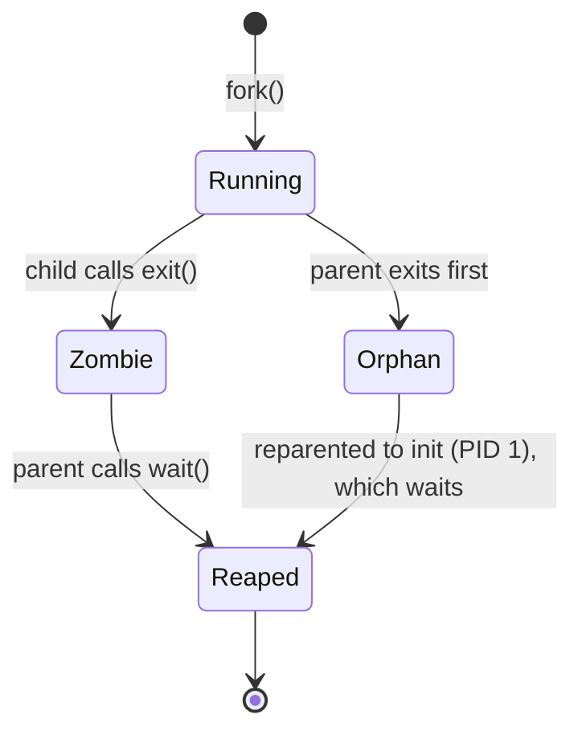

# Process API (fork, exec, wait)

**The crux: how should the OS let one running program create and control another?** UNIX answers with a small, famously odd trio of system calls — `fork()` clones the calling process, `exec()` throws away that clone's program and loads a new one in its place, and `wait()` lets a parent block until a child finishes and collect its exit status. The oddity is that process creation (`fork`) and program loading (`exec`) are **separate** calls. That separation looks redundant until you see what a shell does in the sliver of time between them: it rewires the child's file descriptors, which is exactly how `>` redirection and `|` pipes work with no cooperation from the program being run.

## The core idea

- **`fork()` splits one process into two.** After the call there are two nearly identical processes — a parent and a child — each with its own copy of the address space, registers, and open file descriptors. Both resume from the same line: the call that "returns twice."
- **The return value is how each half learns who it is.** In the child, `fork()` returns `0`. In the parent, it returns the child's PID (a positive number). On failure it returns `-1` and no child is created.
- **`exec()` replaces the running program.** It keeps the process (same PID, same open fds) but discards the old code, data, heap, and stack and loads a new executable in their place. On success it **does not return** — there is no old program to return to.
- **`wait()` / `waitpid()` reaps children.** A parent calls it to block until a child terminates and to read the child's exit status. Until a parent reaps it, a dead child lingers as a **zombie**.
- **fork + exec are deliberately separate.** The gap between them is a window in which the child is still running shell code and can set up its environment — redirect stdout to a file, wire up a pipe — *before* the new program starts.
- **Copy-on-write (COW)** makes `fork()` cheap: the two address spaces share physical pages read-only, and the OS copies a page only when one side writes to it.

## How it works

### fork(): returning twice

`fork()` creates a child that is a near-duplicate of the parent. Control returns *into both processes* from the single call site; they diverge only by the return value.

```c
#include <stdio.h>
#include <stdlib.h>
#include <unistd.h>
#include <sys/wait.h>

int main(void) {
    printf("parent: pid=%d\n", (int)getpid());

    pid_t rc = fork();
    if (rc < 0) {
        perror("fork");
        exit(1);
    } else if (rc == 0) {
        /* child: fork returned 0 here */
        printf("child: pid=%d, replacing image with 'echo'\n", (int)getpid());
        char *argv[] = { "echo", "hello", "from", "exec", NULL };
        execvp(argv[0], argv);
        perror("execvp");   /* only reached if exec fails */
        exit(127);
    } else {
        /* parent: fork returned the child's pid here */
        int status;
        pid_t child = wait(&status);
        if (WIFEXITED(status))
            printf("parent: child %d exited with status %d\n",
                   (int)child, WEXITSTATUS(status));
    }
    return 0;
}
```

Running it prints the child's `echo` output, then the parent's report of the reaped exit status. Note the ordering between parent and child is **not** guaranteed unless you synchronize (here, `wait()` forces the parent to run last).

The two processes are independent from the instant of the fork: a variable the child changes is invisible to the parent, because each has its own copy of memory. What they *do* share is the open-file table entries — both inherit the parent's fds pointing at the same underlying open files (this is what makes redirection and pipes possible).

```mermaid
sequenceDiagram
    participant P as Parent
    participant K as Kernel
    participant C as Child
    P->>K: fork()
    K->>C: create copy of address space (COW)
    K-->>P: returns child PID (#62; 0)
    K-->>C: returns 0
    Note over P,C: both continue from the same line
    C->>K: execvp("echo", ...)
    Note over C: image replaced; does not return
    P->>K: wait(#38;status)
    Note over P: blocks until child exits
    C-->>K: exit(0)
    K-->>P: unblocks with child's status
```

### exec(): replacing the image

`exec` is a **family** of libc wrappers over the `execve(2)` system call. They differ only in how you pass arguments and whether they search `PATH`:

- `execl`, `execlp`, `execle` — arguments as a **l**ist of strings ending in `NULL`.
- `execv`, `execvp`, `execvpe` — arguments as a **v**ector (`char *argv[]`).
- The `p` variants search `PATH` for the executable; the `e` variants let you pass a custom `environ`.

On success, the process's memory image is completely rebuilt from the named executable and control jumps to its entry point — so **the line after a successful `exec` never runs**. Any code after `execvp(...)` therefore handles only the *failure* case (bad path, no permission), which is why the examples call `perror` and `exit` right after it.

What survives an `exec`: the PID, the parent relationship, and open file descriptors (unless marked close-on-exec). What is destroyed: the code, heap, stack, and mappings of the old program. This "keep the process, swap the program" behavior is the whole point — it lets the caller set up the process *before* the new program exists.

### wait() / waitpid(): reaping and exit status

A terminated child does not vanish; the kernel keeps a small record (its PID and exit status) so the parent can retrieve it. `wait()` blocks until *any* child terminates; `waitpid(pid, &status, opts)` waits for a specific child and takes options like `WNOHANG` (return immediately if no child has exited) and `WUNTRACED`.

The `status` is an opaque `int` — decode it with macros:

- `WIFEXITED(status)` — true if the child exited normally; `WEXITSTATUS(status)` gives the low 8 bits of its `exit()` code.
- `WIFSIGNALED(status)` — true if a signal killed it; `WTERMSIG(status)` gives the signal number.



### Why fork and exec are separate: redirection

Because the child runs shell code between `fork` and `exec`, the shell can change the child's file descriptors so the new program's output lands wherever the shell wants — the program itself does nothing special. The trick is `dup2(fd, STDOUT_FILENO)`: it makes descriptor `1` (stdout) refer to an already-open file. When the child then execs, the new program writes to "stdout" as usual, but stdout now *is* the file.

The mechanism relies on a UNIX invariant: `open()` returns the **lowest-numbered free descriptor**. So `close(STDOUT_FILENO)` then `open(file)` would hand the file descriptor `1`; `dup2` does the same thing atomically without needing the close-first trick. Pipes work the same way, with `pipe(2)` giving a read/write fd pair that two children `dup2` onto their stdin/stdout.

## Must-know algorithms

These are the three programs interviewers and courses expect you to be able to write from memory. All compile with `cc -std=c11` and run.

### 1. Canonical fork / exec / wait

The program under **fork(): returning twice** above is the canonical skeleton: fork, branch on the return value, `exec` in the child, `wait` in the parent, decode the status. Memorize this shape — every process-spawning program is a variation of it.

### 2. A minimal shell with output redirection

The heart of a shell: read a line, parse it into `argv`, fork, optionally rewire fds, exec, and wait. Redirection is handled entirely in the child, in the window between `fork` and `exec`, with `open` + `dup2`.

```c
#include <stdio.h>
#include <stdlib.h>
#include <string.h>
#include <unistd.h>
#include <fcntl.h>
#include <sys/wait.h>

#define MAXARGS 64

/* Parse a line into argv, detecting a single "#62; file" redirection.
 * On return, *outfile is the redirect target or NULL. */
static int parse(char *line, char *argv[], char **outfile) {
    int argc = 0;
    *outfile = NULL;
    char *tok = strtok(line, " \t\n");
    while (tok && argc < MAXARGS - 1) {
        if (strcmp(tok, ">") == 0) {
            *outfile = strtok(NULL, " \t\n");  /* next token is the file */
        } else {
            argv[argc++] = tok;
        }
        tok = strtok(NULL, " \t\n");
    }
    argv[argc] = NULL;
    return argc;
}

int main(void) {
    char line[1024];
    char *argv[MAXARGS];
    char *outfile;

    while (1) {
        printf("mysh> ");
        fflush(stdout);
        if (!fgets(line, sizeof line, stdin)) break;   /* EOF */

        int argc = parse(line, argv, &outfile);
        if (argc == 0) continue;
        if (strcmp(argv[0], "exit") == 0) break;

        pid_t rc = fork();
        if (rc < 0) { perror("fork"); continue; }

        if (rc == 0) {
            /* CHILD: rewire fds *before* exec — this is why fork and exec
             * are separate calls. The shell owns this window. */
            if (outfile) {
                int fd = open(outfile,
                              O_CREAT | O_WRONLY | O_TRUNC, 0644);
                if (fd < 0) { perror("open"); exit(1); }
                dup2(fd, STDOUT_FILENO);  /* stdout now points at the file */
                close(fd);
            }
            execvp(argv[0], argv);
            perror("execvp");             /* exec only returns on failure */
            exit(127);
        } else {
            /* PARENT: reap the child so it does not linger as a zombie. */
            int status;
            waitpid(rc, &status, 0);
        }
    }
    return 0;
}
```

Feeding it `echo hi there` prints to the terminal; feeding it `echo saved words > out.txt` writes to the file instead — with `echo` completely unaware it was redirected. That obliviousness is the payoff of doing the wiring between fork and exec.

### 3. Zombie and orphan demonstrator

A **zombie** is a child that has exited but has not yet been reaped — it holds a slot in the process table until the parent calls `wait`. An **orphan** is a child whose parent exited first; the kernel reparents it to `init`/`systemd` (PID 1), which reaps it.

```c
#include <stdio.h>
#include <stdlib.h>
#include <unistd.h>
#include <sys/wait.h>

/* Demonstrate a zombie then an orphan.
 *
 * Note: after fork() the child shares the parent's buffered stdout. We call
 * fflush() before _exit() because _exit() does NOT flush C stdio buffers.
 */
int main(void) {
    /* ---- Zombie ---- */
    pid_t z = fork();
    if (z == 0) {
        printf("[zombie child] pid=%d exiting now\n", (int)getpid());
        fflush(stdout);
        _exit(0);                 /* child dies; parent has not waited yet */
    }
    sleep(1);                     /* during this second, child is a zombie */
    printf("[parent] child %d is now a zombie (exited, unreaped)\n", (int)z);
    waitpid(z, NULL, 0);          /* reap it — zombie disappears */
    printf("[parent] reaped %d; zombie gone\n", (int)z);
    fflush(stdout);

    /* ---- Orphan ---- */
    pid_t o = fork();
    if (o == 0) {
        printf("[orphan child] pid=%d, my parent is %d\n",
               (int)getpid(), (int)getppid());
        fflush(stdout);
        sleep(2);                 /* outlive the parent */
        printf("[orphan child] now my parent is %d (init/systemd reaps me)\n",
               (int)getppid());
        fflush(stdout);
        _exit(0);
    }
    printf("[parent] exiting immediately, orphaning child %d\n", (int)o);
    fflush(stdout);
    return 0;                     /* parent dies; child is reparented to 1 */
}
```

Output shows the orphan's parent PID change to `1` after the original parent exits:

```
[zombie child] pid=81903 exiting now
[parent] child 81903 is now a zombie (exited, unreaped)
[parent] reaped 81903; zombie gone
[parent] exiting immediately, orphaning child 81905
[orphan child] pid=81905, my parent is 81902
[orphan child] now my parent is 1 (init/systemd reaps me)
```

Note the deliberate use of `_exit()` in the children plus explicit `fflush()`: `_exit()` skips C-library cleanup (including flushing stdio buffers), which is the safe way to end a forked child, but it means you must flush yourself if you want buffered output to appear.

## Interview questions

**Why does `fork()` return twice?**
It doesn't literally execute the call twice — it creates a second process, and *each* process returns from its own copy of the call. The parent gets the child's PID; the child gets `0`. That single differing return value is the only thing distinguishing the two otherwise-identical processes, so it is how each half selects its branch.

**What does `exec()` do to the address space, and why doesn't it return on success?**
It discards the calling process's entire memory image — code, data, heap, stack — and rebuilds it from the named executable, then jumps to that program's entry point. There is no old program left to return into, so a successful `exec` never comes back; only a *failed* exec returns (returning `-1`), which is why real code always follows `exec` with error handling.

**How does a shell implement redirection and pipes?**
Between `fork` and `exec`, while the child is still running shell code, the shell manipulates the child's file descriptors. For `cmd > file` it `open`s the file and `dup2`s that fd onto `STDOUT_FILENO`, so the child's stdout points at the file before `exec` runs. For `a | b` it creates a `pipe`, then in one child `dup2`s the write end onto stdout and in the other `dup2`s the read end onto stdin. The programs themselves are unmodified — they just read/write their standard descriptors. This is *the* reason fork and exec are separate calls.

**Zombie vs orphan — what are they and how is each handled?**
A zombie is a child that has terminated but whose parent has not yet called `wait`; it occupies a process-table slot holding just its exit status. It's cleared when the parent reaps it (or when the parent dies and `init` reaps it). An orphan is a live child whose parent exited first; the kernel reparents it to PID 1 (`init`/`systemd`), which calls `wait` on its adopted children, so orphans are harmless. Zombies are the problematic case: a parent that never waits leaks table slots.

**What is copy-on-write and why does `fork` use it?**
Copying the entire parent address space at every `fork` would be wasteful — especially when the child immediately `exec`s and throws it all away. Instead the kernel maps the parent's physical pages into the child read-only and marks them copy-on-write. Reads are shared; the first *write* to a page triggers a page fault, and the kernel then copies just that one page for the writer. So `fork` is fast and memory-light, and pages are duplicated lazily, only as they're actually modified.

**What happens if you never call `wait()`?**
Each terminated child becomes a zombie and stays one, holding a PID and process-table entry. A long-lived process that forks repeatedly and never reaps will accumulate zombies and can exhaust the system's PID space or process-table slots. The fix is to `wait`/`waitpid` for children, or to handle `SIGCHLD` (optionally setting it to `SIG_IGN`/`SA_NOCLDWAIT` so the kernel auto-reaps). Note: if the *parent itself* exits, its zombies are reparented to `init` and cleaned up — the leak only persists while a non-reaping parent keeps running.

**What is a fork bomb and why is it dangerous?**
A fork bomb is a process that forks in an unbounded loop (each child immediately forks again), causing exponential process growth that saturates the process table and CPU until the system can no longer start new processes — a denial of service. The classic shell one-liner defines a function that pipes itself into a copy of itself, recursively. Defenses are resource limits: `RLIMIT_NPROC` (per-user process cap via `ulimit -u`), cgroup `pids.max`, and per-user process quotas.

**What is inherited across `fork`, and what across `exec`?**
Across `fork`: a copy of the address space (COW), the open-file descriptor table (fds refer to the same open files), signal dispositions, current working directory, and environment. Across `exec`: the PID, parent relationship, open fds (unless marked close-on-exec via `FD_CLOEXEC`), and the working directory survive — but the memory image and signal *handlers* (which pointed into the old code) are reset.

## Coding problems

- 🎯 **Fork output-counting puzzle — how many processes / prints?** — Tests whether you can reason about the process tree that sequential/nested `fork()` calls create. *Reasoning:* each `fork()` doubles the number of processes, because every existing process (parent *and* every previously-created child) executes the next `fork`. After **N** sequential forks there are **2^N** processes, so a `printf` placed after them runs **2^N** times. A print *between* forks runs once per process alive at that point. Watch for `printf` buffering interacting with fork (unflushed buffers are duplicated into the child and can double lines when output is not a terminal — flush before forking). [Concept: fork (Wikipedia)](https://en.wikipedia.org/wiki/Fork_(system_call))

  ```c
  #include <stdio.h>
  #include <unistd.h>
  #include <sys/wait.h>

  /* 3 sequential forks -> 2^3 = 8 processes, so "hi" prints 8 times. */
  int main(void) {
      fork();
      fork();
      fork();
      printf("hi\n");
      fflush(stdout);
      while (wait(NULL) > 0) {}   /* reap descendants */
      return 0;
  }
  ```

- 🏗 **Implement a mini-shell with redirection and pipes** — Tests process creation, fd manipulation, and the fork/exec/dup2 pattern end to end. Start from the minimal shell above (handles `>`); extend it to input redirection `<` (open read-only, `dup2` onto `STDIN_FILENO`), append `>>` (`O_APPEND`), and a single pipe `a | b` (`pipe(2)`, fork twice, `dup2` the two ends, close unused fds in both children). The correctness traps are closing every unused pipe fd in both children — otherwise the reader never sees EOF — and reaping both children. [man7: pipe(2)](https://man7.org/linux/man-pages/man2/pipe.2.html), [man7: dup2 via dup(2)](https://man7.org/linux/man-pages/man2/dup.2.html)

## Key takeaways

- `fork()` returns twice: `0` in the child, the child's PID in the parent, `-1` on failure. The two processes then run independently with copied memory but shared open files.
- `exec()` swaps the program inside the current process and does not return on success — code after it is error handling only.
- `wait()`/`waitpid()` let a parent block for a child and decode its exit status with `WIFEXITED`/`WEXITSTATUS`.
- fork and exec are separate so the shell can rewire fds (via `open` + `dup2`, or `pipe`) in the child *before* the new program starts — that is how redirection and pipes work.
- A **zombie** is an exited-but-unreaped child (parent must `wait`); an **orphan** is a child outliving its parent (reparented to PID 1, which reaps it).
- **Copy-on-write** shares pages read-only after `fork` and copies each page lazily on first write, making `fork` cheap.

## Source(s) and further reading

- [OSTEP — The Process API (free PDF, chapter 5)](https://pages.cs.wisc.edu/~remzi/OSTEP/cpu-api.pdf)
- [man7: fork(2)](https://man7.org/linux/man-pages/man2/fork.2.html)
- [man7: execve(2)](https://man7.org/linux/man-pages/man2/execve.2.html)
- [man7: wait(2) / waitpid(2)](https://man7.org/linux/man-pages/man2/wait.2.html)
- [man7: _exit(2)](https://man7.org/linux/man-pages/man2/_exit.2.html)
- [man7: dup(2) / dup2(2)](https://man7.org/linux/man-pages/man2/dup.2.html)
- [man7: pipe(2)](https://man7.org/linux/man-pages/man2/pipe.2.html)
- [Wikipedia: fork (system call)](https://en.wikipedia.org/wiki/Fork_(system_call))
- [Wikipedia: copy-on-write](https://en.wikipedia.org/wiki/Copy-on-write)
- [Wikipedia: zombie process](https://en.wikipedia.org/wiki/Zombie_process)
- [Wikipedia: fork bomb](https://en.wikipedia.org/wiki/Fork_bomb)
