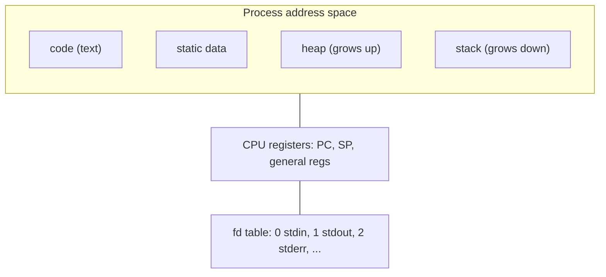
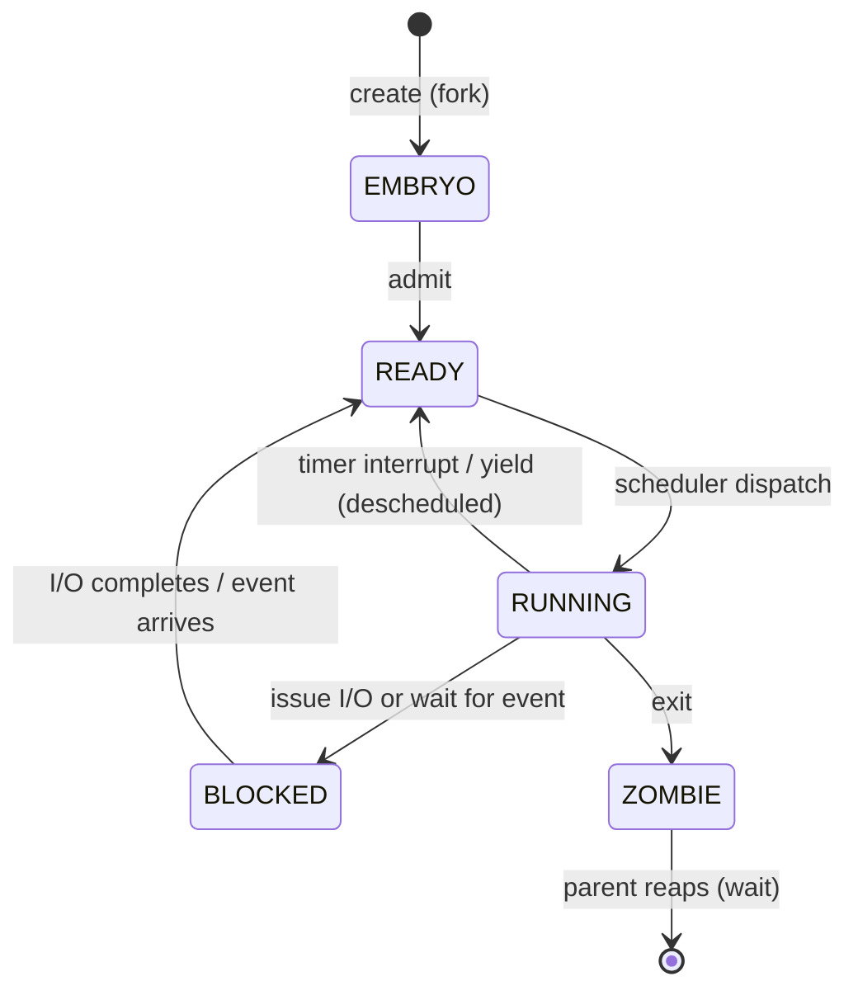

A computer has a handful of physical CPUs, yet a laptop happily runs dozens of programs "at once." The crux: **how does the OS provide the illusion of a nearly-endless supply of CPUs when there is only one (or a few)?** The answer is the **process** — the OS's abstraction of a running program — combined with **time-sharing**, in which the OS runs one process for a slice of time, stops it, runs another, and repeats fast enough that every program appears to have its own dedicated CPU. This page is about what a process actually *is*: the machine state that defines it, the kernel structure that records it, the states it moves through, and the context switch that makes the illusion work.

## The core idea

- A **program** is a passive, on-disk artifact: instructions plus initial data, sitting in an executable file doing nothing. A **process** is that program *in execution* — it has a program counter mid-instruction, a stack with live frames, registers holding values, and memory that changes as it runs. Program is the recipe; process is the cooking.
- To run a program the OS **loads** its code and static data into an address space, allocates a run-time **stack** (and often a **heap**), sets up the standard file descriptors, and jumps to the program's entry point. From that moment a process exists.
- One physical CPU is **virtualized** into many logical CPUs by running each process for a while, then switching. Each process is written as if it owns the machine; the OS multiplexes the real hardware underneath.
- The OS tracks every process in a **process list** (the process table), one entry per process. Each entry is a **process control block (PCB)** holding everything the OS needs to stop a process and later resume it exactly where it left off.
- At any instant a process is in one of a few **states** — running on the CPU, ready to run, or blocked waiting for something (typically I/O). The scheduler's job is deciding which READY process becomes RUNNING next; the mechanism of switching is separate from that policy.

## How it works

### The machine state of a process

A process *is* its machine state — everything a program can read or update while running. To pause and resume a process correctly, the OS must be able to capture and restore all of it:

- **Address space (memory).** The process's view of memory: its code, static data, the heap it grows with `malloc`, and the stack. This is the "memory the program can address," and no other process can touch it (that isolation is memory virtualization, covered separately).
- **Registers**, including two the process cannot live without:
  - the **program counter (PC)**, also called the instruction pointer, which holds the address of the next instruction to execute;
  - the **stack pointer (SP)** (and frame pointer), which anchor the stack of the current function-call chain — parameters, locals, and return addresses.
- **I/O / persistent state.** The list of files the process has open — its **file-descriptor table** — plus the current offset in each. On Linux the first three descriptors are conventionally `stdin` (0), `stdout` (1), and `stderr` (2).



### The process control block (PCB)

The OS records each process's state in a struct — historically the **process control block**, also called the **process descriptor** (Linux calls it `task_struct`). All the PCBs together form the **process list**. A PCB carries, at minimum:

- a **PID** (process identifier) and the **parent PID**, forming the process tree;
- the current **state** (running / ready / blocked / …);
- a saved **register context** — where the PC, SP, and general registers are stashed when the process is not running, so a context switch can restore them;
- pointers to the process's memory (address space / page tables) and its open-file table;
- scheduling bookkeeping (priority, accumulated CPU time) and accounting info.

Here is a stripped-down PCB and process table in C — allocate a slot on `fork`, guard the legal state transitions, and reap a zombie on `wait`:

```c
#include <stdio.h>
#include <string.h>

/* A minimal Process Control Block: the OS's per-process bookkeeping. */
typedef enum { UNUSED, EMBRYO, READY, RUNNING, BLOCKED, ZOMBIE } State;

typedef struct {
    int   pid;
    int   ppid;          /* parent, for zombie reaping */
    State state;
    /* saved machine context (what a context switch restores) */
    unsigned long pc;    /* program counter */
    unsigned long sp;    /* stack pointer */
    unsigned long regs[4];
    int   fd_open[16];   /* open-file table: 1 = fd in use */
} PCB;

#define NPROC 8
typedef struct { PCB proc[NPROC]; int next_pid; } Table;

static void table_init(Table *t) {
    memset(t, 0, sizeof(*t));
    t->next_pid = 1;
    for (int i = 0; i < NPROC; i++) t->proc[i].state = UNUSED;
}

/* Allocate a slot (fork's kernel half): UNUSED -> EMBRYO -> READY. */
static PCB *proc_alloc(Table *t, int ppid) {
    for (int i = 0; i < NPROC; i++) {
        if (t->proc[i].state != UNUSED) continue;
        PCB *p = &t->proc[i];
        memset(p, 0, sizeof(*p));
        p->pid   = t->next_pid++;
        p->ppid  = ppid;
        p->state = EMBRYO;
        p->fd_open[0] = p->fd_open[1] = p->fd_open[2] = 1; /* stdin/out/err */
        p->state = READY;
        return p;
    }
    return NULL;   /* table full */
}

static PCB *find(Table *t, int pid) {
    for (int i = 0; i < NPROC; i++)
        if (t->proc[i].state != UNUSED && t->proc[i].pid == pid)
            return &t->proc[i];
    return NULL;
}

/* Guarded transitions: reject moves the state machine forbids. */
static int can_move(State from, State to) {
    switch (from) {
        case READY:   return to == RUNNING;
        case RUNNING: return to == READY || to == BLOCKED || to == ZOMBIE;
        case BLOCKED: return to == READY;
        default:      return 0;
    }
}

static int transition(Table *t, int pid, State to) {
    PCB *p = find(t, pid);
    if (!p || !can_move(p->state, to)) return -1;
    p->state = to;
    return 0;
}

/* wait(): a parent reaps a ZOMBIE child, freeing its slot. */
static int reap(Table *t, int ppid) {
    for (int i = 0; i < NPROC; i++) {
        PCB *p = &t->proc[i];
        if (p->state == ZOMBIE && p->ppid == ppid) {
            int pid = p->pid;
            p->state = UNUSED;
            return pid;
        }
    }
    return -1;
}

static const char *sn(State s) {
    const char *n[] = {"UNUSED","EMBRYO","READY","RUNNING","BLOCKED","ZOMBIE"};
    return n[s];
}

int main(void) {
    Table t; table_init(&t);

    PCB *a = proc_alloc(&t, 0);   /* init-like parent */
    PCB *b = proc_alloc(&t, a->pid);
    printf("forked pid=%d (state %s), child pid=%d\n", a->pid, sn(a->state), b->pid);

    /* Dispatch child, block it on IO, wake it, run, then exit. */
    transition(&t, b->pid, RUNNING);
    printf("b -> %s\n", sn(find(&t, b->pid)->state));
    transition(&t, b->pid, BLOCKED);
    printf("b -> %s\n", sn(find(&t, b->pid)->state));
    /* illegal: BLOCKED cannot go straight to RUNNING */
    printf("BLOCKED->RUNNING allowed? %d\n", transition(&t, b->pid, RUNNING) == 0);
    transition(&t, b->pid, READY);
    transition(&t, b->pid, RUNNING);
    transition(&t, b->pid, ZOMBIE);
    printf("b -> %s\n", sn(find(&t, b->pid)->state));

    int reaped = reap(&t, a->pid);
    printf("parent reaped child pid=%d, slot now %s\n",
           reaped, sn(t.proc[1].state));
    return 0;
}
```

Running it shows the guard rejecting `BLOCKED -> RUNNING` and the parent reaping the zombie:

```text
forked pid=1 (state READY), child pid=2
b -> RUNNING
b -> BLOCKED
BLOCKED->RUNNING allowed? 0
b -> ZOMBIE
parent reaped child pid=2, slot now UNUSED
```

### Process states and transitions

The three states that matter for scheduling, plus two book-ends for a process's life:

- **RUNNING** — currently executing on a CPU. On a single core, exactly one process is RUNNING at a time.
- **READY** — runnable, but not currently on a CPU; waiting for the scheduler to dispatch it.
- **BLOCKED** — not runnable: waiting for an event, almost always I/O completion (a disk read, a network packet, a key press). A blocked process consumes no CPU.
- **EMBRYO** (a.k.a. *new*) — being created; its PCB is allocated but it has not yet been admitted to the ready list.
- **ZOMBIE** (a.k.a. *terminated / defunct*) — finished executing but its PCB lingers so the parent can read its **exit status** via `wait`. The slot is freed only when the parent reaps it.

The transitions and what causes each:



Two transitions carry most of the weight:

- **RUNNING → READY** happens because the OS *chose* to take the CPU away — a timer interrupt fired at the end of a scheduling quantum, or the process voluntarily yielded. The process is still perfectly runnable; it just isn't running right now.
- **RUNNING → BLOCKED → READY** happens because the process *asked* to wait. It issues an I/O, the OS marks it BLOCKED and runs someone else; when the I/O finishes (signalled by an interrupt), the OS moves it back to READY. Note the crucial detail: I/O completion does **not** put it straight into RUNNING — it must be re-scheduled like anyone else.

### Time-sharing and the context switch

Time-sharing is the mechanism that virtualizes the CPU: run process A for a slice, save its state, restore B's state, run B, and so on. The state save/restore is the **context switch**:

1. A trigger fires — a timer interrupt (to enforce a time slice) or the running process blocking on I/O — and control enters the kernel.
2. The OS **saves** the outgoing process's register context (PC, SP, general registers) into its PCB.
3. The scheduler picks the next READY process (policy — see the scheduling pages).
4. The OS **restores** that process's saved register context from its PCB, switches the address space (installs its page tables), and returns to user mode. Execution resumes at the restored PC, exactly where that process last stopped.

```mermaid
sequenceDiagram
  participant A as Process A (user)
  participant K as Kernel (scheduler)
  participant B as Process B (user)
  A->>K: timer interrupt / blocking syscall
  Note over K: save A's regs -&#62; PCB(A)
  Note over K: pick next READY (policy)
  Note over K: restore PCB(B) -&#62; regs, switch address space
  K->>B: return to user mode (resume at B's PC)
```



A context switch is **pure overhead** — during the switch no user work happens. Its cost is both **direct** (the kernel executing the save/restore/scheduler code) and **indirect** (the new process arrives to cold CPU caches and TLB, so its first instructions run slower until working-set state is re-warmed). This is why the OS balances a time slice small enough to feel responsive against one large enough to amortize the switch cost.

## Must-know algorithms

### Process-state-machine simulator

The classic exercise for this topic: a **scheduler-agnostic state-transition engine** over a process list. Each process runs a tiny "program" of CPU and I/O bursts; the engine advances time tick by tick, dispatching a READY process to the CPU, blocking it when it hits an I/O burst, and unblocking it (back to READY) when the I/O finishes. The scheduling *policy* is isolated in one function (`pick_ready`) — swap it out to get FIFO, round-robin, or SJF without touching the transition logic. That separation of **mechanism** (who is running/ready/blocked) from **policy** (who runs next) is the whole point.

```c
#include <stdio.h>
#include <string.h>

/* Process states in the OSTEP model, plus embryo/zombie book-ends. */
typedef enum { EMBRYO, READY, RUNNING, BLOCKED, ZOMBIE } State;

static const char *state_name(State s) {
    switch (s) {
        case EMBRYO:  return "EMBRYO";
        case READY:   return "READY";
        case RUNNING: return "RUNNING";
        case BLOCKED: return "BLOCKED";
        case ZOMBIE:  return "ZOMBIE";
    }
    return "?";
}

/* A tiny per-process program: a list of "bursts". A CPU burst runs on the
   CPU for some ticks; an IO burst blocks for some ticks. This lets the
   engine decide, tick by tick, when a process is running/ready/blocked. */
typedef enum { CPU, IO } BurstKind;

typedef struct { BurstKind kind; int len; } Burst;

#define MAXB 8
typedef struct {
    char  name[8];
    State state;
    Burst prog[MAXB];   /* the process's program */
    int   nburst;       /* number of bursts */
    int   pc;           /* index of current burst */
    int   left;         /* ticks left in current burst */
} Proc;

/* Pick the next READY process (round-robin-ish: lowest index). The engine is
   scheduler-agnostic — swap this function to change policy without touching
   the transition logic below. */
static int pick_ready(Proc *p, int n) {
    for (int i = 0; i < n; i++)
        if (p[i].state == READY) return i;
    return -1;
}

/* Advance every BLOCKED process's IO by one tick; unblock when it finishes. */
static void tick_io(Proc *p, int n) {
    for (int i = 0; i < n; i++) {
        if (p[i].state != BLOCKED) continue;
        if (--p[i].left <= 0) {
            p[i].pc++;                       /* IO burst done */
            p[i].state = (p[i].pc >= p[i].nburst) ? ZOMBIE : READY;
            if (p[i].state == READY) p[i].left = p[i].prog[p[i].pc].len;
        }
    }
}

/* Admit an EMBRYO into the ready list and prime its first burst. */
static void admit(Proc *pp) {
    pp->state = (pp->nburst == 0) ? ZOMBIE : READY;
    pp->pc = 0;
    if (pp->state == READY) pp->left = pp->prog[0].len;
}

static int all_done(Proc *p, int n) {
    for (int i = 0; i < n; i++)
        if (p[i].state != ZOMBIE) return 0;
    return 1;
}

/* Run the state machine to completion, printing a per-tick trace. */
static void run(Proc *p, int n) {
    for (int i = 0; i < n; i++) admit(&p[i]);   /* EMBRYO -> READY */

    int t = 0, running = -1;
    while (!all_done(p, n)) {
        /* IO progresses in parallel with whatever the CPU is doing. */
        tick_io(p, n);

        /* If nobody holds the CPU, dispatch a READY process (READY->RUNNING). */
        if (running < 0 || p[running].state != RUNNING) {
            running = pick_ready(p, n);
            if (running >= 0) p[running].state = RUNNING;
        }

        printf("t=%2d  cpu=%-8s", t, running >= 0 ? p[running].name : "idle");
        for (int i = 0; i < n; i++)
            printf(" %s:%s", p[i].name, state_name(p[i].state));
        printf("\n");

        /* Execute one CPU tick for the running process. */
        if (running >= 0) {
            Proc *r = &p[running];
            if (--r->left <= 0) {
                r->pc++;                                 /* CPU burst done */
                if (r->pc >= r->nburst) {
                    r->state = ZOMBIE;                   /* RUNNING -> ZOMBIE */
                } else if (r->prog[r->pc].kind == IO) {
                    r->state = BLOCKED;                  /* RUNNING -> BLOCKED */
                    r->left  = r->prog[r->pc].len;
                } else {
                    r->state = READY;                    /* yields, re-queues */
                    r->left  = r->prog[r->pc].len;
                }
                running = -1;
            }
        }
        t++;
        if (t > 100) break;   /* safety */
    }
    printf("done at t=%d\n", t);
}

int main(void) {
    Proc p[2] = {
        { .name = "P0", .state = EMBRYO, .nburst = 3,
          .prog = { {CPU,2}, {IO,3}, {CPU,2} } },
        { .name = "P1", .state = EMBRYO, .nburst = 1,
          .prog = { {CPU,4} } },
    };
    run(p, 2);
    return 0;
}
```

The trace shows the abstraction at work: P0 runs, blocks on I/O, and the CPU is handed to P1 rather than sitting idle; when P0's I/O completes it returns to READY and resumes:

```text
t= 0  cpu=P0       P0:RUNNING P1:READY
t= 1  cpu=P0       P0:RUNNING P1:READY
t= 2  cpu=P1       P0:BLOCKED P1:RUNNING
t= 3  cpu=P1       P0:BLOCKED P1:RUNNING
t= 4  cpu=P1       P0:READY P1:RUNNING
t= 5  cpu=P1       P0:READY P1:RUNNING
t= 6  cpu=P0       P0:RUNNING P1:ZOMBIE
t= 7  cpu=P0       P0:RUNNING P1:ZOMBIE
done at t=8
```

Compile either program with `cc -std=c11 -x c file.c -o /tmp/x && /tmp/x`.

## Interview questions

**1. What's the difference between a program and a process?**
A program is the passive executable on disk — code plus static data, doing nothing. A process is a program *in execution*: it adds the dynamic machine state (address space, PC and other registers, stack, heap, open files) and a state in the OS's scheduling machine. One program can back many concurrent processes (e.g., several instances of an editor), each with its own independent state.

**2. What's stored in a PCB?**
The per-process bookkeeping the OS needs to stop and later resume a process: its PID and parent PID, current state, the saved register context (PC, SP, general registers) used by context switches, pointers to its address space (page tables) and open-file table, and scheduling/accounting data (priority, CPU time used). All PCBs together form the process list / table.

**3. What are the process states and what causes each transition?**
RUNNING (on a CPU), READY (runnable, waiting for a CPU), BLOCKED (waiting for an event, usually I/O), plus EMBRYO (being created) and ZOMBIE (exited, awaiting reap). RUNNING→READY: a timer interrupt or voluntary yield deschedules it. RUNNING→BLOCKED: it issues an I/O or waits on an event. BLOCKED→READY: the event/I/O completes (note: it becomes READY, not RUNNING). READY→RUNNING: the scheduler dispatches it. RUNNING→ZOMBIE: it exits.

**4. What does a context switch save and restore, and why is it costly?**
It saves the outgoing process's register context (PC, SP, general registers) into its PCB, picks the next process, restores that process's register context, and switches address space (page tables/TLB). The cost is direct (kernel cycles running the switch code) and indirect (the incoming process hits cold CPU caches and TLB, running slower until its working set is re-warmed). It is pure overhead — no user work happens during the switch.

**5. Zombie vs orphan process — what's the difference?**
A **zombie** has finished executing but its PCB is retained so its parent can read its exit status via `wait`; it's reaped (slot freed) once the parent does so. An **orphan** is a still-*running* child whose parent exited first; it is re-parented to `init` (PID 1, or a subreaper), which then reaps it when it eventually exits. Zombie = dead but unreaped; orphan = alive but parentless.

**6. How does the OS keep track of all processes?**
Via the process list / process table: one PCB per process, holding its identity, state, saved context, and resource pointers. The scheduler walks the READY entries to pick who runs next; the parent/child PIDs form the process tree used for `wait`, signals, and reaping. On Linux each PCB is a `task_struct`, and you can inspect the live table with `ps` (which reads `/proc`).

**7. How does the user's view of a process differ from the kernel's?**
From **user space**, a process sees a single, private, contiguous virtual address space and a CPU that seems dedicated to it — an isolated virtual machine. From the **kernel's** view, that process is one PCB among many in a shared table, holding a slice of physical memory scattered across frames, time-multiplexed onto shared physical CPUs, with its "registers" often sitting saved in the PCB rather than in hardware. The abstraction is exactly the gap between these two views.

**8. Why doesn't an I/O completion move a process straight to RUNNING?**
Because scheduling is a separate decision from readiness. I/O completion only makes the process *runnable* again (BLOCKED→READY); whether it runs next depends on the scheduler and who else is READY. Coupling the two would let I/O completions preempt scheduling policy arbitrarily.

## Coding problems

**🎯 Interview**

- [LeetCode 1472 — Design Browser History](https://leetcode.com/problems/design-browser-history/) — models a stateful history with visit/back/forward; the same "keep a position in a saved sequence of states and move through it" idea as tracking where a process is in its execution. Tests state-history design.
- [LeetCode 155 — Min Stack](https://leetcode.com/problems/min-stack/) — maintain auxiliary saved state (the running minimum) alongside a stack so it can be restored in O(1) on pop; an analogy for the save/restore discipline a context switch performs on process state. Tests O(1) state save/restore. See also the DSA page on [stacks and amortized cost](/docs/dsa/s01-foundations/s01e06-stacks-queues-amortized).

**🏗 Systems**

- **Process table with state transitions** — implement a fixed-size process table where slots are allocated on `fork`, transitions are guarded against illegal moves (e.g., BLOCKED→RUNNING is rejected), and a parent reaps zombie children. The complete C reference is the PCB/process-table program above. Tests the mechanism/policy split and correct modelling of the state machine. Background: [`fork(2)`](https://man7.org/linux/man-pages/man2/fork.2.html), [`wait(2)`](https://man7.org/linux/man-pages/man2/wait.2.html), and [`ps(1)`](https://man7.org/linux/man-pages/man1/ps.1.html).

## Key takeaways

- A **process** is the OS abstraction of a running program: a program plus its live machine state (address space, registers including PC and SP, and open files).
- The **PCB** is the kernel's per-process record — identity, state, saved register context, and resource pointers — and all PCBs together are the **process list**.
- Processes move through **RUNNING / READY / BLOCKED** (book-ended by embryo and zombie); the causes of each transition — timer/yield, I/O wait, I/O completion, dispatch, exit — are the heart of the model.
- **Time-sharing** virtualizes one CPU into many; the **context switch** (save regs → pick next → restore regs → switch address space) is the mechanism, and it is pure, cache-cooling overhead.
- Separate **mechanism** (who is running/ready/blocked) from **policy** (who runs next) — the simulator makes this concrete by isolating the scheduler in a single swappable function.

## Source(s) and further reading

- [OSTEP — The Abstraction: The Process (free PDF)](https://pages.cs.wisc.edu/~remzi/OSTEP/cpu-intro.pdf) — the chapter this page is grounded in.
- [`fork(2)` — Linux manual page](https://man7.org/linux/man-pages/man2/fork.2.html) — creating a process.
- [`execve(2)` — Linux manual page](https://man7.org/linux/man-pages/man2/execve.2.html) — replacing a process's program image.
- [`wait(2)` — Linux manual page](https://man7.org/linux/man-pages/man2/wait.2.html) — reaping children and reading exit status.
- [`ps(1)` — Linux manual page](https://man7.org/linux/man-pages/man1/ps.1.html) — inspecting the live process list.
- [Process (computing) — Wikipedia](https://en.wikipedia.org/wiki/Process_(computing)) and [Process control block — Wikipedia](https://en.wikipedia.org/wiki/Process_control_block).
