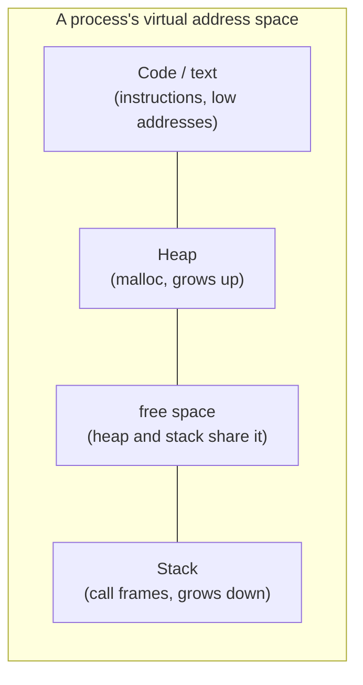
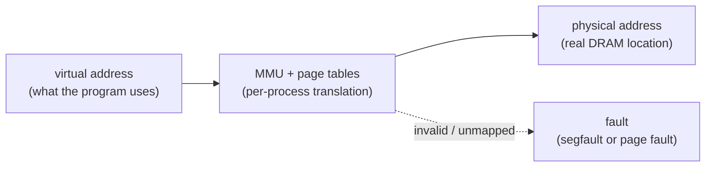
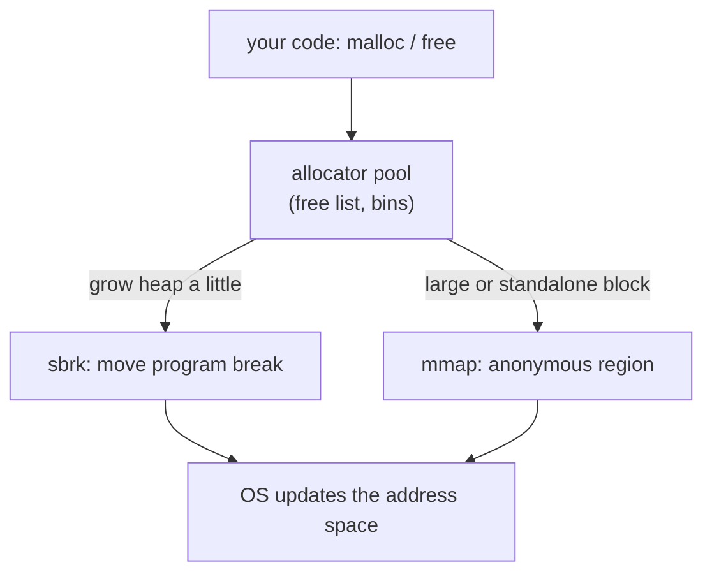

# Address Spaces & the Memory API

**The crux:** physical memory is one shared array of bytes, but we run many processes at once and each wants to believe it owns all of memory, starting at a familiar layout, protected from everyone else. How does the OS give every process the private, contiguous-looking memory it expects while the real DRAM is shared, fragmented, and finite? The answer is the **address space** — a per-process virtual abstraction the OS and hardware translate onto physical RAM. This page builds that abstraction, then walks the API a C programmer actually touches to allocate and free memory inside it, and the bugs that bite when you get it wrong.

## The core idea

- The **address space** is the OS abstraction of memory that a process sees: a private, linear range of bytes from address 0 up to some maximum. It contains everything the program needs to run.
- Its classic regions:
  - **Code (text)** — the program's instructions, fixed in size, placed at the low end.
  - **Heap** — dynamically allocated memory (via `malloc`); it **grows upward**, toward higher addresses.
  - **Stack** — function call frames, local variables, return addresses; it **grows downward**, toward lower addresses.
  - Heap and stack grow toward each other so that a single address space can flexibly split its free middle between them without deciding the split up front.
- Every address a user program ever sees or prints is **virtual**. The program never touches a physical DRAM address directly; the hardware translates each virtual address to a physical one on every access.
- The abstraction exists to hit three goals at once:
  - **Transparency** — the program behaves as if it has its own large, private memory; it need not know virtualization is happening.
  - **Efficiency** — virtualization must be cheap in both time (hardware support like the MMU and TLB) and space (compact page tables), or nobody would use it.
  - **Protection / isolation** — one process cannot read or corrupt another's memory, nor the OS's; each is sandboxed in its own address space.



## How it works

### Virtual versus physical addresses

- A **virtual address** is what the program uses; a **physical address** is a real location in DRAM. On every load, store, and instruction fetch, the hardware **Memory Management Unit (MMU)** translates virtual to physical using per-process tables the OS maintains.
- Because the translation is **per process**, two processes can use the *same* virtual address for *different* physical memory — that is exactly how isolation is achieved. Process A's address 0x1000 and process B's address 0x1000 map to different DRAM.
- You can watch every user address be virtual: printing the address of a stack variable, a heap allocation, and a function in the same program shows values from the process's own virtual layout, unrelated to where the bytes physically live.



### Stack versus heap: two lifetimes

- **Stack (automatic) memory** is managed *for* you by the compiler. Declaring `int x;` inside a function allocates `x` on the stack on entry and frees it automatically on return. You never call anything; the lifetime is tied to the enclosing scope.
- **Heap memory** is managed *by* you, explicitly, with `malloc` and `free`. It lives until you free it, independent of any scope — which is precisely why it is both powerful and dangerous.
- The rule of thumb: use the stack for anything whose size is known and whose lifetime matches a function call; use the heap when the size is dynamic or the object must outlive the call that created it.

```c
#include <stdlib.h>

/* WRONG: returns a pointer to a stack local that dies on return. */
int *make_stack(void) {
    int v = 7;
    return &v;          /* v is gone once this function returns */
}

/* RIGHT: heap memory outlives the call; the caller must free it. */
int *make_heap(void) {
    int *p = malloc(sizeof(int));   /* survives past return */
    if (p) *p = 7;
    return p;
}
```

### `sizeof` pitfalls

- `malloc` takes a **byte count**, so you compute it with `sizeof`. The safe idiom is `sizeof(*ptr)` — it stays correct even if the pointed-to type changes.
- The classic trap: `sizeof` on a **pointer** gives the pointer's size (typically 8 bytes on a 64-bit machine), not the size of what it points to. A `sizeof(arr)` that returned the whole array in one scope silently becomes `sizeof(ptr)` once the array **decays to a pointer** when passed to a function.

```c
#include <stdio.h>
void takes_array(int a[]) {
    /* a is a pointer here: sizeof(a) is 8, NOT the array's size. */
    printf("inside function, sizeof(a) = %zu\n", sizeof(a));
}
int main(void) {
    int arr[10];
    printf("in main, sizeof(arr) = %zu\n", sizeof(arr));  /* 40 */
    takes_array(arr);                                     /* prints 8 */
    return 0;
}
```

### `brk`/`sbrk` and `mmap` under the hood

- `malloc` and `free` are **library** calls, not system calls. They manage a pool of memory inside your process and only ask the OS for more when they run out.
- To grow the heap, the allocator uses the **`brk`/`sbrk`** system calls, which move the **program break** — the end of the heap segment. Raising the break makes the heap bigger; lowering it shrinks it. You should never call `brk`/`sbrk` directly; `malloc` owns the break.
- For large requests, allocators instead use **`mmap`**, which asks the OS for a fresh region of anonymous (zero-filled, not file-backed) memory anywhere in the address space. Large blocks obtained via `mmap` can be returned to the OS independently with `munmap`, which avoids stranding a big free block in the middle of the heap.
- So the layering is: your code calls `malloc` → `malloc` carves from its pool → when the pool is short, `malloc` calls `sbrk` (small growth) or `mmap` (large / independent blocks) → the OS updates the address space.



### What causes a segmentation fault

- A **segmentation fault** is the hardware and OS refusing a memory access that your process is not allowed to make: dereferencing `NULL`, following a wild or dangling pointer into unmapped memory, writing to read-only pages (like string literals or the code segment), or overrunning far past a valid allocation.
- The MMU checks every access against the page tables. If the virtual address is unmapped or the access violates the page's permissions, it raises a fault; the OS turns that into `SIGSEGV`. This same machinery is what enforces isolation — an access that would land in another process's memory simply is not mapped in yours.

## Must-know algorithms

### A bump (arena) allocator

The simplest possible allocator: one buffer and a moving offset. Each allocation "bumps" the offset forward; there is no per-object free — you reset the whole arena at once. It has zero per-object metadata, no fragmentation, and O(1) allocation, which is why arenas are used for request-scoped or frame-scoped memory. Build and run:

```
cc -std=c11 arena.c -o arena && ./arena
```

```c
#include <stdio.h>
#include <stdint.h>
#include <stddef.h>
#include <string.h>

/* A bump (arena) allocator: one big buffer, a moving offset.
   Allocation is "bump the pointer"; there is no per-object free —
   the whole arena is reset at once. Fast, no fragmentation, no metadata. */
typedef struct {
    unsigned char *base;   /* start of the backing buffer */
    size_t cap;            /* total bytes available       */
    size_t off;            /* bytes handed out so far     */
} Arena;

static void arena_init(Arena *a, void *buf, size_t cap) {
    a->base = (unsigned char *)buf;
    a->cap  = cap;
    a->off  = 0;
}

/* Round n up to the next multiple of align (align must be a power of two). */
static size_t align_up(size_t n, size_t align) {
    return (n + (align - 1)) & ~(align - 1);
}

/* Return a pointer to size bytes, aligned; NULL if the arena is exhausted. */
static void *arena_alloc(Arena *a, size_t size, size_t align) {
    size_t aligned = align_up(a->off, align);
    if (aligned + size > a->cap) return NULL;   /* out of room */
    void *p = a->base + aligned;
    a->off = aligned + size;
    return p;
}

/* Free everything at once by rewinding the offset. Individual objects
   cannot be freed — that is the whole point of an arena. */
static void arena_reset(Arena *a) { a->off = 0; }

int main(void) {
    unsigned char buffer[256];
    Arena a;
    arena_init(&a, buffer, sizeof buffer);

    /* Hand out a few differently-sized, aligned objects. */
    int    *xs = arena_alloc(&a, 4 * sizeof(int), _Alignof(int));
    double *d  = arena_alloc(&a, sizeof(double),  _Alignof(double));
    char   *s  = arena_alloc(&a, 16,              1);

    for (int i = 0; i < 4; i++) xs[i] = i * i;
    *d = 3.14159;
    strcpy(s, "arena");

    printf("xs = %d %d %d %d\n", xs[0], xs[1], xs[2], xs[3]);
    printf("d  = %.5f\n", *d);
    printf("s  = %s\n", s);
    printf("used %zu of %zu bytes\n", a.off, a.cap);

    /* Alignment check: the double must sit on an 8-byte boundary. */
    printf("d aligned to 8? %s\n",
           ((uintptr_t)d % _Alignof(double) == 0) ? "yes" : "no");

    arena_reset(&a);
    printf("after reset, used %zu bytes\n", a.off);
    return 0;
}
```

Output:

```
xs = 0 1 4 9
d  = 3.14159
s  = arena
used 40 of 256 bytes
d aligned to 8? yes
after reset, used 0 bytes
```

### The classic memory bugs, reproduced then fixed

Every classic heap bug in one compilable demo. Each bug is shown in a **BAD** form (behind `#if 0`, so the program still runs clean) and a **FIXED** form that executes. Compile with sanitizers and flip an `#if 0` to `#if 1` to watch the detector fire:

```
cc -std=c11 -fsanitize=address,undefined bugs.c -o bugs && ./bugs
```

```c
#include <stdio.h>
#include <stdlib.h>
#include <string.h>

/* Each bug appears in a BAD form (behind #if 0, so the program still
   runs clean) and a FIXED form that executes. Build with sanitizers
       cc -std=c11 -fsanitize=address,undefined bugs.c -o bugs
   and flip an #if 0 to #if 1 to watch the detector fire. */

/* 1. Uninitialized read: using memory before writing it. */
static void uninitialized_read(void) {
#if 0   /* BAD: v holds garbage */
    int v;
    printf("uninit = %d\n", v + 1);
#else   /* FIX: initialize before use */
    int v = 0;
    printf("[1] initialized = %d\n", v + 1);
#endif
}

/* 2. Buffer overflow: writing past the end of an allocation. */
static void buffer_overflow(void) {
#if 0   /* BAD: 12 chars + NUL into an 8-byte buffer */
    char *buf = malloc(8);
    strcpy(buf, "0123456789AB");
    free(buf);
#else   /* FIX: size the buffer for the data including the NUL */
    char *buf = malloc(16);
    strcpy(buf, "0123456789AB");
    printf("[2] copied safely: %s\n", buf);
    free(buf);
#endif
}

/* 3. Use-after-free: dereferencing a pointer whose block was freed. */
static void use_after_free(void) {
    int *p = malloc(sizeof(int));
    *p = 42;
    free(p);
#if 0   /* BAD: p now dangles */
    printf("uaf = %d\n", *p);
#else   /* FIX: null on free; use a fresh block */
    p = NULL;
    int *q = malloc(sizeof(int));
    *q = 42;
    printf("[3] fresh read = %d\n", *q);
    free(q);
#endif
}

/* 4. Double free: freeing the same block twice. */
static void double_free(void) {
    int *p = malloc(sizeof(int));
    free(p);
#if 0   /* BAD: second free corrupts allocator metadata */
    free(p);
#else   /* FIX: null after free; free(NULL) is a safe no-op */
    p = NULL;
    free(p);
    printf("[4] free(NULL) is a safe no-op\n");
#endif
}

/* 5. Memory leak: dropping the last pointer without freeing. */
static void memory_leak(void) {
#if 0   /* BAD: block becomes unreachable, never freed */
    char *big = malloc(1024);
    big[0] = 'x';   /* returns without free(big) */
#else   /* FIX: pair every malloc with a free on every path */
    char *big = malloc(1024);
    big[0] = 'x';
    printf("[5] wrote %c, freeing\n", big[0]);
    free(big);
#endif
}

/* 6. Dangling pointer: returning the address of a stack local. */
static int *make_value_bad(void) {
    int local = 7;
    int *p = &local;   /* dies when the function returns */
    return p;
}
static int *make_value_fix(void) {
    int *heap = malloc(sizeof(int));
    *heap = 7;
    return heap;       /* heap outlives the call; caller frees */
}
static void dangling_pointer(int use_bad) {
    if (use_bad) {
        /* Off by default: calling through this pointer is undefined. */
        int *bad = make_value_bad();
        printf("dangling = %d\n", *bad);
    } else {
        int *ok = make_value_fix();
        printf("[6] heap value survives return = %d\n", *ok);
        free(ok);
    }
}

int main(void) {
    uninitialized_read();
    buffer_overflow();
    use_after_free();
    double_free();
    memory_leak();
    dangling_pointer(0);   /* 0 = safe path; pass 1 to trigger the bug */
    return 0;
}
```

Output (all safe paths taken):

```
[1] initialized = 1
[2] copied safely: 0123456789AB
[3] fresh read = 42
[4] free(NULL) is a safe no-op
[5] wrote x, freeing
[6] heap value survives return = 7
```

Which bug maps to which tool:

| Bug | What goes wrong | Caught by |
| --- | --- | --- |
| Uninitialized read | Reading a value never written | Valgrind (memcheck), MSan |
| Buffer overflow | Writing past an allocation | ASan, Valgrind |
| Use-after-free | Touching freed memory | ASan, Valgrind |
| Double free | Freeing the same block twice | ASan, Valgrind |
| Memory leak | Losing the last pointer to a block | Valgrind (leak-check), ASan (LSan) |
| Dangling pointer | Pointer to memory that no longer exists | ASan (stack-use-after-return), compiler warnings |

- **Valgrind** runs your unmodified binary on a synthetic CPU and checks every memory access; thorough but slow.
- **AddressSanitizer (ASan)** is compiled in with `-fsanitize=address` and is much faster, catching overflows, use-after-free, and (with the leak sanitizer) leaks with precise reports.

### Building `malloc`/`free`: a free-list allocator

A real allocator over a fixed byte pool: a singly-linked **free list** with **first-fit** placement, **splitting** oversized blocks, and **coalescing** adjacent free blocks on `free`. The pool stands in for the heap segment that `sbrk`/`mmap` would supply. Build and run:

```
cc -std=c11 mymalloc.c -o mymalloc && ./mymalloc
```

```c
#include <stdio.h>
#include <stdint.h>
#include <stddef.h>
#include <string.h>

/* A tiny malloc/free over a fixed byte pool, using a singly-linked
   free list with first-fit placement, splitting, and coalescing.
   This mirrors what a real allocator does on top of brk/mmap, minus
   the OS calls: the pool here stands in for the heap segment. */

#define POOL_BYTES 4096
static unsigned char pool[POOL_BYTES];

/* Every block (free or allocated) carries a header. Free blocks are
   threaded together through `next`; the size excludes the header. */
typedef struct Block {
    size_t size;          /* usable payload bytes in this block */
    int    free;          /* 1 = on the free list, 0 = handed out */
    struct Block *next;   /* next free block (free list only)     */
} Block;

#define HDR sizeof(Block)

static Block *free_list = NULL;

/* Lay the whole pool out as one giant free block. */
static void heap_init(void) {
    free_list = (Block *)pool;
    free_list->size = POOL_BYTES - HDR;
    free_list->free = 1;
    free_list->next = NULL;
}

/* Round up to 8-byte alignment so payloads stay aligned. */
static size_t align8(size_t n) { return (n + 7) & ~((size_t)7); }

/* First-fit: return the first free block big enough, else NULL. */
static void *my_malloc(size_t want) {
    if (want == 0) return NULL;
    want = align8(want);
    Block *b = free_list;
    while (b) {
        if (b->free && b->size >= want) {
            /* Split if the leftover can hold a header + at least 8 bytes. */
            if (b->size >= want + HDR + 8) {
                Block *rest = (Block *)((unsigned char *)b + HDR + want);
                rest->size = b->size - want - HDR;
                rest->free = 1;
                rest->next = b->next;
                b->size = want;
                b->next = rest;
            }
            b->free = 0;
            return (unsigned char *)b + HDR;
        }
        b = b->next;
    }
    return NULL;   /* out of pool memory */
}

/* Mark a block free, then coalesce with any adjacent free neighbours
   (walk the address-ordered pool to merge physically contiguous blocks). */
static void my_free(void *ptr) {
    if (!ptr) return;                     /* free(NULL) is a no-op */
    Block *b = (Block *)((unsigned char *)ptr - HDR);
    b->free = 1;

    /* Rebuild the free list in address order and coalesce neighbours. */
    free_list = NULL;
    Block **tail = &free_list;
    unsigned char *p = pool;
    Block *prev_free = NULL;
    while (p < pool + POOL_BYTES) {
        Block *cur = (Block *)p;
        size_t step = HDR + cur->size;
        if (cur->free) {
            if (prev_free &&
                (unsigned char *)prev_free + HDR + prev_free->size == p) {
                /* Merge cur into the previous free block. */
                prev_free->size += HDR + cur->size;
            } else {
                *tail = cur;
                tail = &cur->next;
                cur->next = NULL;
                prev_free = cur;
            }
        } else {
            prev_free = NULL;
        }
        p += step;
    }
}

/* Count free bytes and free blocks for testing. */
static void heap_stats(size_t *bytes, int *blocks) {
    *bytes = 0; *blocks = 0;
    for (Block *b = free_list; b; b = b->next) {
        *bytes += b->size; (*blocks)++;
    }
}

int main(void) {
    heap_init();
    size_t bytes; int blocks;

    char *a = my_malloc(100);
    char *b = my_malloc(200);
    char *c = my_malloc(50);
    strcpy(a, "alpha"); strcpy(b, "bravo"); strcpy(c, "charlie");
    printf("allocated: %s %s %s\n", a, b, c);

    heap_stats(&bytes, &blocks);
    printf("after 3 allocs: %zu free bytes in %d block(s)\n", bytes, blocks);

    /* Free the middle block, then the neighbours, to exercise coalescing. */
    my_free(b);
    heap_stats(&bytes, &blocks);
    printf("after free(b):  %zu free bytes in %d block(s)\n", bytes, blocks);

    my_free(a);
    my_free(c);
    heap_stats(&bytes, &blocks);
    printf("after freeing all: %zu free bytes in %d block(s)\n", bytes, blocks);

    /* Everything coalesced back to one block means no fragmentation. */
    printf("fully coalesced? %s\n", (blocks == 1) ? "yes" : "no");
    return 0;
}
```

Output:

```
allocated: alpha bravo charlie
after 3 allocs: 4000 free bytes in 4 block(s)
after free(b):  3840 free bytes in 2 block(s)
after freeing all: 4072 free bytes in 1 block(s)
fully coalesced? yes
```

The `after free(b)` line shows the middle block returned to the pool; the final line shows that freeing the remaining blocks lets coalescing merge everything back into one, undoing all fragmentation. The free list here uses the same pointer-machine mechanics as [Linked Lists & the Pointer Machine](/docs/dsa/s01-foundations/s01e07-linked-lists-pointer-machine); real allocators add size bins on top, echoing [Hash Tables](/docs/dsa/s01-foundations/s01e14-hash-tables).

## Interview questions

**1. Virtual versus physical address — what is the difference?**
A virtual address is what a program uses; every address a user process sees is virtual. A physical address is a real location in DRAM. On each access the MMU translates virtual to physical using the running process's page tables. Because translation is per process, the same virtual address in two processes maps to different physical memory — that is how isolation works.

**2. Stack versus heap allocation — when do you use each?**
Stack memory is allocated automatically by the compiler for locals and freed on function return; its lifetime is tied to scope and it needs no explicit management. Heap memory is requested explicitly with `malloc` and lives until you `free` it, independent of scope. Use the stack for fixed-size, short-lived data; use the heap when the size is dynamic or the object must outlive the function that created it. Never return a pointer to a stack local.

**3. What do `malloc` and `free` actually do under the hood?**
They are library routines, not system calls. `malloc` manages a pool of memory inside the process and carves allocations from it. When the pool runs short it asks the OS for more: `sbrk`/`brk` to move the program break and grow the heap for small requests, or `mmap` to obtain a fresh anonymous region for large or independently-returnable blocks. `free` returns a block to the pool (often coalescing neighbours); it does not necessarily return memory to the OS.

**4. Define a dangling pointer, use-after-free, and double free, and how to avoid them.**
A dangling pointer points at memory that no longer exists — a freed heap block or a returned stack frame. Dereferencing it is use-after-free (or a stack-use-after-return); freeing it again is a double free, which corrupts allocator metadata. Avoid all three by setting a pointer to `NULL` immediately after freeing (so a stray use faults and a second `free(NULL)` is a harmless no-op), never returning addresses of locals, and giving each block a single clear owner responsible for freeing it.

**5. What is a memory leak and why does it matter?**
A leak is heap memory you allocated but lost the last pointer to, so it can never be freed. Over time leaks grow a process's memory footprint until it thrashes or is killed — especially damaging in long-running servers. Avoid them by pairing every `malloc` with a `free` on every code path (including error paths) and by running the program under Valgrind's leak checker or the leak sanitizer.

**6. What causes a segmentation fault?**
An access the hardware and OS forbid: dereferencing `NULL`, following a wild or dangling pointer into unmapped memory, writing to read-only pages such as string literals or the code segment, or running far off the end of an allocation into unmapped territory. The MMU checks each access against the page tables; an unmapped address or a permission violation raises a fault that the OS delivers as `SIGSEGV`.

**7. How is isolation between processes enforced?**
Each process has its own address space and its own page tables. The MMU translates every access through the current process's tables, and only that process's physical frames are mapped. An address that would fall in another process's memory simply is not mapped in yours, so the access faults. The OS controls the page tables and switches them on every context switch, and user code cannot edit them — that is the enforcement.

**8. What is the `sizeof` pitfall with arrays and pointers?**
`sizeof(arr)` on a real array gives the total array size, but an array **decays to a pointer** when passed to a function, so inside the function `sizeof(param)` gives the pointer's size (usually 8), not the array's. This silently breaks size calculations. Pass the length alongside the pointer, and prefer `sizeof(*ptr)` in `malloc` calls so the count stays correct even if the type changes.

**9. Why do the heap and stack grow toward each other?**
Placing the heap low (growing up) and the stack high (growing down), with free space between them, lets a single fixed address-space layout hand that shared middle to whichever region needs it, without pre-committing a split. A program that is stack-heavy or heap-heavy both work under the same layout; collision only happens if the whole space is exhausted.

**10. What is the difference between `brk`/`sbrk` and `mmap` for growing memory?**
`brk`/`sbrk` move the single **program break** at the top of the heap, growing or shrinking one contiguous segment — cheap but LIFO-ish, since a freed block below the break cannot be returned to the OS until everything above it is freed. `mmap` maps an independent anonymous region anywhere in the address space, which can be `munmap`-ed on its own; allocators use it for large blocks so freeing them returns memory to the OS immediately.

## Coding problems

### 🎯 Interview (LeetCode)

- **[146. LRU Cache](https://leetcode.com/problems/lru-cache/)** — design a fixed-capacity cache with O(1) get and put, evicting the least-recently-used entry. Tests: a hash map plus a doubly-linked list — the exact data structure inside real caches and TLBs. Directly relevant to the page-replacement and caching material later in this section.
- **[460. LFU Cache](https://leetcode.com/problems/lfu-cache/)** — like LRU but evict the least-*frequently*-used entry, breaking ties by recency, still O(1). Tests: frequency buckets each holding an ordered list, plus a hash map — a harder cache-design problem.
- **[588. Design In-Memory File System](https://leetcode.com/problems/design-in-memory-file-system/)** — build `ls`, `mkdir`, `addContentToFile`, and `readContentFromFile` over an in-memory tree. Tests: modelling a hierarchical namespace with nested maps — memory-resident data-structure design.

### 🏗 Systems (OS-classic)

- **Implement a simple `malloc`/`free` (free list)** — manage a fixed byte pool with a linked free list: first-fit placement, split oversized blocks, and coalesce adjacent free blocks on `free`. The complete reference implementation is the C program in [Must-know algorithms](#must-know-algorithms) above. Tests: understanding of allocator metadata, fragmentation, and what `malloc`/`free` do on top of `sbrk`/`mmap`.
- **Build a bump/arena allocator** — one buffer, a moving offset, O(1) allocation, bulk reset. Reference implementation is the arena program above. Tests: alignment, lifetime scoping, and why per-object free is sometimes deliberately omitted.

## Key takeaways

- The **address space** is the per-process abstraction of memory: code low, heap growing up, stack growing down, free space shared between them.
- **Every user address is virtual**; the MMU translates it to physical DRAM on each access, and the per-process mapping is what enforces **isolation**.
- The abstraction targets three goals — **transparency**, **efficiency**, and **protection**.
- **Stack** memory is automatic and scope-bound; **heap** memory is explicit (`malloc`/`free`) and lives until freed. Never return a pointer to a stack local.
- `malloc`/`free` are library calls over a pool; they grow the pool with **`sbrk`** (small) or **`mmap`** (large / independently freeable).
- The recurring bugs — uninitialized read, buffer overflow, use-after-free, double free, leak, dangling pointer — are caught by **Valgrind** and **AddressSanitizer**; nulling pointers after `free` and single ownership prevent most of them.

## Source(s) and further reading

- [OSTEP — The Abstraction: Address Spaces (free PDF)](https://pages.cs.wisc.edu/~remzi/OSTEP/vm-intro.pdf) — the address-space abstraction, virtual addressing, and the goals of virtualization.
- [OSTEP — Interlude: Memory API (free PDF)](https://pages.cs.wisc.edu/~remzi/OSTEP/vm-api.pdf) — `malloc`/`free`, common errors, and the calls beneath them.
- [OSTEP homepage (all free chapters)](https://pages.cs.wisc.edu/~remzi/OSTEP/) — Arpaci-Dusseau, _Operating Systems: Three Easy Pieces_.
- [malloc(3) — man7.org](https://man7.org/linux/man-pages/man3/malloc.3.html) — allocation semantics and return values.
- [free(3) — man7.org](https://man7.org/linux/man-pages/man3/free.3.html) — freeing rules and the safe `free(NULL)` no-op.
- [brk(2) / sbrk(2) — man7.org](https://man7.org/linux/man-pages/man2/brk.2.html) — moving the program break to size the heap.
- [mmap(2) — man7.org](https://man7.org/linux/man-pages/man2/mmap.2.html) — mapping anonymous or file-backed regions into the address space.
- [Virtual address space — Wikipedia](https://en.wikipedia.org/wiki/Virtual_address_space) — the per-process virtual layout.
- [Memory management — Wikipedia](https://en.wikipedia.org/wiki/Memory_management) — allocators, fragmentation, and the C dynamic-memory API.
