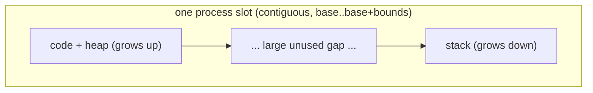

# Address Translation: Base and Bounds

**The crux:** every process is written as if it owns a private, zero-based address space, yet dozens of processes share one physical memory. How can the hardware turn each process's *virtual* addresses into real *physical* addresses — transparently, on every single memory reference, at full speed, and with protection so that one process can never touch another's memory? The answer is **hardware-based address translation**: the CPU rewrites each virtual address into a physical one as the instruction executes, under limits the OS installs. The simplest form of this mechanism is **dynamic relocation**, better known as **base-and-bounds**.

## The core idea

- **Virtual addresses are a fiction the hardware maintains.** A program loads and stores using addresses that start at 0 and run up to its size. Those addresses are *virtual*: no byte actually lives there. On each reference the hardware translates the virtual address to the physical location where the data really sits.
- **Translation must be efficient, so it is hardware.** The OS cannot inspect every load and store — that would be catastrophically slow. Instead the OS sets up a small amount of hardware once, and the **MMU** (memory management unit) performs the translation autonomously on every reference.
- **Base-and-bounds is the minimal translation.** Give each process one contiguous slot of physical memory. Store the slot's physical start in a **base register** and its size in a **bounds** (or **limit**) **register**. Then:
  - **Relocation:** add the base to every virtual address to get the physical address.
  - **Protection:** before adding, check the virtual address against the bounds; if it is out of range, raise a fault instead of touching memory.
- **Dynamic, not static.** With *static* relocation a loader edits addresses into the binary once, before it runs — no protection, and the program cannot be moved afterward. With *dynamic* relocation the translation happens live in hardware, so the OS can relocate a process by simply changing its base, and the bounds check gives real isolation.
- **The OS and hardware split the work.** The hardware translates and checks; the OS decides *what* base and bounds each process gets, loads those registers on every context switch, allocates and frees the physical slots, and runs when a fault fires.

## How it works

### The translation formula

For a running process with base $B$ and bounds (limit) $L$, a virtual address $v$ maps to a physical address $p$:

$$
p = v + B \quad \text{provided} \quad 0 \le v \lt L
$$

If instead $v \ge L$, the reference lies outside the process's slot and the hardware raises a **protection fault** rather than computing $p$. Equivalently, the reference is legal exactly when

$$
0 \le v \lt L
$$

and its physical target is then $B + v$. Because the slot is contiguous, this single addition plus one comparison is all the hardware needs — which is why translation costs essentially nothing.

### The MMU: translate and check

The base and bounds registers live inside the CPU, in the **MMU**. On each memory reference the MMU performs the same two steps, in this order — check first, then relocate:

```mermaid
flowchart TD
    A["CPU issues memory reference at virtual address v"] --> B{"v &#60; bounds?"}
    B -- "no (v &#62;= bounds)" --> C["raise protection fault"]
    C --> D["trap to OS fault handler"]
    D --> E["OS terminates the process (segfault)"]
    B -- "yes" --> F["physical = base + v"]
    F --> G["access physical memory at that address"]
```



The check happens *before* the addition so that an out-of-range address never reaches memory. Both the comparison and the addition are done by dedicated hardware in parallel with normal execution, so a translated reference is as fast as an untranslated one.

### A base-and-bounds translator in C

This is the MMU's job expressed directly: given a base, a bounds, and a virtual address, produce the physical address or a fault. It runs several references, including an out-of-bounds one.

```c
#include <stdio.h>
#include <stdint.h>
#include <stdbool.h>

/* A base-and-bounds (dynamic relocation) translator, exactly what the MMU does
   in hardware on each memory reference. Given a per-process base and bounds
   (limit), it maps a virtual address to a physical address, or reports a
   protection fault when the reference leaves the process's slot. */

typedef struct {
    uint32_t base;    /* physical start of this process's memory slot   */
    uint32_t bounds;  /* size of the slot: valid virtual range is 0..bounds-1 */
} MMU;

/* Translate one virtual address. Returns true and writes *phys on success;
   returns false (a protection fault) when virtual >= bounds. */
bool translate(const MMU *m, uint32_t virt, uint32_t *phys) {
    if (virt >= m->bounds) {      /* the bounds check: hardware compares first */
        return false;             /* out of range -> raise a protection fault  */
    }
    *phys = m->base + virt;       /* the relocation: physical = virtual + base */
    return true;
}

/* Try one reference and print the outcome (translation or fault). */
static void reference(const MMU *m, uint32_t virt) {
    uint32_t phys;
    if (translate(m, virt, &phys)) {
        printf("  virt %5u -> phys %5u\n", virt, phys);
    } else {
        printf("  virt %5u -> PROTECTION FAULT (bounds=%u)\n", virt, m->bounds);
    }
}

int main(void) {
    /* Process slot: loaded at physical 32768, 4096 bytes long. */
    MMU m = { .base = 32768, .bounds = 4096 };
    printf("base=%u bounds=%u\n", m.base, m.bounds);

    uint32_t tests[] = { 0, 100, 1024, 4095, 4096, 8192 };
    for (size_t i = 0; i < sizeof(tests) / sizeof(tests[0]); i++) {
        reference(&m, tests[i]);
    }
    return 0;
}
```

Output — the last two references fall outside the slot and fault:

```
base=32768 bounds=4096
  virt     0 -> phys 32768
  virt   100 -> phys 32868
  virt  1024 -> phys 33792
  virt  4095 -> phys 36863
  virt  4096 -> PROTECTION FAULT (bounds=4096)
  virt  8192 -> PROTECTION FAULT (bounds=4096)
```

Virtual address 0 maps to the physical base; the last legal byte is at $v = L - 1$; anything at or beyond $L$ faults.

### The OS's responsibilities

The hardware alone is not enough — it only translates and checks. The OS supplies the policy and handles the exceptional cases:

- **Allocate and free slots.** When a process starts, the OS finds a free region of physical memory big enough, records its start as the base and its size as the bounds, and marks the region used. When the process exits, the OS returns the region to a **free list** for reuse.
- **Set the registers on every context switch.** The base and bounds are *per process*. When the OS switches from process A to process B it must save A's pair (from the MMU or A's process control block) and load B's pair into the MMU registers before resuming B. Loading these registers is privileged — only the OS, in kernel mode, may do it — otherwise a process could grant itself access to all of memory.
- **Handle protection faults.** When the MMU detects an out-of-range reference it traps to the OS. The OS's fault handler decides what to do; for a wild pointer or bad index the usual response is to terminate the offending process. This is the **segmentation fault** you see at the shell.
- **Move a process if needed.** Because translation is dynamic, the OS can relocate a stopped process to a new physical region by copying its bytes and updating only the base register. The process's virtual addresses do not change at all.

### A multi-process relocation table

Real systems keep a base/bounds pair *per process* and load the running one into the MMU on each switch. This models that OS-plus-MMU cooperation.

```c
#include <stdio.h>
#include <stdint.h>
#include <stdbool.h>

/* A multi-process relocation table plus the MMU translate/check the OS drives.
   Each process has its own (base, bounds) pair. On a context switch the OS
   loads the running process's pair into the MMU registers; every reference is
   then translated against those registers. This models what base-and-bounds
   hardware + OS do together. */

#define MAX_PROC 8

typedef struct {
    uint32_t base;
    uint32_t bounds;
    bool     valid;
} Slot;

typedef struct {
    Slot     table[MAX_PROC];  /* the OS's per-process relocation table */
    uint32_t cur_base;         /* MMU base register  (loaded on switch) */
    uint32_t cur_bounds;       /* MMU bounds register (loaded on switch) */
} System;

/* OS: allocate a slot for a process at a chosen physical base and size. */
static void os_admit(System *s, int pid, uint32_t base, uint32_t bounds) {
    s->table[pid].base   = base;
    s->table[pid].bounds = bounds;
    s->table[pid].valid  = true;
}

/* OS: context switch -> restore this process's base/bounds into the MMU. */
static void os_switch_to(System *s, int pid) {
    s->cur_base   = s->table[pid].base;
    s->cur_bounds = s->table[pid].bounds;
    printf("[switch] pid=%d base=%u bounds=%u\n",
           pid, s->cur_base, s->cur_bounds);
}

/* MMU: translate the current process's virtual address. */
static bool mmu_translate(const System *s, uint32_t virt, uint32_t *phys) {
    if (virt >= s->cur_bounds) return false;   /* bounds check */
    *phys = s->cur_base + virt;                /* relocation   */
    return true;
}

static void ref(const System *s, uint32_t virt) {
    uint32_t phys;
    if (mmu_translate(s, virt, &phys))
        printf("  virt %5u -> phys %5u\n", virt, phys);
    else
        printf("  virt %5u -> SEGFAULT (bounds=%u)\n", virt, s->cur_bounds);
}

int main(void) {
    System s = {0};
    os_admit(&s, 0, 32768, 4096);   /* process 0: [32768, 36864) */
    os_admit(&s, 1, 65536, 2048);   /* process 1: [65536, 67584) */

    os_switch_to(&s, 0);
    ref(&s, 0); ref(&s, 4095); ref(&s, 4096);

    os_switch_to(&s, 1);
    ref(&s, 0); ref(&s, 100); ref(&s, 2048);
    return 0;
}
```

Output — the *same* virtual address translates to different physical addresses depending on which process is current, and each is protected by its own bounds:

```
[switch] pid=0 base=32768 bounds=4096
  virt     0 -> phys 32768
  virt  4095 -> phys 36863
  virt  4096 -> SEGFAULT (bounds=4096)
[switch] pid=1 base=65536 bounds=2048
  virt     0 -> phys 65536
  virt   100 -> phys 65636
  virt  2048 -> SEGFAULT (bounds=2048)
```

### Why base-and-bounds wastes memory

Base-and-bounds is simple, fast, and gives real protection, but it has a fatal weakness. A process's address space is not densely packed: by convention the **code and heap** grow upward from the bottom, while the **stack** grows downward from the top, leaving a large **gap** in between.



Because the slot must be **one contiguous region**, the OS is forced to allocate physical memory for the *entire* span from the bottom of the heap to the top of the stack — including that empty middle. That wasted space inside an allocated slot is **internal fragmentation**. For a process with a small heap and a small stack but a large address-space size, most of its physical allocation is dead space that no one can reuse.

The fix is to stop treating the address space as one indivisible slot. If code, heap, and stack each got *their own* base and bounds, the OS could place each piece independently and skip the gap entirely. That generalization — several base-and-bounds pairs per process, one per logical region — is exactly **segmentation**, the topic that follows.

## Interview questions

**1. What is address translation, and who performs it?**
Address translation is the mapping of a program's *virtual* addresses to real *physical* addresses, performed on every memory reference. It is done in hardware by the **MMU** (memory management unit) inside the CPU. The OS does not translate individual references — it would be far too slow. Instead the OS configures the MMU (installs the base and bounds, or later the page table) and the hardware does the per-reference work autonomously.

**2. How does base-and-bounds work, and what is the formula?**
Each process gets one contiguous physical slot. A **base** register holds the slot's physical start and a **bounds** (limit) register holds its size. On a reference to virtual address $v$, the hardware first checks $v \lt L$; if so it computes the physical address $p = v + B$. In one line: $p = v + B$ for $0 \le v \lt L$, otherwise a fault. Relocation is the addition; protection is the comparison.

**3. How does the bounds register provide protection?**
Before relocating, the MMU compares the virtual address against the bounds. Any address at or beyond the bounds is outside the process's slot, so the hardware refuses the access and raises a protection fault instead of touching memory. Since a process can only ever reach addresses in $[0, L)$ — which map to its own $[B, B + L)$ — it is physically incapable of naming, let alone reading or writing, another process's memory. The check runs *before* the add so a bad address never reaches the bus.

**4. What must the OS do on a context switch under base-and-bounds?**
It must save the outgoing process's base and bounds (into that process's control block) and load the incoming process's base and bounds into the MMU registers before resuming it. These registers are per-process state, exactly like the general registers, so they are part of what a context switch swaps. Loading them is a privileged operation available only in kernel mode.

**5. Static vs dynamic relocation — what is the difference?**
**Static** relocation is done once by software (a loader/linker) that rewrites addresses in the binary before it runs; there is no hardware check, so it offers no protection and the program cannot be moved afterward. **Dynamic** relocation is done live by hardware on every reference using the base register, so the OS can relocate a running-but-stopped process just by changing its base, and the bounds register adds real isolation. Base-and-bounds is dynamic relocation.

**6. Why does base-and-bounds waste memory?**
Because the whole address space must occupy one contiguous slot, and a typical address space has a big unused gap between the top of the heap and the bottom of the stack. The OS has to reserve physical memory for that gap too, since it lies inside the allocated region. That dead space is **internal fragmentation** — allocated but unusable.

**7. How does that waste motivate segmentation?**
If instead of one base-and-bounds pair per process you keep a separate pair for each logical segment — code, heap, stack — the OS can place each segment independently in physical memory and never allocate the empty gap between them. That is **segmentation**: generalized base-and-bounds with one pair per region, which eliminates most of the internal fragmentation.

**8. What is a segmentation fault at this level?**
It is the OS's response to a hardware protection fault. When a program dereferences a pointer whose virtual address is out of range (at or beyond the bounds), the MMU traps to the OS. The OS fault handler, unable to satisfy an illegal access, terminates the process — the "segmentation fault" reported at the shell. At the base-and-bounds level it means the reference left the process's single valid slot.

**9. Why is translation done in hardware rather than by the OS?**
Memory references happen billions of times per second — on essentially every instruction. If the OS mediated each one in software the slowdown would be enormous. The design principle is to make the OS set up cheap hardware *once* (or once per switch) and let the MMU do the fast, repetitive translate-and-check on its own, trapping to the OS only on the rare fault.

**10. Can the OS move a process in memory while it exists? How?**
Yes — that is a benefit of *dynamic* relocation. The OS stops the process, copies its bytes to a new physical region, and updates only the base register (and the saved copy in its control block) to the new start. The process's virtual addresses are unchanged, so nothing in its code or data needs editing; the next time it runs, the MMU relocates against the new base.

## Coding problems

### 🎯 Interview (bit-manipulation address decode)

- **[190. Reverse Bits](https://leetcode.com/problems/reverse-bits/)** — reverse the bits of a 32-bit word. Tests the shift-and-mask bit surgery you use to split a virtual address into fields (a skill you build on directly once translation moves from base-and-bounds to paged addresses with page-number and offset fields).
- **[338. Counting Bits](https://leetcode.com/problems/counting-bits/)** — count set bits for every value up to n. Tests fluency with masking and shifting over fixed-width integers, the raw material of address decoding.
- **[201. Bitwise AND of Numbers Range](https://leetcode.com/problems/bitwise-and-of-numbers-range/)** — find the common high-order prefix of a range. Tests reasoning about which high bits of an address stay fixed across a contiguous range — exactly how a base plus a bounded offset behaves, and how a page number (high bits) is separated from an offset (low bits).

### 🏗 Systems (OS-classic)

- **Build the base-and-bounds MMU translator** — given a base, a bounds, and a virtual address, output the physical address or a protection fault, and drive it with several references including out-of-bounds ones. The complete reference implementation is the first C program in [How it works](#how-it-works) above. Tests: the relocation formula $p = v + B$ and the check-before-add bounds rule.
- **Build the multi-process relocation table** — keep a per-process base/bounds table, load the running process's pair into the MMU on a simulated context switch, and translate references against the current pair so the *same* virtual address maps to different physical addresses per process. The complete reference implementation is the second C program in [How it works](#how-it-works) above. Tests: per-process translation state and what a context switch must save and restore.

## Key takeaways

- **Address translation** rewrites every virtual address into a physical one, in hardware, on every reference — the core mechanism that virtualizes memory.
- **Base-and-bounds (dynamic relocation)** is the simplest form: **relocation** is $p = v + B$, **protection** is the check $v \lt L$, done by the **MMU** before the add.
- The **OS** owns the policy: it allocates and frees physical slots, saves and restores base/bounds on every **context switch**, and terminates a process on a protection fault (a **segfault**).
- **Dynamic** relocation lets the OS move a stopped process by changing only its base; **static** relocation (a loader rewriting the binary) offers no protection and no mobility.
- Base-and-bounds forces one **contiguous slot** per process, so the empty gap between heap and stack is reserved anyway — **internal fragmentation** — which is why **segmentation** (one base/bounds per region) comes next.

## Source(s) and further reading

- [OSTEP — Mechanism: Address Translation (free PDF)](https://pages.cs.wisc.edu/~remzi/OSTEP/vm-mechanism.pdf) — the chapter this page is grounded in (dynamic relocation, base-and-bounds, the MMU, the OS role).
- [OSTEP homepage (all free chapters)](https://pages.cs.wisc.edu/~remzi/OSTEP/) — Arpaci-Dusseau, _Operating Systems: Three Easy Pieces_.
- [Memory management unit — Wikipedia](https://en.wikipedia.org/wiki/Memory_management_unit) — the hardware that performs translation.
- [Relocation (computing) — Wikipedia](https://en.wikipedia.org/wiki/Relocation_(computing)) — static vs dynamic relocation.
- [Virtual memory — Wikipedia](https://en.wikipedia.org/wiki/Virtual_memory) — the broader abstraction address translation implements.
- [Fragmentation (computing) — Wikipedia](https://en.wikipedia.org/wiki/Fragmentation_(computing)) — internal fragmentation, the waste that motivates segmentation.
- [Segmentation fault — Wikipedia](https://en.wikipedia.org/wiki/Segmentation_fault) — what a protection fault becomes for the user.
