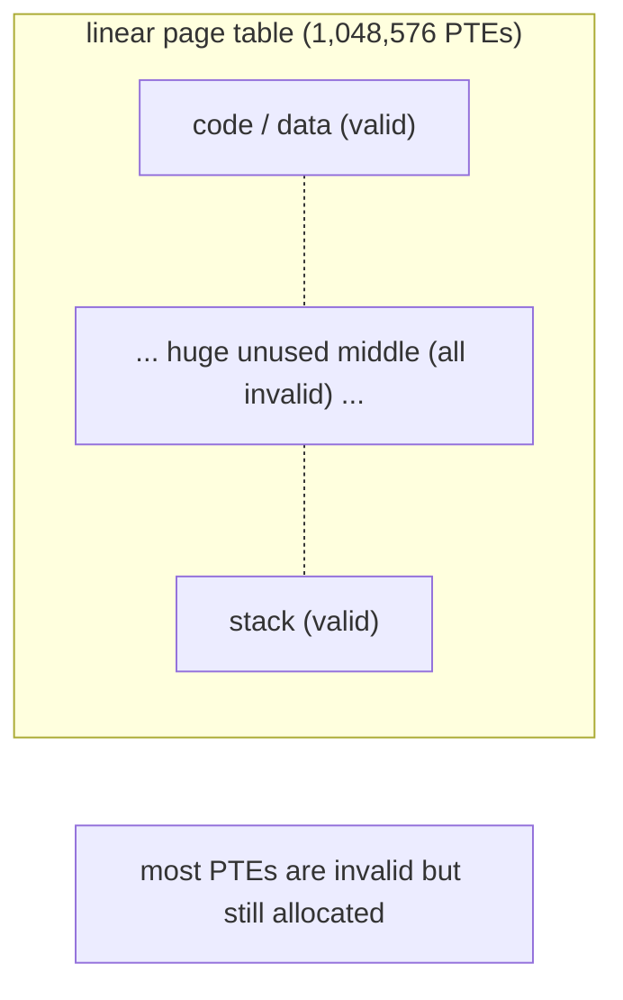
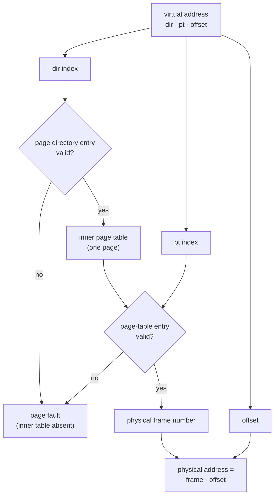
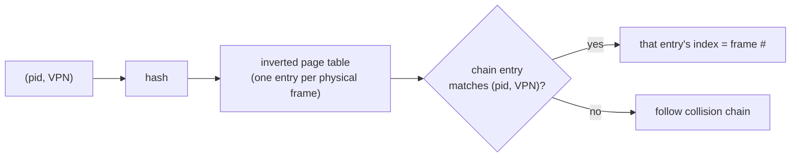

# Advanced Page Tables

**The crux:** paging replaces the base-and-bounds map with a per-page translation, but a *linear* (single-level) page table has one entry for **every** virtual page — present or not. For a realistic address space that table is huge and mostly empty, and there is one per process. The problem this topic solves is: **how do we keep the translation structure small so it does not consume more memory than the programs it maps**, without giving up the fine-grained, per-page control that made paging attractive in the first place?

## The core idea

- **A linear page table is indexed by the virtual page number (VPN).** With a `V`-bit virtual address and a page of `2^{offset}` bytes, there are `2^{V-offset}` pages, hence that many page-table entries (PTEs) — regardless of how many are actually used.
- **Most of that table is wasted.** A typical process maps a little code and data near the bottom and a stack near the top, leaving a vast unused middle. Every one of those unused slots still costs a PTE in a linear table.
- **Four classic ways to shrink it:**
  - **Bigger pages** — fewer pages means fewer PTEs, at the cost of **internal fragmentation**.
  - **Hybrid paging plus segmentation** — one page table per segment (code, heap, stack), so unused gaps between segments cost nothing.
  - **Multi-level page tables** — *page the page table itself*: a small page directory points at inner tables, and inner tables covering unused regions are simply never allocated.
  - **Inverted page tables** — keep **one** table for all of physical memory (not one per process) and find entries by hashing.

The dominant answer in modern hardware is the **multi-level** table: it is compact for sparse spaces and still lets each page have its own protection bits.

## How it works

### Why the linear table is too big

Take a 32-bit virtual address space with 4 KiB pages:

$$
\text{offset bits} = \log_2 4096 = 12,\qquad
\text{VPN bits} = 32 - 12 = 20
$$

$$
\text{PTEs} = 2^{20} = 1{,}048{,}576,\qquad
\text{table size} = 2^{20}\times 4\ \text{bytes} = 4\ \text{MiB per process}
$$

Four megabytes of page table for **every** process, even one that touches a few kilobytes of memory. With a hundred processes that is 400 MiB of translation tables, and the numbers explode further for 64-bit spaces. That is the pain point.



### Approach 1 — bigger pages

Larger pages divide the VPN space more coarsely, so there are fewer PTEs.

$$
\text{page size} = 2^{22}\ (4\ \text{MiB}) \Rightarrow
\text{VPN bits} = 32 - 22 = 10 \Rightarrow
2^{10} = 1024\ \text{PTEs}
$$

The table shrinks by a factor of 1024, but the tradeoff is **internal fragmentation**: a process that needs 8 KiB now consumes a whole 4 MiB page, wasting most of it. Real systems keep small base pages and offer *large pages* (2 MiB / 1 GiB on x86-64) selectively where the waste is acceptable.

### Approach 2 — hybrid paging plus segmentation

Keep the old segments — code, heap, stack — but give **each segment its own page table** instead of one giant table for the whole space. A segment register holds the base and bounds of that segment's page table, so the table is only as long as the segment's used length; the empty gaps *between* segments never appear in any table.

- Pro: unused regions between segments cost zero PTEs.
- Con: it reintroduces segmentation's problems — page tables are now variable-sized, so the OS must manage external fragmentation of the page-table memory itself, and a sparsely-used-but-large single segment still wastes space.

### Approach 3 — multi-level page tables (the workhorse)

The key move: **page the page table.** Chop the linear table into page-sized chunks (the *inner page tables*), and add one level above — the **page directory** — whose entries either point at an inner table or are marked invalid. If an entire region of the address space is unused, its inner table is **never allocated**, and the corresponding directory entry is simply invalid. Unused regions therefore cost nothing beyond one directory slot.

The VPN is split into two indices:

$$
\underbrace{\text{VPN}}_{\text{10 bits}} =
\underbrace{\text{dir index}}_{\text{5 bits}}\ \Vert\
\underbrace{\text{PT index}}_{\text{5 bits}},
\qquad
\text{VA} = \text{VPN}\ \Vert\ \underbrace{\text{offset}}_{\text{12 bits}}
$$

The **two-index walk**: use the directory index to pick a page-directory entry (PDE); if valid, it gives the physical frame of an inner page table; use the PT index into that inner table to get the PTE; combine the PTE's frame with the offset.



**Space saving.** For a sparse space that uses only `k` of the `D` directory slots, the two-level table needs the directory plus `k` inner tables:

$$
\text{PTEs}_{\text{two-level}} = D + k\cdot P
\quad\ll\quad
\text{PTEs}_{\text{linear}} = D\cdot P
\qquad (k \ll D)
$$

With `D = P = 32` and `k = 3`: two-level costs `32 + 3\times 32 = 128` PTEs versus `32\times 32 = 1024` for the linear table — an 8× win here, and the gap widens enormously at real 64-bit sizes.

**The cost.** A translation now takes **more memory accesses** (one per level) before the actual data access. That is why the **TLB** matters even more here — a TLB hit skips the entire walk, so a good hit rate is what makes multi-level paging fast in practice.

### Approach 4 — inverted page tables

Flip the question. Instead of "for this virtual page, which frame?" (one table per process), ask "for this physical frame, which process-and-virtual-page owns it?" — **one table for all of physical memory**, with a single entry per physical frame holding the owning process id and VPN.

- To translate, you cannot index by VPN anymore, so entries are found by **hashing** `(pid, VPN)` into the table (with collision chaining).
- Pro: table size is proportional to **physical** memory, not to the (much larger, per-process) virtual space — one modest table total.
- Con: translation requires a hash lookup and chain walk, which is slow, so a TLB is essential; and it complicates sharing a physical page among processes.



## Must-know algorithms

### Two-level page-table walker (allocate inner tables lazily)

This program builds a toy two-level page table, splits each virtual address into `dir index | pt index | offset`, walks the directory then the inner table, and translates or faults. Inner tables are allocated **only** when a page in their range is first mapped, so a sparse address space touches far fewer tables than a linear table would. The `main` maps six sparse pages and prints the space comparison.

```c
#include <stdio.h>
#include <stdlib.h>
#include <stdint.h>

/*
 * Two-level page-table walker for a toy 22-bit virtual address space.
 *
 * Layout (small on purpose so the demo is readable):
 *   VA width   : 22 bits  -> 4 MiB virtual space
 *   page size  : 4 KiB    -> 12 offset bits
 *   VPN width  : 10 bits  -> 1024 pages
 *   dir-index  : 5 bits   -> 32 page-directory entries
 *   pt-index   : 5 bits   -> 32 entries per inner page table
 *
 * The page directory always exists (32 entries). Each inner page table is
 * allocated lazily, only when a page inside its 5-bit range is first mapped.
 * A sparse address space therefore touches only a few inner tables.
 */

#define OFFSET_BITS 12u
#define PT_BITS     5u
#define DIR_BITS    5u
#define VPN_BITS    (PT_BITS + DIR_BITS)          /* 10 */

#define DIR_ENTRIES (1u << DIR_BITS)              /* 32 */
#define PT_ENTRIES  (1u << PT_BITS)               /* 32 */
#define PAGE_SIZE   (1u << OFFSET_BITS)           /* 4096 */

#define PTE_VALID   0x1u
#define PFN_SHIFT   1u                            /* PFN stored above valid bit */

typedef uint32_t pte_t;                           /* one page-table entry */

typedef struct {
    pte_t *dir[DIR_ENTRIES];                      /* pointers to inner tables (NULL = absent) */
    unsigned inner_tables;                        /* count actually allocated */
} pagetable_t;

/* Bit-field extraction from a virtual address. */
static uint32_t va_dir(uint32_t va)    { return (va >> (OFFSET_BITS + PT_BITS)) & (DIR_ENTRIES - 1); }
static uint32_t va_ptidx(uint32_t va)  { return (va >> OFFSET_BITS) & (PT_ENTRIES - 1); }
static uint32_t va_offset(uint32_t va) { return va & (PAGE_SIZE - 1); }

static void pt_init(pagetable_t *t) {
    for (uint32_t i = 0; i < DIR_ENTRIES; i++) t->dir[i] = NULL;
    t->inner_tables = 0;
}

/* Map the virtual page containing `va` to physical frame `pfn`.
   Allocates the inner page table lazily on first use of its directory slot. */
static void pt_map(pagetable_t *t, uint32_t va, uint32_t pfn) {
    uint32_t d = va_dir(va);
    uint32_t p = va_ptidx(va);
    if (t->dir[d] == NULL) {
        pte_t *inner = calloc(PT_ENTRIES, sizeof(pte_t)); /* all entries start invalid */
        if (inner == NULL) { perror("calloc"); exit(1); }
        t->dir[d] = inner;
        t->inner_tables++;
    }
    t->dir[d][p] = (pfn << PFN_SHIFT) | PTE_VALID;
}

/* Translate a virtual address to a physical address.
   Returns 0 on success and writes *pa; returns -1 on a page fault. */
static int pt_translate(const pagetable_t *t, uint32_t va, uint32_t *pa) {
    uint32_t d = va_dir(va);
    pte_t *inner = t->dir[d];
    if (inner == NULL) return -1;                 /* whole region unmapped: no inner table */
    pte_t pte = inner[va_ptidx(va)];
    if ((pte & PTE_VALID) == 0) return -1;        /* page not present */
    uint32_t pfn = pte >> PFN_SHIFT;
    *pa = (pfn << OFFSET_BITS) | va_offset(va);
    return 0;
}

/* How many entries a single flat/linear page table would need. */
static unsigned linear_entries(void) { return 1u << VPN_BITS; }

int main(void) {
    pagetable_t t;
    pt_init(&t);

    /* A sparse address space: a few pages near the bottom (code/data) and a
       few near the top (stack), leaving the huge middle unmapped. */
    uint32_t map[][2] = {
        /* virtual address, physical frame number */
        { 0x00000, 0x10 },   /* dir 0  */
        { 0x01000, 0x11 },   /* dir 0  */
        { 0x02000, 0x12 },   /* dir 0  */
        { 0x3F000, 0x20 },   /* dir 1  */
        { 0x3FF000, 0x30 },  /* dir 31 -> the stack top */
        { 0x3FE000, 0x31 },  /* dir 31 */
    };
    unsigned n = sizeof(map) / sizeof(map[0]);
    for (unsigned i = 0; i < n; i++) pt_map(&t, map[i][0], map[i][1]);

    /* Translate a hit, showing the two-index walk. */
    uint32_t va = 0x01ABC, pa;
    if (pt_translate(&t, va, &pa) == 0)
        printf("VA 0x%05X  ->  dir %u, pt %u, off 0x%03X  ->  PA 0x%06X\n",
               va, va_dir(va), va_ptidx(va), va_offset(va), pa);

    /* Translate into an unmapped middle region -> page fault. */
    uint32_t bad = 0x20000;
    printf("VA 0x%05X  ->  %s\n", bad,
           pt_translate(&t, bad, &pa) == 0 ? "mapped" : "PAGE FAULT (no inner table)");

    /* Space comparison: linear vs two-level. */
    unsigned lin = linear_entries();
    unsigned two = DIR_ENTRIES + t.inner_tables * PT_ENTRIES;
    printf("linear table:    %u PTEs (all present, most invalid)\n", lin);
    printf("two-level table: %u dir entries + %u inner tables x %u = %u PTEs\n",
           DIR_ENTRIES, t.inner_tables, PT_ENTRIES, two);
    printf("inner tables allocated: %u of %u possible\n", t.inner_tables, DIR_ENTRIES);

    for (uint32_t i = 0; i < DIR_ENTRIES; i++) free(t.dir[i]);
    return 0;
}
```

Output:

```text
VA 0x01ABC  ->  dir 0, pt 1, off 0xABC  ->  PA 0x011ABC
VA 0x20000  ->  PAGE FAULT (no inner table)
linear table:    1024 PTEs (all present, most invalid)
two-level table: 32 dir entries + 3 inner tables x 32 = 128 PTEs
inner tables allocated: 3 of 32 possible
```

The sparse space needs only **3** inner tables (128 PTEs) where a linear table would allocate all **1024** — and the unmapped middle is a page fault detected at the directory level, before any inner table is even consulted.

## Interview questions

**1. Why is a linear (single-level) page table too big?**
It has one PTE per virtual page whether or not that page is used, and there is one table per process. A 32-bit space with 4 KiB pages needs `2^{20}` PTEs ≈ 4 MiB per process; almost all of it maps an unused middle region. Multiply by many processes and by 64-bit address widths and it becomes untenable.

**2. How does a multi-level page table save space?**
It pages the page table. A small page directory points at inner page tables, and an inner table is allocated **only** for a region that actually has valid pages. Unused regions cost a single invalid directory entry instead of thousands of PTEs, so the table's size scales with what the process *uses*, not with the whole address space.

**3. Given `dir(5) | pt(5) | offset(12)`, translate a virtual address.**
Split the VA into three fields. Directory index selects a PDE; if invalid it is a fault. The valid PDE gives the inner table's frame; the PT index selects a PTE there; if invalid it is a fault. Combine the PTE's frame number with the offset for the physical address. For `VA 0x01ABC`: dir `0`, pt `1`, offset `0xABC`; if frame `0x11` is mapped there, PA is frame `0x11` shifted up by 12 bits combined with offset `0xABC`, giving `0x011ABC`.

**4. What is the multi-level tradeoff, and why does the TLB matter more?**
Each level adds a memory access before the data access — a two-level walk is two extra loads, x86-64's four levels are four. On a TLB miss those accesses are the translation cost. A TLB hit skips the entire walk, so as levels grow the TLB hit rate becomes the dominant factor in effective memory latency; multi-level paging is only fast because most translations hit the TLB.

**5. What is internal fragmentation, and how do bigger pages trade against table size?**
Internal fragmentation is memory wasted *inside* an allocated page that the program does not use. Bigger pages mean fewer pages and thus a much smaller page table, but any partly-used page wastes up to a full page, so a program with many small mappings wastes a lot. Systems keep small base pages and offer large pages selectively.

**6. Explain inverted page tables — pros and cons.**
Keep one table for all of physical memory, one entry per frame recording `(pid, VPN)`. Its size scales with physical RAM, not per-process virtual space, so total translation memory is small. But you can no longer index by VPN; you must **hash** `(pid, VPN)` and walk a collision chain, which is slow and makes page sharing awkward — so a TLB is mandatory.

**7. How does x86-64 use four levels?**
64-bit x86 uses 48-bit canonical virtual addresses (with 4 KiB pages) split into four 9-bit indices plus a 12-bit offset: PML4 → PDPT → PD → PT, each a 4 KiB table of 512 8-byte entries. `CR3` points at the PML4. A full walk is four memory accesses; large pages (2 MiB, 1 GiB) stop the walk early at the PD or PDPT level. (Newer parts add a fifth level, PML5, for 57-bit addresses.)

**8. When is hybrid paging-plus-segmentation better or worse than multi-level?**
Hybrid works well when the address space is a few dense segments with large empty gaps — one page table per segment eliminates the gaps cheaply. It is worse when a single segment is itself large and sparse (the per-segment table is still linear over that segment) and it reintroduces variable-sized tables, hence external fragmentation of page-table memory. Multi-level handles arbitrary sparsity uniformly and keeps tables page-sized, which is why hardware standardized on it.

## Coding problems

A multi-level page table **is** a trie: fixed-width index groups walk down levels of nested tables. These problems drill exactly that nested-index / trie-walk pattern.

- 🎯 **Implement Trie (Prefix Tree)** — [LeetCode 208](https://leetcode.com/problems/implement-trie-prefix-tree/). Tests the core multi-level structure: descend one index (character) per level, allocating child nodes lazily — the same shape as walking a page directory into inner tables.
- 🎯 **Design Add and Search Words Data Structure** — [LeetCode 211](https://leetcode.com/problems/design-add-and-search-words-data-structure/). Tests trie traversal with wildcards, i.e. branching the walk when an index is unknown — a good stress of the multi-level walk logic.
- 🏗 **Implement a two-level page-table walker** — split a VPN into directory and page-table indices, allocate inner tables lazily, and translate-or-fault. The reference C implementation is in [Must-know algorithms](#must-know-algorithms) above; it demonstrates the sparse-space space saving directly.

## Key takeaways

- A **linear page table** wastes memory: one PTE per virtual page, present or not, one table per process — megabytes each on 32-bit, far worse on 64-bit.
- **Bigger pages** shrink the table but cause **internal fragmentation**; use them selectively.
- **Hybrid paging plus segmentation** removes inter-segment gaps but brings back variable-sized tables and external fragmentation.
- **Multi-level page tables** page the page table: a directory of valid inner tables means unused regions cost nothing, and the table scales with what the process *uses*.
- Multi-level walks cost **one memory access per level**, so the **TLB** is what makes them fast; more levels raise the stakes on the hit rate.
- **Inverted page tables** hold one entry per physical frame and are found by hashing — tiny total size, but slow lookups that demand a TLB.
- **x86-64** uses a four-level walk (PML4 → PDPT → PD → PT) over 48-bit addresses, with large pages to shorten it.

## Source(s) and further reading

- OSTEP, [_Paging: Smaller Tables_ (free PDF)](https://pages.cs.wisc.edu/~remzi/OSTEP/vm-smalltables.pdf) — the chapter this page is grounded in.
- Wikipedia, [_Page table_](https://en.wikipedia.org/wiki/Page_table) — multi-level, inverted, and nested page tables overview.
- Wikipedia, [_Page replacement algorithm_](https://en.wikipedia.org/wiki/Page_replacement_algorithm) — what happens on the faults these tables detect.
- Wikipedia, [_Translation lookaside buffer_](https://en.wikipedia.org/wiki/Translation_lookaside_buffer) — the cache that makes multi-level walks affordable.
- Wikipedia, [_x86-64_](https://en.wikipedia.org/wiki/X86-64) — 48/57-bit addressing and the four/five-level paging structure.
- The Linux kernel, [_Page Tables_](https://www.kernel.org/doc/html/latest/mm/page_tables.html) — how a real OS names and manages the levels.
