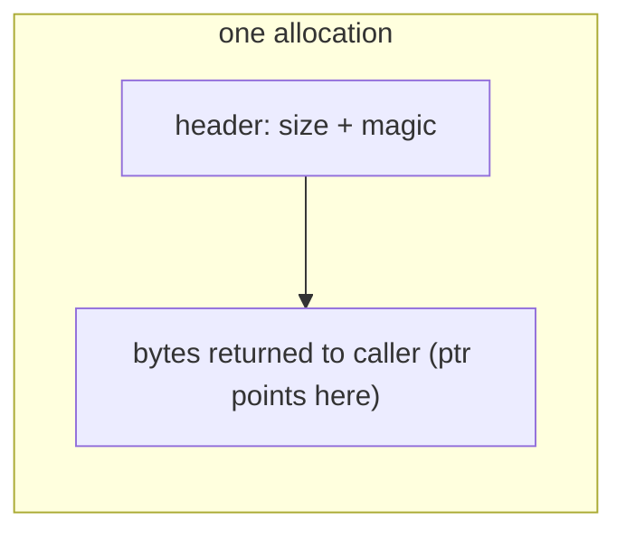
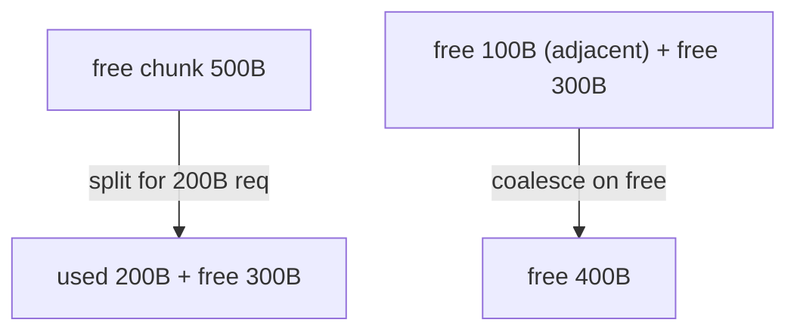
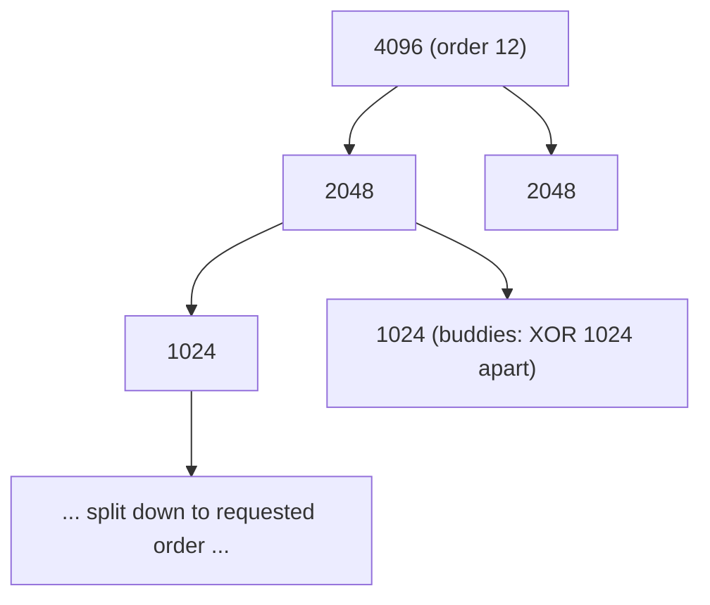

# Free-Space Management (Allocators)

**The crux:** how do you manage free space when the pieces handed out can be **any size**? A pool of memory starts as one contiguous run, but a stream of `malloc(size)` and `free(ptr)` calls chops it into a patchwork of allocated and free regions. The hard problem is **external fragmentation** — the free space is there in total, but it is scattered into pieces too small to satisfy the next request. Paging (the next topics) sidesteps this by handing out only fixed-size pages, but the moment sizes vary — inside `malloc`, inside a kernel object cache, inside a segment table — you are back to this problem. This page builds a real mini-`malloc`/`free`, compares the placement policies, and shows the two structural escapes: the buddy system and slab allocation.

## The core idea

- A **free-space allocator** manages a region of bytes, satisfying variable-sized allocation requests and reclaiming freed regions for reuse. `malloc`/`free` is the canonical user-space example; the kernel's own object allocators are another.
- The allocator cannot move or compact already-handed-out memory — a returned pointer must stay valid until the caller frees it. So it can only decide **where** to place each request and **how** to track what remains free. That constraint is what makes fragmentation hard.
- **External fragmentation:** free space exists but is broken into pieces, none individually large enough for a request. You may have 1000 free bytes total yet fail a 200-byte request because the largest single free chunk is 150.
- **Internal fragmentation:** the allocator hands back *more* than was asked (rounded up to a block size or alignment), and the slack inside the block is wasted. Fixed-size and power-of-two schemes trade external fragmentation for internal fragmentation.
- The allocator's toolkit is small and recurring:
  - a **free list** — the data structure that tracks which regions are free;
  - **splitting** — carve a small block out of a larger free chunk;
  - **coalescing** — merge adjacent free chunks back into one big chunk so future large requests can be met;
  - a **header** stored just before each allocation, so `free(ptr)` can recover the block's size;
  - a **placement policy** — which free chunk to use when several fit.
- Two structural designs sidestep general fragmentation: the **buddy system** (power-of-two blocks with cheap coalescing) and **slab / segregated-list** allocation (per-size caches that make fixed-size objects nearly free to allocate).

## How it works

### The free list

The free space is tracked as a linked list of free chunks. Crucially, the list nodes live *inside the free memory itself* — a free chunk stores its own size and a pointer to the next free chunk in its first bytes. No separate bookkeeping array is needed; the free space is its own index.


### The header — how free() knows the size

`free(ptr)` is given only a pointer, no size. The allocator recovers the size by stashing a small **header** in the bytes immediately *before* the returned pointer. The header holds the block's total size and a **magic number**; `free` does pointer arithmetic (`ptr - sizeof(header)`) to reach it, and checks the magic to catch corruption or an invalid free.



So an N-byte request actually consumes `N + sizeof(header)` bytes (rounded up for alignment) — a small, fixed overhead per allocation.

### Splitting and coalescing

- **Splitting:** when a request is smaller than the chosen free chunk, carve off exactly what is needed (plus header) from the front and leave the **remainder** on the free list as a smaller chunk. If the remainder is too small to even hold a list node, hand over the whole chunk instead (a bit of internal fragmentation).
- **Coalescing:** on `free`, check whether the block being returned is **physically adjacent** to a free chunk before or after it; if so, merge them into one larger free chunk. Without coalescing, a heap degrades into a graveyard of tiny free chunks that can never satisfy a large request even though plenty is free. Keeping the free list **sorted by address** makes the adjacency check cheap.



### A real free-list allocator (splitting + coalescing + headers)

A working mini-`malloc`/`free` over a static arena. It uses **first-fit** placement, splits on allocate, stamps a header (size + magic), and coalesces adjacent neighbours on free by keeping the free list address-ordered.

```c
/* Free-list allocator over a static arena: headers, splitting, coalescing. */
#include <stdio.h>
#include <stdint.h>
#include <stddef.h>
#include <string.h>

#define ARENA_SIZE 4096
#define MAGIC 0x1234ABCDu
#define ALIGN 8

static unsigned char arena[ARENA_SIZE];

/* Allocation header: precedes every returned pointer so free() knows the size. */
typedef struct header { size_t size; unsigned magic; } header_t;

/* Free-list node: lives inside a free block; embeds size + next pointer. */
typedef struct fnode { size_t size; struct fnode *next; } fnode_t;

static fnode_t *freelist;

static size_t round_up(size_t n) { return (n + (ALIGN - 1)) & ~((size_t)ALIGN - 1); }

void heap_init(void) {
    freelist = (fnode_t *)arena;
    freelist->size = ARENA_SIZE;   /* whole arena is one free chunk */
    freelist->next = NULL;
}

/* First-fit alloc: find a chunk >= need, split it, stamp a header. */
void *my_malloc(size_t req) {
    size_t need = round_up(req) + sizeof(header_t);
    fnode_t *prev = NULL, *cur = freelist;
    while (cur) {
        if (cur->size >= need) {
            size_t rest = cur->size - need;
            if (rest >= sizeof(fnode_t)) {
                /* split: shrink this chunk, leave remainder on the list */
                fnode_t *split = (fnode_t *)((unsigned char *)cur + need);
                split->size = rest;
                split->next = cur->next;
                if (prev) prev->next = split; else freelist = split;
            } else {
                /* remainder too small to be a node: give the whole chunk */
                need = cur->size;
                if (prev) prev->next = cur->next; else freelist = cur->next;
            }
            header_t *h = (header_t *)cur;
            h->size = need;
            h->magic = MAGIC;
            return (unsigned char *)h + sizeof(header_t);
        }
        prev = cur; cur = cur->next;
    }
    return NULL; /* out of memory */
}

/* Insert a freed block into the address-ordered list, coalescing neighbours. */
void my_free(void *ptr) {
    if (!ptr) return;
    header_t *h = (header_t *)((unsigned char *)ptr - sizeof(header_t));
    if (h->magic != MAGIC) { fprintf(stderr, "corrupt free\n"); return; }
    fnode_t *blk = (fnode_t *)h;
    size_t size = h->size;
    blk->size = size;

    /* find insertion point keeping the list sorted by address */
    fnode_t *prev = NULL, *cur = freelist;
    while (cur && (unsigned char *)cur < (unsigned char *)blk) { prev = cur; cur = cur->next; }
    blk->next = cur;
    if (prev) prev->next = blk; else freelist = blk;

    /* coalesce with the next block if physically adjacent */
    if (cur && (unsigned char *)blk + blk->size == (unsigned char *)cur) {
        blk->size += cur->size;
        blk->next = cur->next;
    }
    /* coalesce with the previous block if physically adjacent */
    if (prev && (unsigned char *)prev + prev->size == (unsigned char *)blk) {
        prev->size += blk->size;
        prev->next = blk->next;
    }
}

static size_t free_bytes(void) {
    size_t t = 0; for (fnode_t *c = freelist; c; c = c->next) t += c->size; return t;
}
static int free_chunks(void) {
    int n = 0; for (fnode_t *c = freelist; c; c = c->next) n++; return n;
}

int main(void) {
    heap_init();
    printf("init: %zu free bytes in %d chunk(s)\n", free_bytes(), free_chunks());

    char *a = my_malloc(100);
    char *b = my_malloc(200);
    char *c = my_malloc(50);
    strcpy(a, "alpha"); strcpy(b, "bravo"); strcpy(c, "charlie");
    printf("after 3 allocs: %zu free, %d chunk(s); data=%s/%s/%s\n",
           free_bytes(), free_chunks(), a, b, c);

    my_free(b);                 /* hole in the middle */
    printf("free b: %zu free, %d chunk(s)\n", free_bytes(), free_chunks());
    my_free(a);                 /* adjacent to b's hole -> coalesce */
    printf("free a (coalesce with b): %d chunk(s)\n", free_chunks());
    my_free(c);                 /* everything back -> single chunk */
    printf("free c (coalesce all): %zu free, %d chunk(s)\n", free_bytes(), free_chunks());
    return 0;
}
```

Output — note the free chunk count dropping back to 1 as coalescing merges the holes:

```
init: 4096 free bytes in 1 chunk(s)
after 3 allocs: 3688 free, 1 chunk(s); data=alpha/bravo/charlie
free b: 3904 free, 2 chunk(s)
free a (coalesce with b): 2 chunk(s)
free c (coalesce all): 4096 free, 1 chunk(s)
```

### Placement policies

When several free chunks fit a request, which do you pick? The policy trades speed against fragmentation:

- **First-fit** — take the first chunk that fits. Fast; tends to leave usable large chunks near the tail but litters the front with small remnants.
- **Best-fit** — scan all chunks, take the **smallest** that fits. Minimizes wasted space per allocation but must scan the whole list, and it tends to leave a trail of near-useless tiny slivers.
- **Worst-fit** — take the **largest** chunk, so the leftover remainder is big enough to stay useful. Intuition says it fights fragmentation; in practice it performs poorly and also scans the whole list.
- **Next-fit** — like first-fit, but resume searching from where the last search stopped (a roving pointer) instead of always from the head. Spreads allocations out and avoids re-scanning the crowded front of the list.

A comparison harness. Each policy runs the same workload against the same starting free list; the "slivers" count is a fragmentation proxy (small nonzero leftovers).

```c
/* Placement policies: first-fit, best-fit, worst-fit, next-fit compared on a workload. */
#include <stdio.h>
#include <stddef.h>

#define N 8
/* A free list modelled as an array of chunk sizes; 0 means "used/empty slot". */
typedef struct { size_t size[N]; int rover; } heap_t;

enum policy { FIRST, BEST, WORST, NEXT };

static void reset(heap_t *h) {
    size_t init[N] = {100, 500, 200, 300, 600, 50, 400, 150};
    for (int i = 0; i < N; i++) h->size[i] = init[i];
    h->rover = 0;
}

/* Pick a chunk index that fits `req` under the given policy, or -1. Splits in place. */
static int place(heap_t *h, size_t req, enum policy p) {
    int pick = -1;
    switch (p) {
        case FIRST:
            for (int i = 0; i < N; i++)
                if (h->size[i] >= req) { pick = i; break; }
            break;
        case BEST:
            for (int i = 0; i < N; i++)
                if (h->size[i] >= req && (pick < 0 || h->size[i] < h->size[pick])) pick = i;
            break;
        case WORST:
            for (int i = 0; i < N; i++)
                if (h->size[i] >= req && (pick < 0 || h->size[i] > h->size[pick])) pick = i;
            break;
        case NEXT:
            for (int k = 0; k < N; k++) {
                int i = (h->rover + k) % N;
                if (h->size[i] >= req) { pick = i; h->rover = i; break; }
            }
            break;
    }
    if (pick >= 0) h->size[pick] -= req;   /* carve the request out; remainder stays free */
    return pick;
}

/* Fragmentation proxy: count of tiny (nonzero, <64B) leftover slivers. */
static int slivers(const heap_t *h) {
    int n = 0;
    for (int i = 0; i < N; i++) if (h->size[i] > 0 && h->size[i] < 64) n++;
    return n;
}

static const char *name(enum policy p) {
    switch (p) { case FIRST: return "first-fit"; case BEST: return "best-fit";
                 case WORST: return "worst-fit"; default: return "next-fit"; }
}

int main(void) {
    size_t workload[] = {90, 180, 60, 120, 40};
    int W = sizeof(workload) / sizeof(workload[0]);

    for (enum policy p = FIRST; p <= NEXT; p++) {
        heap_t h; reset(&h);
        int fails = 0;
        for (int i = 0; i < W; i++)
            if (place(&h, workload[i], p) < 0) fails++;
        printf("%-10s: %d req placed, %d failed, %d small slivers left\n",
               name(p), W - fails, fails, slivers(&h));
    }
    return 0;
}
```

Output — on this workload best-fit leaves the most slivers (it keeps carving the tightest chunk) while worst-fit leaves the fewest, illustrating why "obviously optimal" best-fit is not actually the fragmentation winner:

```
first-fit : 5 req placed, 0 failed, 2 small slivers left
best-fit  : 5 req placed, 0 failed, 3 small slivers left
worst-fit : 5 req placed, 0 failed, 1 small slivers left
next-fit  : 5 req placed, 0 failed, 2 small slivers left
```

There is no universally best policy — the winner depends on the workload's size distribution. Real allocators (glibc, jemalloc, tcmalloc) combine ideas rather than pick one.

### The buddy allocator

The buddy system rounds every request **up to a power of two** and manages memory as a binary tree of blocks. This buys one huge simplification: coalescing becomes almost free.

- The arena is a single block of size $2^{\text{MAX}}$. To satisfy a request, find the smallest power-of-two block that fits; if only bigger free blocks exist, **split** one in half repeatedly until you reach the right size. The two halves of a split are **buddies**.
- On free, check whether this block's **buddy** is also free. If so, merge them into the parent block, then repeat upward. Because a block's buddy address is just its own address with one bit flipped, finding the buddy is a single XOR:

$$
\text{buddy}(addr, order) = addr \oplus 2^{\text{order}}
$$

- This makes coalescing **O(1)-ish per level** and $O(\log n)$ overall in the worst case — no scanning of a free list to find an adjacent neighbour, just a bit flip and a lookup. The price is **internal fragmentation**: a 33-byte request rounds up to a 64-byte block, wasting 31 bytes (up to nearly 2× in the worst case).



A working buddy allocator with the XOR buddy trick and full upward coalescing:

```c
/* Buddy allocator: power-of-two blocks with O(1)-ish buddy coalescing. */
#include <stdio.h>
#include <stdint.h>
#include <stddef.h>

#define MIN_ORDER 4                    /* smallest block = 2^4 = 16 bytes */
#define MAX_ORDER 12                   /* whole arena  = 2^12 = 4096 bytes */
#define ARENA_SIZE (1u << MAX_ORDER)

static unsigned char arena[ARENA_SIZE];

/* Free list per order; a free block stores the next offset in its first bytes. */
typedef struct fblk { struct fblk *next; } fblk_t;
static fblk_t *freelists[MAX_ORDER + 1];

static void list_push(int order, void *p) {
    fblk_t *b = (fblk_t *)p; b->next = freelists[order]; freelists[order] = b;
}
static void *list_pop(int order) {
    fblk_t *b = freelists[order]; if (b) freelists[order] = b->next; return b;
}
/* Remove a specific block from an order's list (needed during coalescing). */
static int list_remove(int order, void *p) {
    fblk_t **pp = &freelists[order];
    while (*pp) { if (*pp == (fblk_t *)p) { *pp = (*pp)->next; return 1; } pp = &(*pp)->next; }
    return 0;
}

static int order_for(size_t req) {
    int o = MIN_ORDER;
    while ((size_t)(1u << o) < req && o < MAX_ORDER) o++;
    return o;
}

void buddy_init(void) {
    for (int i = 0; i <= MAX_ORDER; i++) freelists[i] = NULL;
    list_push(MAX_ORDER, arena);       /* one giant free block */
}

/* Allocate: find smallest available order >= needed, splitting bigger blocks down. */
void *buddy_alloc(size_t req) {
    int want = order_for(req);
    int o = want;
    while (o <= MAX_ORDER && !freelists[o]) o++;
    if (o > MAX_ORDER) return NULL;    /* out of memory */
    void *block = list_pop(o);
    while (o > want) {                 /* split down to the wanted order */
        o--;
        void *buddy = (unsigned char *)block + (1u << o);
        list_push(o, buddy);           /* the upper half becomes free */
    }
    return block;
}

/* Free: repeatedly merge with buddy if the buddy is also free. */
void buddy_free(void *ptr, size_t req) {
    int o = order_for(req);
    size_t off = (unsigned char *)ptr - arena;
    while (o < MAX_ORDER) {
        size_t buddy_off = off ^ (1u << o);      /* buddy address = flip the order bit */
        void *buddy = arena + buddy_off;
        if (!list_remove(o, buddy)) break;       /* buddy not free -> stop merging */
        off = off < buddy_off ? off : buddy_off; /* merged block starts at the lower addr */
        o++;
    }
    list_push(o, arena + off);
}

static int count(int order) { int n = 0; for (fblk_t *b = freelists[order]; b; b = b->next) n++; return n; }

int main(void) {
    buddy_init();
    printf("init: order-%d free blocks = %d\n", MAX_ORDER, count(MAX_ORDER));

    void *a = buddy_alloc(16);   /* order 4 */
    void *b = buddy_alloc(16);   /* order 4 */
    void *c = buddy_alloc(1000); /* order 10 (1024) */
    printf("alloc 16,16,1000 -> offsets %ld %ld %ld\n",
           (long)((unsigned char*)a-arena), (long)((unsigned char*)b-arena),
           (long)((unsigned char*)c-arena));
    printf("order-4 free=%d order-5 free=%d\n", count(4), count(5));

    buddy_free(a, 16);
    buddy_free(b, 16);           /* a and b are buddies -> should merge back to order 5 */
    printf("after freeing the two order-4 buddies: order-4 free=%d order-5 free=%d\n",
           count(4), count(5));

    buddy_free(c, 1000);
    /* full cascade: everything should coalesce back to a single order-12 block */
    int top = count(MAX_ORDER);
    printf("after freeing all: order-%d free blocks = %d %s\n",
           MAX_ORDER, top, top == 1 ? "(fully coalesced)" : "(LEAK)");
    return 0;
}
```

Output — the two order-4 buddies merge back to a single order-5 block, and freeing everything cascades all the way to one order-12 block:

```
init: order-12 free blocks = 1
alloc 16,16,1000 -> offsets 0 16 1024
order-4 free=0 order-5 free=1
after freeing the two order-4 buddies: order-4 free=0 order-5 free=0
after freeing all: order-12 free blocks = 1 (fully coalesced)
```

### Segregated lists and slab allocation

Most workloads allocate the **same few sizes over and over** — a kernel constantly creates and destroys `struct inode`, `struct task_struct`, network buffers. General-purpose fragmentation-fighting is wasted effort when the size is known and repeated.

- **Segregated free lists** keep a separate free list per size class (16B, 32B, 64B, …). A request is served from its class's list — no search, no splitting, no coalescing across classes. Allocation and free are near-constant-time list operations.
- **Slab allocation** (Bonwick's design, used in the Linux kernel) is the mature form. A **cache** is created per object type; it owns **slabs** (one or more contiguous pages) carved into equal-size slots for that type. Because every slot in a slab is the same size, there is **no external fragmentation within a slab**, and freeing an object just returns its slot to the slab's free list.
- Slab's extra win is **object caching**: freed objects can be kept in a **pre-constructed** state, so re-allocating skips re-initialization. Combined with per-CPU caches, this makes hot-path kernel allocation extremely fast.
- The tradeoff: segregated and slab schemes round requests to their class size, so they trade external fragmentation for a bounded amount of **internal** fragmentation, and they need a fallback path when a slab fills up (grab another slab from the page allocator — often the buddy system underneath).

## Interview questions

**1. External vs internal fragmentation — what's the difference?**
External fragmentation is free space scattered into pieces too small to satisfy a request even though the *total* free space is sufficient — a property of variable-sized allocation. Internal fragmentation is space wasted *inside* an allocated block because the allocator rounded the request up to a block size or alignment boundary. Free-list allocators mainly suffer external fragmentation; buddy and slab allocators trade it away for bounded internal fragmentation.

**2. How does `free(ptr)` know how big the block is if you only pass a pointer?**
The allocator stores a **header** in the bytes immediately before the returned pointer, holding the block size (and usually a magic number for corruption checks). `free` computes `ptr - sizeof(header)` to reach it, reads the size, and returns the whole block — header included — to the free list. This is why every allocation carries a small fixed overhead.

**3. What are splitting and coalescing, and why does each matter?**
**Splitting** carves a small block out of a larger free chunk on allocation, leaving the remainder free — without it you would waste an entire large chunk on a tiny request. **Coalescing** merges physically adjacent free blocks on `free` — without it the heap degrades into many tiny free chunks that collectively hold lots of space but cannot satisfy any large request. Both are needed to keep a free-list allocator healthy over time.

**4. First-fit vs best-fit vs worst-fit — the tradeoffs?**
First-fit takes the first chunk that fits: fast, no full scan, but clutters the front of the list with small remnants. Best-fit takes the smallest fitting chunk: minimal per-allocation waste but scans the whole list and tends to leave many unusable slivers. Worst-fit takes the largest chunk so the remainder stays useful; it also scans the whole list and generally performs worst in practice. No policy is universally best — it depends on the workload's size distribution.

**5. Why does the buddy allocator make coalescing so cheap?**
Because blocks are power-of-two sized and always split into equal halves, a block's **buddy** is at its own address with a single bit flipped: `buddy = addr XOR block_size`. Finding the neighbour to merge is one XOR plus a free-list check — no scanning for an adjacent block. Merging then repeats upward, giving $O(\log n)$ worst-case coalescing. The cost is internal fragmentation from rounding requests up to a power of two.

**6. What is a slab allocator and why is it fast?**
A slab allocator keeps a per-object-type cache backed by **slabs** (page-sized regions) divided into equal-size slots. Since all slots in a cache are the same size, allocation and free are simple free-list pushes/pops with no search, splitting, or coalescing, and there's no external fragmentation within a slab. It can also keep freed objects pre-initialized, so re-allocation skips constructor work. Per-CPU caching makes the hot path nearly lock-free. It's the standard kernel allocator for frequently reused fixed-size objects.

**7. Why does fragmentation matter in practice?**
Fragmentation causes allocation failures and wasted memory even when enough total space exists, forces the OS or process to grow its heap (more page faults, more RSS), and hurts cache/TLB locality when related objects end up scattered. A long-running server can slowly bloat purely from fragmentation. Choosing the right allocator design — coalescing, buddy, slab — directly controls this.

**8. Why can't a general allocator just compact memory to eliminate fragmentation?**
Because it hands out **raw pointers** that the caller dereferences directly. Moving an allocated block would invalidate every pointer the program holds into it, and the allocator has no way to find and update them. Compaction is only possible with an extra layer of indirection (handles, or a moving garbage collector that tracks all references) — which general C-style allocators do not have.

## Coding problems

🎯 **Interview (LeetCode / classic data structures)**

- **[LRU Cache](https://leetcode.com/problems/lru-cache/) (LeetCode 146)** — hash map + doubly linked list for O(1) get/put. Tests the exact eviction-and-recency bookkeeping used inside allocators and page-cache replacement.
- **[Design In-Memory File System](https://leetcode.com/problems/design-in-memory-file-system/) (LeetCode 588)** — tree of directories/files with path parsing. Tests designing an in-memory resource namespace, a close cousin of managing a pool of allocatable objects.

🏗 **Systems (allocator classics)**

- **Implement `malloc`/`free` with a free list** — headers, splitting, and coalescing over an arena. The reference implementation is the free-list allocator above; the interview follow-ups are always "how does `free` find the size?" and "how do you avoid fragmentation?". Grounded in the [OSTEP free-space chapter](https://pages.cs.wisc.edu/~remzi/OSTEP/vm-freespace.pdf) and the [malloc(3) man page](https://man7.org/linux/man-pages/man3/malloc.3.html).
- **Implement a buddy allocator** — power-of-two blocks, splitting on alloc, XOR-buddy coalescing on free. The reference implementation is the buddy allocator above; see [Buddy memory allocation](https://en.wikipedia.org/wiki/Buddy_memory_allocation).

## Key takeaways

- Managing **variable-sized** free space is the core problem; **external fragmentation** — enough free bytes but no single chunk big enough — is the enemy.
- A **free list** tracks free chunks (nodes stored inside the free memory). **Splitting** carves requests out of larger chunks; **coalescing** merges adjacent free chunks so large requests can still be met.
- A **header** (size + magic) stored before each allocation is how `free(ptr)` recovers the block size from a bare pointer.
- **Placement policies** — first/best/worst/next-fit — trade scan cost against fragmentation; none is universally best, so real allocators mix strategies.
- The **buddy system** rounds to powers of two and makes coalescing an O(1)-ish XOR-and-merge, at the cost of internal fragmentation.
- **Segregated lists / slab** allocation keep per-size caches, eliminating search and within-slab external fragmentation — the standard fast path for repeated fixed-size objects.

## Source(s) and further reading

- [OSTEP — Free-Space Management (Chapter 17, free PDF)](https://pages.cs.wisc.edu/~remzi/OSTEP/vm-freespace.pdf) — the backbone for this page: free lists, splitting/coalescing, headers, placement policies, buddy allocation.
- [malloc(3) — Linux manual page (man7.org)](https://man7.org/linux/man-pages/man3/malloc.3.html) — the real `malloc`/`free`/`realloc` contract.
- [Memory management (Wikipedia)](https://en.wikipedia.org/wiki/Memory_management) — overview of allocation strategies and free-list management.
- [Buddy memory allocation (Wikipedia)](https://en.wikipedia.org/wiki/Buddy_memory_allocation) — the buddy system in detail.
- [Slab allocation (Wikipedia)](https://en.wikipedia.org/wiki/Slab_allocation) — Bonwick's slab allocator and object caching.
- [Fragmentation (computing) (Wikipedia)](https://en.wikipedia.org/wiki/Fragmentation_(computing)) — internal vs external fragmentation.
