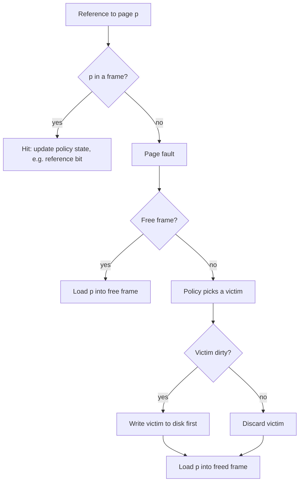
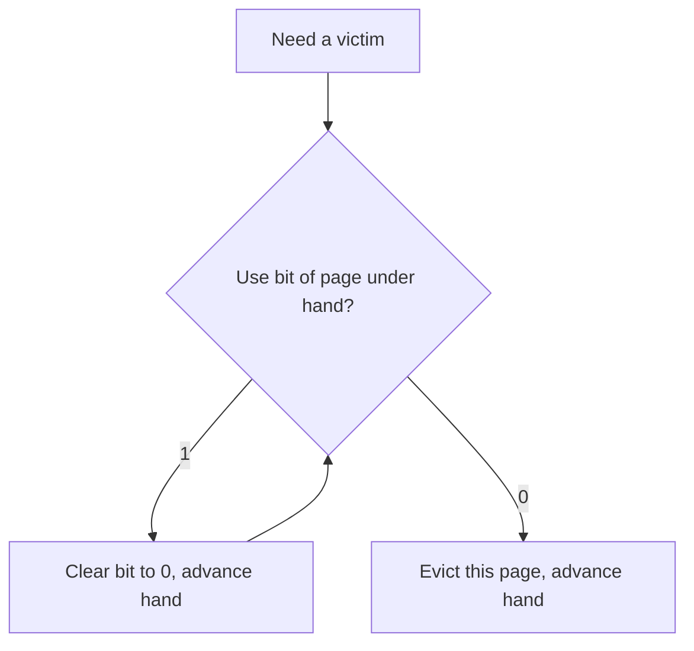

# Page Replacement Policies

**The crux:** physical memory is smaller than the virtual memory the OS pretends to have, so pages spill onto disk (swap). When a page is faulted in but memory is already full, the OS must throw one page out to make room. *Which page should it evict?* A disk access is roughly a hundred thousand times slower than a RAM access, so every avoidable eviction that turns into a future miss is enormously expensive. The replacement policy is the discipline that decides the victim, and a good one is the difference between memory that feels like RAM and memory that feels like a disk.

## The core idea

- Treat main memory as a **cache** for the virtual address space that lives on disk. A reference that finds its page in memory is a **hit**; one that does not is a **miss** (a page fault) and must be served from disk.
- The **goal** of a policy is to **minimize misses** — equivalently, to **maximize the hit rate** — for a given number of frames. Fewer misses means less time stalled on the disk.
- We measure the payoff with **average memory access time (AMAT)**. If a hit costs `T_M` (a memory access) and a miss costs `T_D` (a disk access), and misses happen with probability `P_miss`:

$$
\text{AMAT} = T_M + P_{\text{miss}} \cdot T_D
$$

- Because `T_D` dwarfs `T_M` (nanoseconds versus milliseconds), even a tiny `P_miss` dominates the sum. That is why shaving a few percent off the miss rate matters so much.
- No online policy can see the future, so real policies are all **heuristics** that guess the future from the past. We first define the unbeatable oracle (OPT) as a yardstick, then climb toward it with realizable approximations.

### Worked AMAT example

- Say a memory access `T_M = 100` ns and a disk access `T_D = 10{,}000{,}000` ns (10 ms). With a 90% hit rate, `P_miss = 0.1`:

$$
\text{AMAT} = 100 + 0.1 \cdot 10^7 = 1{,}000{,}100 \text{ ns} \approx 1 \text{ ms}
$$

- Push the hit rate to 99.9% and `P_miss = 0.001`:

$$
\text{AMAT} = 100 + 0.001 \cdot 10^7 = 10{,}100 \text{ ns} \approx 10 \text{ }\mu\text{s}
$$

  A tenfold cut in the miss rate cut AMAT by roughly a hundredfold. The miss term is everything.

## How it works

Every policy answers one question — **who is the victim?** — when a fault arrives and all frames are full.



### OPT / Belady's MIN — the yardstick

- **OPT** (Belady's MIN) evicts the page whose **next use is furthest in the future**. Intuitively, keep the pages you will need soonest; throw out the one you will not touch for the longest.
- It is provably **optimal**: no policy can achieve a lower miss count on a given reference string with a given number of frames.
- It is **unrealizable** online because it needs to know the future reference string. We use it only as a **yardstick** — run it offline on a trace and compare a real policy's misses against it.

### FIFO and Belady's anomaly

- **FIFO** evicts the page that has been resident the **longest** (first in, first out), regardless of how heavily it is used. Simple: a single queue, no per-access bookkeeping.
- FIFO ignores usage, so it happily evicts a hot page that merely arrived early.
- Worse, FIFO suffers **Belady's anomaly**: giving it **more frames can produce *more* faults**. Adding memory should never hurt, yet FIFO's eviction order can reshuffle so unluckily that it does. Policies that are **stack algorithms** (LRU, OPT, LFU) provably never suffer this — their set of resident pages with `k` frames is always a subset of the set with `k+1` frames.

### LRU and LFU — using history

- **LRU** (least-recently-used) evicts the page **not touched for the longest time**. It bets on **recency**: a page used recently will likely be used again (temporal locality).
- **LFU** (least-frequently-used) evicts the page with the **fewest accesses**. It bets on **frequency**: a page hit many times is important. LFU can hold onto pages that were hot long ago (stale counts), so real systems age the counts.
- Recency versus frequency is the core tension: LRU adapts fast to phase changes but is fooled by a one-off scan; LFU resists scans but is slow to forget a page that has cooled off.

### Why exact LRU is too expensive → approximating it

- Exact LRU needs to know the **order of every access**. A hardware-faithful implementation would timestamp every memory reference or move a node to the front of a list on *every* access — far too costly to do in hardware on the critical path of each load and store.
- Hardware instead gives us one cheap signal per page: the **use (reference) bit**. The MMU sets it to 1 whenever the page is accessed; the OS can read and clear it. That is one bit, not a full ordering.
- The **Clock (second-chance)** algorithm turns that one bit into an LRU approximation. Arrange the frames in a circle with a **hand**. To find a victim, look at the page under the hand:
  - if its use bit is 1, it was touched recently — give it a **second chance**: clear the bit to 0 and advance the hand;
  - if its use bit is 0, it has not been touched since the last sweep — **evict it**.
  The hand sweeps until it finds a 0. Recently used pages keep getting reprieved; cold pages get caught. It approximates LRU with a single bit and no per-access work.



### Dirty-bit awareness

- Eviction cost is **not uniform**. A **clean** page (unmodified since load) can be dropped instantly — its copy on disk is still valid. A **dirty** page (written since load) must be **written back to disk first**, doubling the cost.
- Hardware provides a **dirty (modified) bit** alongside the use bit. A better Clock prefers to evict pages that are `(use=0, dirty=0)` first, treating `(use=0, dirty=1)` as a more expensive second choice. This trades a slightly worse replacement decision for far cheaper writebacks.

### The working set and thrashing

- A process's **working set** is the set of pages it actively uses in a recent window of time. If the working sets of all running processes **fit** in physical memory, faults are rare.
- When the sum of working sets **exceeds** memory, the system **thrashes**: it spends almost all its time servicing page faults and moving pages to and from disk, and almost none doing useful work. Throughput collapses.
- The fix is not a cleverer replacement policy but **admission control**: the OS runs fewer processes at once (or swaps a whole process out) so the remaining working sets fit. Some systems call this **swapping-out** or **load control**.

### Scan resistance (brief)

- A large sequential **scan** (reading a big file once) floods the cache with pages that will never be reused, and under pure LRU it **evicts the genuinely hot pages** to make room for garbage. This is the scan-eviction problem.
- **Scan-resistant** policies (segmented LRU, ARC, and the multi-generation LRU used in modern Linux) protect frequently-used pages from being flushed by a one-time scan — roughly, a page must prove itself with a second reference before it is allowed to displace long-lived pages.

## Must-know algorithms

A single compile-tested simulator implements **OPT, FIFO, LRU, and Clock** over a reference string with a fixed number of frames, reporting **fault count and hit rate** for each. It is verified on the classic string `7 0 1 2 0 3 0 4 2 3 0 3 2 1 2 0 1 7 0 1` with 3 frames, and it demonstrates **Belady's anomaly** for FIFO on `1 2 3 4 1 2 5 1 2 3 4 5` at 3 versus 4 frames.

```c
#include <stdio.h>

#define MAXF 16

/* Return the frame index holding `page`, or -1 if not resident. */
static int in_frames(const int *frames, int nf, int page) {
    for (int i = 0; i < nf; i++)
        if (frames[i] == page) return i;
    return -1;
}

/* FIFO: evict the oldest-loaded page (a circular queue of frames). */
static int sim_fifo(const int *ref, int n, int nframes) {
    int frames[MAXF], count = 0, oldest = 0, faults = 0;
    for (int i = 0; i < n; i++) {
        if (in_frames(frames, count, ref[i]) >= 0) continue;
        faults++;
        if (count < nframes) frames[count++] = ref[i];
        else { frames[oldest] = ref[i]; oldest = (oldest + 1) % nframes; }
    }
    return faults;
}

/* OPT: evict the page whose next use is furthest in the future. */
static int sim_opt(const int *ref, int n, int nframes) {
    int frames[MAXF], count = 0, faults = 0;
    for (int i = 0; i < n; i++) {
        if (in_frames(frames, count, ref[i]) >= 0) continue;
        faults++;
        if (count < nframes) { frames[count++] = ref[i]; continue; }
        int victim = 0, farthest = -1;
        for (int f = 0; f < count; f++) {
            int nxt = n; /* not used again -> treat as infinity */
            for (int j = i + 1; j < n; j++)
                if (ref[j] == frames[f]) { nxt = j; break; }
            if (nxt > farthest) { farthest = nxt; victim = f; }
        }
        frames[victim] = ref[i];
    }
    return faults;
}

/* LRU: evict the page whose last access is oldest. */
static int sim_lru(const int *ref, int n, int nframes) {
    int frames[MAXF], last[MAXF], count = 0, faults = 0;
    for (int i = 0; i < n; i++) {
        int idx = in_frames(frames, count, ref[i]);
        if (idx >= 0) { last[idx] = i; continue; }
        faults++;
        if (count < nframes) { frames[count] = ref[i]; last[count] = i; count++; continue; }
        int victim = 0;
        for (int f = 1; f < count; f++)
            if (last[f] < last[victim]) victim = f;
        frames[victim] = ref[i];
        last[victim] = i;
    }
    return faults;
}

/* Clock (second-chance): circular scan; a set use bit buys one reprieve. */
static int sim_clock(const int *ref, int n, int nframes) {
    int frames[MAXF], use[MAXF], count = 0, hand = 0, faults = 0;
    for (int i = 0; i < n; i++) {
        int idx = in_frames(frames, count, ref[i]);
        if (idx >= 0) { use[idx] = 1; continue; }
        faults++;
        if (count < nframes) { frames[count] = ref[i]; use[count] = 1; count++; continue; }
        while (use[hand] == 1) { use[hand] = 0; hand = (hand + 1) % nframes; }
        frames[hand] = ref[i];
        use[hand] = 1;
        hand = (hand + 1) % nframes;
    }
    return faults;
}

static void run(const char *name, const int *ref, int n, int nframes) {
    int fo = sim_opt(ref, n, nframes);
    int ff = sim_fifo(ref, n, nframes);
    int fl = sim_lru(ref, n, nframes);
    int fc = sim_clock(ref, n, nframes);
    printf("%s (n=%d, frames=%d):\n", name, n, nframes);
    printf("  OPT   faults=%2d hits=%2d hitrate=%.3f\n", fo, n - fo, (double)(n - fo) / n);
    printf("  FIFO  faults=%2d hits=%2d hitrate=%.3f\n", ff, n - ff, (double)(n - ff) / n);
    printf("  LRU   faults=%2d hits=%2d hitrate=%.3f\n", fl, n - fl, (double)(n - fl) / n);
    printf("  CLOCK faults=%2d hits=%2d hitrate=%.3f\n", fc, n - fc, (double)(n - fc) / n);
}

int main(void) {
    int classic[] = {7,0,1,2,0,3,0,4,2,3,0,3,2,1,2,0,1,7,0,1};
    run("classic", classic, 20, 3);

    int bel[] = {1,2,3,4,1,2,5,1,2,3,4,5};
    printf("\nBelady FIFO 3 vs 4 frames:\n");
    printf("  FIFO 3 frames faults=%d\n", sim_fifo(bel, 12, 3));
    printf("  FIFO 4 frames faults=%d\n", sim_fifo(bel, 12, 4));
    return 0;
}
```

Running it prints:

```
classic (n=20, frames=3):
  OPT   faults= 9 hits=11 hitrate=0.550
  FIFO  faults=15 hits= 5 hitrate=0.250
  LRU   faults=12 hits= 8 hitrate=0.400
  CLOCK faults=14 hits= 6 hitrate=0.300

Belady FIFO 3 vs 4 frames:
  FIFO 3 frames faults=9
  FIFO 4 frames faults=10
```

- On the classic string with 3 frames, **OPT** is the yardstick at **9 faults** (hit rate 0.550). **LRU** at **12 faults** (0.400) beats **Clock** at **14** (0.300), which beats **FIFO** at **15** (0.250) — the expected ordering: OPT ≤ LRU ≤ Clock ≤ FIFO here.
- **Belady's anomaly is real**: FIFO takes **9 faults with 3 frames** but **10 faults with 4 frames** on `1 2 3 4 1 2 5 1 2 3 4 5` — more memory, more faults. Re-run the simulator with `sim_lru` or `sim_opt` on the same string and the fault count only ever drops as frames grow, because those are stack algorithms.

## Interview questions

1. **What does a page-replacement policy optimize?**
   It minimizes the **miss rate** (maximizes the hit rate) for a fixed number of frames, which in turn minimizes **AMAT** = `T_M + P_miss · T_D`. Because a disk access `T_D` is many orders of magnitude slower than a memory access `T_M`, the miss term dominates, so even small reductions in `P_miss` yield large speedups.

2. **Why is OPT optimal but unrealizable?**
   OPT evicts the page used **furthest in the future**, which provably yields the fewest faults for any string and frame count. It is unrealizable **online** because it requires knowledge of future references. It survives only as an **offline yardstick**: run it on a recorded trace to see how close a real policy comes.

3. **What is Belady's anomaly, and which policies suffer it?**
   It is the counter-intuitive phenomenon where **adding frames increases faults**. **FIFO** suffers it. **Stack algorithms** — LRU, LFU, and OPT — provably do not, because their resident set with `k` frames is always a subset of the resident set with `k+1` frames, so a hit with fewer frames is always a hit with more.

4. **LRU versus LFU — recency versus frequency?**
   LRU evicts the **least-recently-used** page, betting on temporal locality; it adapts quickly to workload phase changes but is easily polluted by a one-off scan. LFU evicts the **least-frequently-used** page, betting on long-run popularity; it resists scans but clings to pages that were hot in the past (stale counts) unless the counts are aged.

5. **Why is exact LRU impractical, and how does Clock approximate it?**
   Exact LRU must record the **order of every access** — a timestamp or list-move on each load and store — which is too expensive for hardware to do on the critical path. Clock uses a single hardware **use bit** per page and a circular hand: a set bit buys a page one **second chance** (bit cleared, hand advances); the first page found with a clear bit is evicted. This approximates "recently used" with one bit and no per-access bookkeeping.

6. **What are the roles of the reference bit and the dirty bit?**
   The **reference (use) bit** is set by hardware on any access and lets the OS tell recently-touched pages from cold ones — the signal Clock relies on. The **dirty (modified) bit** is set on any write and tells the OS whether a victim must be **written back** to disk before eviction. A clean victim is free to drop; a dirty one costs an extra disk write, so smart policies prefer clean victims.

7. **What is thrashing, and how does the working set prevent it?**
   The **working set** is the pages a process actively touches in a recent time window. **Thrashing** happens when the combined working sets exceed physical memory: the system spends nearly all its time paging and throughput collapses. The cure is **admission control** — run fewer processes (or swap a whole one out) so the surviving working sets fit — not a cleverer replacement policy.

8. **Why does a naive LRU cache perform badly under a large sequential scan, and what fixes it?**
   A scan brings in many use-once pages; pure LRU treats each as freshly-used and evicts genuinely hot pages to hold scan garbage. **Scan-resistant** policies (segmented LRU, ARC, Linux's multi-generation LRU) require a page to be referenced a second time before it can displace established pages, so a single pass cannot flush the hot set.

## Coding problems

- 🎯 **[LRU Cache — LeetCode 146](https://leetcode.com/problems/lru-cache/)** — get/put in `O(1)`; tests the hash-map + doubly-linked-list structure that is exactly the recency ordering a real LRU replacement policy needs.
- 🎯 **[LFU Cache — LeetCode 460](https://leetcode.com/problems/lfu-cache/)** — get/put in `O(1)` with frequency buckets and LRU tie-break; tests the frequency-plus-recency bookkeeping behind LFU eviction.
- 🏗 **Page-replacement simulator (OPT / FIFO / LRU / Clock)** — the C program above; given a reference string and a frame count, report faults and hit rate for each policy and reproduce Belady's anomaly for FIFO. This is the OS-classic "implement the policies and compare" exercise.

The `O(1)` LRU cache is built on a doubly-linked list with sentinel head and tail plus a hash map, the same structure taught on the [Linked Lists and the Pointer Machine](/docs/dsa/s01-foundations/s01e07-linked-lists-pointer-machine) page.

## Key takeaways

- Main memory is a **cache** for a disk-backed address space; a replacement policy picks the **victim** on a fault when memory is full, aiming to minimize misses.
- **AMAT** = `T_M + P_miss · T_D`, and because `T_D ≫ T_M`, the miss rate dominates — small hit-rate gains pay off enormously.
- **OPT** (evict furthest-future use) is optimal but needs the future, so it is only a **yardstick**.
- **FIFO** is simple but usage-blind and suffers **Belady's anomaly** (more frames, more faults); **stack algorithms** (LRU, LFU, OPT) never do.
- Exact **LRU** is too costly, so hardware gives a **use bit** and the OS runs **Clock (second-chance)** to approximate it; the **dirty bit** makes clean victims cheaper to evict.
- Fitting every process's **working set** into memory avoids **thrashing**; when it will not fit, reduce concurrency rather than tune the policy.

## Source(s) and further reading

- OSTEP — [Beyond Physical Memory: Policies (free PDF)](https://pages.cs.wisc.edu/~remzi/OSTEP/vm-beyondphys-policy.pdf) — OPT, FIFO, LRU, Clock, and AMAT worked out in detail.
- Wikipedia — [Page replacement algorithm](https://en.wikipedia.org/wiki/Page_replacement_algorithm) — survey of OPT, FIFO, LRU, Clock, ARC and their tradeoffs.
- Wikipedia — [Bélády's anomaly](https://en.wikipedia.org/wiki/B%C3%A9l%C3%A1dy%27s_anomaly) — the more-frames-more-faults phenomenon and why stack algorithms avoid it.
- Wikipedia — [Working set](https://en.wikipedia.org/wiki/Working_set) — the working-set model and its link to thrashing and load control.
