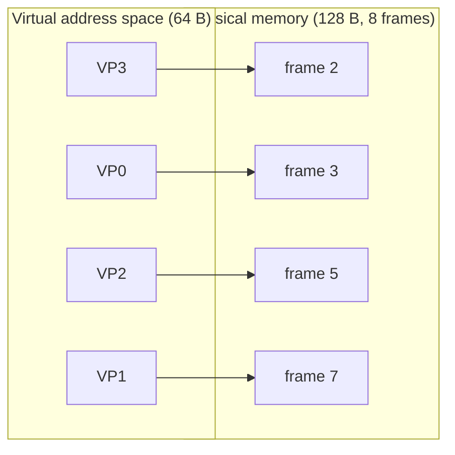
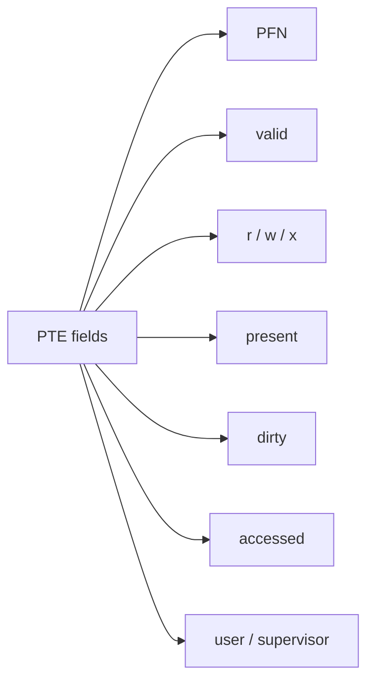

# Introduction to Paging

**The crux:** how do we virtualize memory without the fragmentation headache that variable-sized segments create? Segmentation carves the address space into differently sized chunks (code, heap, stack), and over time the free space between them shatters into oddly sized holes — **external fragmentation** — so a fresh allocation can fail even when enough total memory is free. Paging takes the opposite stance: chop everything into **fixed-size** pieces. Fixed sizes make free space interchangeable, so external fragmentation disappears. The cost is a level of indirection — a **page table** per process that maps virtual pages to physical frames — and this page begins the story of how that indirection works and what two problems it introduces.

## The core idea

- Divide the **virtual address space** into fixed-size units called **pages**. Divide **physical memory** into equally sized slots called **page frames**. One page fits exactly into one frame.
- Placement becomes trivial free-space management: to load a process, the OS grabs any set of free frames off a free list — they need not be contiguous, and any free frame is as good as any other. There is no "does this variable-sized request fit this hole" search.
- **No external fragmentation.** Because every request and every hole is exactly one page/frame in size, free memory never fragments into unusable odd-sized gaps. The only waste is **internal fragmentation**: the last page of an allocation is usually not completely full, so on average roughly half a page is wasted per region — a small, bounded cost.
- Each process gets its own **page table**, a per-process data structure that records, for each virtual page, which physical frame holds it. It stores **VPN → PFN** translations (virtual page number to physical frame number).
- Every memory reference (instruction fetch, load, store) is a **virtual address**. Hardware plus OS translate it to a physical address by splitting it into a **VPN + offset**, using the VPN to index the page table, and pasting the resulting **PFN** in front of the untouched offset.
- Paging solves fragmentation but hands us two new problems, each of which motivates a later topic:
  1. Page tables are **big** — a linear table for a 32-bit space is megabytes *per process* (computed below). This motivates **multi-level / advanced page tables**.
  2. Translation is **slow** — a naive scheme adds one extra memory reference per access to fetch the PTE, roughly doubling memory-access cost. This motivates the **TLB** (a translation cache).

## How it works

### Pages and frames

Consider a deliberately tiny example (following OSTEP): a **64-byte** virtual address space split into four **16-byte pages** (virtual pages 0 to 3), living in a **128-byte** physical memory of eight **16-byte frames**. The OS might place virtual page 0 in frame 3, page 1 in frame 7, page 2 in frame 5, page 3 in frame 2 — scattered, non-contiguous, and that is fine.



The page table for this process is just four entries: VP0 to PF3, VP1 to PF7, VP2 to PF5, VP3 to PF2. A different process running later has its **own** page table mapping its pages to different frames.

### Splitting a virtual address: VPN and offset

The address size determines the number of bits; the **page size** determines where the split falls. If the address space is $2^{a}$ bytes the virtual address is $a$ bits wide, and if the page size is $2^{o}$ bytes then the low $o$ bits are the **offset** (which byte within the page) and the remaining high bits are the **VPN** (which page):

$$
o = \log_2(\text{page size}), \qquad \text{VPN bits} = a - o
$$

For the 64-byte space with 16-byte pages: $a = 6$, $o = \log_2 16 = 4$, so the VPN is the top $6 - 4 = 2$ bits and the offset is the low 4 bits.

$$
\underbrace{\;V_5\; V_4\;}_{\text{VPN (2 bits)}}\;\underbrace{\;V_3\; V_2\; V_1\; V_0\;}_{\text{offset (4 bits)}}
$$

Take virtual address $21 = 010101_2$. The top two bits $01$ give $\text{VPN} = 1$; the low four bits $0101$ give $\text{offset} = 5$. So address 21 is byte 5 of virtual page 1.

### The page-table entry (PTE)

A **linear page table** is just an array of PTEs, indexed by VPN. Each PTE packs a PFN plus status/control bits. The ones worth knowing:

- **Valid bit** — is this translation in use at all. Unused regions of a sparse address space (the vast gap between heap and stack) are marked invalid, so no frame is allocated for them and a stray access traps. This is what makes a sparse address space cheap.
- **Protection bits (r / w / x)** — may the page be read, written, executed. A disallowed access traps to the OS.
- **Present bit** — is the page in physical memory or swapped out to disk. A reference to a non-present page triggers a fault so the OS can page it back in.
- **Dirty bit** — has the page been modified since it was brought in. Tells the OS whether it must write the page back on eviction.
- **Accessed / reference bit** — has the page been touched recently. Feeds page-replacement decisions.
- **User/supervisor bit** — may user-mode code touch this page, or is it kernel-only.



On x86 there is no separate valid bit: the **present bit (P)** does double duty. P=1 means present and valid; P=0 traps, and the OS then consults its own structures to decide whether the page is swapped-out-but-valid or genuinely illegal.

### The translation

Given the page-table base register (PTBR) holding the physical address of the table, translating a virtual address is four steps:

1. **Extract the VPN**: $\text{VPN} = (\text{VA} \mathbin{\&} \text{VPN\_MASK}) \gg \text{SHIFT}$, where SHIFT is the number of offset bits.
2. **Index the table**: $\text{PTEAddr} = \text{PTBR} + \text{VPN} \times \text{sizeof(PTE)}$; fetch the PTE from memory.
3. **Check bits**: if the valid bit is clear, raise a segmentation fault; if the protection bits forbid this access, raise a protection fault.
4. **Form the physical address**: $\text{offset} = \text{VA} \mathbin{\&} \text{OFFSET\_MASK}$, then $\text{PA} = (\text{PFN} \ll \text{SHIFT}) \mathbin{\vert} \text{offset}$. The offset is copied through untouched — only the page number is translated.

```mermaid
flowchart LR
  va["Virtual address"] --> split{"split on offset bits"}
  split -->|"high bits"| vpn["VPN"]
  split -->|"low bits"| off["offset"]
  vpn --> idx["index page table<br/>PTBR &#43; VPN &#215; sizeof(PTE)"]
  idx --> pte["read PTE"]
  pte --> chk{"valid &#38; protection ok?"}
  chk -->|"no"| fault["trap to OS<br/>(seg / protection fault)"]
  chk -->|"yes"| pfn["PFN"]
  pfn --> form["PA = (PFN &#60;&#60; shift) &#124; offset"]
  off --> form
  form --> pa["Physical address"]
```



Worked example: virtual address 21 in our tiny space. VPN = 1, offset = 5. Indexing the page table, VP1 maps to PF7 (binary 111). The physical address is $(7 \ll 4) \mathbin{\vert} 5 = 112 + 5 = 117$. The load goes to physical byte 117.

### Problem 1 — page tables are big

A linear page table needs one PTE for **every** virtual page, whether mapped or not. Take a typical **32-bit** address space with **4KB** pages:

- offset bits $= \log_2 4096 = 12$, so the VPN is the top $32 - 12 = 20$ bits.
- Number of pages $= 2^{20} = 1{,}048{,}576$ (about a million).
- At **4 bytes per PTE**: $2^{20} \times 4 = 4{,}194{,}304$ bytes $= 4\ \text{MB}$ **per process**.

$$
2^{20}\ \text{entries} \times 4\ \text{B} = 4\,\text{MB per process}
$$

With 100 processes that is **400 MB** of RAM spent purely on translations, and a 64-bit space is astronomically worse. This is why real systems abandon the flat array for **multi-level page tables, inverted page tables**, and similar structures — the subject of later topics.

### Problem 2 — translation is slow

In the naive scheme, every memory reference the program makes now costs **two** memory references: one to fetch the PTE from the in-memory page table, then one to fetch the actual data. That extra reference can slow the program by a factor of two or more. The fix is to cache recent translations in a small, fast hardware cache — the **Translation Lookaside Buffer (TLB)** — so the common case skips the page-table lookup entirely.

## Must-know algorithms

### Linear page-table translator

A complete, compile-tested translator. It uses the OSTEP tiny model (6-bit VA, 16-byte pages, 4 pages, 8 frames) so we can reason in full binary, splits each address with masks and shifts, checks the valid bit, and either forms the physical address or reports a fault. It runs several addresses including an invalid one, and reproduces the OSTEP golden value (VA 21 to PA 117).

```c
#include <stdio.h>
#include <stdint.h>

/*
 * Linear page-table translator (OSTEP tiny model).
 *   virtual address = 6 bits total
 *   page size       = 16 bytes  -> offset = 4 bits, VPN = 2 bits
 *   4 pages, 8 physical frames  -> physical address = 3-bit PFN + 4-bit offset
 */

#define VA_BITS      6u
#define OFFSET_BITS  4u                        /* log2(page size = 16)     */
#define VPN_BITS     (VA_BITS - OFFSET_BITS)   /* = 2 -> up to 4 pages     */
#define NUM_PAGES    (1u << VPN_BITS)          /* = 4 page-table entries   */

#define OFFSET_MASK  ((1u << OFFSET_BITS) - 1u)                /* 0x0F */
#define VPN_MASK     (((1u << VPN_BITS) - 1u) << OFFSET_BITS)  /* 0x30 */

/* A page-table entry: valid bit + physical frame number. */
typedef struct {
    unsigned valid : 1;
    unsigned pfn   : 3;   /* 3 bits -> up to 8 frames */
} pte_t;

/* Per-process linear page table: index by VPN, read the PTE. */
static pte_t page_table[NUM_PAGES];

/* Result of a translation attempt. */
typedef struct {
    int      ok;   /* 1 = translated, 0 = fault */
    uint32_t pa;   /* physical address, valid only when ok == 1 */
} xlate_t;

static xlate_t translate(uint32_t va) {
    xlate_t r = { 0, 0 };

    /* 1. Extract VPN and offset with masks + shift. */
    uint32_t vpn    = (va & VPN_MASK) >> OFFSET_BITS;
    uint32_t offset =  va & OFFSET_MASK;

    /* 2. Index the page table and check the valid bit. */
    pte_t e = page_table[vpn];
    if (!e.valid)
        return r;                   /* fault: unmapped page */

    /* 3. Form the physical address: (PFN << OFFSET_BITS) | offset. */
    r.ok = 1;
    r.pa = (e.pfn << OFFSET_BITS) | offset;
    return r;
}

int main(void) {
    /* OSTEP mapping VP0->PF3, VP1->PF7, VP3->PF2, but leave VP2 invalid
       to demonstrate a fault on an unmapped page. */
    page_table[0] = (pte_t){ .valid = 1, .pfn = 3 };
    page_table[1] = (pte_t){ .valid = 1, .pfn = 7 };
    page_table[2] = (pte_t){ .valid = 0, .pfn = 0 };  /* unmapped */
    page_table[3] = (pte_t){ .valid = 1, .pfn = 2 };

    uint32_t tests[] = { 21, 0, 63, 33, 48 };
    size_t n = sizeof(tests) / sizeof(tests[0]);

    printf("va(dec)  vpn off  ->  result\n");
    for (size_t i = 0; i < n; i++) {
        uint32_t va  = tests[i];
        uint32_t vpn = (va & VPN_MASK) >> OFFSET_BITS;
        uint32_t off =  va & OFFSET_MASK;
        xlate_t  x   = translate(va);
        if (x.ok)
            printf("  %5u   %u   %2u  ->  pa=%u (frame %u)\n",
                   va, vpn, off, x.pa, x.pa >> OFFSET_BITS);
        else
            printf("  %5u   %u   %2u  ->  SEGFAULT (page %u invalid)\n",
                   va, vpn, off, vpn);
    }
    return 0;
}
```

Output:

```text
va(dec)  vpn off  ->  result
     21   1    5  ->  pa=117 (frame 7)
      0   0    0  ->  pa=48 (frame 3)
     63   3   15  ->  pa=47 (frame 2)
     33   2    1  ->  SEGFAULT (page 2 invalid)
     48   3    0  ->  pa=32 (frame 2)
```

VA 21 lands on PA 117 exactly as OSTEP predicts; VA 33 hits the deliberately invalid page 2 and faults; the offset (byte-within-page) is always preserved.

## Interview questions

**1. Paging versus segmentation — what is the essential difference?**
Segmentation divides the address space into a few **variable-sized**, logically meaningful regions (code, heap, stack), each with a base and bound. Paging divides it into many **fixed-size** pages mapped through a page table. The consequence: segmentation suffers **external fragmentation** (variable-sized holes that no longer fit new requests), while paging eliminates it because every page and frame is the same size and thus interchangeable. Paging trades that away for a larger translation structure (the page table).

**2. How does a virtual address map to a physical address under paging?**
Split the virtual address into a high-order **VPN** and a low-order **offset**, where the number of offset bits is $\log_2(\text{page size})$. Use the VPN to index the process's page table and read the **PFN** out of that PTE. Concatenate the PFN with the original offset — physical address $= (\text{PFN} \ll \text{offset bits}) \mathbin{\vert} \text{offset}$. Only the page number is translated; the offset passes through unchanged.

**3. What is stored in a page-table entry?**
A **PFN** plus control bits: a **valid** bit (is the translation in use — invalid entries make sparse address spaces cheap), **protection** bits (read/write/execute permissions), a **present** bit (in memory versus swapped to disk), a **dirty** bit (modified since load — needed to decide whether to write back on eviction), an **accessed/reference** bit (touched recently — feeds page replacement), and a **user/supervisor** bit (privilege level). On x86 the present bit also serves as the valid bit.

**4. Internal versus external fragmentation — which does paging suffer?**
**External** fragmentation is free memory splintered into holes too small or oddly sized to satisfy requests; it plagues variable-sized allocation like segmentation. **Internal** fragmentation is space wasted *inside* an allocated unit because the unit is larger than needed. Paging has **no external** fragmentation (fixed-size frames are interchangeable) but does have **internal** fragmentation on the last page of a region — on average about half a page per region. Bigger pages reduce table size but increase internal waste.

**5. Why is a linear page table so big? Compute it.**
A linear page table needs one PTE per virtual page whether or not the page is used. For a **32-bit** address space with **4KB** pages: offset $= \log_2 4096 = 12$ bits, so the VPN is $32 - 12 = 20$ bits, giving $2^{20} \approx 10^6$ pages. At **4 bytes per PTE**, that is $2^{20} \times 4 = 4{,}194{,}304$ bytes $= \mathbf{4\ MB}$ per process — and it is per process, so 100 processes need 400 MB just for translations. This is what motivates multi-level and inverted page tables.

**6. Why is paging slow without a TLB?**
The page table lives in memory, so before the hardware can fetch the actual data it must first fetch the PTE from memory to learn the PFN. That is **one extra memory reference per access**, roughly doubling memory-access latency. A **TLB** caches recent VPN-to-PFN translations in fast hardware; a hit skips the page-table walk entirely, so the extra reference is paid only on a miss.

**7. Why is the page table a per-process structure, and what happens on a context switch?**
Each process has its own virtual-to-physical mapping — the same virtual address in two processes must reach different physical frames (barring deliberate sharing). So each process needs its own page table. On a context switch the OS points the page-table base register at the new process's table (and, because translations are cached, the stale ones must be handled — for example by flushing the TLB or tagging entries with an address-space identifier).

**8. How does the valid bit support a sparse address space cheaply?**
A program uses only a tiny fraction of its huge virtual address space — code and heap near the bottom, stack near the top, an enormous unused gap between. Marking every page in that gap **invalid** means the OS allocates **no physical frame** for it, so the mapping costs nothing in RAM, and any stray access into the gap traps to the OS. Without the valid bit you would have to back every virtual page with a frame.

**9. What are the two problems paging introduces, and what solves each?**
(1) Page tables are **big** — a flat array is megabytes per process — solved by **multi-level / inverted page tables** that avoid storing entries for unmapped regions. (2) Translation is **slow** — a naive lookup doubles memory traffic — solved by the **TLB**, a hardware cache of translations. Everything after this introduction is essentially working through these two.

## Coding problems

### 🎯 Interview (bit manipulation / decode)

- **VPN/offset decode** — given a page size and a virtual address, extract the VPN and offset with a mask and a shift ($\text{offset} = \text{VA} \mathbin{\&} (\text{pagesize}-1)$, $\text{VPN} = \text{VA} \gg \log_2 \text{pagesize}$), then recombine a PFN and offset into a physical address. This *is* the core loop of the translator above. What it tests: power-of-two masks/shifts and the page-boundary math. See [Page (computer memory) — Wikipedia](https://en.wikipedia.org/wiki/Page_(computer_memory)).
- **[136. Single Number](https://leetcode.com/problems/single-number/)** — XOR-fold to isolate the unpaired value. What it tests: fluency with bitwise operators, the same primitive you use to mask out offset bits.
- **[201. Bitwise AND of Numbers Range](https://leetcode.com/problems/bitwise-and-of-numbers-range/)** — reduce a range to its common high-bit prefix by shifting. What it tests: reasoning about high-order bits, exactly the VPN portion of an address.

### 🏗 Systems (OS-classic)

- **Build the page-table translator** — implement VPN/offset splitting, a valid-bit check, and physical-address assembly over a linear page table, faulting on unmapped pages. The complete reference is the C program in [Must-know algorithms](#must-know-algorithms) above. What it tests: the mechanics of address translation end to end. Reference: [Page table — Wikipedia](https://en.wikipedia.org/wiki/Page_table).
- **Build a page-table walker** — extend the translator to a two-level table: split the VPN itself into a page-directory index and a page-table index, follow the directory PTE to the second-level table, then translate — the very structure that fixes the "tables are too big" problem. What it tests: multi-level indexing and the space savings of not allocating second-level tables for unmapped regions. Reference: [Memory paging — Wikipedia](https://en.wikipedia.org/wiki/Memory_paging).
- **[146. LRU Cache](https://leetcode.com/problems/lru-cache/)** — a hash map plus a doubly linked list for O(1) get/put with least-recently-used eviction. What it tests: the exact data structure behind page-replacement and TLB eviction policies you will meet in the next topics.

## Key takeaways

- Paging chops the address space into fixed-size **pages** and physical memory into equal **frames**; any page fits any frame, so placement is trivial and **external fragmentation vanishes**.
- The only waste is **internal fragmentation** on the last page of a region — bounded and small.
- A per-process **page table** stores **VPN → PFN** translations; a **linear** table is a flat array indexed by VPN.
- A virtual address splits into a high **VPN** and low **offset**, where offset bits $= \log_2(\text{page size})$; translation replaces the VPN with a PFN and copies the offset through.
- A **PTE** carries the PFN plus valid, protection (r/w/x), present, dirty, accessed, and user/supervisor bits.
- Paging introduces two problems: page tables are **big** (32-bit / 4KB / 4-byte PTE $\to$ **4 MB per process**, motivating advanced page tables) and translation is **slow** (an extra memory reference per access, motivating the **TLB**).

## Source(s) and further reading

- [OSTEP — Paging: Introduction (free PDF)](https://pages.cs.wisc.edu/~remzi/OSTEP/vm-paging.pdf) — the chapter this page is grounded in (pages, frames, page table, VPN/offset, PTE, translation, the big-and-slow problems).
- [OSTEP homepage (all free chapters)](https://pages.cs.wisc.edu/~remzi/OSTEP/) — Arpaci-Dusseau, _Operating Systems: Three Easy Pieces_.
- [Memory paging — Wikipedia](https://en.wikipedia.org/wiki/Memory_paging) — overview of paging and its variants.
- [Page table — Wikipedia](https://en.wikipedia.org/wiki/Page_table) — page-table structure, PTE contents, and translation.
- [Page (computer memory) — Wikipedia](https://en.wikipedia.org/wiki/Page_(computer_memory)) — the page/frame unit and page-size tradeoffs.
- [Translation lookaside buffer — Wikipedia](https://en.wikipedia.org/wiki/Translation_lookaside_buffer) — the translation cache that fixes paging's speed problem.
- [Fragmentation (computing) — Wikipedia](https://en.wikipedia.org/wiki/Fragmentation_(computing)) — internal versus external fragmentation.
