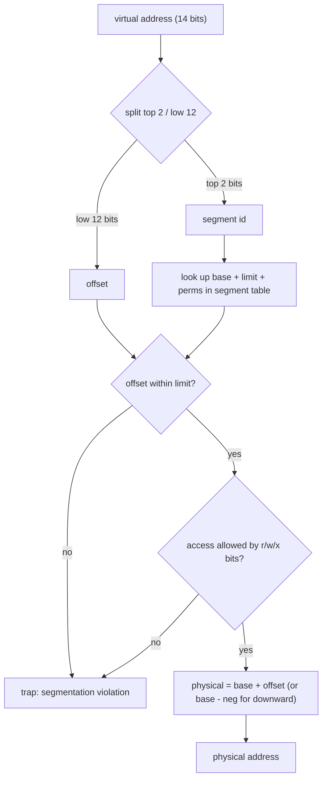
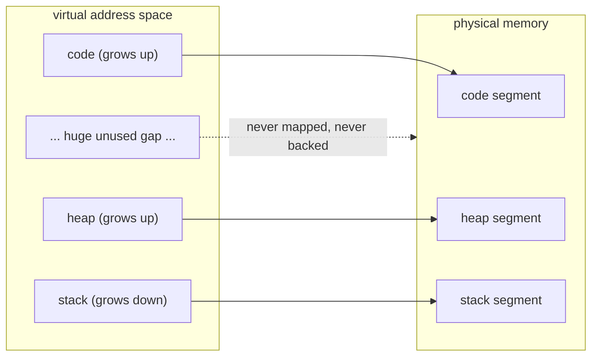
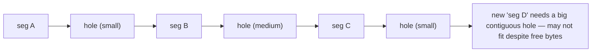

# Segmentation

**The crux:** a single base-and-bounds pair relocates a whole address space as one contiguous block, so the enormous *unused* gap between a program's heap (growing up from the bottom) and its stack (growing down from the top) must still be backed by physical memory. That is hugely wasteful. How can hardware relocate and protect memory while leaving the sparse middle of the address space unbacked? Segmentation answers this by giving each logical piece — code, heap, stack — its **own** base-and-bounds pair, so only the parts actually in use consume physical RAM.

## The core idea

- **Per-segment base+limit.** Instead of one base and one bounds for the entire address space, keep a small **base+limit pair per segment**. A segment is a variable-sized, contiguous logical region: typically **code**, **heap**, and **stack**.
- **Only used memory is backed.** Because each segment is placed independently in physical memory, the large sparse gap between heap and stack is never allocated. Physical usage tracks the sum of segment sizes, not the whole virtual span.
- **Independent placement.** Segments can sit anywhere in physical memory and in any order; they need not be adjacent. The hardware relocates each one on its own.
- **Per-segment protection.** Each segment carries permission bits (read / write / execute), so code can be read-only and executable while the heap is read-write and non-executable.
- **Sharing.** Because a segment is a self-contained unit with its own base and permissions, two processes can point at the *same* physical code segment (read-only), sharing it without copying.
- **The cost.** Variable-sized segments packed into physical memory leave odd-sized holes between them — **external fragmentation** — which is the weakness that motivates paging.

## How it works

### From one base+bounds to per-segment

With plain base-and-bounds, translation is a single add-and-check:

$$
\text{PA} = \text{base} + \text{VA}, \qquad \text{trap if } \text{VA} \ge \text{bounds}
$$

The whole virtual address space is treated as one block, so the space between heap and stack sits inside `bounds` and must be backed. Segmentation splits that one pair into several. The hardware needs to decide, for each virtual address, *which* segment it belongs to.

### Picking the segment from the top bits

The common hardware trick is the **explicit approach**: use the **top bits** of the virtual address as a **segment id**, and the **remaining bits** as an **offset** within that segment.

With a 14-bit virtual address, a 2-bit segment id and a 12-bit offset:

$$
\underbrace{s_1 s_0}_{\text{segment id (2 bits)}}\;\underbrace{o_{11}\,o_{10}\,\cdots\,o_0}_{\text{offset (12 bits)}}
$$

- **Segment id** = top 2 bits → selects a base+limit pair (4 possible segments: ids 0..3).
- **Offset** = low 12 bits → position within the chosen segment (0..4095).

Given a segment table, translation becomes: decode the id, look up that segment's base+limit, bounds-check the offset, then add the base.



The tiny **segment table** (one row per id) holds the base, limit, growth direction, and permission bits. It is small enough to live in hardware registers on classic designs.

### The heap–stack gap costs nothing



Only the three segments occupy physical frames. The gap between heap and stack — which under one base+bounds would have to be backed — maps to nothing.

### Negative-direction growth for the stack

The stack grows **downward** (toward lower addresses), the opposite of code and heap. The hardware must know this per segment, usually with a **grows-positive / grows-negative** bit in the segment table.

For a **downward** segment whose slot spans `SEG_SIZE` bytes, the segment occupies the **top** of its slot. The used region is the highest `limit` bytes:

$$
\text{legal offsets} = [\,\text{SEG\_SIZE} - \text{limit},\ \text{SEG\_SIZE}\,)
$$

To translate, compute how far the offset sits **below the top** of the slot and subtract that from the physical top:

$$
\text{neg} = \text{SEG\_SIZE} - \text{offset}, \qquad \text{PA} = \text{base}_{\text{top}} - \text{neg}
$$

where `base_top` is the physical address of the top of the stack segment. An offset that is not high enough (below `SEG_SIZE - limit`) is out of bounds and faults.

### Protection bits per segment

Each segment row carries **r/w/x** permission bits. On every access the hardware checks the access type against the bits *before* forming the physical address:

- **Code**: read + execute, **not** writable → self-modifying stores trap.
- **Heap / stack (data)**: read + write, **not** executable → running injected data traps (the basis of NX / DEP defenses).

A permission mismatch raises the same kind of hardware trap as a bounds violation.

```c
#include <stdio.h>
#include <stdint.h>

#define PROT_R 0x4
#define PROT_W 0x2
#define PROT_X 0x1

typedef enum { ACC_READ, ACC_WRITE, ACC_EXEC } access_t;

static int allowed(uint32_t prot, access_t a)
{
    switch (a) {
        case ACC_READ:  return (prot & PROT_R) != 0;
        case ACC_WRITE: return (prot & PROT_W) != 0;
        case ACC_EXEC:  return (prot & PROT_X) != 0;
    }
    return 0;
}

int main(void)
{
    uint32_t code_prot = PROT_R | PROT_X;   /* read + execute, no write */
    uint32_t heap_prot = PROT_R | PROT_W;   /* read + write, no execute */
    printf("code write? %d (expect 0)\n", allowed(code_prot, ACC_WRITE));
    printf("code exec?  %d (expect 1)\n", allowed(code_prot, ACC_EXEC));
    printf("heap write? %d (expect 1)\n", allowed(heap_prot, ACC_WRITE));
    printf("heap exec?  %d (expect 0)\n", allowed(heap_prot, ACC_EXEC));
    return 0;
}
```

Running this prints `0, 1, 1, 0` — code cannot be written, heap cannot be executed.

### Sharing read-only code

Because the permission bits and base live in the segment table, two processes can install segment rows that point at the **same** physical code segment, both marked read-only + executable. The code is shared with zero copying, and neither process can corrupt it. This is why loading many instances of the same program (or a shared library) does not duplicate its text in memory.

### The cost: external fragmentation

Segments are **variable-sized**. As they are allocated and freed, physical memory ends up peppered with holes of assorted sizes. You can have plenty of total free memory yet still fail to place a new segment because no single hole is large enough — this is **external fragmentation**.



The OS can **compact** memory (relocate segments to coalesce holes), but compaction is expensive: it copies live data and must pause allocation. External fragmentation is the fundamental weakness of segmentation and the reason systems moved to **paging**, where memory is carved into fixed-size units that never leave external holes.

## Must-know algorithms

### Segmented address translator

Decode the segment id from the top bits, apply that segment's base+limit, handle a **downward-growing** stack segment, and fault on bounds or missing-segment errors. The table has one row per possible id (4 rows for a 2-bit id); id `2` is left unused to show the missing-segment fault. Ids come **straight from the top bits**, so the stack lives at id `3`.

```c
#include <stdio.h>
#include <stdint.h>
#include <stddef.h>

/* 14-bit virtual address: top 2 bits = segment id, low 12 bits = offset.
 * Segment ids come straight from the top two bits:
 *   0 = code, 1 = heap, 3 = stack (grows down). Id 2 is unused -> faults. */

#define OFF_BITS    12u
#define SEG_BITS     2u
#define OFF_MASK    ((1u << OFF_BITS) - 1u)                /* 0xFFF         */
#define SEG_SHIFT   OFF_BITS
#define SEG_MASK    (((1u << SEG_BITS) - 1u) << SEG_SHIFT) /* 0x3000        */
#define SEG_SIZE    (1u << OFF_BITS)                       /* 4096 per slot */
#define NSEG        (1u << SEG_BITS)                       /* 4 slots       */

typedef struct {
    const char *name;
    uint32_t    base;      /* upward: physical start. downward: physical TOP. */
    uint32_t    limit;     /* bytes actually in use for this segment          */
    int         grows_up;  /* 1 = positive direction, 0 = negative (stack)    */
    int         present;   /* 0 = no such segment -> fault                    */
} segment_t;

typedef struct {
    int         ok;        /* 1 = translated, 0 = fault */
    uint32_t    pa;        /* valid only when ok        */
    const char *reason;    /* fault reason when not ok  */
} xlate_t;

static uint32_t seg_id(uint32_t va)  { return (va & SEG_MASK) >> SEG_SHIFT; }
static uint32_t seg_off(uint32_t va) { return va & OFF_MASK; }

/* Translate one virtual address through the segment table. */
static xlate_t translate(const segment_t *tab, uint32_t va)
{
    xlate_t r = { 0, 0, "" };
    uint32_t s   = seg_id(va);
    uint32_t off = seg_off(va);

    if (!tab[s].present) { r.reason = "no such segment"; return r; }
    const segment_t *seg = &tab[s];

    if (seg->grows_up) {
        /* upward: legal offsets are [0, limit) */
        if (off >= seg->limit) { r.reason = "bounds (upward overflow)"; return r; }
        r.ok = 1;
        r.pa = seg->base + off;
        return r;
    }

    /* downward (stack): segment occupies the TOP of its 4096-byte slot.
     * Legal offsets are [SEG_SIZE - limit, SEG_SIZE). The distance below the
     * slot top is (SEG_SIZE - off) and must be within limit. */
    if (off < SEG_SIZE - seg->limit) { r.reason = "bounds (stack underflow)"; return r; }
    {
        uint32_t neg = SEG_SIZE - off;   /* bytes below slot top          */
        r.ok = 1;
        r.pa = seg->base - neg;          /* base is the TOP physical addr  */
        return r;
    }
}

int main(void)
{
    /* Physical layout: code at 0x0, heap at 0x8000, stack TOP at 0x10000. */
    segment_t tab[NSEG] = {
        [0] = { "code",  0x00000u, 0x400u, 1, 1 },  /* 1 KB code, grows up          */
        [1] = { "heap",  0x08000u, 0x600u, 1, 1 },  /* 1.5 KB heap, grows up        */
        [2] = { "-",     0x00000u, 0x000u, 1, 0 },  /* unused id 2 -> fault         */
        [3] = { "stack", 0x10000u, 0x400u, 0, 1 },  /* 1 KB stack down; base = top  */
    };

    uint32_t tests[] = {
        0x0010,   /* code  seg 0 off 0x010 -> 0x00010                */
        0x0AC0,   /* code  seg 0 off 0xAC0 -> overflow (limit 0x400) */
        0x1100,   /* heap  seg 1 off 0x100 -> 0x08100                */
        0x1700,   /* heap  seg 1 off 0x700 -> overflow (limit 0x600) */
        0x3FFF,   /* stack seg 3 off 0xFFF -> 0x0FFFF (1 below top)   */
        0x3C00,   /* stack seg 3 off 0xC00 -> 0x0FC00 (exactly limit) */
        0x3800,   /* stack seg 3 off 0x800 -> underflow (below limit) */
        0x2000,   /* seg 2 -> no such segment                        */
    };

    for (size_t i = 0; i < sizeof(tests) / sizeof(tests[0]); i++) {
        uint32_t va = tests[i];
        xlate_t r = translate(tab, va);
        uint32_t s = seg_id(va), off = seg_off(va);
        if (r.ok)
            printf("VA 0x%04X  seg=%u(%s) off=0x%03X  ->  PA 0x%05X\n",
                   va, s, tab[s].name, off, r.pa);
        else
            printf("VA 0x%04X  seg=%u off=0x%03X  ->  FAULT: %s\n",
                   va, s, off, r.reason);
    }
    return 0;
}
```

Output:

```
VA 0x0010  seg=0(code) off=0x010  ->  PA 0x00010
VA 0x0AC0  seg=0 off=0xAC0  ->  FAULT: bounds (upward overflow)
VA 0x1100  seg=1(heap) off=0x100  ->  PA 0x08100
VA 0x1700  seg=1 off=0x700  ->  FAULT: bounds (upward overflow)
VA 0x3FFF  seg=3(stack) off=0xFFF  ->  PA 0x0FFFF
VA 0x3C00  seg=3(stack) off=0xC00  ->  PA 0x0FC00
VA 0x3800  seg=3 off=0x800  ->  FAULT: bounds (stack underflow)
VA 0x2000  seg=2 off=0x000  ->  FAULT: no such segment
```

The run exercises all three segments (code, heap, stack), a bounds fault in each direction, a stack underflow, and a missing-segment fault — exactly the cases hardware must handle.

## Interview questions

**1. How does segmentation differ from base-and-bounds?**
Base-and-bounds uses **one** base+limit pair for the entire address space, so the whole virtual span — including the empty gap between heap and stack — must be backed by contiguous physical memory. Segmentation keeps **one base+limit pair per logical segment** (code, heap, stack), placing each independently. Only used segments consume physical RAM, so the sparse middle costs nothing.

**2. How does the hardware know which segment an address belongs to?**
The explicit approach reserves the **top bits** of the virtual address as a **segment id** and the remaining bits as the **offset**. The id indexes a small segment table to fetch that segment's base, limit, growth direction, and permission bits. (An implicit approach instead infers the segment from how the address was formed — for example, addresses derived from the stack pointer are treated as stack.)

**3. How is the stack's downward growth handled?**
A per-segment **grow-direction bit** marks the stack as growing toward lower addresses. For such a segment the used region sits at the **top** of its slot; the hardware computes how far the offset lies below the slot top (`SEG_SIZE - offset`) and subtracts that from the physical top address, rather than adding the offset to a base. Bounds are checked against that negative distance.

**4. How do protection and sharing work per segment?**
Each segment row holds **r/w/x** permission bits checked on every access before translation completes, so code can be read-only + executable and data read-write + non-executable. Because a segment is a self-contained unit with its own base and permissions, two processes can install rows pointing at the **same** physical (read-only) code segment, sharing it with no copy and no risk of mutual corruption.

**5. What is the difference between external and internal fragmentation, and which does segmentation cause?**
**External** fragmentation is free memory scattered into holes *between* allocations, so a request can fail despite enough total free bytes — this is what segmentation causes, because segments are variable-sized. **Internal** fragmentation is waste *inside* a fixed-size allocation unit (e.g. the unused tail of a page). Segmentation avoids internal fragmentation but suffers external; paging is the reverse.

**6. Why did segmentation motivate paging?**
Variable-sized segments leave external holes; over time no single hole is big enough for a new segment, and the only fix — **compaction** — is expensive because it copies live data. **Paging** carves memory into fixed-size frames that fit any free frame interchangeably, eliminating external fragmentation entirely (at the cost of a little internal fragmentation and a larger mapping structure).

**7. Where does the term "segmentation fault" come from?**
It is the classic name for a hardware trap raised when a program references an address that violates its segment limits or permissions — an out-of-bounds offset, a missing segment, or a forbidden access type (e.g. writing read-only code). The OS turns that trap into a signal (SIGSEGV on Unix) that usually kills the process. Modern paged systems inherited the name even though the check is now a page-level protection fault.

**8. Can segmentation and paging be combined?**
Yes. Some architectures **page the segments**: an address is first split into a segment, and each segment is then divided into fixed-size pages backed by a page table. This keeps segmentation's logical grouping and per-segment protection while paging removes the external-fragmentation problem within each segment.

## Coding problems

- 🎯 **Interview — Single Number** — [leetcode.com/problems/single-number](https://leetcode.com/problems/single-number/). What it tests: bit manipulation fluency (XOR), the same mask-and-shift comfort you need to split a virtual address into segment id and offset.
- 🎯 **Interview — Number of 1 Bits** — [leetcode.com/problems/number-of-1-bits](https://leetcode.com/problems/number-of-1-bits/). What it tests: extracting and counting bits with shifts and masks — the mechanical core of decoding a `segment:offset` field.
- 🎯 **Interview — Sum of Two Integers** — [leetcode.com/problems/sum-of-two-integers](https://leetcode.com/problems/sum-of-two-integers/). What it tests: reasoning about binary fields and carries, the arithmetic that underlies `base + offset` address formation.
- 🏗 **Systems — decode `segment:offset` from a packed address.** What it tests: splitting the top bits (segment id) from the low bits (offset) with a shift and a mask — the exact hardware step at the front of every translation.

  ```c
  #include <stdio.h>
  #include <stdint.h>
  #include <stddef.h>

  /* Split a 14-bit VA into (segment id, offset) with a 2/12 bit split. */
  int main(void)
  {
      uint32_t vas[] = { 0x0010, 0x1100, 0x3C00, 0x2ABC };
      for (size_t i = 0; i < sizeof(vas) / sizeof(vas[0]); i++) {
          uint32_t va  = vas[i];
          uint32_t seg = (va >> 12) & 0x3;    /* top 2 bits  */
          uint32_t off =  va        & 0xFFF;  /* low 12 bits */
          printf("VA 0x%04X -> seg %u, offset 0x%03X (%u)\n", va, seg, off, off);
      }
      return 0;
  }
  ```

- 🏗 **Systems — implement the segment table + translator.** What it tests: modeling a segment table (base, limit, grow-direction, permissions) and writing the bounds-checked, direction-aware translation with faults — the full "Must-know algorithms" program above. Reference: OSTEP *Segmentation* chapter, [pages.cs.wisc.edu/~remzi/OSTEP/vm-segmentation.pdf](https://pages.cs.wisc.edu/~remzi/OSTEP/vm-segmentation.pdf).

## Key takeaways

- Segmentation generalizes one base+bounds into **one base+limit per logical segment** (code, heap, stack), so only used memory is backed and the heap–stack gap costs nothing.
- Hardware selects the segment from the **top bits** of the virtual address (segment id) and uses the rest as an **offset**, indexing a small segment table.
- The **stack grows downward**: a grow-direction bit tells the hardware to subtract a negative distance from the physical top instead of adding an offset to a base.
- Per-segment **r/w/x** bits give protection (read-only executable code, non-executable data), and shared read-only segments let processes share code with no copy.
- The price is **external fragmentation** — variable-sized segments leave holes that only costly compaction can reclaim — which directly motivated **paging**.
- A **segmentation fault** is the trap raised when an access breaks a segment's limit or permissions.

## Source(s) and further reading

- OSTEP — *Segmentation* (free PDF): [pages.cs.wisc.edu/~remzi/OSTEP/vm-segmentation.pdf](https://pages.cs.wisc.edu/~remzi/OSTEP/vm-segmentation.pdf)
- OSTEP book home (all free chapters): [pages.cs.wisc.edu/~remzi/OSTEP/](https://pages.cs.wisc.edu/~remzi/OSTEP/)
- Wikipedia — *Memory segmentation*: [en.wikipedia.org/wiki/Memory_segmentation](https://en.wikipedia.org/wiki/Memory_segmentation)
- Wikipedia — *Fragmentation (computing)*: [en.wikipedia.org/wiki/Fragmentation_(computing)](https://en.wikipedia.org/wiki/Fragmentation_(computing))
- Wikipedia — *Segmentation fault*: [en.wikipedia.org/wiki/Segmentation_fault](https://en.wikipedia.org/wiki/Segmentation_fault)
