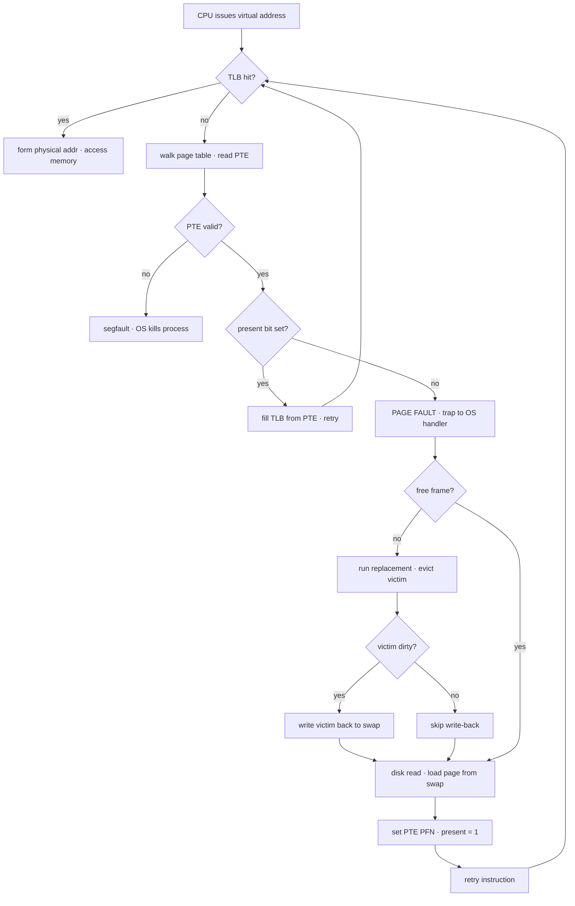
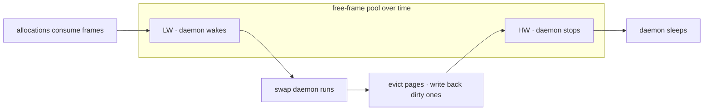

# Swapping: Mechanisms

**The crux:** every process wants a large, private, contiguous virtual address space, and the machine wants to run many such processes at once — but physical RAM is finite and usually far smaller than the sum of everyone's demands. How can the OS use a **larger, slower device** (a disk or SSD) to transparently provide the *illusion* of memory bigger than physical RAM, so a program can allocate and touch more than fits in DRAM without the programmer ever managing the movement by hand? The answer is **swapping**: keep hot pages in RAM, stash cold ones on disk, and shuttle pages back and forth on demand behind the process's back.

## The core idea

- **Add a level to the memory hierarchy.** Below RAM sits a big, slow device — **swap space** on disk. Cold pages live there; hot pages live in frames. The disk has more capacity than RAM (that is the whole point) and is far slower (if it were fast we would just use it as RAM).
- **Memory can pretend to be bigger than it is.** With `N` physical frames and a large swap area, the total virtual memory in use can exceed `N` frames. Each process sees its full address space; only a subset is resident at any instant.
- **Not every valid page is present.** A page-table entry (PTE) for a *valid* page may point to a frame (**present**) or to a disk block (**not present, swapped out**). Both are legal — "not present" is not an error.
- **Bring pages in on demand.** When a process touches a not-present page, the hardware traps to the OS; the **page-fault handler** fetches the page from disk into a frame and lets the instruction retry. This is **demand paging**.
- **Transparency.** All of this happens invisibly. The process just reads and writes its own contiguous virtual memory; behind the scenes pages sit in arbitrary frames or on disk.

## How it works

### The present bit in the PTE

Each PTE carries a **present bit** alongside the valid bit, protection bits, and the frame number:

- **present = 1** — the page is in physical memory; the PTE's PFN field holds the frame number. Translation proceeds normally.
- **present = 0** — the page is *not* in RAM. It has been swapped out. The OS repurposes PTE bits (often the same field that would hold a PFN) to remember the **disk address** in swap space.

So on a translation, the hardware (or the software TLB-miss handler) checks the present bit. Present means fetch and go; not-present means raise a **page fault** and hand control to the OS.

```c
// Conceptual PTE with a present bit. When present, `pfn` is a physical
// frame; when not present, `disk_addr` says where the page lives in swap.
typedef struct {
    unsigned valid   : 1;  // is this a legal page of the address space?
    unsigned present : 1;  // 1 = in a frame, 0 = swapped to disk
    unsigned dirty   : 1;  // 1 = modified since load (needs write-back)
    unsigned pfn     : 20; // physical frame number when present
    unsigned disk_addr;    // swap-space block when not present
} PTE;
```

### A page fault and the handler flow

A **page fault** is an access to a page whose present bit is 0. The hardware cannot service it (it does not know swap layout or how to drive the disk), so it raises an exception and the OS **page-fault handler** runs. The handler's job:

1. **Find the page on disk.** Read the swap address from the PTE (the OS stashed it there when the page was evicted).
2. **Find a frame.** Look for a free frame. If none is free, run the **page-replacement policy** to pick a **victim** and evict it (write it back first if dirty).
3. **Issue the I/O.** Start a disk read to pull the page from swap into the chosen frame. The faulting process **blocks** while the (slow) I/O is in flight, so the CPU can run other ready processes — overlapping I/O with useful work.
4. **Update the PTE.** When the read completes, set the PFN to the new frame and set **present = 1**.
5. **Retry the instruction.** Re-execute the faulting instruction. This time it likely misses the TLB, the TLB gets filled from the now-present PTE, and a final retry hits and completes the access.

Because faults to disk are so slow, the OS handling them in software adds negligible overhead — which is exactly why hardware designers are happy to delegate page faults to the OS.

### The TLB-miss plus page-fault control flow



### What if memory is full — eviction

The steps above quietly assumed a free frame exists. Often it does not. When RAM is full, the handler must first **page out** a victim to make room. Choosing the victim is the **page-replacement policy** — evict the wrong page and the program can run at disk speeds instead of RAM speeds (orders of magnitude slower). The *policies* (FIFO, LRU, Clock, Optimal) are the subject of the next topic; here we only need the **mechanism**: pick a victim, write it back if needed, reuse its frame.

### When replacement really happens — the swap daemon and watermarks

Waiting until memory is *entirely* full before evicting is a bad idea: a fault would then always stall behind an eviction. Instead the OS keeps a small pool of free frames proactively, governed by two thresholds:

- **Low watermark (LW).** When free frames drop below LW, wake a background thread — the **swap daemon** (a.k.a. **page daemon**, e.g. `kswapd` on Linux) — to start freeing memory.
- **High watermark (HW).** The daemon evicts pages until at least HW frames are free, then goes back to sleep.



Freeing many pages at once also enables **clustering**: batch several swap writes into one large sequential disk operation, cutting seek and rotational overhead. With a daemon, the fault handler no longer evicts inline — it checks for a free frame, and if none, signals the daemon and waits.

### The dirty bit — write back only what changed

Eviction does not always require a disk write. Each PTE has a **dirty bit** set by hardware whenever the page is written:

- **Dirty (modified) page** — the in-RAM copy differs from the swap/disk copy, so the victim **must be written back** before the frame is reused.
- **Clean page** — never modified since load (or backed by a read-only file/binary), so an identical copy already exists on disk. The frame is simply **dropped, no write needed** — the page can be re-read from its backing store later.

This is a big win: read-mostly workloads evict cleanly and cheaply. The must-know simulator below shows faults far outnumbering write-backs precisely because most victims are clean.

The cost of a memory access is no longer uniform. If the AMAT (average memory access time) blends a fast hit with a rare, catastrophic disk fault:

$$
\text{AMAT} = T_{\text{mem}} + P_{\text{fault}} \cdot T_{\text{disk}}
$$

Because $T_{\text{disk}}$ can be ~100000× $T_{\text{mem}}$, even a tiny fault probability $P_{\text{fault}}$ dominates — which is why good replacement policies matter so much.

## Must-know algorithms

### Page-fault handler simulator

A self-contained model of the mechanism: a page table with present bits, a fixed set of physical frames, and a swap area. Each access is a **hit** (present), or a **page fault** that reads the page from disk, **evicting a FIFO victim** when memory is full and **writing back only dirty victims**. The access stream deliberately touches more pages than there are frames, forcing swapping. It tracks faults, disk reads, and disk writes.

```c
// Page-fault handler simulator.
// A page table with present bits, a fixed set of physical frames, and a
// swap area. On each access we decide: hit (page present) or a page fault
// that pulls the page from disk, evicting a victim (FIFO) when memory is
// full and writing back only dirty victims.
#include <stdio.h>
#include <stdbool.h>

#define NUM_PAGES   8   // virtual pages in the address space
#define NUM_FRAMES  3   // physical frames (smaller than pages -> swapping)

// One page-table entry.
typedef struct {
    bool present;   // 1 = in a physical frame, 0 = on disk (swap)
    bool dirty;     // 1 = modified since load, must be written back
    int  pfn;       // physical frame number when present, else -1
} PTE;

// One physical frame: which VPN currently occupies it, -1 if free.
typedef struct {
    int vpn;
} Frame;

static PTE   ptable[NUM_PAGES];
static Frame frames[NUM_FRAMES];

// FIFO victim queue over occupied frames (front = oldest resident).
static int fifo[NUM_FRAMES];
static int fifo_len = 0;

// Counters we report at the end.
static long faults = 0;      // page faults (page not present)
static long disk_reads = 0;  // pages pulled in from swap
static long disk_writes = 0; // dirty victims written back to swap

static void init(void) {
    for (int v = 0; v < NUM_PAGES; v++) {
        ptable[v].present = false;
        ptable[v].dirty = false;
        ptable[v].pfn = -1;
    }
    for (int f = 0; f < NUM_FRAMES; f++) frames[f].vpn = -1;
}

// Return a free frame index, or -1 if all frames are occupied.
static int find_free_frame(void) {
    for (int f = 0; f < NUM_FRAMES; f++)
        if (frames[f].vpn == -1) return f;
    return -1;
}

// Evict the oldest resident (FIFO). Write back if dirty. Return its frame.
static int evict_victim(void) {
    int victim_vpn = fifo[0];
    for (int i = 1; i < fifo_len; i++) fifo[i - 1] = fifo[i];
    fifo_len--;

    PTE *p = &ptable[victim_vpn];
    int f = p->pfn;
    bool was_dirty = p->dirty;
    if (was_dirty) disk_writes++;   // only modified pages cost a write-back
    p->present = false;             // now lives only on disk
    p->dirty = false;
    p->pfn = -1;
    frames[f].vpn = -1;
    printf("    evict VPN %d from frame %d%s\n", victim_vpn, f,
           was_dirty ? " (dirty, write-back)" : " (clean, no write)");
    return f;
}

// Service one access to virtual page `vpn`. `write` marks the page dirty.
static void access(int vpn, bool write) {
    PTE *p = &ptable[vpn];
    printf("access VPN %d (%s): ", vpn, write ? "W" : "R");

    if (p->present) {                 // present bit set -> hit, no fault
        printf("hit in frame %d\n", p->pfn);
        if (write) p->dirty = true;
        return;
    }

    // Not present: page fault. The handler runs.
    faults++;
    printf("PAGE FAULT -> ");

    int f = find_free_frame();
    if (f == -1) f = evict_victim();  // memory full: page replacement

    disk_reads++;                     // issue the I/O to read from swap
    frames[f].vpn = vpn;              // install the page
    p->present = true;                // update PTE: present bit
    p->pfn = f;                       // update PTE: PFN
    p->dirty = write;                 // fresh load; write dirties it
    fifo[fifo_len++] = vpn;           // record for FIFO eviction order
    printf("loaded into frame %d\n", f);
    // (retry instruction happens here in real hardware/OS)
}

int main(void) {
    init();
    // An access stream that touches more pages than we have frames,
    // forcing eviction and swap traffic. Pairs are (vpn, is_write).
    int stream[][2] = {
        {0,0},{1,0},{2,1},   // fill all 3 frames (VPN 2 written -> dirty)
        {3,0},               // full -> evict VPN 0 (clean)
        {0,0},               // VPN 0 gone -> fault again, evict VPN 1
        {2,0},               // VPN 2 still resident -> hit
        {4,1},               // evict VPN 2 (DIRTY -> write-back), load 4
        {2,0},               // evict VPN 3 (clean), reload VPN 2
    };
    int n = sizeof(stream) / sizeof(stream[0]);
    for (int i = 0; i < n; i++) access(stream[i][0], stream[i][1]);

    printf("\n-- totals --\n");
    printf("faults      = %ld\n", faults);
    printf("disk reads  = %ld\n", disk_reads);
    printf("disk writes = %ld (only dirty victims)\n", disk_writes);
    return 0;
}
```

Output:

```text
access VPN 0 (R): PAGE FAULT -> loaded into frame 0
access VPN 1 (R): PAGE FAULT -> loaded into frame 1
access VPN 2 (W): PAGE FAULT -> loaded into frame 2
access VPN 3 (R): PAGE FAULT ->     evict VPN 0 from frame 0 (clean, no write)
loaded into frame 0
access VPN 0 (R): PAGE FAULT ->     evict VPN 1 from frame 1 (clean, no write)
loaded into frame 1
access VPN 2 (R): hit in frame 2
access VPN 4 (W): PAGE FAULT ->     evict VPN 2 from frame 2 (dirty, write-back)
loaded into frame 2
access VPN 2 (R): PAGE FAULT ->     evict VPN 3 from frame 0 (clean, no write)
loaded into frame 0

-- totals --
faults      = 7
disk reads  = 7
disk writes = 1 (only dirty victims)
```

Note the payoff of the dirty bit: **7 disk reads but only 1 disk write** — every clean victim is dropped for free, and only the single modified page (VPN 2) is paid back to swap.

## Interview questions

**1. What is swap space and why does it exist?**
Swap space is a region of disk (a dedicated partition or file) the OS reserves to hold pages evicted from RAM. It lets the system support total virtual memory larger than physical RAM: cold pages are stashed on disk so their frames can be reused for hot pages. It underpins the illusion of a large address space and enables multiprogramming when all processes' pages cannot fit in DRAM at once.

**2. What is the present bit and where does it live?**
A bit in each page-table entry. present = 1 means the page is in a physical frame (the PTE's PFN is valid); present = 0 means the page is valid but swapped to disk, and the OS stores its swap address in the PTE instead. On translation, the hardware/OS reads this bit to decide between a normal fetch and raising a page fault. It is distinct from the *valid* bit, which says whether the page is a legal part of the address space at all.

**3. Walk through the page-fault handling steps.**
(1) Hardware traps on an access to a not-present page and invokes the OS handler. (2) The handler reads the page's disk address from the PTE. (3) It finds a free frame, or runs replacement to evict a victim (writing it back if dirty). (4) It issues a disk read to load the page into the frame; the faulting process blocks while I/O runs. (5) On completion it updates the PTE's PFN and sets present = 1. (6) It retries the faulting instruction, which now succeeds (via a TLB refill).

**4. What is the difference between a minor and a major page fault?**
A **major (hard) fault** requires disk I/O — the page must be read from swap or a file backing store. A **minor (soft) fault** does not touch the disk: the page is already in RAM but the current process's PTE is not yet wired to it — e.g. a page in the free-page cache, a copy-on-write page, or a shared page another process already loaded. The OS just fixes up the PTE. Minor faults are cheap (microseconds); major faults are catastrophic by comparison (milliseconds).

**5. What triggers page replacement — how does the OS decide when to evict?**
Replacement runs when the free-frame pool gets low, not only when memory is 100% full. Most OSes use two watermarks: when free frames fall below the **low watermark**, a background **swap/page daemon** wakes and evicts until at least the **high watermark** of free frames exists, then sleeps. Evicting proactively (and in batches, for I/O clustering) keeps fault handling off the critical path.

**6. Why does the dirty bit avoid unnecessary writes?**
The dirty bit records whether a resident page was modified since it was loaded. If a victim is clean, an identical copy already exists on its backing store (swap block, or the executable/file it came from), so the OS can drop it with **no write-back** and later re-read it. Only dirty victims must be written to swap. This turns many evictions into free operations and roughly halves swap traffic for read-heavy workloads.

**7. What is thrashing, and why does it motivate the replacement policies studied next?**
Thrashing is when the working sets of active processes exceed physical RAM, so almost every access faults: the system spends nearly all its time swapping pages in and out and makes little forward progress, running at disk speed. It motivates two things: (a) smart **replacement policies** (LRU/Clock/Optimal) that evict the *right* victim to minimize faults, and (b) admission control / working-set schemes that reduce the degree of multiprogramming so the resident sets fit. The mechanism here is neutral; the policy is what averts thrashing.

**8. Why does the hardware delegate page-fault handling to the OS instead of doing it itself?**
Two reasons. Performance: a disk fault is so slow that the extra cost of running OS software to handle it is negligible. Simplicity: handling a fault requires knowing swap-space layout, how to issue disk I/O, and replacement bookkeeping — details the hardware has no reason to embed. So the hardware just raises an exception and trusts the OS, even on hardware-managed-TLB systems.

## Coding problems

- 🎯 **LRU Cache** — [leetcode.com/problems/lru-cache](https://leetcode.com/problems/lru-cache/) — *what it tests:* design a fixed-capacity cache with O(1) get/put that evicts the least-recently-used entry — the exact data structure (hash map + doubly linked list) behind an LRU page-replacement policy and cache eviction generally.
- 🎯 **LFU Cache** — [leetcode.com/problems/lfu-cache](https://leetcode.com/problems/lfu-cache/) — *what it tests:* fixed-capacity cache evicting the least-frequently-used entry (ties broken by recency) in O(1); a frequency-aware alternative eviction policy.
- 🏗 **Page-fault handler with a victim frame and swap** — implement the mechanism above: given a page table with present/dirty bits, a fixed frame set, and a swap area, service an access stream — hit, or fault-in with victim eviction (write back only if dirty) — and count faults, reads, and writes. *What it tests:* the full demand-paging control flow and the dirty-bit optimization. A complete C reference is in the Must-know algorithms section.

## Key takeaways

- **Swap space** on a big, slow disk lets the OS pretend memory is larger than physical RAM; hot pages stay in frames, cold pages live on disk.
- The **present bit** in each PTE distinguishes in-memory pages from swapped-out ones; not-present is legal, not an error.
- A **page fault** traps to the OS **page-fault handler**, which finds the page on disk, finds or evicts a frame, issues the I/O, updates the PTE (PFN + present), and retries the instruction.
- **When memory is full**, replacement picks a victim; the *policy* (next topic) decides which page, the *mechanism* just reuses the frame.
- The **swap/page daemon** evicts proactively between a **low and high watermark**, keeping a free-frame pool and enabling batched (clustered) writes.
- The **dirty bit** means clean victims are dropped for free; only modified pages are written back — a large saving on read-heavy workloads.
- Faults to disk are ~100000× a RAM access, so replacement quality is decisive and **thrashing** must be avoided.

## Source(s) and further reading

- [OSTEP: Beyond Physical Memory — Mechanisms (free PDF)](https://pages.cs.wisc.edu/~remzi/OSTEP/vm-beyondphys.pdf) — the backbone chapter: swap space, present bit, page-fault control flow, watermarks, dirty bit.
- [OSTEP: Paging — Introduction (free PDF)](https://pages.cs.wisc.edu/~remzi/OSTEP/vm-paging.pdf) — PTEs, valid/present bits, and the page-table walk this builds on.
- [OSTEP: TLBs (free PDF)](https://pages.cs.wisc.edu/~remzi/OSTEP/vm-tlbs.pdf) — the TLB-miss path that precedes the page fault in the control flow.
- [Wikipedia: Paging](https://en.wikipedia.org/wiki/Paging) — swap space, demand paging, and the page-out mechanism.
- [Wikipedia: Page fault](https://en.wikipedia.org/wiki/Page_fault) — minor vs. major (hard) vs. invalid faults and handling.
- [Wikipedia: Memory paging](https://en.wikipedia.org/wiki/Memory_paging) — thrashing, swap files/partitions, and page-replacement context.
- [man mmap(2)](https://man7.org/linux/man-pages/man2/mmap.2.html) — how file-backed and anonymous mappings become demand-paged memory in practice.
