# Translation Lookaside Buffers (TLB)

**The crux:** paging turns every single memory reference into *two* memory references — one to read the page-table entry that maps the virtual page, and one to actually touch the data. Doing a page-table walk on every load and store would make programs run at a fraction of their speed. The **Translation Lookaside Buffer (TLB)** solves this: it is a small, fast **hardware cache of recent virtual-to-physical translations**, sitting inside the Memory Management Unit (MMU). When a translation is cached, the address translation costs almost nothing; only on a miss do we pay for a page-table walk.

## The core idea

- **A TLB is a cache, not a buffer.** Despite the historical name, it is an address-translation cache: it stores a handful of recent VPN-to-PFN mappings plus permission and status bits.
- **It lives in the MMU, on the fast path of every memory access.** Every load, store, and instruction fetch produces a virtual address; the hardware consults the TLB before ever going to the page table.
- **VPN in, PFN out.** A virtual address splits into a **virtual page number (VPN)** and a page **offset**. The TLB maps the VPN to a **physical frame number (PFN)**; the offset is copied through unchanged.
- **It is fully/set-associative and tiny.** A typical TLB holds tens to a few thousand entries. Because it is small, each entry is a *tag* (the VPN) plus the translation, and lookups compare against many entries in parallel.
- **It works because of locality.** Programs reuse the same few pages over and over in short windows of time, so a small cache catches the vast majority of translations.

## How it works

### The control flow

On every memory reference the MMU does the following:

- **Extract the VPN** from the virtual address by shifting off the offset bits.
- **Probe the TLB** for that VPN.
- **TLB hit** (the common, fast case): read the PFN from the matching entry, check the protection bits, form the physical address as `PFN * PAGESIZE + offset`, and proceed. No page table is touched.
- **TLB miss** (the rare, slow case): walk the page table in memory to find the translation, **insert** it into the TLB (evicting a victim if full), and **retry** the same instruction — which now hits.

```mermaid
flowchart TD
    A["memory reference @ virtual address"] --> B["extract VPN = vaddr &#62;&#62; offset_bits"]
    B --> C{"VPN in TLB?"}
    C -- "hit" --> D["read PFN + perms from TLB entry"]
    D --> E{"protection OK?"}
    E -- "yes" --> F["paddr = PFN * PAGESIZE + offset; access memory"]
    E -- "no" --> G["raise protection fault"]
    C -- "miss" --> H["walk page table in memory"]
    H --> I{"PTE valid + accessible?"}
    I -- "no" --> J["page fault / fault to OS"]
    I -- "yes" --> K["insert VPN -&#62; PFN into TLB (evict LRU/random)"]
    K --> L["retry the instruction"]
    L --> B
```



The key asymmetry: a **hit** costs a few gates of comparison (effectively free relative to a memory access), while a **miss** costs a full page-table walk — one memory access per page-table level, so two, three, or four extra memory references on modern multi-level tables.

### Why locality makes it work

The TLB is only tiny, yet it hits almost all the time. Two forms of locality explain this:

- **Spatial locality.** Access one byte on a page and you will very likely access nearby bytes on the *same* page soon. With a 4 KiB page holding `P` integers, a sequential scan touches `P` elements per page. The first touch of a page misses (cold), the next `P - 1` touches hit — so a linear array walk approaches a hit rate of

  $$ \text{hit rate} = \frac{P - 1}{P}, \qquad P = \frac{\text{page size}}{\text{element size}}. $$

  For 4 KiB pages and 4-byte ints, `P = 1024`, giving a hit rate of `1023/1024 ≈ 0.999`.

- **Temporal locality.** A recently used translation is likely to be used again soon (loop bodies, hot data structures). Because the TLB keeps *recent* entries, these repeat accesses hit even across pages.

### Effective access time (AMAT)

The average cost of a translated memory access is the hit cost plus the expected miss surcharge:

$$ \text{AMAT} = t_{\text{hit}} + (1 - h)\,\cdot\, t_{\text{miss}} $$

where `h` is the TLB hit rate, `t_hit` is the cost when the translation is cached, and `t_miss` is the *extra* cost of the page-table walk on a miss. Because `t_miss` is large, even a small drop in `h` hurts:

| hit rate `h` | AMAT (with $t_{\text{hit}} = 1$ ns, $t_{\text{miss}} = 100$ ns) |
| --- | --- |
| $0.90$ | $1 + 0.10 \cdot 100 = 11$ ns |
| $0.99$ | $1 + 0.01 \cdot 100 = 2$ ns |
| $0.999$ | $1 + 0.001 \cdot 100 = 1.1$ ns |

Going from 99% to 99.9% roughly halves the effective access time — the TLB earns its keep at the tail.

### Who handles a miss: hardware vs software

- **Hardware-managed TLB.** The MMU knows the page-table format (e.g., x86 with its hardware page-table walker). On a miss the hardware walks the table and refills the TLB itself; the OS is not involved unless the walk faults. Fast, but the page-table layout is baked into the chip.
- **Software-managed TLB.** On a miss the hardware simply **traps to the OS** (e.g., MIPS, SPARC v9). A software handler looks up the translation in whatever data structure the OS chooses and installs it with a privileged instruction, then returns to retry. This gives the OS full freedom over page-table structure at the cost of a trap per miss. The handler must be careful not to cause a TLB miss on itself (its own code/data live in unmapped or wired entries).

### TLB reach

**TLB reach** is the total amount of memory the TLB can map at once:

$$ \text{reach} = (\text{number of entries}) \times (\text{page size}). $$

A 64-entry TLB over 4 KiB pages reaches only `64 * 4 KiB = 256 KiB` — tiny next to a working set of hundreds of megabytes. Two levers grow reach:

- **More entries** — expensive in silicon and lookup latency.
- **Bigger pages (huge pages).** A 64-entry TLB over 2 MiB pages reaches `64 * 2 MiB = 128 MiB` — a 512x jump for the same entry count. This is why databases and JVMs use huge pages: fewer, larger pages mean fewer distinct translations and far higher TLB hit rates for large heaps.

### The context-switch problem

TLB entries are **per-process**: process A's VPN 5 and process B's VPN 5 map to entirely different frames. When the OS switches from A to B, the stale entries from A are not just useless — they are *wrong* for B. There are two standard fixes:

- **Flush on switch.** Invalidate the entire TLB on every context switch (on x86, this happens implicitly when the page-table base register `CR3` is reloaded). Simple and safe, but the incoming process starts cold and suffers a burst of misses to re-warm the TLB.
- **Address-space identifiers (ASIDs).** Tag each TLB entry with a small ID for its owning address space. The TLB matches on `(ASID, VPN)`, so A's and B's entries coexist without collision and *no flush is needed* on a switch. The OS assigns ASIDs to processes; when they run out, it recycles them (and flushes the affected entries). x86 calls this a **PCID (process-context identifier)**.

```mermaid
flowchart LR
    subgraph FLUSH["flush-on-switch"]
      F1["switch A -&#62; B"] --> F2["invalidate whole TLB"] --> F3["B refills cold"]
    end
    subgraph ASID["ASID / PCID tagged"]
      G1["entries tagged (ASID, VPN)"] --> G2["A and B coexist"] --> G3["switch A -&#62; B: no flush"]
    end
```



### Replacement policy

When a miss must insert into a full TLB set, hardware picks a victim:

- **LRU (least recently used).** Evict the entry unused for the longest time. Great for temporal locality, but true LRU is costly to track in hardware, so real TLBs approximate it.
- **Random.** Evict a random entry. Cheap, and it avoids the pathological case where LRU thrashes — e.g., looping over `n + 1` pages through an `n`-entry TLB evicts exactly the page you need next every time, giving a 0% hit rate. Random degrades gracefully there.

## Must-know algorithms

### A set-associative TLB simulator (C)

A small set-associative TLB with LRU replacement, driven by a sequential array scan. It reports the hit rate and checks it against the expected `(P - 1) / P` for `P` elements per page.

```c
/* Set-associative TLB simulator with LRU replacement.
 * Streams virtual page numbers (VPNs) and reports the hit rate.
 * A sequential array scan touches P integers per page; after the first
 * (cold) access to a page, the next P-1 accesses hit, giving hit rate (P-1)/P. */
#include <stdio.h>
#include <stdint.h>
#include <string.h>

#define NSETS   16      /* number of sets */
#define WAYS    4       /* associativity (entries per set) */

typedef struct {
    int      valid;
    uint64_t vpn;       /* tag: the full virtual page number */
    uint64_t lru;       /* recency stamp; larger == more recent */
} Entry;

static Entry tlb[NSETS][WAYS];
static uint64_t clock_ = 0;

static void tlb_reset(void) {
    memset(tlb, 0, sizeof(tlb));
    clock_ = 0;
}

/* Look up a VPN. Returns 1 on hit, 0 on miss; on miss, insert (evicting LRU). */
static int tlb_access(uint64_t vpn) {
    uint64_t set = vpn % NSETS;
    Entry *s = tlb[set];
    clock_++;

    for (int w = 0; w < WAYS; w++) {
        if (s[w].valid && s[w].vpn == vpn) {
            s[w].lru = clock_;          /* touch: mark most-recently used */
            return 1;                   /* HIT */
        }
    }
    /* MISS: pick a victim -- an invalid slot, else the smallest lru stamp. */
    int victim = 0;
    for (int w = 0; w < WAYS; w++) {
        if (!s[w].valid) { victim = w; break; }
        if (s[w].lru < s[victim].lru) victim = w;
    }
    s[victim].valid = 1;
    s[victim].vpn   = vpn;
    s[victim].lru   = clock_;
    return 0;
}

int main(void) {
    const uint64_t PAGE = 4096;                 /* 4 KiB pages */
    const uint64_t P    = PAGE / sizeof(int);   /* 1024 ints per page */
    const uint64_t N    = 64 * P;               /* scan 64 pages worth of ints */

    tlb_reset();
    uint64_t hits = 0, refs = 0;
    for (uint64_t i = 0; i < N; i++) {
        uint64_t addr = i * sizeof(int);        /* byte address of a[i] */
        uint64_t vpn  = addr / PAGE;            /* extract VPN */
        hits += tlb_access(vpn);
        refs++;
    }

    double rate = (double)hits / (double)refs;
    double expected = (double)(P - 1) / (double)P;
    printf("refs=%llu hits=%llu miss=%llu\n",
           (unsigned long long)refs, (unsigned long long)hits,
           (unsigned long long)(refs - hits));
    printf("hit rate    = %.6f\n", rate);
    printf("(P-1)/P     = %.6f  (P=%llu ints/page)\n",
           expected, (unsigned long long)P);
    return 0;
}
```

Running it prints:

```text
refs=65536 hits=65472 miss=64
hit rate    = 0.999023
(P-1)/P     = 0.999023  (P=1024 ints/page)
```

Exactly 64 misses — one cold miss per page over 64 pages — and the measured hit rate matches `(P - 1) / P = 1023/1024` to the digit. Notice the LRU machinery never fires here because a sequential scan never revisits an old page; LRU only matters once the access stream reuses pages beyond the TLB's capacity.

### Effective access time from a hit rate (C)

The AMAT formula turned into a tiny program, sweeping a few hit rates:

```c
/* Effective access time with a TLB.
 * AMAT = t_hit + (1 - h) * miss_penalty
 * where h is the TLB hit rate, t_hit the cost of a TLB hit (fast path),
 * and miss_penalty the extra cost of a page-table walk on a miss. */
#include <stdio.h>

static double amat(double t_hit, double h, double miss_penalty) {
    return t_hit + (1.0 - h) * miss_penalty;
}

int main(void) {
    double t_hit        = 1.0;    /* 1 ns: TLB hit + cache-resident data */
    double miss_penalty = 100.0;  /* 100 ns: multi-level page-table walk */

    double rates[] = { 0.90, 0.99, 0.999 };
    for (int i = 0; i < 3; i++) {
        double h = rates[i];
        printf("h=%.3f  AMAT = %.3f ns\n", h, amat(t_hit, h, miss_penalty));
    }
    return 0;
}
```

Output:

```text
h=0.900  AMAT = 11.000 ns
h=0.990  AMAT = 2.000 ns
h=0.999  AMAT = 1.100 ns
```

## Interview questions

**1. What is a TLB and why does it exist?**
A TLB is a small, fast hardware cache inside the MMU that stores recent virtual-to-physical page translations. It exists because paging otherwise turns each memory reference into two — one to read the page-table entry and one for the data. By caching the translation, the common case avoids the page-table walk entirely, so paged memory runs at near hardware speed.

**2. Walk through the TLB hit/miss control flow.**
Extract the VPN from the virtual address and probe the TLB. On a **hit**, read the PFN and permission bits from the entry, check protection, form the physical address as `PFN * PAGESIZE + offset`, and access memory. On a **miss**, walk the page table in memory, install the resulting translation into the TLB (evicting a victim if the set is full), and re-execute the instruction, which now hits.

**3. Why does spatial locality drive the hit rate?**
Because data on the same page is accessed together. A single 4 KiB page holds many elements (e.g., 1024 ints). Touching the first element misses and installs the translation; every subsequent access on that page hits. For a sequential scan the hit rate approaches `(P - 1) / P` where `P` is elements per page — so ~99.9% for 4 KiB pages of 4-byte ints. One translation amortizes over the whole page.

**4. Hardware-managed vs software-managed TLB miss — what's the difference?**
With a **hardware-managed** TLB the MMU knows the page-table format and walks it and refills the TLB itself (x86). With a **software-managed** TLB the miss **traps to the OS**, and a software handler looks up the translation in an OS-defined structure and installs it before retrying (MIPS, SPARC). Software gives the OS freedom over page-table layout at the cost of a trap per miss; the handler must avoid taking a TLB miss on itself.

**5. What happens to the TLB on a context switch, and how is it handled?**
TLB entries are per-process, so after a switch the old entries are stale and would translate the new process's addresses incorrectly. Two fixes: **flush** the whole TLB on every switch (simple; incoming process runs cold), or tag entries with an **ASID/PCID** so multiple address spaces coexist and no flush is needed — the TLB matches on `(ASID, VPN)`. ASIDs are recycled (with a flush) when they run out.

**6. What is TLB reach, and how do huge pages help?**
TLB reach is `entries * page_size` — the total memory mappable without a miss. It is often far smaller than the working set (64 entries × 4 KiB = 256 KiB). **Huge pages** (2 MiB, 1 GiB) multiply reach for the same entry count (64 × 2 MiB = 128 MiB), because a large heap now needs far fewer distinct translations. That is why databases and JVMs enable huge pages for big memory footprints.

**7. Compute AMAT given a hit rate and a miss cost.**
`AMAT = t_hit + (1 - h) * t_miss`. With `t_hit = 1 ns`, `t_miss = 100 ns`, and `h = 0.99`: `AMAT = 1 + 0.01 * 100 = 2 ns`. At `h = 0.999` it drops to `1.1 ns`. The large miss penalty means the last fraction of a percent in hit rate dominates effective latency.

**8. Why might a TLB use random replacement instead of LRU?**
True LRU is expensive to track in hardware, and it has a pathological case: looping over `n + 1` pages through an `n`-entry TLB makes LRU evict exactly the page needed next every iteration, yielding a 0% hit rate. **Random** replacement is cheap and degrades gracefully in that adversarial loop, so many real TLBs use random or an LRU approximation.

**9. Can a TLB hit still lead to a fault?**
Yes. A hit gives the PFN and the permission bits. If the access violates those bits — writing a read-only page, or user-mode touching a kernel page — the hardware raises a **protection fault** even though the translation was cached. The TLB accelerates translation; it does not bypass permission checks.

## Coding problems

- 🎯 **LRU Cache** — [LeetCode 146](https://leetcode.com/problems/lru-cache/). Implements exactly the TLB's own replacement policy in `O(1)` get/put using a hash map plus a doubly linked list. What it tests: the recency-ordered eviction data structure behind a cache.
- 🎯 **LFU Cache** — [LeetCode 460](https://leetcode.com/problems/lfu-cache/). Evict the least-frequently used entry (ties broken by recency). What it tests: frequency buckets with `O(1)` updates — an alternative eviction policy to LRU.
- 🏗 **Set-associative TLB with LRU** — implement the simulator above: sets indexed by VPN, `WAYS` entries per set, LRU victim selection, and verify the sequential-scan hit rate equals `(P - 1) / P`. What it tests: modeling cache associativity and replacement, and reasoning about locality-driven hit rates. (OS-classic; build from the OSTEP TLB chapter's array-access example.)

## Key takeaways

- A TLB is a **hardware cache of virtual-to-physical translations** in the MMU, turning the two-memory-reference cost of paging back into roughly one.
- The control flow is **hit fast / miss slow**: extract VPN, probe TLB; hit forms the physical address directly, miss walks the page table, installs the entry, and retries.
- **Spatial and temporal locality** are why a tiny TLB hits almost always; a sequential scan approaches `(P - 1) / P`.
- **AMAT** = `t_hit + (1 - h) * t_miss`; with a big miss penalty the tail of the hit rate dominates latency.
- The **context-switch problem** (per-process entries) is solved by **flushing** or by **ASID/PCID** tagging; **huge pages** extend **TLB reach**.
- Replacement is **LRU (approximated)** or **random**; random avoids LRU's worst-case loop.

## Source(s) and further reading

- [OSTEP — Paging: Faster Translations (TLBs)](https://pages.cs.wisc.edu/~remzi/OSTEP/vm-tlbs.pdf) — the free chapter this page is grounded in (control flow, locality/array example, ASIDs, replacement).
- [Translation lookaside buffer — Wikipedia](https://en.wikipedia.org/wiki/Translation_lookaside_buffer) — organization, ASIDs, hardware vs software miss handling.
- [CPU cache — Wikipedia](https://en.wikipedia.org/wiki/CPU_cache) — associativity, tags, and replacement, of which the TLB is a specialized instance.
- [Locality of reference — Wikipedia](https://en.wikipedia.org/wiki/Locality_of_reference) — spatial and temporal locality, the reason caches and TLBs work.
- [Cache replacement policies — Wikipedia](https://en.wikipedia.org/wiki/Cache_replacement_policies) — LRU, LFU, random, and their trade-offs.
